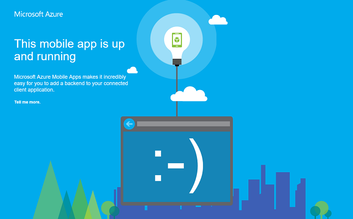

<properties
    pageTitle="Como trabalhar com o servidor de back-end do .NET SDK para aplicativos móvel | Serviço de aplicativo do Azure"
    description="Aprenda a trabalhar com o servidor de back-end do .NET SDK para aplicativos do Azure aplicativo de serviço móvel."
    keywords="serviço de aplicativo, serviço de aplicativo do azure, aplicativo móvel, serviço móvel, escala, escaláveis, aplicativo implantação, azure aplicativo implantação"
    services="app-service\mobile"
    documentationCenter=""
    authors="adrianhall"
    manager="erikre"
    editor=""/>

<tags
    ms.service="app-service-mobile"
    ms.workload="mobile"
    ms.tgt_pltfrm="mobile-multiple"
    ms.devlang="dotnet"
    ms.topic="article"
    ms.date="10/01/2016"
    ms.author="adrianha"/>

# Trabalhar com o servidor de back-end do .NET SDK para aplicativos do Azure móvel

[AZURE.INCLUDE [app-service-mobile-selector-server-sdk](../../includes/app-service-mobile-selector-server-sdk.md)]

Este tópico mostra como usar o servidor de back-end do .NET SDK em principais cenários de aplicativos do Azure aplicativo serviço Mobile. O SDK de aplicativos do Azure Mobile ajuda você a trabalhar com os clientes móveis do seu aplicativo ASP.NET.

>[AZURE.TIP] O [.NET server SDK para aplicativos do Azure móvel] [ 2] é abrir fonte no GitHub. O repositório contém todo o código fonte incluindo o pacote de teste de unidade do servidor inteiro SDK e alguns projetos de amostra.

## Documentação de referência

A documentação de referência para o servidor SDK está localizada aqui: [Referência de .NET de aplicativos do Azure Mobile][1].

## Como: criar um back-end do aplicativo do .NET Mobile

Se você estiver iniciando um novo projeto, você pode criar um aplicativo de serviço de aplicativo usando o [portal do Azure] ou Visual Studio. Você pode executar o aplicativo de serviço de aplicativo localmente ou publicar o projeto para o seu aplicativo móvel aplicativo serviço baseado em nuvem.  

Se você estiver adicionando recursos móveis a um projeto existente, consulte a seção [baixar e inicializar o SDK](#install-sdk) .

### Criar um back-end .NET usando o portal do Azure

Para criar um aplicativo de serviço de móvel back-end, seja siga o [tutorial de início rápido] [ 3] ou siga estas etapas:

[AZURE.INCLUDE [app-service-mobile-dotnet-backend-create-new-service-classic](../../includes/app-service-mobile-dotnet-backend-create-new-service-classic.md)]

De volta ao blade _Introdução_ , em **criar uma tabela API**, escolha **c#** como seu **idioma de back-end**. Clique em **Download**, extrair os arquivos de projeto compactado para seu computador local e abra a solução no Visual Studio.

### Criar um back-end .NET usando o Visual Studio 2013 e Visual Studio de 2015

Instalar o [SDK do Azure para .NET] [ 4] (versão 2.9.0 ou posterior) para criar um projeto de aplicativos do Azure Mobile no Visual Studio. Depois que você instalou o SDK, crie um aplicativo ASP.NET usando as seguintes etapas:

1. Abrir a caixa de diálogo **Novo projeto** (do *arquivo* > **novo** > **projeto...**).
2. Expanda **modelos** > **Visual c#**e selecione **Web**.
3. Selecione o **aplicativo Web do ASP.NET**.
4. Preencha o nome do projeto. Clique em **Okey**.
5. Em _ASP.NET 4.5.2 modelos_, selecione o **Aplicativo do Azure Mobile**. Verificar **Host na nuvem** para criar um back-end móvel na nuvem para o qual você pode publicar deste projeto.
6. Clique em **Okey**.

## Como: baixar e inicializar o SDK

O SDK está disponível em [NuGet.org]. Este pacote inclui a funcionalidade de base necessária para começar a usar o SDK. Para inicializar o SDK, você precisará executar ações no objeto **HttpConfiguration** .

### Instalar o SDK

Para instalar o SDK, clique com botão direito no projeto server no Visual Studio, selecione **Gerenciar pacotes NuGet**, procurar o pacote de [Microsoft.Azure.Mobile.Server] e clique em **instalar**.

###Inicializar o project server

Um projeto de servidor de back-end do .NET é inicializado semelhante a outros projetos ASP.NET, incluindo uma classe de inicialização OWIN. Certifique-se de que você deve ter referenciado o pacote NuGet `Microsoft.Owin.Host.SystemWeb`. Para adicionar esta classe no Visual Studio, clique com botão direito no seu projeto de servidor e selecione **Adicionar** > 
**Novo Item**, em seguida, **Web** > **Geral** > **classe OWIN inicialização**.  Uma classe é gerada com o atributo a seguir:

    [assembly: OwinStartup(typeof(YourServiceName.YourStartupClassName))]

No `Configuration()` método de sua classe de inicialização OWIN, use um objeto de **HttpConfiguration** para configurar o ambiente de aplicativos do Azure Mobile.
O exemplo a seguir inicializa o projeto de servidor com nenhum recursos adicionais:

    // in OWIN startup class
    public void Configuration(IAppBuilder app)
    {
        HttpConfiguration config = new HttpConfiguration();

        new MobileAppConfiguration()
            // no added features
            .ApplyTo(config);

        app.UseWebApi(config);
    }

Para habilitar recursos individuais, você deve chamar métodos de extensão no objeto **MobileAppConfiguration** antes de chamar **Aplicar para**. Por exemplo, o código a seguir adiciona as rotas padrão para todos os controladores de API que tenham o atributo `[MobileAppController]` durante a inicialização:

    new MobileAppConfiguration()
        .MapApiControllers()
        .ApplyTo(config);

O início rápido de servidor do portal do Azure chama **UseDefaultConfiguration()**. Este equivalente para a seguinte configuração:

        new MobileAppConfiguration()
            .AddMobileAppHomeController()             // from the Home package
            .MapApiControllers()
            .AddTables(                               // from the Tables package
                new MobileAppTableConfiguration()
                    .MapTableControllers()
                    .AddEntityFramework()             // from the Entity package
                )
            .AddPushNotifications()                   // from the Notifications package
            .MapLegacyCrossDomainController()         // from the CrossDomain package
            .ApplyTo(config);

Os métodos de extensão usados são:

* `AddMobileAppHomeController()`fornece a home page de aplicativos do Azure Mobile padrão.
* `MapApiControllers()`fornece recursos personalizados de API para controladores de WebAPI decorada com o `[MobileAppController]` atributo.
* `AddTables()`Fornece um mapeamento do `/tables` pontos de extremidade para controladores de tabela.
* `AddTablesWithEntityFramework()`é uma mão de curta para mapeamento a `/tables` pontos de extremidade usando estrutura de entidade com base em controladores.
* `AddPushNotifications()`Fornece um método simples de registro de dispositivos para Hubs de notificação.
* `MapLegacyCrossDomainController()`Fornece cabeçalhos CORS padrão para desenvolvimento local.

### Extensões SDK

Os pacotes de extensão baseado em NuGet a seguir fornecem diversos recursos móveis que podem ser usados pelo seu aplicativo. Habilitar extensões durante a inicialização usando o objeto **MobileAppConfiguration** .

- [Microsoft.Azure.Mobile.Server.Quickstart] é compatível com a configuração de aplicativos Mobile básico. Adicionado à configuração chamando o método de extensão **UseDefaultConfiguration** durante a inicialização. Essa extensão inclui os seguintes extensões: notificações, autenticação, entidade, tabelas, entre domínios e pacotes de Home. Este pacote é usado pelo início rápido aplicativos de Mobile disponíveis no portal do Azure.

- [Microsoft.Azure.Mobile.Server.Home](http://www.nuget.org/packages/Microsoft.Azure.Mobile.Server.Home/) 
   implementa padrão *Este aplicativo móvel está em execução página* para raiz do site. Adicione à configuração chamando o método de extensão   **AddMobileAppHomeController** .

- [Microsoft.Azure.Mobile.Server.Tables](http://www.nuget.org/packages/Microsoft.Azure.Mobile.Server.Tables/) 
   conjuntos-up o pipeline de dados e inclui classes para trabalhar com dados. Adicione à configuração chamando o método de extensão **AddTables** .

- [Microsoft.Azure.Mobile.Server.Entity](http://www.nuget.org/packages/Microsoft.Azure.Mobile.Server.Entity/) 
   habilita a estrutura de entidade para acessar dados do banco de dados do SQL. Adicione à configuração chamando o método de extensão **AddTablesWithEntityFramework** .

- [Microsoft.Azure.Mobile.Server.Authentication] permite a autenticação e conjuntos-up a middleware OWIN usado para validar tokens. Adicionar à configuração chamando a **AddAppServiceAuthentication**  
   e **IAppBuilder**. Métodos de extensão **UseAppServiceAuthentication** .

- [Microsoft.Azure.Mobile.Server.Notifications] permite que notificações por push e define um ponto de extremidade do registro de envio. Adicione à configuração chamando o método de extensão **AddPushNotifications** .

- [Microsoft.Azure.Mobile.Server.CrossDomain](http://www.nuget.org/packages/Microsoft.Azure.Mobile.Server.CrossDomain/) 
   cria um controlador que serve dados para navegadores da web herdados de seu aplicativo de celular. Adicione à configuração chamando o método de extensão   **MapLegacyCrossDomainController** .

- [Microsoft.Azure.Mobile.Server.Login] fornece o método AppServiceLoginHandler.CreateToken(), que é um método estático usado durante cenários de autenticação personalizada.   

## Como: publicar o projeto de servidor

Esta seção mostra como publicar seu projeto de back-end do .NET do Visual Studio. Você também pode implantar o projeto de back-end usando gito ou qualquer um dos outros métodos abordados na [documentação de implantação do serviço de aplicativo do Azure](../app-service-web/web-sites-deploy.md).

1. No Visual Studio, recrie o projeto para restaurar pacotes do NuGet.

2. No Solution Explorer, clique com botão direito no projeto, clique em **Publicar**. Na primeira vez que você publica, você precisa definir um perfil de publicação. Quando você já tem um perfil definido, você poderá selecioná-la e clique em **Publicar**.

2. Se for solicitado a selecionar um destino de publicação, clique em **Serviço de aplicativo do Microsoft Azure** > **próximo**, e em seguida, (se necessário) entrar com suas credenciais do Azure. 
   Visual Studio downloads e armazena de forma segura suas configurações diretamente do Azure de publicação.

    

3. Escolha sua **assinatura**, selecione o **Tipo de recurso** do **modo de exibição**, expanda o **Aplicativo móvel**e sua back-end do aplicativo móvel, clique **Okey**.

    

4. Verifique se as informações de perfil de publicação e clique em **Publicar**.

    

    Quando seu back-end do aplicativo Mobile publicou com êxito, você verá uma página de aterrissagem indicando sucesso.

    

##Como: definir um controlador de tabela

Defina um controlador de tabela para expor uma tabela do SQL para clientes móveis.  Configurar um controlador de tabela requer três etapas:

1. Crie uma classe de objeto de transferência de dados (DTO).
2. Configure uma referência de tabela na classe DbContext Mobile.
3. Crie um controlador de tabela.

Um objeto de transferência de dados (DTO) é um objeto c# simples que herda `EntityData`.  Por exemplo:

    public class TodoItem : EntityData
    {
        public string Text { get; set; }
        public bool Complete {get; set;}
    }

O DTO é usado para definir a tabela no banco de dados SQL.  Para criar a entrada de banco de dados, adicione uma `DbSet<>` propriedade para o DbContext que você está usando.  No modelo de projeto padrão para aplicativos do Azure móvel, o DbContext é chamado `Models\MobileServiceContext.cs`:

    public class MobileServiceContext : DbContext
    {
        private const string connectionStringName = "Name=MS_TableConnectionString";

        public MobileServiceContext() : base(connectionStringName)
        {

        }

        public DbSet<TodoItem> TodoItems { get; set; }

        protected override void OnModelCreating(DbModelBuilder modelBuilder)
        {
            modelBuilder.Conventions.Add(
                new AttributeToColumnAnnotationConvention<TableColumnAttribute, string>(
                    "ServiceColumnTable", (property, attributes) => attributes.Single().ColumnType.ToString()));
        }
    }

Se você tiver instalado o SDK do Azure, agora você pode criar um controlador de tabela modelo da seguinte maneira:

1. Clique com botão direito na pasta controladores e selecione **Adicionar** > **controlador...**.
2. Selecione a opção de **Controlador de tabela de aplicativos do Azure Mobile** e, em seguida, clique em **Adicionar**.
3. Na caixa de diálogo **Adicionar controlador** :
    * Na lista suspensa de **classe do modelo** , selecione seu novo DTO.
    * Na lista suspensa **DbContext** , selecione a classe DbContext de serviço móvel.
    * O nome do controlador é criado.
4. Clique em **Adicionar**.

O projeto de servidor de início rápido contém um exemplo de uma simples **TodoItemController**.

### Como: ajustar o tamanho de paginação da tabela

Por padrão, os aplicativos do Azure Mobile retorna 50 registros por solicitação.  Paginação garante que o cliente não obstruir seu thread de interface do usuário nem o servidor por muito tempo, garantindo uma boa experiência do usuário. Para alterar o tamanho de paginação da tabela, aumentar o lado do servidor "tamanho de consulta permitido" e do lado do servidor de tamanho de página do lado do cliente "tamanho de consulta permitido" é ajustado usando o `EnableQuery` atributo:

    [EnableQuery(PageSize = 500)]

Certifique-se de PageSize é igual ou maior que o tamanho solicitado pelo cliente.  Consulte o cliente específico documentação de como para obter detalhes sobre como alterar o tamanho da página de cliente.

## Como: definir um controlador de API personalizado

O controlador de API personalizado fornece a funcionalidade mais básica para seu back-end do aplicativo móvel, expor um ponto de extremidade. Você pode registrar um controlador de API específicas para dispositivos móveis usando o atributo [MobileAppController]. O `MobileAppController` atributo registra a rota configura o serializador JSON de aplicativos móveis e ativa [a verificação de versão do cliente](app-service-mobile-client-and-server-versioning.md).

1. No Visual Studio, a pasta de controladores de atalho, clique em **Adicionar** > **controlador**, selecione **Web API 2 controlador&mdash;vazio** e clique em **Adicionar**.

2. Forneça um **nome de controlador**, tais como `CustomController`e clique em **Adicionar**.

3. No novo arquivo de classe do controlador, adicione o seguinte usando instrução:

        using Microsoft.Azure.Mobile.Server.Config;

4. Aplica o atributo **[MobileAppController]** para a definição de classe do controlador API, como no exemplo seguinte:

        [MobileAppController]
        public class CustomController : ApiController
        {
              //...
        }

4. No arquivo de App_Start/Startup.MobileApp.cs, adicione uma chamada para o método de extensão **MapApiControllers** , como no exemplo seguinte:

        new MobileAppConfiguration()
            .MapApiControllers()
            .ApplyTo(config);

Você também pode usar o `UseDefaultConfiguration()` método de extensão em vez de `MapApiControllers()`. Qualquer controlador que não tem **MobileAppControllerAttribute** aplicada ainda pode ser acessado por clientes, mas ele pode não ser corretamente consumido por clientes usando qualquer SDK do cliente de aplicativo Mobile.

## Como: trabalhar com autenticação

Os aplicativos do Azure Mobile usa autenticação de serviço do aplicativo / autorização para proteger sua móvel back-end.  Esta seção mostra como executar as seguintes tarefas relacionadas à autenticação no seu projeto de servidor de back-end do .NET:

+ [Como: adicionar autenticação a um projeto de servidor](#add-auth)
+ [Como: usar autenticação personalizada para seu aplicativo](#custom-auth)
+ [Como: recuperar autenticado informações do usuário](#user-info)
+ [Como: restringir o acesso de dados para usuários autorizados](#authorize)

### Como: adicionar autenticação a um projeto de servidor

Você pode adicionar autenticação ao seu projeto de servidor estendendo o objeto **MobileAppConfiguration** e configurando OWIN middleware. Quando você instala o pacote de [Microsoft.Azure.Mobile.Server.Quickstart] e chame o método de extensão **UseDefaultConfiguration** , você pode pular para a etapa 3.

1. No Visual Studio, instale o pacote de [Microsoft.Azure.Mobile.Server.Authentication] .

2. No arquivo de projeto Startup.cs, adicione a seguinte linha de código no início do método **configuração** :

        app.UseAppServiceAuthentication(config);

    Este componente de middleware OWIN valida tokens emitidos pelo gateway de serviço de aplicativo associado.

3. Adicionar o `[Authorize]` atributo para qualquer controlador ou método que requer autenticação. 

Para saber mais sobre como autenticar clientes para seu back-end aplicativos Mobile, consulte [autenticação de adicionar ao seu aplicativo](app-service-mobile-ios-get-started-users.md).

### Como: usar autenticação personalizada para seu aplicativo

Se não desejar usar um dos provedores de autenticação/autorização de serviço de aplicativo, você pode implementar seu próprio sistema de login. Instale o pacote de [Microsoft.Azure.Mobile.Server.Login] para ajudar com geração de token de autenticação.  Fornece seu próprio código de validação de credenciais do usuário. Por exemplo, você pode verificar contra salted e hash senhas em um banco de dados. No exemplo abaixo, o `isValidAssertion()` método (definido em outro lugar) é responsável por essas verificações.

A autenticação personalizada é exposta criando um ApiController e expor `register` e `login` ações. O cliente deve usar uma interface do usuário personalizada para coletar as informações do usuário.  As informações, em seguida, são enviadas à API com uma chamada de HTTP POST padrão. Depois que o servidor valida a declaração, é emitido um token usando o `AppServiceLoginHandler.CreateToken()` método.  A ApiController **não devem** usar o `[MobileAppController]` atributo. 

Um exemplo `login` ação:

        public IHttpActionResult Post([FromBody] JObject assertion)
        {
            if (isValidAssertion(assertion)) // user-defined function, checks against a database
            {
                JwtSecurityToken token = AppServiceLoginHandler.CreateToken(new Claim[] { new Claim(JwtRegisteredClaimNames.Sub, assertion["username"]) },
                    mySigningKey,
                    myAppURL,
                    myAppURL,
                    TimeSpan.FromHours(24) );
                return Ok(new LoginResult()
                {
                    AuthenticationToken = token.RawData,
                    User = new LoginResultUser() { UserId = userName.ToString() }
                });
            }
            else // user assertion was not valid
            {
                return this.Request.CreateUnauthorizedResponse();
            }
        }

No exemplo anterior, LoginResult e LoginResultUser são objetos serializáveis expor propriedades necessárias. O cliente espera respostas de login deverá ser retornada como objetos JSON do formulário:

        {
            "authenticationToken": "<token>",
            "user": {
                "userId": "<userId>"
            }
        }

O `AppServiceLoginHandler.CreateToken()` método inclui uma _audiência_ e um parâmetro de _emissor_ . Ambos os parâmetros são definidos para a URL da raiz do aplicativo, usando o esquema HTTPS. Da mesma forma, você deve definir _secretKey_ seja que o valor de seu aplicativo da chave de assinatura. Não distribua a chave de assinatura em um cliente como ele pode ser usado para Menta chaves e representar usuários. Você pode obter a chave de assinatura enquanto hospedado em um serviço de aplicativo referenciando o _site\_AUTH\_assinatura\_chave_ variável de ambiente. Se for necessário em um contexto de depuração local, siga as instruções na seção [Local de depuração com autenticação](#local-debug) para recuperar a chave e armazená-la como uma configuração de aplicativo.

O token emitido também pode incluir outras reivindicações e uma data de vencimento.  No mínimo, o token emitido deve incluir uma declaração de assunto (**sub**).

Você pode dar suporte ao cliente padrão `loginAsync()` método pela sobrecarga a rota de autenticação.  Se o cliente chama `client.loginAsync('custom');` para efetuar login, sua rota deve ser `/.auth/login/custom`.  Você pode definir a rota para o controlador de autenticação personalizados usando `MapHttpRoute()`:

    config.Routes.MapHttpRoute("custom", ".auth/login/custom", new { controller = "CustomAuth" });

>[AZURE.TIP] Usando o `loginAsync()` abordagem garante que o símbolo de autenticação está conectado a todas as chamadas subsequentes para o serviço.

###Como: recuperar autenticado informações do usuário

Quando um usuário é autenticado pelo serviço de aplicativo, você pode acessar a ID de usuário atribuído e outras informações no seu código de back-end do .NET. As informações do usuário podem ser usadas para tomar decisões de autorização no back-end. O código a seguir obtém a ID de usuário associada a uma solicitação:

    // Get the SID of the current user.
    var claimsPrincipal = this.User as ClaimsPrincipal;
    string sid = claimsPrincipal.FindFirst(ClaimTypes.NameIdentifier).Value;

O SID é derivado da identificação de usuário específicas do provedor e é estático para um determinado usuário e o provedor de login.  O SID é nulo para tokens de autenticação inválido.

Serviço de aplicativo também permite solicitar declarações específicas do seu provedor de login. Cada provedor de identidade pode fornecer mais informações usando o SDK do provedor de identidade.  Por exemplo, você pode usar a API do Facebook Graph para obter informações de amigos.  Você pode especificar declarações que são solicitadas na lâmina provedor no portal do Azure. Algumas reclamações exigem configuração adicional com o provedor de identidade.

O código a seguir chama o método de extensão **GetAppServiceIdentityAsync** para obter as credenciais de login, que incluem o token de acesso necessário para tornar solicitações contra da API do Facebook gráfico:

    // Get the credentials for the logged-in user.
    var credentials =
        await this.User
        .GetAppServiceIdentityAsync<FacebookCredentials>(this.Request);

    if (credentials.Provider == "Facebook")
    {
        // Create a query string with the Facebook access token.
        var fbRequestUrl = "https://graph.facebook.com/me/feed?access_token="
            + credentials.AccessToken;

        // Create an HttpClient request.
        var client = new System.Net.Http.HttpClient();

        // Request the current user info from Facebook.
        var resp = await client.GetAsync(fbRequestUrl);
        resp.EnsureSuccessStatusCode();

        // Do something here with the Facebook user information.
        var fbInfo = await resp.Content.ReadAsStringAsync();
    }

Adicionar um uso a política do `System.Security.Principal` para fornecer o método de extensão **GetAppServiceIdentityAsync** .

### Como: restringir o acesso de dados para usuários autorizados

Na seção anterior, mostrado como recuperar a ID de usuário de um usuário autenticado. Você pode restringir o acesso a dados e outros recursos com base nesse valor. Por exemplo, adicionando uma coluna de ID de usuário a tabelas e filtrando os resultados da consulta a identificação de usuário é uma maneira simple para limitar os dados retornados somente para usuários autorizados. O código a seguir retorna linhas de dados apenas quando o SID corresponde o valor na coluna ID do usuário na tabela TodoItem:

    // Get the SID of the current user.
    var claimsPrincipal = this.User as ClaimsPrincipal;
    string sid = claimsPrincipal.FindFirst(ClaimTypes.NameIdentifier).Value;

    // Only return data rows that belong to the current user.
    return Query().Where(t => t.UserId == sid);

O `Query()` método retorna um `IQueryable` que podem ser manipulados pelo LINQ para lidar com filtragem.

## Como: Adicionar push notificações para um projeto de servidor

Adicione as notificações por push ao seu projeto de servidor estendendo o objeto **MobileAppConfiguration** e criando um cliente de Hubs de notificação.

1. No Visual Studio, clique com botão direito do projeto do servidor e clique em **Gerenciar pacotes NuGet**, procure por `Microsoft.Azure.Mobile.Server.Notifications`, clique em **instalar**. 

2. Repita esta etapa para instalar o `Microsoft.Azure.NotificationHubs` pacote, que inclui a biblioteca de cliente Hubs de notificação.

3. Em App_Start/Startup.MobileApp.cs e adicione uma chamada para o método de extensão **AddPushNotifications()** durante a inicialização:

        new MobileAppConfiguration()
            // other features...
            .AddPushNotifications()
            .ApplyTo(config);

4. Adicione o seguinte código que cria um cliente de Hubs de notificação:

        // Get the settings for the server project.
        HttpConfiguration config = this.Configuration;
        MobileAppSettingsDictionary settings =
            config.GetMobileAppSettingsProvider().GetMobileAppSettings();

        // Get the Notification Hubs credentials for the Mobile App.
        string notificationHubName = settings.NotificationHubName;
        string notificationHubConnection = settings
            .Connections[MobileAppSettingsKeys.NotificationHubConnectionString].ConnectionString;

        // Create a new Notification Hub client.
        NotificationHubClient hub = NotificationHubClient
            .CreateClientFromConnectionString(notificationHubConnection, notificationHubName);

Agora você pode usar o cliente de notificação Hubs enviar notificações por push para dispositivos registrados. Para obter mais informações, consulte [Adicionar as notificações por push para o seu aplicativo](app-service-mobile-ios-get-started-push.md). Para saber mais sobre Hubs de notificação, consulte [Visão geral de Hubs de notificação](../notification-hubs/notification-hubs-push-notification-overview.md).

##Como: habilitar direcionadas push usando marcas

Hubs de notificação permite que você enviar notificações de destino para registros específicos usando marcas. Várias marcas são criadas automaticamente:

* A ID de instalação identifica um dispositivo específico.
* A Id de usuário com base em autenticados SID identifica um usuário específico.

A ID de instalação pode ser acessada da propriedade **installationId** a **MobileServiceClient**.  O exemplo a seguir mostra como usar uma identificação de instalação para adicionar uma marca a uma instalação específica em Hubs de notificação:

    hub.PatchInstallation("my-installation-id", new[]
    {
        new PartialUpdateOperation
        {
            Operation = UpdateOperationType.Add,
            Path = "/tags",
            Value = "{my-tag}"
        }
    });

Quaisquer marcas fornecidas pelo cliente durante o registro de notificação de envio são ignoradas pelo back-end ao criar a instalação. Para habilitar um cliente adicionar marcas para a instalação, você deve criar uma API personalizada que adiciona marcas usando o padrão anterior. 

Ver as [marcas de notificação do cliente adicionado push] [ 5] na amostra aplicativos do aplicativo serviço Mobile início rápido concluídas para obter um exemplo.

##Como: enviar notificações de envio para um usuário autenticado

Quando um usuário autenticado registra para notificações por push, uma marca de identificação de usuário é adicionada automaticamente ao registro. Usando essa marca, você pode enviar notificações por push para todos os dispositivos registrados por essa pessoa. O código a seguir obtém o SID do usuário faz a solicitação e envia uma notificação de envio de modelo para cada registro de dispositivo para aquela pessoa:

    // Get the current user SID and create a tag for the current user.
    var claimsPrincipal = this.User as ClaimsPrincipal;
    string sid = claimsPrincipal.FindFirst(ClaimTypes.NameIdentifier).Value;
    string userTag = "_UserId:" + sid;

    // Build a dictionary for the template with the item message text.
    var notification = new Dictionary<string, string> { { "message", item.Text } };

    // Send a template notification to the user ID.
    await hub.SendTemplateNotificationAsync(notification, userTag);

Ao registrar para notificações de envio de um cliente autenticado, certifique-se de que a autenticação é concluída antes de tentar registro. Para obter mais informações, consulte [Push aos usuários] [ 6] na amostra aplicativos do aplicativo serviço Mobile início rápido concluídas para .NET back-end.

## Como: depurar e solucionar o SDK do .NET Server

Serviço de aplicativo do Azure fornece vários depuração e técnicas para aplicativos ASP.NET de solução de problemas:

- [Monitoramento de um serviço de aplicativo do Azure](../app-service-web/web-sites-monitor.md)
- [Habilitar o log de diagnóstico em um serviço de aplicativo do Azure](../app-service-web/web-sites-enable-diagnostic-log.md)
- [Solucionar problemas de um serviço de aplicativo do Azure no Visual Studio](../app-service-web/web-sites-dotnet-troubleshoot-visual-studio.md)

### Registro em log

Você pode gravar os logs de diagnóstico de serviço de aplicativo usando a gravação de rastreamento do ASP.NET padrão. Antes de poder escrever os logs, você deve habilitar o diagnóstico em seu back-end do aplicativo Mobile.

Para habilitar o diagnóstico e gravar os logs:

1. Siga as etapas em [como habilitar o diagnóstico](../app-service-web/web-sites-enable-diagnostic-log.md#enablediag).

2. Adicione o seguinte usando instrução no seu arquivo de código:

        using System.Web.Http.Tracing;

3. Crie um gravador de rastreamento para gravar de back-end .NET logs de diagnóstico, da seguinte maneira:

        ITraceWriter traceWriter = this.Configuration.Services.GetTraceWriter();
        traceWriter.Info("Hello, World");

4. Republicar seu projeto server e acessar o back-end do aplicativo Mobile para executar o caminho de código com registro em log.

5. Baixe e avalie os logs, conforme descrito em [como: baixar logs](../app-service-web/web-sites-enable-diagnostic-log.md#download).

### Local de depuração com autenticação

Você pode executar o aplicativo localmente para testar as alterações antes de publicá-los na nuvem. Para a maioria dos back-ends aplicativos do Azure Mobile, pressione *F5* enquanto estiver no Visual Studio. No entanto, há algumas considerações adicionais ao usar a autenticação.

Você deve ter um aplicativo móvel baseado em nuvem com o aplicativo de serviço autenticação/autorização configurado, e o cliente deve ter o ponto de extremidade de nuvem especificado como o host de login alternativo. Consulte a documentação de sua plataforma de cliente para as etapas específicas necessárias.

Certifique-se de que seu back-end móvel tem [Microsoft.Azure.Mobile.Server.Authentication] instalado. Em seguida, na classe de inicialização OWIN do seu aplicativo, adicione o seguinte, após `MobileAppConfiguration` tiver sido aplicado à sua `HttpConfiguration`:

        app.UseAppServiceAuthentication(new AppServiceAuthenticationOptions()
        {
            SigningKey = ConfigurationManager.AppSettings["authSigningKey"],
            ValidAudiences = new[] { ConfigurationManager.AppSettings["authAudience"] },
            ValidIssuers = new[] { ConfigurationManager.AppSettings["authIssuer"] },
            TokenHandler = config.GetAppServiceTokenHandler()
        });

No exemplo anterior, você deve definir as configurações de aplicativo _authAudience_ e _authIssuer_ em seu arquivo Web. config para cada ser a URL da raiz do aplicativo, usando o esquema HTTPS. Da mesma forma, você deve definir _authSigningKey_ seja que o valor de seu aplicativo da chave de assinatura. Para obter a chave de assinatura:

1. Navegue até seu aplicativo dentro do [portal do Azure] 
2. Clique em **Ferramentas**, **Kudu**, **vá**.
3. No site de gerenciamento de Kudu, clique em **ambiente**.
4. Localizar o valor de _site\_AUTH\_assinatura\_chave_. 

Use a chave de assinatura para o parâmetro _authSigningKey_ na sua configuração de aplicativo local.  Seu back-end móvel agora é equipado para validar tokens quando executado localmente, que o cliente obtém o token do ponto de extremidade na nuvem.

[1]: https://msdn.microsoft.com/library/azure/dn961176.aspx
[2]: https://github.com/Azure/azure-mobile-apps-net-server
[3]: app-service-mobile-ios-get-started.md
[4]: https://azure.microsoft.com/downloads/
[5]: https://github.com/Azure-Samples/app-service-mobile-dotnet-backend-quickstart/blob/master/README.md#client-added-push-notification-tags
[6]: https://github.com/Azure-Samples/app-service-mobile-dotnet-backend-quickstart/blob/master/README.md#push-to-users
[Portal do Azure]: https://portal.azure.com
[NuGet.org]: http://www.nuget.org/
[Microsoft.Azure.Mobile.Server]: http://www.nuget.org/packages/Microsoft.Azure.Mobile.Server/
[Microsoft.Azure.Mobile.Server.Quickstart]: http://www.nuget.org/packages/Microsoft.Azure.Mobile.Server.Quickstart/
[Microsoft.Azure.Mobile.Server.Authentication]: http://www.nuget.org/packages/Microsoft.Azure.Mobile.Server.Authentication/
[Microsoft.Azure.Mobile.Server.Login]: http://www.nuget.org/packages/Microsoft.Azure.Mobile.Server.Login/
[Microsoft.Azure.Mobile.Server.Notifications]: http://www.nuget.org/packages/Microsoft.Azure.Mobile.Server.Notifications/
[MapHttpAttributeRoutes]: https://msdn.microsoft.com/library/dn479134(v=vs.118).aspx

