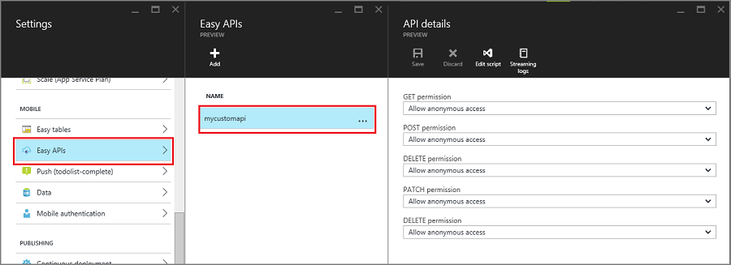

<properties
    pageTitle="Como trabalhar com o servidor de back-end node SDK para aplicativos móvel | Serviço de aplicativo do Azure"
    description="Aprenda a trabalhar com o servidor de back-end node SDK para aplicativos do Azure aplicativo de serviço móvel."
    services="app-service\mobile"
    documentationCenter=""
    authors="adrianhall"
    manager="erikre"
    editor=""/>

<tags
    ms.service="app-service-mobile"
    ms.workload="mobile"
    ms.tgt_pltfrm="mobile-multiple"
    ms.devlang="node"
    ms.topic="article"
    ms.date="10/01/2016"
    ms.author="adrianha"/>

# Como usar o SDK do Azure Mobile aplicativos Node

[AZURE.INCLUDE [app-service-mobile-selector-server-sdk](../../includes/app-service-mobile-selector-server-sdk.md)]

Este artigo fornece informações detalhadas e exemplos mostrando como trabalhar com um back-end node nos aplicativos do Azure aplicativo serviço móvel.

## Introdução

Aplicativos do Azure aplicativo serviço Mobile fornece a capacidade de adicionar um acesso a dados otimizado para celular API da Web em um aplicativo web.  O SDK de aplicativos do Azure aplicativo serviço Mobile é fornecido para aplicativos da web ASP.NET e Node.  O SDK fornece as seguintes operações:

- Operações de tabela (ler, inserir, atualizar, excluir) para acesso a dados
- Operações de personalizado API

Ambas as operações fornecem para autenticação em todos os provedores de identidade permitidos pelo serviço de aplicativo do Azure, incluindo provedores de identidade social como o Facebook, Twitter, Google e Microsoft bem como Active Directory do Azure para identidade de empresa.

Você pode obter exemplos de cada caso de uso no [diretório de exemplos no GitHub].

## Plataformas com suporte

O SDK de nó de aplicativos do Azure Mobile é compatível com a versão atual do LTS do nó e posterior.  A partir de escrita, a versão mais recente do LTS é nó v4.5.0.  Outras versões do nó podem funcionar, mas não têm suporte.

O SDK do Azure Mobile aplicativos nó suporta dois drivers de banco de dados - o driver de nó mssql compatível com SQL Azure e instâncias do SQL Server local.  O driver de sqlite3 suporta bancos de dados SQLite em apenas uma única instância.

### Como: criar um back-end node básica usando a linha de comando

Cada back-end do Azure aplicativo serviço móvel aplicativo Node inicia como um aplicativo de ExpressJS.  ExpressJS é a estrutura mais popular de serviço de web disponível para Node.  Você pode criar uma basic aplicativo [Express] da seguinte forma:

1. Em um comando ou janela do PowerShell, crie um diretório para o seu projeto.

        mkdir basicapp

2. Execute npm inicialização para inicializar a estrutura do pacote.

        cd basicapp
        npm init

    O comando de inicialização npm solicita um conjunto de perguntas ao inicializar o projeto.  Ver o resultado de exemplo:

    ![A saída de inicialização npm][0]

3. Instale as bibliotecas express e aplicativos do azure-mobile do repositório npm.

        npm install --save express azure-mobile-apps

4. Crie um arquivo de app.js para implementar o servidor móvel básico.

        var express = require('express'),
            azureMobileApps = require('azure-mobile-apps');

        var app = express(),
            mobile = azureMobileApps();

        // Define a TodoItem table
        mobile.tables.add('TodoItem');

        // Add the mobile API so it is accessible as a Web API
        app.use(mobile);

        // Start listening on HTTP
        app.listen(process.env.PORT || 3000);

Este aplicativo cria um WebAPI otimizado para celular com um único ponto de extremidade (`/tables/TodoItem`) que fornece acesso não autenticado a um armazenamento de dados do SQL subjacente usando um esquema dinâmico.  Ele é adequado para acompanhar os inícios rápidos de biblioteca do cliente:

- [Início rápido do cliente Android]
- [Início rápido do Apache Cordova cliente]
- [início rápido do cliente do iOS]
- [Início rápido do cliente da Windows Store]
- [Início rápido do cliente Xamarin.iOS]
- [Início rápido do cliente Xamarin.Android]
- [Início rápido do cliente Xamarin.Forms]

Você pode encontrar o código para esse aplicativo básico na [amostra basicapp no GitHub].

### Como: criar um back-end nó com Visual Studio de 2015

Visual Studio 2015 requer uma extensão para desenvolver aplicativos Node dentro do IDE.  Para começar, instale o [Node ferramentas 1.1 para Visual Studio].  Quando as ferramentas de Node para Visual Studio estiver instaladas, crie um aplicativo de 4. x expresso:

1. Abrir a caixa de diálogo **Novo projeto** (do **arquivo** > **novo** > **projeto...**).

2. Expanda **modelos** > **JavaScript** > **Node**.

3. Selecione o **aplicativo básico Express Node Azure 4**.

4. Preencha o nome do projeto.  Clique em *Okey*.

    ![Novo projeto do Visual Studio de 2015][1]

5. Clique com botão direito no nó **npm** e selecione **instalar novos pacotes de npm...**.

6. Talvez seja necessário atualizar o catálogo de npm sobre como criar seu primeiro aplicativo Node.  Clique em **Atualizar** , se necessário.

7. Insira os _aplicativos do azure-mobile_ na caixa de pesquisa.  Clique no pacote do **azure--aplicativos mobile 2.0.0** , clique em **Instalar pacote**.

    ![Instalar novos pacotes de npm][2]

8. Clique em **Fechar**.

9. Abra o arquivo _app.js_ para adicionar suporte para o SDK de aplicativos do Azure Mobile.  Na linha 6 at na parte inferior da biblioteca exigir declarações, adicione o seguinte código:

        var bodyParser = require('body-parser');
        var azureMobileApps = require('azure-mobile-apps');

    Na linha de aproximadamente 27 após as outras instruções de app.use, adicione o seguinte código:

        app.use('/users', users);

        // Azure Mobile Apps Initialization
        var mobile = azureMobileApps();
        mobile.tables.add('TodoItem');
        app.use(mobile);

    Salve o arquivo.

10. Execute o aplicativo localmente (API é atendido em http://localhost:3000) ou publicar no Azure.

### Como: criar um back-end node usando o portal do Azure

Você pode criar um direito de back-end do aplicativo Mobile no [portal do Azure]. Você pode seguir as etapas a seguir ou criar um cliente e servidor juntos seguindo o tutorial de [criar um aplicativo móvel](app-service-mobile-ios-get-started.md) . O tutorial contém uma versão simplificada destas instruções e é melhor para prova de projetos de conceito.

[AZURE.INCLUDE [app-service-mobile-dotnet-backend-create-new-service-classic](../../includes/app-service-mobile-dotnet-backend-create-new-service-classic.md)]

De volta ao blade _Introdução_ , em **criar uma tabela API**, escolha **Node** como seu **idioma de back-end**. Marque a caixa "**para confirmar que isso substituirá todo conteúdo de site.**", clique em **criar TodoItem tabela**.

### Como: baixar o projeto de código de início rápido do Node back-end usando gito

Quando você cria um back-end do aplicativo de Mobile Node usando o portal blade de **início rápido** , um projeto de Node é criado para você e implantado em seu site. Você pode adicionar tabelas e APIs e edite arquivos de código de back-end node no portal. Você também pode usar várias ferramentas de implantação para baixar o projeto de back-end para que você pode adicionar ou modificar tabelas e as APIs e republicar o projeto. Para obter mais informações, consulte o [Guia de implantação do serviço de aplicativo do Azure]. o procedimento a seguir usa um repositório gito para baixar o código de projeto de início rápido.

1. Instale gito, se você ainda não fez isso. As etapas necessárias para instalar gito variam entre sistemas operacionais. Consulte [Instalar gito](http://git-scm.com/book/en/Getting-Started-Installing-Git) para distribuições específicas do sistema operacional e a orientação de instalação.

2. Siga as etapas em [Habilitar o repositório de aplicativo de serviço de aplicativo](../app-service-web/app-service-deploy-local-git.md#Step3) para habilitar o repositório de gito para seu site de back-end, fazendo uma anotação da implantação de nome de usuário e senha.

3. Na lâmina para seu back-end do aplicativo móvel, anote a configuração **gito clonar URL** .

4. Executar o `git clone` comando usando o gito clonar URL, digitar a senha quando necessário, como no exemplo seguinte:

        $ git clone https://username@todolist.scm.azurewebsites.net:443/todolist.git

5. Navegue até o diretório local, que, no exemplo anterior, é /todolist e observe que os arquivos de projeto foram baixados. Localize o `todoitem.json` de arquivo no `/tables` diretório.  Esse arquivo define as permissões na tabela.  Também encontrar o `todoitem.js` scripts de arquivo no mesmo diretório, que define a operação CRUD para a tabela.

6. Depois de fazer alterações em arquivos de projeto, execute os seguintes comandos para adicionar, confirmar e carregar as alterações no site:

        $ git commit -m "updated the table script"
        $ git push origin master

    Quando você adiciona novos arquivos ao projeto, primeiro é necessário executar o `git add .` comando.

O site é republicado sempre que um novo conjunto de confirmações é enviado para o site.

### Como: publicar seu back-end node no Azure

Microsoft Azure fornece muitos mecanismos de publicação de seu back-end node de aplicativos do Azure aplicativo serviço móvel para o serviço do Azure.  Eles incluem utilizando ferramentas de implantação integradas ao Visual Studio, ferramentas de linha de comando e opções de implantação contínuo com base no controle de origem.  Para obter mais informações sobre este tópico, consulte o [Guia de implantação do serviço de aplicativo do Azure].

Serviço de aplicativo do Azure tem recomendações específicas para aplicativo Node que você deve examinar antes de implantar:

- Como [especificar a versão de nó]
- Como [usar módulos de nó]

### Como: habilitar uma Home Page do aplicativo

Muitos aplicativos são uma combinação de web e aplicativos móveis e a estrutura de ExpressJS permite combinar os dois aspectos.  Às vezes, no entanto, você talvez queira implementar apenas uma interface móvel.  É útil fornecer uma página inicial para garantir que o serviço de aplicativo está em execução.  Você pode fornecer sua própria página inicial ou habilitar uma home page temporária.  Para habilitar uma home page temporária, use o seguinte para criar uma instância de aplicativos do Azure Mobile:

    var mobile = azureMobileApps({ homePage: true });

Se você só quiser essa opção disponível ao desenvolver localmente, você pode adicionar essa configuração para sua `azureMobile.js` arquivo.

## Operações de tabela 

O SDK do aplicativos do azure-mobile Node Server fornece mecanismos para expor tabelas de dados armazenadas no banco de dados do Azure SQL como um WebAPI.  Cinco operações são fornecidas.

| Operação | Descrição |
| --------- | ----------- |
| OBTER /tables/_nome de tabela_ | Obter todos os registros na tabela |
| OBTER /tables/ /:id de_nome de tabela_ | Obter um registro específico na tabela |
| POSTAR /tables/_nome de tabela_ | Criar um registro na tabela |
| PATCH /tables/ /:id de_nome de tabela_ | Atualizar um registro na tabela |
| Excluir /tables/ /:id de_nome de tabela_ | Excluir um registro na tabela |

Este WebAPI suporta [OData] e estende o esquema de tabela para oferecer suporte à [sincronização de dados offline].

### Como: definir tabelas usando um esquema dinâmico

Antes de uma tabela pode ser usada, ele deve ser definido.  Tabelas podem ser definidas com um esquema estático (onde o desenvolvedor define as colunas dentro do esquema) ou dinamicamente (onde o SDK controla o esquema com base em solicitações de entrada). Além disso, o desenvolvedor pode controlar aspectos específicos do WebAPI adicionando código Javascript para a definição.

Como prática recomendada, você deve definir cada tabela em um arquivo de Javascript no diretório de tabelas, use o método tables.import() para importar as tabelas.  Estender o aplicativo do basic, o arquivo app.js seria ser ajustado:

    var express = require('express'),
        azureMobileApps = require('azure-mobile-apps');

    var app = express(),
        mobile = azureMobileApps();

    // Define the database schema that is exposed
    mobile.tables.import('./tables');

    // Provide initialization of any tables that are statically defined
    mobile.tables.initialize().then(function () {
        // Add the mobile API so it is accessible as a Web API
        app.use(mobile);

        // Start listening on HTTP
        app.listen(process.env.PORT || 3000);
    });

Definir a tabela no. / tables/TodoItem.js:

    var azureMobileApps = require('azure-mobile-apps');

    var table = azureMobileApps.table();

    // Additional configuration for the table goes here

    module.exports = table;

Tabelas usam esquema dinâmica por padrão.  Para desativar o esquema dinâmica globalmente, defina a configuração do aplicativo **MS_DynamicSchema** como false dentro do portal Azure.

Você pode encontrar um exemplo completo na [amostra todo no GitHub].

### Como: definir tabelas usando um esquema de estático

Você pode definir explicitamente as colunas para expor por meio do WebAPI.  O SDK do Node aplicativos do azure-mobile adiciona automaticamente quaisquer colunas adicionais necessárias para sincronização de dados offline para a lista que você fornecer.  Por exemplo, os aplicativos de cliente do início rápido exigem uma tabela com duas colunas: texto (uma cadeia de caracteres) e concluir (um booliano).  
A tabela pode ser definida na tabela JavaScript arquivo de definição de (localizado no diretório de tabelas) da seguinte maneira:

    var azureMobileApps = require('azure-mobile-apps');

    var table = azureMobileApps.table();

    // Define the columns within the table
    table.columns = {
        "text": "string",
        "complete": "boolean"
    };

    // Turn off dynamic schema
    table.dynamicSchema = false;

    module.exports = table;

Se você definir tabelas estática, em seguida, você também deve chamar o método tables.initialize() para criar o esquema de banco de dados na inicialização.  O método tables.initialize() retorna uma [promessa] para que o serviço da web não servir solicitações antes que o banco de dados sendo inicializado.

### Como: usar o SQL Express como um armazenamento de dados de desenvolvimento no seu computador local

O Azure aplicativos o AzureMobile aplicativos nó SDK Mobile fornece três opções para servir dados prontos para uso: SDK fornece três opções para servir dados prontos para uso:

- Usar o driver de **memória** para fornecer um repositório de exemplo não persistente
- Usar o driver de **mssql** para fornecer um armazenamento de dados SQL Express para desenvolvimento
- Usar o driver de **mssql** para fornecer um armazenamento de dados do Azure SQL Database para produção

O SDK do Azure Mobile aplicativos Node usa o [pacote de Node mssql] para estabelecer e usar uma conexão para SQL Express e o banco de dados SQL.  Este pacote requer que você habilite as conexões TCP em sua instância do SQL Express.

> [AZURE.TIP]O driver de memória não fornece um conjunto completo de recursos para teste.  Se você deseja testar seu back-end localmente, recomendamos o uso de um armazenamento de dados SQL Express e o driver de mssql.

1. Baixe e instale o [Microsoft SQL Server 2014 Express].  Certifique-se de que instalar o SQL Server 2014 Express com ferramentas edition.  A menos que você explicitamente solicitar suporte de 64 bits, a versão de 32 bits consome menos memória durante a execução.

2. Execute o Gerenciador de configuração do SQL Server de 2014.

  1. Expanda o nó de **Configuração de rede do SQL Server** no menu de árvore à esquerda.
  2. Clique em **protocolos para SQLEXPRESS**.
  3. Clique com botão direito **TCP/IP** e selecione **Ativar**.  Na caixa de diálogo pop-up, clique em **Okey** .
  4. Clique com botão direito **TCP/IP** e selecione **Propriedades**.
  5. Clique na guia **Endereços de IP** .
  6. Encontre o nó **IPAll** .  No campo **Porta TCP** , digite **1433**.

         ![Configure SQL Express for TCP/IP][3]

  7. Clique em **Okey**.  Na caixa de diálogo pop-up, clique em **Okey** .
  8. Clique em **Serviços do SQL Server** no menu de árvore à esquerda.
  9. Clique com botão direito **Do SQL Server (SQLEXPRESS)** e selecione **Reiniciar**
  10. Feche o Gerenciador de configuração do SQL Server de 2014.

3. Executar o SQL Server 2014 Management Studio e conectar à sua instância local do SQL Express

  1. Clique com botão direito sua instância no Pesquisador de objetos e selecione **Propriedades**
  2. Selecione a página de **segurança** .
  3. Certifique-se de que o **modo de autenticação do Windows e do SQL Server** está selecionada
  4. Clique em **Okey**

        ![Configurar a autenticação do SQL Express][4]

  5. Expanda **segurança** > **logon** no Pesquisador de objetos
  6. **Logon** de atalho e selecione **Novo logon...**
  7. Insira um nome de Login.  Selecione a **autenticação do SQL Server**.  Digite uma senha, em seguida, digite a mesma senha na caixa **Confirmar senha**.  A senha deve atender aos requisitos de complexidade do Windows.
  8. Clique em **Okey**

        ![Adicionar um novo usuário para o SQL Express][5]

  9. Seu novo logon de atalho e selecione **Propriedades**
  10. Selecione a página de **Funções de servidor**
  11. Marque a caixa próxima a função de servidor **dbcreator**
  12. Clique em **Okey**
  13. Feche o SQL Server 2015 Management Studio

Certifique-se de que você registrar o nome de usuário e senha que você selecionou.  Você talvez precise atribuir funções de servidor adicionais ou permissões dependendo das suas necessidades de banco de dados específico.

O aplicativo Node lê a variável de ambiente **SQLCONNSTR_MS_TableConnectionString** para a cadeia de conexão para esse banco de dados.  Você pode definir esta variável no seu ambiente.  Por exemplo, você pode usar o PowerShell para definir esta variável de ambiente:

    $env:SQLCONNSTR_MS_TableConnectionString = "Server=127.0.0.1; Database=mytestdatabase; User Id=azuremobile; Password=T3stPa55word;"

Acessar o banco de dados por meio de uma conexão de TCP/IP e fornecer um nome de usuário e senha para a conexão.

### Como: configurar seu projeto para o local de desenvolvimento

Os aplicativos do Azure Mobile lê um arquivo JavaScript denominado _azureMobile.js_ do sistema de arquivos local.  Não use esse arquivo para configurar o SDK de aplicativos do Azure Mobile em produção - usar configurações de aplicativo no [portal do Azure] em vez disso.  O arquivo de _azureMobile.js_ deve exportar um objeto de configuração.  As configurações mais comuns são:

- Configurações de banco de dados
- Configurações de log de diagnóstico
- Configurações de CORS alternativo

Veja a seguir um exemplo de arquivo de _azureMobile.js_ implementação das configurações de banco de dados anterior:

    module.exports = {
        cors: {
            origins: [ 'localhost' ]
        },
        data: {
            provider: 'mssql',
            server: '127.0.0.1',
            database: 'mytestdatabase',
            user: 'azuremobile',
            password: 'T3stPa55word'
        },
        logging: {
            level: 'verbose'
        }
    };

Recomendamos que você adicione _azureMobile.js_ ao arquivo _.gitignore_ (ou outro controle de código fonte Ignorar arquivo) para impedir que as senhas sejam armazenados na nuvem.  Sempre definir configurações de produção nas configurações de aplicativo no [portal do Azure].

### Como: Definir configurações de aplicativo para o aplicativo móvel

A maioria das configurações no arquivo _azureMobile.js_ tem uma configuração de aplicativo equivalente no [portal do Azure].  Use a lista a seguir para configurar seu aplicativo nas configurações do aplicativo:

| Configuração de aplicativo                 | Configuração de _azureMobile.js_  | Descrição                               | Valores válidos                                |
| :-------------------------- | :------------------------ | :---------------------------------------- | :------------------------------------------ |
| **MS_MobileAppName**        | nome                      | O nome do aplicativo                       | cadeia de caracteres                                      |
| **MS_MobileLoggingLevel**   | Logging.Level             | Nível de log mínimo das mensagens para fazer logon      | erro, aviso, informações, detalhada, depuração, simples |
| **MS_DebugMode**            | Depurar                     | Ativar ou desativar o modo de depuração              | verdadeiro, FALSO                                 |
| **MS_TableSchema**          | Data.Schema               | Nome do esquema de padrão para tabelas SQL        | cadeia de caracteres (padrão: dbo)                       |
| **MS_DynamicSchema**        | data.dynamicSchema        | Ativar ou desativar o modo de depuração              | verdadeiro, FALSO                                 |
| **MS_DisableVersionHeader** | versão (definido para indefinido)| Desabilita o cabeçalho X-ZUMO-servidor-Version | verdadeiro, FALSO                                 |
| **MS_SkipVersionCheck**     | skipversioncheck          | Desabilita a verificação de versão da API do cliente     | verdadeiro, FALSO                                 |

Para definir uma configuração de aplicativo:

1. Faça logon no [portal do Azure].
2. Selecione **todos os recursos** ou **Os serviços de aplicativo** e clique no nome do seu aplicativo de celular.
3. A lâmina configurações abre por padrão. Se não estiver, clique em **configurações**.
4. Clique em **configurações do aplicativo** no menu geral.
5. Role até a seção configurações de aplicativo.
6. Se seu aplicativo definindo já existir, clique no valor da configuração do aplicativo para editar o valor.
7. Se sua configuração de aplicativo não existir, insira a configuração do aplicativo na caixa chave e o valor na caixa valor.
8. Quando você estiver concluída, clique em **Salvar**.

Alterando a maioria das configurações de aplicativo requer a reinicialização do serviço.

### Como: usar o banco de dados SQL como seu armazenamento de dados de produção

<!--- ALTERNATE INCLUDE - we can't use ../includes/app-service-mobile-dotnet-backend-create-new-service.md - slightly different semantics -->

Usar o Azure SQL Database como armazenamento de dados é idêntica em todos os tipos de aplicativo de serviço de aplicativo do Azure. Se você não tiver feito isso, siga estas etapas para criar um back-end do aplicativo Mobile.

1. Faça logon no [portal do Azure].

2. Na parte superior esquerda da janela, clique no botão **+ novo** > **Web + Mobile** > **Aplicativo móvel**, em seguida, forneça um nome para seu back-end do aplicativo móvel.

3. Na caixa de **Grupo de recursos** , insira o mesmo nome como seu aplicativo.

4. O plano de serviço de aplicativo padrão é selecionado.  Se desejar alterar seu plano de serviço de aplicativo, você pode fazer isso clicando o plano de serviço de aplicativo > **+ criar novos**.  Forneça um nome com o novo plano de serviço de aplicativos e selecione um local apropriado.  Clique na camada de preços e selecione um nível de preço apropriado para o serviço. Selecione **Exibir tudo** para exibir mais opções de preços, como **livre** e **compartilhado**.  Depois que você selecionou o nível de preço, clique no botão **Selecionar** .  Volta a lâmina de **plano de serviço de aplicativo** , clique em **Okey**.

5. Clique em **criar**. Provisionar um back-end do aplicativo Mobile pode levar alguns minutos.  Depois que o back-end do aplicativo Mobile está provisionado, o portal abre a lâmina de **configurações** para o aplicativo Mobile back-end.

Depois de criado o back-end do aplicativo móvel, você pode optar por conectar um banco de dados existente do SQL ao seu back-end do aplicativo móvel ou criar um novo banco de dados do SQL.  Nesta seção, podemos criar um banco de dados do SQL.

> [AZURE.NOTE]Se você já tiver um banco de dados no mesmo local como o back-end do aplicativo móvel, você pode escolher em vez disso, **Use um banco de dados existente** e selecione esse banco de dados. O uso de um banco de dados em um local diferente não é recomendado devido a latências maiores.

6. No novo aplicativo Mobile back-end, clique em **configurações** > **Aplicativo Mobile** > **dados** > **+ Adicionar**.

7. Na lâmina **Adicionar conexão de dados** , clique em **Banco de dados do SQL - configurar configurações necessárias** > **criar um novo banco de dados**.  Insira o nome do novo banco de dados no campo **nome** .

8. Clique em **servidor**.  Na lâmina **novo servidor** , insira um nome de servidor exclusivo no campo **nome do servidor** e fornecer um adequado **logon de administrador do servidor** e a **senha**.  Certifique-se de **que serviços de permitir azure para acessar o servidor** está marcada.  Clique em **Okey**.

    ![Criar um banco de dados do SQL Azure][6]

9. Na lâmina **novo banco de dados** , clique em **Okey**.

10. Novamente na lâmina **Adicionar conexão de dados** , selecione a **cadeia de Conexão**, insira o login e a senha que você forneceu ao criar o banco de dados.  Se você usar um banco de dados existente, forneça as credenciais de login para esse banco de dados.  Depois de inserido, clique em **Okey**.

11. Ligue a lâmina de **conexão de dados de adicionar** novamente, clique em **Okey** para criar o banco de dados.

<!--- END OF ALTERNATE INCLUDE -->

Criação do banco de dados pode levar alguns minutos.  Use a área de **notificações** para monitorar o progresso da implantação.  Não progresso até que o banco de dados foi implantado corretamente.  Após implantado com êxito, uma cadeia de Conexão é criada para a instância de banco de dados SQL em sua configurações de aplicativo de back-end móvel.  Você pode ver esta configuração de aplicativo nas **configurações** > **configurações do aplicativo** > **cadeias de caracteres de Conexão**.

### Como: exigir autenticação para obter acesso a tabelas

Se você quiser usar a autenticação do serviço de aplicativo com o ponto de extremidade de tabelas, você deve configurar a autenticação do aplicativo de serviço no [portal do Azure] primeiro.  Para obter mais detalhes sobre como configurar a autenticação em um serviço de aplicativo do Azure, examine o guia de configuração para o provedor de identidade que você pretende usar:

- [Como configurar a autenticação do Azure Active Directory]
- [Como configurar a autenticação do Facebook]
- [Como configurar a autenticação do Google]
- [Como configurar o Microsoft Authentication]
- [Como configurar a autenticação do Twitter]

Cada tabela tem uma propriedade de acesso que pode ser usada para controlar o acesso à tabela.  O exemplo a seguir mostra uma tabela estática definida com autenticação necessária.

    var azureMobileApps = require('azure-mobile-apps');

    var table = azureMobileApps.table();

    // Define the columns within the table
    table.columns = {
        "text": "string",
        "complete": "boolean"
    };

    // Turn off dynamic schema
    table.dynamicSchema = false;

    // Require authentication to access the table
    table.access = 'authenticated';

    module.exports = table;

A propriedade access pode levar a um dos três valores

  - *anônimo* indica que o aplicativo cliente tem permissão para ler dados sem autenticação
  - *autenticado* indica que o aplicativo cliente deve enviar um token de autenticação válido com a solicitação
  - *desativado* indica que essa tabela está atualmente desabilitada

Se a propriedade de acesso estiver indefinida, acesso não autenticado é permitido.

### Como: usar declarações de autenticação com tabelas

Você pode configurar várias declarações que são solicitadas quando autenticação estiver configurada.  Essas declarações normalmente não estão disponíveis por meio do `context.user` objeto.  No entanto, eles podem ser recuperados usando o `context.user.getIdentity()` método.  O `getIdentity()` método retorna uma promessa resolvida para um objeto.  O objeto é encaixado pelo método de autenticação (facebook, google, twitter, microsoftaccount ou aad).

Por exemplo, se você configurar autenticação de Account da Microsoft e solicitar que reivindicar os endereços de email, você pode adicionar o endereço de email para o registro com o controlador de tabela a seguir:

    var azureMobileApps = require('azure-mobile-apps');

    // Create a new table definition
    var table = azureMobileApps.table();

    table.columns = {
        "emailAddress": "string",
        "text": "string",
        "complete": "boolean"
    };
    table.dynamicSchema = false;
    table.access = 'authenticated';

    /**
    * Limit the context query to those records with the authenticated user email address
    * @param {Context} context the operation context
    * @returns {Promise} context execution Promise
    */
    function queryContextForEmail(context) {
        return context.user.getIdentity().then((data) => {
            context.query.where({ emailAddress: data.microsoftaccount.claims.emailaddress });
            return context.execute();
        });
    }

    /**
    * Adds the email address from the claims to the context item - used for
    * insert operations
    * @param {Context} context the operation context
    * @returns {Promise} context execution Promise
    */
    function addEmailToContext(context) {
        return context.user.getIdentity().then((data) => {
            context.item.emailAddress = data.microsoftaccount.claims.emailaddress;
            return context.execute();
        });
    }

    // Configure specific code when the client does a request
    // READ - only return records belonging to the authenticated user
    table.read(queryContextForEmail);

    // CREATE - add or overwrite the userId based on the authenticated user
    table.insert(addEmailToContext);

    // UPDATE - only allow updating of record belong to the authenticated user
    table.update(queryContextForEmail);

    // DELETE - only allow deletion of records belong to the authenticated uer
    table.delete(queryContextForEmail);

    module.exports = table;

Para ver quais declarações estão disponíveis, use um navegador da web para exibir o `/.auth/me` ponto de extremidade do seu site.

### Como: desabilitar o acesso a operações de tabela específica

Além de aparecendo na tabela, a propriedade de acesso pode ser usada para controlar operações individuais.  Há quatro operações:

  - *Leia* é a operação obter RESTful na tabela
  - *Inserir* é a operação de POSTAGEM RESTful na tabela
  - *Atualizar* é a operação de PATCH RESTful na tabela
  - *Excluir* é a operação Excluir RESTful na tabela

Por exemplo, você poderá fornecer uma tabela não autenticada somente leitura:

    var azureMobileApps = require('azure-mobile-apps');

    var table = azureMobileApps.table();

    // Read-Only table - only allow READ operations
    table.read.access = 'anonymous';
    table.insert.access = 'disabled';
    table.update.access = 'disabled';
    table.delete.access = 'disabled';

    module.exports = table;

### Como: ajustar a consulta que é usada com operações de tabela

Um requisito comum para operações de tabela é fornecer um modo de exibição restrito dos dados.  Por exemplo, você pode fornecer uma tabela marcado com a ID de usuário autenticado, para que você só pode ler ou atualizar seus próprios registros.  Definição da tabela a seguir fornece essa funcionalidade:

    var azureMobileApps = require('azure-mobile-apps');

    var table = azureMobileApps.table();

    // Define a static schema for the table
    table.columns = {
        "userId": "string",
        "text": "string",
        "complete": "boolean"
    };
    table.dynamicSchema = false;

    // Require authentication for this table
    table.access = 'authenticated';

    // Ensure that only records for the authenticated user are retrieved
    table.read(function (context) {
        context.query.where({ userId: context.user.id });
        return context.execute();
    });

    // When adding records, add or overwrite the userId with the authenticated user
    table.insert(function (context) {
        context.item.userId = context.user.id;
        return context.execute();
    });

    module.exports = table;

Operações que normalmente executar uma consulta tem uma propriedade de consulta que você pode ajustar com um onde cláusula. A propriedade de consulta é um objeto de [QueryJS] que é usado para converter uma consulta de OData para algo que possa processar dados back-end.  Para casos de igualdade simples (como o anterior), um mapa pode ser usado. Você também pode adicionar cláusulas específicas de SQL:

    context.query.where('myfield eq ?', 'value');

### Como: configurar delete suave em uma tabela

Excluir suave realmente não exclui os registros.  Em vez disso, ele marca-los como excluído no banco de dados definindo a coluna excluída como true.  O SDK do Azure Mobile aplicativos automaticamente remove registros excluídos suaves resultados, a menos que o SDK do cliente móvel usa IncludeDeleted().  Para configurar uma tabela para excluir suave, defina o `softDelete` propriedade no arquivo de definição de tabela:

    var azureMobileApps = require('azure-mobile-apps');

    var table = azureMobileApps.table();

    // Define the columns within the table
    table.columns = {
        "text": "string",
        "complete": "boolean"
    };

    // Turn off dynamic schema
    table.dynamicSchema = false;

    // Turn on Soft Delete
    table.softDelete = true;

    // Require authentication to access the table
    table.access = 'authenticated';

    module.exports = table;

Você deve estabelecer um mecanismo para limpar registros - seja de um aplicativo cliente, por meio de um WebJob, a função do Azure ou uma API personalizada.

### Como: propagar seu banco de dados com dados

Ao criar um novo aplicativo, você talvez queira propagar uma tabela com dados.  Isso pode ser feito dentro do arquivo de JavaScript de definição de tabela da seguinte maneira:

    var azureMobileApps = require('azure-mobile-apps');

    var table = azureMobileApps.table();

    // Define the columns within the table
    table.columns = {
        "text": "string",
        "complete": "boolean"
    };
    table.seed = [
        { text: 'Example 1', complete: false },
        { text: 'Example 2', complete: true }
    ];

    // Turn off dynamic schema
    table.dynamicSchema = false;

    // Require authentication to access the table
    table.access = 'authenticated';

    module.exports = table;

Propagação de dados é feito somente quando a tabela é criada pelo SDK de aplicativos do Azure Mobile.  Se a tabela já existir no banco de dados, nenhum dado é inserido na tabela.  Se esquema dinâmica estiver ativada, o esquema é inferido dos dados de propagação.

Recomendamos que você chama explicitamente o `tables.initialize()` método para criar a tabela quando o serviço começa a ser executado.

### Como: habilitar o suporte de Swagger

Aplicativos do Azure aplicativo serviço Mobile vem com interno [Swagger] suporte.  Para ativar o suporte de Swagger, instale o swagger-interface do usuário do primeiro como uma dependência:

    npm install --save swagger-ui

Depois de instalado, você pode ativar o suporte de Swagger no construtor de aplicativos do Azure Mobile:

    var mobile = azureMobileApps({ swagger: true });

Você provavelmente só deseja habilitar Swagger suporte nas edições de desenvolvimento.  Você pode fazer isso utilizando o `NODE_ENV` configuração do aplicativo:

    var mobile = azureMobileApps({ swagger: process.env.NODE_ENV !== 'production' });

O ponto de extremidade de swagger está localizado em http://_yoursite_.azurewebsites.net/swagger.  Você pode acessar a interface do usuário Swagger via o `/swagger/ui` ponto de extremidade.  Se você optar por exigir autenticação em todo o seu aplicativo, Swagger produz um erro.  Para obter melhores resultados, optar por permitir que as solicitações não autenticadas por meio da autenticação de serviço de aplicativo do Azure / configurações de autorização, então controlar autenticação usando o `table.access` propriedade.

Você também pode adicionar a opção Swagger para sua `azureMobile.js` arquivo se você só quiser Swagger suporte ao desenvolver localmente.

## <a name="push">Notificações por push

Aplicativos Mobile integra-se com Hubs de notificação do Azure para que você possa enviar notificações por push direcionados para milhões de dispositivos em todas as principais plataformas. Usando Hubs de notificação, você pode enviar notificações por push para iOS, Android e Windows dispositivos. Para saber que mais sobre tudo o que você podem fazer com Hubs de notificação, consulte [Visão geral de Hubs de notificação](../notification-hubs/notification-hubs-push-notification-overview.md).

### </a>Como: enviar as notificações por push

O código a seguir mostra como usar o objeto de envio para enviar uma notificação de difusão push para dispositivos iOS registrados:

    // Create an APNS payload.
    var payload = '{"aps": {"alert": "This is an APNS payload."}}';

    // Only do the push if configured
    if (context.push) {
        // Send a push notification using APNS.
        context.push.apns.send(null, payload, function (error) {
            if (error) {
                // Do something or log the error.
            }
        });
    }

Criando um registro de envio do modelo do cliente, em vez disso, você pode enviar uma mensagem de envio de modelo para dispositivos em todas as plataformas com suporte. O código a seguir mostra como enviar uma notificação de modelo:

    // Define the template payload.
    var payload = '{"messageParam": "This is a template payload."}';

    // Only do the push if configured
    if (context.push) {
        // Send a template notification.
        context.push.send(null, payload, function (error) {
            if (error) {
                // Do something or log the error.
            }
        });
    }

###Como: enviar notificações de envio para um usuário autenticado usando marcas

Quando um usuário autenticado registra para notificações por push, uma marca de identificação de usuário é adicionada automaticamente ao registro. Usando essa marca, você pode enviar notificações por push para todos os dispositivos registrados por um usuário específico. O código a seguir obtém o SID do usuário faz a solicitação e envia uma notificação de envio de modelo para cada registro de dispositivo para esse usuário:

    // Only do the push if configured
    if (context.push) {
        // Send a notification to the current user.
        context.push.send(context.user.id, payload, function (error) {
            if (error) {
                // Do something or log the error.
            }
        });
    }

Ao registrar para notificações de envio de um cliente autenticado, certifique-se de que a autenticação é concluída antes de tentar registro.

## APIs personalizado

###  Como: definir uma API personalizada

Além de acesso a dados API via o ponto de extremidade de /tables, aplicativos do Azure Mobile pode fornecer cobertura de API personalizada.  Personalizado APIs são definidos de forma semelhante para as definições da tabela e pode acessar todos os mesmos recursos, incluindo a autenticação.

Se você quiser usar autenticação de serviço de aplicativo com uma API personalizada, você deve configurar autenticação de serviço de aplicativo no [portal do Azure] primeiro.  Para obter mais detalhes sobre como configurar a autenticação em um serviço de aplicativo do Azure, examine o guia de configuração para o provedor de identidade que você pretende usar:

- [Como configurar a autenticação do Azure Active Directory]
- [Como configurar a autenticação do Facebook]
- [Como configurar a autenticação do Google]
- [Como configurar o Microsoft Authentication]
- [Como configurar a autenticação do Twitter]

APIs personalizados são definidos da mesma forma como a API de tabelas.

1. Criar um diretório de **api**
2. Crie um arquivo de JavaScript de definição de API no diretório de **api** .
3. Use o método de importação para importar do diretório de **api** .

Aqui está a definição de api de protótipo com base na amostra basic-app que usamos anteriormente.

    var express = require('express'),
        azureMobileApps = require('azure-mobile-apps');

    var app = express(),
        mobile = azureMobileApps();

    // Import the Custom API
    mobile.api.import('./api');

    // Add the mobile API so it is accessible as a Web API
    app.use(mobile);

    // Start listening on HTTP
    app.listen(process.env.PORT || 3000);

Vamos dar um exemplo API que retorna a data de servidor usando o método _Date.now()_ .  Aqui está o arquivo de api/date.js:

    var api = {
        get: function (req, res, next) {
            var date = { currentTime: Date.now() };
            res.status(200).type('application/json').send(date);
        });
    };

    module.exports = api;

Cada parâmetro é um dos verbos padrão RESTful - GET, POST, PATCH ou excluir.  O método é uma função de [ExpressJS Middleware] padrão que envia a saída necessária.

### Como: exigir autenticação para obter acesso a uma API personalizado

SDK de aplicativos do Azure Mobile implementa autenticação da mesma maneira para o ponto de extremidade de tabelas e APIs personalizado.  Para adicionar autenticação à API desenvolvido na seção anterior, adicione uma propriedade de **acesso** :

    var api = {
        get: function (req, res, next) {
            var date = { currentTime: Date.now() };
            res.status(200).type('application/json').send(date);
        });
    };
    // All methods must be authenticated.
    api.access = 'authenticated';

    module.exports = api;

Você também pode especificar a autenticação em operações específicas:

    var api = {
        get: function (req, res, next) {
            var date = { currentTime: Date.now() };
            res.status(200).type('application/json').send(date);
        }
    };
    // The GET methods must be authenticated.
    api.get.access = 'authenticated';

    module.exports = api;

O mesmo token que é usado para o ponto de extremidade de tabelas deve ser usado para APIs personalizado que requer autenticação.

### Como: tratar carregamentos de arquivo grande

SDK de aplicativos do Azure Mobile usa o [Analisador de corpo middleware](https://github.com/expressjs/body-parser) para aceitar e decodificar o conteúdo do corpo no seu envio.  Você pode configurar previamente analisador de corpo para aceitar carregamentos de arquivo maior:

    var express = require('express'),
        bodyParser = require('body-parser'),
        azureMobileApps = require('azure-mobile-apps');

    var app = express(),
        mobile = azureMobileApps();

    // Set up large body content handling
    app.use(bodyParser.json({ limit: '50mb' }));
    app.use(bodyParser.urlencoded({ limit: '50mb', extended: true }));

    // Import the Custom API
    mobile.api.import('./api');

    // Add the mobile API so it is accessible as a Web API
    app.use(mobile);

    // Start listening on HTTP
    app.listen(process.env.PORT || 3000);

O arquivo é base 64 codificado antes da transmissão.  Isso aumenta o tamanho do carregamento real (e, portanto, o tamanho que você deve considerar).

### Como: executar instruções SQL personalizadas

O SDK de aplicativos do Azure Mobile permite o acesso a todo o contexto através do objeto de solicitação, permitindo que você execute instruções SQL com parâmetros para o provedor de dados definidas com facilidade:

    var api = {
        get: function (request, response, next) {
            // Check for parameters - if not there, pass on to a later API call
            if (typeof request.params.completed === 'undefined')
                return next();

            // Define the query - anything that can be handled by the mssql
            // driver is allowed.
            var query = {
                sql: 'UPDATE TodoItem SET complete=@completed',
                parameters: [{
                    completed: request.params.completed
                }]
            };

            // Execute the query.  The context for Azure Mobile Apps is available through
            // request.azureMobile - the data object contains the configured data provider.
            request.azureMobile.data.execute(query)
            .then(function (results) {
                response.json(results);
            });
        }
    };

    api.get.access = 'authenticated';
    module.exports = api;

## Depuração, tabelas fácil e APIs fácil

### Como: depurar, diagnosticar e solucionar problemas de aplicativos do Azure Mobile

O serviço de aplicativo do Azure fornece vários depuração e técnicas para aplicativos de Node de solução de problemas.
Consulte os artigos a seguir para começar a usar seu back-end node Mobile de solução de problemas:

- [Monitoramento de um serviço de aplicativo do Azure]
- [Habilitar o log de diagnóstico em um serviço de aplicativo do Azure]
- [Solucionar problemas de um serviço de aplicativo do Azure no Visual Studio]

Aplicativos de Node tem acesso a uma ampla variedade de ferramentas de log de diagnóstico.  Internamente, o SDK do Azure Mobile aplicativos Node usa [Winston] para o log de diagnóstico.  Registro em log é ativado automaticamente ativando o modo de depuração ou definindo a configuração de aplicativo **MS_DebugMode** como true no [portal do Azure]. Logs gerados aparecem em Logs de diagnóstico no [portal do Azure].

### Como: trabalhar com tabelas de fácil no portal do Azure

Fácil tabelas no portal do permitem que você criar e trabalhar com direito de tabelas no portal. Você ainda pode editar operações de tabela usando o Editor de serviço de aplicativo.

Quando você clica em **tabelas fácil** em suas configurações de site de back-end, você pode adicionar, modificar ou excluir uma tabela. Você também pode ver os dados na tabela.

Os comandos a seguir estão disponíveis na barra de comandos para uma tabela:

+ **Alterar permissões** - modificar a permissão para ler, inserir, atualizar e excluir operações na tabela. 
  Opções são permitir o acesso anônimo, para exigir autenticação, ou para desabilitar todo o acesso para a operação. 
+ **Editar script** - o arquivo de script para a tabela é aberta no Editor de serviço do aplicativo.
+ **Gerenciar esquema** - adicionar ou excluir colunas ou alterar o índice de tabela.
+ **Limpar tabela** - trunca uma tabela existente ser excluir todas as linhas de dados, mas deixando o esquema inalterado.
+ **Excluir linhas** - excluir linhas individuais de dados.
+ **Exibir logs de streaming** - você se conecta ao serviço de log streaming para seu site.

###Como: trabalhar com APIs fácil no portal do Azure

Fácil APIs no portal do permitem que você criar e trabalhar com direito APIs personalizado no portal. Você pode editar scripts de API usando o Editor de serviço de aplicativo.

Quando você clica **APIs fácil** em suas configurações de site de back-end, você pode adicionar, modificar ou excluir um ponto de extremidade de API personalizado.

No portal do, você pode alterar as permissões de acesso para uma determinada ação de HTTP, edite o arquivo de script de API no Editor de serviço do aplicativo ou exibir os logs de streaming.

###Como: editar código no Editor de serviço de aplicativo

O portal do Azure permite editar seus arquivos de script de back-end node no Editor de serviço do aplicativo sem precisar baixar o projeto no seu computador local. Para editar arquivos de script no editor de online:

1. No seu blade de back-end do aplicativo móvel, clique em **todas as configurações** > **tabelas fácil** ou **APIs fácil**, clique em uma tabela ou a API, clique **Editar script**. O arquivo de script é aberto no Editor de serviço do aplicativo.

    

2. Faça as alterações para o arquivo de código no editor de online. As alterações são salvas automaticamente enquanto você digita.

<!-- Images -->
[0]: ./media/app-service-mobile-node-backend-how-to-use-server-sdk/npm-init.png
[1]: ./media/app-service-mobile-node-backend-how-to-use-server-sdk/vs2015-new-project.png
[2]: ./media/app-service-mobile-node-backend-how-to-use-server-sdk/vs2015-install-npm.png
[3]: ./media/app-service-mobile-node-backend-how-to-use-server-sdk/sqlexpress-config.png
[4]: ./media/app-service-mobile-node-backend-how-to-use-server-sdk/sqlexpress-authconfig.png
[5]: ./media/app-service-mobile-node-backend-how-to-use-server-sdk/sqlexpress-newuser-1.png
[6]: ./media/app-service-mobile-node-backend-how-to-use-server-sdk/dotnet-backend-create-db.png

<!-- URLs -->
[Início rápido do cliente Android]: app-service-mobile-android-get-started.md
[Início rápido do Apache Cordova cliente]: app-service-mobile-cordova-get-started.md
[início rápido do cliente do iOS]: app-service-mobile-ios-get-started.md
[Início rápido do cliente Xamarin.iOS]: app-service-mobile-xamarin-ios-get-started.md
[Início rápido do cliente Xamarin.Android]: app-service-mobile-xamarin-android-get-started.md
[Início rápido do cliente Xamarin.Forms]: app-service-mobile-xamarin-forms-get-started.md
[Início rápido do cliente da Windows Store]: app-service-mobile-windows-store-dotnet-get-started.md
[HTML/Javascript Client QuickStart]: app-service-html-get-started.md
[sincronização de dados offline]: app-service-mobile-offline-data-sync.md
[Como configurar a autenticação do Azure Active Directory]: app-service-mobile-how-to-configure-active-directory-authentication.md
[Como configurar a autenticação do Facebook]: app-service-mobile-how-to-configure-facebook-authentication.md
[Como configurar a autenticação do Google]: app-service-mobile-how-to-configure-google-authentication.md
[Como configurar o Microsoft Authentication]: app-service-mobile-how-to-configure-microsoft-authentication.md
[Como configurar a autenticação do Twitter]: app-service-mobile-how-to-configure-twitter-authentication.md
[Guia de implantação do Azure serviço de aplicativo]: ../app-service-web/web-sites-deploy.md
[Monitoramento de um serviço de aplicativo do Azure]: ../app-service-web/web-sites-monitor.md
[Habilitar o log de diagnóstico em um serviço de aplicativo do Azure]: ../app-service-web/web-sites-enable-diagnostic-log.md
[Solucionar problemas de um serviço de aplicativo do Azure no Visual Studio]: ../app-service-web/web-sites-dotnet-troubleshoot-visual-studio.md
[especificar a versão de nó]: ../nodejs-specify-node-version-azure-apps.md
[usar nó módulos]: ../nodejs-use-node-modules-azure-apps.md
[Create a new Azure App Service]: ../app-service-web/
[azure-mobile-apps]: https://www.npmjs.com/package/azure-mobile-apps
[Express]: http://expressjs.com/
[Swagger]: http://swagger.io/

[Portal do Azure]: https://portal.azure.com/
[OData]: http://www.odata.org
[Promessa]: https://developer.mozilla.org/en-US/docs/Web/JavaScript/Reference/Global_Objects/Promise
[exemplo de basicapp no GitHub]: https://github.com/azure/azure-mobile-apps-node/tree/master/samples/basic-app
[amostra de todo no GitHub]: https://github.com/azure/azure-mobile-apps-node/tree/master/samples/todo
[diretório de exemplos no GitHub]: https://github.com/azure/azure-mobile-apps-node/tree/master/samples
[static-schema sample on GitHub]: https://github.com/azure/azure-mobile-apps-node/tree/master/samples/static-schema
[QueryJS]: https://github.com/Azure/queryjs
[Ferramentas de Node 1.1 para Visual Studio]: https://github.com/Microsoft/nodejstools/releases/tag/v1.1-RC.2.1
[MSSQL Node pacote]: https://www.npmjs.com/package/mssql
[Microsoft SQL Server 2014 Express]: http://www.microsoft.com/en-us/server-cloud/Products/sql-server-editions/sql-server-express.aspx
[ExpressJS Middleware]: http://expressjs.com/guide/using-middleware.html
[Winston]: https://github.com/winstonjs/winston
