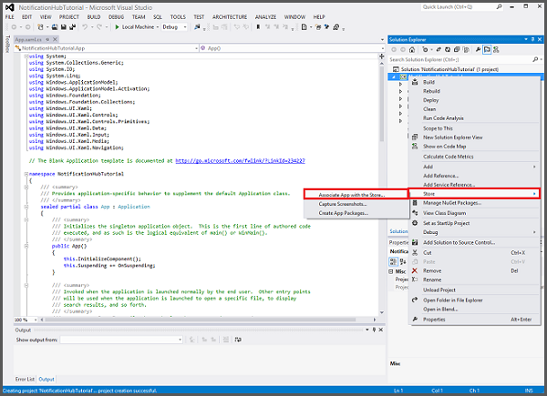

<properties
    pageTitle="Adicionar notificações por push para o seu aplicativo de plataforma de Windows Universal (UWP) | Aplicativos móveis do Azure"
    description="Saiba como usar aplicativos de Mobile de serviço de aplicativo do Azure e Hubs de notificação do Azure para enviar notificações por push para seu aplicativo de plataforma de Windows Universal (UWP)."
    services="app-service\mobile,notification-hubs"
    documentationCenter="windows"
    authors="ysxu"
    manager="dwrede"
    editor=""/>

<tags
    ms.service="app-service-mobile"
    ms.workload="mobile"
    ms.tgt_pltfrm="mobile-windows"
    ms.devlang="dotnet"
    ms.topic="article"
    ms.date="10/12/2016"
    ms.author="yuaxu"/>

# Adicionar notificações por push para o seu aplicativo do Windows

[AZURE.INCLUDE [app-service-mobile-selector-get-started-push](../../includes/app-service-mobile-selector-get-started-push.md)]

##Visão geral

Neste tutorial, você adicionar notificações por push para o projeto de [início rápido do Windows](app-service-mobile-windows-store-dotnet-get-started.md) para que uma notificação de envio é enviada para o dispositivo sempre que um registro é inserido.

Se você não usa o projeto de servidor de início rápido baixado, você precisará do pacote de extensão de notificação de envio. Consulte [trabalhar com o servidor de back-end do .NET SDK para aplicativos do Azure móvel](app-service-mobile-dotnet-backend-how-to-use-server-sdk.md) para obter mais informações.

##Configurar um Hub de notificação

[AZURE.INCLUDE [app-service-mobile-configure-notification-hub](../../includes/app-service-mobile-configure-notification-hub.md)]

##Registrar seu aplicativo para notificações por push

Você precisa enviar seu aplicativo Windows Store, em seguida, configure o seu projeto de servidor para integrar com o Windows notificação Services (WNS) para enviar por push.

1. No Visual Studio Solution Explorer, o projeto de aplicativo UWP de atalho, clique em **repositório** > **Associar o aplicativo com o armazenamento de...**. 

    
    
2. No assistente, clique em **Avançar**, entrar com sua conta da Microsoft, digite um nome para seu aplicativo em **reserva um novo nome de aplicativo**e clique em **reserva**.

3. Depois que o registro de aplicativo é criado com êxito, selecione o novo nome do aplicativo, clique em **Avançar**e, em seguida, clique em **associar**. Isso adiciona as informações de registro da Windows Store necessárias ao manifesto do aplicativo.  

7. Navegue até o [Centro de desenvolvimento do Windows](https://dev.windows.com/en-us/overview), entrar com sua conta da Microsoft, clique em novo registro de aplicativo em **Meus aplicativos**, expanda **Serviços** > **notificações por Push**. 

8. Na página de **notificações de envio** , clique em **site de serviços do Live** em **Serviços de celular do Microsoft Azure**.

9. Na página de registro, anote o valor em **segredos de aplicativo** e o **Pacote SID**, que você usará para configurar seu back-end do aplicativo móvel Avançar. 

    

    > [AZURE.IMPORTANT] O pacote SID e segredo cliente são credenciais de segurança importantes. Não compartilhar esses valores com qualquer pessoa ou distribuí-los com seu aplicativo. A **Id de aplicativo** é usado com o segredo para configurar a autenticação de Account da Microsoft.

##Configurar o back-end para enviar notificações por push

[AZURE.INCLUDE [app-service-mobile-configure-wns](../../includes/app-service-mobile-configure-wns.md)]

##Atualizar o servidor para enviar as notificações por push

Use o procedimento abaixo que corresponde ao seu tipo de projeto de back-end&mdash; [.NET back-end](#dotnet) ou [back-end node](#nodejs).

### Projeto de back-end do .NET

1. No Visual Studio, o projeto de servidor de atalho clique em **Gerenciar pacotes NuGet**, pesquise Microsoft.Azure.NotificationHubs e clique em **instalar**. Isso instala a biblioteca de cliente Hubs de notificação.

2. Expanda **controladores**, abra TodoItemController.cs e adicione o seguinte usando instruções:

        using System.Collections.Generic;
        using Microsoft.Azure.NotificationHubs;
        using Microsoft.Azure.Mobile.Server.Config;

3. No método **PostTodoItem** , adicione o seguinte código após a chamada para **InsertAsync**:

        // Get the settings for the server project.
        HttpConfiguration config = this.Configuration;
        MobileAppSettingsDictionary settings =
            this.Configuration.GetMobileAppSettingsProvider().GetMobileAppSettings();

        // Get the Notification Hubs credentials for the Mobile App.
        string notificationHubName = settings.NotificationHubName;
        string notificationHubConnection = settings
            .Connections[MobileAppSettingsKeys.NotificationHubConnectionString].ConnectionString;

        // Create the notification hub client.
        NotificationHubClient hub = NotificationHubClient
            .CreateClientFromConnectionString(notificationHubConnection, notificationHubName);

        // Define a WNS payload
        var windowsToastPayload = @"<toast><visual><binding template=""ToastText01""><text id=""1"">"
                                + item.Text + @"</text></binding></visual></toast>";
        try
        {
            // Send the push notification.
            var result = await hub.SendWindowsNativeNotificationAsync(windowsToastPayload);

            // Write the success result to the logs.
            config.Services.GetTraceWriter().Info(result.State.ToString());
        }
        catch (System.Exception ex)
        {
            // Write the failure result to the logs.
            config.Services.GetTraceWriter()
                .Error(ex.Message, null, "Push.SendAsync Error");
        }

    Esse código informa o hub de notificação para enviar uma notificação de envio após um novo item de inserção.

4. Republicar o project server.

### Projeto de back-end node

1. Se você ainda não fez isso, [Baixe o projeto de início rápido](app-service-mobile-node-backend-how-to-use-server-sdk.md#download-quickstart) ou então usa o [editor de online no portal do Azure](app-service-mobile-node-backend-how-to-use-server-sdk.md#online-editor).

2. Substitua o código existente no arquivo todoitem.js com o seguinte:

        var azureMobileApps = require('azure-mobile-apps'),
        promises = require('azure-mobile-apps/src/utilities/promises'),
        logger = require('azure-mobile-apps/src/logger');

        var table = azureMobileApps.table();

        table.insert(function (context) {
        // For more information about the Notification Hubs JavaScript SDK,
        // see http://aka.ms/nodejshubs
        logger.info('Running TodoItem.insert');

        // Define the WNS payload that contains the new item Text.
        var payload = "<toast><visual><binding template=\ToastText01\><text id=\"1\">"
                                    + context.item.text + "</text></binding></visual></toast>";

        // Execute the insert.  The insert returns the results as a Promise,
        // Do the push as a post-execute action within the promise flow.
        return context.execute()
            .then(function (results) {
                // Only do the push if configured
                if (context.push) {
                    // Send a WNS native toast notification.
                    context.push.wns.sendToast(null, payload, function (error) {
                        if (error) {
                            logger.error('Error while sending push notification: ', error);
                        } else {
                            logger.info('Push notification sent successfully!');
                        }
                    });
                }
                // Don't forget to return the results from the context.execute()
                return results;
            })
            .catch(function (error) {
                logger.error('Error while running context.execute: ', error);
            });
        });

        module.exports = table;

    Envia uma notificação do sistema WNS que contém o item.text quando um novo item de todo é inserido.

2. Ao editar o arquivo em seu computador local, republicar o project server.

##Adicionar notificações por push para o seu aplicativo

Em seguida, seu aplicativo deve registrar para notificações por push na inicialização. Quando você já tiver ativado autenticação, verifique se que o usuário sinais de antes de tentar registrar para notificações de envio.

1. Abra o arquivo de projeto **App.xaml.cs** e adicione o seguinte `using` instruções:

        using System.Threading.Tasks;
        using Windows.Networking.PushNotifications;

2. No mesmo arquivo, adicione a seguinte definição de método de **InitNotificationsAsync** para a classe de **aplicativo** :

        private async Task InitNotificationsAsync()
        {
            // Get a channel URI from WNS.
            var channel = await PushNotificationChannelManager
                .CreatePushNotificationChannelForApplicationAsync();

            // Register the channel URI with Notification Hubs.
            await App.MobileService.GetPush().RegisterAsync(channel.Uri);
        }

    Este código recupera o ChannelURI para o aplicativo de WNS e registra que ChannelURI com seu aplicativo do aplicativo de serviço móvel.

3. Na parte superior do manipulador de eventos **OnLaunched** em **App.xaml.cs**, adicione a modificadora **assíncrono** para a definição do método e adicione a chamada a seguir para o novo método de **InitNotificationsAsync** , como no exemplo seguinte:

        protected async override void OnLaunched(LaunchActivatedEventArgs e)
        {
            await InitNotificationsAsync();

            // ...
        }

    Isso garante que os ChannelURI curta duração registrado sempre que o aplicativo é iniciado.

4. Recrie o projeto de aplicativo UWP. Seu aplicativo agora está pronto para receber notificações do sistema.

##Teste as notificações por push em seu aplicativo

[AZURE.INCLUDE [app-service-mobile-windows-universal-test-push](../../includes/app-service-mobile-windows-universal-test-push.md)]

##Próximas etapas

Saiba mais sobre as notificações por push:

* [Como usar o cliente gerenciado para aplicativos do Azure móvel](app-service-mobile-dotnet-how-to-use-client-library.md#how-to-register-push-templates-to-send-cross-platform-notifications)  
Modelos oferecem flexibilidade para enviar coloca de várias plataformas e coloca localizadas. Saiba como registrar modelos.

* [Diagnosticar problemas de notificação de envio](../notification-hubs/notification-hubs-push-notification-fixer.md)  
Há vários motivos por notificações podem obter descartadas ou não terminam em dispositivos. Este tópico mostra como analisar e descobrir a causa de falhas de notificação de envio. 

Considere a possibilidade de continuar dentre os seguintes tutoriais:

+ [Adicione autenticação ao seu aplicativo](app-service-mobile-windows-store-dotnet-get-started-users.md)  
  Saiba como autenticar os usuários do aplicativo com um provedor de identidade.

+ [Habilitar a sincronização offline para seu aplicativo](app-service-mobile-windows-store-dotnet-get-started-offline-data.md)  
  Saiba como adicionar suporte offline seu aplicativo usando um back-end do aplicativo Mobile. Sincronização offline permite que os usuários finais interagir com um aplicativo móvel&mdash;exibir, adicionar ou modificar dados&mdash;mesmo quando não há nenhuma conexão de rede.

<!-- Anchors. -->

<!-- URLs. -->
[Azure Portal]: https://portal.azure.com/

<!-- Images. -->

