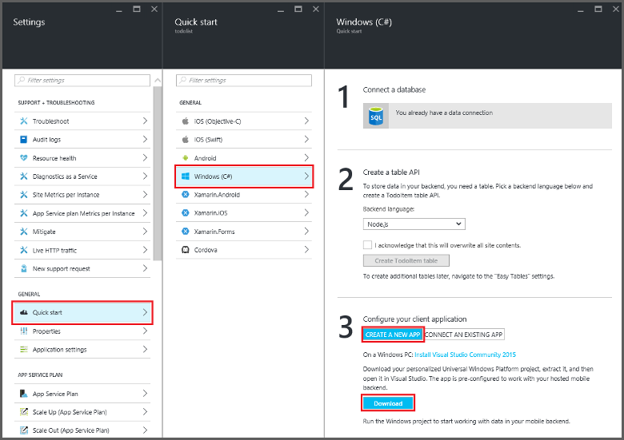

<properties
    pageTitle="Criar uma plataforma de Windows Universal (UWP) que usa em aplicativos Mobile | Microsoft Azure"
    description="Siga este tutorial para começar a usar usando o aplicativo móvel Azure back-ends para desenvolvimento de aplicativo de plataforma de Windows Universal (UWP) no Visual Basic, c# ou JavaScript."
    services="app-service\mobile"
    documentationCenter="windows"
    authors="adrianhall"
    manager="erikre"
    editor=""/>

<tags
    ms.service="app-service-mobile"
    ms.workload="mobile"
    ms.tgt_pltfrm="mobile-windows"
    ms.devlang="dotnet"
    ms.topic="hero-article"
    ms.date="10/01/2016"
    ms.author="adrianha"/>

#Criar um aplicativo do Windows

[AZURE.INCLUDE [app-service-mobile-selector-get-started](../../includes/app-service-mobile-selector-get-started.md)]

##Visão geral

Este tutorial mostra como adicionar um serviço baseado em nuvem back-end a um aplicativo de plataforma de Windows Universal (UWP). Para obter mais informações, consulte [o que são aplicativos Mobile](app-service-mobile-value-prop.md). Estas são capturas de tela do aplicativo concluída:

   
Executando em uma área de trabalho. 

  
Em execução em um telefone

Concluir este tutorial é um pré-requisito para todos os outros tutoriais de aplicativo móvel do UWP aplicativos. 

##Pré-requisitos

Para concluir este tutorial, você precisa do seguinte:

* Uma conta do Azure active. Se você não tiver uma conta, você pode inscrever-se para uma avaliação gratuita do Azure e obter até 10 livre em aplicativos móvel que você pode continuar usando mesmo após o período de avaliação. Para obter detalhes, consulte [Avaliação gratuita do Azure](https://azure.microsoft.com/pricing/free-trial/).

* [2015 de comunidade do Visual Studio] ou uma versão posterior.

>[AZURE.NOTE] Se você deseja começar a usar o serviço de aplicativo do Azure antes de se inscrever para uma conta do Azure, vá para [Experimentar o serviço de aplicativo](https://tryappservice.azure.com/?appServiceName=mobile). Lá, você pode criar imediatamente um aplicativo móvel starter curta duração no aplicativo de serviço — sem cartão de crédito necessários e nenhum compromissos.

##Criar um novo back-end do aplicativo do Azure Mobile

Siga estas etapas para criar um novo back-end do aplicativo Mobile.

[AZURE.INCLUDE [app-service-mobile-dotnet-backend-create-new-service](../../includes/app-service-mobile-dotnet-backend-create-new-service.md)]

Agora você tem provisionado um back-end do aplicativo do Azure Mobile que pode ser usado por seus aplicativos de cliente móvel. Em seguida, você irá baixar um projeto de servidor para um simples "lista de tarefas pendentes" back-end e publicá-lo do Azure.

## Configurar o project server

[AZURE.INCLUDE [app-service-mobile-configure-new-backend.md](../../includes/app-service-mobile-configure-new-backend.md)]

##Baixar e executar o projeto de cliente

Depois de ter configurado seu back-end do aplicativo móvel, você pode criar um novo aplicativo de cliente ou modificar um aplicativo existente para se conectar ao Azure. Nesta seção, você baixar um projeto de modelo de aplicativo UWP que é personalizado para se conectar ao seu back-end do aplicativo Mobile.

1. De volta a lâmina de **início rápido** do seu back-end do aplicativo móvel, clique em **criar um novo aplicativo** > **Download**, em seguida, extrair o projeto compactado arquivos para seu computador local.

    

3. (Opcional) Adicione o projeto de aplicativo UWP à mesma solução como o project server. Isso facilita a depurar e testar o aplicativo e back-end na mesma solução Visual Studio, se você optar por fazer isso. Para adicionar um projeto de aplicativo UWP à solução, você deve estar usando o Visual Studio 2015 ou uma versão posterior.

4. Com o aplicativo UWP como o projeto de inicialização, pressione a tecla F5 para implantar e executar o aplicativo.

5. No aplicativo, digite o texto significativo, como *concluída o tutorial*, na caixa de texto **Inserir um TodoItem** e clique em **Salvar**.

    

    Isso envia uma solicitação de POSTAGEM para o novo aplicativo móvel back-end que está hospedado no Azure.

6. (Opcional) Interromper o aplicativo e reinicie-o em um dispositivo diferente ou emulador móvel.

    

    Observe que dados salvos da etapa anterior são carregados do Azure depois que o aplicativo UWP for iniciado. 

##Próximas etapas

* [Adicione autenticação ao seu aplicativo](app-service-mobile-windows-store-dotnet-get-started-users.md)  
  Saiba como autenticar os usuários do aplicativo com um provedor de identidade.

* [Adicionar notificações por push para o seu aplicativo](app-service-mobile-windows-store-dotnet-get-started-push.md)  
  Saiba como adicionar push notificações de suporte para o seu aplicativo e configurar seu back-end do aplicativo móvel para usar Hubs de notificação do Azure para enviar notificações por push.

* [Habilitar a sincronização offline para seu aplicativo](app-service-mobile-windows-store-dotnet-get-started-offline-data.md)  
  Saiba como adicionar suporte offline seu aplicativo usando um back-end do aplicativo Mobile. Sincronização offline permite que os usuários finais interagir com um aplicativo móvel&mdash;exibir, adicionar ou modificar dados&mdash;mesmo quando não há nenhuma conexão de rede.

<!-- Anchors. -->
<!-- Images. -->
<!-- URLs. -->
[Mobile App SDK]: http://go.microsoft.com/fwlink/?LinkId=257545
[Azure portal]: https://portal.azure.com/
[Comunidade do Visual Studio de 2015]: https://go.microsoft.com/fwLink/p/?LinkID=534203
