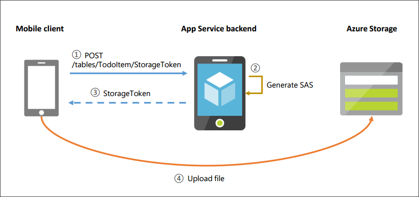

<properties
    pageTitle="Conectar ao armazenamento do Azure em seu aplicativo de Xamarin.Forms"
    description="Adicionar imagens para o aplicativo móvel do todo lista Xamarin.Forms conectando-se ao armazenamento de blob do Microsoft Azure"
    documentationCenter="xamarin"
    authors="adrianhall"
    manager="erikre"
    editor=""
    services="app-service\mobile"/>

<tags
    ms.service="app-service-mobile"
    ms.workload="mobile"
    ms.tgt_pltfrm="mobile-xamarin-ios"
    ms.devlang="dotnet"
    ms.topic="article"
    ms.date="10/01/2016"
    ms.author="adrianha"/>

#Conectar ao armazenamento do Azure em seu aplicativo de Xamarin.Forms

## Visão geral

O Azure Mobile aplicativos cliente e servidor SDK suportam sincronização offline de dados estruturados com operações CRUD contra o ponto de extremidade de /tables. Geralmente esses dados são armazenados em um banco de dados ou repositório semelhante, e geralmente esses armazenamentos de dados não podem armazenar dados binários grandes com eficiência. Além disso, alguns aplicativos tem relacionadas dados que estão armazenados em outro local (por exemplo, armazenamento de blob, compartilhamentos de arquivos), e é útil poder criar associações entre registros no ponto de extremidade de /tables e outros dados.

Este tópico mostra como adicionar suporte para imagens para o lista de todo de aplicativos Mobile início rápido. Primeiro você deve concluir o tutorial [criar um aplicativo de Xamarin.Forms].

Neste tutorial, você irá criar uma conta de armazenamento e adicionar uma cadeia de conexão ao seu back-end do aplicativo Mobile. Você irá adicionar um novo herdam o novo tipo de aplicativos Mobile `StorageController<T>` ao seu projeto do servidor.

>[AZURE.TIP] Este tutorial tem um [exemplo de acompanhamento](https://azure.microsoft.com/documentation/samples/app-service-mobile-dotnet-todo-list-files/) disponível, que pode ser implantado em sua própria conta do Azure. 

## Pré-requisitos

* Conclua o tutorial de [criar um aplicativo de Xamarin.Forms] , que lista outros pré-requisitos. Este artigo usa o aplicativo concluído a partir desse tutorial.

>[AZURE.NOTE] Se você deseja começar a usar o serviço de aplicativo do Azure antes de se inscrever para uma conta do Azure, vá para [Experimentar o serviço de aplicativo](https://tryappservice.azure.com/?appServiceName=mobile). Lá, você pode criar imediatamente um aplicativo móvel starter curta duração no aplicativo de serviço — sem cartão de crédito necessários e nenhum compromissos.

## Criar uma conta de armazenamento

1. Crie uma conta de armazenamento seguindo o tutorial [criar uma conta de armazenamento do Azure]. 

2. No portal do Azure, navegue até sua conta de armazenamento recém-criado e clique no ícone de **teclas** . Copie a **cadeia de Conexão principal**.

3. Navegue até seu back-end do aplicativo móvel. Em **Todas as configurações** -> **Configurações do aplicativo** -> **Cadeias de caracteres de Conexão**, crie uma nova chave denominada `MS_AzureStorageAccountConnectionString` e use o valor copiado da sua conta de armazenamento. Use **personalizado** como o tipo de chave.

## Adicionar um controlador de armazenamento no servidor

Você precisa adicionar um novo controlador ao seu projeto do servidor que irá responder a solicitações de um token SAS para armazenamento do Azure, bem como retornar uma lista de arquivos que correspondem a um registro:

- [Adicionar um controlador de armazenamento ao seu projeto de servidor](#add-controller-code)
- [Rotas registradas pelo controlador de armazenamento](#routes-registered)
- [Comunicação de cliente e servidor](#client-communication)

###Adicionar um controlador de armazenamento ao seu projeto de servidor

1. No Visual Studio, abra o projeto de servidor .NET. Adicione o pacote do Nuget [Microsoft.Azure.Mobile.Server.Files]. Certifique-se de selecionar **incluir pré-lançamento**.

2. No Visual Studio, abra o projeto de servidor .NET. Clique com botão direito na pasta de **controladores** e selecione **Adicionar** -> **controlador** -> **Web API 2 controlador - vazio**. Nomeie o controlador `TodoItemStorageController`.

3. Adicione o seguinte usando instruções:

        using Microsoft.Azure.Mobile.Server.Files;
        using Microsoft.Azure.Mobile.Server.Files.Controllers;

4. Alterar a classe base para `StorageController`:
    
        public class TodoItemStorageController : StorageController<TodoItem>

5. Adicione os seguintes métodos à classe:

        [HttpPost]
        [Route("tables/TodoItem/{id}/StorageToken")]
        public async Task<HttpResponseMessage> PostStorageTokenRequest(string id, StorageTokenRequest value)
        {
            StorageToken token = await GetStorageTokenAsync(id, value);

            return Request.CreateResponse(token);
        }

        // Get the files associated with this record
        [HttpGet]
        [Route("tables/TodoItem/{id}/MobileServiceFiles")]
        public async Task<HttpResponseMessage> GetFiles(string id)
        {
            IEnumerable<MobileServiceFile> files = await GetRecordFilesAsync(id);

            return Request.CreateResponse(files);
        }

        [HttpDelete]
        [Route("tables/TodoItem/{id}/MobileServiceFiles/{name}")]
        public Task Delete(string id, string name)
        {
            return base.DeleteFileAsync(id, name);
        }

6. Atualize a configuração de API da Web para configurar o roteamento de atributo. Em **Startup.MobileApp.cs**, adicione a seguinte linha para o `ConfigureMobileApp()` método, após a definição do `config` variável:

        config.MapHttpAttributeRoutes();

7. Publica seu projeto de servidor para seu back-end do aplicativo móvel.

###Rotas registradas pelo controlador de armazenamento

O novo `TodoItemStorageController` expõe dois sub-recursos sob o registro que ele gerencia:

- StorageToken

    + HTTP POST: Cria um token de armazenamento
    
        `/tables/TodoItem/{id}/MobileServiceFiles`
    
- MobileServiceFiles

    + GET HTTP: Recupera uma lista de arquivos associado ao registro
    
        `/tables/TodoItem/{id}/MobileServiceFiles`

    + Excluir de HTTP: Exclui o arquivo especificado no identificador do recurso de arquivo
    
        `/tables/TodoItem/{id}/MobileServiceFiles/{fileid}`

###Comunicação de cliente e servidor

Observe que `TodoItemStorageController` *não* têm uma rota para carregar ou baixar um blob. Isso ocorre porque um cliente móvel interage com blob storage *diretamente* para realizar essas operações, após a primeira obtendo um token SAS (assinatura de acesso compartilhado) para acessar com segurança um determinado blob ou contêiner. Este é um design de arquitetura importante, como caso contrário, acesso ao armazenamento limita a escalabilidade e a disponibilidade de back-end móvel. Em vez disso, conectando-se diretamente ao armazenamento do Azure, o cliente móvel pode aproveitar seus recursos como partição automática e distribuição geográfica.

Uma assinatura de acesso compartilhado fornece acesso delegado a recursos em sua conta de armazenamento. Isso significa que você pode conceder a que um cliente limitado permissões para objetos em sua conta de armazenamento por um determinado período de tempo e com um conjunto específico de permissões, sem precisar compartilhar suas chaves de acesso de conta. Para saber mais, consulte [Noções básicas sobre assinaturas de acesso compartilhado].

O diagrama a seguir mostra as interações de cliente e servidor. Antes de carregar um arquivo, o cliente solicita um token SAS do serviço. O serviço usa a cadeia de conexão de armazenamento para gerar uma novas associações de segurança, que ela retorna para o cliente. As associações de segurança é tempo limitado e restringe permissões a um arquivo específico ou contêiner. O cliente móvel usa esta SAS e o SDK do cliente de armazenamento do Azure para carregar o arquivo para armazenamento de blob.

## Atualizar seu aplicativo cliente para adicionar o suporte de imagem

Abra o projeto de início rápido do Xamarin.Forms no Visual Studio ou Xamarin Studio. Você irá instalar pacotes Nuget e atualizar o projeto de biblioteca portátil e o iOS, Android e Windows projetos de cliente:

- [Adicionar pacotes Nuget](#add-nuget)
- [Adicionar interface IPlatform](#add-iplatform)
- [Adicionar classe de FileHelper](#add-filehelper)
- [Adicionar um manipulador de sincronização de arquivo](#file-sync-handler)
- [Atualizar TodoItemManager](#update-todoitemmanager)
- [Adicionar um modo de exibição de detalhes](#add-details-view)
- [Atualizar o modo de exibição principal](#update-main-view)
- [Atualizar o projeto Android](#update-android), [projeto de iOS](#update-ios), [projeto do Windows](#update-windows)

>[AZURE.NOTE] Este tutorial só contém instruções para o iOS, Android e plataformas da Windows Store, não o Windows Phone.

###Adicionar pacotes Nuget

A solução de atalho e selecione **Gerenciar Nuget pacotes para solução**. Adicione os seguintes pacotes Nuget para **todos os** projetos na solução. Certifique-se de verificar **incluir pré-lançamento**.

  - [Microsoft.Azure.Mobile.Client.Files]

  - [Microsoft.Azure.Mobile.Client.SQLiteStore]

  - [PCLStorage]

Para sua conveniência, este exemplo usa a biblioteca de [PCLStorage] , mas ele não é requerido pelo SDK do cliente de aplicativos do Azure Mobile.

[PCLStorage]: https://www.nuget.org/packages/PCLStorage/

###Adicionar interface IPlatform

Criar uma nova interface `IPlatform` no projeto da biblioteca de portátil principal. Isso segue o padrão de [Xamarin.Forms DependencyService] para carregar a classe direita específico da plataforma em tempo de execução. Mais tarde, você adicionará implementações específico da plataforma em todos os projetos de cliente.

1. Adicione o seguinte usando instruções:

        using Microsoft.WindowsAzure.MobileServices.Files;
        using Microsoft.WindowsAzure.MobileServices.Files.Metadata;
        using Microsoft.WindowsAzure.MobileServices.Sync;

2. Substitua a implementação com o seguinte:

        public interface IPlatform
        {
            Task <string> GetTodoFilesPathAsync();

            Task<IMobileServiceFileDataSource> GetFileDataSource(MobileServiceFileMetadata metadata);

            Task<string> TakePhotoAsync(object context);

            Task DownloadFileAsync<T>(IMobileServiceSyncTable<T> table, MobileServiceFile file, string filename);
        }

###Adicionar classe de FileHelper

1. Criar uma nova classe `FileHelper` no projeto da biblioteca de portátil principal. Adicione o seguinte usando instruções:

        using System.IO;
        using PCLStorage;
        using System.Threading.Tasks;
        using Xamarin.Forms;

2. Adicione a definição de classe:

        public class FileHelper
        {
            public static async Task<string> CopyTodoItemFileAsync(string itemId, string filePath)
            {
                IFolder localStorage = FileSystem.Current.LocalStorage;

                string fileName = Path.GetFileName(filePath);
                string targetPath = await GetLocalFilePathAsync(itemId, fileName);

                var sourceFile = await localStorage.GetFileAsync(filePath);
                var sourceStream = await sourceFile.OpenAsync(FileAccess.Read);

                var targetFile = await localStorage.CreateFileAsync(targetPath, CreationCollisionOption.ReplaceExisting);

                using (var targetStream = await targetFile.OpenAsync(FileAccess.ReadAndWrite)) {
                    await sourceStream.CopyToAsync(targetStream);
                }

                return targetPath;
            }

            public static async Task<string> GetLocalFilePathAsync(string itemId, string fileName)
            {
                IPlatform platform = DependencyService.Get<IPlatform>();

                string recordFilesPath = Path.Combine(await platform.GetTodoFilesPathAsync(), itemId);

                    var checkExists = await FileSystem.Current.LocalStorage.CheckExistsAsync(recordFilesPath);
                    if (checkExists == ExistenceCheckResult.NotFound) {
                        await FileSystem.Current.LocalStorage.CreateFolderAsync(recordFilesPath, CreationCollisionOption.ReplaceExisting);
                    }

                return Path.Combine(recordFilesPath, fileName);
            }

            public static async Task DeleteLocalFileAsync(Microsoft.WindowsAzure.MobileServices.Files.MobileServiceFile fileName)
            {
                string localPath = await GetLocalFilePathAsync(fileName.ParentId, fileName.Name);
                var checkExists = await FileSystem.Current.LocalStorage.CheckExistsAsync(localPath);

                if (checkExists == ExistenceCheckResult.FileExists) {
                    var file = await FileSystem.Current.LocalStorage.GetFileAsync(localPath);
                    await file.DeleteAsync();
                }
            }
        }

###Adicionar um manipulador de sincronização de arquivo

Criar uma nova classe `TodoItemFileSyncHandler` no projeto da biblioteca de portátil principal. Essa classe contém retornos de chamada de SDK do Azure para notificar seu código quando um arquivo for adicionado ou removido.

O SDK do cliente do Azure Mobile não armazena realmente qualquer arquivo: o SDK cliente invoca a implementação de `IFileSyncHandler` que por sua vez determina se e como os arquivos são armazenados no dispositivo local.

1. Adicione o seguinte usando instruções:

        using System.Threading.Tasks;
        using Microsoft.WindowsAzure.MobileServices.Files.Sync;
        using Microsoft.WindowsAzure.MobileServices.Files;
        using Microsoft.WindowsAzure.MobileServices.Files.Metadata;
        using Xamarin.Forms;

2. Substitua a definição de classe com o seguinte: 

        public class TodoItemFileSyncHandler : IFileSyncHandler
        {
            private readonly TodoItemManager todoItemManager;

            public TodoItemFileSyncHandler(TodoItemManager itemManager)
            {
                this.todoItemManager = itemManager;
            }

            public Task<IMobileServiceFileDataSource> GetDataSource(MobileServiceFileMetadata metadata)
            {
                IPlatform platform = DependencyService.Get<IPlatform>();
                return platform.GetFileDataSource(metadata);
            }

            public async Task ProcessFileSynchronizationAction(MobileServiceFile file, FileSynchronizationAction action)
            {
                if (action == FileSynchronizationAction.Delete) {
                    await FileHelper.DeleteLocalFileAsync(file);
                }
                else { // Create or update. We're aggressively downloading all files.
                    await this.todoItemManager.DownloadFileAsync(file);
                }
            }
        }

###Atualizar TodoItemManager

1. Em **TodoItemManager.cs**, Tire comentários a linha `#define OFFLINE_SYNC_ENABLED`.

2. Em **TodoItemManager.cs**, adicione o seguinte usando instruções:

        using System.IO;
        using Xamarin.Forms;
        using Microsoft.WindowsAzure.MobileServices.Files;
        using Microsoft.WindowsAzure.MobileServices.Files.Sync;
        using Microsoft.WindowsAzure.MobileServices.Eventing;

3. No construtor de `TodoItemManager`, adicione o seguinte após a chamada para `DefineTable()`:

        // Initialize file sync
        this.client.InitializeFileSyncContext(new TodoItemFileSyncHandler(this), store);

4. No construtor, substituir a chamada para `InitializeAsync` com o seguinte. Isso garante que existem retornos de chamada quando os registros forem modificados no armazenamento local. O recurso de sincronização de arquivo usa esses retornos de chamada para disparar seu manipulador de sincronização de arquivo.

        this.client.SyncContext.InitializeAsync(store, StoreTrackingOptions.NotifyLocalAndServerOperations);

5. Em `SyncAsync()`, adicione o seguinte após a chamada para `PushAsync()`:

        await this.todoTable.PushFileChangesAsync();

6. Adicione os seguintes métodos para `TodoItemManager`:

        internal async Task DownloadFileAsync(MobileServiceFile file)
        {
            var todoItem = await todoTable.LookupAsync(file.ParentId);
            IPlatform platform = DependencyService.Get<IPlatform>();

            string filePath = await FileHelper.GetLocalFilePathAsync(file.ParentId, file.Name); 
            await platform.DownloadFileAsync(this.todoTable, file, filePath);
        }

        internal async Task<MobileServiceFile> AddImage(TodoItem todoItem, string imagePath)
        {
            string targetPath = await FileHelper.CopyTodoItemFileAsync(todoItem.Id, imagePath);
            return await this.todoTable.AddFileAsync(todoItem, Path.GetFileName(targetPath));
        }

        internal async Task DeleteImage(TodoItem todoItem, MobileServiceFile file)
        {
            await this.todoTable.DeleteFileAsync(file);
        }

        internal async Task<IEnumerable<MobileServiceFile>> GetImageFilesAsync(TodoItem todoItem)
        {
            return await this.todoTable.GetFilesAsync(todoItem);
        }

###Adicionar um modo de exibição de detalhes

Nesta seção, você irá adicionar um novo modo de exibição de detalhes de um item de todo. O modo de exibição é criado quando o usuário seleciona um item de todo e permite novas imagens a ser adicionado a um item.

1. Adicione uma nova classe **TodoItemImage** para o projeto de biblioteca portátil com implementação a seguir:

        public class TodoItemImage : INotifyPropertyChanged
        {
            private string name;
            private string uri;

            public MobileServiceFile File { get; private set; }

            public string Name
            {
                get { return name; }
                set
                {
                    name = value;
                    OnPropertyChanged(nameof(Name));
                }
            }

            public string Uri
            {
                get { return uri; }      
                set
                {
                    uri = value;
                    OnPropertyChanged(nameof(Uri));
                }
            }

            public TodoItemImage(MobileServiceFile file, TodoItem todoItem)
            {
                Name = file.Name;
                File = file;

                FileHelper.GetLocalFilePathAsync(todoItem.Id, file.Name).ContinueWith(x => this.Uri = x.Result);
            }

            public event PropertyChangedEventHandler PropertyChanged;

            private void OnPropertyChanged(string propertyName)
            {
                PropertyChanged?.Invoke(this, new PropertyChangedEventArgs(propertyName));
            }
        }

2. Edite **App.cs**. Substituir a inicialização do `MainPage` com o seguinte:
    
        MainPage = new NavigationPage(new TodoList());

3. Em **App.cs**, adicione a propriedade a seguir:

        public static object UIContext { get; set; }

4. Clique com botão direito do projeto de biblioteca portátil e selecione **Adicionar** -> **Novo Item** -> **entre plataformas** -> **Página de Xaml de formulários**. Nome do modo de exibição `TodoItemDetailsView`.

5. Abra **TodoItemDetailsView.xaml** e substitua o corpo da ContentPage com o seguinte:

          <Grid>
            <Grid.RowDefinitions>
              <RowDefinition Height="Auto"/>
              <RowDefinition Height="Auto"/>
              <RowDefinition Height="*"/>
            </Grid.RowDefinitions>
            <Button Clicked="OnAdd" Text="Add image"></Button>
            <ListView x:Name="imagesList"
                      ItemsSource="{Binding Images}"
                      IsPullToRefreshEnabled="false"
                      Grid.Row="2">
              <ListView.ItemTemplate>
                <DataTemplate>
                  <ImageCell ImageSource="{Binding Uri}"
                             Text="{Binding Name}">
                  </ImageCell>
                </DataTemplate>
              </ListView.ItemTemplate>
            </ListView>
          </Grid>

6. Editar **TodoItemDetailsView.xaml.cs** e adicione o seguinte usando instruções:

        using System.Collections.ObjectModel;
        using Microsoft.WindowsAzure.MobileServices.Files;

7. Substituir a implementação de `TodoItemDetailsView` com o seguinte:

        public partial class TodoItemDetailsView : ContentPage
        {
            private TodoItemManager manager;

            public TodoItem TodoItem { get; set; }        
            public ObservableCollection<TodoItemImage> Images { get; set; }

            public TodoItemDetailsView(TodoItem todoItem, TodoItemManager manager)
            {
                InitializeComponent();
                this.Title = todoItem.Name;

                this.TodoItem = todoItem;
                this.manager = manager;

                this.Images = new ObservableCollection<TodoItemImage>();
                this.BindingContext = this;
            }

            public async Task LoadImagesAsync()
            {
                IEnumerable<MobileServiceFile> files = await this.manager.GetImageFilesAsync(TodoItem);
                this.Images.Clear();

                foreach (var f in files) {
                    var todoImage = new TodoItemImage(f, this.TodoItem);
                    this.Images.Add(todoImage);
                }
            }

            public async void OnAdd(object sender, EventArgs e)
            {
                IPlatform mediaProvider = DependencyService.Get<IPlatform>();
                string sourceImagePath = await mediaProvider.TakePhotoAsync(App.UIContext);

                if (sourceImagePath != null) {
                    MobileServiceFile file = await this.manager.AddImage(this.TodoItem, sourceImagePath);

                    var image = new TodoItemImage(file, this.TodoItem);
                    this.Images.Add(image);
                }
            }
        }

###Atualizar o modo de exibição principal 

Atualize o modo de exibição principal para abrir o modo de exibição de detalhes quando um item de todo é selecionado.

No **TodoList.xaml.cs**, substitua a implementação de `OnSelected` com o seguinte:

    public async void OnSelected(object sender, SelectedItemChangedEventArgs e)
    {
        var todo = e.SelectedItem as TodoItem;

        if (todo != null) {
            var detailsView = new TodoItemDetailsView(todo, manager);
            await detailsView.LoadImagesAsync();
            await Navigation.PushAsync(detailsView);
        }

        todoList.SelectedItem = null;
    }

###Atualizar o projeto Android

Adicione código específico da plataforma para o projeto Android, incluindo o código para download de um arquivo e usando a câmera para capturar uma nova imagem. 

Este código usa a Xamarin.Forms [DependencyService](https://developer.xamarin.com/guides/xamarin-forms/dependency-service/) para carregar a classe direita específico da plataforma em tempo de execução.

1. Adicione o componente **Xamarin.Mobile** ao projeto Android.

2. Adicione uma nova classe `DroidPlatform` com a implementação a seguir. Substitua "YourNamespace" namespace principal do seu projeto.

        using System;
        using System.IO;
        using System.Threading.Tasks;
        using Android.Content;
        using Microsoft.WindowsAzure.MobileServices.Files;
        using Microsoft.WindowsAzure.MobileServices.Files.Metadata;
        using Microsoft.WindowsAzure.MobileServices.Files.Sync;
        using Microsoft.WindowsAzure.MobileServices.Sync;
        using Xamarin.Media;

        [assembly: Xamarin.Forms.Dependency(typeof(YourNamespace.Droid.DroidPlatform))]
        namespace YourNamespace.Droid
        {
            public class DroidPlatform : IPlatform
            {
                public async Task DownloadFileAsync<T>(IMobileServiceSyncTable<T> table, MobileServiceFile file, string filename)
                {
                    var path = await FileHelper.GetLocalFilePathAsync(file.ParentId, file.Name);
                    await table.DownloadFileAsync(file, path);
                }

                public async Task<IMobileServiceFileDataSource> GetFileDataSource(MobileServiceFileMetadata metadata)
                {
                    var filePath = await FileHelper.GetLocalFilePathAsync(metadata.ParentDataItemId, metadata.FileName);
                    return new PathMobileServiceFileDataSource(filePath);
                }

                public async Task<string> TakePhotoAsync(object context)
                {
                    try {
                        var uiContext = context as Context;
                        if (uiContext != null) {
                            var mediaPicker = new MediaPicker(uiContext);
                            var photo = await mediaPicker.TakePhotoAsync(new StoreCameraMediaOptions());

                            return photo.Path;
                        }
                    }
                    catch (TaskCanceledException) {
                    }

                    return null;
                }

                public Task<string> GetTodoFilesPathAsync()
                {
                    string appData = Environment.GetFolderPath(Environment.SpecialFolder.MyDocuments);
                    string filesPath = Path.Combine(appData, "TodoItemFiles");

                    if (!Directory.Exists(filesPath)) {
                        Directory.CreateDirectory(filesPath);
                    }

                    return Task.FromResult(filesPath);
                }
            }
        }

3. Edite **MainActivity.cs**. Em `OnCreate`, adicione o seguinte antes da chamada para `LoadApplication()`:

        App.UIContext = this;

###Atualizar o projeto do iOS

Adicione código específico da plataforma para o projeto do iOS.

1. Adicione o componente **Xamarin.Mobile** ao projeto iOS.

2. Adicione uma nova classe `TouchPlatform` com a implementação a seguir. Substitua "YourNamespace" namespace principal do seu projeto.

        using System;
        using System.Collections.Generic;
        using System.IO;
        using System.Text;
        using System.Threading.Tasks;
        using Microsoft.WindowsAzure.MobileServices.Files;
        using Microsoft.WindowsAzure.MobileServices.Files.Metadata;
        using Microsoft.WindowsAzure.MobileServices.Files.Sync;
        using Microsoft.WindowsAzure.MobileServices.Sync;
        using Xamarin.Media;

        [assembly: Xamarin.Forms.Dependency(typeof(YourNamespace.iOS.TouchPlatform))]
        namespace YourNamespace.iOS
        {
            class TouchPlatform : IPlatform
            {
                public async Task DownloadFileAsync<T>(IMobileServiceSyncTable<T> table, MobileServiceFile file, string filename)
                {
                    var path = await FileHelper.GetLocalFilePathAsync(file.ParentId, file.Name);
                    await table.DownloadFileAsync(file, path);
                }

                public async Task<IMobileServiceFileDataSource> GetFileDataSource(MobileServiceFileMetadata metadata)
                {
                    var filePath = await FileHelper.GetLocalFilePathAsync(metadata.ParentDataItemId, metadata.FileName);
                    return new PathMobileServiceFileDataSource(filePath);
                }

                public async Task<string> TakePhotoAsync(object context)
                {
                    try {
                        var mediaPicker = new MediaPicker();
                        var mediaFile = await mediaPicker.PickPhotoAsync();
                        return mediaFile.Path;
                    }
                    catch (TaskCanceledException) {
                        return null;
                    }
                }

                public Task<string> GetTodoFilesPathAsync()
                {
                    string filesPath = Path.Combine(Environment.GetFolderPath(Environment.SpecialFolder.MyDocuments), "TodoItemFiles");

                    if (!Directory.Exists(filesPath)) {
                        Directory.CreateDirectory(filesPath);
                    }

                    return Task.FromResult(filesPath);
                }
            }
        }

3. Editar **AppDelegate.cs** e Tire comentários a chamada para `SQLitePCL.CurrentPlatform.Init()`.

###Atualizar o projeto do Windows

1. Instale a extensão do Visual Studio [SQLite para Windows 8.1](http://go.microsoft.com/fwlink/?LinkID=716919). Para obter mais informações, consulte o tutorial [Habilitar sincronização offline para seu aplicativo do Windows](app-service-mobile-windows-store-dotnet-get-started-offline-data.md). 

2. Editar **Package.appxmanifest** e verifique se o recurso de **Webcam** .

3. Adicione uma nova classe `WindowsStorePlatform` com a implementação a seguir. Substitua "YourNamespace" namespace principal do seu projeto.

        using System;
        using System.Threading.Tasks;
        using Microsoft.WindowsAzure.MobileServices.Files;
        using Microsoft.WindowsAzure.MobileServices.Files.Metadata;
        using Microsoft.WindowsAzure.MobileServices.Files.Sync;
        using Microsoft.WindowsAzure.MobileServices.Sync;
        using Windows.Foundation;
        using Windows.Media.Capture;
        using Windows.Storage;
        using YourNamespace;

        [assembly: Xamarin.Forms.Dependency(typeof(WinApp.WindowsStorePlatform))]
        namespace WinApp
        {
            public class WindowsStorePlatform : IPlatform
            {
                public async Task DownloadFileAsync<T>(IMobileServiceSyncTable<T> table, MobileServiceFile file, string filename)
                {
                    var path = await FileHelper.GetLocalFilePathAsync(file.ParentId, file.Name);
                    await table.DownloadFileAsync(file, path);
                }

                public async Task<IMobileServiceFileDataSource> GetFileDataSource(MobileServiceFileMetadata metadata)
                {
                    var filePath = await FileHelper.GetLocalFilePathAsync(metadata.ParentDataItemId, metadata.FileName);
                    return new PathMobileServiceFileDataSource(filePath);
                }

                public async Task<string> GetTodoFilesPathAsync()
                {
                    var storageFolder = ApplicationData.Current.LocalFolder;
                    var filePath = "TodoItemFiles";

                    var result = await storageFolder.TryGetItemAsync(filePath);

                    if (result == null) {
                        result = await storageFolder.CreateFolderAsync(filePath);
                    }

                    return result.Name; // later operations will use relative paths
                }

                public async Task<string> TakePhotoAsync(object context)
                {
                    try {
                        CameraCaptureUI dialog = new CameraCaptureUI();
                        Size aspectRatio = new Size(16, 9);
                        dialog.PhotoSettings.CroppedAspectRatio = aspectRatio;

                        StorageFile file = await dialog.CaptureFileAsync(CameraCaptureUIMode.Photo);
                        return file.Path;
                    }
                    catch (TaskCanceledException) {
                        return null;
                    }
                }
            }
        }

##Resumo

Este artigo descrita como usar o novo suporte de arquivo no cliente móvel do Azure e SDK do servidor para trabalhar com o armazenamento do Azure. 

- Crie uma conta de armazenamento e adicione a cadeia de conexão para seu back-end do aplicativo móvel. Somente o back-end possui a chave para o armazenamento do Azure: o cliente móvel solicita um token SAS (assinatura de acesso compartilhado) sempre que precisar acessar o armazenamento do Azure. Para saber mais sobre tokens de SAS no armazenamento do Azure, consulte [Noções básicas sobre assinaturas de acesso compartilhado].

- Criar um controlador que subclasses `StorageController` para manipular as solicitações de token de SAS e obter os arquivos que estão associados um registro. Por padrão, arquivos estão associados um registro usando a identificação de registro como parte do nome do contêiner; o comportamento pode ser personalizado, especificando uma implementação de `IContainerNameResolver`. A política de token de SAS também pode ser personalizada.

- O SDK do cliente do Azure Mobile não armazena realmente armazenar quaisquer dados de arquivo. Em vez disso, o cliente SDK invoca seu `IFileSyncHandler`, que decide como (e se) arquivos são armazenados no dispositivo local. O manipulador de sincronização é registrado da seguinte maneira:

        client.InitializeFileSync(new MyFileSyncHandler(), store);

      + `IFileSyncHandler.GetDataSource`é chamado quando o SDK do cliente do Azure Mobile precisa de dados de arquivo (por exemplo, como parte do processo de carregamento). Isso lhe dá a capacidade de gerenciar como (e se) arquivos são armazenados no dispositivo local e retornar informações quando necessário.

      + `IFileSyncHandler.ProcessFileSynchronizationAction`é chamado como parte do fluxo de sincronização de arquivo. Uma referência de arquivo e um valor de enumeração FileSynchronizationAction são fornecidas para que você possa decidir como seu aplicativo deve tratar esse evento (por exemplo, baixar automaticamente um arquivo quando ele é criado ou atualizado, excluindo um arquivo do dispositivo local quando esse arquivo é excluído no servidor).

- A `MobileServiceFile` pode ser usado no modo online ou offline, usando um `IMobileServiceTable` ou `IMobileServiceSyncTable`, respectivamente. No cenário offline, o carregamento ocorrerá quando o aplicativo chama `PushFileChangesAsync`. Isso faz com que a fila de operação offline sejam processados; para cada operação de arquivo, o cliente móvel do Azure SDK chamará o `GetDataSource` método na `IFileSyncHandler` instância para recuperar o conteúdo do arquivo para o carregamento.

- Para recuperar arquivos de um item, chame o ' GetFilesAsync` method on the  `IMobileServiceTable<T> ` or IMobileServiceSyncTable<T>` instância. Esse método retorna uma lista de arquivos associado ao item de dados fornecido. (Anotação: esta é uma operação *local* e retornará os arquivos com base no estado do objeto quando ele foi sincronizada pela última vez. Para obter uma lista atualizada de arquivos do servidor, você deve iniciar uma operação de sincronização primeiro.)

        IEnumerable<MobileServiceFile> files = await myTable.GetFilesAsync(myItem);

- O recurso de sincronização de arquivo usa notificações de alteração de registro no repositório local para recuperar os registros que o cliente recebeu como parte de uma operação de envio ou recepção. Isso é feito por ativar as notificações de locais e do servidor para o contexto de sincronização usando o `StoreTrackingOptions` parâmetro. 

        this.client.SyncContext.InitializeAsync(store, StoreTrackingOptions.NotifyLocalAndServerOperations);

      + Outras opções de controle de armazenamento estão disponíveis, como notificações somente local ou somente de servidor. Você pode adicionar ou proprietário retorno de chamada personalizado usando o `EventManager` propriedade de `IMobileServiceClient`:

            jobService.MobileService.EventManager.Subscribe<StoreOperationCompletedEvent>(StoreOperationEventHandler);

- É possível adicionar ou remover arquivos de um registro modificando armazenamento de blob diretamente, desde que a associação é obtida por meio de uma convenção de nomenclatura. No entanto, nesse caso você deve sempre **atualizar o carimbo de hora do registro quando os blobs associados são modificados**. O SDK do cliente móvel do Azure sempre atualiza um registro ao adicionar ou remover um arquivo. 

    O motivo para esse requisito é que alguns clientes móveis já terá o registro no armazenamento local. Quando esses clientes realizar uma recepção incremental, esse registro não será retornado e o cliente não irá consultar os novos arquivos associados. Para evitar esse problema, é recomendável que você atualize o carimbo de hora do registro ao executar qualquer alteração de armazenamento de blob que não usa o SDK do cliente móvel do Azure.

- O projeto de cliente usa o padrão de [Xamarin.Forms DependencyService] para carregar a classe direita específico da plataforma em tempo de execução. Neste exemplo, definimos uma interface `IPlatform` com implementações em cada um dos projetos específicos da plataforma.

<!-- URLs. -->

[Visual Studio Community 2013]: https://go.microsoft.com/fwLink/p/?LinkID=534203
[Criar um aplicativo de Xamarin.Forms]: app-service-mobile-xamarin-forms-get-started.md
[Xamarin.Forms DependencyService]: https://developer.xamarin.com/guides/xamarin-forms/dependency-service/
[Microsoft.Azure.Mobile.Client.Files]: https://www.nuget.org/packages/Microsoft.Azure.Mobile.Client.Files/
[Microsoft.Azure.Mobile.Client.SQLiteStore]: https://www.nuget.org/packages/Microsoft.Azure.Mobile.Client.SQLiteStore/
[Microsoft.Azure.Mobile.Server.Files]: https://www.nuget.org/packages/Microsoft.Azure.Mobile.Server.Files/
[Noções básicas sobre compartilhadas assinaturas de acesso]: ../storage/storage-dotnet-shared-access-signature-part-1.md
[Criar uma conta de armazenamento do Azure]:  ../storage/storage-create-storage-account.md#create-a-storage-account
