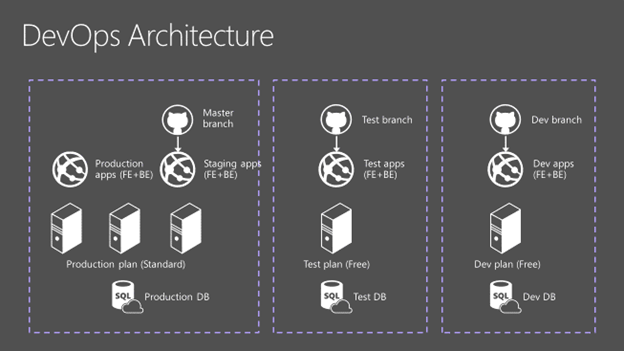
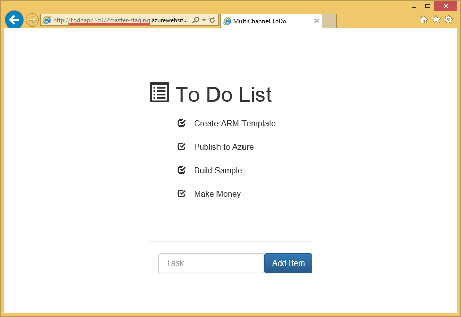

<properties
    pageTitle="Desenvolvimento de software ágil com o serviço de aplicativo do Azure"
    description="Aprenda a criar aplicativos complexos de grande escala com o serviço de aplicativo do Azure de uma forma que ofereça suporte ao desenvolvimento de software ágil."
    services="app-service"
    documentationCenter=""
    authors="cephalin"
    manager="wpickett"
    editor=""/>

<tags
    ms.service="app-service"
    ms.workload="na"
    ms.tgt_pltfrm="na"
    ms.devlang="na"
    ms.topic="article"
    ms.date="07/01/2016"
    ms.author="cephalin"/>

# Desenvolvimento de software ágil com o serviço de aplicativo do Azure #

Neste tutorial, você aprenderá a criar aplicativos complexos de grande escala com [O serviço de aplicativo do Azure](/services/app-service/) em uma forma que ofereça suporte ao [desenvolvimento de software ágil](https://en.wikipedia.org/wiki/Agile_software_development). Ele supõe que você já sabe como [implantar aplicativos complexos previsíveis no Azure](app-service-deploy-complex-application-predictably.md).

Limitações em processos técnicos podem muitas vezes fica no caminho das implementação bem-sucedida do metodologias agile. Serviço de aplicativo do Azure com recursos como contínua de [publicação](app-service-continuous-deployment.md), [ambientes temporários](web-sites-staged-publishing.md) (slots) e [monitoramento](web-sites-monitor.md), quando associado maneira sensata a coordenação e o gerenciamento de implantação no [Gerenciador de recursos do Azure](../azure-resource-manager/resource-group-overview.md), pode ser parte de uma ótima solução para desenvolvedores que adotar o desenvolvimento de software ágil.

A tabela a seguir é uma lista curta de requisitos associados desenvolvimento ágil e como o Azure services habilita cada um deles.

| Requisito | Como o Azure permite |
|---------------------------------------------------------------|--------------------------------------------------------------------------------------------------------------------------------------------------------------------------------------------------------------------------|
| -Criar com cada confirmação -Construir automaticamente e rápida | Quando configurado com implantação contínua, serviço de aplicativo do Azure pode funcionar como execução live compilações com base em uma ramificação de desenvolvimento. Sempre que o código será enviado para a ramificação, é criado automaticamente e em execução ao vivo no Azure.|
| -Fazer construções auto teste | Carregar testes, testes da web, etc., pode ser implantado com o modelo do Gerenciador de recursos do Azure.|
| -Executar testes em um clonar do ambiente de produção | Azure modelos do Gerenciador de recursos podem ser usados para criar clones do ambiente de produção Azure (incluindo as configurações do aplicativo, modelos de cadeia de conexão, dimensionamento, etc.) para testar rapidamente e previsíveis.|
| -Exibir resultado da versão mais recente facilmente | Implantação contínua no Azure de um repositório significa que você pode testar o novo código em um aplicativo ao vivo imediatamente após você confirmar suas alterações. |
| -Confirmar a ramificação principal diariamente -Automatizar a implantação | Integração contínua de um aplicativo de produção com ramificação principal de um repositório implanta automaticamente cada confirmação/direta à ramificação principal para produção. |

[AZURE.INCLUDE [app-service-web-to-api-and-mobile](../../includes/app-service-web-to-api-and-mobile.md)]

## O que você fará ##

Você orientará durante um fluxo de trabalho de desenvolvimento-teste-estágio-produção típico para publicar novas alterações no aplicativo de exemplo [ToDoApp](https://github.com/azure-appservice-samples/ToDoApp) , que consiste em dois [aplicativos web](/services/app-service/web/), um sendo um front-end (FE) e o outro sendo um API Web back-end (BE) e um [banco de dados SQL](/services/sql-database/). Você irá trabalhar com a arquitetura de implantação mostrada abaixo:

Para colocar a imagem em palavras:

-   A arquitetura de implantação é separada em três distintas ambientes (ou [grupos de recursos](../azure-resource-manager/resource-group-overview.md) no Azure), cada uma com seu próprio [plano de serviço de aplicativo](../app-service/azure-web-sites-web-hosting-plans-in-depth-overview.md), configurações de [escala](web-sites-scale.md) e banco de dados SQL. 
-   Cada ambiente pode ser gerenciada separadamente. Eles ainda podem existir em diferentes assinaturas.
-   Estágios e produção são implementadas como dois slots do aplicativo de serviço de aplicativo do mesmo. A ramificação mestre está configurado para a integração contínua com o slot preparação.
-   Quando uma confirmação para ramificação mestre é verificada no slot preparação (com dados de produção), o aplicativo de preparação verificado é trocado na produção slot [sem tempo de inatividade](web-sites-staged-publishing.md).

O ambiente de produção e preparação definido pelo modelo de em [ * &lt;repository_root >*/ARMTemplates/ProdandStage.json](https://github.com/azure-appservice-samples/ToDoApp/blob/master/ARMTemplates/ProdAndStage.json).

Os ambientes de desenvolvimento e teste são definidos pelo modelo de em [ * &lt;repository_root >*/ARMTemplates/Dev.json](https://github.com/azure-appservice-samples/ToDoApp/blob/master/ARMTemplates/Dev.json).

Você também usará a estratégia de ramificação típica, com código movendo a partir da ramificação de desenvolvimento até a ramificação de teste, em seguida, para a ramificação mestre (mover para cima na qualidade, por assim dizer).

 

## O que você vai precisar ##

-   Uma conta do Azure
-   Uma conta de [GitHub](https://github.com/)
-   Shell gito (instalado com o [GitHub para Windows](https://windows.github.com/)) - isso permite executar comandos gito tanto o PowerShell na mesma sessão 
-   Bits mais recentes do [PowerShell do Azure](https://github.com/Azure/azure-powershell/releases/download/0.9.4-June2015/azure-powershell.0.9.4.msi)
-   Noções básicas sobre o seguinte:
    -   Implantação de modelo do [Gerenciador de recursos do Azure](../azure-resource-manager/resource-group-overview.md) (Consulte também [implantar um aplicativo complexo previsíveis no Azure](app-service-deploy-complex-application-predictably.md))
    -   [Gito](http://git-scm.com/documentation)
    -   [PowerShell](https://technet.microsoft.com/library/bb978526.aspx)

> [AZURE.NOTE] Você precisará de uma conta do Azure para concluir este tutorial:
> + Você pode [Abrir uma conta do Azure gratuitamente](/pricing/free-trial/) - obtenha créditos você pode usar para experimentar serviços Azure pagos e até mesmo depois que eles são usados para cima você pode manter a conta e uso livre Azure serviços, como aplicativos Web.
> + Você pode [ativar os benefícios de assinante do Visual Studio](/pricing/member-offers/msdn-benefits-details/) - assinatura o Visual Studio oferece a você créditos todo mês que você pode usar para serviços do Azure pagos.
>
> Se você quiser começar a usar o serviço de aplicativo do Azure antes de se inscrever para uma conta do Azure, vá para [Experimentar o serviço de aplicativo](http://go.microsoft.com/fwlink/?LinkId=523751), onde você pode criar imediatamente um aplicativo da web de curta duração starter no aplicativo de serviço. Não há cartões de crédito obrigatório; Não há compromissos.

## Configurar o ambiente de produção ##

>[AZURE.NOTE] O script usado neste tutorial configurará automaticamente publicação contínua de seu repositório GitHub. Isso requer que suas credenciais GitHub já estão armazenadas no Azure, caso contrário, a implantação de scripts falhará quando tentar definir configurações de controle de origem para aplicativos da web. 
>
>Para armazenar suas credenciais GitHub no Azure, crie um aplicativo web no [Portal do Azure](https://portal.azure.com/) e [Configurar a implantação GitHub](app-service-continuous-deployment.md). Você só precisa fazer isso vez. 

Em um cenário de DevOps típico, você tiver um aplicativo que está em execução ao vivo no Azure e você quiser fazer alterações a ele por meio de publicação contínua. Neste cenário, você tem um modelo que você desenvolveu, testado e usado para implantar o ambiente de produção. Você irá configurá-lo nesta seção.

1.  Crie seu próprio bifurcação do repositório [ToDoApp](https://github.com/azure-appservice-samples/ToDoApp) . Para obter informações sobre como criar seu bifurcação, consulte [bifurcação um Repo](https://help.github.com/articles/fork-a-repo/). Depois que sua bifurcação é criada, você pode vê-lo em seu navegador.
 
    

2.  Abra uma sessão de gito Shell. Se você ainda não tem Shell gito, instale [GitHub para Windows](https://windows.github.com/) agora.

3.  Crie uma cópia local de sua bifurcação executando o seguinte comando:

        git clone https://github.com/<your_fork>/ToDoApp.git 

4.  Quando você tiver seu clonar local, navegue até * &lt;repository_root >*\ARMTemplates e executar o deploy.ps1 script da seguinte maneira:

        .\deploy.ps1 –RepoUrl https://github.com/<your_fork>/todoapp.git

4.  Quando solicitado, digite o nome de usuário desejado e a senha para acesso de banco de dados.

    Você deve ver o andamento de provisionamento de vários recursos de Azure. Quando terminar de implantação, o script iniciará o aplicativo no navegador e oferecem um alarme sonoro amigável.

    
 
    >[AZURE.TIP] Dê uma olhada * &lt;repository_root >*\ARMTemplates\Deploy.ps1, para ver como ele gera recursos com as identificações exclusivas. Você pode usar a mesma abordagem para criar clones da implantação do mesma sem se preocupar em conflito de nomes de recursos.
 
6.  Volta em sua sessão de gito Shell, execute:

        .\swap –Name ToDoApp<unique_string>master

    

7.  Quando o script for concluído, volte para navegar para o endereço do frontend (http://ToDoApp*&lt;unique_string >*master.azurewebsites.net/) para ver o aplicativo em execução em produção.
 
5.  Faça logon no [Portal do Azure](https://portal.azure.com/) e dê uma olhada no qual é criado.

    Você deve ser capaz de ver duas web apps no mesmo grupo de recursos, uma com o `Api` sufixo no nome. Se você examinar o modo de exibição de grupo de recursos, você também verá o banco de dados do SQL e servidor, o plano de serviço de aplicativo e os soquetes de teste para aplicativos da web. Percorra os diferentes recursos e compará-los com * &lt;repository_root >*\ARMTemplates\ProdAndStage.json para ver como eles são configurados no modelo.

    

Agora você configurou o ambiente de produção. Em seguida, você irá disparar uma nova atualização para o aplicativo.

## Criar desenvolvimento e testar ramificações ##

Agora que você tem um aplicativo complexo executando em produção no Azure, você fará uma atualização para o seu aplicativo de acordo com a metodologia agile. Nesta seção, você criará o desenvolvimento e testar ramificações que você precisará fazer as atualizações necessárias.

1.  Crie o ambiente de teste primeiro. Em sua sessão de gito Shell, execute os seguintes comandos para criar o ambiente para uma nova ramificação chamado **NewUpdate**. 

        git checkout -b NewUpdate
        git push origin NewUpdate 
        .\deploy.ps1 -TemplateFile .\Dev.json -RepoUrl https://github.com/<your_fork>/ToDoApp.git -Branch NewUpdate

1.  Quando solicitado, digite o nome de usuário desejado e a senha para acesso de banco de dados. 

    Quando terminar de implantação, o script iniciará o aplicativo no navegador e oferecem um alarme sonoro amigável. E apenas com essa aparência, agora você tem uma nova ramificação com seu próprio ambiente de teste. Reserve um tempo para examinar algumas coisas sobre esse ambiente de teste:

    -   Você pode criá-lo em qualquer assinatura do Azure. Isso significa que o ambiente de produção pode ser gerenciado separadamente do seu ambiente de teste.
    -   Ambiente de teste está em execução ao vivo no Azure.
    -   Ambiente de teste é idêntico ao ambiente de produção, exceto para os slots de preparação e as configurações de escala. Você pode saber isso porque essas são as únicas diferenças entre ProdandStage.json e Dev.json.
    -   Você pode gerenciar o seu ambiente de teste em seu próprio plano de serviço de aplicativo, com um nível de preços diferentes (como **livre**).
    -   Excluir esse ambiente de teste será tão simple quanto excluir o grupo de recursos. Você descobrirá como fazer esta [mais tarde](#delete).

2.  Vá para criar uma ramificação de desenvolvimento executando os seguintes comandos:

        git checkout -b Dev
        git push origin Dev
        .\deploy.ps1 -TemplateFile .\Dev.json -RepoUrl https://github.com/<your_fork>/ToDoApp.git -Branch Dev

3.  Quando solicitado, digite o nome de usuário desejado e a senha para acesso de banco de dados. 

    Reserve um tempo para examinar algumas coisas sobre esse ambiente de desenvolvimento: 

    -   Seu ambiente de desenvolvimento tem uma configuração idêntica ao ambiente de teste porque ele é implantado usando o mesmo modelo.
    -   Cada ambiente de desenvolvimento pode ser criada do desenvolvedor Azure assinatura, deixando o ambiente de teste para ser gerenciado separadamente.
    -   Seu ambiente de desenvolvimento está em execução ao vivo no Azure.
    -   Excluir o ambiente de desenvolvimento é tão simple quanto excluir o grupo de recursos. Você descobrirá como fazer esta [mais tarde](#delete).

>[AZURE.NOTE] Quando você tiver vários desenvolvedores trabalhando na nova atualização, cada um deles possa criar facilmente um ambiente de desenvolvimento dedicado e ramificação, fazendo o seguinte:
>
>1. Criar seu próprios bifurcação do repositório no GitHub (consulte [bifurcação um Repo](https://help.github.com/articles/fork-a-repo/)).
>2. Clonar a bifurcação em seu computador local
>3. Execute os mesmos comandos para criar seus próprios ramificação de desenvolvimento e ambiente.

Quando terminar, sua bifurcação GitHub deve ter três ramificações:

E você deve ter seis aplicativos web (três conjuntos de dois) em três grupos de recursos separados:

 
>[AZURE.NOTE] Observe que ProdandStage.json Especifica o ambiente de produção para usar o **padrão** preços camada, que é adequada para escalabilidade do aplicativo de produção.

## Criar e testar cada confirmação ##

Os arquivos de modelo ProdAndStage.json e Dev.json já especificam os parâmetros de controle de origem, que por padrão configura contínua de publicação para o aplicativo web. Portanto, cada confirmação à ramificação GitHub aciona uma implantação automática no Azure dessa ramificação. Vamos ver como a sua instalação funciona agora.

1.  Certifique-se de que você está na ramificação desenvolvimento do repositório local. Para fazer isso, execute o seguinte comando no Shell gito:

        git checkout Dev

2.  Faça uma alteração simples camada de interface do usuário do aplicativo alterando o código para usar listas de [inicialização](http://getbootstrap.com/components/) . Abrir * &lt;repository_root >*\src\MultiChannelToDo.Web\index.cshtml e fazer a alteração realçada abaixo:

    

    >[AZURE.NOTE] Se você não pode ler a imagem acima: 
    >
    >- Na linha 18, altere `check-list` para `list-group`.
    >- Na linha 19, altere `class="check-list-item"` para `class="list-group-item"`.

3.  Salve a alteração. Voltar no Shell gito, execute os seguintes comandos:

        cd <repository_root>
        git add .
        git commit -m "changed to bootstrap style"
        git push origin Dev
 
    Esses comandos gito são semelhantes às "verificação em seu código" em outro sistema de controle de origem como TFS. Quando você executa `git push`, a nova confirmação aciona um envio de código automática para o Azure, que recria o aplicativo para refletir a alteração no ambiente de desenvolvimento.

4.  Para verificar que ocorreu push este código ao seu ambiente de desenvolvimento, vá para blade de aplicativo web do seu ambiente de desenvolvimento e examine a parte de **implantação** . Você deve ser capaz de ver sua última mensagem de confirmação.

    

5.  A partir daí, clique em **Procurar** para ver a nova alteração no aplicativo ao vivo no Azure.

    

    Esta é uma alteração bastante secundária para o aplicativo. No entanto, muitas vezes novas alterações para um aplicativo web complexa tem efeitos de lado não intencionais e indesejáveis. Ser capaz de testar facilmente cada confirmação em compilações ao vivo permite pegar esses problemas antes de seus clientes veem-los.

Agora, você deve estar à vontade com a realização que, como desenvolvedor no projeto **NewUpdate** , você poderá facilmente criar um ambiente de desenvolvimento para si mesmo, e em seguida, criar cada confirmação e testar cada compilação.

## Mesclar código no ambiente de teste ##

Quando você estiver pronto para enviar seu código de ramificação de desenvolvimento até NewUpdate ramificação, ele é o processo de gito padrão:

1.  Mescle qualquer confirmações de novo no NewUpdate a ramificação de desenvolvimento no GitHub, como confirmações criados por outros desenvolvedores. Qualquer nova confirmação no GitHub será disparar um envio de código e criar no ambiente de desenvolvimento. Você pode, em seguida, verifique se que seu código na ramificação de desenvolvimento ainda funciona com os bits mais recentes de ramificação NewUpdate.

2.  Mescle todas as suas confirmações novos de ramificação de desenvolvimento em ramificação NewUpdate no GitHub. Esta ação aciona um envio de código e compilação no ambiente de teste. 

Novamente, observe que porque contínua implantação já foi configurada com estas ramificações gito, não é necessário realizar qualquer ação como executando integração construções. Você só precisa executar as práticas de controle de origem padrão usando gito e Azure executará todos os processos de compilação para você.

Agora, vamos enviar seu código para ramificação **NewUpdate** . No Shell de gito, execute os seguintes comandos:

    git checkout NewUpdate
    git pull origin NewUpdate
    git merge Dev
    git push origin NewUpdate

Pronto! 

Vá para a lâmina de aplicativo da web para seu ambiente de teste ver sua nova confirmação (mesclada ramificação NewUpdate) agora são enviada para o ambiente de teste. Em seguida, clique em **Procurar** para ver que a alteração de estilo está em execução ao vivo no Azure.

## Implantar a atualização de produção ##

Insistem código no ambiente de teste e produção deve se sentir não diferente do que você já tiver feito quando você direcionados código ao ambiente de teste. É muito simple. 

No Shell de gito, execute os seguintes comandos:

    git checkout master
    git pull origin master
    git merge NewUpdate
    git push origin master

Lembre-se de que com base na forma como o ambiente de teste e produção está configurado no ProdandStage.json, seu novo código será enviado para o slot de **teste** e está em execução lá. Portanto, se você navegar para URL do slot preparação, você verá o novo código em execução lá. Para fazer isso, execute o `Show-AzureWebsite` cmdlet do Shell de gito.

    Show-AzureWebsite -Name ToDoApp<unique_string>master -Slot Staging
 
E agora, depois de verificar a atualização no slot preparação, a única coisa que resta a fazer é trocá-lo em produção. No Shell de gito, basta execute os seguintes comandos:

    cd <repository_root>\ARMTemplates
    .\swap.ps1 -Name ToDoApp<unique_string>master

Parabéns! Você já publicado com êxito uma nova atualização para o seu aplicativo da web de produção. O que acontece mais é que você já fez-apenas criando facilmente desenvolvimento e teste ambientes e criar e testar cada confirmação. Esses são os blocos de construção fundamentais para desenvolvimento de software ágil.

## Excluir desenvolvimento e ambientes de teste ##

Porque você intencionalmente tiver desenvolvido seus ambientes de desenvolvimento e teste para grupos de recursos independente, é muito fácil excluí-las. Para excluir aquelas que você criou neste tutorial, GitHub ramificações tanto o Azure artefatos, basta executados os seguintes comandos no Shell gito:

    git branch -d Dev
    git push origin :Dev
    git branch -d NewUpdate
    git push origin :NewUpdate
    Remove-AzureRmResourceGroup -Name ToDoApp<unique_string>dev-group -Force -Verbose
    Remove-AzureRmResourceGroup -Name ToDoApp<unique_string>newupdate-group -Force -Verbose

## Resumo ##

Desenvolvimento de software ágil é necessário para muitas empresas que desejam adotar Azure como a sua plataforma de aplicativo. Neste tutorial, você aprendeu como criar e destaque para baixo réplicas exatas ou perto réplicas do ambiente de produção com facilidade, mesmo para aplicativos complexos. Você também aprendeu a aproveitar essa capacidade de criar um processo de desenvolvimento que pode criar e testar cada submissão única no Azure. Este tutorial Felizmente demonstrou a como você pode melhor usar o serviço de aplicativo do Azure e Gerenciador de recursos do Azure juntos para criar uma solução DevOps que atenta para metodologias agile. Em seguida, você pode criar esse cenário realizando técnicas avançadas de DevOps como [testes em produção](app-service-web-test-in-production-get-start.md). Para um cenário de teste em produção comuns, consulte [implantação de Flighting (teste beta) em um serviço de aplicativo do Azure](app-service-web-test-in-production-controlled-test-flight.md).

## Mais recursos ##

-   [Implantar um aplicativo complexo previsíveis no Azure](app-service-deploy-complex-application-predictably.md)
-   [Desenvolvimento ágil em prática: dicas e truques do ciclo de desenvolvimento modernizada](http://channel9.msdn.com/Events/Ignite/2015/BRK3707)
-   [Estratégias de implantação avançada usando modelos do Gerenciador de recursos do Azure Web Apps](http://channel9.msdn.com/Events/Build/2015/2-620)
-   [Criação de modelos do Gerenciador de recursos do Azure](../resource-group-authoring-templates.md)
-   [JSONLint - a validação JSON](http://jsonlint.com/)
-   [ARMClient – configurar a publicação de GitHub ao site](https://github.com/projectKudu/ARMClient/wiki/Setup-GitHub-publishing-to-Site)
-   [Ramificação gito – básica de ramificação e mesclagem](http://www.git-scm.com/book/en/v2/Git-Branching-Basic-Branching-and-Merging)
-   [Blog de David Ebbo](http://blog.davidebbo.com/)
-   [PowerShell Azure](../powershell-install-configure.md)
-   [Ferramentas de linha de comando de plataforma híbrida Azure](../xplat-cli-install.md)
-   [Criar ou editar usuários no Azure AD](https://msdn.microsoft.com/library/azure/hh967632.aspx#BKMK_1)
-   [Projeto Kudu Wiki](https://github.com/projectkudu/kudu/wiki)
