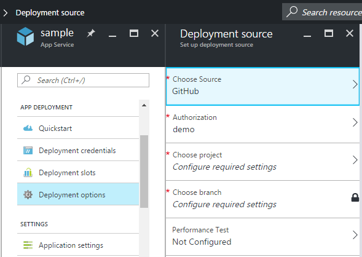
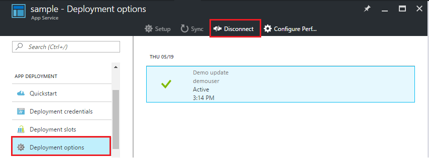

<properties
    pageTitle="Implantação contínua ao serviço de aplicativo do Azure | Microsoft Azure"
    description="Saiba como habilitar implantação contínua ao serviço de aplicativo do Azure."
    services="app-service"
    documentationCenter=""
    authors="dariagrigoriu"
    manager="wpickett"
    editor="mollybos"/>

<tags
    ms.service="app-service"
    ms.workload="na"
    ms.tgt_pltfrm="na"
    ms.devlang="na"
    ms.topic="article"
    ms.date="10/28/2016"
    ms.author="dariagrigoriu"/>
    
# Implantação contínua ao serviço de aplicativo do Azure

Este tutorial mostra como configurar um fluxo de trabalho de implantação contínuo para o aplicativo de [Serviço de aplicativo do Azure] . Integração com o serviço de aplicativo com BitBucket, GitHub e equipe serviços VSTS (Visual Studio) permite que um fluxo de trabalho de implantação contínuo onde Azure recebe as atualizações mais recentes do seu projeto publicado em um desses serviços. Implantação contínua é uma ótima opção para projetos onde vários e contribuições frequentes estão sendo integradas.

## Habilitar a implantação contínua

Para habilitar a implantação contínua, 

1. Publica seu conteúdo de aplicativo no repositório que será usado para implantação contínua.  
    Para obter mais informações sobre a publicação de seu projeto a esses serviços, consulte [criar um repo (GitHub)], [criar um repo (BitBucket)]e [começar a usar o VSTS].

2. Na lâmina de menu do seu aplicativo no [portal do Azure], clique em **implantação do aplicativo > Opções de implantação**. Clique em **Escolher a fonte**, selecione a fonte de implantação.  

    
    
    > [AZURE.NOTE] Para configurar um VSTS conta para implantação de serviço de aplicativo, consulte este [tutorial](https://github.com/projectkudu/kudu/wiki/Setting-up-a-VSTS-account-so-it-can-deploy-to-a-Web-App).
    
3. Conclua o fluxo de trabalho de autorização. 

4. Na lâmina **fonte de implantação** , escolha o projeto e ramificação para implantar de. Quando terminar, clique em **Okey**.
  
    

    > [AZURE.NOTE] Ao ativar implantação contínua com GitHub ou BitBucket, projetos públicos e privados serão exibidos.

    Serviço de aplicativo cria uma associação com o repositório selecionado, recebe os arquivos a partir da ramificação especificada e mantém uma cópia de seu repositório para o aplicativo de serviço de aplicativo. Quando você configura a implantação contínua VSTS do portal do Azure, a integração usa o aplicativo de serviço [mecanismo de implantação de Kudu](https://github.com/projectkudu/kudu/wiki), já automatizar tarefas de compilação e implantação com cada `git push`. Você não precisa configurar a implantação contínua no VSTS separadamente. Depois que esse processo for concluído, a lâmina de aplicativo de **Opções de implantação** mostrará uma implantação ativa que indica a implantação foi bem-sucedido.

5. Para verificar se que o aplicativo é implantado com êxito, clique na **URL** na parte superior da lâmina do aplicativo no portal do Azure. 

6. Para verificar que a implantação contínua está ocorrendo do repositório de sua escolha, push uma alteração no repositório. Seu aplicativo deve atualizar para refletir as alterações, logo após o envio ao repositório for concluído. Você pode confirmar que ele tenha puxado na atualização na lâmina **Opções de implantação** do aplicativo.

## Implantação contínua de uma solução do Visual Studio 

Transferindo uma solução Visual Studio para o serviço de aplicativo do Azure é tão fácil quanto enviar um arquivo index simples. O processo de implantação do serviço de aplicativo simplifica todos os detalhes, incluindo restaurando NuGet dependências e criando os binários do aplicativo. Você pode seguir as práticas recomendadas de controle de origem de manutenção de código somente no seu repositório gito e deixe implantação do serviço de aplicativo cuidam do resto.

As etapas para enviar sua solução do Visual Studio para o serviço de aplicativo são iguais da [seção anterior](#overview), desde que você configure sua solução e o repositório da seguinte maneira:

-   Use a opção de controle de origem do Visual Studio para gerar um `.gitignore` arquivo como a imagem abaixo ou manualmente adicionar um `.gitignore` arquivo na raiz do seu repositório com conteúdo semelhante a esta [amostra de .gitignore](https://github.com/github/gitignore/blob/master/VisualStudio.gitignore). 

    
 
-   Adicione árvore de diretório do toda a solução seu repositório, com o arquivo. sln na raiz do repositório.

Depois de configurar seu repositório conforme descrito e configurado seu aplicativo no Azure para publicação contínua de um dos repositórios gito onlinehttps, você pode desenvolver seu aplicativo ASP.NET localmente no Visual Studio e implantar continuamente seu código simplesmente pressionando as alterações ao seu repositório gito online.

## Desabilitar a implantação contínua

Para desabilitar a implantação contínua, 

1. Na lâmina de menu do seu aplicativo no [portal do Azure], clique em **implantação do aplicativo > Opções de implantação**. Em seguida, clique em **Desconectar** na lâmina **Opções de implantação** .

        

2. Depois de responder **Sim** a mensagem de confirmação, você pode retornar ao blade do seu aplicativo e clique em **implantação do aplicativo > Opções de implantação** se você gostaria de configurar a publicação de outra fonte.

## Recursos adicionais

* [Como investigar problemas comuns com implantação contínuo](https://github.com/projectkudu/kudu/wiki/Investigating-continuous-deployment)
* [Como usar o PowerShell para Azure]
* [Como usar as ferramentas de linha de comando do Azure para Mac e Linux]
* [Documentação gito]
* [Kudu do projeto](https://github.com/projectkudu/kudu/wiki)

>[AZURE.NOTE] Se você quiser começar a usar o serviço de aplicativo do Azure antes de se inscrever para uma conta do Azure, vá para [Experimentar o serviço de aplicativo](http://go.microsoft.com/fwlink/?LinkId=523751), onde você pode criar imediatamente um aplicativo da web de curta duração starter no aplicativo de serviço. Não há cartões de crédito obrigatório; Não há compromissos.

[Serviço de aplicativo do Azure]: https://azure.microsoft.com/en-us/documentation/articles/app-service-changes-existing-services/ 
[Portal do Azure]: https://portal.azure.com
[VSTS Portal]: https://www.visualstudio.com/en-us/products/visual-studio-team-services-vs.aspx
[Installing Git]: http://git-scm.com/book/en/Getting-Started-Installing-Git
[Como usar o PowerShell para Azure]: ../articles/powershell-install-configure.md
[Como usar as ferramentas de linha de comando do Azure para Mac e Linux]: ../articles/xplat-cli-install.md
[Documentação gito]: http://git-scm.com/documentation

[Criar um repo (GitHub)]: https://help.github.com/articles/create-a-repo
[Criar um repo (BitBucket)]: https://confluence.atlassian.com/display/BITBUCKET/Create+an+Account+and+a+Git+Repo
[Introdução ao VSTS]: https://www.visualstudio.com/get-started/overview-of-get-started-tasks-vs
[Continuous delivery to Azure using Visual Studio Team Services]: ../articles/cloud-services/cloud-services-continuous-delivery-use-vso.md
