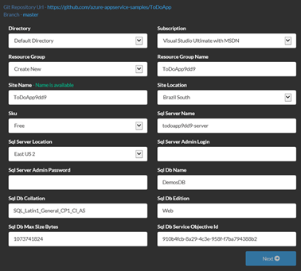
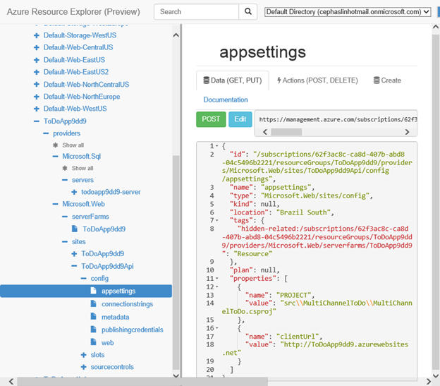

<properties
    pageTitle="Provisionar e implantar microservices previsíveis no Azure"
    description="Saiba como implantar um aplicativo composto de microservices no serviço de aplicativo do Azure como uma unidade única e de forma previsível usando modelos de grupo de recursos do JSON e scripts do PowerShell."
    services="app-service"
    documentationCenter=""
    authors="cephalin"
    manager="wpickett"
    editor="jimbe"/>

<tags
    ms.service="app-service"
    ms.workload="na"
    ms.tgt_pltfrm="na"
    ms.devlang="na"
    ms.topic="article"
    ms.date="01/06/2016"
    ms.author="cephalin"/>

# Provisionar e implantar microservices previsíveis no Azure #

Este tutorial mostra como provisionar e implantar um aplicativo composto de [microservices](https://en.wikipedia.org/wiki/Microservices) no [Serviço de aplicativo do Azure](/services/app-service/) como uma unidade única e de forma previsível usando modelos de grupo de recursos do JSON e scripts do PowerShell. 

Ao provisionar e implantar aplicativos de grande escala que são compostos de altamente desassociado microservices, a capacidade de repetição e a capacidade de previsão são fundamentais para o sucesso. [Serviço de aplicativo do Azure](/services/app-service/) permite que você crie microservices que incluem aplicativos web, aplicativos móveis, aplicativos de API e aplicativos de lógica. [Gerenciador de recursos do Azure](../azure-resource-manager/resource-group-overview.md) permite que você gerencie todas as microservices como uma unidade, juntamente com as dependências de recurso como banco de dados e configurações de controle de origem. Agora, você também pode implantar esse aplicativo usando modelos JSON e script PowerShell simples. 

[AZURE.INCLUDE [app-service-web-to-api-and-mobile](../../includes/app-service-web-to-api-and-mobile.md)] 

## O que você fará ##

No tutorial, você irá implantar um aplicativo que inclui:

-   Duas web apps (ou seja, dois microservices)
-   Um banco de dados SQL de back-end
-   Configurações do aplicativo, cadeias de caracteres de conexão e controle de origem
-   Configurações de auto-dimensionamento, alertas, obtenção de informações de aplicativo

## Ferramentas que serão usadas ##

Neste tutorial, você usará as ferramentas a seguir. Como não é completa discussão em ferramentas, vou fique o cenário de ponta a ponta e apenas oferece uma breve introdução a cada, e onde você pode encontrar mais informações sobre ela. 

### Modelos do Gerenciador de recursos Azure (JSON) ###
 
Sempre que você criar um aplicativo web no serviço de aplicativo do Azure, por exemplo, o Gerenciador de recursos do Azure usa um modelo JSON para criar o grupo inteiro de recurso com os recursos do componente. Um modelo de complexo do [Azure Marketplace](/marketplace) como o aplicativo de [WordPress Scalable](/marketplace/partners/wordpress/scalablewordpress/) pode incluir o banco de dados MySQL, contas de armazenamento, o plano de serviço de aplicativo, o aplicativo da web em si, regras de alerta, configurações do aplicativo, as configurações de escala automática e mais e todos esses modelos estão disponíveis para você através do PowerShell. Para obter informações sobre como baixar e usar esses modelos, consulte [Usando o PowerShell Azure com o Gerenciador de recursos do Azure](../powershell-azure-resource-manager.md).

Para obter mais informações sobre os modelos de Gerenciador de recursos do Azure, consulte [Modelos de Gerenciador de recursos de Azure coautoria](../resource-group-authoring-templates.md)

### Azure SDK 2.6 para Visual Studio ###

O SDK mais recente contém aprimoramentos para o suporte de modelo do Gerenciador de recursos no editor de JSON. Você pode usar isso para criar um modelo de grupo de recursos do zero ou abrir um modelo JSON existente (como um modelo baixado galeria) rapidamente para modificação, preencha o arquivo de parâmetros e até mesmo implantar o grupo de recursos diretamente de uma solução de grupo de recursos do Azure.

Para obter mais informações, consulte [2.6 de SDK do Azure para Visual Studio](/blog/2015/04/29/announcing-the-azure-sdk-2-6-for-net/).

### PowerShell Azure 0.8.0 ou posterior ###

Começando na versão 0.8.0, a instalação do Azure PowerShell inclui o módulo do Gerenciador de recursos do Azure além do módulo Azure. Este novo módulo permite a implantação de grupos de recursos de script.

Para obter mais informações, consulte [Usando o PowerShell Azure com o Gerenciador de recursos do Azure](../powershell-azure-resource-manager.md)

### Gerenciador de recursos do Azure ###

Esta [ferramenta de visualização](https://resources.azure.com) permite que você explore as definições de JSON de todos os grupos de recursos em sua assinatura e os recursos individuais. Na ferramenta, você pode editar as definições de JSON de um recurso, excluir uma hierarquia inteira de recursos e criar novos recursos.  As informações prontamente disponíveis nesta ferramenta serão muito útil para a criação de modelo porque ele mostra quais propriedades que você precisa definir para um determinado tipo de recurso, os valores corretos, etc. Você pode até mesmo criar seu grupo de recursos no [Portal do Azure](https://portal.azure.com/)e inspecionar suas definições de JSON na ferramenta do explorer para ajudá-lo a templatize o grupo de recursos.

### Implantar a botão Azure ###

Se você usar GitHub para controle de origem, você pode colocar uma [implantar no botão Azure](/blog/2014/11/13/deploy-to-azure-button-for-azure-websites-2/) em seu arquivo Leiame. MD, que permite uma implantação de ativar chave UI no Azure. Enquanto você pode fazer isso para qualquer aplicativo web simples, você pode estender isso para permitir a implantação de um grupo de recursos inteira ao colocar um arquivo de azuredeploy.json na raiz do repositório. Este arquivo JSON, que contém o modelo de grupo de recursos, será usado por implantar a botão Azure para criar o grupo de recursos. Por exemplo, consulte o exemplo [ToDoApp](https://github.com/azure-appservice-samples/ToDoApp) , que você usará neste tutorial.

## Obter a amostra de modelo de grupo de recursos ##

Agora, vamos certo para ele.

1.  Navegue até a amostra de serviço de aplicativo [ToDoApp](https://github.com/azure-appservice-samples/ToDoApp) .

2.   No readme.md, clique em **implantar no Azure**.
 
3.  Você está direcionado para o site de [implantar-para-azure](https://deploy.azure.com) e solicitado a implantação parâmetros de entrada. Observe que a maioria dos campos é preenchida com o nome do repositório e algumas cadeias de caracteres aleatórias para você. Você pode alterar todos os campos se desejar, mas as únicas coisas que você precisa inserir são o logon administrativo do SQL Server e a senha, em seguida, clique em **Avançar**.
 
    

4.  Em seguida, clique em **implantar** para iniciar o processo de implantação. Depois que o processo é executado para conclusão, clique na http://todoapp*XXXX*. azurewebsites.net link para procurar o aplicativo implantado. 

    

    A interface do usuário seria ser um pouco lento quando você navega primeiro a ele porque os aplicativos estão iniciando apenas para cima, mas convencer-se de que é um aplicativo totalmente funcional.

5.  Novamente na página implantar, clique no link **Gerenciar** para ver o novo aplicativo no Portal do Azure.

6.  Na lista suspensa **Essentials** , clique no link do grupo de recursos. Observe também que o aplicativo web já está conectado ao repositório GitHub em **Projeto externo**. 

    
 
7.  Na lâmina de grupo de recursos, observe que já existem duas web apps e um banco de dados do SQL no grupo de recursos.

    
 
Tudo o que você acabou de ver em poucos minutos curtos é um aplicativo de microservice de dois totalmente implantado, com todos os componentes, dependências, configurações, banco de dados e publicação contínua, configurado por uma coordenação automatizada no Gerenciador de recursos do Azure. Tudo que isso foi feito por dois fatores:

-   Implantar a botão Azure
-   azuredeploy.JSON na raiz do repo

Você pode implantar esse aplicativo mesmo dezenas, centenas ou milhares de vezes e ter exatamente a mesma configuração sempre. A capacidade de repetição e a capacidade de previsão dessa abordagem permite implantar aplicativos de grande escala com facilidade e confiança.

## Examinar (ou editar) AZUREDEPLOY. JSON ##

Agora vamos observar como o repositório de GitHub foi configurado. Você estará usando o editor de JSON no SDK do .NET Azure, portanto se você ainda não tiver instalado o [Azure .NET SDK 2.6](/downloads/), faça isso agora.

1.  Clone repositório [ToDoApp](https://github.com/azure-appservice-samples/ToDoApp) usando a ferramenta de gito favorito. A captura de tela abaixo, eu estou fazendo isso no Gerenciador de equipe no Visual Studio 2013.

    

2.  Na raiz do repositório, abra azuredeploy.json no Visual Studio. Se você não vir o painel de estrutura de tópicos de JSON, você precisa instalar o SDK do Azure .NET.

    

Não vou descrever todos os detalhes do formato JSON, mas a seção [Mais recursos](#resources) contém links para obter informações sobre a linguagem de modelo de grupo de recursos. Aqui, vou apenas para mostrar os recursos interessantes que podem ajudá-lo a começar a fazer seu próprio modelo personalizado para implantação do aplicativo.

### Parâmetros ###

Dê uma olhada na seção de parâmetros para ver que a maioria desses parâmetros são o que o botão de **implantar no Azure** solicita a entrada. O site por trás do botão **implantar no Azure** preenche a entrada usando os parâmetros definidos no azuredeploy.json de interface do usuário. Esses parâmetros são usados em todo as definições de recurso, como nomes de recursos, valores de propriedade etc.

### Recursos ###

No nó recursos, você pode ver que recursos de primeiro nível 4 são definidos, incluindo uma instância do SQL Server, um plano de serviço de aplicativo e dois aplicativos web. 

#### Plano de serviço de aplicativo ####

Vamos começar com um recurso de nível raiz simple no JSON. Na estrutura de tópicos JSON, clique no plano de serviço de aplicativo denominado **[hostingPlanName]** para realçar o código JSON correspondente. 

Observe que o `type` elemento Especifica a cadeia de caracteres para um plano de serviço de aplicativo (era chamado um farm de servidores um longo, longo tempo atrás) e outros elementos e propriedades são preenchidas usando os parâmetros definidos no arquivo JSON e este recurso não tem quaisquer recursos aninhados.

>[AZURE.NOTE] Observe também que, o valor de `apiVersion` informa Azure qual versão da API REST para usar a definição de recurso JSON com e ele pode afetar como o recurso deve ser formatado dentro do `{}`. 

#### SQL Server ####

Em seguida, clique no recurso do SQL Server chamado **SQL Server** na estrutura de tópicos JSON.

 
Observe o seguinte sobre o código JSON realçado:

-   O uso de parâmetros garante que o criou recursos são nomeados e configurados de maneira que torna consistente uns com os outros.
-   O recurso do SQL Server tem dois recursos aninhados, cada um com um valor diferente para `type`.
-   Os recursos aninhados dentro de `“resources”: […]`, onde o banco de dados e as regras de firewall são definidas, têm um `dependsOn` elemento que especifica a identificação do recurso do recurso SQL Server nível raiz. Isso informa ao Gerenciador de recursos do Azure, "antes de criar esse recurso, que outro recurso já deve existir; e se outro recurso estiver definido no modelo, crie um primeiro".

    >[AZURE.NOTE] Para obter informações detalhadas sobre como usar o `resourceId()` função, consulte [Funções de modelo de Gerenciador de recursos do Azure](../resource-group-template-functions.md).

-   O efeito do `dependsOn` elemento é que o Gerenciador de recursos do Azure pode saber quais recursos podem ser criados em paralelo e quais recursos devem ser criados sequencialmente. 

#### Aplicativo Web ####

Agora, vamos passar para real aplicativos da web, que são mais complicados. Clique no aplicativo da web de [variables('apiSiteName')] na estrutura de tópicos JSON para realçar seu código JSON. Você notará que coisas estão obtendo muito mais interessantes. Para essa finalidade, eu falaremos sobre os recursos de um por vez:

##### Recurso de raiz #####

O aplicativo web depende de dois recursos diferentes. Isso significa que o Gerenciador de recursos do Azure criará o web app somente depois que o plano de serviço de aplicativo e a instância do SQL Server são criados.

##### Configurações do aplicativo #####

As configurações de aplicativo também são definidas como um recurso aninhado.

No `properties` elemento para `config/appsettings`, você tem duas configurações de aplicativo no formato `“<name>” : “<value>”`.

-   `PROJECT`é uma [configuração de KUDU](https://github.com/projectkudu/kudu/wiki/Customizing-deployments) que informa qual projeto para usar em uma solução do Visual Studio de vários projeto de implantação do Azure. Posso mostrará posteriormente como controle de origem está configurado, mas como o código de ToDoApp está em uma solução do Visual Studio de vários projeto, precisamos essa configuração.
-   `clientUrl`é simplesmente um aplicativo de configuração que o código do aplicativo usa.

##### Cadeias de caracteres de Conexão #####

As cadeias de caracteres de conexão também são definidas como um recurso aninhado.

No `properties` elemento para `config/connectionstrings`, cada cadeia de conexão também é definida como um par de nome: valor, com o formato específico da `“<name>” : {“value”: “…”, “type”: “…”}`. Para o `type` elemento, os valores possíveis são `MySql`, `SQLServer`, `SQLAzure`, e `Custom`.

>[AZURE.TIP] Para obter uma lista definitiva dos tipos de cadeia de conexão, execute o seguinte comando no Azure PowerShell: \[Enum]::GetNames("Microsoft.WindowsAzure.Commands.Utilities.Websites.Services.WebEntities.DatabaseType")
    
##### Controle de origem #####

As configurações de controle de origem também são definidas como um recurso aninhado. Gerenciador de recursos de Azure usa esse recurso para configurar a publicação contínua (consulte limitação em `IsManualIntegration` posteriormente) e também para iniciar a implantação do código do aplicativo automaticamente durante o processamento do arquivo JSON.

`RepoUrl`e `branch` deve ser bastante intuitiva e devem apontar para o repositório de gito e o nome da ramificação para publicar a partir do. Novamente, esses são definidos pelas parâmetros de entrada. 

Observe o `dependsOn` elemento que, além de recurso do aplicativo da web em si, `sourcecontrols/web` também depende `config/appsettings` e `config/connectionstrings`. Isso ocorre porque depois `sourcecontrols/web` é configurado, o processo de implantação do Azure tentará automaticamente implantar, criar e iniciar o código do aplicativo. Portanto, inserir essa dependência ajuda a garantir que o aplicativo tenha acesso às configurações de aplicativo necessários e cadeias de caracteres de conexão antes do código de aplicativo é executado. 

>[AZURE.NOTE] Observe também que `IsManualIntegration` está definida como `true`. Essa propriedade é necessária neste tutorial porque você realmente não possui o repositório GitHub e, portanto, não é possível realmente conceder permissão ao Azure para configurar a publicação contínua de [ToDoApp](https://github.com/azure-appservice-samples/ToDoApp) (ou seja enviar as atualizações automáticas repositório para Azure). Você pode usar o valor padrão `false` para o repositório especificado somente se você tiver configurado as credenciais do proprietário GitHub no [portal do Azure](https://portal.azure.com/) antes. Em outras palavras, se você configurou o controle de origem para GitHub ou BitBucket de qualquer aplicativo no [Portal do Azure](https://portal.azure.com/) anteriormente, usando suas credenciais de usuário, em seguida, Azure irá lembrar as credenciais e usá-los sempre que você implanta qualquer aplicativo do GitHub ou BitBucket no futuro. No entanto, se você ainda não fez isso, implantação do modelo JSON falhará quando o Gerenciador de recursos do Azure tenta configurar configurações de controle de origem do aplicativo da web porque ela não fazer logon GitHub ou BitBucket com credenciais do proprietário do repositório.

## Comparar o modelo JSON com grupo de recursos implantados ##

Aqui, você pode percorrer blades todos do aplicativo da web no [Portal do Azure](https://portal.azure.com/), mas há outra ferramenta que é tão útil, se não mais. Vá para a ferramenta de visualização do [Azure Resource Explorer](https://resources.azure.com) , que fornece uma representação JSON de todos os grupos de recursos em suas assinaturas, como eles existem de fato no Azure back-end. Você também pode ver como a hierarquia JSON do grupo de recursos no Azure corresponde com a hierarquia no arquivo de modelo que é usado para criá-lo.

Por exemplo, quando eu acesse a ferramenta do [Gerenciador de recursos do Azure](https://resources.azure.com) e expanda os nós no explorer, eu pode ver o grupo de recursos e os recursos de nível raiz que são coletados em seus tipos de recursos respectivos.

Se você fazer drill down um aplicativo web, você deve ser capaz de ver detalhes de configuração de aplicativo da web semelhantes ao abaixo de captura de tela:

Novamente, os recursos aninhados devem ter uma hierarquia muito semelhante aos perfis em seu arquivo de modelo JSON, e você verá as configurações do aplicativo, cadeias de caracteres de conexão, etc., adequadamente refletidas no painel JSON. Ausência de configurações aqui pode indicar um problema com seu arquivo JSON e pode ajudá-lo a solucionar problemas de seu arquivo de modelo JSON.

## Implantar o modelo de grupo de recursos você mesmo ##

Botão **implantar no Azure** é excelente, mas ele permite que você implante o modelo de grupo de recursos na azuredeploy.json somente se você já tiver enviado azuredeploy.json GitHub. O SDK do .NET Azure também fornece as ferramentas para implantar qualquer arquivo de modelo JSON diretamente do seu computador local. Para fazer isso, siga as etapas abaixo:

1.  No Visual Studio, clique em **arquivo** > **novo** > **projeto**.

2.  Clique em **Visual c#** > **nuvem** > **Grupo de recursos do Azure**, clique em **Okey**.

    

3.  Em **Selecionar modelo do Azure**, selecione o **Modelo em branco** e clique **Okey**.

4.  Arraste azuredeploy.json para a pasta de **modelo** de seu novo projeto.

    

5.  Em Solution Explorer, abra a azuredeploy.json copiada.

6.  Apenas para a demonstração, vamos adicionar alguns recursos de visão de aplicativo padrão para nosso arquivo JSON, clicando em **Adicionar recursos**. Se você estiver interessado apenas no Implantando o arquivo JSON, pule para as etapas de implantar.

    

7.  Selecione **Ideias de aplicativo Web Apps**, verifique se um serviço de aplicativo existente planejar e web app está selecionada e clique em **Adicionar**.

    

    Você agora poderá ver vários recursos novos que, dependendo do recurso e o que ela faz, ter dependências o plano de serviço de aplicativo ou o web app. Esses recursos não estão ativados por sua definição existente e você vai mudar.

    
 
8.  Na estrutura de tópicos JSON, clique em **appInsights escala automática** para realçar seu código JSON. Esta é a configuração de dimensionamento para seu plano de serviço de aplicativo.

9.  No código de JSON realçado, localize o `location` e `enabled` propriedades e defini-las, conforme mostrado abaixo.

    

10. Na estrutura de tópicos JSON, clique em **CPUHigh appInsights** para realçar seu código JSON. Este é um alerta.

11. Localize o `location` e `isEnabled` propriedades e defini-las, conforme mostrado abaixo. Faça o mesmo para os outros três alertas (bulbos lilás).

    

12. Agora você está pronto para implantar. Clique com botão direito do projeto e selecione **implantar** > **Nova implantação**.

    

13. Faça logon em sua conta do Azure se você ainda não fez isso.

14. Selecione um grupo de recursos existente em sua assinatura ou criar um novo, selecione **azuredeploy.json**e, em seguida, clique em **Editar parâmetros**.

    

    Agora, você poderá editar todos os parâmetros definidos no arquivo de modelo em uma tabela lindas. Parâmetros que definem padrões já terá seus valores padrão e parâmetros que definem uma lista de valores permitidos serão mostrados como menus suspensos.

    

15. Preencha todos os parâmetros vazios e use o [endereço de repo GitHub para ToDoApp](https://github.com/azure-appservice-samples/ToDoApp.git) em **repoUrl**. Em seguida, clique em **Salvar**.
 
    

    >[AZURE.NOTE] AutoScaling é um recurso oferecido no nível **padrão** ou superior e alertas de nível de plano são recursos oferecidos na camada **básica** ou superior, você precisará definir o parâmetro de **sku** para **padrão** ou **Premium** para ver todas as suas novas percepções de aplicativo recursos acendem.
    
16. Clique em **implantar**. Se você selecionou **Salvar senhas**, a senha serão salvos no parâmetro arquivo **em texto sem formatação**. Caso contrário, você será solicitado a inserir a senha do banco de dados durante o processo de implantação.

Pronto! Agora, você só precisa ir para o [Portal do Azure](https://portal.azure.com/) e a ferramenta [Azure Resource Explorer](https://resources.azure.com) para ver os alertas de novo e as configurações de escala automática adicionadas à sua JSON implantadas aplicativo.

As etapas desta seção principalmente feito o seguinte:

1.  Preparar o arquivo de modelo
2.  Criou um arquivo de parâmetro com o arquivo de modelo
3.  Implantado o arquivo de modelo com o arquivo de parâmetro

A última etapa é feita facilmente por um cmdlet do PowerShell. Para ver o Visual Studio fez quando ele implantado seu aplicativo, abra Scripts\Deploy-AzureResourceGroup.ps1. Há muitas código lá, mas vou destacar todo o código pertinente que você precisa implantar o arquivo de modelo com o arquivo de parâmetro.

O cmdlet último, `New-AzureResourceGroup`, é o que realmente executa a ação. Tudo isso deve demonstrar a você que, com a Ajuda de ferramentas, ele é relativamente simples implantar seu aplicativo de nuvem previsíveis. Sempre que você executa o cmdlet no mesmo modelo com o mesmo arquivo de parâmetro, você vai obter o mesmo resultado.

## Resumo ##

Em DevOps, capacidade de repetição e a capacidade de previsão são chaves para qualquer implantação bem-sucedida de um aplicativo de alta escala composto de microservices. Neste tutorial, você implantou um aplicativo de dois microservice no Azure como um grupo de recursos único usando o modelo do Gerenciador de recursos do Azure. Felizmente, ele lhe concedeu o conhecimento que você precisa para começar a converter seu aplicativo no Azure em um modelo e podem provisionar e implantá-lo previsíveis. 

## Próximas etapas ##

Saiba como [Aplicar as metodologias agile e continuamente publicar seu aplicativo de microservices com facilidade](app-service-agile-software-development.md) e implantação avançada técnicas como [implantação flighting](app-service-web-test-in-production-controlled-test-flight.md) facilmente.

## Mais recursos ##

-   [Linguagem de modelo do Azure Gerenciador de recursos](../resource-group-authoring-templates.md)
-   [Criação de modelos do Gerenciador de recursos do Azure](../resource-group-authoring-templates.md)
-   [Funções de modelo do Azure Gerenciador de recursos](../resource-group-template-functions.md)
-   [Implantar um aplicativo com o modelo do Gerenciador de recursos do Azure](../resource-group-template-deploy.md)
-   [Usando o PowerShell Azure com o Azure Resource Manager](../powershell-azure-resource-manager.md)
-   [Implantações de grupo de recursos no Azure de solução de problemas](../resource-manager-troubleshoot-deployments-portal.md)

 
