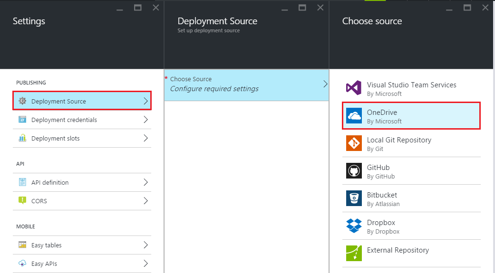

<properties
    pageTitle="Conteúdo de sincronização de uma pasta de nuvem para o serviço de aplicativo do Azure"
    description="Saiba como implantar o seu aplicativo de serviço de aplicativo do Azure via sincronização de conteúdo de uma pasta de nuvem."
    services="app-service"
    documentationCenter=""
    authors="dariagrigoriu"
    manager="wpickett"
    editor="mollybos"/>

<tags
    ms.service="app-service"
    ms.workload="na"
    ms.tgt_pltfrm="na"
    ms.devlang="na"
    ms.topic="article"
    ms.date="06/13/2016"
    ms.author="dariagrigoriu"/>
    
# Conteúdo de sincronização de uma pasta de nuvem para o serviço de aplicativo do Azure

Este tutorial mostra como implantar o serviço de [aplicativo](http://go.microsoft.com/fwlink/?LinkId=529714) do Azure pela sincronização de seu conteúdo populares armazenamento dos serviços de nuvem como o Dropbox e o OneDrive. 

## Visão geral de implantação de conteúdo de sincronização

A implantação de sincronização de conteúdo sob demanda estiver usando o [mecanismo de implantação de Kudu](https://github.com/projectkudu/kudu/wiki) integrado ao aplicativo de serviço. No [Portal do Azure](https://portal.azure.com), você pode designar uma pasta em seu armazenamento de nuvem, trabalhar com o código de aplicativo e o conteúdo nessa pasta e sincronizar com o serviço de aplicativo com o clique de um botão. Sincronização de conteúdo utiliza o processo de Kudu de compilação e implantação. 
    
## Como habilitar a implantação de conteúdo de sincronização
Para habilitar a sincronização de conteúdo a partir do [Portal do Azure](https://portal.azure.com), siga estas etapas:

1. No blade do seu aplicativo no Portal do Azure, clique em **configurações** > **Fonte de implantação**. Clique em **Escolher a fonte**, selecione **OneDrive** ou **Dropbox** como a fonte para implantação. 

    

    >[AZURE.NOTE] Devido a diferenças subjacentes nas APIs, o **SkyDrive Pro** não é suportado neste momento. 

2. Conclua o fluxo de trabalho de autorização para habilitar o serviço de aplicativo acessar um caminho específico de designado predefinido para o OneDrive ou Dropbox onde todo o conteúdo do serviço de aplicativo serão armazenados.  
    Após o serviço de aplicativo de autorização plataforma você terá a opção para criar uma pasta de conteúdo sob o caminho de conteúdo designado, ou para escolher uma pasta de conteúdo existente sob esse caminho de conteúdo designada. Os caminhos de conteúdo designados em suas contas de armazenamento de nuvem usados para sincronização de serviço de aplicativo são as seguintes:  
    * **OneDrive**:`Apps\Azure Web Apps` 
    * **Dropbox**:`Dropbox\Apps\Azure`

3. Após a sincronização de conteúdo inicial a sincronização de conteúdo pode ser iniciada on demand a partir do portal do Azure. Histórico de implantação está disponível com a lâmina de **implantações** .

    
 
Mais informações para implantação do Dropbox estão disponíveis em [implantar do Dropbox](http://blogs.msdn.com/b/windowsazure/archive/2013/03/19/new-deploy-to-windows-azure-web-sites-from-dropbox.aspx). 

