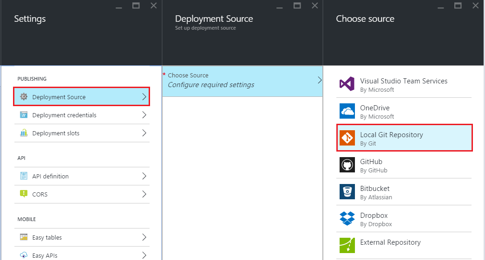

<properties
    pageTitle="Implantação local gito ao serviço de aplicativo do Azure"
    description="Saiba como habilitar implantação local do gito ao serviço de aplicativo do Azure."
    services="app-service"
    documentationCenter=""
    authors="dariagrigoriu"
    manager="wpickett"
    editor="mollybos"/>

<tags
    ms.service="app-service"
    ms.workload="na"
    ms.tgt_pltfrm="na"
    ms.devlang="na"
    ms.topic="article"
    ms.date="06/13/2016"
    ms.author="dariagrigoriu"/>
    
# Implantação local gito ao serviço de aplicativo do Azure

Este tutorial mostra como implantar o seu aplicativo de serviço de [aplicativo] do Azure de um repositório de gito no computador local. Serviço de aplicativo oferece suporte a essa abordagem com a opção de implantação **Local gito** no [Portal do Azure].  
Muitos dos comandos gito descritos neste artigo são executados automaticamente ao criar um aplicativo de serviço de aplicativo usando a [Interface de linha de comando do Azure] como descrito [aqui](app-service-web-get-started.md).

## Pré-requisitos

Para concluir este tutorial, você precisa:

- Gito. Você pode baixar a instalação binário [aqui](http://www.git-scm.com/downloads).  
- Conhecimento básico de gito.
- Uma conta do Microsoft Azure. Se você não tiver uma conta, você pode [inscrever-se para uma avaliação gratuita](https://azure.microsoft.com/pricing/free-trial) ou [ativar seus benefícios de assinante do Visual Studio](https://azure.microsoft.com/pricing/member-offers/msdn-benefits-details).

>[AZURE.NOTE] Se você quiser começar a usar o serviço de aplicativo do Azure antes de se inscrever para uma conta do Azure, vá para [Experimentar o serviço de aplicativo](http://go.microsoft.com/fwlink/?LinkId=523751), onde você pode criar imediatamente um aplicativo de curta duração starter no aplicativo de serviço. Não há cartões de crédito obrigatório; Não há compromissos.  

## Etapa 1: Criar um repositório local

Execute as seguintes tarefas para criar um novo repositório gito.

1. Inicie uma ferramenta de linha de comando, como **GitBash** (Windows) ou **Bash** (Shell do Unix). Em sistemas de OS X você pode acessar a linha de comando por meio do aplicativo de **Terminal** .

2. Navegue até a pasta onde o conteúdo para implantar seria localizado.

3. Use o seguinte comando para inicializar um novo repositório gito:

        git init

## Etapa 2: Confirmar seu conteúdo

Serviço de aplicativo oferece suporte a aplicativos criados em uma variedade de linguagens de programação. 

1. Se seu repositório já inclui conteúdo ignorar esta aponte e mova para apontar 2 abaixo. Se seu repositório ainda não inclui conteúdo simplesmente preencha da seguinte maneira com um arquivo. HTML estático: 

    - Usando um editor de texto, crie um novo arquivo chamado **index** na raiz do repositório gito
    - Adicione o seguinte texto, como o conteúdo para o index de arquivo e salvá-lo: *gito Hello!*
        
2. Na linha de comando, verifique se você na raiz do seu repositório gito. Use o comando a seguir para adicionar arquivos ao seu repositório:

        git add -A 

4. Em seguida, confirme as alterações no repositório usando o comando a seguir:

        git commit -m "Hello Azure App Service"

## Etapa 3: Habilitar o repositório de aplicativo de serviço de aplicativo

Execute as seguintes etapas para habilitar um repositório gito para seu aplicativo de serviço de aplicativo.

1. Faça logon [Portal do Azure].

2. Na lâmina do seu aplicativo de serviço de aplicativo, clique em **Configurações > fonte de implantação**. Clique em **Escolher fonte**, e em seguida, clique **Repositório gito Local**e clique em **OK**.  

    

3. Se esta for sua primeira vez configurando um repositório no Azure, você precisa criar credenciais de logon para ele. Você usará-los a fazer logon nas alterações de repositório e push Azure do seu repositório gito local. Da lâmina do seu aplicativo, clique em **Configurações > credenciais de implantação**, configure seu nome de usuário de implantação e a senha. Quando terminar, clique em **Salvar**.

    

## Etapa 4: Implantar o seu projeto

Use as etapas a seguir para publicar seu aplicativo de serviço de aplicativo usando gito Local.

1. Na lâmina do seu aplicativo no Portal do Azure, clique em **Configurações > Propriedades** para a **URL de gito**.

    

    **URL de gito** é a referência remota para implantar do seu repositório local. Você usará essa URL nas etapas a seguir.

2. Usando a linha de comando, verifique se você está na raiz do seu repositório gito local.

3. Use `git remote` adicionar a referência remota listadas na **URL gito** da etapa 1. O comando terá aparência semelhante à seguinte:

        git remote add azure https://<username>@localgitdeployment.scm.azurewebsites.net:443/localgitdeployment.git         
    > [AZURE.NOTE] O comando **remoto** adiciona uma referência nomeada em um repositório remoto. Neste exemplo, ele cria uma referência nomeada 'azure' para o repositório do web app.

4. Enviar seu conteúdo para o serviço de aplicativo usando o novo **azure** remoto que você acabou de criar.

        git push azure master

    Você será solicitado a senha que você criou anteriormente ao redefinir suas credenciais de implantação no Portal do Azure. Insira a senha (Observe que Gitbash não eco asteriscos no console conforme você digita sua senha). 
       
5. Volte para o seu aplicativo no Portal do Azure. Uma entrada de log de seu envio mais recente deve ser exibida na lâmina **implantações** . 

    

6. Clique no botão **Procurar** na parte superior da lâmina do aplicativo para verificar que o conteúdo foi implantado. 
    
## Solução de problemas

Estes são erros ou problemas encontrados normalmente ao usar gito publicar em um aplicativo de serviço de aplicativo no Azure:

****

**Sintoma**: não foi possível acessar '[siteURL]': Falha ao conectar ao [scmAddress]

**Causa**: este erro pode ocorrer se o aplicativo não estiver em execução.

**Resolução**: iniciar o aplicativo no Portal do Azure. Implantação gito não funcionarão, a menos que o aplicativo é executado. 

****

**Sintoma**: não foi possível resolver o host 'hostname'

**Causa**: esse erro pode ocorrer se as informações de endereço inseridas ao criar o azure remoto estavam incorretas.

**Resolução**: Use o `git remote -v` comando para listar todos os controles de remotos, juntamente com a URL associada. Verifique se a URL para o 'azure' remoto está correta. Se necessário, remover e recriar essa remoto usando a URL correta.

****

**Sintoma**: nenhuma referências em comum e nenhum especificado; fazer nada. Talvez você deverá especificar uma ramificação como 'mestre'.

**Causa**: este erro pode ocorrer se você não especificar uma ramificação ao realizar um gito push operação e não definiu o valor de push.default usado pelo gito.

**Resolução**: executar a operação de envio novamente, especificando a ramificação mestre. Por exemplo:

    git push azure master

****

**Sintoma**: src refspec [branchname] não correspondem a nenhum.

**Causa**: este erro pode ocorrer se você tentar enviar para uma ramificação diferente de mestre no azure remoto.

**Resolução**: executar a operação de envio novamente, especificando a ramificação mestre. Por exemplo:

    git push azure master

****

**Sintoma**: erro - alterações comprometidas para repositório remoto, mas o aplicativo web não estão atualizadas.

**Causa**: este erro pode ocorrer se você estiver implantando um aplicativo Node que contém um arquivo de package.json que especifica módulos necessários adicionais.

**Resolução**: mensagens adicionais contendo 'npm erro'! deve ser conectado antes esse erro e pode fornecer mais contexto sobre a falha. A seguir é conhecida causas desse erro e a correspondente 'npm erro!' mensagem:

* **Arquivo de package.json mal formado**: npm erro! Não foi possível ler dependências.

* **Módulo nativo que não tem uma distribuição binária para Windows**:

    * NPM erro! \`cmd "/ c" "nó gyp recriação"\` falhou com 1

        OU

    * NPM erro! [modulename@version]pré-instalar: \`tornar | | gmake\`

## Recursos adicionais

* [Documentação gito](http://git-scm.com/documentation)
* [Documentação de Kudu do projeto](https://github.com/projectkudu/kudu/wiki)
* [Implantação de contínua ao serviço de aplicativo do Azure](app-service-continuous-deployment.md)
* [Como usar o PowerShell para Azure](../powershell-install-configure.md)
* [Como usar a Interface de linha do Azure](../xplat-cli-install.md)

[Serviço de aplicativo do Azure]: https://azure.microsoft.com/documentation/articles/app-service-changes-existing-services/
[Azure Developer Center]: http://www.windowsazure.com/en-us/develop/overview/
[Portal do Azure]: https://portal.azure.com
[Git website]: http://git-scm.com
[Installing Git]: http://git-scm.com/book/en/Getting-Started-Installing-Git
[Interface de linha de comando Azure]: https://azure.microsoft.com/en-us/documentation/articles/xplat-cli-azure-resource-manager/

[Using Git with CodePlex]: http://codeplex.codeplex.com/wikipage?title=Using%20Git%20with%20CodePlex&referringTitle=Source%20control%20clients&ProjectName=codeplex
[Quick Start - Mercurial]: http://mercurial.selenic.com/wiki/QuickStart
