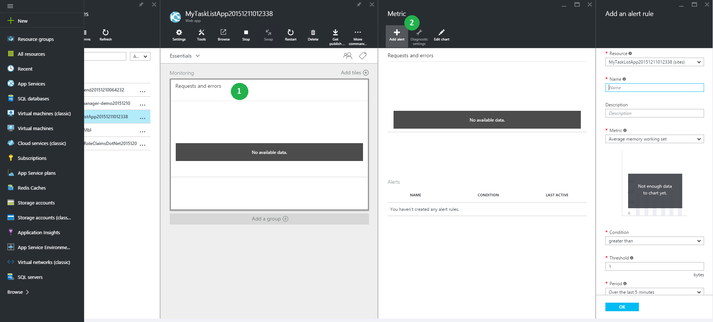
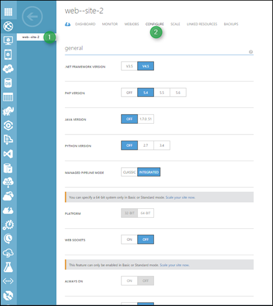

<properties
    pageTitle="Referência para navegar no portal do Azure"
    description="Saber as experiências de usuário diferentes do aplicativo de serviço Web entre o portal de gerenciamento e o Portal do Azure"
    services="app-service"
    documentationCenter=""
    authors="jaime-espinosa"
    manager="wpickett"
    editor="jimbe"/>

<tags
    ms.service="app-service"
    ms.workload="na"
    ms.tgt_pltfrm="na"
    ms.devlang="na"
    ms.topic="article"
    ms.date="02/26/2016"
    ms.author="jaime-espinosa"/>

# Referência para navegar no portal do Azure

Sites Azure agora são chamadas de [Aplicativo de serviço Web Apps](http://go.microsoft.com/fwlink/?LinkId=529714). Estamos atualizando toda nossa documentação para refletir essa alteração de nome e fornecer instruções para o Portal do Azure. Até que esse processo for concluído, você pode usar este documento como um guia para trabalhar com Web Apps no portal do Azure.

[AZURE.INCLUDE [app-service-web-to-api-and-mobile](../../includes/app-service-web-to-api-and-mobile.md)] 
 
## O futuro do Portal de clássico do Azure

Enquanto você notará as alterações de identidade visual no Portal de clássico do Azure, esse portal está sendo substituído pelo Portal do Azure. Como o portal clássico está sendo fases check-out, o foco para desenvolvimento de novos está mudando para o Portal do Azure. Todos os novos recursos futuros Web Apps se torne no Portal do Azure. Comece a usar o Portal do Azure para aproveitar o melhor e mais recente que aplicativos Web tem a oferecer.

## Diferenças de layout entre o Portal de clássico do Azure e o Portal do Azure

No portal do clássico, todos os serviços do Azure estão listados no lado esquerdo. Navegação no portal do clássico segue uma estrutura de árvore, onde você pode começar a partir do serviço e navegar em cada elemento. Essa estrutura funciona bem quando o gerenciamento de componentes independentes. No entanto, aplicativos criados no Azure são um conjunto de serviços interligados e essa estrutura de árvore não é ideal para trabalhar com conjuntos de serviços. 

O portal do Azure torna mais fácil criar aplicativos ponta a ponta com componentes de vários serviços. O portal é organizado como *viagens*. Uma *jornada* é uma série de *lâminas*, que são contêineres para os diferentes componentes. Por exemplo, configurando a escala automática para um aplicativo web é uma *jornada* que leva você várias blades conforme mostrado no exemplo a seguir: a lâmina de **site da web** (que título blade não ainda foi atualizado para usar a terminologia nova), a lâmina de **configurações** e o blade de **escala** . No exemplo, dimensionamento automático está sendo configurado para dependem do uso de CPU, portanto, também há uma lâmina de **Porcentagem de CPU** . Os componentes dentro dos *blades* são chamados *partes*, que aparência blocos. 

## Exemplo de navegação: criar um aplicativo web

Criar novos aplicativos web é ainda tão fácil quanto 1-2-3. A imagem a seguir mostra o portal clássico e o portal de lado a lado para demonstrar que não muito mudou no número de etapas necessárias para obter um aplicativo web para cima e em execução. 

No portal, você pode escolher entre os tipos mais comuns de aplicativos web, incluindo aplicativos de galeria populares como WordPress. Para obter uma lista completa de aplicativos disponíveis, visite o [Azure Marketplace].

Quando você cria um aplicativo web, você especifica URL, plano de serviço de aplicativo e local no portal do como faria no portal do clássico. 

Além disso, o portal permite que você defina outras configurações comuns. Por exemplo, [grupos de recursos](../azure-resource-manager/resource-group-overview.md) tornam simples para ver e gerenciar recursos Azure relacionados. 

## Exemplo de navegação: recursos e configurações

Todas as configurações e recursos agora são agrupados logicamente em uma única lâmina, do qual você pode navegar.

Por exemplo, você pode criar domínios personalizados clicando em **domínios personalizados e SSL** na lâmina **configurações** .

Para configurar um alerta de monitoramento, clique em **solicitações e erros** e, em seguida, **Adicionar alerta**.

Para habilitar o diagnóstico, clique em **logs de diagnóstico** na lâmina **configurações** .

 
Para definir configurações de aplicativo, clique em **configurações de aplicativo** na lâmina **configurações** . 

Além do nome de marca, algumas coisas no portal foram renomeadas ou agrupadas de forma diferente para tornar mais fácil encontrá-las. Por exemplo, a seguir é uma captura de tela da página correspondente para aplicativo configurações (**Configurar**) no portal do clássico.

## Mais recursos

[Azure Portal]: https://portal.azure.com
[Azure Marketplace]: /marketplace/

>[AZURE.NOTE] Se você quiser começar a usar o serviço de aplicativo do Azure antes de se inscrever para uma conta do Azure, vá para [Experimentar o serviço de aplicativo](http://go.microsoft.com/fwlink/?LinkId=523751), onde você pode criar imediatamente um aplicativo da web de curta duração starter no aplicativo de serviço. Não há cartões de crédito obrigatório; Não há compromissos.

## O que mudou
* Para um guia para a alteração de sites para o serviço de aplicativo consulte: [o serviço de aplicativo do Azure e seu impacto sobre serviços existentes do Azure](http://go.microsoft.com/fwlink/?LinkId=529714)
 
