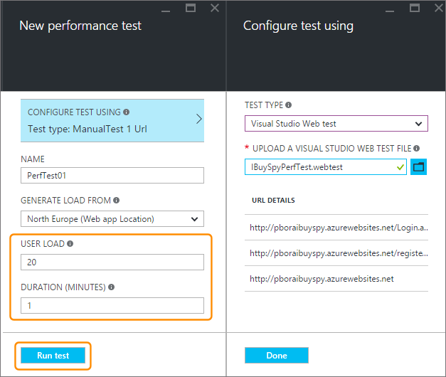
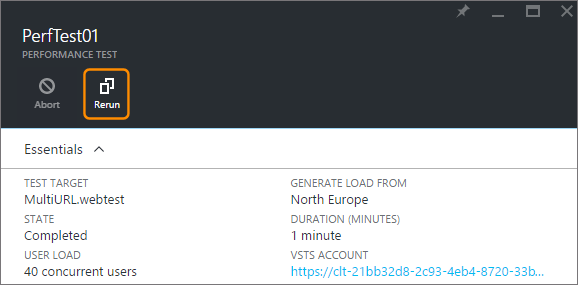

<properties
   pageTitle="Testar o desempenho do seu aplicativo web Azure | Microsoft Azure"
   description="Execute testes de desempenho de aplicativo web Azure para verificar como o seu aplicativo lida com a carga de usuário. Medir o tempo de resposta e encontrar falhas que podem indicar problemas."
   services="app-service\web"
   documentationCenter=""
   authors="ecfan"
   manager="douge"
   editor="jimbe"/>

<tags
   ms.service="app-service-web"
   ms.workload="web"
   ms.tgt_pltfrm="na"
   ms.devlang="na"
   ms.topic="article"
   ms.date="05/25/2016"
   ms.author="estfan; manasma; ahomer"/>

# <a name="performance-test-your-azure-web-app-under-load"></a>Seu aplicativo web Azure sob carga de teste de desempenho

Verifique o desempenho do seu aplicativo web antes de iniciá-lo ou implante atualizações de produção. Dessa forma, você pode avaliar melhor se o aplicativo está pronto para lançamento. Se sentir mais seguro que o seu aplicativo pode manipular o tráfego durante o uso de pico ou em sua próxima ação de marketing.

Durante a visualização pública, você pode teste de desempenho de seu aplicativo gratuitamente no Portal do Azure.
Esses testes simulam carga de usuário no seu aplicativo durante um período de tempo específico e medem a resposta do seu aplicativo. Por exemplo, os resultados de teste mostram a velocidade seu aplicativo responde a um número específico de usuários. Eles também mostram quantas solicitações falharam, que podem indicar problemas com seu aplicativo.      


## <a name="before-you-start"></a>Antes de começar

* Você precisará de uma [assinatura do Azure](https://account.windowsazure.com/subscriptions), caso você não tenha um. Saiba como você pode [Abrir uma conta do Azure gratuitamente](https://azure.microsoft.com/pricing/free-trial/?WT.mc_id=A261C142F).

* Você precisará de uma conta de [Serviços de equipe do Visual Studio](https://www.visualstudio.com/products/what-is-visual-studio-online-vs) para manter seu histórico de teste de desempenho. Uma conta adequada será criada automaticamente quando você configura o teste de desempenho. Ou você pode criar uma nova conta ou usar uma conta existente, se você for o proprietário da conta. 

* Implante seu aplicativo para testar em um ambiente fora de produção. Faça com que seu aplicativo use um plano de serviço de aplicativo diferente o plano usado na produção. Dessa forma, você não afetará os clientes existentes ou abrandar seu aplicativo em produção. 

## <a name="set-up-and-run-your-performance-test"></a>Configurar e executar o teste de desempenho

0.  Entre [Portal do Azure](https://portal.azure.com). Para usar uma conta de serviços de equipe do Visual Studio que você possui, entrar como o proprietário da conta.

0.  Vá para seu aplicativo web.

    

0.  Ir para o **teste de desempenho**.

    
 
0. Agora você vai vincular uma conta de [Serviços de equipe do Visual Studio](https://www.visualstudio.com/products/what-is-visual-studio-online-vs) para manter seu histórico de teste de desempenho.

    Se você tiver uma conta de serviços de equipe para usar, selecione essa conta. Se não estiver, crie uma nova conta.

    

0.  Crie o teste de desempenho. Defina os detalhes e executar o teste. 

Você pode assistir os resultados em tempo real enquanto executa o teste.

Por exemplo, suponha que temos um aplicativo que deu-out cupons em venda de feriado do ano passado. Este evento duração com uma carga de pico de 100 clientes simultâneos de 15 minutos. Queremos dobrar o número de clientes deste ano. Também queremos melhorar a satisfação reduzindo o tempo de carregamento de página de 5 segundos para 2 segundos. Portanto, será testamos desempenho do nosso aplicativo atualizado com 250 usuários por 15 minutos.

Podemos vai simular carga nosso aplicativo gerando usuários virtuais (clientes) que visite o nosso site ao mesmo tempo. Isso mostrará conosco solicitações quantos forem falhando ou respondendo lentamente.

  

   *  URL do seu aplicativo web padrão é adicionada automaticamente. 
   Você pode alterar a URL para testar outras páginas (somente solicitações GET HTTP).

   *  Para simular condições de locais e reduzir a latência, selecione um local mais próximo aos usuários para gerar uma carga.

  Aqui está o teste em andamento. Durante o primeiro minuto, nossa página carrega mais lenta do que queremos.

  

  Após o teste, aprendemos que a página for carregada muito mais rápido após o primeiro minuto. Isso ajuda a identificar onde vamos querer começar a solucionar o problema.

  

## <a name="test-multiple-urls"></a>Testar várias URLs

Você também pode executar testes de desempenho incorporando várias URLs que representam um cenário de ponta a ponta usuário carregar um arquivo de teste de Web do Visual Studio. Algumas das maneiras que você pode criar um Visual Studio Web teste arquivo são:

* [Capturar o tráfego usando Fiddler e exportar como um arquivo de teste de Web do Visual Studio](http://docs.telerik.com/fiddler/Save-And-Load-Traffic/Tasks/VSWebTest)
* [Criar um arquivo de teste de carga no Visual Studio](https://www.visualstudio.com/docs/test/performance-testing/run-performance-tests-app-before-release)

Para carregar e executar um arquivo de teste de Web do Visual Studio:
 
0. Siga as etapas acima para abrir a lâmina **testar novos desempenho** .
   Neste lâmina, escolha a opção CONFIGFURE testar usando para abrir a lâmina **Configurar teste usando** .  

    

0. Verifique se o tipo de teste está definido para **Visual Studio Web Test** e selecione o arquivo morto de HTTP.
    Use o ícone de "pasta" para abrir a caixa de diálogo de seletor de arquivo.

    

    Depois que o arquivo foi carregado, você verá a lista de URLs seja testada na seção de detalhes da URL.
 
0. Especifique a carga de usuário e duração do teste e escolha **Executar teste**.

    

    Após o teste, você pode ver os resultados em dois painéis. No painel esquerdo mostra as informações de performnace como uma série de gráficos.

    

    O painel direito mostra uma lista de solicitações com falha, com o tipo de erro e o número de vezes que ele ocorreu.

    

0. Execute novamente o teste escolhendo o ícone de **Executar** na parte superior do painel direito.

    

##  <a name="q--a"></a>P & r

#### <a name="q-is-there-a-limit-on-how-long-i-can-run-a-test"></a>P: existe um limite em quanto tempo pode executar um teste? 

**R**: Sim, você pode executar o teste até uma hora no Portal do Azure.

#### <a name="q-how-much-time-do-i-get-to-run-performance-tests"></a>P: quanto tempo eu envio para executar testes de desempenho? 

**R**: depois de visualização pública, você obtém a 20.000 usuário virtual minutos (VUMs) livre cada mês com sua conta de serviços de equipe do Visual Studio. Um VUM é o número de usuários virtuais multiplicados pelo número de minutos em seu teste. Se suas necessidades excederem o limite livre, você pode adquirir mais tempo e pagar somente pelo que você usar.

#### <a name="q-where-can-i-check-how-many-vums-ive-used-so-far"></a>P: onde verificar a quantos VUMs usou até o momento?

**R**: você pode verificar esse valor no Portal do Azure.


#### <a name="q-what-is-the-default-option-and-are-my-existing-tests-impacted"></a>P: o que é a opção padrão e são afetados meus testes existentes?

**R**: A opção padrão para testes de carga de desempenho é um teste manual - da mesma forma que antes da URL vários teste opção foi adicionada ao portal.
Os testes existentes continuam a usar a URL configurada e funcionarão como antes.

#### <a name="q-what-features-not-supported-in-the-visual-studio-web-test-file"></a>P: quais recursos não têm suporte no arquivo de teste de Web do Visual Studio?

**R**: no momento este recurso não suporta plug-ins, fontes de dados e regras de extração teste da Web. Você deve editar seu arquivo de teste da Web para remover esses. Esperamos adicionar suporte para esses recursos no futuro atualizações.

#### <a name="q-does-it-support-any-other-web-test-file-formats"></a>P: oferece suporte a outros formatos de arquivo de teste da Web?
  
**R**: no presente somente Visual Studio Web teste arquivos de formato são suportados.
Nós seria satisfeitos ouvir você se precisar de suporte para outros formatos de arquivo. E-mail para [vsoloadtest@microsoft.com](mailto:vsoloadtest@microsoft.com).

#### <a name="q-what-else-can-i-do-with-a-visual-studio-team-services-account"></a>P: o que mais posso fazer com uma conta de serviços de equipe do Visual Studio?

**R**: para encontrar a sua nova conta, vá para ```https://{accountname}.visualstudio.com```. Compartilhar seu código, construir, testar, controlar o trabalho e software de envio – tudo na nuvem usando qualquer ferramenta ou idioma. Saiba mais sobre como serviços e recursos [Dos serviços de equipe do Visual Studio](https://www.visualstudio.com/products/what-is-visual-studio-online-vs) ajudam sua equipe colaborarem com mais facilidade e implantar continuamente.

## <a name="see-also"></a>Consulte também

* [Executar testes de desempenho de nuvem simples](https://www.visualstudio.com/docs/test/performance-testing/getting-started/get-started-simple-cloud-load-test)
* [Executar testes de desempenho do Apache Jmeter](https://www.visualstudio.com/docs/test/performance-testing/getting-started/get-started-jmeter-test)
* [Gravar e reproduzir testes de carga baseado em nuvem](https://www.visualstudio.com/docs/test/performance-testing/getting-started/record-and-replay-cloud-load-tests)
* [Desempenho testar seu aplicativo na nuvem](https://www.visualstudio.com/docs/test/performance-testing/getting-started/getting-started-with-performance-testing)
