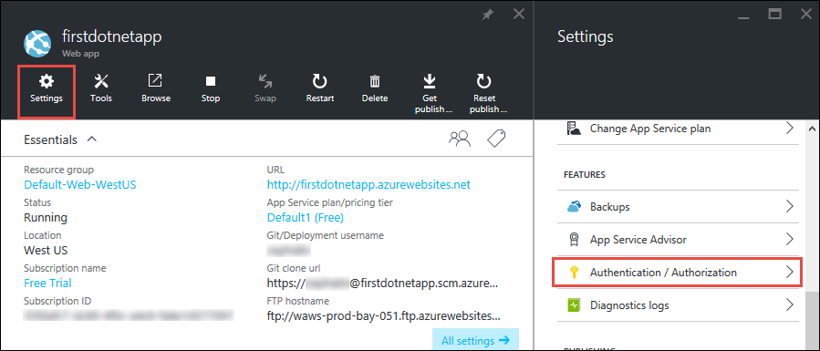
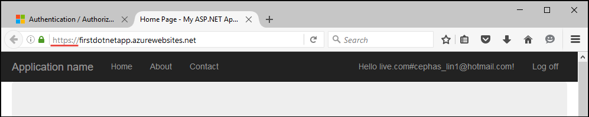
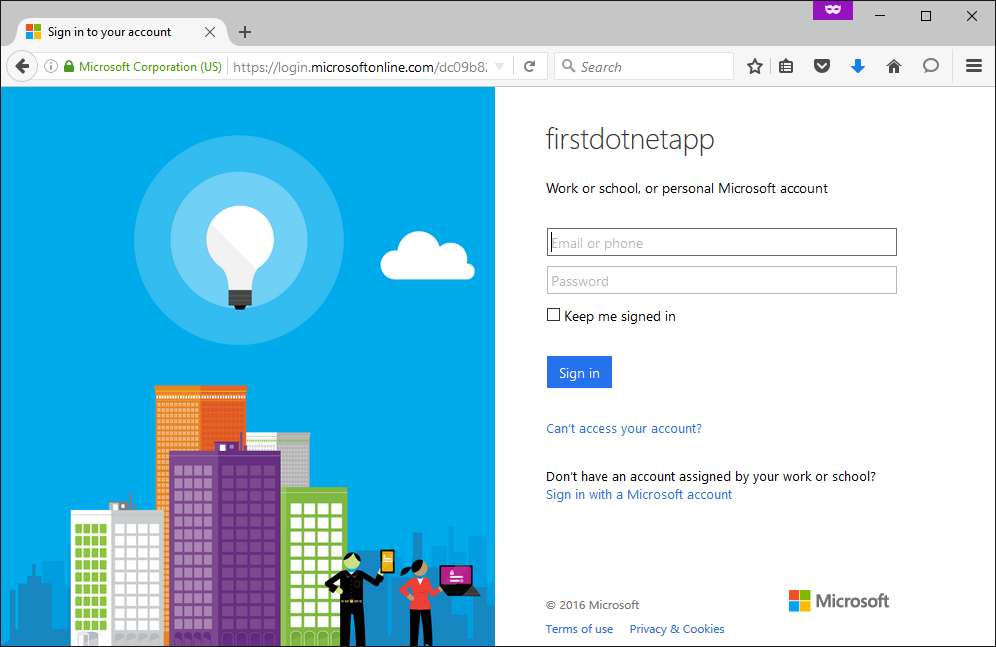
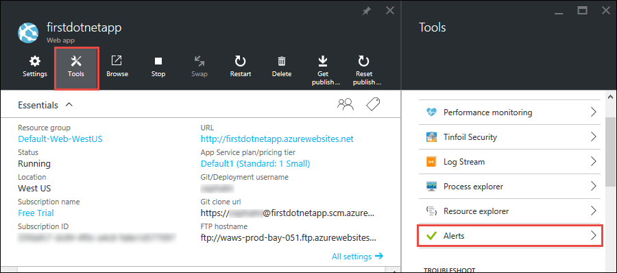
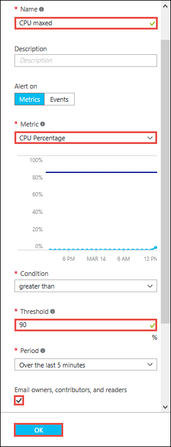

<properties
    pageTitle="Adicionar funcionalidade ao seu aplicativo web do primeiro"
    description="Adicione recursos interessantes para seu aplicativo web do primeiro em poucos minutos."
    services="app-service\web"
    documentationCenter=""
    authors="cephalin"
    manager="wpickett"
    editor=""
/>

<tags
    ms.service="app-service-web"
    ms.workload="web"
    ms.tgt_pltfrm="na"
    ms.devlang="na"
    ms.topic="hero-article"
    ms.date="05/12/2016"
    ms.author="cephalin"
/>

# Adicionar funcionalidade ao seu aplicativo web do primeiro

[Implantar o aplicativo web do primeiro no Azure em cinco minutos](app-service-web-get-started.md), você implantado um aplicativo da web de exemplo para [O serviço de aplicativo do Azure](../app-service/app-service-value-prop-what-is.md). Neste artigo, você vai adicionar rapidamente algumas funcionalidades excelentes ao seu aplicativo web implantado. Em poucos minutos, você irá:

- impor autenticação para seus usuários
- dimensionar seu aplicativo automaticamente
- receber alertas sobre o desempenho do aplicativo

Independentemente de qual aplicativo de amostra implantado no artigo anterior, você pode seguir ao longo do tutorial.

As três atividades neste tutorial são apenas alguns exemplos de muitos recursos úteis que você obtém quando você colocou o aplicativo da web no aplicativo de serviço. Muitos dos recursos estão disponíveis na camada **livre** (que é o que o aplicativo web do primeiro estiver em execução no), e você pode usar sua avaliação créditos para experimentar recursos que exigem níveis de preços superior. Resto certeza de que seu aplicativo web permanece na camada de **livre** , a menos que você explicitamente o muda para um nível de preços diferentes.

>[AZURE.NOTE] O aplicativo web criado com o Azure CLI é executado na camada de **livre** , que só permite que uma instância de máquina virtual compartilhada com as cotas de recursos. Para obter mais informações sobre o que você obtém com camada **livre** , consulte [limites de serviço de aplicativo](../azure-subscription-service-limits.md#app-service-limits).

## Autenticar os usuários

Agora, vamos ver como é fácil adicionar autenticação a seu aplicativo (leituras adicionais no [Aplicativo de serviço de autenticação/autorização](https://azure.microsoft.com/blog/announcing-app-service-authentication-authorization/)).

1. Na lâmina portal para o aplicativo, que você acabou aberto, clique em **configurações** > **autenticação / autorização**.  
    

2. Clique **em** Ativar autenticação.  

4. Em **Provedores de autenticação**, clique em **Active Directory do Azure**.  
    

5. Na lâmina **Configurações do Azure Active Directory** , clique em **Express**, clique em **Okey**. As configurações padrão criar um novo aplicativo do Azure AD no seu diretório padrão.  
 

6. Clique em **Salvar**.  
    

    Quando a alteração é bem-sucedido, você verá o bell notificação ativar verde, juntamente com uma mensagem amigável.

7. De volta ao portal lâmina do aplicativo, clique no link de **URL** (ou **Procure** na barra de menus). O link é um endereço HTTP.  
      
    Mas quando ele abre o aplicativo em uma nova guia, a URL caixa redirecionamentos várias vezes e termina em seu aplicativo com um endereço HTTPS. O que você está vendo é que você já está conectado a sua assinatura do Azure e você está autenticado automaticamente no aplicativo.  
      
    Então se você agora pode abrir uma sessão não autenticada em um navegador diferente, você verá uma tela de login quando você navegar para a mesma URL.  
    <!--   -->
   Se você nunca tiver feito nada com o Active Directory do Azure, seu diretório padrão não pode ter qualquer usuários do Azure AD. Nesse caso, provavelmente a única conta lá é a conta da Microsoft com sua assinatura do Azure. É por isso que você estava conectado automaticamente aplicativo no mesmo navegador anteriormente.
   Você pode usar essa mesma conta da Microsoft para fazer logon página de logon.

Parabéns, você sejam autenticados todo o tráfego para seu aplicativo web.

Você pode ter notado no **autenticação / autorização** blade que você pode fazer muito mais, como:

- Habilitar logon social
- Habilitar várias opções de logon
- Alterar o comportamento padrão quando as pessoas primeiro navegar para o seu aplicativo

Serviço de aplicativo fornece que uma solução de ativar-chave para uma parte da autenticação comuns necessidades então você não precisa fornecer a lógica de autenticação por conta própria.
Para obter mais informações, consulte [Autenticação/autorização de serviço de aplicativo](https://azure.microsoft.com/blog/announcing-app-service-authentication-authorization/).

## Dimensionar seu aplicativo automaticamente com base na demanda

Próximo, vamos escala automática seu aplicativo para que ele ajustará automaticamente-capacidade para responder a demanda do usuário (leituras adicionais em [escala de seu aplicativo no Azure](web-sites-scale.md) e [Dimensionar a contagem de instância manual ou automaticamente](../monitoring-and-diagnostics/insights-how-to-scale.md)).

Resumidamente, dimensionar seu aplicativo web de duas maneiras:

- [Dimensionar](https://en.wikipedia.org/wiki/Scalability#Horizontal_and_vertical_scaling): Obtenha mais CPU, memória, espaço em disco e recursos adicionais como VMs dedicadas, domínios personalizados e certificados, teste slots, autoscaling e mais. Dimensionar para cima, alterando o nível de preços do plano de serviço de aplicativo que seu aplicativo pertence.
- [Escala](https://en.wikipedia.org/wiki/Scalability#Horizontal_and_vertical_scaling): aumentando o número de máquina virtual instâncias que executam o seu aplicativo.
Você pode ser dimensionada para até 50 instâncias, dependendo de sua camada de preços.

Sem mais a acrescentar, vamos configurar autoscaling.

1. Primeiro, vamos crescerão para habilitar autoscaling. No portal lâmina do aplicativo, clique em **configurações** > **Escala para cima (plano de serviço do aplicativo)**.  
    

2. Role e selecione a camada **S1 padrão** , a camada menor que suporta autoscaling (circulado na captura de tela), em seguida, clique em **Selecionar**.  
    

    Terminar de dimensionamento para cima.

    >[AZURE.IMPORTANT] Esta camada faz sua créditos de avaliação gratuitos. Se você tiver uma conta de pagamento por uso, incorridos por encargos à sua conta.

3. Em seguida, vamos configurar autoscaling. No portal lâmina do aplicativo, clique em **configurações** > **Escala Check-Out (plano de serviço do aplicativo)**.  
    

4. Alterar a **escala pela** **Porcentagem de CPU**. Os controles deslizantes abaixo na lista suspensa atualizar adequadamente. Em seguida, defina um intervalo de **instâncias** entre **1** e **2** e um **intervalo de destino** entre **40** e **80**. Fazê-lo digitando nas caixas ou movendo os controles deslizantes.  
 

    Com base nessa configuração, o aplicativo automaticamente se expande quando estiver acima de 80% de utilização da CPU e escalas no quando da CPU está abaixo 40%.

5. Clique em **Salvar** na barra de menus.

Parabéns, seu aplicativo é autoscaling.

Você deve ter notado na lâmina **Configurações de escala** que você pode fazer muito mais, como:

- Dimensionar a um número específico de instâncias manualmente
- Escala por outras métricas de desempenho, como fila de porcentagem ou o disco de memória
- Personalizar o comportamento de dimensionamento quando uma regra de desempenho é disparada
- Escala automática em um cronograma
- Definir o comportamento de autoscaling para um evento futuro

Para obter mais informações sobre o dimensionamento de seu aplicativo, consulte [dimensionar seu aplicativo no Azure](../app-service-web/web-sites-scale.md). Para obter mais informações sobre dimensionamento, consulte [Dimensionar a contagem de instância manual ou automaticamente](../monitoring-and-diagnostics/insights-how-to-scale.md).

## Receber alertas para o aplicativo

Agora que seu aplicativo é auto-dimensionamento, o que acontece quando atingir a contagem de instância máximo (2) e CPU ficar acima de utilização desejada (80%)?
Você pode definir um alerta (leituras adicionais em [notificações de alerta de recebimento](../monitoring-and-diagnostics/insights-receive-alert-notifications.md)) para informar nessa situação de forma que possa ainda mais dimensionar up/out seu aplicativo, por exemplo. Vamos configurar rapidamente um alerta para esse cenário.

1. Na lâmina portal do aplicativo, clique em **Ferramentas** > **alertas**.  
    

2. Clique em **Adicionar alerta**. Em seguida, na caixa **recursos** , selecione o recurso que termina com **(serverfarms)**. Esse é o seu plano de serviço de aplicativo.  
    

3. Especifique o **nome** como `CPU Maxed`, **métrica** como **Porcentagem de CPU**e **limite** como `90`, em seguida, selecione **os leitores, colaboradores e proprietários de Email**e clique em **Okey**.   
 

    Quando Azure termina de criar o alerta, você verá na lâmina **alertas** .  
    

Parabéns, você agora estiver recebendo alertas.

Essa configuração de alerta verifica a utilização de CPU cada cinco minutos. Se esse número ficar acima de 90%, você receberá um alerta de email, junto com qualquer pessoa que está autorizado. Para ver quem está autorizado a receber os alertas, volte para a lâmina portal de seu aplicativo e clique no botão **acesso** .  

Você deve ver que **os administradores de assinatura** já estão o **proprietário** do aplicativo. Este grupo incluiria se você for o administrador de conta da sua assinatura do Azure (por exemplo, sua assinatura de avaliação). Para obter mais informações sobre controle de acesso baseado em função Azure, consulte [Controle de acesso de Azure Role-Based](../active-directory/role-based-access-control-configure.md).

> [AZURE.NOTE] Regras de alerta é um recurso Azure. Para obter mais informações, consulte [notificações de alerta de recebimento](../monitoring-and-diagnostics/insights-receive-alert-notifications.md).

## Próximas etapas

Na sua forma para configurar o alerta, você pode ter notado um conjunto sofisticado de ferramentas na lâmina **Ferramentas** . Aqui, você pode solucionar problemas, monitorar o desempenho, testar vulnerabilidades, gerenciar recursos, interagir com o console de máquina virtual e adicionar extensões útil. Convida você clique em cada uma dessas ferramentas para descobrir as ferramentas simples, porém poderosas dicas seu dedo.

Descubra como fazer mais com seu aplicativo implantado. Aqui é apenas uma lista parcial:

- [Comprar e configurar um nome de domínio personalizado](custom-dns-web-site-buydomains-web-app.md) - comprar um domínio atraente para o aplicativo da web em vez do *. azurewebsites.net domínio. Ou use um domínio que você já possui.
- [Configurar ambientes temporários](web-sites-staged-publishing.md) - implantar seu aplicativo para um URL de preparação antes de colocá-lo em produção. Atualize seu aplicativo web ao vivo com confiança. Configure uma solução DevOps elaborada com vários slots de implantação.
- [Configurar a implantação contínua](app-service-continuous-deployment.md) - integrar implantação do aplicativo em seu sistema de controle de origem. Implante Azure com cada confirmação.
- [Acesso recursos locais](web-sites-hybrid-connection-get-started.md) - acesso existente locais banco de dados ou sistema CRM.
- [Fazer backup de seu aplicativo](web-sites-backup.md) - configurar back de backup e restauração para o aplicativo web. Preparar-se para falhas inesperadas e recuperar delas.
- [Ativar logs de diagnóstico](web-sites-enable-diagnostic-log.md) - ler os logs do IIS rastreamentos Azure ou do aplicativos. Lê-las em um fluxo, baixe-os ou porta-las no [Aplicativo ideias](../application-insights/app-insights-overview.md) para análise de ativar chave.
- [Verificar seu aplicativo para vulnerabilidades](https://azure.microsoft.com/blog/web-vulnerability-scanning-for-azure-app-service-powered-by-tinfoil-security/) -
digitalizar seu aplicativo web contra ameaças modernas usando o serviço fornecido pelo [Tinfoil segurança](https://www.tinfoilsecurity.com/).
- [Executar trabalhos de plano de fundo](../azure-functions/functions-overview.md) - executar trabalhos para processamento de dados, relatórios, etc.
- [Saiba como funciona o serviço de aplicativo](../app-service/app-service-how-works-readme.md)
