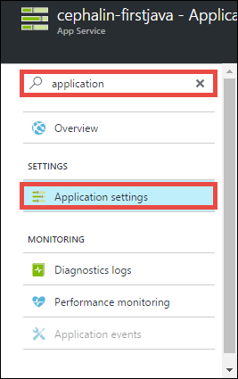

<properties 
    pageTitle="Implantar o aplicativo web do primeiro Java para Azure em cinco minutos | Microsoft Azure" 
    description="Saiba como é fácil executar aplicativos web no aplicativo de serviço Implantando um aplicativo de amostra. Começar a fazer desenvolvimento real rapidamente e ver os resultados imediatamente." 
    services="app-service\web"
    documentationCenter=""
    authors="cephalin"
    manager="wpickett"
    editor=""
/>

<tags
    ms.service="app-service-web"
    ms.workload="web"
    ms.tgt_pltfrm="na"
    ms.devlang="na"
    ms.topic="hero-article"
    ms.date="10/13/2016" 
    ms.author="cephalin"
/>
    
# Implantar o aplicativo web do primeiro Java para Azure em cinco minutos

Este tutorial ajuda você a implantar um aplicativo de web Java simple para [O serviço de aplicativo do Azure](../app-service/app-service-value-prop-what-is.md).
Você pode usar o serviço de aplicativo para criar aplicativos web, [extremidades de volta do aplicativo móvel](/documentation/learning-paths/appservice-mobileapps/)e [aplicativos de API](../app-service-api/app-service-api-apps-why-best-platform.md).

Você irá: 

- Crie um aplicativo web no serviço de aplicativo do Azure.
- Implante um aplicativo de Java de amostra.
- Consulte seu código em execução ao vivo em produção.

## Pré-requisitos

- Obtenha um cliente de FTP/FTPS, como [FileZilla](https://filezilla-project.org/).
- Obter uma conta do Microsoft Azure. Se você não tiver uma conta, você pode [inscrever-se para uma avaliação gratuita](/pricing/free-trial/?WT.mc_id=A261C142F) ou [ativar seus benefícios de assinante do Visual Studio](/pricing/member-offers/msdn-benefits-details/?WT.mc_id=A261C142F).

>[AZURE.NOTE] Você pode [Experimentar o serviço de aplicativo](http://go.microsoft.com/fwlink/?LinkId=523751) sem uma conta do Azure. Criar um aplicativo de starter e brincar com ele para até uma hora – sem cartão de crédito necessários, sem compromissos.

## Criar um aplicativo web

1. Entrar no [portal do Azure](https://portal.azure.com) com sua conta do Azure.

2. No menu à esquerda, clique em **novo** > **Web + Mobile** > **Web App**.

    

3. Na lâmina de criação do aplicativo, use as seguintes configurações para seu novo aplicativo:

    - **Nome do aplicativo**: digite um nome exclusivo.
    - **Grupo de recursos**: selecione **Criar novo** e dê um nome para o grupo de recursos.
    - **Local da plano de serviço de aplicativo**: clique nessa opção para configurar, clique em **Criar novo** para definir o nome, o local e o nível de preços do plano de serviço de aplicativo. Fique à vontade para usar o **livre** preços camada.

    Quando terminar, blade de criação seu aplicativo deve ter esta aparência:

    

3. Clique em **criar** na parte inferior. Você pode clicar no ícone de **notificação** na parte superior para ver o progresso.

    

4. Quando terminar de implantação, você verá esta mensagem de notificação. Clique na mensagem para abrir blade da sua implantação.

    

5. Na lâmina **implantação bem-sucedida** , clique no link do **recurso** para abrir blade do seu novo aplicativo web.

    

## Implantar um aplicativo de Java em seu aplicativo web

Agora, vamos implantar um aplicativo de Java no Azure usando FTPS.

5. Na lâmina web app, role para baixo até **as configurações do aplicativo** ou pesquisar por ele e clique em. 

    

6. **Versão Java**, selecione **Java 8** e clique em **Salvar**.

    

    Quando você recebe a notificação **atualizado com êxito configurações web app**, navegue até http://*&lt;appname >*. azurewebsites.net para ver o servlet do JSP padrão em ação.

7. De volta à lâmina de aplicativo web, role para baixo até **as credenciais de implantação** ou pesquisar por ele e clique em.

8. Defina suas credenciais de implantação e clique em **Salvar**.

7. Volta a lâmina de aplicativo da web, clique em **Visão geral**. Ao lado do **nome de usuário/implantação de FTP** e **FTPS hostname**, clique no botão **Copiar** para copiar esses valores.

    

    Agora você está pronto para implantar seu aplicativo Java com FTPS.

8. No seu cliente de FTP/FTPS, faça logon no servidor FTP do seu aplicativo web Azure usando os valores que você copiou na última etapa. Use a senha de implantação que você criou anteriormente.

    A captura de tela a seguir mostra o registro em log usando FileZilla.

    

    Você pode ver avisos de segurança para o certificado SSL não reconhecido do Azure. Ir adiante e continuar.

9. Clique [neste link](https://github.com/Azure-Samples/app-service-web-java-get-started/raw/master/webapps/ROOT.war) para baixar o arquivo de guerra em sua máquina local.

9. No seu cliente de FTP/FTPS, navegue até **/site/wwwroot/webapps** no site remoto e arraste o arquivo baixado de guerra em sua máquina local no diretório remoto.

    

    Clique em **Okey** para substituir o arquivo no Azure.

    >[AZURE.NOTE] De acordo com o comportamento padrão do Tomcat filename **ROOT.war** no /site/wwwroot/webapps oferece a você o raiz web app (http://*&lt;appname >*. azurewebsites.net) e o nome do arquivo ** * &lt;anyname >*. war** oferece a você um aplicativo web nomeado (http://*&lt;appname >*.azurewebsites.net/*&lt;anyname >*).

Pronto! Seu aplicativo Java agora está executando ao vivo no Azure. No seu navegador, navegue até http://*&lt;appname >*. azurewebsites.net para vê-la em ação. 

## Fazer atualizações em seu aplicativo

Sempre que você precisa fazer uma atualização, basta carregue o novo arquivo de guerra para o mesmo diretório remoto com seu cliente FTP/FTPS.

## Próximas etapas

[Criar um aplicativo da web de Java de um modelo do Azure Marketplace](web-sites-java-get-started.md#marketplace). Você pode obter seu próprio contêiner Tomcat totalmente personalizável e obter a UI Manager familiar. 

Depure seu aplicativo web Azure, diretamente no [IntelliJ](app-service-web-debug-java-web-app-in-intellij.md) ou [Eclipse](app-service-web-debug-java-web-app-in-eclipse.md).

Ou, faça mais com seu aplicativo web do primeiro. Por exemplo:

- Experimente [outras maneiras de implantar seu código Azure](../app-service-web/web-sites-deploy.md). 
- Leve o seu aplicativo do Azure para o próximo nível. Autentica os usuários. Escala-lo com base na demanda. Configure alguns alertas de desempenho. Todos com apenas alguns cliques. Consulte [Adicionar funcionalidade ao seu aplicativo web do primeiro](app-service-web-get-started-2.md).

