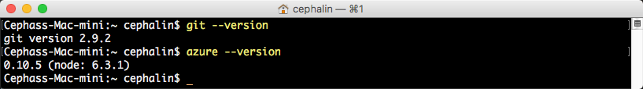
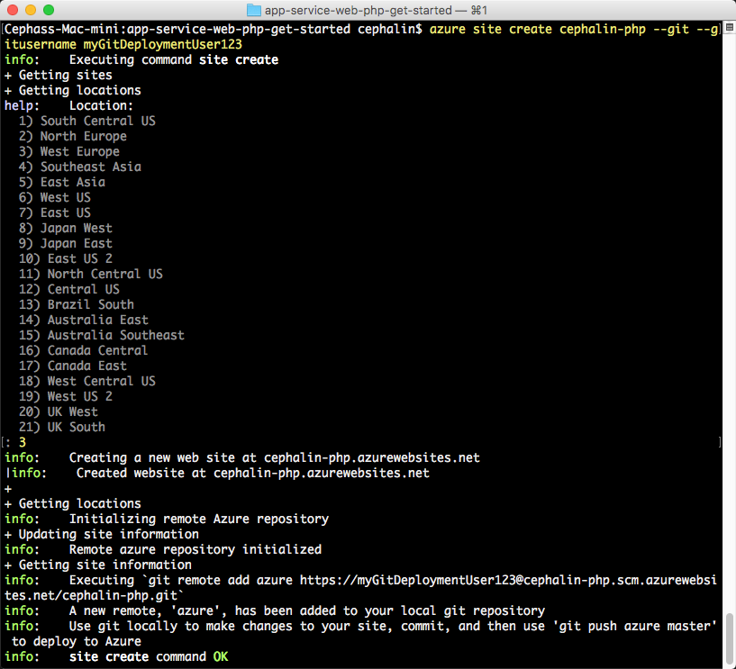

<properties 
    pageTitle="Implantar o aplicativo web do primeiro PHP para Azure em cinco minutos | Microsoft Azure" 
    description="Saiba como é fácil executar aplicativos web no aplicativo de serviço Implantando um aplicativo de amostra. Começar a fazer desenvolvimento real rapidamente e ver os resultados imediatamente." 
    services="app-service\web"
    documentationCenter=""
    authors="cephalin"
    manager="wpickett"
    editor=""
/>

<tags
    ms.service="app-service-web"
    ms.workload="web"
    ms.tgt_pltfrm="na"
    ms.devlang="na"
    ms.topic="hero-article"
    ms.date="10/13/2016" 
    ms.author="cephalin"
/>
    
# Implantar o aplicativo web do primeiro PHP para Azure em cinco minutos

Este tutorial ajuda você a implantar o seu aplicativo web do primeiro PHP ao [Serviço de aplicativo do Azure](../app-service/app-service-value-prop-what-is.md).
Você pode usar o serviço de aplicativo para criar aplicativos web, [extremidades de volta do aplicativo móvel](/documentation/learning-paths/appservice-mobileapps/)e [aplicativos de API](../app-service-api/app-service-api-apps-why-best-platform.md).

Você irá: 

- Crie um aplicativo web no serviço de aplicativo do Azure.
- Implante código PHP de amostra.
- Consulte seu código em execução ao vivo em produção.
- Atualize o aplicativo web da mesma forma que faria [push que gito confirma](https://git-scm.com/docs/git-push).

## Pré-requisitos

- [Gito](http://www.git-scm.com/downloads).
- [CLI azure](../xplat-cli-install.md).
- Uma conta do Microsoft Azure. Se você não tiver uma conta, você pode [inscrever-se para uma avaliação gratuita](/pricing/free-trial/?WT.mc_id=A261C142F) ou [ativar seus benefícios de assinante do Visual Studio](/pricing/member-offers/msdn-benefits-details/?WT.mc_id=A261C142F).

>[AZURE.NOTE] Você pode [Experimentar o serviço de aplicativo](http://go.microsoft.com/fwlink/?LinkId=523751) sem uma conta do Azure. Criar um aplicativo de starter e brincar com ele para até uma hora – sem cartão de crédito necessários, sem compromissos.

## Implantar um aplicativo da web PHP

1. Abra um novo prompt de comando do Windows, janela do PowerShell, shell do Linux ou terminal dos X. Executar `git --version` e `azure --version` para verificar se gito e do Azure estão instalados no seu computador.

    

    Se você ainda não instalou as ferramentas, consulte [pré-requisitos](#Prerequisites) para links de download.

3. Faça logon no Azure assim:

        azure login

    Siga a mensagem de ajuda para continuar o processo de login.

    

4. Alterar o Azure CLI em modo ASM e, em seguida, defina o usuário de implantação do aplicativo de serviço. Você implantará código usando as credenciais mais tarde.

        azure config mode asm
        azure site deployment user set --username <username> --pass <password>

1. Alterar para uma pasta de trabalho (`CD`) e clonar o aplicativo de amostra assim:

        git clone https://github.com/Azure-Samples/app-service-web-php-get-started.git

2. Alterar para o repositório de seu aplicativo de amostra. Por exemplo:

        cd app-service-web-php-get-started

4. Crie o recurso de aplicativo de serviço de aplicativo no Azure com um nome de aplicativo exclusiva e o usuário de implantação configurado anteriormente. Quando solicitado, especifique o número da região desejada.

        azure site create <app_name> --git --gitusername <username>

    

    Seu aplicativo é criado no Azure agora. Além disso, a pasta atual for inicializado gito e conectada para o novo aplicativo de serviço de aplicativo como um gito remoto.
    Você pode navegar para a URL de aplicativo (http://&lt;app_name >. azurewebsites.net) para exibir a página HTML belas padrão, mas vamos acessá-lo seu código agora.

4. Implante seu código de amostra para seu aplicativo do Azure como você faria push qualquer código com gito. Quando solicitado, use a senha que você configurou anteriormente.

        git push azure master

    

    `git push`não apenas coloca um código no Azure, mas também aciona tarefas de implantação do mecanismo de implantação. Você também pode  [Habilitar a extensão de compositor](web-sites-php-mysql-deploy-use-git.md#composer) para processar arquivos de composer.json em seu aplicativo PHP automaticamente.

Parabéns, você implantou o aplicativo de serviço de aplicativo do Azure.

## Consulte seu aplicativo executando ao vivo

Para ver seu aplicativo em execução no Azure, execute este comando em qualquer pasta no seu repositório:

    azure site browse

## Fazer atualizações em seu aplicativo

Agora você pode usar gito por push da raiz do seu projeto (repositório) a qualquer momento para fazer uma atualização para o site ao vivo. Você fazer isso da mesma forma que quando você distribuiu seu código na primeira vez. Por exemplo, sempre que você deseja enviar uma nova alteração que você tenha testado localmente, basta execute os seguintes comandos na raiz do seu projeto (repositório):

    git add .
    git commit -m "<your_message>"
    git push azure master

## Próximas etapas

[Criar, configurar e implantar um aplicativo da web de Laravel no Azure](app-service-web-php-get-started.md). Seguindo este tutorial, você aprenderá as habilidades básicas que você precisa executar qualquer PHP web app no Azure, tais como:

- Criar e configurar aplicativos no Azure do PowerShell/Bash.
- Definir PHP versão.
- Use um arquivo de início que não esteja no diretório raiz do aplicativo.
- Habilite automação compositor.
- Variáveis de ambiente específicas de acesso.
- Solucionar problemas comuns.

Ou, faça mais com seu aplicativo web do primeiro. Por exemplo:

- Experimente [outras maneiras de implantar seu código Azure](../app-service-web/web-sites-deploy.md). Por exemplo, para implantar em um dos seus repositórios GitHub, basta selecione **GitHub** em vez de **Repositório de gito Local** nas **Opções de implantação**.
- Leve o seu aplicativo do Azure para o próximo nível. Autentica os usuários. Escala-lo com base na demanda. Configure alguns alertas de desempenho. Todos com apenas alguns cliques. Consulte [Adicionar funcionalidade ao seu aplicativo web do primeiro](app-service-web-get-started-2.md).

