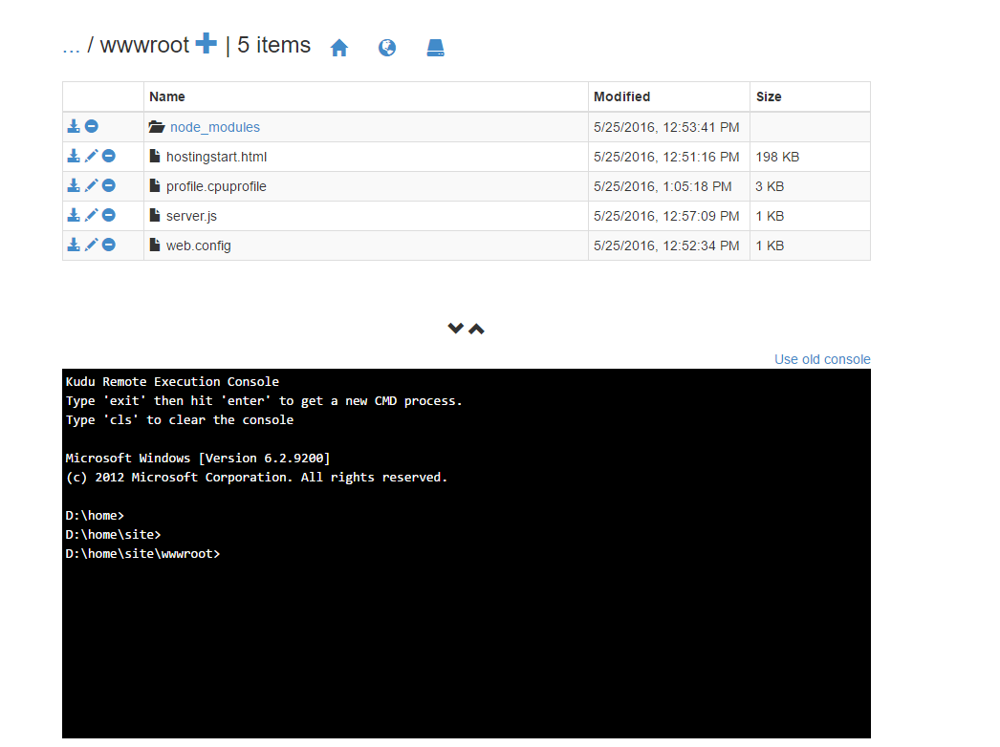

<properties
    pageTitle="Práticas recomendadas e guia de solução de problemas para aplicativos nós nos aplicativos de Web do Azure"
    description="Aprenda as práticas recomendadas e as etapas de solução de problemas para aplicativos nós nos aplicativos de Web do Azure."
    services="app-service\web"
    documentationCenter="nodejs"
    authors="ranjithr"
    manager="wadeh"
    editor=""/>

<tags
    ms.service="app-service-web"
    ms.workload="web"
    ms.tgt_pltfrm="na"
    ms.devlang="nodejs"
    ms.topic="article"
    ms.date="06/06/2016"
    ms.author="ranjithr;wadeh"/>
    
# <a name="best-practices-and-troubleshooting-guide-for-node-applications-on-azure-web-apps"></a>Práticas recomendadas e guia de solução de problemas para aplicativos nós nos aplicativos de Web do Azure

[AZURE.INCLUDE [tabs](../../includes/app-service-web-get-started-nav-tabs.md)]

Neste artigo, você aprenderá as práticas recomendadas e as etapas de solução de problemas para [aplicativos de nó](app-service-web-nodejs-get-started.md) em execução no Azure Webapps (com [iisnode](https://github.com/azure/iisnode)).

>[AZURE.WARNING] Tenha cuidado ao usar as etapas de solução de problemas no seu site de produção. Recomendação é solucionar problemas de seu aplicativo em uma configuração de não produção por exemplo seu slot preparação e quando o problema seja corrigido, troque seu slot preparação com seu slot de produção.

## <a name="iisnode-configuration"></a>Configuração de IISNODE

Este [arquivo de esquema](https://github.com/Azure/iisnode/blob/master/src/config/iisnode_schema_x64.xml) mostra todas as configurações que podem ser configuradas para iisnode. Estas são algumas das configurações que serão úteis para seu aplicativo:

* nodeProcessCountPerApplication

    Esta configuração controla o número de processos de nó que são iniciados por aplicativo do IIS. Valor padrão é 1. Você pode iniciar do node.exe quantas como sua contagem de núcleo de máquina virtual definindo isso como 0. Valor recomendado é 0 para a maioria dos aplicativos, portanto você pode utilizar todas as cores em sua máquina. Node.exe é single threaded então um node.exe será consumir um máximo de 1 núcleo e obter o máximo desempenho do seu aplicativo de nó que você deseja utilizar todas as cores.

* nodeProcessCommandLine

    Esta configuração controla o caminho para o node.exe. Você pode definir esse valor para apontar para sua versão de node.exe.

* maxConcurrentRequestsPerProcess

    Esta configuração controla o número máximo de solicitações simultâneas enviadas por iisnode para cada node.exe. Em webapps azure, o valor padrão para isso é infinito. Você não precisará preocupar com essa configuração. Fora webapps azure, o valor padrão é 1024. Talvez você queira configurar isso dependendo de quantos solicita que seu aplicativo obtém e a velocidade seu aplicativo processa cada solicitação.

* maxNamedPipeConnectionRetry

    Esta configuração controla o número máximo de vezes iisnode tentará fazer conexão sobre a conexão nomeada para enviar a solicitação para node.exe. Essa configuração em combinação com namedPipeConnectionRetryDelay determina o tempo limite total de cada solicitação dentro de iisnode. Valor padrão é 200 no Azure Webapps. Total de tempo limite em segundos = (maxNamedPipeConnectionRetry \* namedPipeConnectionRetryDelay) / 1000

* namedPipeConnectionRetryDelay

    Essa configuração controla a quantidade de tempo (em ms) iisnode esperará entre cada tentativa para enviar a solicitação para node.exe sobre os pipes nomeados. Valor padrão é 250ms.
    Total de tempo limite em segundos = (maxNamedPipeConnectionRetry \* namedPipeConnectionRetryDelay) / 1000

    Por padrão, o tempo de limite total em iisnode no azure webapps é 200 \* 250ms = 50 segundos.

* logDirectory

    Esta configuração controla o diretório onde iisnode registrará stdout/stderr. Valor padrão é iisnode que é relativo do diretório de script principal (diretório onde Server. js principal estiver presente)

* debuggerExtensionDll

    Esta configuração controla qual versão do Inspetor de nó iisnode usará ao depurar o aplicativo de nó. Atualmente iisnode-Inspetor-0.7.3.dll e iisnode inspector.dll são os valores válidos somente 2 para esta configuração. Valor padrão é iisnode-Inspetor-0.7.3.dll. iisnode-Inspetor-0.7.3.dll versão usa o nó de Inspetor de 0.7.3 e usa WebSocket, portanto, será necessário habilitar WebSocket em sua Web App azure para usar esta versão. Consulte <http://www.ranjithr.com/?p=98> para obter mais detalhes sobre como configurar iisnode para usar o Inspetor de nó novo.

* flushResponse

    O comportamento padrão do IIS é que ela buffers dados de resposta para cima 4 MB antes de liberar ou até o final da resposta, o que vier primeiro. iisnode oferece uma configuração para substituir esse comportamento: para liberar um fragmento do corpo da entidade de resposta assim que iisnode recebe-la de node.exe, você precisa definir o iisnode/@flushResponse atributo na Web. config como 'true':
    
    ```
    <configuration>    
        <system.webServer>    
            <!-- ... -->    
            <iisnode flushResponse="true" />    
        </system.webServer>    
    </configuration>
    ```

    A ativação de liberação de cada fragmento do corpo da entidade de resposta adiciona sobrecarga de desempenho que reduz a taxa de transferência do sistema, ~ 5% (a partir de v0.1.13), portanto, é melhor escopo essa configuração somente para os pontos de extremidade que exigem a resposta streaming (por exemplo, usando o <location> elemento no Web. config)

    Além disso, para streaming de aplicativos, você precisará também definir responseBufferLimit do seu manipulador de iisnode para 0.
    
    ```
    <handlers>    
        <add name="iisnode" path="app.js" verb="\*" modules="iisnode" responseBufferLimit="0"/>    
    </handlers>
    ```

* watchedFiles

    Esta é uma lista de ponto e vírgula separada dos arquivos que serão observadas para alterações. Uma alteração em um arquivo faz com que o aplicativo para a Lixeira. Cada entrada consiste em um nome de diretório opcional além de nome de arquivo necessário que são relativo a pasta onde se encontra o ponto de entrada do aplicativo principal. Caracteres curinga é permitida em apenas a parte de nome de arquivo. Valor padrão é "\*. js;web.config"

* recycleSignalEnabled

    Valor padrão é falso. Se habilitada, seu aplicativo de nó pode conectar a um pipes nomeados (variável de ambiente IISNODE\_controle\_barra VERTICAL) e enviar uma mensagem de "reciclagem". Isso fará com que o w3wp à Lixeira normalmente.

* idlePageOutTimePeriod

    Valor padrão é 0 que significa que esse recurso está desativado. Quando definido como um valor maior do que 0, iisnode será a paginação todos os processos filho cada milissegundos 'idlePageOutTimePeriod'. Para compreender qual página check-out significa, consulte esta [documentação](https://msdn.microsoft.com/library/windows/desktop/ms682606.aspx). Essa configuração será útil para aplicativos que consumam muita memória e quiser memória pageout disco ocasionalmente para liberar alguns RAM.

>[AZURE.WARNING] Tenha cuidado ao habilitar as seguintes configurações nos aplicativos de produção. Recomendação é não habilitá-las em aplicativos de produção ao vivo.

* debugHeaderEnabled

    O valor padrão é falso. Se definido como true, iisnode adicionar um cabeçalho de resposta da HTTP iisnode-depuração para cada resposta de HTTP, ele envia que o valor do cabeçalho iisnode depuração é uma URL. Partes individuais de informações de diagnóstico podem ser obtidas examinando o fragmento de URL, mas uma visualização muito melhor é obtida abrindo a URL no navegador.

* loggingEnabled

    Esta configuração controla o log de stdout e stderr por iisnode. Iisnode irão capturar stdout/stderr de processos de nó que inicia a ele e gravar no diretório especificado na configuração 'logDirectory'. Depois que isso esteja habilitado, seu aplicativo será gravado logs ao sistema de arquivos e, dependendo da quantidade de log feito pelo aplicativo, pode haver implicações de desempenho.

* devErrorsEnabled

    Valor padrão é falso. Quando definida como true, iisnode exibirá o código de status HTTP e o código de erro Win32 no seu navegador. O código win32 será útil em determinados tipos de problemas de depuração.
    
* debuggingEnabled (não habilite no site de produção em tempo real)

    Esta configuração controla o recurso de depuração. Iisnode é integrado ao Inspetor de nó. Habilitando essa configuração, você habilitar a depuração de seu aplicativo de nó. Quando esta configuração é ativada, o iisnode será layout os arquivos do Inspetor de nó necessárias no diretório de 'debuggerVirtualDir' na primeira solicitação depuração ao seu aplicativo de nó. Você pode carregar o Inspetor de nó enviando uma solicitação para http://yoursite/server.js/debug. Você pode controlar o segmento de URL de depuração com a configuração de 'debuggerPathSegment'. Por padrão debuggerPathSegment = 'Depurar'. Você pode definir isso em um GUID por exemplo, para que fique mais difícil de ser descoberto por outras pessoas.

    Verifique esse [link](https://tomasz.janczuk.org/2011/11/debug-nodejs-applications-on-windows.html) para obter mais detalhes sobre depuração.

## <a name="scenarios-and-recommendationstroubleshooting"></a>Cenários e solução de problemas/recomendações

### <a name="my-node-application-is-making-too-many-outbound-calls"></a>Meu aplicativo nó está fazendo muitas chamadas de saída.

Muitos aplicativos deseja fazer conexões de saída como parte de sua operação normal. Por exemplo, quando chega uma solicitação, seu aplicativo de nó desejaria contate um API REST em outro lugar e obter algumas informações para processar a solicitação. Convém usar um agente de funcionamento de manter ao fazer chamadas de http ou https. Por exemplo, você poderia usar o módulo agentkeepalive como seu agente de funcionamento manter ao fazer essas chamadas de saída. Isso garante que os sockets sejam reutilizadas em sua máquina virtual da Web de App azure e reduzir a sobrecarga de criar novas sockets para cada solicitação de saída. Além disso, isso garante que você está usando o menor número de sockets fazer muitas solicitações de saída e, portanto, você não exceder o maxSockets que estão alocados por máquina virtual. Recomendação no Azure Webapps seria definir o valor de maxSockets agentKeepAlive para um total de 160 sockets por máquina virtual. Isso significa que se você tiver 4 node.exe em execução na máquina virtual, você desejaria definir o maxSockets agentKeepAlive 40 por node.exe que é 160 total por máquina virtual.

Exemplo de configuração de agentKeepALive:

```
var keepaliveAgent = new Agent({    
    maxSockets: 40,    
    maxFreeSockets: 10,    
    timeout: 60000,    
    keepAliveTimeout: 300000    
});
```

Este exemplo pressupõe que você tenha node.exe 4 em execução em sua máquina virtual. Se você tiver um número diferente de node.exe em execução na máquina virtual, será necessário modificar o maxSockets definindo adequadamente.

### <a name="my-node-application-is-consuming-too-much-cpu"></a>Meu aplicativo nó está consumindo muito CPU.

Você provavelmente obterá uma recomendação do Azure Webapps em seu portal sobre alto consumo de cpu. Você também pode configurar monitores para assistir para certas [métricas](web-sites-monitor.md). Quando a verificação de uso da CPU no [Painel de controle do Azure Portal](../application-insights/app-insights-web-monitor-performance.md), verifique os valores de MAX CPU para não perder os valores de pico.
Em casos onde você acha que seu aplicativo está consumindo muito CPU e você não consegue explicar, você precisará seu aplicativo de nó do perfil.

### 

#### <a name="profiling-your-node-application-on-azure-webapps-with-v8-profiler"></a>Seu aplicativo de nó no azure webapps com V8 gerador de perfil de criação de perfil

Por exemplo, permite que digamos que você tenha um aplicativo do mundo de saudação que você deseja perfil conforme mostrado abaixo:

```
var http = require('http');    
function WriteConsoleLog() {    
    for(var i=0;i<99999;++i) {    
        console.log('hello world');    
    }    
}

function HandleRequest() {    
    WriteConsoleLog();    
}

http.createServer(function (req, res) {    
    res.writeHead(200, {'Content-Type': 'text/html'});    
    HandleRequest();    
    res.end('Hello world!');    
}).listen(process.env.PORT);
```

Acesse seu scm site https://yoursite.scm.azurewebsites.net/DebugConsole

Você verá um prompt de comando, conforme mostrado abaixo. Ir para o seu diretório de site/wwwroot


Execute o comando "npm instalar o criador de perfil v8"

Isso deve instalar v8-gerador de perfil nó\_diretório de módulos e todas as suas dependências.
Agora, edite seu Server. js para seu aplicativo do perfil.

```
var http = require('http');    
var profiler = require('v8-profiler');    
var fs = require('fs');

function WriteConsoleLog() {    
    for(var i=0;i<99999;++i) {    
        console.log('hello world');    
    }    
}

function HandleRequest() {    
    profiler.startProfiling('HandleRequest');    
    WriteConsoleLog();    
    fs.writeFileSync('profile.cpuprofile', JSON.stringify(profiler.stopProfiling('HandleRequest')));    
}

http.createServer(function (req, res) {    
    res.writeHead(200, {'Content-Type': 'text/html'});    
    HandleRequest();    
    res.end('Hello world!');    
}).listen(process.env.PORT);
```

Alterações acima serão a função de WriteConsoleLog de perfil e, em seguida, gravar a saída de perfil 'profile.cpuprofile' arquivo em seu site wwwroot. Envie uma solicitação para seu aplicativo. Você verá um arquivo de 'profile.cpuprofile' criado em seu site wwwroot.



Baixe este arquivo e você precisará abrir este arquivo com ferramentas de F12 Chrome. Pressionar F12 no chrome, clique na "Guia Perfis". Clique no botão "Carregar". Selecione seu arquivo de profile.cpuprofile que você acabou de baixar. Clique no perfil que você acabou de ser carregado.


Você verá que 95% do tempo foi consumida por função WriteConsoleLog, conforme mostrado abaixo. Isso também mostra os números de linha exata e arquivos de origem que causam o problema.

### <a name="my-node-application-is-consuming-too-much-memory"></a>Meu aplicativo nó está consumindo muita memória.

Você provavelmente obterá uma recomendação do Azure Webapps em seu portal sobre consumo de memória alta. Você também pode configurar monitores para assistir para certas [métricas](web-sites-monitor.md). Ao verificar o uso de memória no [Painel de controle do Azure Portal](../application-insights/app-insights-web-monitor-performance.md), verifique os valores de máximo de memória para não perder os valores de pico.

#### <a name="leak-detection-and-heap-diffing-for-nodejs"></a>Detecção de escape e comparando pilha para Node 

Você pode usar o [nó memwatch](https://github.com/lloyd/node-memwatch) para ajudá-lo a identificar perdas de memória.
Você pode instalar memwatch como v8 gerador de perfil e editar seu código para captura e comparação vazamentos de pilhas para identificar a memória em seu aplicativo.

### <a name="my-nodeexes-are-getting-killed-randomly"></a>Meu node.exe estão recebendo eliminadas aleatoriamente 

Há alguns motivos por que isso pode estar ocorrendo:

1.  Seu aplicativo é gerar exceções não detectadas – d: seleção de Please\\inicial\\arquivos de log\\aplicativo\\arquivo log Errors para obter os detalhes sobre a exceção. Este arquivo tem o rastreamento de pilha para que você possa corrigir o seu aplicativo baseado em isso.

2.  Seu aplicativo está consumindo muita memória que está afetando a outros processos da introdução. Se a memória de máquina virtual total for próximo 100%, seu node.exe poderia ser eliminadas pelo Gerenciador de processo para permitir que outros processos Obtenha uma chance de fazer algum trabalho. Para corrigir isso, verifique se que seu aplicativo não está perdendo memória ou se o aplicativo que você realmente precisa usar muita memória, por favor expandido para uma máquina virtual maior com muito mais de RAM.

### <a name="my-node-application-does-not-start"></a>Não iniciar meu aplicativo de nó

Se seu aplicativo está retornando 500 erros na inicialização, pode haver alguns motivos:

1.  Node.exe não está presente no local correto. Verificar a configuração de nodeProcessCommandLine.

2.  Arquivo de script principal não está presente no local correto. Config e verifique se que o nome do arquivo de script principal na seção manipuladores corresponde o arquivo de script principal.

3.  Configuração da Web. config não está correta: verificar os valores da nomes configurações.

4.  Iniciar fria – seu aplicativo está demorando muito para inicialização. Se seu aplicativo levar mais de (maxNamedPipeConnectionRetry \* namedPipeConnectionRetryDelay) / 1000 segundos, iisnode retornará Erro 500. Aumente os valores dessas configurações para corresponder ao seu tempo de Iniciar aplicativo para impedir que iisnode de tempo limite e retornando o erro 500.

### <a name="my-node-application-crashed"></a>Meu aplicativo de nó travado

Seu aplicativo é gerar exceções não detectadas – d: seleção de Please\\inicial\\arquivos de log\\aplicativo\\arquivo log Errors para obter os detalhes sobre a exceção. Este arquivo tem o rastreamento de pilha para que você possa corrigir o seu aplicativo baseado em isso.

### <a name="my-node-application-takes-too-much-time-to-startup-cold-start"></a>Meu aplicativo nó demora muito tempo para inicialização (Iniciar fria)

Motivo mais comum para isso é que o aplicativo tem muitos arquivos no nó\_módulos e o aplicativo tenta carregar maioria desses arquivos durante a inicialização. Por padrão, desde que seus arquivos residem no compartilhamento de rede no Azure Webapps, carregar arquivos tantos pode levar alguns instantes.
Algumas soluções para torná-lo mais rápido são:

1.  Verifique se que você tem uma estrutura de dependência simples e sem dependências duplicadas usando npm3 instalar seus módulos.

2.  Tente preguiça carregar seu nó\_módulos e não carregar todos os módulos na inicialização. Isso significa que a chamada para require('module') deve ser feita quando realmente precisar dentro da função que você tenta usar o módulo.

3.  Webapps Azure oferece um recurso chamado cache local. Este recurso copia o conteúdo do compartilhamento de rede para o disco local na máquina virtual. Como os arquivos são locais, o tempo de carregamento do nó\_módulos é muito mais rápido. -Esta [documentação](../app-service/app-service-local-cache.md) explica como usar o Cache Local mais detalhadamente.

## <a name="iisnode-http-status-and-substatus"></a>Substatus e status de http IISNODE

Este [arquivo de origem](https://github.com/Azure/iisnode/blob/master/src/iisnode/cnodeconstants.h) lista todos o possíveis status/substatus combinação iisnode pode retornar em caso de erro.

Habilitar FREB para seu aplicativo para ver o código de erro win32 (certifique-se de habilitar FREB apenas em sites de não produção por razões de desempenho).

| Status do HTTP | SubStatus de http | Motivo possível?                                                                                                                                                                                            
|-------------|----------------|--------------------------------------------------------------------------------------------------------------------------------------------------------------
| 500         | 1000           | Houve algum problema expedir a solicitação para IISNODE – verificar se node.exe foi iniciado. Node.exe poderia ter travou na inicialização. Verifique a configuração da Web. config de erros.                                                                                                                                                                                                                                                                                     |
| 500         | 1001           | -Win32Error 0x2 - aplicativo não está respondendo à URL. Verifica regras de reconfiguração de URL ou se o seu aplicativo express tem as rotas corretas definidas. -Win32Error 0x6d – pipes nomeados está ocupado – Node.exe não está aceitando solicitações porque a barra vertical está ocupado. Verificar alto uso da cpu. -Outros erros – verificar se node.exe travou.
| 500         | 1002           | Node.exe travou – verificar d:\\inicial\\arquivos de log\\Errors de log de rastreamento de pilha.                                                                                                                                                                                                                                                                                                                                                                                        |
| 500         | 1003           | Conduza configuração problema – você nunca verá isto, mas se fizer isso, a configuração de pipes nomeados está incorreta.                                                                                                                                                                                                                                                                                                                                                          |
| 500         | 1004-1018      | Houve algum erro ao enviar a solicitação ou processar a resposta de/para node.exe. Verifique se node.exe travou. Verificar d:\\inicial\\arquivos de log\\Errors de log de rastreamento de pilha.                                                                                                                                                                                                                                                                                    |
| 503         | 1000           | Não há memória suficiente para alocar mais conexões de pipes nomeados. Por que seu aplicativo está consumindo memória muito de seleção. Verifique o valor de configuração de maxConcurrentRequestsPerProcess. Se não infinito e você tiver muitas solicitações, aumente esse valor para evitar esse erro.                                                                                                                                                                                                                                                                                                                  |
| 503         | 1001           | Solicitação não pôde ser enviada para node.exe porque o aplicativo é reciclagem. Depois que o aplicativo tem reciclados, solicitações devem ser atendidas normalmente.                                                                                                                                                                                                                                                                                                               |
| 503         | 1002           | Código de erro win32 seleção por real motivo – solicitação não pôde ser distribuído para um node.exe.                                                                                                                                                                                                                                                                                                                                                                               |
| 503         | 1003           | Pipes nomeados está muito ocupado – verificar se o nó está consumindo muita CPU                                                                                                                                                                                                                                                                                                                                                                                                        
                                                                                                                                                                                                                                                                                                            
                                                                                                                                                                                                                                                                                                                                                                                                                                                                                                         
Há uma configuração dentro NODE.exe chamado nó\_pendente\_barra VERTICAL\_INSTÂNCIAS. Por padrão fora do azure webapps Esse valor é 4. Isso significa que node.exe só pode aceitar 4 solicitações por vez na pipes nomeados. No Azure Webapps, esse valor é definido como 5000 e esse valor deve ser bom o suficiente para a maioria dos aplicativos de nós em execução no azure webapps. Você não verá 503.1003 no azure webapps porque temos um valor alto para o nó\_pendente\_barra VERTICAL\_INSTÂNCIAS.  |

## <a name="more-resources"></a>Mais recursos

Siga estes links para saber mais sobre os aplicativos Node no serviço de aplicativo do Azure.

* [Introdução ao Node web apps no serviço de aplicativo do Azure](app-service-web-nodejs-get-started.md)
* [Como depurar um aplicativo da web Node no serviço de aplicativo do Azure](web-sites-nodejs-debug.md)
* [Usando o Node módulos com aplicativos do Azure](../nodejs-use-node-modules-azure-apps.md)
* [Aplicativos do Azure serviço de aplicativo Web: Node](https://blogs.msdn.microsoft.com/silverlining/2012/06/14/windows-azure-websites-node-js/)
* [Central de desenvolvedores do Node](../nodejs-use-node-modules-azure-apps.md)
* [Explorando o Console de depuração Kudu Super secreto](https://azure.microsoft.com/documentation/videos/super-secret-kudu-debug-console-for-azure-web-sites/)