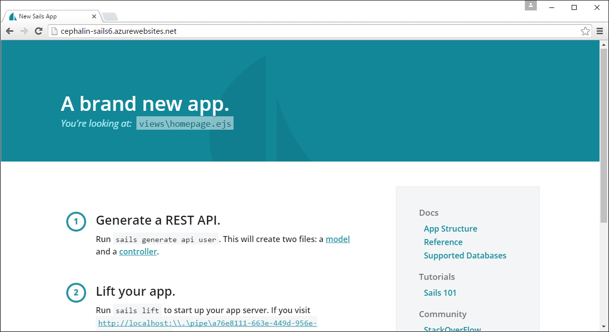

<properties
    pageTitle="Implantar um aplicativo de web Sails.js serviço de aplicativo do Azure"
    description="Saiba como implantar um aplicativo de Node serviço de aplicativo do Azure. Este tutorial mostra como implantar um aplicativo da web de Sails.js."
    services="app-service\web"
    documentationCenter="nodejs"
    authors="cephalin"
    manager="wpickett"
    editor=""/>

<tags
    ms.service="app-service-web"
    ms.workload="web"
    ms.tgt_pltfrm="na"
    ms.devlang="nodejs"
    ms.topic="article"
    ms.date="09/23/2016"
    ms.author="cephalin"/>

# Implantar um aplicativo de web Sails.js serviço de aplicativo do Azure

Este tutorial mostra como implantar um aplicativo de Sails.js serviço de aplicativo do Azure. No processo, é possível notar algum conhecimento geral sobre como configurar seu aplicativo Node para executar em um serviço de aplicativo. 

Você deve ter conhecimento de trabalho de Sails.js. Este tutorial não se destina a ajudá-lo com problemas relacionados à execução Sail.js em geral.

## Pré-requisitos

- [Node](https://nodejs.org/)
- [Sails.js](http://sailsjs.org/get-started)
- [Gito](http://www.git-scm.com/downloads)
- [CLI Azure](../xplat-cli-install.md)
- Uma conta do Microsoft Azure. Se você não tiver uma conta, você pode [inscrever-se para uma avaliação gratuita](/pricing/free-trial/?WT.mc_id=A261C142F) ou [ativar seus benefícios de assinante do Visual Studio](/pricing/member-offers/msdn-benefits-details/?WT.mc_id=A261C142F).

>[AZURE.NOTE] Para ver o serviço de aplicativo do Azure em ação antes de se inscrever para uma conta do Azure, vá para [Experimentar o serviço de aplicativo](http://go.microsoft.com/fwlink/?LinkId=523751). Lá, você pode criar imediatamente um aplicativo de curta duração starter no serviço de aplicativo — sem cartão de crédito necessários, sem compromissos.

## Etapa 1: Criar um aplicativo de Sails.js localmente

Primeiro, crie rapidamente um aplicativo de Sails.js padrão em seu ambiente de desenvolvimento seguindo estas etapas:

1. Abra o terminal de linha de comando de sua escolha e `CD` para uma pasta de trabalho.

2. Criar um aplicativo de Sails.js e executá-lo:

        sails new <appname>
        cd <appname>
        sails lift

    Certificar-se de que você pode navegar para a home page padrão em http://localhost:1377.

## Etapa 2: Criar o recurso de aplicativo do Azure

Em seguida, crie o recurso de serviço de aplicativo no Azure. Você vai implantar seu aplicativo Sails.js-lo posteriormente.

1. Faça logon no Azure semelhantes assim:
1. No terminal mesmo, altere para o modo de ASM e efetuar login no Azure:

        azure config mode asm
        azure login

    Siga os prompts para continuar o logon em um navegador com uma conta da Microsoft com sua assinatura do Azure.

2. Verifique se que você ainda está no diretório raiz do seu projeto Sails.js. Crie o recurso de aplicativo de serviço de aplicativo no Azure com um nome de aplicativo exclusiva com o próximo comando. URL da seu aplicativo web é http://&lt;appname >. azurewebsites.net.

        azure site create --git <appname>

    Siga os prompts para selecionar uma região Azure para implantar. Se você nunca configurar credenciais de implantação gito/FTP para sua assinatura do Azure, você também será solicitado para criá-los.

    Uma vez criado o recurso de aplicativo de serviço de aplicativo:

    - O aplicativo de Sails.js está gito inicializado,
    - Seu repositório inicializado gito local está conectado para o novo aplicativo de serviço de aplicativo como um gito remoto, apropriadamente denominada "azure", e
    - E iisnode.yml arquivo é criado no diretório raiz. Você pode usar este arquivo para configurar [iisnode](https://github.com/tjanczuk/iisnode), que usa o serviço de aplicativo para executar aplicativos Node.

## Etapa 3: Configurar e implantar o seu aplicativo de Sails.js

 Trabalhar com um aplicativo de Sails.js no serviço de aplicativo consiste em três etapas principais:

 - Configurar seu aplicativo para que ele seja executado em serviço de aplicativo
 - Implantar o serviço de aplicativo
 - Leia logs stderr e stdout para solucionar qualquer problema de implantação

Siga estas etapas:

1. Abra o novo arquivo de iisnode.yml no diretório raiz e adicione as duas linhas seguintes:

        loggingEnabled: true
        logDirectory: iisnode

    Registro em log está ativado para iisnode. Para obter mais informações sobre como isso funciona, consulte  [obter os logs de stdout e stderr de iisnode](app-service-web-nodejs-get-started.md#iisnodelog).

2. Abrir config/env/production.js para configurar seu ambiente de produção e definir `port` e `hookTimeout`:

        module.exports = {

            // Use process.env.port to handle web requests to the default HTTP port
            port: process.env.port,
            // Increase hooks timout to 30 seconds
            // This avoids the Sails.js error documented at https://github.com/balderdashy/sails/issues/2691
            hookTimeout: 30000,

            ...
        };

    Você pode encontrar documentação para essas configurações na  [Documentação de Sails.js](http://sailsjs.org/documentation/reference/configuration/sails-config).

    Em seguida, você precisa certificar-se de que [pesado](https://www.npmjs.com/package/grunt) é compatível com unidades de rede do Azure. Versões de pesado menor do que 1.0.0 usa um pacote de desatualizadas [glob](https://www.npmjs.com/package/glob) (menos de 5.0.14), que não dá suporte a unidades de rede. 

3. Abra package.json e altere o `grunt` versão `1.0.0` e remova todos `grunt-*` pacotes. Seu `dependencies` propriedade deve ter esta aparência:

        "dependencies": {
            "ejs": "<leave-as-is>",
            "grunt": "1.0.0",
            "include-all": "<leave-as-is>",
            "rc": "<leave-as-is>",
            "sails": "<leave-as-is>",
            "sails-disk": "<leave-as-is>",
            "sails-sqlserver": "<leave-as-is>"
        },

3. Em package.json, adicione o seguinte `engines` propriedade para definir a versão de Node para uma que queremos.

        "engines": {
            "node": "6.6.0"
        },

6. Salve suas alterações e testar as alterações para garantir que seu aplicativo ainda seja executado localmente. Para fazer isso, exclua o `node_modules` pasta e execute:

        npm install
        sails lift

4. Agora, use gito para implantar seu aplicativo no Azure:

        git add .
        git commit -m "<your commit message>"
        git push azure master

5. Por fim, basta inicie seu aplicativo do Azure ao vivo no navegador:

        azure site browse

    Agora você deve ver a mesma Sails.js home page.
    
    

## Solucionar problemas de sua implantação

Se seu aplicativo Sails.js falhar por algum motivo no aplicativo de serviço, encontre os logs stderr para ajudar a solucioná-lo.
Para obter mais informações, consulte [obter os logs de stdout e stderr de iisnode](app-service-web-nodejs-sails.md#iisnodelog).
Se ela foi iniciado com êxito, o log de stdout deve mostrar a mensagem familiar:

                .-..-.

    Sails              <|    .-..-.
    v0.12.4             |\
                        /|.\
                        / || \
                    ,'  |'  \
                    .-'.-==|/_--'
                    `--'-------' 
    __---___--___---___--___---___--___
    ____---___--___---___--___---___--___-__

    Server lifted in `D:\home\site\wwwroot`
    To see your app, visit http://localhost:\\.\pipe\c775303c-0ebc-4854-8ddd-2e280aabccac
    To shut down Sails, press <CTRL> + C at any time.

Você pode controlar o detalhamento dos logs stdout no arquivo [config/log.js](http://sailsjs.org/#!/documentation/concepts/Logging) . 

## Conectar a um banco de dados no Azure

Para conectar a um banco de dados no Azure, você cria o banco de dados de sua escolha no Azure, como o banco de dados do SQL Azure, MySQL, MongoDB, Cache do Azure (relacionada), etc. e use o correspondente [adaptador de armazenamento de dados](https://github.com/balderdashy/sails#compatibility) para se conectar a ele. As etapas desta seção mostram como se conectar a um banco de dados MySQL no Azure.

1. Siga o tutorial [aqui](../store-php-create-mysql-database.md) para criar um banco de dados MySQL no Azure.

2. Do seu terminal de linha de comando, instale o adaptador MySQL:

        npm install sails-mysql --save

3. Abra config/connections.js e adicionar o seguinte objeto de conexão para a lista: 

        mySql: {
            adapter: 'sails-mysql',
            user: process.env.dbuser,
            password: process.env.dbpassword,
            host: process.env.dbhost, 
            database: process.env.dbname,
            options: {
                encrypt: true
            }
        },

4. Para cada variável de ambiente (`process.env.*`), você precisa defini-la no aplicativo de serviço. Para fazer isso, execute os seguintes comandos do seu terminal. Todas as informações de conexão necessárias são no portal do Azure (consulte [conectar ao seu banco de dados MySQL](../store-php-create-mysql-database.md#connect)).

        azure site appsetting add dbuser="<database user>"
        azure site appsetting add dbpassword="<database password>"
        azure site appsetting add dbhost="<database hostname>"
        azure site appsetting add dbname="<database name>"
        
    Colocar as configurações nas configurações de aplicativo do Azure mantém dados confidenciais fora o controle de origem (gito). Em seguida, você irá configurar seu ambiente de desenvolvimento para usar as mesmas informações de conexão.

4. Abra config/local.js e adicione o objeto de conexões a seguir:

        connections: {
            mySql: {
                user: "<database user>",
                password: "<database password>",
                host: "<database hostname>", 
                database: "<database name>",
            },
        },
    
    Esta configuração substitui as configurações no seu arquivo de config/connections.js para o ambiente local. Esse arquivo é excluído por .gitignore o padrão em seu projeto, para que ele não será armazenado nos gito. Agora, você é capazes de se conectar ao seu banco de dados MySQL de seu aplicativo web do Azure e de seu ambiente de desenvolvimento local.

4. Abra config/env/production.js para configurar seu ambiente de produção e adicione o seguinte `models` objeto:

        models: {
            connection: 'mySql',
            migrate: 'safe'
        },

4. Abra config/env/development.js para configurar seu ambiente de desenvolvimento e adicione o seguinte `models` objeto:

        models: {
            connection: 'mySql',
            migrate: 'alter'
        },

    `migrate: 'alter'`permite que você use os recursos de migração do banco de dados para criar e atualizar suas tabelas de banco de dados em seu MySQL facilmente. No entanto, `migrate: 'safe'` é usado para seu ambiente do Azure (produção) porque Sails.js não permite que você use `migrate: 'alter'` em um ambiente de produção (consulte a  [Documentação de Sails.js](http://sailsjs.org/documentation/concepts/models-and-orm/model-settings)).

4. Do terminal, [Gerar](http://sailsjs.org/documentation/reference/command-line-interface/sails-generate) uma Sails.js [API de esquema](http://sailsjs.org/documentation/concepts/blueprints) como você normalmente faria, execute `sails lift` para criar o banco de dados com Sails.js de migração de banco de dados. Por exemplo:

         sails generate api mywidget
         sails lift

    O `mywidget` modelo gerado por esse comando está vazio, mas podemos usar isso para mostrar que temos conectividade de banco de dados.
    Quando você executa `sails lift`, ela cria as tabelas ausentes para os modelos de seu aplicativo usa.

6. Acesse o esquema API que você acabou de criar no navegador. Por exemplo:

        http://localhost:1337/mywidget/create
    
    A API deve retornar a entrada criada para você na janela do navegador, o que significa que seu banco de dados é criado com êxito.

        {"id":1,"createdAt":"2016-09-23T13:32:00.000Z","updatedAt":"2016-09-23T13:32:00.000Z"}

5. Agora, suas alterações por push para o Azure e navegue até seu aplicativo para garantir que ele ainda funciona.

        git add .
        git commit -m "<your commit message>"
        git push azure master
        azure site browse

6. Acesse o esquema API de seu aplicativo web Azure. Por exemplo:

        http://<appname>.azurewebsites.net/mywidget/create

    Se a API retornará outra nova entrada, seu aplicativo web Azure está falando ao seu banco de dados MySQL.

## Mais recursos

- [Introdução ao Node web apps no serviço de aplicativo do Azure](app-service-web-nodejs-get-started.md)
- [Usando o Node módulos com aplicativos do Azure](../nodejs-use-node-modules-azure-apps.md)
