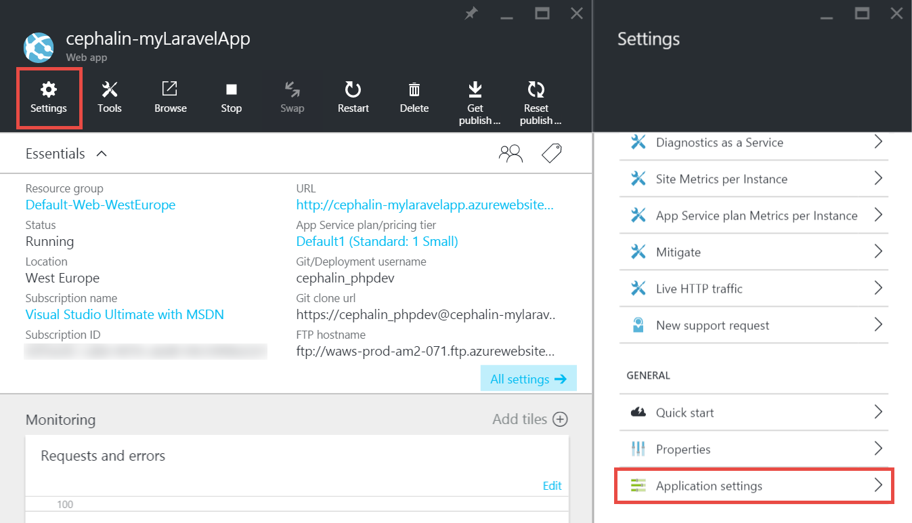
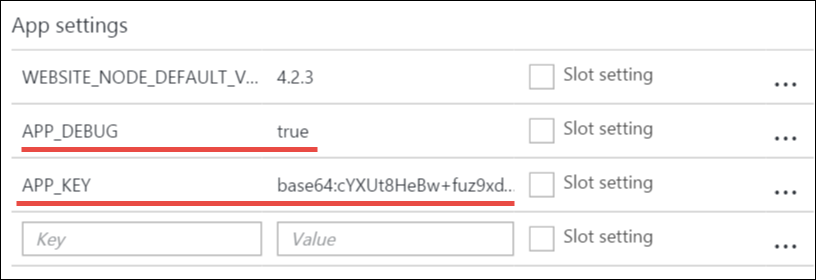

<properties
    pageTitle="Criar, configurar e implantar um aplicativo de web PHP para o Azure"
    description="Um tutorial que mostra como fazer um aplicativo da web PHP (Laravel) em execução em um serviço de aplicativo do Azure. Saiba como configurar o serviço de aplicativo do Azure para atender aos requisitos do framework PHP que você escolher."
    services="app-service\web"
    documentationCenter="php"
    authors="cephalin"
    manager="wpickett"
    editor=""
    tags="mysql"/>

<tags
    ms.service="app-service-web"
    ms.workload="web"
    ms.tgt_pltfrm="na"
    ms.devlang="PHP"
    ms.topic="article"
    ms.date="06/03/2016" 
    ms.author="cephalin"/>

# Criar, configurar e implantar um aplicativo de web PHP para o Azure

[AZURE.INCLUDE [tabs](../../includes/app-service-web-get-started-nav-tabs.md)]

Este tutorial mostra como criar, configurar e implantar um aplicativo de web PHP do Azure e como configurar o serviço de aplicativo do Azure para atender aos requisitos de seu aplicativo web do PHP. Ao final do tutorial, você terá um trabalho [Laravel](https://www.laravel.com/) web app em execução em um [Serviço de aplicativo do Azure](../app-service/app-service-value-prop-what-is.md).

Como um desenvolvedor PHP, você pode trazer seu favorita estrutura PHP no Azure. Este tutorial usa Laravel simplesmente como um exemplo de aplicativo concreto. Você aprenderá: 

- Implantar usando gito
- Versão do conjunto de PHP
- Usar um arquivo de início que não esteja no diretório raiz do aplicativo
- Variáveis de ambiente específicas do Access
- Atualizar seu aplicativo no Azure

Você pode aplicar o que aprendeu aqui para outros aplicativos web PHP que você implanta Azure.

>[AZURE.INCLUDE [app-service-linux](../../includes/app-service-linux.md)] 

## Pré-requisitos

- Instalar [PHP 5.6.x](http://php.net/downloads.php) (suporte PHP 7 é beta)
- Instalar o [compositor](https://getcomposer.org/download/)
- Instalar [CLI Azure](../xplat-cli-install.md)
- Instalar [gito](http://www.git-scm.com/downloads)
- Obter uma conta do Microsoft Azure. Se você não tiver uma conta, você pode [inscrever-se para uma avaliação gratuita](/pricing/free-trial/?WT.mc_id=A261C142F) ou [ativar seus benefícios de assinante do Visual Studio](/pricing/member-offers/msdn-benefits-details/?WT.mc_id=A261C142F).

>[AZURE.NOTE] Veja um aplicativo web em ação. [Serviço de aplicativo tente](http://go.microsoft.com/fwlink/?LinkId=523751) imediatamente e criar um aplicativo de curta duração starter — sem cartão de crédito necessários, sem compromissos.

## Criar um aplicativo PHP (Laravel) em sua máquina de desenvolvimento

1. Abra um novo prompt de comando do Windows, janela do PowerShell, shell do Linux ou terminal dos X. Execute os seguintes comandos para verificar se as ferramentas necessárias estão instaladas corretamente em sua máquina. 

        php --version
        composer --version
        azure --version
        git --version

    

    Se você ainda não instalou as ferramentas, consulte [pré-requisitos](#Prerequisites) para links de download.
    
2. Instalar Laravel da seguinte forma:

        composer global require "laravel/installer

3. `CD`em uma pasta de trabalho e criar um novo aplicativo de Laravel desta forma:

        cd <working_directory>
        laravel new <app_name>

4. `CD`no recém-criado `<app_name>` diretório e teste o aplicativo assim:

        cd <app_name>
        php artisan serve
        
    Você deve ser capaz de navegue até http://localhost:8000 em um navegador agora e ver a tela inicial do Laravel.
    
    
    
Portanto muito, apenas o fluxo de trabalho Laravel regular e você não está aqui para <a href="https://laravel.com/docs/5.2" rel="nofollow">aprender Laravel</a>. Vamos continuar.

## Criar um aplicativo web do Azure e configurar a implantação gito

>[AZURE.NOTE] "Espere! O que acontece se eu quiser implantar com FTP?" Não há um [tutorial FTP](web-sites-php-mysql-deploy-use-ftp.md) para as suas necessidades. 

Com a CLI do Azure, você pode criar um aplicativo web no serviço de aplicativo do Azure e configurá-la para implantação gito com uma única linha de comando. Vamos fazer isso.

1. Mude para o modo de ASM e efetuar login no Azure:

        azure config mode asm
        azure login
    
    Siga a mensagem de ajuda para continuar o processo de login.
    
    

4. Execute o comando para criar o aplicativo web Azure com gito implantação. Quando solicitado, especifique o número da região desejada.

        azure site create --git <app_name>
    
    
    
    >[AZURE.NOTE] Se você nunca configurar credenciais de implantação para sua assinatura do Azure, você será solicitado para criá-los. Essas credenciais, não suas credenciais de conta do Azure, são usadas pelo serviço de aplicativo somente para implantações de gito e logon FTP. 
    
    Esse comando cria um novo repositório gito no diretório atual (com `git init`) e o conecta ao repositório no Azure como um controle remoto gito (com `git remote add`).

<a name="configure"/>
## Configurar o aplicativo web do Azure

Para o aplicativo de Laravel trabalhar no Azure, você precisa prestar atenção a várias coisas. Você vai fazer neste exercício semelhante para sua estrutura PHP de escolha.

- Configurar PHP 5.5.9 ou superior. Consulte [Requisitos de servidor de 5.2 Laravel mais recentes](https://laravel.com/docs/5.2#server-requirements) para toda a lista de requisitos do servidor. O resto da lista são extensões que já estão habilitadas por instalações de PHP do Azure. 
- Defina as variáveis de ambiente seu aplicativo precisa. Laravel usa o `.env` arquivo para fácil configuração de variáveis de ambiente. No entanto, já que não deve a serem submetidas ao controle de origem (consulte [Configuração do ambiente de Laravel](https://laravel.com/docs/5.2/configuration#environment-configuration), você irá definir as configurações de aplicativo de seu aplicativo web Azure em vez disso.
- Certifique-se de que a entrada do aplicativo Laravel aponta, `public/index.php`, é carregado pela primeira vez. Consulte [Visão geral do ciclo de vida de Laravel](https://laravel.com/docs/5.2/lifecycle#lifecycle-overview). Em outras palavras, você precisa definir a URL de raiz do aplicativo da web para apontar para o `public` diretório.
- Habilite a extensão de compositor no Azure, desde que você tem uma composer.json. Dessa forma, você poderá deixar o compositor preocupar obtendo seus pacotes necessários quando você implanta com `git push`. É uma questão de praticidade. Se você não ativar automação compositor, basta remover `/vendor` do `.gitignore` arquivo para que inclua gito ("un-ignora") tudo na `vendor` diretório quando confirmando e implantar código.

Vamos configurar essas tarefas sequencialmente.

4. Defina a versão PHP que seu aplicativo Laravel requer.

        azure site set --php-version 5.6

    Terminar definindo a versão do PHP! 
    
4. Gerar um novo `APP_KEY` para seu Azure web app e defini-lo como uma configuração de aplicativo para o aplicativo web Azure.

        php artisan key:generate --show
        azure site appsetting add APP_KEY="<output_of_php_artisan_key:generate_--show>"

4. Além disso, ativar Laravel depuração para antecipado qualquer confusos `Whoops, looks like something went wrong.` página.

        azure site appsetting add APP_DEBUG=true

    Definir variáveis de ambiente pronto!
    
    >[AZURE.NOTE] Espere, vamos abrandar um pouco e explicam o que significa Laravel e o Azure que aqui. Laravel usa o `.env` arquivo no diretório raiz para fornecer variáveis de ambiente para o aplicativo, onde você encontrará a linha `APP_DEBUG=true` (e também `APP_KEY=...`). Essa variável for acessada em `config/app.php` pelo código     `'debug' => env('APP_DEBUG', false),`. [env()](https://laravel.com/docs/5.2/helpers#method-env) é um método auxiliar Laravel que usa o PHP [getenv()](http://php.net/manual/en/function.getenv.php) nos bastidores.
    >
    >No entanto, `.env` será ignorado pelo gito porque ele é chamado check-out `.gitignore` arquivo no diretório raiz. Resumindo, `.env`  
 no seu local gito repositório não enviado a Azure com o restante dos arquivos. Claro, você pode remover apenas esta linha do `.gitignore`, mas nós já estabeleceu que não é recomendável confirmar esse arquivo no controle de origem. No entanto, você ainda precisa de uma maneira de especificar essas variáveis de ambiente no Azure. 
    >
    >A boa notícia é que as configurações de aplicativo no serviço de aplicativo do Azure suporta [getenv()](http://php.net/manual/en/function.getenv.php)  
 no PHP. Embora você pode usar FTP ou outros meios para carregar manualmente uma `.env` arquivo no Azure, você pode especificar apenas as variáveis que você deseja como configurações de aplicativo do Azure sem uma `.env` no Azure, como você acabou de fazer. Além disso, se for uma variável em ambas uma `.env` de arquivo e em configurações de aplicativo do Azure, a configuração do aplicativo do Azure wins.     

4. As tarefas de dois últimos (definindo o diretório virtual e habilitando compositor) requer o [portal do Azure](https://portal.azure.com), portanto logon no [portal](https://portal.azure.com) com sua conta do Azure.

4. Começando no menu à esquerda, clique em **Serviços de aplicativo** > **&lt;app_name >** > **Ferramentas**.

    
    
    >[AZURE.TIP] Se você clicar em **configurações** , em vez de **Ferramentas**, você poderá acessar as **Configurações do aplicativo**  
 blade, que permite que você defina versões PHP, configurações de aplicativo, e diretórios virtuais como você acabou de fazer. 
    
4. Clique em **extensões** > **Adicionar** para adicionar uma extensão.

4. Selecione **compositor** na **extensão de escolher** [blade](../azure-portal-overview.md) (*blade*: uma página do portal que abre horizontalmente).

4. Clique em **OK** na lâmina **termos legais aceitar** . 

5. Clique em **Okey** na lâmina **Adicionar extensão** .

    Quando é feito Azure adicionando a extensão, você verá uma mensagem amigável pop-up no canto, bem como  **compositor** listados na lâmina **extensões** .

    

    Compositor habilitação pronto!
    
4. Volta blade do web app, clique em **configurações** > **Configurações do aplicativo**.

    

    Na lâmina **Configurações do aplicativo** , observe a versão PHP que você definiu anteriormente:

    

    e as configurações de aplicativo que você adicionou:
    
    

4. Role até o final da lâmina e altere o diretório raiz virtual para apontar para **site\wwwroot\public** em vez de **site\wwwroot**.

    

4. Clique em **Salvar** na parte superior da lâmina.

    Terminar de configurar o diretório virtual! 

## Implantar o seu aplicativo web com gito (e definir variáveis de ambiente)

Você está pronto para implantar seu código agora. Você vai fazer volta no prompt de comando ou terminal.

4. Confirmar todas as suas alterações e implantar o código do seu aplicativo web Azure como faria com qualquer repositório gito:

        git add .
        git commit -m "Hurray! My first commit for my Azure app!"
        git push azure master 

    Durante a execução de `git push`, você será solicitado a fornecer sua senha de implantação gito. Se solicitado criar credenciais de implantação em `azure site create` anteriormente, digite a senha que você usou.
    
5. Vamos ver-executados no navegador, executando este comando:

        azure site browse

    Seu navegador deve mostrar a tela inicial do Laravel.
    
    
    
    Parabéns, você está executando um aplicativo da web de Laravel no Azure.
             
## Solucionar erros comuns

Aqui estão alguns os erros que pode ocorrer quando seguindo este tutorial:

- [CLI Azure mostra "'site' não é um comando azure"](#clierror)
- [O aplicativo Web mostra erro HTTP 403](#http403)
- [O aplicativo Web mostra "Whoops, parece que algo está errado".](#whoops)
- [O aplicativo Web não mostra "Nenhum Criptografador compatível encontrado."](#encryptor)

### CLI Azure mostra "'site' não é um comando azure"

Durante a execução de `azure site *` no terminal de linha de comando, você pode ver o erro`error:   'site' is not an azure command. See 'azure help'.` 

Isso geralmente é um resultado de alternar para modo de "BRAÇO" (Azure Resource Manager). Para resolver isso, alterne novamente para o modo de "ASM" (gerenciamento de serviço do Azure) executando `azure config mode asm`.

### O aplicativo Web mostra erro HTTP 403

Você implantou o aplicativo web para o Azure com êxito, mas quando você navegar para o seu aplicativo web Azure, você obterá uma `HTTP 403` ou`You do not have permission to view this directory or page.`

Isso é provavelmente porque o web app não consegue encontrar o ponto de entrada para o aplicativo Laravel. Certifique-se de que você alterou o diretório raiz virtual para apontar para `site\wwwroot\public`, onde do Laravel `index.php` é (consulte [Configurar o Azure web app](#configure)).

### O aplicativo Web mostra "Whoops, parece que algo está errado".

Você implantou o aplicativo web para o Azure com êxito, mas quando você navegar para o seu aplicativo web Azure, você receber a mensagem clara para você`Whoops, looks like something went wrong.`

Para obter um erro mais descritivo, habilitar a depuração de Laravel definindo `APP_DEBUG` variável de ambiente `true` (consulte [Configurar o Azure web app](#configure)).

### O aplicativo Web não mostra "Nenhum Criptografador compatível encontrado."

Você implantou o aplicativo web para o Azure com êxito, mas quando você navegar para o seu aplicativo web Azure, você recebe a mensagem de erro abaixo:

    
Esse é um erro desagradável, mas pelo menos não é clara para você desde que você ativou Laravel depuração. Uma pesquisa superficial da cadeia de caracteres de erro nos fóruns Laravel mostrará que é devido a não definir o APP_KEY em `.env`, ou no seu caso, não ter `.env` no Azure todos. Você pode corrigir isso adicionando configuração `APP_KEY` como um aplicativo do Azure definir (consulte [Configurar o Azure web app](#configure)).
    
## Próximas etapas

Saiba como adicionar dados ao seu aplicativo, [Criando um banco de dados MySQL no Azure](../store-php-create-mysql-database.md). Além disso, confira links mais úteis para PHP no Azure abaixo:

- [Central de desenvolvedores do PHP](/develop/php/).
- [Criar um aplicativo web do Azure Marketplace](app-service-web-create-web-app-from-marketplace.md)
- [Configurar PHP no Azure serviço de aplicativo Web Apps](web-sites-php-configure.md)
- [Converter WordPress multissite no serviço de aplicativo do Azure](web-sites-php-convert-wordpress-multisite.md)
- [WordPress corporativo no serviço de aplicativo do Azure](web-sites-php-enterprise-wordpress.md)
