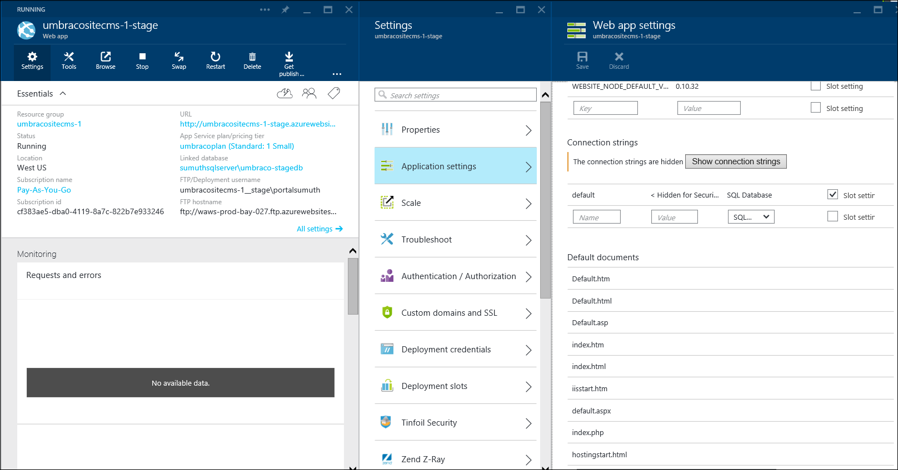

<properties
  pageTitle="Usar ambientes de DevOps efetivamente para o aplicativo web"
  description="Saiba como usar slots de implantação para configurar e gerenciar vários ambientes de desenvolvimento do aplicativo"
  services="app-service\web"
  documentationCenter=""
  authors="sunbuild"
  manager="yochayk"
  editor=""/>

<tags
  ms.service="app-service"
  ms.devlang="na"
  ms.topic="article"
  ms.tgt_pltfrm="na"
  ms.workload="web"
  ms.date="10/24/2016"
  ms.author="sumuth"/>

# <a name="use-devops-environments-effectively-for-your-web-apps"></a>Usar ambientes DevOps efetivamente para seus aplicativos web

Este artigo mostra a configurar e gerenciar implantações de aplicativos web para várias versões do seu aplicativo como o desenvolvimento, teste, produção e perguntas e respostas. Cada versão do seu aplicativo pode ser considerado como ambiente de desenvolvimento para necessidade específica de dentro de seu processo de implantação. Por exemplo o ambiente de p & r pode ser usada pela sua equipe de desenvolvedores para testar a qualidade do aplicativo antes de aplicar as alterações à produção.
Configurar vários ambientes de desenvolvimento pode ser uma tarefa desafiador precisar controlar, gerenciar os recursos (computação, aplicativo web, banco de dados, cache etc.) e implantar código em ambientes.

## <a name="setting-up-a-non-production-environment-stagedevqa"></a>Configurando um ambiente de produção não (estágio, desenvolvimento, controle de qualidade)
Quando você tiver um aplicativo web de produção em funcionamento, a próxima etapa é criar um ambiente de não produção. Para poder usar slots de implantação Verifique se que você estiver executando no modo de plano de serviço de aplicativo **Premium** ou **padrão** . Implantação slots são aplicativos web realmente ao vivo com seus próprios nomes de host. Elementos de conteúdo e configuração do aplicativo da Web podem ser trocados entre dois slots de implantação, incluindo o slot de produção. Implantando seu aplicativo para um slot de implantação tem os seguintes benefícios:

1. Você pode validar alterações de aplicativo da web em um slot de implantação preparação antes trocando-o com o slot de produção.
2. Implantando um aplicativo web um slot primeiro e substituindo-os em produção garantem que todas as instâncias do slot são aquecidas antes de ser trocado em produção. Isso elimina o tempo de inatividade quando você implanta seu aplicativo web. O redirecionamento de tráfego é perfeito e sem solicitações são descartadas devido a operações de troca. Este fluxo de trabalho inteiro pode ser automatizado, configurando a [Troca automática](web-sites-staged-publishing.md#configure-auto-swap-for-your-web-app) quando a validação de pré-troca de não é necessária.
3. Após uma troca, o slot com anteriormente em estágios web app agora tem o aplicativo de web de produção anterior. Se as alterações trocadas no slot produção não conforme o esperado, você pode executar a troca mesma imediatamente para obter seu "última conhecidos boa web app" novamente.

Para configurar um slot preparação de implantação, consulte [configurar ambientes web Apps em um serviço de aplicativo do Azure temporários](web-sites-staged-publishing.md). Cada ambiente deve incluir seu próprio conjunto de recursos, por exemplo se você web app usa um banco de dados e em seguida, produção e preparação aplicativo web devem usar bancos de dados diferentes. Adicione recursos preparação do ambiente de desenvolvimento como banco de dados, o armazenamento ou o cache de configuração de seu ambiente de desenvolvimento de preparação.

## <a name="examples-of-using-multiple-development-environments"></a>Exemplos do uso de vários ambientes de desenvolvimento

Qualquer projeto deve seguir um gerenciamento de código fonte com pelo menos dois ambientes, um ambiente de desenvolvimento e produção, mas quando usando sistemas de gerenciamento de conteúdo, estruturas de aplicativo etc podemos poderá se deparar com problemas onde o aplicativo não suportam este cenário prontos para uso. Isso é verdadeiro para alguns das estruturas populares discutidas abaixo. Muitas perguntas que podem ser usadas ao trabalhar com um CMS/estruturas como

1. Como dividi-lo a reduzir em diferentes ambientes
2. Que arquivos posso alterar e vai afetar as atualizações de versão do framework
3. Como gerenciar configuração por ambiente
4. Como gerenciar as atualizações de versão módulos/plug-ins, as atualizações de versão do framework core

Há várias maneiras de configurar um ambiente de vários para seu projeto e os exemplos abaixo um apenas um método os respectivos aplicativos.

### <a name="wordpress"></a>WordPress
Nesta seção, você aprenderá como configurar um fluxo de trabalho de implantação usando slots para WordPress. WordPress como a maioria das soluções CMS não oferece suporte para trabalhar com vários ambientes de desenvolvimento prontos para uso. Serviço de aplicativo Web Apps tem alguns recursos que tornam mais fácil armazenar definições de configuração fora do seu código.

Antes de criar um slot temporário, configure o código do seu aplicativo para dar suporte a vários ambientes. Para dar suporte a vários ambientes no WordPress precisar editar `wp-config.php` em seu aplicativo web do local de desenvolvimento, adicione o seguinte código no início do arquivo. Isso permitirá que seu aplicativo escolher a configuração correta com base no ambiente selecionado.

```
// Support multiple environments
// set the config file based on current environment
if (strpos($_SERVER['HTTP_HOST'],'localhost') !== false) {
// local development
 $config_file = 'config/wp-config.local.php';
}
elseif ((strpos(getenv('WP_ENV'),'stage') !== false) || (strpos(getenv('WP_ENV'),'prod' )!== false ))
//single file for all azure development environments
 $config_file = 'config/wp-config.azure.php';
}
$path = dirname(__FILE__). '/';
if (file_exists($path. $config_file)) {
// include the config file if it exists, otherwise WP is going to fail
require_once $path. $config_file;
```

Criar uma pasta na raiz do aplicativo web chamada `config` e adicionar um arquivo dois arquivos: `wp-config.azure.php` e `wp-config.local.php` representando seu ambiente local e azure respectivamente.

Copie o seguinte no `wp-config.local.php` :

```
<?php
// MySQL settings
/** The name of the database for WordPress */

define('DB_NAME', 'yourdatabasename');

/** MySQL database username */
define('DB_USER', 'yourdbuser');

/** MySQL database password */
define('DB_PASSWORD', 'yourpassword');

/** MySQL hostname */
define('DB_HOST', 'localhost');
/**
 * For developers: WordPress debugging mode.
 * * Change this to true to enable the display of notices during development.
 * It is strongly recommended that plugin and theme developers use WP_DEBUG
 * in their development environments.
 */
define('WP_DEBUG', true);

//Security key settings
define('AUTH_KEY', 'put your unique phrase here');
define('SECURE_AUTH_KEY','put your unique phrase here');
define('LOGGED_IN_KEY','put your unique phrase here');
define('NONCE_KEY', 'put your unique phrase here');
define('AUTH_SALT', 'put your unique phrase here');
define('SECURE_AUTH_SALT', 'put your unique phrase here');
define('LOGGED_IN_SALT', 'put your unique phrase here');
define('NONCE_SALT', 'put your unique phrase here');

/**
 * WordPress Database Table prefix.
 *
 * You can have multiple installations in one database if you give each a unique
 * prefix. Only numbers, letters, and underscores please!
 */
$table_prefix = 'wp_';
```

Definindo as chaves de segurança acima pode ajudar a impedir que o seu aplicativo web sendo hackers, portanto, use valores exclusivos. Se você precisar gerar a cadeia de caracteres de chaves de segurança mencionados acima, você pode ir para o gerador automático para criar novos chaves/valores usando este [link] (https://api.wordpress.org/secret-key/1.1/salt)

Copie o seguinte código no `wp-config.azure.php`:


``` <?php
    // MySQL settings
    /** The name of the database for WordPress */
    
    define('DB_NAME', getenv('DB_NAME'));
    
    /** MySQL database username */
    define('DB_USER', getenv('DB_USER'));
    
    /** MySQL database password */
    define('DB_PASSWORD', getenv('DB_PASSWORD'));
    
    /** MySQL hostname */
    define('DB_HOST', getenv('DB_HOST'));
    
    /**
    * For developers: WordPress debugging mode.
    *
    * Change this to true to enable the display of notices during development.
    * It is strongly recommended that plugin and theme developers use WP_DEBUG
    * in their development environments.
    * Turn on debug logging to investigate issues without displaying to end user. For WP_DEBUG_LOG to
    * do anything, WP_DEBUG must be enabled (true). WP_DEBUG_DISPLAY should be used in conjunction
    * with WP_DEBUG_LOG so that errors are not displayed on the page */
    
    */
    define('WP_DEBUG', getenv('WP_DEBUG'));
    define('WP_DEBUG_LOG', getenv('TURN_ON_DEBUG_LOG'));
    define('WP_DEBUG_DISPLAY',false);
    
    //Security key settings
    /** If you need to generate the string for security keys mentioned above, you can go the automatic generator to create new keys/values: https://api.wordpress.org/secret-key/1.1/salt **/
    define('AUTH_KEY',getenv('DB_AUTH_KEY'));
    define('SECURE_AUTH_KEY', getenv('DB_SECURE_AUTH_KEY'));
    define('LOGGED_IN_KEY', getenv('DB_LOGGED_IN_KEY'));
    define('NONCE_KEY', getenv('DB_NONCE_KEY'));
    define('AUTH_SALT', getenv('DB_AUTH_SALT'));
    define('SECURE_AUTH_SALT', getenv('DB_SECURE_AUTH_SALT'));
    define('LOGGED_IN_SALT',  getenv('DB_LOGGED_IN_SALT'));
    define('NONCE_SALT',  getenv('DB_NONCE_SALT'));
    
    /**
    * WordPress Database Table prefix.
    *
    * You can have multiple installations in one database if you give each a unique
    * prefix. Only numbers, letters, and underscores please!
    */
    $table_prefix = getenv('DB_PREFIX');
```

#### <a name="use-relative-paths"></a>Use caminhos relativos
Uma última coisa é configurar o aplicativo de WordPress para usar caminhos relativos. WordPress armazena informações de URL do banco de dados. Isso tornará movendo conteúdo de um ambiente para outro mais difícil conforme você precisa atualizar o banco de dados sempre que você move de local para Palco ou estágio ambientes de produção. Para reduzir o risco de problemas que podem ser causados com Implantando um banco de dados sempre que você implanta de um ambiente para outro use o [plug-in raiz relativa links](https://wordpress.org/plugins/root-relative-urls/) que pode ser instalado usando o painel de administrador WordPress ou baixá-lo manualmente do [aqui](https://downloads.wordpress.org/plugin/root-relative-urls.zip).


Adicione as seguintes entradas para sua `wp-config.php` arquivo antes do `That's all, stop editing!` comentário:

```

  define('WP_HOME', 'http://'. filter_input(INPUT_SERVER, 'HTTP_HOST', FILTER_SANITIZE_STRING));
    define('WP_SITEURL', 'http://'. filter_input(INPUT_SERVER, 'HTTP_HOST', FILTER_SANITIZE_STRING));
    define('WP_CONTENT_URL', '/wp-content');
    define('DOMAIN_CURRENT_SITE', filter_input(INPUT_SERVER, 'HTTP_HOST', FILTER_SANITIZE_STRING));
```

Ativar o plug-in através do `Plugins` menu no painel de administrador WordPress. Salve suas configurações de link permanente do aplicativo WordPress.

#### <a name="the-final-wp-configphp-file"></a>O final `wp-config.php` arquivo
Todas as atualizações WordPress Core não afetará sua `wp-config.php`, `wp-config.azure.php` e `wp-config.local.php` arquivos. No final das contas este como `wp-config.php` arquivo ficará assim

```
<?php
/**
 * The base configurations of the WordPress.
 *
 * This file has the following configurations: MySQL settings, Table Prefix,
 * Secret Keys, and ABSPATH. You can find more information by visiting
 *
 * Codex page. You can get the MySQL settings from your web host.
 *
 * This file is used by the wp-config.php creation script during the
 * installation. You don't have to use the web web app, you can just copy this file
 * to "wp-config.php" and fill in the values.
 *
 * @package WordPress
 */

// Support multiple environments
// set the config file based on current environment
if (strpos($_SERVER['HTTP_HOST'],'localhost') !== false) { // local development
  $config_file = 'config/wp-config.local.php';
}
elseif ((strpos(getenv('WP_ENV'),'stage') !== false) ||(strpos(getenv('WP_ENV'),'prod' )!== false )){
  $config_file = 'config/wp-config.azure.php';
}


$path = dirname(__FILE__). '/';
if (file_exists($path. $config_file)) {
  // include the config file if it exists, otherwise WP is going to fail
  require_once $path. $config_file;
}

/** Database Charset to use in creating database tables. */
define('DB_CHARSET', 'utf8');

/** The Database Collate type. Don't change this if in doubt. */
define('DB_COLLATE', '');


/* That's all, stop editing! Happy blogging. */

define('WP_HOME', 'http://'. $_SERVER['HTTP_HOST']);
define('WP_SITEURL', 'http://'. $_SERVER['HTTP_HOST']);
define('WP_CONTENT_URL', '/wp-content');
define('DOMAIN_CURRENT_SITE', $_SERVER['HTTP_HOST']);

/** Absolute path to the WordPress directory. */
if ( !defined('ABSPATH') )
    define('ABSPATH', dirname(__FILE__). '/');

/** Sets up WordPress vars and included files. */
require_once(ABSPATH. 'wp-settings.php');
```

#### <a name="set-up-a-staging-environment"></a>Configurar um ambiente de teste
Supondo que você já tiver um aplicativo web do WordPress em execução no Azure Web, login no [portal de visualização de gerenciamento do Azure](http://portal.azure.com) e vá para o aplicativo web do WordPress. Aplicativos se não você pode criar uma do Marketplace. Para saber mais, [clique aqui](web-sites-php-web-site-gallery.md).
Clique em Configurações -> implantação slots -> Adicionar para criar um slot de implantação com o estágio de nome. Um slot de implantação é outro aplicativo web compartilhar os mesmos recursos que o aplicativo principal da web criado acima.


Adicionar outro banco de dados MySQL, digamos `wordpress-stage-db` ao seu grupo de recursos `wordpressapp-group`.

 

Atualizar as cadeias de caracteres de Conexão para seu slot de implantação de estágio apontar para o banco de dados recém-criado, `wordpress-stage-db`. Observe que a produção web app, `wordpressprodapp` e preparação web app `wordpressprodapp-stage` deve apontar para bancos de dados diferentes.

#### <a name="configure-environment-specific-app-settings"></a>Definir configurações de aplicativo específicos do ambiente
Os desenvolvedores podem armazenar pares de chave-valor de cadeia de caracteres no Azure como parte das informações de configuração associadas a um aplicativo web chamado de configurações do aplicativo. Durante a execução, o aplicativo de serviço Web Apps automaticamente recupera esses valores para você e os disponibiliza código em execução no seu aplicativo web. De um título perspectiva que é um ótimo lado usufruir dos benefícios desde informações confidenciais, como cadeias de caracteres de conexão de banco de dados com senhas nunca aparecem como texto não criptografado em um arquivo como `wp-config.php`.

Esse processo definido abaixo é útil quando você executar enquanto ele inclui alterações de arquivo e alterações de banco de dados de aplicativo de WordPress:
- Atualização da versão WordPress
- Adicionar novo, editar ou atualizar plug-ins
- Adicionar novo, editar ou atualizar temas

Defina configurações de aplicativo para:

- informações de banco de dados
- Ativar/desativar o log de WordPress
- Configurações de segurança do WordPress


Verifique se que você adicionou as seguintes configurações de aplicativo para seu slot de produção web app e estágio. Observe que o aplicativo da web de produção e teste web app usam bancos de dados diferentes.
Desmarque a caixa de seleção de **Configuração de Slot** para todos os parâmetros de configurações, exceto WP_ENV. Isto irá Troque a configuração de seu aplicativo web, juntamente com o conteúdo do arquivo e o banco de dados. Se **Slot configuração** está **marcada**, configurações do aplicativo do aplicativo da web e configuração de cadeia de conexão não moverá em ambientes ao fazer uma operação de troca e, portanto, se houver quaisquer alterações de banco de dados isso não interromperá o aplicativo da web de produção.

Implante o ambiente de desenvolvimento local web app ao estágio web app e banco de dados usando o WebMatrix ou ferramentas de sua preferência como FTP, gito ou PhpMyAdmin.


Navegue e testar seu aplicativo web do teste. Considerando um cenário onde o tema do aplicativo web é a ser atualizada, veja aqui o teste web app.


 Se tudo correto, clique no botão **trocar** no seu aplicativo web preparação para mover seu conteúdo para o ambiente de produção. Nesse caso você troque o web app e o banco de dados em ambientes durante cada operação de **troca** .


 > [AZURE.NOTE]
 >Se você tiver um cenário em que você precisa apenas arquivos de envio (sem atualizações de banco de dados), em seguida, **Verifique** a **Configuração de Slot** para o banco de dados relacionados *configurações do aplicativo* e *configurações de cadeias de caracteres de conexão* no blade de configuração de aplicativo da web dentro do portal de visualização Azure antes de fazer a troca. Nesse caso DB_NAME, DB_HOST, DB_PASSWORD, DB_USER, configuração de cadeia de conexão padrão deve não aparecem em Visualizar alterações quando fazendo um **trocar**. AT dessa vez, quando você concluir a operação de **trocar** o WordPress web app terá as atualizações arquivos **somente**.

Antes de fazer uma troca, aqui está o produção WordPress web app 

Após a operação de troca, o tema foi atualizado em seu aplicativo da web de produção.


Em uma situação quando você precisar **Reverter**, você pode acesse as configurações de aplicativo de web de produção e clique no botão **trocar** para trocar o web app e o banco de dados de produção para teste slot. Uma observação importante a lembrar é que se alterações de banco de dados forem incluídas com uma operação de **trocar** a qualquer momento, em seguida, na próxima vez que você implanta novamente para o seu aplicativo web preparação que necessários para implantar o banco de dados é alterado para banco de dados atual para o aplicativo web teste que poderia ser o banco de dados de produção anterior ou o estágio.

#### <a name="summary"></a>Resumo
Generalizar o processo para qualquer aplicativo com um banco de dados

1. Instalar o aplicativo em seu ambiente local
2. Incluir configuração específica do ambiente (local e Azure Web App)
3. Configurar seus ambientes no aplicativo de serviço Web Apps – teste, produção
4. Se você tiver um aplicativo de produção já em execução no Azure, sincronize seu conteúdo de produção (arquivos/código + banco de dados) para o ambiente local e preparação.
5. Desenvolver seu aplicativo em seu ambiente local
6. Coloque o seu aplicativo da web de produção em banco de dados de sincronização ou modo bloqueado e manutenção conteúdo de produção ambientes de teste e desenvolvimento
7. Implantar em ambiente de teste e teste
8. Implantar o ambiente de produção
9. Repita as etapas 4 a 6

### <a name="umbraco"></a>Umbraco
Nesta seção, você aprenderá como o Umbraco CMS usa um módulo personalizado para implantar de em vários ambiente DevOps. Este exemplo fornece uma abordagem diferente para gerenciar vários ambientes de desenvolvimento.

[Umbraco CMS](http://umbraco.com/) é uma das popular.NET CMS soluções usadas por muitos desenvolvedores que fornece o módulo [Courier2](http://umbraco.com/products/more-add-ons/courier-2) para implantar de desenvolvimento para preparação ambientes de produção. Você pode criar facilmente um ambiente de desenvolvimento local para um aplicativo web do Umbraco CMS usando o Visual Studio ou WebMatrix.

1. Crie um aplicativo de web Umbraco com o Visual Studio, [clique aqui](https://our.umbraco.org/documentation/Installation/install-umbraco-with-nuget).
2. Para criar um aplicativo da web de Umbraco com WebMatrix, [clique aqui](http://umbraco.com/help-and-support/video-tutorials/getting-started/working-with-webmatrix).

Lembre-se sempre remover o `install` pasta em seu aplicativo e nunca carregue-o no Palco ou produção aplicativos web. Para este tutorial, que esteja usando o WebMatrix

#### <a name="set-up-a-staging-environment"></a>Configurar um ambiente de teste
- Crie um slot de implantação conforme mencionado acima para Umbraco CMS web app, supondo que você já tenha um Umbraco CMS web app para cima e em execução. Se não você pode criar uma do Marketplace.

- Atualize a cadeia de Conexão para seu slot de implantação de estágio apontar para o banco de dados recém-criado, **umbraco-estágio-db**. Seu aplicativo web de produção (umbraositecms-1) e o teste web app (umbracositecms-1-etapa) **deve** apontam para bancos de dados diferentes.



- Clique em **configurações de obter publicação** para implantação slot **estágio**. Isso irá baixar um arquivo de configurações de publicação que armazenam todas as informações necessárias por Visual Studio ou Web Matrix para publicar seu aplicativo do local de desenvolvimento web app Azure web app.

 

- Abra seu aplicativo web do local de desenvolvimento no **WebMatrix** ou **Visual Studio**. Neste tutorial estou usando Web Matrix e primeiro você precisa importar o arquivo de configurações de publicação para o aplicativo web teste


- Revisar as alterações na caixa de diálogo e implantar o seu aplicativo web local em seu aplicativo web Azure, *umbracositecms-1-estágio*. Quando você implanta arquivos diretamente para o aplicativo web do teste você irá omitir quaisquer arquivos no `~/app_data/TEMP/` pasta conforme estes serão regeneradas quando o estágio web app pela primeiro iniciado. Você também deve omitir o `~/app_data/umbraco.config` arquivo como isso, também, será regenerado.


- Após a publicação com êxito o Umbraco local web app para preparar o aplicativo da web, navegue até seu aplicativo web do teste e executar alguns testes para descartar qualquer problema.

#### <a name="set-up-courier2-deployment-module"></a>Configurar o módulo de implantação de Courier2
Com o módulo [Courier2](http://umbraco.com/products/more-add-ons/courier-2) , você pode enviar conteúdo, folhas de estilo, módulos de desenvolvimento e muito mais com um simples clique com botão direito em um teste web app produção web App para uma mais implantações de gratuito de complicações e reduzir o risco de quebrar o aplicativo da web de produção ao implantar uma atualização.
Adquirir uma licença para Courier2 para o domínio `*.azurewebsites.net` e seu domínio personalizado (digamos http://abc.com) depois de você adquiriu a licença, colocar a licença baixada (. Arquivo de licença para /) na `bin` pasta.


Baixe o pacote de Courier2 [aqui](https://our.umbraco.org/projects/umbraco-pro/umbraco-courier-2/). Faça logon no seu aplicativo web do estágio, diga http://umbracocms-site-stage.azurewebsites.net/umbraco e clique no Menu de **desenvolvedor** e selecione **pacotes**. Clique em **instalar** pacote local


Carregue o pacote de courier2 usando o instalador.


Para configurar o que você precisa atualizar o arquivo courier.config sob a pasta **Config** de seu aplicativo web.

```xml
<!-- Repository connection settings -->
 <!-- For each site, a custom repository must be configured, so Courier knows how to connect and authenticate-->
 <repositories>
    <!-- If a custom Umbraco Membership provider is used, specify login & password + set the passwordEncoding to clear: -->
    <repository name="production web app" alias="stage" type="CourierWebserviceRepositoryProvider" visible="true">
      <url>http://umbracositecms-1.azurewebsites.net</url>
      <user>0</user>
      <!--<login>user@email.com</login> -->
      <!-- <password>user_password</password>-->
      <!-- <passwordEncoding>Clear</passwordEncoding>-->
      </repository>
 </repositories>
 ```

Em `<repositories>`, insira as informações de usuário e a URL de site produção. Se você estiver usando o provedor de associação de Umbraco padrão, adicione a ID do usuário de administração no <user> seção. Se você estiver usando um provedor de associação Umbraco personalizado, use `<login>`,`<password>` Courier2 módulo saber como conectar-se para o site de produção. Para obter mais detalhes, examine a [documentação](http://umbraco.com/help-and-support/customer-area/courier-2-support-and-download/developer-documentation) do módulo Courier.

Da mesma forma, instale o módulo de Courier em seu site de produção e configure-ponto estágio web App em seu arquivo de courier.config respectivos conforme mostrado aqui

```xml
 <!-- Repository connection settings -->
 <!-- For each site, a custom repository must be configured, so Courier knows how to connect and authenticate-->
 <repositories>
    <!-- If a custom Umbraco Membership provider is used, specify login & password + set the passwordEncoding to clear: -->
    <repository name="Stage web app" alias="stage" type="CourierWebserviceRepositoryProvider" visible="true">
      <url>http://umbracositecms-1-stage.azurewebsites.net</url>
      <user>0</user>
      </repository>
 </repositories>
```

Clique na guia Courier2 no painel de controle do Umbraco CMS web app e selecione locais. Você deve ver o nome do repositório conforme mencionado no `courier.config`. Faça isso em sua produção e teste aplicativos web.


Agora vamos implantar algum conteúdo de site de preparação para o site de produção. Acesse o conteúdo e selecionar uma página existente ou criar uma nova página. Vou selecionar uma página existente do meu aplicativo web onde o título da página é alterado de **Introdução – novo** e agora, clique em **Salvar e publicar**.


Agora, selecione a página modificada e o *botão direito do mouse* para exibir todas as opções. Clique em **Courier** para exibir a caixa de diálogo de implantação. Clique em **implantar** para iniciar a implantação


Revisar as alterações e clique em continuar.


Log de implantação mostra se a implantação foi bem-sucedido.

 

Procure o aplicativo da web de produção para ver se as alterações serão refletidas.

 

Para saber mais sobre como usar Courier, revise a documentação.

#### <a name="how-to-upgrade-umbraco-cms-version"></a>Como atualizar versão Umbraco CMS

Courier não ajudará a implantar com a atualização de uma versão do Umbraco CMS para outro. Ao atualizar versão Umbraco CMS, você deverá verificar incompatibilidades com seus módulos personalizados ou módulos de terceiros e as bibliotecas Umbraco Core. Como uma prática recomendada

1. SEMPRE fazer backup de seu aplicativo web e o banco de dados antes de realizar uma atualização. Em Azure Web App, você pode configurar backups automáticos para o recurso de seus sites usando o backup e restaurar seu site se necessário usando a restauração do recurso. Para obter mais detalhes, consulte [como fazer backup de seu aplicativo web](web-sites-backup.md) e [como restaurar seu aplicativo web](web-sites-restore.md).

2. Verifique se os pacotes de terceiros que você está usando serão compatíveis com a versão que você está atualizando. Página de download do pacote, examine a compatibilidade de projeto com versão Umbraco CMS.

Para obter mais detalhes sobre como atualizar seu aplicativo web localmente, siga as diretrizes como mencionados [aqui](https://our.umbraco.org/documentation/getting-started/set up/upgrading/general).

Depois que seu site de desenvolvimento local é atualizado, publique as alterações ao aplicativo web de teste. Testar seu aplicativo e se tudo correto, use o botão **trocar** para **trocar** seu site de preparação para produção web app. Ao executar a operação de **troca** , você pode exibir as alterações que serão afetadas na configuração da seu aplicativo web. Com essa operação **trocar** , podemos estão trocando os aplicativos de web e bancos de dados. Isso significa que, após a troca o aplicativo da web de produção passará a apontar para o banco de dados de umbraco-estágio-db e preparação web app irá apontar para o banco de dados de umbraco-produção-db.


A vantagem de trocar o web app e o banco de dados:
1. Fornece a capacidade de reverter para a versão anterior do seu aplicativo web com outro **trocar** se há problemas de aplicativo.
2. Para uma atualização, você precisa implantar arquivos e banco de dados de teste web app para produção web app e o banco de dados. Há muitas coisas que podem dar erradas ao implantar o banco de dados e arquivos. Usando o recurso de **troca** de slots, podemos reduzir o tempo de inatividade durante uma atualização e reduzir o risco de falhas que podem ocorrer ao implantar as alterações.
3. Oferece a capacidade de fazer **A / B testes** usando o recurso de [teste em produção](https://azure.microsoft.com/documentation/videos/introduction-to-azure-websites-testing-in-production-with-galin-iliev/)

Este exemplo mostra a flexibilidade da plataforma onde você pode criar módulos personalizados semelhantes ao módulo Umbraco Courier para gerenciar a implantação em ambientes.

## <a name="references"></a>Referências
[Desenvolvimento de software ágil com o serviço de aplicativo do Azure](app-service-agile-software-development.md)

[Configurar ambientes web Apps em um serviço de aplicativo do Azure temporários](web-sites-staged-publishing.md)

[Como bloquear o acesso a slots de implantação de não produção na web](http://ruslany.net/2014/04/azure-web-sites-block-web-access-to-non-production-deployment-slots/)
