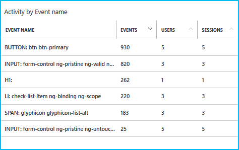

<properties
    pageTitle="Implantação flighting (teste beta) em um serviço de aplicativo do Azure"
    description="Saiba como flight novos recursos em seu aplicativo ou beta teste suas atualizações neste tutorial de ponta a ponta. Ele reúne recursos de serviço de aplicativo como publicação contínua, slots, roteamento de tráfego e integração de obtenção de informações do aplicativo."
    services="app-service\web"
    documentationCenter=""
    authors="cephalin"
    manager="wpickett"
    editor=""/>

<tags
    ms.service="app-service-web"
    ms.workload="web"
    ms.tgt_pltfrm="na"
    ms.devlang="na"
    ms.topic="article"
    ms.date="02/02/2016"
    ms.author="cephalin"/>
# Implantação flighting (teste beta) em um serviço de aplicativo do Azure

Este tutorial mostra como fazer *implantações flighting* por meio da integração os diversos recursos do [Serviço de aplicativo do Azure](http://go.microsoft.com/fwlink/?LinkId=529714) e [Ideias de aplicativo do Azure](/services/application-insights/). 

*Flighting* é um processo de implantação que valida um novo recurso ou alterar com um número limitado de clientes reais, e é o principal teste cenário de produção. Ele equivale testes beta e às vezes é conhecido como "teste controlado voos". Muitas grandes empresas com uma presença na web usam essa abordagem para obter validação antecipada suas atualizações de aplicativo no seu prática de [desenvolvimento ágil](https://en.wikipedia.org/wiki/Agile_software_development). Serviço de aplicativo do Azure permite integrar teste na produção contínua publicação e obtenção de informações de aplicativo para implementar o mesmo cenário DevOps. Os benefícios dessa abordagem incluem:

- **Ganho atualizações de _antes_ de feedback real são lançadas para produção** - a única coisa melhor do que tenham comentários assim que você liberar está obtendo comentários antes de liberar. Você pode testar atualizações com o tráfego de usuário real e comportamentos mais cedo conforme desejado no ciclo de vida do produto.
- **Aperfeiçoamento [contínuo desenvolvimento orientado a testes (CTDD)](https://en.wikipedia.org/wiki/Continuous_test-driven_development) ** - pela integração de teste em produção com integração contínua e instrumentação com ideias de aplicativo, validação de usuário acontece antecipada e automaticamente no seu ciclo de vida do produto. Isso ajuda a reduzir investimentos de tempo de execução de teste manual.
- **Otimizar testar o fluxo de trabalho** - com a automação de teste em produção com a instrumentação de monitoramento contínua, você pode potencialmente realizar as metas de vários tipos de testes em um processo simples, como [integração](https://en.wikipedia.org/wiki/Integration_testing), [regressão](https://en.wikipedia.org/wiki/Regression_testing), [usabilidade](https://en.wikipedia.org/wiki/Usability_testing), acessibilidade, localização, [desempenho](https://en.wikipedia.org/wiki/Software_performance_testing), [segurança](https://en.wikipedia.org/wiki/Security_testing)e [aceitação](https://en.wikipedia.org/wiki/Acceptance_testing).

Uma implantação flighting não é sobre o roteamento tráfego ao vivo. Em tal uma implantação que você deseja obter uma visão mais rapidamente possível, se ela ser um erro inesperado, degradação do desempenho, problemas de experiência do usuário. Lembre-se de que você está lidando com clientes reais. Portanto fazê-lo à direita, você deve garantir que você configurou sua implantação flighting para coletar todos os dados que você precisa para tomar uma decisão informada para a próxima etapa. Este tutorial mostra como coletar dados com ideias de aplicativo, mas você pode usar Relíquia novo ou outras tecnologias adequado para seu cenário. 

## O que você fará

Neste tutorial, você aprenderá trazer os seguintes cenários juntos para testar seu aplicativo de serviço de aplicativo em produção:

- [Rotear o tráfego de produção](app-service-web-test-in-production-get-start.md) para o seu aplicativo beta
- [Instrumentos seu aplicativo](../application-insights/app-insights-web-track-usage.md) para obter métricas úteis
- Implante seu aplicativo beta continuamente e controlar métricas de aplicativo ao vivo
- Comparar métricas entre o aplicativo de produção e o aplicativo de beta para ver como as alterações de código traduzem aos resultados

## O que você vai precisar

-   Uma conta do Azure
-   Uma conta de [GitHub](https://github.com/)
- Visual Studio de 2015 - você pode baixar o [Community edition](https://www.visualstudio.com/en-us/products/visual-studio-express-vs.aspx).
-   Shell gito (instalado com o [GitHub para Windows](https://windows.github.com/)) - isso permite executar comandos gito tanto o PowerShell na mesma sessão
-   Bits mais recentes do [PowerShell do Azure](https://github.com/Azure/azure-powershell/releases/download/v0.9.8-September2015/azure-powershell.0.9.8.msi)
-   Noções básicas sobre o seguinte:
    -   Implantação de modelo do [Gerenciador de recursos do Azure](../azure-resource-manager/resource-group-overview.md) (consulte [implantar um aplicativo complexo previsíveis no Azure](app-service-deploy-complex-application-predictably.md))
    -   [Gito](http://git-scm.com/documentation)
    -   [PowerShell](https://technet.microsoft.com/library/bb978526.aspx)

> [AZURE.NOTE] Você precisará de uma conta do Azure para concluir este tutorial:
> + Você pode [Abrir uma conta do Azure gratuitamente](/pricing/free-trial/) - obtenha créditos você pode usar para experimentar serviços Azure pagos e até mesmo depois que eles são usados para cima você pode manter a conta e uso livre Azure serviços, como aplicativos Web.
> + Você pode [ativar os benefícios de assinante do Visual Studio](/pricing/member-offers/msdn-benefits-details/) - assinatura o Visual Studio oferece a você créditos todo mês que você pode usar para serviços do Azure pagos.
>
> Se você quiser começar a usar o serviço de aplicativo do Azure antes de se inscrever para uma conta do Azure, vá para [Experimentar o serviço de aplicativo](http://go.microsoft.com/fwlink/?LinkId=523751), onde você pode criar imediatamente um aplicativo da web de curta duração starter no aplicativo de serviço. Não há cartões de crédito obrigatório; Não há compromissos.

## Configurar o seu aplicativo da web de produção

>[AZURE.NOTE] O script usado neste tutorial configurará automaticamente publicação contínua de seu repositório GitHub. Isso requer que suas credenciais GitHub já estão armazenadas no Azure, caso contrário, a implantação de scripts falhará quando tentar definir configurações de controle de origem para aplicativos da web.
>
>Para armazenar suas credenciais GitHub no Azure, crie um aplicativo web no [Portal do Azure](https://portal.azure.com/) e [Configurar a implantação GitHub](app-service-continuous-deployment.md#Step7). Você só precisa fazer isso vez.

Em um cenário de DevOps típico, você tiver um aplicativo que está em execução ao vivo no Azure e você quiser fazer alterações a ele por meio de publicação contínua. Neste cenário, você implantará a produção um modelo que você desenvolveu e testada.

1.  Crie seu próprio bifurcação do repositório [ToDoApp](https://github.com/azure-appservice-samples/ToDoApp) . Para obter informações sobre como criar seu bifurcação, consulte [bifurcação um Repo](https://help.github.com/articles/fork-a-repo/). Depois que sua bifurcação é criada, você pode vê-lo em seu navegador.

    

2.  Abra uma sessão de gito Shell. Se você ainda não tem Shell gito, instale [GitHub para Windows](https://windows.github.com/) agora.
3.  Crie uma cópia local de sua bifurcação executando o seguinte comando:

        git clone https://github.com/<your_fork>/ToDoApp.git

4.  Quando você tiver seu clonar local, navegue até * &lt;repository_root >*\ARMTemplates e executar o deploy.ps1 script com um sufixo exclusivo, conforme mostrado abaixo:

        .\deploy.ps1 –RepoUrl https://github.com/<your_fork>/todoapp.git -ResourceGroupSuffix <your_suffix>

4.  Quando solicitado, digite o nome de usuário desejado e a senha para acesso de banco de dados. Lembre-se suas credenciais de banco de dados porque você precisará especificá-las novamente ao atualizar o grupo de recursos.

    Você deve ver o andamento de provisionamento de vários recursos de Azure. Quando terminar de implantação, o script iniciará o aplicativo no navegador e oferecem um alarme sonoro amigável.
    

6.  Volta em sua sessão de gito Shell, execute:

        .\swap –Name ToDoApp<your_suffix>

    

7.  Quando o script for concluído, volte para navegar para o endereço do frontend (http://ToDoApp*&lt;your_suffix >*.azurewebsites.net/) para ver o aplicativo em execução em produção.
5.  Faça logon no [Portal do Azure](https://portal.azure.com/) e dê uma olhada no qual é criado.

    Você deve ser capaz de ver duas web apps no mesmo grupo de recursos, uma com o `Api` sufixo no nome. Se você examinar o modo de exibição de grupo de recursos, você também verá o banco de dados do SQL e servidor, o plano de serviço de aplicativo e os soquetes de teste para aplicativos da web. Percorra os diferentes recursos e compará-los com * &lt;repository_root >*\ARMTemplates\ProdAndStage.json para ver como eles são configurados no modelo.

    

Você configurou o aplicativo de produção.  Agora, vamos imagine que você receba comentários que usabilidade é má para o aplicativo. Portanto, você decide investigar. Você vai instrumentar seu aplicativo para fornecer comentários.

## Investigar: Instrumentar seu aplicativo cliente para monitoramento/métricas

5. Abrir * &lt;repository_root >*\src\MultiChannelToDo.sln no Visual Studio.
6. Restaurar todos os pacotes de Nuget clicando solução > **Gerenciar pacotes NuGet para solução** > **Restaurar**.
6. Atalho **MultiChannelToDo.Web** > **Adicionar o aplicativo ideias telemetria** > **Definir configurações** > Alterar grupo de recurso para ToDoApp*&lt;your_suffix >* > **Adicionar ideias de aplicativo ao projeto**.
7. No Portal do Azure, abra a lâmina para o recurso de visão de aplicativo **MultiChannelToDo.Web** . Na parte de **integridade do aplicativo** , clique em **aprender a coletar dados de carregamento de página do navegador** > Copiar código.
7. Adicionar o código de instrumentação JS copiado para * &lt;repository_root >*\src\MultiChannelToDo.Web\app\Index.cshtml, logo antes do fechamento `<heading>` marca. Ele deve conter a chave de instrumentação exclusivo do recurso ideias de aplicativo.

        

11. Envie eventos personalizados de obtenção de informações do aplicativo para mouse cliques adicionando o seguinte código à parte inferior do corpo:

        

    Este trecho de código JavaScript envia um evento personalizado de obtenção de informações de aplicativo sempre que um usuário clica em qualquer lugar no aplicativo da web.

12. No Shell de gito, confirmar e enviar suas alterações para seu bifurcação no GitHub. Em seguida, aguarde aos clientes atualizar o navegador.

        git add -A :/
        git commit -m "add AI configuration for client app"
        git push origin master

6.  Troque as alterações de aplicativo implantado para produção:

        .\swap –Name ToDoApp<your_suffix>

13. Navegue para o recurso de obtenção de informações do aplicativo que você configurou. Clique em eventos personalizados.

    

    Se você não vir métricas para eventos personalizados, aguarde alguns minutos e clique em **Atualizar**.

Suponha que você vir um gráfico, como abaixo:

E a grade de evento abaixo dela:

De acordo com o seu código de aplicativo ToDoApp, evento do **botão** corresponde ao botão Enviar, e o evento de **entrada** corresponde à caixa de texto. Até agora, o que faz sentido. No entanto, parece que há uma boa quantidade de cliques e poucos cliques nos itens pendentes (os eventos **LI** ).

Com base em isso, você formulário sua hipótese que alguns usuários estão confundidas qual parte da interface do usuário é clicável e é porque o cursor é estilizado para seleção de texto quando ela estiver focalizado sobre os itens da lista e seus ícones.

Isso pode ser um exemplo forçado. No entanto, você vai fazer um aperfeiçoamento para seu aplicativo e, em seguida, execute uma implantação flighting para obter comentários de usabilidade de clientes ao vivo.

### Instrumentar seu aplicativo de servidor para monitoramento/métricas
Isso é uma tangente, pois o cenário demonstrado neste tutorial lida apenas com o aplicativo cliente. No entanto, integridade você configurará o aplicativo de servidor.

6. Atalho **MultiChannelToDo** > **Adicionar o aplicativo ideias telemetria** > **Definir configurações** > Alterar grupo de recurso para ToDoApp*&lt;your_suffix >* > **Adicionar ideias de aplicativo ao projeto**.
12. No Shell de gito, confirmar e enviar suas alterações para seu bifurcação no GitHub. Em seguida, aguarde aos clientes atualizar o navegador.

        git add -A :/
        git commit -m "add AI configuration for server app"
        git push origin master

6.  Troque as alterações de aplicativo implantado para produção:

        .\swap –Name ToDoApp<your_suffix>

Pronto!

## Investigar: Adicionar marcas de slot específicas a seu métricas de aplicativo do cliente

Nesta seção, você irá configurar os slots diferentes de implantação para enviar telemetria slot específicas para o mesmo recurso de obtenção de informações do aplicativo. Dessa forma, você pode comparar os dados de telemetria entre o tráfego de slots diferentes (ambientes de implantação) para ver facilmente o efeito das suas alterações de aplicativo. Ao mesmo tempo, você pode separar o tráfego de produção do restante para que você possa continuar a monitorar seu aplicativo de produção, conforme necessário.

Desde que você está coletando dados sobre o comportamento do cliente, você irá [Adicionar um inicializador de telemetria ao seu código JavaScript](../application-insights/app-insights-api-custom-events-metrics.md#js-initializer) no cshtml. Se você quiser testar o desempenho do servidor, por exemplo, você também pode fazer da mesma forma no seu código do servidor (consulte a [API de obtenção de informações de aplicativo para métricas e eventos personalizados](../application-insights/app-insights-api-custom-events-metrics.md).

1. Primeiro, adicione o código bewteen duas `//` comentários abaixo em JavaScript bloquear que você adicionou para a `<heading>` marca anteriormente.

        window.appInsights = appInsights;

        // Begin new code
        appInsights.queue.push(function () {
            appInsights.context.addTelemetryInitializer(function (envelope) {
                var telemetryItem = envelope.data.baseData;
                telemetryItem.properties = telemetryItem.properties || {};
                telemetryItem.properties["Environment"] = "@System.Configuration.ConfigurationManager.AppSettings["environment"]";
            });
        });
        // End new code

        appInsights.trackPageView();

    Este código inicializador faz com que o `appInsights` objeto para adicionar a uma propriedade personalizada chamada `Environment` a cada item de telemetria envia.

2. Em seguida, adicione essa propriedade personalizada como uma [configuração de slot](web-sites-staged-publishing.md#AboutConfiguration) para o aplicativo da web no Azure. Para fazer isso, execute os seguintes comandos na sessão gito Shell.

        $app = Get-AzureWebsite -Name todoapp<your_suffix> -Slot production
        $app.AppSettings.Add("environment", "Production")
        $app.SlotStickyAppSettingNames.Add("environment")
        $app | Set-AzureWebsite -Name todoapp<your_suffix> -Slot production

    O Web. config no seu projeto já define o `environment` configuração do aplicativo. Com essa configuração, quando você testar o aplicativo localmente, sua métricas serão marcadas com `VS Debugger`. No entanto, quando você pressionar suas alterações no Azure, Azure vai encontrar e usar o `environment` aplicativo configuração na configuração do aplicativo da web em vez disso e sua métricas serão marcados com `Production`.

3. Confirmar e enviar as alterações de código para seu bifurcação no GitHub e aguarde até que seus usuários usem o novo aplicativo (necessidade atualize o navegador). Leva cerca de 15 minutos para a nova propriedade apareça no aplicativo ideias `MultiChannelToDo.Web` recurso.

        git add -A :/
        git commit -m "add environment property to AI events for client app"
        git push origin master

4. Agora, vá para a lâmina de **eventos personalizados** novamente e filtrar as métricas em `Environment=Production`. Agora você deve ser capaz de ver todos os novos eventos de personalizado no slot produção com esse filtro.

    

5. Clique no botão de **Favoritos** para salvar as configurações atuais do Explorer métricas algo parecido com **eventos personalizados: produção**. Você pode alternar facilmente entre este modo de exibição e um modo de exibição de slot de implantação mais tarde.

    > [AZURE.TIP] Para análise ainda mais poderosa, considere a possibilidade de [integrar o recurso de obtenção de informações de aplicativo com o Power BI](../application-insights/app-insights-export-power-bi.md).

### Adicionar marcas de slot específicas a seu métricas de aplicativo do servidor
Novamente, integridade você configurará o aplicativo de servidor. Ao contrário de aplicativo do cliente que é instrumentado em JavaScript, marcas de slot específicas para o aplicativo de servidor é instrumentos com código .NET.

1. Abrir * &lt;repository_root >*\src\MultiChannelToDo\Global.asax.cs. Adicionar o bloco de código abaixo, logo antes do fechamento chave namespace.

        namespace MultiChannelToDo
        {
                ...

                // Begin new code
            public class ConfigInitializer
            : ITelemetryInitializer
            {
                void ITelemetryInitializer.Initialize(ITelemetry telemetry)
                {
                    telemetry.Context.Properties["Environment"] = System.Configuration.ConfigurationManager.AppSettings["environment"];
                }
            }
                // End new code
        }

2. Corrigir os erros de resolução de nome, adicionando a `using` instruções abaixo para o início do arquivo:

        using Microsoft.ApplicationInsights.Channel;
        using Microsoft.ApplicationInsights.Extensibility;

3. Adicione o código abaixo para o início da `Application_Start()` método:

        TelemetryConfiguration.Active.TelemetryInitializers.Add(new ConfigInitializer());

3. Confirmar e enviar as alterações de código para seu bifurcação no GitHub e aguarde até que seus usuários usem o novo aplicativo (necessidade atualize o navegador). Leva cerca de 15 minutos para a nova propriedade apareça no aplicativo ideias `MultiChannelToDo` recurso.

        git add -A :/
        git commit -m "add environment property to AI events for server app"
        git push origin master

## Atualização: Configurar sua ramificação beta

2. Abrir * &lt;repository_root >*\ARMTemplates\ProdAndStagetest.json e localizar o `appsettings` recursos (Procurar `"name": "appsettings"`). Há 4-las, uma para cada slot. 

2. Para cada `appsettings` recurso, adicione uma `"environment": "[parameters('slotName')]"` definição de aplicativo para o final da `properties` matriz. Não se esqueça de encerrar a linha anterior com uma vírgula.

    
    
    Você acabou de adicionar o `environment` configuração de aplicativo para todos os slots no modelo.
    
2. No mesmo arquivo, localize a `slotconfignames` recursos (Procurar `"name": "slotconfignames"`). Há 2 deles, uma para cada aplicativo.

2. Para cada `slotconfignames` recurso, adicione `"environment"` até o final da `appSettingNames` matriz. Não se esqueça de encerrar a linha anterior com uma vírgula.

    Você acabou de criar o `environment` aplicativo definindo punição para slot implantação respectivos para os dois aplicativos.  

3. Em sua sessão de gito Shell, execute os seguintes comandos com o mesmo sufixo de grupo de recursos que você usou antes.

        git checkout -b beta
        git push origin beta
        .\deploy.ps1 -RepoUrl https://github.com/<your_fork>/ToDoApp.git -ResourceGroupSuffix <your_suffix> -SlotName beta -Branch beta

4. Quando solicitado, especifique as mesmas credenciais de banco de dados SQL como antes. Em seguida, quando solicitado a atualizar o grupo de recursos, digite `Y`, em seguida, `ENTER`.

    Após o script for concluído, todos os recursos no grupo de recursos original são mantidos, mas um novo slot denominada "beta" é criada com a mesma configuração que o slot de "Teste" que foi criado no início.

    >[AZURE.NOTE] Este método de criação de diferentes ambientes de deployment é diferente do método no [desenvolvimento de software ágil com o serviço de aplicativo do Azure](app-service-agile-software-development.md). Aqui, você cria ambientes de implantação com slot implantação onde quantos você criar ambientes de implantação com grupos de recursos. Gerenciando ambientes de implantação com grupos de recursos permite que você mantenha o ambiente de produção não podem ser alteradas para desenvolvedores, mas não é fácil fazer testes em produção, que pode ser feito facilmente com slots.

Se desejar, você também pode criar um aplicativo alfa executando

    git checkout -b alpha
    git push origin alpha
    .\deploy.ps1 -RepoUrl https://github.com/<your_fork>/ToDoApp.git -ResourceGroupSuffix <your_suffix> -SlotName beta -Branch alpha

Para este tutorial, você irá manter usando apenas seu aplicativo beta.

## Atualização: Enviar suas atualizações para o aplicativo de beta

Voltar ao seu aplicativo que você deseja melhorar.

1. Verifique se que você está agora na sua ramificação beta

        git checkout beta

2. Em * &lt;repository_root >*\src\MultiChannelToDo.Web\app\Index.cshtml, encontre o `<li>` marca e adicionar o `style="cursor:pointer"` atributo, conforme mostrado abaixo.

    

3. confirmação e por push para o Azure.

4. Verifique se que a alteração agora é refletida no slot beta, navegando até http://todoapp*&lt;your_suffix >*-beta.azurewebsites.net/. Se você não vir a alteração ainda, atualize o navegador para obter o novo código javascript.

    

Agora que você tem sua alteração em execução no slot beta, você está pronto para executar uma implantação flighting.

## Validar: Rotear o tráfego para o aplicativo de beta

Nesta seção, você irá rotear o tráfego para o aplicativo de beta. Para maior clareza de demonstração, você vai para rotear uma parte significativa o tráfego de usuário para ele. Na verdade, a quantidade de tráfego que você deseja circular dependerá sua situação específica. Por exemplo, se seu site estiver na escala do microsoft.com, em seguida, talvez seja necessário menos de um por cento do tráfego total para obter dados úteis.

1. Em sua sessão de gito Shell, execute os seguintes comandos para rotear metade do tráfego de produção para o slot beta:

        $siteName = "ToDoApp<your suffix>"
        $rule = New-Object Microsoft.WindowsAzure.Commands.Utilities.Websites.Services.WebEntities.RampUpRule
        $rule.ActionHostName = "$siteName-beta.azurewebsites.net"
        $rule.ReroutePercentage = 50
        $rule.Name = "beta"
        Set-AzureWebsite $siteName -Slot Production -RoutingRules $rule

  O `ReroutePercentage=50` propriedade especifica que 50%, o tráfego de produção serão roteados para a URL do aplicativo beta (especificado pela `ActionHostName` propriedade).

2. Agora, navegue até http://ToDoApp*&lt;your_suffix >*. azurewebsites.net. 50% do tráfego agora deve ser redirecionado para o slot beta.

3. No seu recurso de obtenção de informações do aplicativo, filtre as métricas por ambiente = "beta".

    > [AZURE.NOTE] Se você salvar este modo de exibição filtrado como favorito outro, em seguida, você pode facilmente inverter os modos de exibição do explorer métrica entre modos de exibição de beta e de produção.

Suponha que na obtenção de informações de aplicativo que você verá algo semelhante ao seguinte:

Não é isso mostrando apenas que há muitos cliques mais o `<li>` marcas, mas parece haver um aumento de cliques em `<li>` marcas. Você pode concluir depois que as pessoas descobriram o novo `<li>` marcas são clicáveis e agora estiver limpando todas as suas tarefas concluídas anteriormente no aplicativo.

Com base nos dados da sua implantação flighting, você decidir que a sua nova interface do usuário está pronto para produção.

## Vá ao vivo: mover seu novo código em produção

Agora você está pronto para mover a atualização para produção. O que é ótimo é que agora você sabe que sua atualização já foi validada _antes_ enviado para produção. Agora você pode armazenem implantá-lo. Desde que você fez uma atualização para o aplicativo de cliente AngularJS, você só validada o código do lado do cliente. Se você tivesse que fazer alterações para o aplicativo de Web API de back-end, você pode validar suas alterações da mesma forma e facilmente.

1. No Shell de gito, remova a regra de roteamento de tráfego executando o seguinte comando:

        Set-AzureWebsite $siteName -Slot Production -RoutingRules @()

2. Execute os comandos gito:

        git checkout master
        git pull origin master
        git merge beta
        git push origin master

2. Aguarde alguns minutos para o novo código ser implantado ao slot preparação e inicie o http://ToDoApp*&lt;your_suffix >*-staging.azurewebsites.net para verificar a nova atualização é aquecida no slot preparação. Lembre-se de que a ramificação mestre do seu bifurcação está vinculada ao slot preparação do aplicativo.

3. Agora, troque o slot preparação em produção

        cd <ROOT>\ToDoApp\ARMTemplates
        .\swap.ps1 -Name todoapp<your_suffix>

## Resumo ##

Serviço de aplicativo do Azure torna mais fácil para empresas de pequeno e médio porte testar seus aplicativos de atendimento em produção, algo que foi feito normalmente em grandes corporações. Felizmente, este tutorial lhe concedeu o conhecimento que você precisa reunir serviço de aplicativo e obtenção de informações do aplicativo para fazer possíveis de implantação flighting e até mesmo outros cenários de teste em produção, no seu mundo DevOps. 

## Mais recursos ##

-   [Desenvolvimento de software ágil com o serviço de aplicativo do Azure](app-service-agile-software-development.md)
-   [Configurar ambientes web Apps em um serviço de aplicativo do Azure temporários](web-sites-staged-publishing.md)
-   [Implantar um aplicativo complexo previsíveis no Azure](app-service-deploy-complex-application-predictably.md)
-   [Criação de modelos do Gerenciador de recursos do Azure](../resource-group-authoring-templates.md)
-   [JSONLint - a validação JSON](http://jsonlint.com/)
-   [Ramificação gito – básica de ramificação e mesclagem](http://www.git-scm.com/book/en/v2/Git-Branching-Basic-Branching-and-Merging)
-   [PowerShell Azure](../powershell-install-configure.md)
-   [Projeto Kudu Wiki](https://github.com/projectkudu/kudu/wiki)
