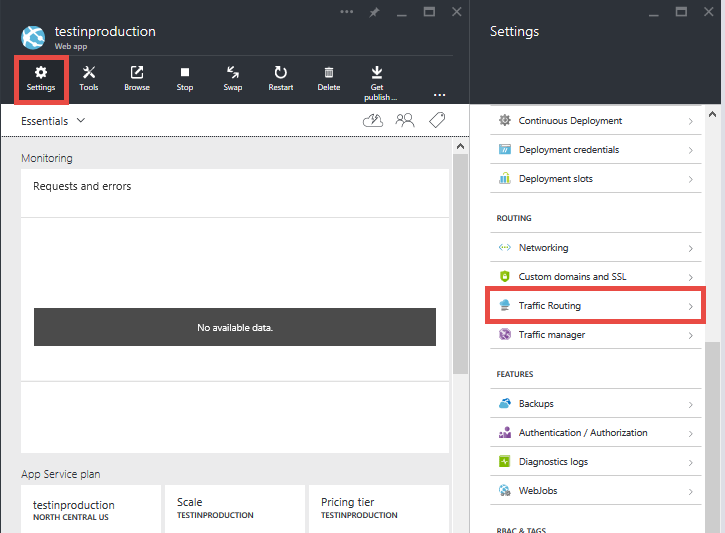

<properties
    pageTitle="Introdução ao teste de produção para aplicativos Web"
    description="Saiba mais sobre o teste no recurso de produção (dica) no Azure aplicativo de serviço Web Apps."
    services="app-service\web"
    documentationCenter=""
    authors="cephalin"
    manager="wpickett"
    editor=""/>

<tags
    ms.service="app-service-web"
    ms.workload="web"
    ms.tgt_pltfrm="na"
    ms.devlang="na"
    ms.topic="article"
    ms.date="01/13/2016"
    ms.author="cephalin"/>

# Introdução ao teste de produção para aplicativos Web

Testes em produção ou live teste seu aplicativo web usando o tráfego de cliente ao vivo, é uma estratégia de teste que os desenvolvedores de aplicativo cada vez mais integram sua metodologia de [desenvolvimento ágil](https://en.wikipedia.org/wiki/Agile_software_development) . Ele permite testar a qualidade de seus aplicativos com o tráfego de usuário ao vivo em seu ambiente de produção, em vez de sintetizada dados em um ambiente de teste. Ao expor seu novo aplicativo para usuários reais, você pode ser informado sobre os problemas reais que seu aplicativo pode enfrentar quando ele é implantado. Você pode verificar a funcionalidade, desempenho e valor de suas atualizações de aplicativo contra o volume, velocidade e variedade de tráfego de usuário real, o que você nunca pode aproximar em um ambiente de teste.

## Tráfego de roteamento no serviço de aplicativo Web Apps

Com o recurso roteamento de tráfego no [Serviço de aplicativo do Azure](http://go.microsoft.com/fwlink/?LinkId=529714), você pode direcionar uma parte do tráfego de usuário ao vivo para um ou mais [slots de implantação](web-sites-staged-publishing.md)e, em seguida, analisar seu aplicativo com [Ideias de aplicativo do Azure](/services/application-insights/) [Azure HDInsight](/services/hdinsight/)ou uma ferramenta de terceiros como [Relíquia novo](/marketplace/partners/newrelic/newrelic/) para validar sua alteração. Por exemplo, você pode implementar cenários a seguir com o serviço de aplicativo:

- Descobrir bugs funcionais ou identificar gargalos de desempenho em suas atualizações antes da implantação de todo o site
- Executar "teste controlado voos" das suas alterações medir métricas de usibility no aplicativo do beta
- Aumentar gradualmente até uma nova atualização e normalmente para baixo para a versão atual se ocorrer um erro 
- Otimizar os resultados de negócios do seu aplicativo executando [A / B testa](https://en.wikipedia.org/wiki/A/B_testing) ou [testes multivariate](https://en.wikipedia.org/wiki/Multivariate_testing_in_marketing) em vários slots de implantação

### Requisitos para usar o roteamento de tráfego nos aplicativos Web

- Seu aplicativo web deve executar na camada **padrão** ou **Premium** , como ele é necessário para vários slots de implantação.
- Para funcionar corretamente, o roteamento de tráfego requer os cookies estejam habilitados no navegador dos usuários. Roteamento de tráfego usa cookies para fixar um navegador do cliente para um slot de implantação por toda a sessão do cliente.
- Roteamento de tráfego oferece suporte a cenários de dica avançados por meio de cmdlets do PowerShell do Azure.

## Segmento do rotear o tráfego para um slot de implantação

No nível básico em cada cenário de dica, você rotear uma porcentagem predefinida do live tráfego para um slot de implantação de não produção. Para fazer isso, siga as etapas abaixo:

>[AZURE.NOTE] As etapas aqui supõe que você já tem um [slot de implantação de não-produção](web-sites-staged-publishing.md) e conteúdo de aplicativo da web desejada já está [implantado](web-sites-deploy.md) .

1. Log no [Portal do Azure](https://portal.azure.com/).
2. No blade do web app, clique em **configurações** > **Roteamento de tráfego**.
  
3. Selecione o intervalo que você deseja rotear o tráfego para e a porcentagem de tráfego total que deseja, em seguida, clique em **Salvar**.

    

4. Vá para blade do slot implantação. Agora você deve ver ao vivo tráfego sendo roteado para ele.

    

Depois que o roteamento de tráfego estiver configurado, a porcentagem especificada de clientes será roteada aleatoriamente para seu slot não seja de produção. No entanto, é importante observar que depois que um cliente é roteado automaticamente para um slot específico, ele será ser "fixado" nesse slot durante a vida de sessão cliente. Isso feito usando um cookie para fixar a sessão do usuário. Se você inspecionar as solicitações HTTP, você encontrará uma `TipMix` cookie em cada solicitação subsequente.

## Forçar solicitações de cliente para um slot específico

Além de roteamento de tráfego automático, o serviço de aplicativo é capaz de para rotear solicitações para um slot específico. Isso é útil quando você quiser que seus usuários seja capaz de desativar essa opção para ou recusa do aplicativo beta. Para fazer isso, você usa o `x-ms-routing-name` parâmetro de consulta.

Para redirecionar usuários para um slot específico usando `x-ms-routing-name`, você deve se certificar que o slot já é adicionado à lista roteamento de tráfego. Como você deseja rotear para um slot explicitamente, não importa a porcentagem de roteamento real que você definir. Se desejar, você pode criar um "link beta" que os usuários podem clicar para acessar o aplicativo de beta.

### Opt usuários sair do aplicativo de beta

Para permitir que usuários deixar de usar seu aplicativo beta, por exemplo, você pode colocar esse link em sua página da web:

    <a href="<webappname>.azurewebsites.net/?x-ms-routing-name=self">Go back to production app</a>

A cadeia de caracteres `x-ms-routing-name=self` Especifica o slot de produção. Depois que o navegador do cliente acessar o link, não só será redirecionado para o slot de produção, mas cada solicitação subsequente conterá o `x-ms-routing-name=self` cookie que fixa a sessão ao slot de produção.

### Opt usuários no aplicativo de beta

Para permitir que usuários optar por usar em seu aplicativo beta, defina o mesmo parâmetro de consulta para o nome do slot não seja de produção, por exemplo:

        <webappname>.azurewebsites.net/?x-ms-routing-name=staging

## Mais recursos ##

-   [Configurar ambientes web Apps em um serviço de aplicativo do Azure temporários](web-sites-staged-publishing.md)
-   [Implantar um aplicativo complexo previsíveis no Azure](app-service-deploy-complex-application-predictably.md)
-   [Desenvolvimento de software ágil com o serviço de aplicativo do Azure](app-service-agile-software-development.md)
-   [Usar ambientes DevOps efetivamente para seus aplicativos web](app-service-web-staged-publishing-realworld-scenarios.md)