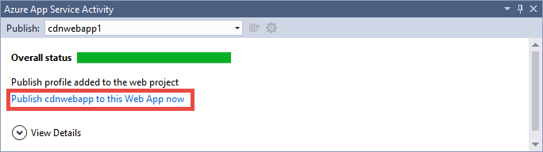
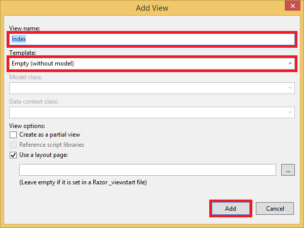

<properties 
    pageTitle="Usar o Azure CDN no serviço de aplicativo do Azure" 
    description="Um tutorial que ensina como implantar um aplicativo web ao serviço de aplicativo do Azure que serve o conteúdo de um ponto de extremidade do Azure CDN integrado" 
    services="app-service\web,cdn" 
    documentationCenter=".net" 
    authors="cephalin" 
    manager="wpickett" 
    editor="jimbe"/>

<tags 
    ms.service="app-service" 
    ms.workload="tbd" 
    ms.tgt_pltfrm="na" 
    ms.devlang="dotnet" 
    ms.topic="article" 
    ms.date="07/01/2016" 
    ms.author="cephalin"/>


# <a name="use-azure-cdn-in-azure-app-service"></a>Usar o Azure CDN no serviço de aplicativo do Azure

[Serviço de aplicativo](http://go.microsoft.com/fwlink/?LinkId=529714) pode ser integrado ao [Azure CDN](/services/cdn/), adicionando aos recursos de dimensionamento globais inerentes no [Aplicativo de serviço Web Apps](http://go.microsoft.com/fwlink/?LinkId=529714) servir o conteúdo do aplicativo da web globalmente de nós de servidor perto de seus clientes (uma lista atualizada de todos os locais de nó atual pode ser encontrada [aqui](http://msdn.microsoft.com/library/azure/gg680302.aspx)). Em cenários como atendendo imagens estáticas, essa integração drasticamente pode aumentar o desempenho de seus aplicativos do Azure aplicativo de serviço Web e melhora significativamente a experiência do usuário do seu aplicativo web em todo o mundo. 

Integração de aplicativos Web com CDN Azure oferece as seguintes vantagens:

- Integrar implantação de conteúdo (imagens, scripts e folhas de estilo) como parte do processo de [implantação contínua](app-service-continuous-deployment.md) da seu aplicativo web
- Atualizar facilmente os pacotes NuGet em seu aplicativo web no serviço de aplicativo do Azure, como jQuery ou versões de inicialização 
- Gerenciar seu aplicativo da Web e seu conteúdo served CDN a partir da mesma interface Visual Studio
- Integrar ASP.NET empacotamento e minimização CDN do Azure

[AZURE.INCLUDE [app-service-web-to-api-and-mobile](../../includes/app-service-web-to-api-and-mobile.md)] 

## <a name="what-you-will-build"></a>O que você criará ##

Você implantar um aplicativo web para o serviço de aplicativo do Azure usando o modelo do ASP.NET MVC padrão no Visual Studio, adicionar código para servir o conteúdo de uma CDN integrado do Azure, como uma imagem, resultados de ação do controlador e o padrão JavaScript e arquivos CSS e também escrever código para configurar o mecanismo de fallback para pacotes servida que a CDN está offline.

## <a name="what-you-will-need"></a>O que você vai precisar ##

Este tutorial tem os seguintes pré-requisitos:

-   Uma [conta do Microsoft Azure](/account/) de ativa
-   Visual Studio de 2015 com o [SDK do Azure para .NET](http://go.microsoft.com/fwlink/p/?linkid=323510&clcid=0x409). Se você usar Visual Studio, as etapas podem variar.

> [AZURE.NOTE] Você precisará de uma conta do Azure para concluir este tutorial:
> + Você pode [Abrir uma conta do Azure gratuitamente](/pricing/free-trial/) - obtenha créditos você pode usar para experimentar serviços Azure pagos e até mesmo depois que eles são usados para cima você pode manter a conta e uso livre Azure serviços, como aplicativos Web.
> + Você pode [ativar os benefícios de assinante do Visual Studio](/pricing/member-offers/msdn-benefits-details/) - assinatura o Visual Studio oferece a você créditos todo mês que você pode usar para serviços do Azure pagos.
>
> Se você quiser começar a usar o serviço de aplicativo do Azure antes de se inscrever para uma conta do Azure, vá para [Experimentar o serviço de aplicativo](http://go.microsoft.com/fwlink/?LinkId=523751), onde você pode criar imediatamente um aplicativo da web de curta duração starter no aplicativo de serviço. Não há cartões de crédito obrigatório; Não há compromissos.

## <a name="deploy-a-web-app-to-azure-with-an-integrated-cdn-endpoint"></a>Implantar um aplicativo web para o Azure com um ponto de extremidade CDN integrado ##

Nesta seção, você irá implantar o modelo de aplicativo do ASP.NET MVC no Visual Studio 2015 padrão ao aplicativo de serviço e integrar-o com um novo ponto de extremidade CDN. Siga as instruções abaixo:

1. No Visual Studio de 2015, criar um novo aplicativo web ASP.NET na barra de menu indo para **arquivo > Novo > projeto > Web > aplicativo Web ASP.NET**. Dê um nome e clique em **Okey**.

    

3. Selecione **MVC** e clique **Okey**.

    

4. Se você ainda não fez logon para sua conta do Azure ainda, clique no ícone de conta no canto superior direito e siga a caixa de diálogo para fazer logon em sua conta do Azure. Quando terminar, configure seu aplicativo conforme mostrado abaixo, clique em **novo** para criar um novo plano de serviço de aplicativo para o aplicativo.  

    

5. Configurar um novo plano de serviço de aplicativo na caixa de diálogo, conforme mostrado abaixo e clique em **Okey**. 

    

8. Clique em **criar** para criar o aplicativo web.

    

9. Depois que seu aplicativo ASP.NET é criado, publicá-lo Azure no painel de atividade de serviço de aplicativo do Azure clicando em **publicar `<app name>` para este aplicativo Web agora**. Clique em **Publicar** para concluir o processo.

    

    Quando a publicação estiver concluída, você verá seu aplicativo web publicada no navegador. 

1. Para criar um ponto de extremidade CDN, faça logon no [portal do Azure](https://portal.azure.com). 
2. Clique em **+ novo** > **mídia + CDN** > **CDN**.

    

3. Especifique o **CDN**, o **local**, o **grupo de recursos**, o **nível de preço**, clique em **criar**

       

4. No **Perfil de CDN** blade clique no botão **+ ponto de extremidade** . Dê um nome, selecione **Web App** na lista suspensa **Tipo de origem** e o seu aplicativo web na lista suspensa **nome do host de origem** e clique em **Adicionar**.  

    


    > [AZURE.NOTE] Depois que seu ponto de extremidade de CDN é criado, a lâmina de **ponto de extremidade** mostra sua URL CDN e o domínio de origem que ele é integrado ao. No entanto, ele pode demorar um pouco de configuração de nova CDN do ponto de extremidade ser totalmente propagada para todos os locais de nó CDN. 

3. De volta à lâmina de **ponto de extremidade** , clique no nome do ponto de extremidade CDN que você acabou de criar.

    

3. Clique no botão **Configurar** . Na lâmina **Configurar** , selecione o **Cache cada URL exclusivo** no menu suspenso de **comportamento do cache de cadeia de caracteres de consulta** , clique no botão **Salvar** .


    

Depois que você permitir isso, o mesmo link acessado com cadeias de caracteres de consulta diferentes serão ser armazenados em cache como entradas separadas.

>[AZURE.NOTE] Habilitando a cadeia de caracteres de consulta não é necessário para esta seção tutorial, que você deseja fazer isso como antecipado possível para conveniência desde qualquer alteração aqui vai demorar para se propagarem para todos os nós CDN, e não quiser qualquer conteúdo não consulta cadeia-habilitados obstruir o cache CDN (conteúdo CDN atualização vai ser discutido posteriormente).

2. Agora, navegue até o endereço do ponto de extremidade CDN. Se o ponto de extremidade estiver pronto, você deve ver seu aplicativo web exibido. Se você receber um erro de **HTTP 404** , o ponto de extremidade CDN não está pronto. Você talvez precise esperar para cima em uma hora para a configuração de CDN ser propagado para todos os nós de borda. 

    

1. Em seguida, tente acessar o arquivo **~/Content/bootstrap.css** em seu projeto ASP.NET. Na janela do navegador, navegue até * *http://*&lt;cdnName >*.azureedge.net/Content/bootstrap.css**. Na minha instalação, essa URL é:

        http://az673227.azureedge.net/Content/bootstrap.css

    Que corresponde a seguinte URL de origem no ponto de extremidade CDN:

        http://cdnwebapp.azurewebsites.net/Content/bootstrap.css

    Quando você navegar para * *http://*&lt;cdnName >*.azureedge.net/Content/bootstrap.css**, você será solicitado a baixar o bootstrap.css que vieram do seu aplicativo web no Azure. 

    

Da mesma forma, você pode acessar qualquer URL acessível publicamente em * *http://*&lt;serviceName >*.cloudapp.net/**, diretamente do seu ponto de extremidade CDN. Por exemplo:

-   Um arquivo. js do caminho /Script
-   Qualquer arquivo de conteúdo do /Content caminho
-   Qualquer controlador/ação 
-   Se a cadeia de caracteres de consulta estiver habilitada seu ponto de extremidade de CDN, qualquer URL com cadeias de caracteres de consulta
-   O aplicativo web Azure inteira, se todo o conteúdo é público

Observe que ele pode não estar sempre uma boa ideia (ou geralmente uma boa ideia) para servir um aplicativo web Azure inteira por meio de CDN do Azure. Alguns das condições são:

-   Essa abordagem requer todo o seu site para ser público, pois CDN Azure não pode servir qualquer conteúdo particular.
-   Se o ponto de extremidade CDN ficar offline por algum motivo, se manutenção agendada ou erro de usuário, seu aplicativo web inteira fica offline, a menos que os clientes podem ser redirecionados para a URL de origem * *http://*&lt;nome do site >*.azurewebsites.net/**. 
-   Mesmo com as configurações de Cache-Control personalizadas (consulte [Configurar opções de cache para arquivos estáticos em seu aplicativo web Azure](#configure-caching-options-for-static-files-in-your-azure-web-app)), um ponto de extremidade CDN não melhorar o desempenho de conteúdo altamente dinâmicos. Se você tentou carregar a home page do seu ponto de extremidade CDN como mostrado acima, observe que levou pelo menos 5 segundos para carregar a home page padrão na primeira vez, o que é uma página bastante simple. Imagine o que poderia acontecer para a experiência do cliente se esta página contém conteúdo dinâmico que deve atualizar a cada minuto. Servir conteúdo dinâmico de um ponto de extremidade CDN requer expiração de cache pequeno, o que resulta em erros de cache frequente o ponto de extremidade de CDN. Isso afeta o desempenho de seu aplicativo web do Azure e anule a finalidade de uma CDN.

A alternativa é determinar qual conteúdo para servir de CDN Azure em uma base por caso em seu aplicativo web Azure. Para esse fim, você já viu como acessar arquivos de conteúdo individual do ponto de extremidade CDN. Para mostrar como servir uma ação de controlador específico por meio do ponto de extremidade CDN em [servir o conteúdo das ações de controlador por meio de CDN do Azure](#serve-content-from-controller-actions-through-azure-cdn).

## <a name="configure-caching-options-for-static-files-in-your-azure-web-app"></a>Configurar opções de cache para arquivos estáticos em seu aplicativo web do Azure ##

Com a integração de CDN Azure em seu aplicativo web Azure, você pode especificar como deseja que o conteúdo estático sejam armazenadas em cache no ponto de extremidade CDN. Para fazer isso, abra *Web. config* do seu projeto ASP.NET (por exemplo, **cdnwebapp**) e adicione um `<staticContent>` elemento `<system.webServer>`. O XML abaixo configura o cache para expirar em 3 dias.  

    <system.webServer>
      <staticContent>
        <clientCache cacheControlMode="UseMaxAge" cacheControlMaxAge="3.00:00:00"/>
      </staticContent>
      ...
    </system.webServer>

Depois de fazer isso, todos os arquivos estáticos em seu aplicativo web Azure irá observar a mesma regra em seu cache CDN. Para um controle mais granular das configurações de cache, adicione um arquivo *Web. config* em uma pasta e suas configurações de lá. Por exemplo, adicionar um arquivo *Web. config* à pasta *\Content* e substituir o conteúdo com o seguinte XML:

    <?xml version="1.0"?>
    <configuration>
      <system.webServer>
        <staticContent>
          <clientCache cacheControlMode="UseMaxAge" cacheControlMaxAge="15.00:00:00"/>
        </staticContent>
      </system.webServer>
    </configuration>

Esta configuração faz com que todos os arquivos estáticos da pasta *\Content* sejam armazenadas em cache por 15 dias.

Para obter mais informações sobre como configurar o `<clientCache>` elemento, consulte [Cache cliente &lt;clientCache >](http://www.iis.net/configreference/system.webserver/staticcontent/clientcache).

Na próxima seção, eu também mostrará você como você pode definir configurações de cache para resultados de ação do controlador no cache CDN.

## <a name="serve-content-from-controller-actions-through-azure-cdn"></a>Servir o conteúdo das ações de controlador por meio de CDN do Azure ##

Quando você integra aplicativos Web com o Azure CDN, é relativamente fácil servir o conteúdo das ações de controlador por meio de CDN o Azure. Novamente, se você decidir servir o aplicativo web Azure inteira por meio de seu CDN, você não precisa fazer isso desde que todas as ações de controlador já estão acessíveis por meio da CDN. Mas, pelas razões que eu já indicado no [implantar um aplicativo web Azure com um ponto de extremidade CDN integrado](#deploy-a-web-app-to-azure-with-an-integrated-cdn-endpoint), você pode decidir contra isso e optar por selecionar a ação de controlador que você deseja atender do Azure CDN. [Maarten Balliauw](https://twitter.com/maartenballiauw) mostra como fazer isso com uma diversão controlador de MemeGenerator na [latência reduzindo na web com o CDN do Azure](http://channel9.msdn.com/events/TechDays/Techdays-2014-the-Netherlands/Reducing-latency-on-the-web-with-the-Windows-Azure-CDN). Posso será simplesmente reproduzi-lo aqui.

Suponha que em seu aplicativo web que você deseja gerar memes com base em uma imagem de Chuck Norris novato (foto pelo [Antonio Light](http://www.flickr.com/photos/alan-light/218493788/)) como esta:


Você tem um simples `Index` ação que permite que os clientes especificar os superlativos na imagem, em seguida, gera o meme depois que eles postarem a ação. Como é Chuck Norris, esperado nesta página se tornar totalmente populares globalmente. Este é um bom exemplo de servir conteúdo dinâmico semiestruturados com CDN do Azure. 

Siga as etapas acima para esta ação do controlador de instalação:

1. Na pasta *\Controllers* , crie um novo arquivo. cs chamado *MemeGeneratorController.cs* e substitua o conteúdo com o seguinte código. Substitua o caminho de arquivo para `~/Content/chuck.bmp` e seu nome de CDN para `yourCDNName`.


        using System;
        using System.Collections.Generic;
        using System.Diagnostics;
        using System.Drawing;
        using System.IO;
        using System.Net;
        using System.Web.Hosting;
        using System.Web.Mvc;
        using System.Web.UI;

        namespace cdnwebapp.Controllers
        {
          public class MemeGeneratorController : Controller
          {
            static readonly Dictionary<string, Tuple<string ,string>> Memes = new Dictionary<string, Tuple<string, string>>();

            public ActionResult Index()
            {
              return View();
            }

            [HttpPost, ActionName("Index")]
            public ActionResult Index_Post(string top, string bottom)
            {
              var identifier = Guid.NewGuid().ToString();
              if (!Memes.ContainsKey(identifier))
              {
                Memes.Add(identifier, new Tuple<string, string>(top, bottom));
              }

              return Content("<a href=\"" + Url.Action("Show", new {id = identifier}) + "\">here's your meme</a>");
            }

            [OutputCache(VaryByParam = "*", Duration = 1, Location = OutputCacheLocation.Downstream)]
            public ActionResult Show(string id)
            {
              Tuple<string, string> data = null;
              if (!Memes.TryGetValue(id, out data))
              {
                return new HttpStatusCodeResult(HttpStatusCode.NotFound);
              }

              if (Debugger.IsAttached) // Preserve the debug experience
              {
                return Redirect(string.Format("/MemeGenerator/Generate?top={0}&bottom={1}", data.Item1, data.Item2));
              }
              else // Get content from Azure CDN
              {
                return Redirect(string.Format("http://<yourCDNName>.azureedge.net/MemeGenerator/Generate?top={0}&bottom={1}", data.Item1, data.Item2));
              }
            }

            [OutputCache(VaryByParam = "*", Duration = 3600, Location = OutputCacheLocation.Downstream)]
            public ActionResult Generate(string top, string bottom)
            {
              string imageFilePath = HostingEnvironment.MapPath("~/Content/chuck.bmp");
              Bitmap bitmap = (Bitmap)Image.FromFile(imageFilePath);

              using (Graphics graphics = Graphics.FromImage(bitmap))
              {
                SizeF size = new SizeF();
                using (Font arialFont = FindBestFitFont(bitmap, graphics, top.ToUpperInvariant(), new Font("Arial Narrow", 100), out size))
                {
                    graphics.DrawString(top.ToUpperInvariant(), arialFont, Brushes.White, new PointF(((bitmap.Width - size.Width) / 2), 10f));
                }
                using (Font arialFont = FindBestFitFont(bitmap, graphics, bottom.ToUpperInvariant(), new Font("Arial Narrow", 100), out size))
                {
                    graphics.DrawString(bottom.ToUpperInvariant(), arialFont, Brushes.White, new PointF(((bitmap.Width - size.Width) / 2), bitmap.Height - 10f - arialFont.Height));
                }
              }
              MemoryStream ms = new MemoryStream();
              bitmap.Save(ms, System.Drawing.Imaging.ImageFormat.Png);
              return File(ms.ToArray(), "image/png");
            }

            private Font FindBestFitFont(Image i, Graphics g, String text, Font font, out SizeF size)
            {
              // Compute actual size, shrink if needed
              while (true)
              {
                size = g.MeasureString(text, font);

                // It fits, back out
                if (size.Height < i.Height &&
                     size.Width < i.Width) { return font; }

                // Try a smaller font (90% of old size)
                Font oldFont = font;
                font = new Font(font.Name, (float)(font.Size * .9), font.Style);
                oldFont.Dispose();
              }
            }
          }
        }

2. Clique com botão direito no padrão `Index()` ação e selecione **Adicionar modo de exibição**.

    

3.  Aceite as configurações a seguir e clique em **Adicionar**.

    

4. Abra o novo *Views\MemeGenerator\Index.cshtml* e substitua o conteúdo com o seguinte HTML simple para enviar os superlativos:

        <h2>Meme Generator</h2>
        
        <form action="" method="post">
            <input type="text" name="top" placeholder="Enter top text here" />
            <br />
            <input type="text" name="bottom" placeholder="Enter bottom text here" />
            <br />
            <input class="btn" type="submit" value="Generate meme" />
        </form>

5. Publique o aplicativo web Azure novamente e navegue até * *http://*&lt;serviceName >*.cloudapp.net/MemeGenerator/Index** no seu navegador. 

Quando você envia os valores de formulário para `/MemeGenerator/Index`, o `Index_Post` método de ação retorna um link para o `Show` método de ação com o respectivo identificador de entrada. Quando você clica no link, atingir o seguinte código:  

    [OutputCache(VaryByParam = "*", Duration = 1, Location = OutputCacheLocation.Downstream)]
    public ActionResult Show(string id)
    {
      Tuple<string, string> data = null;
      if (!Memes.TryGetValue(id, out data))
      {
        return new HttpStatusCodeResult(HttpStatusCode.NotFound);
      }

      if (Debugger.IsAttached) // Preserve the debug experience
      {
        return Redirect(string.Format("/MemeGenerator/Generate?top={0}&bottom={1}", data.Item1, data.Item2));
      }
      else // Get content from Azure CDN
      {
        return Redirect(string.Format("http://<yourCDNName>.azureedge.net/MemeGenerator/Generate?top={0}&bottom={1}", data.Item1, data.Item2));
      }
    }

Se seu local depurador estiver conectado, você obterá a experiência de depuração regular com um local redirecionamento. Se ele estiver em execução no Azure web app, ele irá redirecioná para:

    http://<yourCDNName>.azureedge.net/MemeGenerator/Generate?top=<formInput>&bottom=<formInput>

Que corresponde a seguinte URL de origem seu ponto de extremidade de CDN:

    http://<yourSiteName>.azurewebsites.net/cdn/MemeGenerator/Generate?top=<formInput>&bottom=<formInput>

Depois de regra aplicada anteriormente de reconfiguração de URL, o arquivo real que obtém armazenados em cache para seu ponto de extremidade CDN é:

    http://<yourSiteName>.azurewebsites.net/MemeGenerator/Generate?top=<formInput>&bottom=<formInput>

Você pode usar o `OutputCacheAttribute` atributo na `Generate` método para especificar como o resultado de ação deve ser armazenados em cache, qual CDN Azure manterá. O código a seguir especificam uma expiração de cache de 1 hora (3.600 segundos).

    [OutputCache(VaryByParam = "*", Duration = 3600, Location = OutputCacheLocation.Downstream)]

Da mesma forma, você pode servir o conteúdo de qualquer ação de controlador em seu aplicativo web Azure por meio de seu CDN do Azure, com a opção de cache desejada.

A próxima seção, para mostrar como servir o scripts agrupados e minified e CSS por meio de CDN do Azure. 

## <a name="integrate-aspnet-bundling-and-minification-with-azure-cdn"></a>Integrar ASP.NET empacotamento e minimização CDN do Azure ##

Folhas de estilo CSS e scripts alterar raramente e são fortes candidatos para o cache de CDN do Azure. Servir o aplicativo web inteira por meio de seu CDN Azure é a maneira mais fácil para integrar empacotamento e minimização CDN do Azure. No entanto, como você pode optar por contra essa abordagem para os motivos descritos em [integrar um ponto de extremidade do Azure CDN com o Azure web app e servir estático conteúdo em suas páginas da Web do Azure CDN](#deploy-a-web-app-to-azure-with-an-integrated-cdn-endpoint), eu mostrará como fazê-lo enquanto preserva a experiência de develper desejado do ASP.NET empacotamento e minimização, tais como:

-   Experiência de modo de depuração excelentes
-   Implantação simplificada
-   Atualizações de imediatas para clientes para atualizações de versão de script/CSS
-   Mecanismo de fallback quando o ponto de extremidade de CDN falhar
-   Minimizar a modificação de código

No projeto ASP.NET que você criou no [integrar um ponto de extremidade do Azure CDN com o Azure web app e servir estático conteúdo em suas páginas da Web do Azure CDN](#deploy-a-web-app-to-azure-with-an-integrated-cdn-endpoint), abra *App_Start\BundleConfig.cs* e dê uma olhada na `bundles.Add()` chamadas de método.

    public static void RegisterBundles(BundleCollection bundles)
    {
        bundles.Add(new ScriptBundle("~/bundles/jquery").Include(
                    "~/Scripts/jquery-{version}.js"));
        ...
    }

O primeiro `bundles.Add()` instrução adiciona um pacote de script no diretório virtual `~/bundles/jquery`. Em seguida, abra *Views\Shared\_Layout.cshtml* para ver como a marca de pacote de script é renderizada. Você deve ser capaz de localizar a seguinte linha de código do Razor:

    @Scripts.Render("~/bundles/jquery")

Quando este código Razor é executado no Azure web app, ele processará um `<script>` marca para o pacote de script semelhante ao seguinte: 

    <script src="/bundles/jquery?v=FVs3ACwOLIVInrAl5sdzR2jrCDmVOWFbZMY6g6Q0ulE1"></script>

No entanto, quando ele é executado no Visual Studio digitando `F5`, ele processará cada arquivo de script no pacote individualmente (no caso acima, apenas um arquivo de script está no pacote):

    <script src="/Scripts/jquery-1.10.2.js"></script>

Isso permite depurar o código JavaScript no seu ambiente de desenvolvimento enquanto reduzindo conexões de cliente simultâneas (agrupamento) e melhorando o arquivo de desempenho (minimização) de download em produção. É um ótimo recurso para preservar com integração de CDN do Azure. Além disso, como o pacote renderizado já contém uma cadeia de caracteres de versão gerado automaticamente, você deseja replicar essa funcionalidade para que sempre que você atualiza sua versão do jQuery por meio do NuGet, ele pode ser atualizado no lado do cliente assim que possível.

Siga as etapas abaixo para integração ASP.NET agrupando e minimização com seu ponto de extremidade CDN.

1. De volta ao *App_Start\BundleConfig.cs*, modificar o `bundles.Add()` métodos para usar um outro [Construtor de pacote](http://msdn.microsoft.com/library/jj646464.aspx), que especifica um endereço CDN. Para fazer isso, substitua o `RegisterBundles` definição de método com o seguinte código:  
    
        public static void RegisterBundles(BundleCollection bundles)
        {
          bundles.UseCdn = true;
          var version = System.Reflection.Assembly.GetAssembly(typeof(Controllers.HomeController))
            .GetName().Version.ToString();
          var cdnUrl = "http://<yourCDNName>.azureedge.net/{0}?" + version;

          bundles.Add(new ScriptBundle("~/bundles/jquery", string.Format(cdnUrl, "bundles/jquery")).Include(
                "~/Scripts/jquery-{version}.js"));

          bundles.Add(new ScriptBundle("~/bundles/jqueryval", string.Format(cdnUrl, "bundles/jqueryval")).Include(
                "~/Scripts/jquery.validate*"));

          // Use the development version of Modernizr to develop with and learn from. Then, when you're
          // ready for production, use the build tool at http://modernizr.com to pick only the tests you need.
          bundles.Add(new ScriptBundle("~/bundles/modernizr", string.Format(cdnUrl, "bundles/modernizr")).Include(
                "~/Scripts/modernizr-*"));

          bundles.Add(new ScriptBundle("~/bundles/bootstrap", string.Format(cdnUrl, "bundles/bootstrap")).Include(
                "~/Scripts/bootstrap.js",
                "~/Scripts/respond.js"));

          bundles.Add(new StyleBundle("~/Content/css", string.Format(cdnUrl, "Content/css")).Include(
                "~/Content/bootstrap.css",
                "~/Content/site.css"));
        }


    Certifique-se de substituir `<yourCDNName>` com o nome do seu CDN do Azure.

    Em palavras simples, você está definindo `bundles.UseCdn = true` e adicionou uma URL de CDN elaborada com cuidado para cada conjunto. Por exemplo, o primeiro construtor no código:

        new ScriptBundle("~/bundles/jquery", string.Format(cdnUrl, "bundles/jquery"))

    é a mesma que: 

        new ScriptBundle("~/bundles/jquery", string.Format(cdnUrl, "http://<yourCDNName>.azureedge.net/bundles/jquery?<W.X.Y.Z>"))

    Este construtor informa ASP.NET empacotamento e minimização para processar arquivos de script individuais quando depurado localmente, mas use o endereço CDN especificado para acessar o script em questão. No entanto, observe duas características importantes com esta URL CDN elaborada com cuidado:
    
    - A origem para esta URL CDN é `http://<yourSiteName>.azurewebsites.net/bundles/jquery?<W.X.Y.Z>`, que é realmente o diretório virtual do pacote de script no seu aplicativo Web.
    - Como você está usando o construtor CDN, a marca de script CDN para o pacote não contém mais a cadeia de caracteres de versão gerado automaticamente na URL processada. Você deve gerar manualmente uma cadeia de caracteres de versão exclusivo sempre que o pacote de script é modificado para forçar um erro de cache em seu CDN do Azure. Ao mesmo tempo, essa cadeia de caracteres de versão exclusivo deve permanecer constante durante toda a vida da implantação maximizar ocorrências de cache em seu CDN Azure após o pacote de implantação.

3. A cadeia de caracteres de consulta `<W.X.Y.Z>` obtém do *Properties\AssemblyInfo.cs* em seu projeto ASP.NET. Você pode ter um fluxo de trabalho de implantação que inclui incrementar a versão do assembly toda vez que você publica no Azure. Ou, você pode modificar apenas *Properties\AssemblyInfo.cs* em seu projeto para incrementar automaticamente a cadeia de caracteres de versão sempre que você criar, usar o caractere curinga ' *'. Por exemplo, alterar `AssemblyVersion` conforme mostrado abaixo:
    
        [assembly: AssemblyVersion("1.0.0.*")]
    
    Qualquer outra estratégia para simplificar gerando uma cadeia de caracteres exclusiva para a vida de uma implantação funcionará aqui.

3. Republicar o aplicativo ASP.NET e acessar a home page.
 
4. Exiba o código HTML para a página. Você deve ser capaz de ver a URL de CDN processada, com uma cadeia de caracteres de versão exclusivo sempre que você republicar alterações ao seu aplicativo web Azure. Por exemplo:  
    
        ...
        <link href="http://az673227.azureedge.net/Content/css?1.0.0.25449" rel="stylesheet"/>
        <script src="http://az673227.azureedge.net/bundles/modernizer?1.0.0.25449"></script>
        ...
        <script src="http://az673227.azureedge.net/bundles/jquery?1.0.0.25449"></script>
        <script src="http://az673227.azureedge.net/bundles/bootstrap?1.0.0.25449"></script>
        ...

5. No Visual Studio, depurar o aplicativo do ASP.NET no Visual Studio digitando `F5`., 

6. Exiba o código HTML para a página. Você ainda verá cada arquivo de script processado individualmente para que você possa ter uma depuração consistente experiência no Visual Studio.  
    
        ...
        <link href="/Content/bootstrap.css" rel="stylesheet"/>
        <link href="/Content/site.css" rel="stylesheet"/>
        <script src="/Scripts/modernizr-2.6.2.js"></script>
        ...
        <script src="/Scripts/jquery-1.10.2.js"></script>
        <script src="/Scripts/bootstrap.js"></script>
        <script src="/Scripts/respond.js"></script>
        ...    

## <a name="fallback-mechanism-for-cdn-urls"></a>Mecanismo de fallback para URLs de CDN ##

Quando o ponto de extremidade do Azure CDN falha por algum motivo, desejar que sua página da Web para ser inteligente o suficiente para acessar o seu servidor de Web de origem como a opção de fallback para carregar JavaScript ou inicialização. É grave o suficiente para perder imagens em seu aplicativo web devido a indisponibilidade CDN, mas muito mais grave perder funcionalidade de página fundamentais fornecida pelo seu scripts e folhas de estilo.

A classe de [pacote](http://msdn.microsoft.com/library/system.web.optimization.bundle.aspx) contém uma propriedade chamada [CdnFallbackExpression](http://msdn.microsoft.com/library/system.web.optimization.bundle.cdnfallbackexpression.aspx) que permite que você configure o mecanismo de fallback para falha CDN. Para usar essa propriedade, siga as etapas abaixo:

1. Em seu projeto ASP.NET, abra *App_Start\BundleConfig.cs*, onde você adicionou uma URL de CDN em cada [Construtor de pacote](http://msdn.microsoft.com/library/jj646464.aspx)e adicione `CdnFallbackExpression` código em quatro casas conforme mostrado para adicionar um mecanismo de fallback para os pacotes de padrão.  
    
        public static void RegisterBundles(BundleCollection bundles)
        {
          var version = System.Reflection.Assembly.GetAssembly(typeof(BundleConfig))
            .GetName().Version.ToString();
          var cdnUrl = "http://cdnurl.azureedge.net/.../{0}?" + version;
          bundles.UseCdn = true;

          bundles.Add(new ScriptBundle("~/bundles/jquery", string.Format(cdnUrl, "bundles/jquery")) 
                { CdnFallbackExpression = "window.jquery" }
                .Include("~/Scripts/jquery-{version}.js"));

          bundles.Add(new ScriptBundle("~/bundles/jqueryval", string.Format(cdnUrl, "bundles/jqueryval")) 
                { CdnFallbackExpression = "$.validator" }
                .Include("~/Scripts/jquery.validate*"));

          // Use the development version of Modernizr to develop with and learn from. Then, when you're
          // ready for production, use the build tool at http://modernizr.com to pick only the tests you need.
          bundles.Add(new ScriptBundle("~/bundles/modernizr", string.Format(cdnUrl, "bundles/modernizer")) 
                { CdnFallbackExpression = "window.Modernizr" }
                .Include("~/Scripts/modernizr-*"));

          bundles.Add(new ScriptBundle("~/bundles/bootstrap", string.Format(cdnUrl, "bundles/bootstrap"))     
                { CdnFallbackExpression = "$.fn.modal" }
                .Include(
                        "~/Scripts/bootstrap.js",
                        "~/Scripts/respond.js"));

          bundles.Add(new StyleBundle("~/Content/css", string.Format(cdnUrl, "Content/css")).Include(
                "~/Content/bootstrap.css",
                "~/Content/site.css"));
        }

    Quando `CdnFallbackExpression` é não nulo, script é inserido no HTML para testar se o pacote é carregado com êxito e, caso contrário, acessar o pacote diretamente do servidor de Web de origem. Essa propriedade deve ser definida como uma expressão de JavaScript que testa se o pacote CDN respectivo é carregado corretamente. A expressão necessária para testar cada pacote difere de acordo com o conteúdo. Para os pacotes de padrão acima:
    
    - `window.jquery`é definido em jquery-{version}. js
    - `$.validator`é definido em jquery.validate.js
    - `window.Modernizr`é definido em modernizer-{version}. js
    - `$.fn.modal`é definido em bootstrap.js
    
    Você deve ter notado que eu não definiu CdnFallbackExpression para o `~/Cointent/css` pacote. Isso ocorre porque atualmente não há um [erro no System.Web.Optimization](https://aspnetoptimization.codeplex.com/workitem/104) que insere um `<script>` marca para o CSS fallback em vez de esperados `<link>` marca.
    
    No entanto, há um bom [Estilo pacote Fallback](https://github.com/EmberConsultingGroup/StyleBundleFallback) oferecida pela [Ember Consulting Group](https://github.com/EmberConsultingGroup). 

2. Para usar a solução alternativa CSS, crie um novo arquivo. cs na pasta de *App_Start* do seu projeto ASP.NET chamada *StyleBundleExtensions.cs*e substitua o seu conteúdo com o [código do GitHub](https://github.com/EmberConsultingGroup/StyleBundleFallback/blob/master/Website/App_Start/StyleBundleExtensions.cs). 

4. Na *App_Start\StyleFundleExtensions.cs*, renomear namespace ao espaço para nome do seu aplicativo ASP.NET (por exemplo, **cdnwebapp**). 

3. Voltar à `App_Start\BundleConfig.cs` e substitua a última `bundles.Add` instrução com o seguinte código:  

        bundles.Add(new StyleBundle("~/Content/css", string.Format(cdnUrl, "Content/css"))
          .IncludeFallback("~/Content/css", "sr-only", "width", "1px")
          .Include(
            "~/Content/bootstrap.css",
            "~/Content/site.css"));

    Esse novo método de extensão usa a mesma ideia para inserir script no HTML para verificar o DOM para a um nome de classe correspondente, nome da regra e definidos no pacote CSS e cai para o servidor da Web de origem, se não conseguir encontrar a correspondência de valor de regra.

4. Publique seu aplicativo web Azure novamente e acesse a página inicial. 
5. Exiba o código HTML para a página. Você deve encontrar scripts inseridos similar ao seguinte:    
    
    ```
    ...
    <link href="http://az673227.azureedge.net/Content/css?1.0.0.25474" rel="stylesheet"/>
<script>(function() {
                var loadFallback,
                    len = document.styleSheets.length;
                for (var i = 0; i < len; i++) {
                    var sheet = document.styleSheets[i];
                    if (sheet.href.indexOf('http://az673227.azureedge.net/Content/css?1.0.0.25474') !== -1) {
                        var meta = document.createElement('meta');
                        meta.className = 'sr-only';
                        document.head.appendChild(meta);
                        var value = window.getComputedStyle(meta).getPropertyValue('width');
                        document.head.removeChild(meta);
                        if (value !== '1px') {
                            document.write('<link href="/Content/css" rel="stylesheet" type="text/css" />');
                        }
                    }
                }
                return true;
            }())||document.write('<script src="/Content/css"><\/script>');</script>

    <script src="http://az673227.azureedge.net/bundles/modernizer?1.0.0.25474"></script>
    <script>(window.Modernizr)||document.write('<script src="/bundles/modernizr"><\/script>');</script>
    ... 
    <script src="http://az673227.azureedge.net/bundles/jquery?1.0.0.25474"></script>
    <script>(window.jquery)||document.write('<script src="/bundles/jquery"><\/script>');</script>

    <script src="http://az673227.azureedge.net/bundles/bootstrap?1.0.0.25474"></script>
    <script>($.fn.modal)||document.write('<script src="/bundles/bootstrap"><\/script>');</script>
    ...
    ```

    Observe que o script inserido para o pacote CSS ainda contém o excedente errôneo do `CdnFallbackExpression` propriedade na linha:

        }())||document.write('<script src="/Content/css"><\/script>');</script>

    Mas desde a primeira parte do | | expressão sempre retornará true (na linha diretamente acima), a função Document nunca será executada.

6. Para testar se o script fallback está funcionando, volte para a lâmina de seu CDN ponto de extremidade e clique em **Parar**.

    

7. Atualize a janela do navegador para o aplicativo web Azure. Agora você deve ver todos os scripts e folhas de estilo são carregadas corretamente.

## <a name="more-information"></a>Mais informações 
- [Visão geral da rede Azure fornecimento de conteúdo (CDN)](../cdn/cdn-overview.md)
- [Usando o Azure CDN](../cdn/cdn-create-new-endpoint.md)
- [Integrar um serviço na nuvem com o Azure CDN](../cdn/cdn-cloud-service-with-cdn.md)
- [Empacotamento do ASP.NET e minimização](http://www.asp.net/mvc/tutorials/mvc-4/bundling-and-minification)

