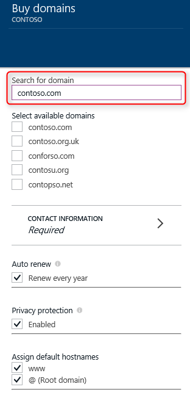
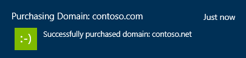

<properties
    pageTitle="Como comprar um nome de domínio personalizado no Azure aplicativo de serviço Web Apps"
    description="Saiba como comprar um nome de domínio personalizado com um aplicativo web no serviço de aplicativo do Azure."
    services="app-service\web"
    documentationCenter=""
    authors="rmcmurray"
    manager="wpickett"
    editor=""/>

<tags
    ms.service="app-service-web"
    ms.workload="web"
    ms.tgt_pltfrm="na"
    ms.devlang="na"
    ms.topic="article"
    ms.date="08/11/2016"
    ms.author="robmcm"/>

# Comprar e configurar um nome de domínio personalizado no serviço de aplicativo do Azure

[AZURE.INCLUDE [web-selector](../../includes/websites-custom-domain-selector.md)]

Quando você cria um aplicativo web, o Azure atribui-la a um subdomínio do azurewebsites.net. Por exemplo, se seu aplicativo web é denominado **contoso**, a URL é **contoso.azurewebsites.net**. Azure também atribui um endereço IP virtual.

Para um aplicativo web de produção, você provavelmente desejará que os usuários vejam um nome de domínio personalizado. Este artigo explica como comprar e configurar um domínio personalizado ao [Aplicativo de serviço Web Apps](http://go.microsoft.com/fwlink/?LinkId=529714). 

[AZURE.INCLUDE [introfooter](../../includes/custom-dns-web-site-intro-notes.md)]

## Visão geral

Se você não tiver um nome de domínio para seu aplicativo web, você pode comprar um no [Portal do Azure](https://portal.azure.com/)facilmente. Durante o processo de compra você pode optar por ter os registros DNS do domínio raiz e WWW ser mapeado para seu aplicativo web automaticamente. Você também pode gerenciar o domínio direto dentro do Portal do Azure.

Use as etapas a seguir para comprar nomes de domínio e atribuir a seu aplicativo web.

1. No navegador, abra o [Portal do Azure](https://portal.azure.com/).

2. Na guia **Web Apps** , clique no nome do seu aplicativo web, selecione **configurações**e selecione **domínios personalizados**

    

3. Na lâmina **domínios personalizados** , clique em **comprar domínios**.

    

4. Na lâmina **Comprar domínios** , use a caixa de texto para digitar o nome do domínio que você deseja comprar e pressione Enter. Os domínios disponíveis sugeridos serão mostrados logo abaixo da caixa de texto. Selecione o domínio que você deseja comprar. Você pode optar por vários domínios de compra ao mesmo tempo. 

  

5. Clique nas **Informações de contato** e preencha o formulário de informações de contato do domínio.

  

    > [AZURE.NOTE] É muito importante que você preencha todos os campos obrigatórios com tantos precisão possível, especialmente o endereço de email. No caso de adquirir o domínio sem "Proteção de privacidade", você pode ser solicitado para verificar seu email antes do domínio fica ativo. Em alguns casos, dados incorretos para informações de contato resultará em falha para adquirir domínios. 

6. Agora você pode optar por,

    a) "renovação automática" seu domínio cada ano
    
    b) Opt-in para "Proteção de privacidade", que está incluída no preço de compra gratuitamente (exceto para TLDs quem registro não oferece suporte a privacidade. Por exemplo:. co.in,. co.uk etc.)  
    
    c) "atribua nomes de host padrão" para "www" e raiz de domínio para o aplicativo da Web atual. 

  
  
    > [AZURE.NOTE] Opção C configura ligações de DNS e ligações Hostname automaticamente para você.  Dessa forma, seu aplicativo Web podem ser acessado usando o domínio personalizado, assim que a compra for concluída (baring atrasos de propagação de DNS em alguns casos). Caso, seu aplicativo Web é atrás de um gerente de tráfego do Azure, você não verá uma opção para atribuir o domínio raiz, como registros de não funcionam com o Gerenciador de tráfego. Você pode sempre atribuir os domínios/sub-domains adquiridos por meio de um Web App para outra Web App e vice-versa. Consulte a etapa 8 para obter mais detalhes. 
    
7. Clique em **Selecionar** na lâmina **Comprar domínios** , você verá as informações de compra na lâmina **confirmação de compra** . Se você aceita os termos legais e clique em **comprar**, seu pedido será enviado e você pode monitorar o processo de compra na **notificação**. Compra de domínio pode levar alguns minutos para concluir. 

  

  

8. Se você pedido com êxito um domínio, você pode gerenciar o domínio e atribuir a seu aplicativo web. Clique no **"..."** no lado direito de seu domínio. Em seguida, você pode **Cancelar a compra** ou **Gerenciar domínio**. Clique em **Gerenciar domínio**, em seguida, podemos fazer a ligação **subdomínio** nosso aplicativo web em **Gerenciar domínio** blade. Se você quiser vincular um **subdomínio** para um aplicativo Web diferente execute esta etapa de dentro do contexto do respectivo Web App. Aqui você pode escolher para atribuir o domínio para o ponto de extremidade de Gerenciador de tráfego (se o aplicativo da Web está atrás TM) pelo Gerenciador de tráfego simplesmente selecionando nome do menu suspenso. Fazendo isso, domínio/subdomínio será atribuído a todos os aplicativos da Web atrás desse ponto de extremidade do Gerenciador de tráfego automaticamente. 

    

    > [AZURE.NOTE] Você pode "Cancelar compra" dentro de 5 dias para obter reembolso total. Após 5 dias, que você poderá não ser capaz de "Cancelar compra", em vez disso, você verá uma opção para "Excluir" do domínio. Excluindo o domínio resultará em liberá-lo de sua assinatura sem reembolso e tornará domínio disponível. 

Após a conclusão da configuração, o nome de domínio personalizado será listado na seção **Hostname ligações** do seu aplicativo web.

Neste ponto, você deve ser capaz de insira o nome de domínio personalizado no seu navegador e ver que ele com êxito leva você ao seu aplicativo web.
 
## O que acontece com o domínio personalizado que você comprou

O domínio personalizado que você comprou na lâmina **domínios personalizados e SSL** está vinculado à assinatura Azure. Como um recurso do Azure, esse domínio personalizado é independentes do aplicativo de serviço de aplicativo que você comprou o domínio para o primeiro. Isso significa que:

- No portal do Azure, você pode usar o domínio personalizado que você comprou para mais de um aplicativo de serviço de aplicativo e não apenas para o aplicativo que você comprou o domínio personalizado para o primeiro. 
- Você pode gerenciar todos os domínios personalizados que você comprou na assinatura do Azure indo para a lâmina **domínios personalizados e SSL** de *qualquer* aplicativo de serviço de aplicativo nessa assinatura.
- Você pode atribuir qualquer aplicativo de serviço de aplicativo da mesma assinatura do Azure para um subdomínio dentro desse domínio personalizado.
- Se você decidir excluir um aplicativo de serviço de aplicativo, você pode optar não excluir o domínio personalizado, que ele está vinculado ao se você quiser manter usá-lo para outros aplicativos.

## Se você não conseguir ver o domínio personalizado que você comprou

Se você ter comprado o domínio personalizado dentro a lâmina **domínios personalizados e SSL** , mas não consigo ver o domínio personalizado em **domínios gerenciado**, verifique se as seguintes ações:

- A criação de domínio personalizado pode não ter terminado. Verifique o bell de notificação na parte superior do portal do Azure para o andamento.
- A criação de domínio personalizado talvez tenha falhado por algum motivo. Verifique o bell de notificação na parte superior do portal do Azure para o andamento.
- O domínio personalizado pode ter êxito, mas a lâmina pode não ser atualizada. Tente reabrir a lâmina **domínios personalizados e SSL** .
- Você pode ter excluído o domínio personalizado em algum momento. Verifique os logs de auditoria clicando em **configurações** > **Logs de auditoria** da lâmina principal do seu aplicativo. 
- A lâmina **domínios personalizados e SSL** que você está procurando na pode pertencer a um aplicativo que é criado em uma assinatura diferente do Azure. Alternar para outro aplicativo em uma assinatura diferente e verifique seu blade **domínios personalizados e SSL** .  
  No portal, você não conseguirá ver ou gerenciar domínios personalizados criados em uma assinatura diferente do Azure que o aplicativo. No entanto, se você clicar em **Gerenciamento avançado** blade de **Gerenciar domínio** do domínio, você será redirecionado para o site do provedor de domínio, onde você poderá configurar   [manualmente](web-sites-custom-domain-name.md) o seu domínio personalizado como qualquer domínio personalizado externo 
   para aplicativos criados em uma assinatura diferente do Azure. 

