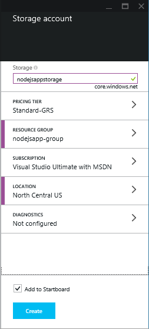
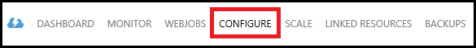
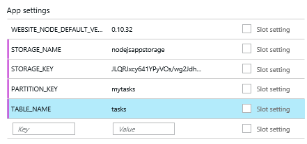

<properties
    pageTitle="Node web app usando o serviço de tabela do Azure"
    description="Esse tutorial ensina como usar o serviço de tabela do Azure para armazenar os dados de um aplicativo de Node que está hospedado no Azure aplicativo de serviço Web Apps."
    tags="azure-portal"
    services="app-service\web, storage"
    documentationCenter="nodejs"
    authors="rmcmurray"
    manager="wpickett"
    editor=""/>

<tags
    ms.service="storage"
    ms.workload="storage"
    ms.tgt_pltfrm="na"
    ms.devlang="nodejs"
    ms.topic="article"
    ms.date="08/11/2016"
    ms.author="robmcm"/>

# Node web app usando o serviço de tabela do Azure

## Visão geral

Este tutorial mostra como usar o serviço de tabela fornecido pelo gerenciamento de dados do Azure para armazenar e acessar dados de um aplicativo de [nó] hospedado nos aplicativos Web do [Serviço de aplicativo do Azure](http://go.microsoft.com/fwlink/?LinkId=529714) . Este tutorial supõe que você tenha alguma experiência anterior usando o nó e [gito].

Você aprenderá:

* Como usar npm (Gerenciador de pacote de nós) para instalar os módulos de nó

* Como trabalhar com o serviço de tabela do Azure

* Como usar a CLI do Azure para criar um aplicativo web.

Seguindo este tutorial, você criará um simples baseado na web aplicativo "lista de tarefas pendentes" que permite criar, recuperar e conclusão de tarefas. As tarefas são armazenadas no serviço de tabela.

Aqui está o aplicativo concluído:

![Uma página da web exibindo uma lista de tarefas vazia][node-table-finished]

>[AZURE.NOTE] Se você quiser começar a usar o serviço de aplicativo do Azure antes de se inscrever para uma conta do Azure, vá para [Experimentar o serviço de aplicativo](http://go.microsoft.com/fwlink/?LinkId=523751), onde você pode criar imediatamente um aplicativo da web de curta duração starter no aplicativo de serviço. Não há cartões de crédito obrigatório; Não há compromissos.

## Pré-requisitos

Antes de seguir as instruções neste artigo, certifique-se de que você tem o seguinte instalado:

* [nó] versão 0.10.24 ou superior

* [Gito]

[AZURE.INCLUDE [create-account-and-websites-note](../../includes/create-account-and-websites-note.md)]

## Criar uma conta de armazenamento

Crie uma conta de armazenamento do Azure. O aplicativo vai usar essa conta para armazenar os itens de tarefas pendentes.

1.  Log no [Portal do Azure](https://portal.azure.com/).

2. Clique no ícone de **novo** no canto inferior esquerdo do portal, clique em **dados + armazenamento** > **armazenamento**. Dê um nome exclusivo para a conta de armazenamento e criar um novo [grupo de recursos](../azure-resource-manager/resource-group-overview.md) para ela.

    

    Quando a conta de armazenamento tiver sido criada, o botão de **notificações** pisca verde **sucesso** e blade da conta armazenamento é aberto para mostrar que ele pertence para o novo grupo de recursos que você criou.

5. No blade da conta de armazenamento, clique em **configurações** > **chaves**. Copie a chave primária de acesso para a área de transferência.

    ![Tecla de acesso][portal-storage-access-keys]

##Instalar módulos e gerar estrutura

Nesta seção, você irá criar um novo aplicativo de nó e use npm para adicionar pacotes de módulo. Para este aplicativo, você usará os módulos [Express] e [Azure] . O módulo Express fornece uma estrutura de controlador de exibição de modelo para nó, enquanto os módulos Azure fornece conectividade com o serviço de tabela.

### Instalar o express e gerar estrutura

1. Na linha de comando, crie um novo diretório chamado de **lista de tarefas** e alterne para aquele diretório.  

2. Digite o seguinte comando para instalar o módulo Express.

        npm install express-generator@4.2.0 -g

    Dependendo do sistema operacional, você talvez precise colocar sudo antes do comando:

        sudo npm install express-generator@4.2.0 -g

    A saída aparece semelhante ao seguinte exemplo:

        express-generator@4.2.0 /usr/local/lib/node_modules/express-generator
        ├── mkdirp@0.3.5
        └── commander@1.3.2 (keypress@0.1.0)

    > [AZURE.NOTE] O '-g' parâmetro instala o módulo globalmente. Dessa maneira, podemos usar **express** para gerar a estrutura do aplicativo da web sem precisar digitar informações adicionais do caminho.

4. Para criar a estrutura do aplicativo, digite o comando **express** :

        express

    A saída deste comando aparece semelhante ao seguinte exemplo:

           create : .
           create : ./package.json
           create : ./app.js
           create : ./public
           create : ./public/images
           create : ./routes
           create : ./routes/index.js
           create : ./routes/users.js
           create : ./public/stylesheets
           create : ./public/stylesheets/style.css
           create : ./views
           create : ./views/index.jade
           create : ./views/layout.jade
           create : ./views/error.jade
           create : ./public/javascripts
           create : ./bin
           create : ./bin/www

           install dependencies:
             $ cd . && npm install

           run the app:
             $ DEBUG=my-application ./bin/www

    Agora, você tem vários novos diretórios e arquivos no diretório de **lista de tarefas** .

### Instalar módulos adicionais

Um dos arquivos que **express** cria é **package.json**. Este arquivo contém uma lista de dependências de módulo. Mais tarde, quando você implanta o aplicativo para o aplicativo de serviço Web Apps, esse arquivo determina quais módulos precisam estar instalados no Azure.

Na linha de comando, digite o seguinte comando para instalar os módulos descritos no arquivo **package.json** . Você pode precisar usar 'sudo'.

    npm install

A saída deste comando aparece semelhante ao seguinte exemplo:

    debug@0.7.4 node_modules\debug

    cookie-parser@1.0.1 node_modules\cookie-parser
    ├── cookie-signature@1.0.3
    └── cookie@0.1.0

    [...]

Em seguida, digite o seguinte comando para instalar os módulos do [azure], [nó uuid], [nconf] e [assíncrono] :

    npm install azure-storage node-uuid async nconf --save

O **-Salvar** sinalizador adiciona entradas para esses módulos para o arquivo de **package.json** .

A saída deste comando aparece semelhante ao seguinte exemplo:

    async@0.9.0 node_modules\async

    node-uuid@1.4.1 node_modules\node-uuid

    nconf@0.6.9 node_modules\nconf
    ├── ini@1.2.1
    ├── async@0.2.9
    └── optimist@0.6.0 (wordwrap@0.0.2, minimist@0.0.10)

    [...]

## Criar o aplicativo

Agora, podemos está prontos para criar o aplicativo.

### Criar um modelo

Um *modelo* é um objeto que representa os dados em seu aplicativo. Para o aplicativo, o modelo somente é um objeto de tarefa, que representa um item na lista de tarefas pendentes. Tarefas terá os seguintes campos:

- PartitionKey
- RowKey
- nome (cadeia)
- categoria (cadeia)
- concluído (booliano)

**PartitionKey** e **RowKey** são usados pelo serviço tabela como chaves de tabela. Para obter mais informações, consulte [Noções básicas sobre o modelo de dados do serviço de tabela](https://msdn.microsoft.com/library/azure/dd179338.aspx).

1. No diretório de **lista de tarefas** , crie um novo diretório chamado **modelos**.

2. No diretório de **modelos** , crie um novo arquivo chamado **task.js**. Esse arquivo irá conter o modelo para as tarefas criadas pelo seu aplicativo.

3. No início do arquivo **task.js** , adicione o seguinte código para fazer referência a bibliotecas necessárias:

        var azure = require('azure-storage');
        var uuid = require('node-uuid');
        var entityGen = azure.TableUtilities.entityGenerator;

4. Adicione o seguinte código para definir e exporte o objeto de tarefa. Esse objeto é responsável por conectar-se à tabela.

        module.exports = Task;

        function Task(storageClient, tableName, partitionKey) {
          this.storageClient = storageClient;
          this.tableName = tableName;
          this.partitionKey = partitionKey;
          this.storageClient.createTableIfNotExists(tableName, function tableCreated(error) {
            if(error) {
              throw error;
            }
          });
        };

5. Adicione o seguinte código para definir métodos adicionais no objeto de tarefa, que permitem interações com dados armazenados na tabela:

        Task.prototype = {
          find: function(query, callback) {
            self = this;
            self.storageClient.queryEntities(this.tableName, query, null, function entitiesQueried(error, result) {
              if(error) {
                callback(error);
              } else {
                callback(null, result.entries);
              }
            });
          },

          addItem: function(item, callback) {
            self = this;
            // use entityGenerator to set types
            // NOTE: RowKey must be a string type, even though
            // it contains a GUID in this example.
            var itemDescriptor = {
              PartitionKey: entityGen.String(self.partitionKey),
              RowKey: entityGen.String(uuid()),
              name: entityGen.String(item.name),
              category: entityGen.String(item.category),
              completed: entityGen.Boolean(false)
            };
            self.storageClient.insertEntity(self.tableName, itemDescriptor, function entityInserted(error) {
              if(error){  
                callback(error);
              }
              callback(null);
            });
          },

          updateItem: function(rKey, callback) {
            self = this;
            self.storageClient.retrieveEntity(self.tableName, self.partitionKey, rKey, function entityQueried(error, entity) {
              if(error) {
                callback(error);
              }
              entity.completed._ = true;
              self.storageClient.updateEntity(self.tableName, entity, function entityUpdated(error) {
                if(error) {
                  callback(error);
                }
                callback(null);
              });
            });
          }
        }

6. Salve e feche o arquivo **task.js** .

### Criar um controlador

Um *controlador* manipula solicitações HTTP e renderiza a resposta HTML.

1. No diretório de **lista de tarefas/rotas** , crie um novo arquivo chamado **tasklist.js** e abri-lo em um editor de texto.

2. Adicione o seguinte código para **tasklist.js**. Isso carrega os módulos do azure e assíncrono, que são usados pelo **tasklist.js**. Isso também define a função de **lista de tarefas** , que é passada uma instância do objeto de **tarefa** que definimos anteriormente:

        var azure = require('azure-storage');
        var async = require('async');

        module.exports = TaskList;

3. Defina um objeto de **lista de tarefas** .

        function TaskList(task) {
          this.task = task;
        }

4. Adicione os seguintes métodos para **lista de tarefas**:

        TaskList.prototype = {
          showTasks: function(req, res) {
            self = this;
            var query = new azure.TableQuery()
              .where('completed eq ?', false);
            self.task.find(query, function itemsFound(error, items) {
              res.render('index',{title: 'My ToDo List ', tasks: items});
            });
          },

          addTask: function(req,res) {
            var self = this;
            var item = req.body.item;
            self.task.addItem(item, function itemAdded(error) {
              if(error) {
                throw error;
              }
              res.redirect('/');
            });
          },

          completeTask: function(req,res) {
            var self = this;
            var completedTasks = Object.keys(req.body);
            async.forEach(completedTasks, function taskIterator(completedTask, callback) {
              self.task.updateItem(completedTask, function itemsUpdated(error) {
                if(error){
                  callback(error);
                } else {
                  callback(null);
                }
              });
            }, function goHome(error){
              if(error) {
                throw error;
              } else {
               res.redirect('/');
              }
            });
          }
        }

### Modificar app.js

1. Do diretório **lista de tarefas** , abra o arquivo **app.js** . Este arquivo foi criado anteriormente executando o comando **express** .

2. No início do arquivo, adicione o seguinte para carregar o módulo azure, defina o nome de tabela, a chave de partição e definir as credenciais de armazenamento usadas por este exemplo:

        var azure = require('azure-storage');
        var nconf = require('nconf');
        nconf.env()
             .file({ file: 'config.json', search: true });
        var tableName = nconf.get("TABLE_NAME");
        var partitionKey = nconf.get("PARTITION_KEY");
        var accountName = nconf.get("STORAGE_NAME");
        var accountKey = nconf.get("STORAGE_KEY");

    > [AZURE.NOTE] nconf carregará os valores de configuração de variáveis de ambiente ou o arquivo **config.json** , que vamos criar mais tarde.

3. No arquivo app.js, role para baixo até o local onde você pode ver a seguinte linha:

        app.use('/', routes);
        app.use('/users', users);

    Substitua as linhas acima com o código mostrado abaixo. Isto irá inicializar uma instância de <strong>tarefa</strong> com uma conexão à sua conta de armazenamento. Isso é passado para a <strong>lista de tarefas</strong>, que usá-lo a se comunicar com o serviço de tabela:

        var TaskList = require('./routes/tasklist');
        var Task = require('./models/task');
        var task = new Task(azure.createTableService(accountName, accountKey), tableName, partitionKey);
        var taskList = new TaskList(task);

        app.get('/', taskList.showTasks.bind(taskList));
        app.post('/addtask', taskList.addTask.bind(taskList));
        app.post('/completetask', taskList.completeTask.bind(taskList));

4. Salve o arquivo de **app.js** .

### Modificar a exibição de índice

1. Abra o arquivo **tasklist/views/index.jade** em um editor de texto.

2. Substitua todo o conteúdo do arquivo com o seguinte código. Isso define um modo de exibição que exibe tarefas existentes e inclui um formulário para adicionar novas tarefas e marcação existentes como concluída.

        extends layout

        block content
          h1= title
          br

          form(action="/completetask", method="post")
            table.table.table-striped.table-bordered
              tr
                td Name
                td Category
                td Date
                td Complete
              if (typeof tasks === "undefined")
                tr
                  td
              else
                each task in tasks
                  tr
                    td #{task.name._}
                    td #{task.category._}
                    - var day   = task.Timestamp._.getDate();
                    - var month = task.Timestamp._.getMonth() + 1;
                    - var year  = task.Timestamp._.getFullYear();
                    td #{month + "/" + day + "/" + year}
                    td
                      input(type="checkbox", name="#{task.RowKey._}", value="#{!task.completed._}", checked=task.completed._)
            button.btn(type="submit") Update tasks
          hr
          form.well(action="/addtask", method="post")
            label Item Name:
            input(name="item[name]", type="textbox")
            label Item Category:
            input(name="item[category]", type="textbox")
            br
            button.btn(type="submit") Add item

3. Salve e feche o arquivo **Jade** .

### Modifique o layout global

O arquivo de **layout.jade** no diretório de **modos de exibição** é um modelo global para outros arquivos de **.jade** . Nesta etapa, você irá modificá-lo para usar a [Inicialização Twitter](https://github.com/twbs/bootstrap), que é um kit de ferramentas que torna mais fácil criar um aplicativo web aparência interessante.

Baixar e extrair os arquivos para [Inicialização Twitter](http://getbootstrap.com/). Copie o arquivo de **bootstrap.min.css** da pasta de inicialização **css** no diretório **público/folhas de estilo** do seu aplicativo.

Na pasta **modos de exibição** , abra **layout.jade** e substitua todo o conteúdo com o seguinte:

    doctype html
    html
      head
        title= title
        link(rel='stylesheet', href='/stylesheets/bootstrap.min.css')
        link(rel='stylesheet', href='/stylesheets/style.css')
      body.app
        nav.navbar.navbar-default
          div.navbar-header
          a.navbar-brand(href='/') My Tasks
        block content

### Criar um arquivo de configuração

Para executar o aplicativo localmente, colocaremos credenciais de armazenamento do Azure para um arquivo de configuração. Crie um arquivo denominado * *config.json* *com o JSON a seguir:

    {
        "STORAGE_NAME": "<storage account name>",
        "STORAGE_KEY": "<storage access key>",
        "PARTITION_KEY": "mytasks",
        "TABLE_NAME": "tasks"
    }

Substitua o **nome da conta de armazenamento** com o nome da conta de armazenamento que você criou anteriormente e **tecla de acesso de armazenamento** com a chave primária de acesso para sua conta de armazenamento. Por exemplo:

    {
        "STORAGE_NAME": "nodejsappstorage",
        "STORAGE_KEY": "KG0oDd..."
        "PARTITION_KEY": "mytasks",
        "TABLE_NAME": "tasks"
    }

Salve este arquivo *um nível de diretório acima* que o diretório de **lista de tarefas** , assim:

    parent/
      |-- config.json
      |-- tasklist/

O motivo para isso é para evitar a verificação de arquivo de configuração no controle de origem, onde pode se tornar público. Quando podemos implantar o aplicativo do Azure, usaremos variáveis de ambiente em vez de um arquivo de configuração.

## Executar o aplicativo localmente

Para testar o aplicativo no computador local, execute as seguintes etapas:

1. Na linha de comando, altere diretórios para o diretório de **lista de tarefas** .

2. Use o seguinte comando para iniciar o aplicativo localmente:

        npm start

3. Abra um navegador da web e navegue até http://127.0.0.1:3000.

    Uma página da web semelhante ao seguinte exemplo é exibida.

    ![Uma página da Web que exibe uma lista de tarefas vazia][node-table-finished]

4. Para criar um novo item de tarefa pendente, insira um nome e uma categoria e clique em **Adicionar Item**. 

6. Para marcar uma tarefa como concluída, marque **concluída** e clique em **Atualizar tarefas**.

    ![Uma imagem do novo item na lista de tarefas][node-table-list-items]

Mesmo que o aplicativo é executado localmente, ele é armazenar os dados no serviço de tabela do Azure.

## Implantar seu aplicativo do Azure

As etapas desta seção usam as ferramentas de linha de comando Azure para criar um novo aplicativo web no aplicativo de serviço e usam gito para implantar seu aplicativo. Para executar essas etapas, você deve ter uma assinatura do Azure.

> [AZURE.NOTE] Essas etapas também podem ser executadas usando o [Portal do Azure](https://portal.azure.com/). Consulte [criar e implantar um aplicativo de web Node no serviço de aplicativo do Azure].
>
> Se esse for o primeiro web app que você criou, você deve usar o Portal do Azure para implantar esse aplicativo.

Para começar, instale o [Azure CLI] digitando o seguinte comando na linha de comando:

    npm install azure-cli -g

### Importar configurações de publicação

Nesta etapa, você irá baixar um arquivo que contém informações sobre a sua assinatura.

1. Digite o seguinte comando:

        azure account download

    Este comando inicia um navegador e navega para a página de download. Se solicitado, faça logon com a conta associada a sua assinatura do Azure.

    <!-- ![The download page][download-publishing-settings] -->

    O download do arquivo começa automaticamente; Se não estiver, você pode clicar no link no início da página para baixar manualmente o arquivo. Salve o arquivo e anote o caminho do arquivo.

2. Digite o seguinte comando para importar as configurações:

        azure account import <path-to-file>

    Especifique o caminho e o nome do arquivo de configurações de publicação que você baixou na etapa anterior.

3. Depois que as configurações serão importadas, exclua o arquivo de configurações de publicação. Ele não é mais necessária e contém informações confidenciais sobre sua assinatura do Azure.

### Criar um aplicativo de serviço web app

1. Na linha de comando, altere diretórios para o diretório de **lista de tarefas** .

2. Use o seguinte comando para criar um novo aplicativo web.

        azure site create --git

    Você será solicitado para o nome do aplicativo da web e o local. Forneça um nome exclusivo e selecione a localização geográfica mesma como sua conta de armazenamento do Azure.

    O `--git` parâmetro cria um repositório gito no Azure para este aplicativo web. Ele também inicializa um repositório gito no diretório atual se nenhum existe e adiciona um [gito remoto] chamado 'azure', que é usado para publicar o aplicativo no Azure. Finalmente, ele cria um arquivo **Web. config** , que contém configurações usadas pelo Azure para aplicativos de nó de host. Se você omitir o `--git` parâmetro, mas o diretório contém um repositório de gito, o comando ainda irá criar o azure remoto.

    Após este comando ter sido concluído, você verá a saída semelhante à seguinte. Observe que a linha que começa com o **site criado no** contém a URL para o aplicativo web.

        info:   Executing command site create
        help:   Need a site name
        Name: TableTasklist
        info:   Using location southcentraluswebspace
        info:   Executing `git init`
        info:   Creating default .gitignore file
        info:   Creating a new web site
        info:   Created web site at  tabletasklist.azurewebsites.net
        info:   Initializing repository
        info:   Repository initialized
        info:   Executing `git remote add azure https://username@tabletasklist.azurewebsites.net/TableTasklist.git`
        info:   site create command OK

    > [AZURE.NOTE] Se esse for o primeiro serviço de aplicativo web app para sua assinatura, você será instruído para usar o Portal do Azure para criar o aplicativo web. Para obter mais informações, consulte [criar e implantar um aplicativo de web Node no serviço de aplicativo do Azure].

### Definir variáveis de ambiente

Nesta etapa, você irá adicionar variáveis de ambiente para sua configuração de aplicativo da web no Azure.
Na linha de comando, digite o seguinte:

    azure site appsetting add
        STORAGE_NAME=<storage account name>;STORAGE_KEY=<storage access key>;PARTITION_KEY=mytasks;TABLE_NAME=tasks

Substituir **<storage account name>** com o nome do armazenamento de conta que você criou anteriormente e substituir **<storage access key>** com a chave primária de acesso para sua conta de armazenamento. (Use os mesmos valores que o arquivo de config.json que você criou anteriormente.)

Como alternativa, você pode definir variáveis de ambiente no [Portal do Azure](https://portal.azure.com/):

1.  Abra o blade do aplicativo da web clicando em **Procurar** > **Web Apps** > seu nome de aplicativo web.

1.  Na lâmina do web app, clique em **Todas as configurações** > **Configurações do aplicativo**.

    <!--  -->

1.  Role para baixo até a seção **configurações de aplicativo** e adicione os pares chave/valor.

    

1. Clique em **Salvar**.

### Publicar o aplicativo

Para publicar o aplicativo, confirmar os arquivos de código gito e, em seguida, enviar azure/mestre.

1. Defina suas credenciais de implantação.

        azure site deployment user set <name> <password>

2. Adicionar e confirmar seus arquivos de aplicativo.

        git add .
        git commit -m "adding files"

3. A confirmação de envio para o serviço de aplicativo web app:

        git push azure master

    Use **mestre** como a ramificação de destino. No final da implantação, você verá uma instrução semelhante ao seguinte exemplo:

        To https://username@tabletasklist.azurewebsites.net/TableTasklist.git
         * [new branch]      master -> master

4. Após concluir a operação de envio, navegue até a URL do aplicativo web anteriormente retornada pela `azure create site` comando para exibir o seu aplicativo.

## Próximas etapas

Enquanto as etapas neste artigo descrevem usando o serviço de tabela para armazenar informações, você também pode usar [MongoDB](https://mlab.com/azure/). 

## Recursos adicionais

[CLI Azure]

## O que mudou
* Para um guia para a alteração de sites para o serviço de aplicativo consulte: [o serviço de aplicativo do Azure e seu impacto sobre serviços existentes do Azure](http://go.microsoft.com/fwlink/?LinkId=529714)

<!-- URLs -->

[Criar e implantar um aplicativo de web Node no serviço de aplicativo do Azure]: web-sites-nodejs-develop-deploy-mac.md
[Azure Developer Center]: /develop/nodejs/

[nó]: http://nodejs.org
[Gito]: http://git-scm.com
[Express]: http://expressjs.com
[for free]: http://windowsazure.com
[Gito remoto]: http://git-scm.com/docs/git-remote

[CLI Azure]: ../xplat-cli-install.md

[Azure]: https://github.com/Azure/azure-sdk-for-node
[nó uuid]: https://www.npmjs.com/package/node-uuid
[nconf]: https://www.npmjs.com/package/nconf
[assíncrono]: https://www.npmjs.com/package/async

[Azure Portal]: https://portal.azure.com

[Create and deploy a Node.js application to an Azure Web Site]: web-sites-nodejs-develop-deploy-mac.md
 
<!-- Image References -->

[node-table-finished]: ./media/storage-nodejs-use-table-storage-web-site/table_todo_empty.png
[node-table-list-items]: ./media/storage-nodejs-use-table-storage-web-site/table_todo_list.png
[download-publishing-settings]: ./media/storage-nodejs-use-table-storage-web-site/azure-account-download-cli.png
[portal-new]: ./media/storage-nodejs-use-table-storage-web-site/plus-new.png
[portal-storage-account]: ./media/storage-nodejs-use-table-storage-web-site/new-storage.png
[portal-quick-create-storage]: ./media/storage-nodejs-use-table-storage-web-site/quick-storage.png
[portal-storage-access-keys]: ./media/storage-nodejs-use-table-storage-web-site/manage-access-keys.png
[go-to-dashboard]: ./media/storage-nodejs-use-table-storage-web-site/go_to_dashboard.png
[web-configure]: ./media/storage-nodejs-use-table-storage-web-site/sql-task-configure.png
[app-settings-save]: ./media/storage-nodejs-use-table-storage-web-site/savebutton.png
[app-settings]: ./media/storage-nodejs-use-table-storage-web-site/storage-tasks-appsettings.png
