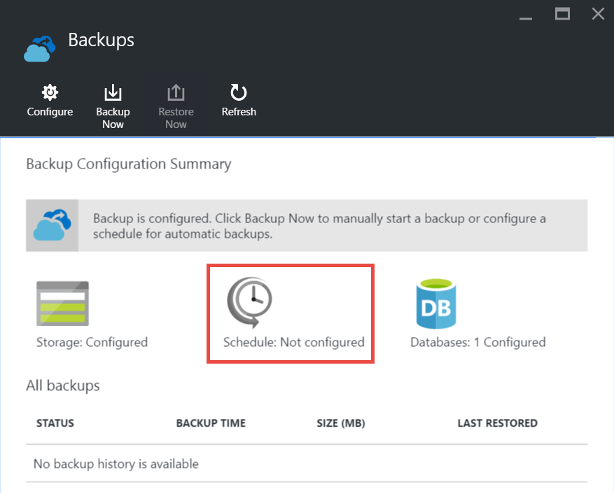

<properties 
    pageTitle="Fazer backup de seu aplicativo no Azure" 
    description="Aprenda a criar backups de seus aplicativos em um serviço de aplicativo do Azure." 
    services="app-service" 
    documentationCenter="" 
    authors="cephalin" 
    manager="wpickett" 
    editor="jimbe"/>

<tags 
    ms.service="app-service" 
    ms.workload="na" 
    ms.tgt_pltfrm="na" 
    ms.devlang="na" 
    ms.topic="article" 
    ms.date="07/06/2016" 
    ms.author="cephalin"/>

# Fazer backup de seu aplicativo no Azure

O recurso de Backup e restauração do [Serviço de aplicativo do Azure](../app-service/app-service-value-prop-what-is.md) permite que você crie facilmente backups de aplicativo manual ou automaticamente. Você pode restaurar seu aplicativo para um estado anterior ou criar um novo aplicativo baseado em um dos backups do seu aplicativo original. 

Para obter informações sobre a restauração de um aplicativo de backup, consulte [restaurar um aplicativo no Azure](web-sites-restore.md).

## O que foi feito backup 
Serviço de aplicativo pode fazer as seguintes informações:

* Configuração de aplicativo
* Conteúdo do arquivo
* Qualquer bancos de dados do Azure SQL ou bancos de dados do Azure MySQL (ClearDB) conectados ao seu aplicativo (você pode escolher quais deseja incluir no backup)

Essas informações são feitas backup à conta de armazenamento do Azure e recipiente que você especificar. 

> [AZURE.NOTE] Cada backup é uma cópia offline completa do seu aplicativo, não uma atualização incremental.

## Requisitos e restrições

* O recurso de Backup e restauração requer o plano de serviço de aplicativo seja no nível **padrão** ou superior. Para obter mais informações sobre o dimensionamento de seu plano de serviço de aplicativo para usar um nível superior, consulte [Dimensionar um aplicativo no Azure](web-sites-scale.md). Observe que o nível de **Premium** permite um número maior de backups diários que nível **padrão** .
* Você precisa de uma conta de armazenamento do Azure e o contêiner na mesma assinatura como o aplicativo que você deseja fazer backup. Para obter mais informações sobre contas de armazenamento do Azure, consulte os [links](#moreaboutstorage) no final deste artigo.
* Backups podem ser até 10GB de conteúdo de aplicativo e banco de dados. Se o tamanho do backup exceder esse limite, você receberá um erro. 

## Criar um backup manual

2. No [Portal do Azure](https://portal.azure.com), navegue até blade do seu aplicativo, selecione **configurações**e, em seguida, **Backups**. A lâmina de **Backups** será exibida.
    
    ![Página de backups][ChooseBackupsPage]

    >[AZURE.NOTE]Se você vir a mensagem abaixo, clique em para atualizar seu plano de serviço de aplicativo antes de continuar com backups.
Para obter mais informações, consulte [Dimensionar um aplicativo no Azure](web-sites-scale.md) .  
    >

3. Na lâmina **Backups** , clique em **armazenamento: não configurado** para configurar uma conta de armazenamento.

    ![Escolher conta de armazenamento][ChooseStorageAccount]
    
4. Escolha o destino do backup selecionando uma **Conta de armazenamento** e o **contêiner**. A conta de armazenamento deve pertencer a mesma assinatura como o aplicativo que você deseja fazer backup. Se desejar, você pode criar uma nova conta de armazenamento ou um novo recipiente nas respectivas lâminas. Quando terminar, clique em **Selecionar**.
    
    
    
5. Na lâmina **Configurar definições de Backup** que ainda resta aberta, clique em **Configurações de banco de dados**, em seguida, selecione os bancos de dados que você deseja incluir nos backups (banco de dados SQL ou MySQL), clique **Okey**.  

    

    > [AZURE.NOTE]  Para um banco de dados aparecem nesta lista, sua cadeia de caracteres de conexão deve existir na seção de **cadeias de caracteres de Conexão** da lâmina **configurações do aplicativo** para o aplicativo.

6. Na lâmina **Configurar definições de Backup** , clique em **Salvar**.  

7. Na barra de comandos da lâmina **Backups** , clique em **Fazer Backup agora**.
    
    ![Botão de BackUpNow][BackUpNow]
    
    Você verá uma mensagem de progresso durante o processo de backup.

Depois que você configurou uma conta de armazenamento e o contêiner de backups, você pode fazer com que um manual de backup a qualquer momento.  

## Configurar backups automáticos

1. Na lâmina **Backups** , clique em **cronograma: não configurado**. 

    
    
1. Na lâmina **Configurações de agendamento de Backup** , defina **Backup agendado** para **em**, e em seguida, configurar o agendamento de backup conforme desejado e clique em **Okey**.
    
    ![Habilitar backups automatizados][SetAutomatedBackupOn]
    
4. Na lâmina **Configurar definições de Backup** que ainda resta aberta, clique em **Configurações de armazenamento**, escolha o destino do backup, selecionando uma **Conta de armazenamento** e o **contêiner**. A conta de armazenamento deve pertencer a mesma assinatura como o aplicativo que você deseja fazer backup. Se desejar, você pode criar uma nova conta de armazenamento ou um novo recipiente nas respectivas lâminas. Quando terminar, clique em **Selecionar**.
    
    
    
5. Na lâmina **Configurar definições de Backup** , clique em **Configurações de banco de dados**, em seguida, selecione os bancos de dados que você deseja incluir nos backups (banco de dados SQL ou MySQL), clique **Okey**.  

    

    > [AZURE.NOTE]  Para um banco de dados aparecem nesta lista, sua cadeia de caracteres de conexão deve existir na seção de **cadeias de caracteres de Conexão** da lâmina **configurações do aplicativo** para o aplicativo.

6. Na lâmina **Configurar definições de Backup** , clique em **Salvar**.  

## Backup apenas uma parte do aplicativo

Às vezes, você não quiser fazer backup de tudo em seu aplicativo. Aqui estão alguns exemplos:

-   Você [configurar backups semanais](web-sites-backup.md#configure-automated-backups) de seu aplicativo que contenha conteúdo estático que nunca é alterado, como postagens de blog antigo ou imagens.
-   Seu aplicativo tem mais de 10GB de conteúdo (que é o valor máximo que você pode fazer backup de cada vez).
-   Você não deseja fazer backup dos arquivos de log.

Backups parciais permitem que você escolha exatamente quais arquivos que você deseja fazer backup.

### Excluir arquivos de backup

Para excluir arquivos e pastas de backups, crie um `_backup.filter` arquivo na pasta D:\home\site\wwwroot do seu aplicativo e especifique a lista de arquivos e pastas que você deseja excluir lá. Uma maneira fácil de acessar esse é por meio do [Console de Kudu](https://github.com/projectkudu/kudu/wiki/Kudu-console). 

Suponha que você tenha um aplicativo que contém os arquivos de log e imagens estáticas de anos anteriores que nunca serão alterar. Você já tem um backup completo do aplicativo que inclui as imagens antigas. Agora você deseja fazer backup do aplicativo diariamente, mas você não deseja pagar para armazenar arquivos de log ou os arquivos de imagem estática que nunca mudam.

![Pasta dos logs][LogsFolder]
![imagens de pasta][ImagesFolder]
    
As etapas a seguir mostram como você faria excluir esses arquivos do backup.

1. Vá para `http://{yourapp}.scm.azurewebsites.net/DebugConsole` e identificar as pastas que você deseja excluir dos seus backups. Neste exemplo, que você deseja excluir os seguintes arquivos e pastas mostradas na interface de usuário que:

        D:\home\site\wwwroot\Logs
        D:\home\LogFiles
        D:\home\site\wwwroot\Images\2013
        D:\home\site\wwwroot\Images\2014
        D:\home\site\wwwroot\Images\brand.png

    [AZURE.NOTE] A última linha mostra que você pode excluir arquivos de indivíduos, bem como pastas.

2. Criar um arquivo chamado `_backup.filter` e colocar a lista acima no arquivo, mas remover `D:\home`. Lista de um diretório ou o arquivo por linha. Para que o conteúdo do arquivo deve ser:

    \site\wwwroot\Logs \LogFiles \site\wwwroot\Images\2013 \site\wwwroot\Images\2014 \site\wwwroot\Images\brand.PNG

3. Carregar o arquivo para o `D:\home\site\wwwroot\` diretório de seu site usando [ftp](web-sites-deploy.md#ftp) ou qualquer outro método. Se desejar, você pode criar o arquivo diretamente no `http://{yourapp}.scm.azurewebsites.net/DebugConsole` e insira o seu conteúdo.

4. Execute os backups da mesma maneira que você faria normalmente, [manualmente](#create-a-manual-backup) ou [automaticamente](#configure-automated-backups).

Agora, os arquivos e pastas que são especificadas no `_backup.filter` serão excluídos do backup. Neste exemplo, os arquivos de log e os arquivos de imagem 2013 e 2014 serão não é mais feitos backup, bem como brand.png.

>[AZURE.NOTE] Você restaurar backups parciais do seu site da mesma forma que faria [restaurar um backup regular](web-sites-restore.md). O processo de restauração fará a coisa certa.
>
>Quando um backup completo for restaurado, todo o conteúdo do site é substituído por tudo o que está no backup. Se um arquivo estiver no site, mas não no backup é excluído. Mas quando um backup parcial é restaurado, qualquer conteúdo que está localizado em um dos diretórios lista negra ou qualquer arquivo na lista negra, é deixado como ela está.

## Como os backups são armazenados

Depois de fazer um ou mais backups para o aplicativo, os backups ficará visíveis na lâmina **contêineres** de sua conta de armazenamento, bem como seu aplicativo. Na conta de armazenamento, cada backup consiste em um arquivo. zip que contém os dados de backup e um arquivo. XML que contém um manifesto do conteúdo do arquivo. zip. Você pode descompactar e procurar esses arquivos se quiser acessar seus backups sem realmente executar uma restauração de aplicativo.

O backup do banco de dados para o aplicativo é armazenado na raiz do arquivo. zip. Para um banco de dados do SQL, esse é um arquivo BACPAC (sem extensão de arquivo) e pode ser importado. Para criar um novo banco de dados SQL com base na exportação BACPAC, consulte [Importar um arquivo de BACPAC para criar um novo banco de dados do usuário](http://technet.microsoft.com/library/hh710052.aspx).

> [AZURE.WARNING] Alterar qualquer um dos arquivos em seu contêiner **websitebackups** pode causar o backup se tornar inválido e, portanto, não são restauráveis.

## Próximas etapas
Para obter informações sobre a restauração de um aplicativo de um backup, consulte [restaurar um aplicativo no Azure](web-sites-restore.md). Você pode também fazer backup e restaurar aplicativos de serviço de aplicativo usando a API REST (consulte [Restante de uso para fazer backup e restaurar aplicativos de serviço de aplicativo](websites-csm-backup.md)).

>[AZURE.NOTE] Se você quiser começar a usar o serviço de aplicativo do Azure antes de se inscrever para uma conta do Azure, vá para [Experimentar o serviço de aplicativo](http://go.microsoft.com/fwlink/?LinkId=523751), onde você pode criar imediatamente um aplicativo da web de curta duração starter no aplicativo de serviço. Não há cartões de crédito obrigatório; Não há compromissos.

<!-- IMAGES -->
[ChooseBackupsPage]: ./media/web-sites-backup/01ChooseBackupsPage.png
[ChooseStorageAccount]: ./media/web-sites-backup/02ChooseStorageAccount.png
[IncludedDatabases]: ./media/web-sites-backup/03IncludedDatabases.png
[BackUpNow]: ./media/web-sites-backup/04BackUpNow.png
[BackupProgress]: ./media/web-sites-backup/05BackupProgress.png
[SetAutomatedBackupOn]: ./media/web-sites-backup/06SetAutomatedBackupOn.png
[Frequency]: ./media/web-sites-backup/07Frequency.png
[StartDate]: ./media/web-sites-backup/08StartDate.png
[StartTime]: ./media/web-sites-backup/09StartTime.png
[SaveIcon]: ./media/web-sites-backup/10SaveIcon.png
[ImagesFolder]: ./media/web-sites-backup/11Images.png
[LogsFolder]: ./media/web-sites-backup/12Logs.png
[GhostUpgradeWarning]: ./media/web-sites-backup/13GhostUpgradeWarning.png
 
