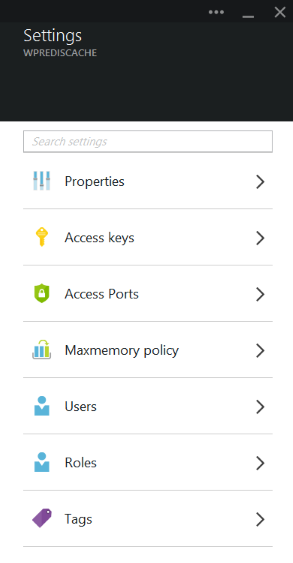
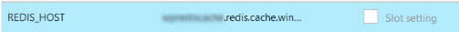
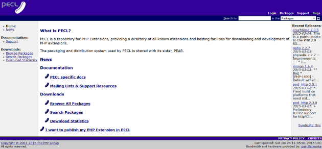
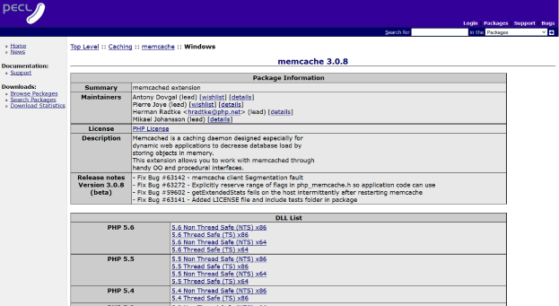
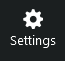

<properties
    pageTitle="Conectar um aplicativo web no serviço de aplicativo do Azure relacionada cache através do protocolo Memcache | Microsoft Azure"
    description="Conectar um aplicativo web no serviço de aplicativo do Azure usando o protocolo de Memcache de cache relacionada"
    services="app-service\web"
    documentationCenter="php"
    authors="SyntaxC4"
    manager="wpickett"
    editor="riande"/>

<tags
    ms.service="app-service-web"
    ms.devlang="php"
    ms.topic="get-started-article"
    ms.tgt_pltfrm="windows"
    ms.workload="na"
    ms.date="02/29/2016"
    ms.author="cfowler"/>

# <a name="connect-a-web-app-in-azure-app-service-to-redis-cache-via-the-memcache-protocol"></a>Conectar um aplicativo web no serviço de aplicativo do Azure relacionada cache através do protocolo Memcache

Neste artigo, você vai aprender como conectar um aplicativo da web de WordPress no [Serviço de aplicativo do Azure](http://go.microsoft.com/fwlink/?LinkId=529714) ao [Azure relacionada Cache] [ 12] usando o [Memcache] [ 13] protocolo. Se você tiver um aplicativo web existente que usa um servidor de Memcached para armazenamento em cache na memória, você pode migrá-lo para o serviço de aplicativo do Azure e usar a solução de cache primários no Microsoft Azure com pouca ou nenhuma alteração ao seu código de aplicativo. Além disso, você pode usar seu Memcache existente especialização criar altamente escaláveis, distribuídos aplicativos em um serviço de aplicativo do Azure com Azure relacionada Cache para cache na memória, enquanto estiver usando estruturas de aplicativo populares como .NET, PHP, Node, Java e Python.  

Serviço de aplicativo Web Apps habilita esse cenário de aplicativo com a correção Memcache de aplicativos Web, que é um servidor local do Memcached que atua como um proxy de Memcache para armazenamento em cache chamadas para o Cache do Azure relacionada. Isso permite que qualquer aplicativo que se comunica usando o protocolo de Memcache de cache de dados com Cache relacionada. Essa correção Memcache funciona no nível do protocolo, para que possa ser usado por qualquer aplicativo ou a estrutura do aplicativo desde que ele se comunica usando o protocolo de Memcache.

[AZURE.INCLUDE [app-service-web-to-api-and-mobile](../../includes/app-service-web-to-api-and-mobile.md)] 

## <a name="prerequisites"></a>Pré-requisitos

A correção de Memcache de aplicativos Web pode ser usada com qualquer aplicativo desde que ele se comunica usando o protocolo de Memcache. Para este exemplo específico, o aplicativo de referência é um site de WordPress Scalable que pode ser provisionado do Azure Marketplace.

Siga as etapas descritas neste artigo:

* [Provisionar uma instância do serviço de Cache do Azure relacionada][0]
* [Implantar um site de WordPress Scalable no Azure][1]

Uma vez que o site de WordPress Scalable implantado e uma instância de Cache relacionada provisionado, você estará pronto para prosseguir com habilitando a correção Memcache no Azure aplicativo de serviço Web Apps.

## <a name="enable-the-web-apps-memcache-shim"></a>Habilitar a correção Memcache de aplicativos Web

Para configurar a correção de Memcache, você deve criar três configurações de aplicativo. Isso pode ser feito usando vários métodos, incluindo o [Portal do Azure](http://go.microsoft.com/fwlink/?LinkId=529715), o [portal clássico][3], os [Cmdlets do PowerShell do Azure] [ 5] ou a [Interface de linha de comando do Azure][5]. Para os fins esta postagem, vou usar o [Portal do Azure] [ 4] para definir as configurações de aplicativo. Os valores a seguir podem ser recuperados da lâmina de **configurações** da sua instância de Cache relacionada.



### <a name="add-redishost-app-setting"></a>Adicionar configuração de aplicativo REDIS_HOST

A primeira configuração do aplicativo que você precisa criar é o **relacionada\_HOST** configuração do aplicativo. Esta configuração define o destino ao qual a correção encaminha as informações de cache. O valor necessário para a configuração de aplicativo REDIS_HOST pode ser recuperado da lâmina **Propriedades** da sua instância de Cache relacionada.


Definir a chave da configuração do aplicativo para **relacionada\_HOST** e o valor da configuração do aplicativo para o **nome do host** da instância do Cache relacionada.



### <a name="add-rediskey-app-setting"></a>Adicionar configuração de aplicativo REDIS_KEY

A segunda configuração de aplicativo que você precisa criar é o **relacionada\_chave** configuração do aplicativo. Esta configuração fornece que o token de autenticação necessária para acesso seguro a instância de Cache relacionada. Você pode recuperar o valor necessário para a configuração de aplicativo REDIS_KEY da lâmina **teclas de acesso** da instância do Cache relacionada.


Definir a chave da configuração do aplicativo para **relacionada\_chave** e o valor da configuração do aplicativo para a **Chave primária** da instância do Cache relacionada.


### <a name="add-memcacheshimredisenable-app-setting"></a>Adicionar configuração de aplicativo MEMCACHESHIM_REDIS_ENABLE

A última configuração de aplicativo é usada para habilitar a correção Memcache nos aplicativos Web, que usa a REDIS_HOST e REDIS_KEY para se conectar ao Azure relacionada Cache e encaminhar o cache de chamadas. Definir a chave da configuração do aplicativo para **MEMCACHESHIM\_relacionada\_habilitar** e o valor para **true**.


Depois que terminar de adicionar as configurações de aplicativo três (3), clique em **Salvar**.

## <a name="enable-memcache-extension-for-php"></a>Habilitar a extensão de Memcache para PHP

Em ordem para o aplicativo falar o protocolo Memcache, é necessário instalar a extensão Memcache ao PHP – a estrutura de idioma para seu site de WordPress.

### <a name="download-the-phpmemcache-extension"></a>Baixe o php_memcache extensão

Navegue até [PECL][6]. Em categoria de cache, clique em [memcache][7]. Na coluna de downloads, clique no link DLL.



Baixe o link de Thread não seguros (NTS) x86 para a versão do PHP habilitado nos aplicativos Web. (O padrão é 5.4 PHP)



### <a name="enable-the-phpmemcache-extension"></a>Habilitar a extensão de php_memcache

Depois de baixar o arquivo, descompacte e carregue o **php\_memcache.dll** para o **d:\\inicial\\site\\wwwroot\\bin\\ext\\ ** diretório. Após a php_memcache.dll é carregado para o aplicativo web, você precisa habilitar a extensão no tempo de execução do PHP. Para habilitar a extensão de Memcache no Portal do Azure, abra a lâmina de **Configurações do aplicativo** para o aplicativo da web, em seguida, adicionar uma nova configuração de aplicativo com a chave do **PHP\_extensões** e o valor **bin\\ext\\php_memcache.dll**.


> [AZURE.NOTE] Se o aplicativo web precisa carregar várias extensões PHP, o valor de PHP_EXTENSIONS deve ter uma lista delimitada por vírgulas de caminhos relativos aos arquivos de DLL.


Quando terminar, clique em **Salvar**.

## <a name="install-memcache-wordpress-plugin"></a>Instalar o plug-in Memcache WordPress

> [AZURE.NOTE] Você também pode baixar o [Plug-in de Cache de objeto Memcached](https://wordpress.org/plugins/memcached/) de WordPress.org.

Na página de plug-ins do WordPress, clique em **Adicionar novo**.


Na caixa de pesquisa, digite **memcached** e pressione **Enter**.


Encontre o **Cache de objeto Memcached** na lista e, em seguida, clique em **Instalar agora**.


### <a name="enable-the-memcache-wordpress-plugin"></a>Habilitar o plug-in Memcache WordPress

>[AZURE.NOTE] Siga as instruções neste blog sobre [como habilitar uma extensão de Site nos aplicativos Web] [ 8] para instalar o Visual Studio Team Services.

No `wp-config.php` arquivo, adicione o seguinte código acima da interrupção Editar comentário próximo ao final do arquivo.

```php
$memcached_servers = array(
    'default' => array('localhost:' . getenv("MEMCACHESHIM_PORT"))
);
```

Depois que este código foi colado, Mônaco salvará automaticamente o documento.

A próxima etapa é habilitar o plug-in de cache do objeto. Isso é feito arrastando e soltando **cache.php de objeto** da pasta de **wp-conteúdo/plug-ins/memcached** para a pasta de **conteúdo wp** para habilitar a funcionalidade de Cache de objeto Memcache.


Agora que o arquivo de **objeto cache.php** está na pasta **conteúdo wp** , o Cache de objeto Memcached está ativado.


## <a name="verify-the-memcache-object-cache-plugin-is-functioning"></a>Verifique se que o plug-in Memcache Cache do objeto está funcionando

Todas as etapas para habilitar a correção Memcache de aplicativos Web agora estão completas. O só resta verificar que os dados estão preenchendo sua instância de Cache relacionada.

### <a name="enable-the-non-ssl-port-support-in-azure-redis-cache"></a>Ativar o suporte de porta não SSL no Cache relacionada do Azure

>[AZURE.NOTE] No momento da escrita deste artigo, CLI relacionada não dá suporte conectividade SSL, portanto, as etapas a seguir são necessárias.

No Portal do Azure, navegue até a instância de Cache relacionada que você criou para este aplicativo web. Após abrir blade do cache, clique no ícone **configurações** .



Selecione **Portas de acesso** da lista.


Clique em **não** para **Permitir acesso somente via SSL**.


Você verá que a porta SSL não agora está definida. Clique em **Salvar**.


### <a name="connect-to-azure-redis-cache-from-redis-cli"></a>Conectar-se ao Azure relacionada Cache de cli relacionada

>[AZURE.NOTE] Esta etapa supõe que relacionada é instalado localmente em seu computador de desenvolvimento. [Instalar relacionada localmente usando estas instruções][9].

Abra seu console de linha de comando de escolha e digite o seguinte comando:

```shell
redis-cli –h <hostname-for-redis-cache> –a <primary-key-for-redis-cache> –p 6379
```

Substituir o ** &lt;hostname-para-relacionada-cache&gt; ** com o nome de host real xxxxx.redis.cache.windows.net e o ** &lt;primária-chave-para-relacionada-cache&gt; ** com a chave de acesso para o cache, pressione **Enter**. Após a CLI se conectou à instância do Cache relacionada, execute qualquer comando relacionada. Captura de tela abaixo, escolhi listam as teclas.


A chamada para listar as teclas deve retornar um valor. Se não, tente navegando até o web app e tentar novamente.

## <a name="conclusion"></a>Conclusão

Parabéns! O aplicativo de WordPress agora tem um cache na memória centralizado para ajudar a aumentar a produtividade. Lembre-se de que a correção de Memcache de aplicativos Web podem ser usada com qualquer cliente Memcache, independentemente da linguagem de programação ou estrutura do aplicativo. Para fornecer comentários ou fazer perguntas sobre a correção de Memcache de aplicativos Web, postar nos [Fóruns MSDN] [ 10] ou [Stackoverflow][11].

>[AZURE.NOTE] Se você quiser começar a usar o serviço de aplicativo do Azure antes de se inscrever para uma conta do Azure, vá para [Experimentar o serviço de aplicativo](http://go.microsoft.com/fwlink/?LinkId=523751), onde você pode criar imediatamente um aplicativo da web de curta duração starter no aplicativo de serviço. Não há cartões de crédito obrigatório; Não há compromissos.

## <a name="whats-changed"></a>O que mudou
* Para um guia para a alteração de sites para o serviço de aplicativo consulte: [o serviço de aplicativo do Azure e seu impacto nos serviços do Azure existentes](http://go.microsoft.com/fwlink/?LinkId=529714)


[0]: ../redis-cache/cache-dotnet-how-to-use-azure-redis-cache.md#create-a-cache
[1]: http://bit.ly/1t0KxBQ
[2]: http://manage.windowsazure.com
[3]: http://portal.azure.com
[4]: ../powershell-install-configure.md
[5]: /downloads
[6]: http://pecl.php.net
[7]: http://pecl.php.net/package/memcache
[8]: http://blog.syntaxc4.net/post/2015/02/05/how-to-enable-a-site-extension-in-azure-websites.aspx
[9]: http://redis.io/download#installation
[10]: https://social.msdn.microsoft.com/Forums/home?forum=windowsazurewebsitespreview
[11]: http://stackoverflow.com/questions/tagged/azure-web-sites
[12]: /services/cache/
[13]: http://memcached.org
