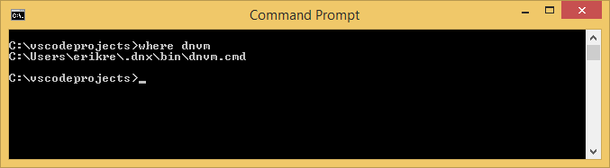
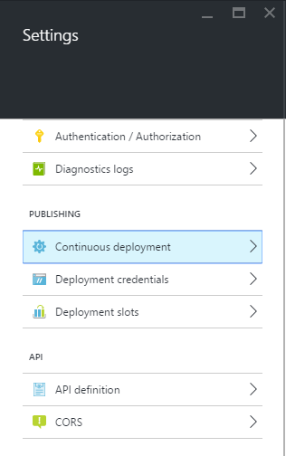
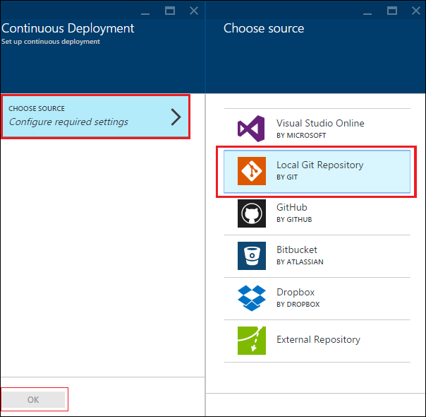
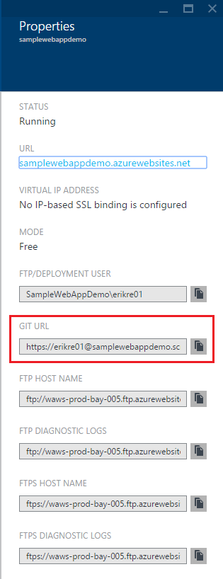
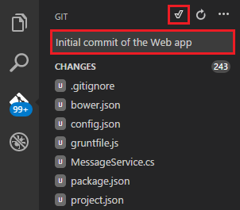
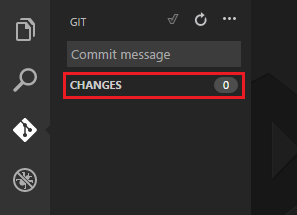

<properties
   pageTitle="Criar um aplicativo web do ASP.NET 5 no Visual Studio código"
   description="Este tutorial mostra como criar um aplicativo web do ASP.NET 5 usando o Visual Studio código."
   services="app-service\web"
   documentationCenter=".net"
   authors="erikre"
   manager="wpickett"
   editor="jimbe"/>

<tags
    ms.service="app-service-web" 
    ms.workload="web" 
    ms.tgt_pltfrm="dotnet" 
    ms.devlang="na" 
    ms.topic="article" 
    ms.date="02/26/2016" 
    ms.author="cephalin"/>

# Criar um aplicativo web do ASP.NET 5 no Visual Studio código

## Visão geral

Este tutorial mostra como criar um aplicativo web do ASP.NET 5 usando o [Visual Studio código (VS código)](http://code.visualstudio.com//Docs/whyvscode) e implantá-lo para [O serviço de aplicativo do Azure](../app-service/app-service-value-prop-what-is.md). 

> [AZURE.NOTE] Embora este artigo se refere a aplicativos web, ele também se aplica a aplicativos de API e aplicativos móveis. 

ASP.NET 5 é uma reformulação significativa do ASP.NET. ASP.NET 5 é uma nova estrutura de código-fonte aberto e entre plataformas para criar aplicativos web moderna baseado em nuvem usando .NET. Para obter mais informações, consulte [Introdução ao ASP.NET 5](http://docs.asp.net/en/latest/conceptual-overview/aspnet.html). Para obter informações sobre o serviço de aplicativo do Azure web apps, consulte [Visão geral de aplicativos Web](app-service-web-overview.md).

[AZURE.INCLUDE [app-service-web-try-app-service.md](../../includes/app-service-web-try-app-service.md)]

## Pré-requisitos  

* Instale o [código de VS](http://code.visualstudio.com/Docs/setup).
* Instalar [Node](http://nodejs.org) - Node é uma plataforma para criar aplicativos de servidor rápidas e escaláveis usando JavaScript. Nó é o tempo de execução (nó) e [npm](http://www.npmjs.com/) é o gerente de pacote para módulos de nó. Você vai usar npm para scaffold aplicativo web do ASP.NET 5 neste tutorial.
* Instalar gito - você pode instalá-lo um desses locais: [Chocolatey](https://chocolatey.org/packages/git) ou [scm.com gito](http://git-scm.com/downloads). Se você estiver começando a usar gito, escolha [gito scm.com](http://git-scm.com/downloads) e selecione a opção para **Usar gito do Prompt de comando do Windows**. Depois de instalar gito, você também precisará configurar o nome de usuário gito e como ele é necessária posteriormente no tutorial (quando realizar uma confirmação do código de VS) de email.  

## Instalar o ASP.NET 5 e DNX
ASP.NET 5/DNX (o ambiente de execução do .NET) é uma pilha de .NET lean para a criação de nuvem moderno e aplicativos web executados nos X, Linux e Windows. Ele foi criado desde o início para cima para fornecer uma estrutura de desenvolvimento otimizado para aplicativos que são implantados na nuvem ou executar no local. Ele consiste em componentes modulares com sobrecarga mínima, para que você mantenha a flexibilidade durante a construção de suas soluções.

Este tutorial é projetado para começar a criar aplicativos com as versões mais recentes de desenvolvimento do ASP.NET 5 e DNX. As instruções a seguir são específicas para Windows. Para obter instruções de instalação mais detalhadas para OS X, Linux e Windows, consulte [instalar o ASP.NET 5 e DNX](https://code.visualstudio.com/Docs/ASPnet5#_installing-aspnet-5-and-dnx). 

1. Para instalar o Gerenciador de versão do .NET (DNVM) no Windows, abra um prompt de comando e execute o seguinte comando.

        @powershell -NoProfile -ExecutionPolicy unrestricted -Command "&{$Branch='dev';iex ((new-object net.webclient).DownloadString('https://raw.githubusercontent.com/aspnet/Home/dev/dnvminstall.ps1'))}"

    Isso Baixe o script DNVM e colocá-lo no seu diretório de perfil de usuário. 

2. **Reiniciar o Windows** para concluir a instalação de DNVM. 

    Depois de reiniciar o Windows, você pode abrir o prompt de comando para verificar o local da DNVM digitando o seguinte:

        where dnvm

    Prompt de comando mostrará um caminho semelhante à seguinte.

    

3. Agora que você tem DNVM, você deve usá-lo para baixar DNX para executar seus aplicativos. Execute o seguinte no prompt de comando:

        dnvm upgrade

    Verifique se seu DNVM e exibir o tempo de execução active digitando o seguinte no prompt de comando:

        dnvm list

    Prompt de comando mostrará os detalhes do ativo runtime.

    

    Se mais de um tempo de execução DNX estiver listado, você pode optar por inserir o seguinte (ou uma versão mais recente) no prompt de comando para definir o tempo de execução DNX ativo. Configurá-lo para a mesma versão que é usada pelo gerador de 5 ASP.NET quando você cria seu aplicativo web posteriormente neste tutorial. *Talvez você não precise alterar o tempo de execução ativo se ela estiver definida para a versão mais recente disponível.*

        dnvm use 1.0.0-update1 –p

> [AZURE.NOTE] Para obter instruções de instalação mais detalhadas para OS X, Linux e Windows, consulte [instalar o ASP.NET 5 e DNX](https://code.visualstudio.com/Docs/ASPnet5#_installing-aspnet-5-and-dnx). 

## Criar o aplicativo web 

Esta seção mostra como scaffold um novo aplicativo de web do ASP.NET do aplicativo. Você usará o Gerenciador de pacote de nó (npm) para instalar [Yeoman](http://yeoman.io/) (ferramenta de estrutura de aplicativo - o equivalente VS código do Visual Studio **arquivo > Novo projeto** operação), [pesado](http://gruntjs.com/) (JavaScript executor de tarefa) e [Bower](http://bower.io/) (Gerenciador de pacote do lado do cliente). 

1. Abra um prompt de comando com direitos de administrador e navegue até o local onde você deseja criar o seu projeto do ASP.NET. Por exemplo, crie um diretório de *vscodeprojects* na raiz de c:\.

2. Digite o seguinte no prompt de comando para instalar o Yeoman e as ferramentas de suporte.

        npm install -g yo grunt-cli generator-aspnet bower

    > [AZURE.NOTE] Você pode receber um aviso para sugerir que sua versão npm está desatualizada. Este aviso não deve afetar este tutorial.

3. Digite o seguinte no prompt de comando para criar a pasta do projeto e scaffold o aplicativo.

        yo aspnet

4. Use as teclas de direção para selecionar o tipo **Básico de aplicativo Web** do ASP.NET 5 gerador menu e pressione ** &lt;Enter >**.

    

5. Defina o nome do seu novo aplicativo web ASP.NET como **SampleWebApp**. Como esse nome é usado em todo o tutorial, se você selecionar um nome diferente, você precisará substituí-lo para cada ocorrência da **SampleWebApp**. Quando você pressiona ** &lt;Enter >**, Yeoman criará uma nova pasta chamada **SampleWebApp** e os arquivos necessários para seu novo aplicativo.

6. No prompt de comando, altere diretórios para sua nova pasta de projeto:

        cd SampleWebApp

7. Também no prompt de comando, para instalar os pacotes NuGet necessários para executar o aplicativo, digite o seguinte comando:

        dnu restore

8. Abrir VS código digitando o seguinte no prompt de comando:

        code .

## Executar o aplicativo web localmente

Agora que você criou o web app e recuperados todos os pacotes do NuGet para o aplicativo, você pode executar o aplicativo web localmente.

1. Na **Paleta de comando** no código de VS, digite o seguinte para mostrar as opções de comando executar disponíveis:

        dnx: Run Command

    > [AZURE.NOTE] Se o servidor de Omnisharp não está sendo executado, ele será iniciado para cima. Digite novamente o comando acima.

    Em seguida, selecione o seguinte comando para executar o seu aplicativo web:
        
        dnx web - (SampleWebApp)

    A janela de comando exibirá que iniciou o aplicativo. Se a janela de comando não exibir esta mensagem, verifique o inferior esquerdo corning de código VS erros no seu projeto.
    
    > [AZURE.NOTE]Emitir um comando na **Paleta de comando** requer um **>** caractere no início da linha de comando. Você pode exibir os detalhes relacionados ao comando **web** no arquivo *project.json* .   
    > Se o comando não aparece ou não estiver disponível, talvez você precise instalar a extensão c#. Executar `>Extensions: Install Extension` e `ext install c#` para instalar as extensões c#.

2. Abra um navegador e navegue até a URL a seguir.

    **http://localhost:5000**

    A página padrão do aplicativo web aparecerão da seguinte maneira.

    

3. Feche o navegador. Na **Janela de comando**, pressione **Ctrl + C** para encerrar o aplicativo e feche a **Janela de comando**. 

## Criar um aplicativo web no Portal do Azure

As etapas a seguir o guiará durante a criação de um aplicativo web no Portal do Azure.

1. Faça logon [Portal do Azure](https://portal.azure.com).

2. Clique em **novo** na parte superior esquerda do Portal.

3. Clique em **aplicativos Web > Web App**.

    

4. Insira um valor para o **nome**, como **SampleWebAppDemo**. Observe que esse nome deve ser exclusivo e o portal aplicará que quando você tenta inserir o nome. Portanto, se você selecionar uma Insira um valor diferente, você precisará substituir esse valor para cada ocorrência do **SampleWebAppDemo** que você vê neste tutorial. 

5. Selecione um **Plano de serviço de aplicativo** de existente ou crie um novo. Se você criar um novo plano, selecione a camada de preços, local e outras opções. Para obter mais informações sobre planos de serviço de aplicativo, consulte o artigo, [Visão geral detalhada de planos de serviço de aplicativo do Azure](../app-service/azure-web-sites-web-hosting-plans-in-depth-overview.md).

    

6. Clique em **criar**.

    

## Ative a publicação de gito para o novo aplicativo web

Gito é um sistema de controle de versão distribuída que você pode usar para implantar o seu aplicativo web do serviço de aplicativo do Azure. Você vai armazenar o código que você escreve para o aplicativo da web em um repositório gito local e você vai implantar seu código para Azure enviando para um repositório remoto.   

1. Log no [Portal do Azure](https://portal.azure.com).

2. Clique em **Procurar**.

3. Clique em **Aplicativos Web** para exibir uma lista dos aplicativos web associados a sua assinatura do Azure.

4. Selecione o aplicativo web criado neste tutorial.

5. Na lâmina web app, clique em **configurações** > **implantação contínua**. 

    

6. Clique em **Escolha fonte > repositório gito Local**.

7. Clique em **Okey**.

    

8. Se você não tiver configurado anteriormente as credenciais de implantação para um aplicativo web ou outro aplicativo de serviço de aplicativo de publicação, configurá-los agora:

    * Clique em **configurações** > **credenciais de implantação**. A lâmina **definir credenciais de implantação** será exibida.

    * Crie um nome de usuário e senha.  Você precisará posteriormente essa senha ao configurar gito.

    * Clique em **Salvar**.

9. Na lâmina do web app, clique em **Configurações > Propriedades**. A URL do repositório gito remoto que você vai implantar em é mostrada em **GITO URL**.

10. Copie o valor de **URL GITO** para uso posterior no tutorial.

    

## Publicar seu aplicativo web do serviço de aplicativo do Azure

Nesta seção, você criará um repositório gito local e o envio desse repositório no Azure para implantar o aplicativo web do Azure.

1. No código de VS, selecione a opção **gito** na barra de navegação à esquerda.

    

2. Selecione **inicializar gito repositório** para garantir que seu espaço de trabalho está sob controle de fonte de gito. 

    

3. Abrir a janela de comando e altere os diretórios para o diretório de seu aplicativo web. Em seguida, digite o seguinte comando:

        git config core.autocrlf false

    Este comando impede que um problema sobre texto onde finais CRLF e finais LF estão envolvidos.

4. No código de VS, adicione uma mensagem de confirmação e clique no ícone de seleção **Confirmar todos** .

    

5. Após gito processamento, você verá que não existem arquivos listados na janela gito em **alterações**. 

    

6. Alterar de volta para a janela de comando onde o prompt de comando aponta para a pasta onde se encontra o aplicativo web.

7. Crie uma referência remota para enviar as atualizações para o seu aplicativo web usando a URL de gito (terminadas em ".git") que você copiou anteriormente.

        git remote add azure [URL for remote repository]

8. Configure gito para salvar suas credenciais localmente para que eles serão automaticamente acrescentados à seus comandos de envio gerados a partir de código de VS.

        git config credential.helper store

9. Enviar as suas alterações no Azure digitando o seguinte comando. Após essa expansão inicial no Azure, você poderá fazer todos os comandos de envio do código de VS. 

        git push -u azure master

    Você será solicitado a senha que você criou anteriormente no Azure. **Observação: A senha não ficará visível.**

    A saída do comando acima termina com uma mensagem que implantação é bem-sucedido.

        remote: Deployment successful.
        To https://user@testsite.scm.azurewebsites.net/testsite.git
        [new branch]      master -> master

> [AZURE.NOTE] Se você fizer alterações em seu aplicativo, você pode republicar diretamente no código de VS usando a funcionalidade de gito interna selecionando a opção **Confirmar tudo** , seguida pela opção de **envio por Push** . Você encontrará a opção de **envio por Push** disponível no menu suspenso ao lado de botões de **Confirmar todos** e **Atualizar** .

Se você precisar colaborar em um projeto, você deve considerar insistem para GitHub entre os insistem no Azure.

## Executar o aplicativo no Azure
Agora que você implantou o aplicativo da web, vamos executar o aplicativo enquanto hospedado no Azure. 

Isso pode ser feito de duas maneiras:

* Abra um navegador e digite o nome do seu aplicativo web da seguinte maneira.   

        http://SampleWebAppDemo.azurewebsites.net
 
* No Portal do Azure, localize a lâmina de aplicativo da web para o aplicativo web e clique em **Procurar** para exibir seu aplicativo 
* no seu navegador padrão.

## Resumo
Neste tutorial, você aprendeu como criar um aplicativo web no código de VS e implantá-lo no Azure. Para obter mais informações sobre o código de VS, consulte o artigo [por que o Visual Studio Code?](https://code.visualstudio.com/Docs/) Para obter informações sobre o serviço de aplicativo web apps, consulte [Visão geral de aplicativos Web](app-service-web-overview.md). 
