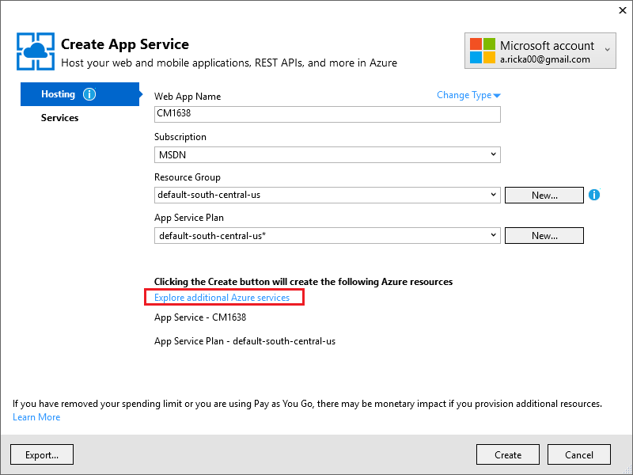
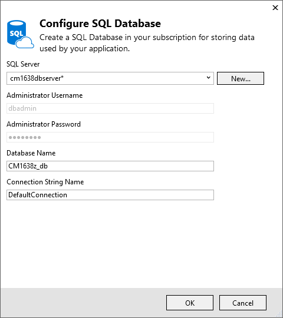
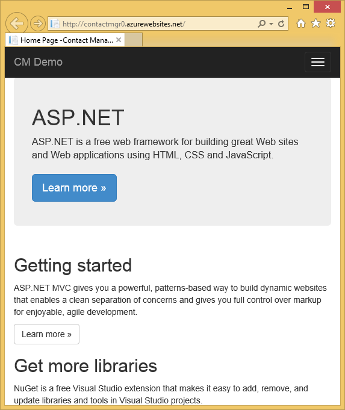
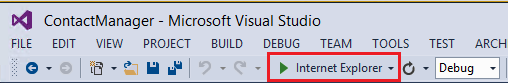
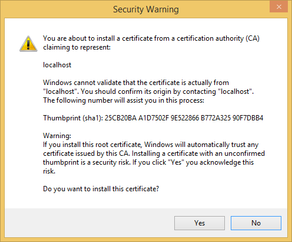
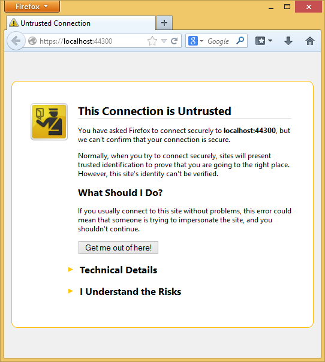
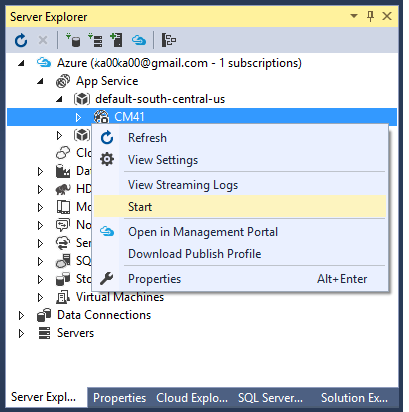
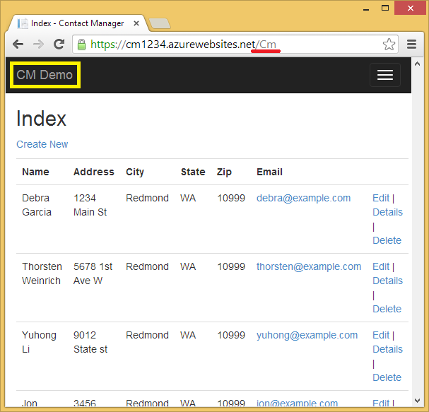

<properties 
    pageTitle="Criar um aplicativo do ASP.NET MVC com auth e DB do SQL e implantar o serviço de aplicativo do Azure" 
    description="Aprenda a desenvolver um aplicativo do ASP.NET MVC 5 com um banco de dados SQL back-end, adicionar autenticação e autorização e implantá-lo no Azure." 
    services="app-service\web" 
    documentationCenter=".net" 
    authors="Rick-Anderson" 
    writer="Rick-Anderson" 
    manager="wpickett" 
    editor=""/>

<tags 
    ms.service="app-service-web" 
    ms.workload="web" 
    ms.tgt_pltfrm="na" 
    ms.devlang="dotnet" 
    ms.topic="article" 
    ms.date="03/21/2016" 
    ms.author="riande"/> 

# Criar um aplicativo do ASP.NET MVC com auth e DB do SQL e implantar o serviço de aplicativo do Azure

Este tutorial mostra como criar um aplicativo de web ASP.NET MVC 5 seguro que permite que usuários façam logon com credenciais do Facebook ou do Google. O aplicativo é uma lista de contatos simple que usa a estrutura de entidades ADO.NET para acesso de banco de dados. Você vai implantar o aplicativo de serviço de [aplicativo](http://go.microsoft.com/fwlink/?LinkId=529714)do Azure. 

Em Concluindo o tutorial, você terá um aplicativo web orientadas a dados seguro para cima e em execução na nuvem e usar um banco de dados de nuvem. A ilustração a seguir mostra a página de logon para o aplicativo concluído.

![página de logon][rxb]

Você aprenderá:

* Como criar um projeto de web do ASP.NET MVC 5 seguro no Visual Studio.
* Como autenticar e autorizar usuários que fizerem logon com credenciais de suas contas do Google ou Facebook (autenticação de provedor social usando [OAuth 2.0](http://oauth.net/2 "http://oauth.net/2")).
* Como autenticar e autorizar usuários que se registrar em um banco de dados gerenciado pelo aplicativo (autenticação local usando a [Identidade do ASP.NET](http://asp.net/identity/)).
* Como usar o ADO.NET entidade Framework 6 Code First para ler e gravar dados em um banco de dados do SQL.
* Como usar entidade Framework código primeiro migrações para implantar um banco de dados.
* Como armazenar dados relacionais na nuvem usando o Azure SQL Database.
* Como implantar um projeto da web que usa um banco de dados a um [aplicativo da web](http://go.microsoft.com/fwlink/?LinkId=529714) no serviço de aplicativo do Azure.

>[AZURE.NOTE] Este é um tutorial longo. Se você quiser uma rápida introdução para o serviço de aplicativo do Azure e Visual Studio projetos da web, consulte [criar um aplicativo web do ASP.NET no serviço de aplicativo do Azure](web-sites-dotnet-get-started.md). Para informações de solução de problemas, consulte a seção de [solução de problemas](#troubleshooting) .
>
>Ou, se você deseja começar a usar o serviço de aplicativo do Azure antes de se inscrever para uma conta do Azure, vá para [Experimentar o serviço de aplicativo](http://go.microsoft.com/fwlink/?LinkId=523751), onde você pode criar imediatamente um aplicativo da web de curta duração starter no aplicativo de serviço. Não há cartões de crédito obrigatório; Não há compromissos.

## Pré-requisitos

Para concluir este tutorial, você precisará de uma conta do Microsoft Azure. Se você não tiver uma conta, você pode [ativar seus benefícios de assinante do Visual Studio](/pricing/member-offers/msdn-benefits-details/?WT.mc_id=A261C142F) ou [inscrever-se para uma avaliação gratuita](/pricing/free-trial/?WT.mc_id=A261C142F).

Para configurar seu ambiente de desenvolvimento, você deve instalar o [Visual Studio 2013 Update 5](http://go.microsoft.com/fwlink/?LinkId=390521) ou superior e a versão mais recente do [SDK do Azure para .NET](http://go.microsoft.com/fwlink/?linkid=324322&clcid=0x409). Este artigo foi escrito para Visual Studio atualização 4 e SDK 2.8.1. As mesmas instruções funcionam para Visual Studio de 2015 com o mais recente [SDK do Azure para .NET](http://go.microsoft.com/fwlink/?linkid=518003&clcid=0x409) instalado, mas algumas telas terá uma aparência diferentes das ilustrações.

## Criar um aplicativo do ASP.NET MVC 5

### Criar o projeto

1. No menu **arquivo** , clique em **Novo projeto**.

    

1. Na caixa de diálogo **Novo projeto** , expanda **c#** e selecione **Web** sob **Modelos instalados**e, em seguida, selecione o **Aplicativo Web ASP.NET**. Nomeie o aplicativo **ContactManager**e clique em **Okey**.

    
 
    **Observação:** Verifique se que você inserir "ContactManager". Blocos de código que você vai ser copiando posteriormente presumem que o nome do projeto é ContactManager. 

1. Na caixa de diálogo **Novo projeto ASP.NET** , selecione o modelo **MVC** . Verifique se a **autenticação** está definida para **Contas de usuário individuais**, **Host na nuvem** está marcada e **Serviço de aplicativo** está selecionada.

    

1. Clique em **Okey**.

1. Aparece a caixa de diálogo **Configurar Microsoft Azure configurações Web App** . Talvez você precise entrar se você ainda não tiver feito isso, ou digite novamente suas credenciais se o login tiver expirado.

1. Opcional - alterar o valor no **nome do aplicativo Web** caixa (consulte a imagem abaixo).

    A URL do aplicativo web será {nome} .azurewebsites .net, para que o nome deve ser exclusivo no domínio azurewebsites.net. O Assistente de configuração sugere um nome exclusivo anexando um número para o nome do projeto "ContactManager" e que está corretamente configurado para este tutorial.

5. No **grupo de recursos** suspensa Selecione um grupo existente ou **Criar novo grupo de recursos**(consulte a imagem abaixo). 

    Se preferir, você pode selecionar um grupo de recursos que você já possui. Mas se você cria um novo grupo de recursos e usá-lo somente para este tutorial, ele será fácil excluir todos os recursos Azure que você criou para o tutorial quando terminar com eles. Para obter informações sobre os grupos de recursos, consulte [Visão geral do Gerenciador de recursos do Azure](../azure-resource-manager/resource-group-overview.md). 

5. No **plano de serviço de aplicativo** suspensa Selecione um plano existente ou **Criar novo aplicativo de serviço planejar**(consulte a imagem abaixo).

    Se preferir, você pode selecionar um plano de serviço de aplicativo que você já tem. Para obter informações sobre planos de serviço de aplicativo, consulte [Visão geral detalhada de planos de serviço de aplicativo do Azure](../app-service/azure-web-sites-web-hosting-plans-in-depth-overview.md). 

1. Toque em **explorar serviços Azure adicionais** para adicionar um banco de dados do SQL.

    

1. Toque na **+** ícone para adicionar um banco de dados do SQL.

    

1. Toque em **novo** na caixa de diálogo **Configurar banco de dados do SQL** :

    

1. Insira um nome para o administrador e uma senha forte.

    

    O nome do servidor deve ser exclusivo. Ele pode conter letras minúsculas, dígitos numéricos e hífens. Ele não pode conter um hífen à direita. O nome de usuário e senha são novas credenciais que você está criando para o novo servidor. 

    Se você já tiver um servidor de banco de dados, você pode selecionar que em vez de criar um. Servidores de banco de dados são um recurso valiosas e você geralmente deseja criar vários bancos de dados no mesmo servidor para teste e desenvolvimento em vez de criar um servidor de banco de dados por banco de dados. No entanto, para este tutorial você só precisará servidor temporariamente e criando o servidor no mesmo grupo de recursos como o site facilitam a excluir ambos os recursos de aplicativo e banco de dados da web excluindo grupo de recursos quando terminar com o tutorial. 

    Se você selecionar um servidor de banco de dados existente, certifique-se de que seu aplicativo web e o banco de dados estão na mesma região.

    

4. Toque em **criar**.

    Visual Studio cria o projeto de web ContactManager, cria o grupo de recursos e o plano de serviço de aplicativo que você especificou, e cria um aplicativo web no serviço de aplicativo do Azure com o nome especificado.

### Definir o cabeçalho e rodapé

1. No **Solution Explorer** , abra o arquivo de *Layout.cshtml* na pasta *Views\Shared* .

    ![Cshtml no Solution Explorer][newapp004]

1. Substitua o ActionLink no arquivo *Layout.cshtml* com o seguinte código.

    @Html.ActionLink("CMDemonstração","Índice","Contatos", novo {área =" "}, o novo { @class ="a barra de navegação-marca"})
                   

    Verifique se que você alterar o terceiro parâmetro de "Casa" para "Contatos". A marcação acima criará um link "Contatos" em cada página para o método de índice do controlador de contatos. Altere o nome do aplicativo no cabeçalho e o rodapé "Meu aplicativo do ASP.NET" e "Nome do aplicativo" para "Contact Manager" e "CM demonstração". 
 
### Executar o aplicativo localmente

1. Pressione CTRL + F5 para executar o aplicativo.

    A home page do aplicativo aparece no navegador padrão.

    

Isso é tudo o que você precisa fazer agora criar o aplicativo que você vai implantar em Azure. 

## Implantar o aplicativo do Azure

1. No Visual Studio, clique com botão direito do projeto no **Solution Explorer** e selecione **Publicar** no menu de contexto.

    
    
    O Assistente de **Publicar Web** abre.

1. Na caixa de diálogo **Publicar Web** , clique em **Publicar**.

    

    O aplicativo que você criou agora está executando na nuvem. Na próxima vez que você implantar o aplicativo, somente os arquivos alterados (ou novos) serão implantados.

    

## Habilitar o SSL para o projeto ##

1. No **Solution Explorer**, clique em projeto **ContactManager** , clique em F4 para abrir a janela de **Propriedades** .

3. Alterar a **SSL habilitado** para **True**. 

4. Copie a **URL de SSL**.

    A URL de SSL será https://localhost:44300 / a menos que você criou anteriormente SSL web apps.

    ![Habilitar SSL][rxSSL]
 
1. No **Solution Explorer**, clique com botão direito do projeto **Contact Manager** e clique em **Propriedades**.

1. Clique na guia **Web** .

1. Altere a **Url do Project** para usar a **URL de SSL** e salve a página (controle S).

    
 
1. Verificar se o Internet Explorer é o navegador que inicia a Visual Studio, conforme mostrado na imagem abaixo:

    

    O seletor de navegador permite especificar o navegador que Visual Studio inicia. Você pode selecionar vários navegadores e fazer com que o Visual Studio atualize cada navegador quando você faz alterações. Para obter mais informações, consulte [Usando o Link de navegador no Visual Studio 2013](http://www.asp.net/visual-studio/overview/2013/using-browser-link).

    

1. Pressione CTRL + F5 para executar o aplicativo. Clique em **Sim** para iniciar o processo de confiar no certificado auto-assinado que IIS Express gerou.

     

1. Leia a caixa de diálogo de **Aviso de segurança** e clique em **Sim** se quiser instalar o certificado que representa o **host local**.

    

1. IE mostra a página *Home* e não há nenhuma avisos de SSL.

     

     Internet Explorer é uma boa opção quando você estiver usando SSL porque ele aceita o certificado e mostra o conteúdo HTTPS sem aviso. Microsoft Edge e o Google Chrome também aceitam o certificado. Firefox usa seu próprio armazenamento de certificados, portanto, ele exibe um aviso.

     

## Adicionar um banco de dados para o aplicativo

Em seguida, você irá atualizar o aplicativo para adicionar a capacidade de exibir e atualizar contatos e armazenar os dados em um banco de dados. O aplicativo usará a estrutura de entidade (EF) para criar o banco de dados e para ler e atualizar dados.

### Adicionar classes de modelo de dados para os contatos

Você começa criando um modelo de dados simples no código.

1. No **Solution Explorer**, clique com botão direito na pasta de modelos, clique em **Adicionar**e, em seguida, **classe**.

    

2. Na caixa de diálogo **Adicionar Novo Item** , nomeie o novo arquivo de classe *Contact.cs*e clique em **Adicionar**.

    ![Adicionar caixa de diálogo Novo Item][adddb002]

3. Substitua o conteúdo do arquivo Contact.cs com o seguinte código.

        using System.ComponentModel.DataAnnotations;
        using System.Globalization;
        namespace ContactManager.Models
        {
            public class Contact
            {
                public int ContactId { get; set; }
                public string Name { get; set; }
                public string Address { get; set; }
                public string City { get; set; }
                public string State { get; set; }
                public string Zip { get; set; }
                [DataType(DataType.EmailAddress)]
                public string Email { get; set; }
            }
        }
A classe **contato** define os dados que você irá armazenar para cada contato, além de uma chave primária, *contato*, que é necessário para o banco de dados.

### Criar páginas da web que permitem aos usuários do aplicativo trabalhar com os contatos

O recurso de estrutura ASP.NET MVC pode gerar automaticamente código que executa criar, ler, atualizar e excluir ações (CRUD). 

1. Crie o projeto **(Ctrl + Shift + B)**. (Você deve criar o projeto antes de usar o mecanismo de estrutura).
 
1. No **Solution Explorer**, clique com botão direito na pasta de controladores e clique em **Adicionar**e clique em **controlador**.

    ![Adicionar controlador no menu de contexto de pasta de controladores][addcode001]

5. Na caixa de diálogo **Adicionar Scaffold** , selecione **Controlador de 5 MVC com modos de exibição, usando o EF** e clique em **Adicionar**.
    
    

1. Na caixa suspensa **classe do modelo** , selecione o **contato (ContactManager.Models)**. (Consulte a imagem abaixo).

1. Na **classe de contexto de dados**, selecione **ApplicationDbContext (ContactManager.Models)**. O **ApplicationDbContext** será usado para a associação DB e nossos dados de contato.

    

1. Clique em **Adicionar**.

   Visual Studio cria um controlador com métodos e modos de exibição para operações de banco de dados CRUD para objetos de **contato** .

## Habilitar migrações, criar o banco de dados, adicionar dados de exemplo e um inicializador de dados ##

A próxima tarefa é habilitar o recurso de [Código primeiro migrações](http://msdn.microsoft.com/library/hh770484.aspx) para criar tabelas de banco de dados com base no modelo de dados que você criou.

1. No menu **Ferramentas** , selecione **NuGet Package Manager** e **Package Manager Console**.

    

2. Na janela do **Console do Gerenciador de pacote** , digite o seguinte comando:

        enable-migrations

    O comando **enable-migrações** cria uma pasta de *migrações* , e ele coloca nessa pasta um arquivo de *Configuration.cs* que você pode editar para propagar o banco de dados e configurar migrações. 

2. Na janela do **Console do Gerenciador de pacote** , digite o seguinte comando:

        add-migration Initial

    O comando **inicial de migração adicionar** gera um arquivo denominado ** &lt;date_stamp&gt;inicial** na pasta *migrações* . O código neste arquivo cria as tabelas de banco de dados. O primeiro parâmetro ( **inicial** ) é usado para criar o nome do arquivo. Você pode ver os novos arquivos de classe no **Solution Explorer**.

    Na classe **inicial** , o método de **backup** cria a tabela Contatos e o método **para baixo** (usado quando você deseja retornar para o estado anterior) descarta-lo.

3. Abra o arquivo *Migrations\Configuration.cs* . 

4. Adicione o seguinte `using` instrução. 

         using ContactManager.Models;

5. Substitua o método de *propagação* com o seguinte código:

        protected override void Seed(ContactManager.Models.ApplicationDbContext context)
        {
            context.Contacts.AddOrUpdate(p => p.Name,
               new Contact
               {
                   Name = "Debra Garcia",
                   Address = "1234 Main St",
                   City = "Redmond",
                   State = "WA",
                   Zip = "10999",
                   Email = "debra@example.com",
               },
                new Contact
                {
                    Name = "Thorsten Weinrich",
                    Address = "5678 1st Ave W",
                    City = "Redmond",
                    State = "WA",
                    Zip = "10999",
                    Email = "thorsten@example.com",
                },
                new Contact
                {
                    Name = "Yuhong Li",
                    Address = "9012 State st",
                    City = "Redmond",
                    State = "WA",
                    Zip = "10999",
                    Email = "yuhong@example.com",
                },
                new Contact
                {
                    Name = "Jon Orton",
                    Address = "3456 Maple St",
                    City = "Redmond",
                    State = "WA",
                    Zip = "10999",
                    Email = "jon@example.com",
                },
                new Contact
                {
                    Name = "Diliana Alexieva-Bosseva",
                    Address = "7890 2nd Ave E",
                    City = "Redmond",
                    State = "WA",
                    Zip = "10999",
                    Email = "diliana@example.com",
                }
                );
        }

    Este código inicializa (sementes) o banco de dados com informações de contato. Para obter mais informações sobre o banco de dados de propagação, consulte [propagação e bancos de dados de estrutura de entidade de depuração (FE)](http://blogs.msdn.com/b/rickandy/archive/2013/02/12/seeding-and-debugging-entity-framework-ef-dbs.aspx). Crie o projeto para verificar se que há sem erros de compilação.

6. No **Package Manager Console** , digite o comando:

        update-database

    ![Comandos do Console do Gerenciador de pacote][addcode009]

    O **banco de dados update** executa a primeira migração que cria o banco de dados. Por padrão, o banco de dados é criado como um banco de dados do SQL Server Express LocalDB. 

7. Pressione CTRL + F5 para executar o aplicativo e clique no link de **Demonstração de CM** ; ou navegue até https://localhost:(port#)/Cm. 

    O aplicativo mostra os dados de propagação e fornece links de edição, detalhes e excluir. Você pode criar, editar, excluir e exibir dados.

    ![Modo de exibição MVC de dados][rx2]

## Adicionar um provedor de OAuth2

>[AZURE.NOTE] Para obter instruções detalhadas sobre como usar os Google e o Facebook desenvolvedor sites de portal, este tutorial links para tutoriais no site do ASP.NET. Entretanto, Google e o Facebook alterar seus sites com mais frequência desses tutoriais são atualizadas, e elas estão agora desatualizadas. Se você tiver problemas para seguir as instruções, consulte o comentário Disqus em destaque no final deste tutorial para uma lista do que mudou. 

[OAuth] (http://oauth.net/ "http://OAuth.NET/") é um protocolo aberto que permite a autorização segura em um método simple e padrão dos aplicativos web, de desktop e móveis. O modelo de internet do ASP.NET MVC usa OAuth expor Facebook, Twitter, Google e Microsoft como provedores de autenticação. Embora este tutorial usa somente Google como o provedor de autenticação, você pode modificar facilmente o código para usar qualquer um desses provedores. As etapas para implementar outros provedores são muito semelhantes às etapas que você ver neste tutorial. Para usar o Facebook como um provedor de autenticação, consulte [MVC 5 aplicativo com o Facebook, Twitter, LinkedIn e Google OAuth2 logon ](http://www.asp.net/mvc/tutorials/mvc-5/create-an-aspnet-mvc-5-app-with-facebook-and-google-oauth2-and-openid-sign-on).

Além de autenticação, este tutorial usa funções para implementar a autorização. Somente os usuários que você adiciona à função *canEdit* são capazes de alterar dados (ou seja, criar, editar ou excluir contatos).

1. Siga as instruções no [Aplicativo de 5 MVC com o Facebook, Twitter, LinkedIn e Google OAuth2 logon](http://www.asp.net/mvc/tutorials/mvc-5/create-an-aspnet-mvc-5-app-with-facebook-and-google-oauth2-and-openid-sign-on#goog) em **criação de um aplicativo do Google para OAuth 2 configurar um aplicativo do Google para OAuth2**.

3. Executar e testar o aplicativo para verificar se você pode efetuar logon usando autenticação do Google.

2. Se você quiser criar botões de login social com ícones de específicas do provedor, consulte [botões de login bastante sociais para ASP.NET MVC 5](http://www.jerriepelser.com/blog/pretty-social-login-buttons-for-asp-net-mvc-5)

## Usando a API de associação

Nesta seção você adicionará um usuário local e a função *canEdit* no banco de dados de associação. Somente os usuários na função *canEdit* poderão editar os dados. Uma prática recomendada é às funções de nome pelas ações que eles podem realizar, portanto *canEdit* é preferível uma função chamada *administrador*. Quando seu aplicativo evoluir, você pode adicionar novas funções como *canDeleteMembers* em vez da menos descritivo *superAdmin*.

1. Abra o arquivo *migrations\configuration.cs* e adicione o seguinte `using` instruções:

        using Microsoft.AspNet.Identity;
        using Microsoft.AspNet.Identity.EntityFramework;

1. Adicione o seguinte método de **AddUserAndRole** à classe:

        bool AddUserAndRole(ContactManager.Models.ApplicationDbContext context)
        {
            IdentityResult ir;
            var rm = new RoleManager<IdentityRole>
                (new RoleStore<IdentityRole>(context));
            ir = rm.Create(new IdentityRole("canEdit"));
            var um = new UserManager<ApplicationUser>(
                new UserStore<ApplicationUser>(context));
            var user = new ApplicationUser()
            {
                UserName = "user1@contoso.com",
            };
            ir = um.Create(user, "P_assw0rd1");
            if (ir.Succeeded == false)
                return ir.Succeeded;
            ir = um.AddToRole(user.Id, "canEdit");
            return ir.Succeeded;
        }

1. Chame o novo método do método **propagação** :

        protected override void Seed(ContactManager.Models.ApplicationDbContext context)
        {
            AddUserAndRole(context);
            context.Contacts.AddOrUpdate(p => p.Name,
                // Code removed for brevity
        }

    As imagens a seguir mostra as alterações ao método de *propagação* :

    

    Este código cria uma nova função chamada *canEdit*, cria um novo usuário local *user1@contoso.com*e adiciona *user1@contoso.com* à função *canEdit* . Para obter mais informações, consulte os [tutoriais de identidade ASP.NET](http://www.asp.net/identity/overview/features-api) no site do ASP.NET.

## Usar código temporário para adicionar novos usuários de Login sociais para a função canEdit  ##

Nesta seção, você irá modificar temporariamente o método **ExternalLoginConfirmation** no controlador de conta para adicionar novos usuários Registrando com um provedor de OAuth à função *canEdit* . Esperamos que forneça uma ferramenta semelhante a [WSAT](http://msdn.microsoft.com/library/ms228053.aspx) no futuro que permitirá que você criar e editar contas de usuário e funções. Até lá, você pode fazer a mesma função usando código temporário.

1. Abra o arquivo **Controllers\AccountController.cs** e navegue até o método **ExternalLoginConfirmation** .

1. Adicione o seguinte chamada **AddToRoleAsync** logo antes da chamada de **SignInAsync** .

        await UserManager.AddToRoleAsync(user.Id, "canEdit");

   O código acima adiciona o usuário recém registrado à função "canEdit", que oferece acesso aos métodos de ação que alteram dados (Editar). O trecho a seguir mostra a nova linha de código no contexto.

          // POST: /Account/ExternalLoginConfirmation
          [HttpPost]
          [AllowAnonymous]
          [ValidateAntiForgeryToken]
          public async Task ExternalLoginConfirmation(ExternalLoginConfirmationViewModel model, string returnUrl)
          {
             if (User.Identity.IsAuthenticated)
             {
                return RedirectToAction("Index", "Manage");
             }
             if (ModelState.IsValid)
             {
                // Get the information about the user from the external login provider
                var info = await AuthenticationManager.GetExternalLoginInfoAsync();
                if (info == null)
                {
                   return View("ExternalLoginFailure");
                }
                var user = new ApplicationUser { UserName = model.Email, Email = model.Email };
                var result = await UserManager.CreateAsync(user);
                if (result.Succeeded)
                {
                   result = await UserManager.AddLoginAsync(user.Id, info.Login);
                   if (result.Succeeded)
                   {
                      await UserManager.AddToRoleAsync(user.Id, "canEdit");
                      await SignInManager.SignInAsync(user, isPersistent: false, rememberBrowser: false);
                      return RedirectToLocal(returnUrl);
                   }
                }
                AddErrors(result);
             }
             ViewBag.ReturnUrl = returnUrl;
             return View(model);
          }

Mais tarde no tutorial, você implantará o aplicativo no Azure, onde você vai fazer logon no Google ou outro provedor de autenticação de terceiros. Isso adicionará a sua conta recém registrada à função *canEdit* . Em seguida, qualquer pessoa que localiza a URL da seu aplicativo web e tem uma ID do Google pode registrar e atualizar seu banco de dados. Para impedir que outras pessoas fazer isso, você pode parar o site. Você poderá verificar quem está na função *canEdit* examinando o banco de dados.

No **Console do Gerenciador de pacote** pressionar a tecla de seta para cima para exibir o seguinte comando:

        Update-Database

O comando **Update-Database** executa o método de **propagação** e que executa o método **AddUserAndRole** adicionado anteriormente. O método **AddUserAndRole** cria o usuário *user1@contoso.com* e adiciona ela à função *canEdit* .

## Proteger o aplicativo com SSL e o atributo autorizar ##

Nesta seção você aplica o atributo de [Autorizar](http://msdn.microsoft.com/library/system.web.mvc.authorizeattribute.aspx) para restringir o acesso para os métodos de ação. Os usuários anônimos poderão exibir somente o método de ação de **índice** do controlador inicial. Usuários registrados poderão ver dados de contatos (as páginas **índice** e **detalhes** do controlador Cm), a página sobre e a página de contato. Somente os usuários na função *canEdit* serão capazes de métodos de ação de acesso que alteram dados.

1. Abra o arquivo *App_Start\FilterConfig.cs* e substitua o método de *RegisterGlobalFilters* com o seguinte (que adiciona os dois filtros):

        public static void RegisterGlobalFilters(GlobalFilterCollection filters)
        {
            filters.Add(new HandleErrorAttribute());
            filters.Add(new System.Web.Mvc.AuthorizeAttribute());
            filters.Add(new RequireHttpsAttribute());
        }
        
    Este código adiciona o filtro de [Autorizar](http://msdn.microsoft.com/library/system.web.mvc.authorizeattribute.aspx) e o filtro [RequireHttps](http://msdn.microsoft.com/library/system.web.mvc.requirehttpsattribute.aspx) para o aplicativo. O filtro de [Autorizar](http://msdn.microsoft.com/library/system.web.mvc.authorizeattribute.aspx) impede que usuários anônimos acesse quaisquer métodos no aplicativo. Você usará o atributo [AllowAnonymous](http://blogs.msdn.com/b/rickandy/archive/2012/03/23/securing-your-asp-net-mvc-4-app-and-the-new-allowanonymous-attribute.aspx) para deixar o requisito de autorização em alguns métodos, para que usuários anônimos podem efetuar logon e podem exibir a página inicial. O [RequireHttps](http://msdn.microsoft.com/library/system.web.mvc.requirehttpsattribute.aspx) requer que todo o acesso para o aplicativo web seja através de HTTPS.

    Uma abordagem alternativa é adicionar o atributo de [Autorizar](http://msdn.microsoft.com/library/system.web.mvc.authorizeattribute.aspx) e o atributo [RequireHttps](http://msdn.microsoft.com/library/system.web.mvc.requirehttpsattribute.aspx) a cada controlador, mas é considerada uma prática recomendada de segurança para aplicá-las ao aplicativo inteiro. Adicionando-os globalmente, cada novo método de controlador e a ação que adicionar automaticamente estiver protegido – você não precisa se lembrar de aplicá-las. Para obter mais informações, consulte [Protegendo seu aplicativo do ASP.NET MVC e o novo atributo AllowAnonymous](http://blogs.msdn.com/b/rickandy/archive/2012/03/23/securing-your-asp-net-mvc-4-app-and-the-new-allowanonymous-attribute.aspx). 

1. Adicione o atributo [AllowAnonymous](http://blogs.msdn.com/b/rickandy/archive/2012/03/23/securing-your-asp-net-mvc-4-app-and-the-new-allowanonymous-attribute.aspx) para o método de **índice** do controlador de Home. O atributo [AllowAnonymous](http://blogs.msdn.com/b/rickandy/archive/2012/03/23/securing-your-asp-net-mvc-4-app-and-the-new-allowanonymous-attribute.aspx) permite que você lista branca os métodos que você deseja deixar de autorização. 

        public class HomeController : Controller
        {
          [AllowAnonymous]
          public ActionResult Index()
          {
             return View();
          }

    Se você fizer uma pesquisa global de *AllowAnonymous*, você verá que ele é usado nos métodos de logon e o registro do controlador de conta.

1. No *CmController.cs*, adicione `[Authorize(Roles = "canEdit")]` para os métodos HttpGet e HttpPost que alteram dados (criar, editar, excluir, cada método de ação, exceto detalhes e índice) no controlador de *Cm* . Uma parte do código concluída é mostrada abaixo: 

        // GET: Cm/Create
        [Authorize(Roles = "canEdit")]
        public ActionResult Create()
        {
           return View(new Contact { Address = "123 N 456 W",
            City="Great Falls", Email = "ab@cd.com", Name="Joe Smith", State="MT",
           Zip = "59405"});
        }
        // POST: Cm/Create
        // To protect from overposting attacks, please enable the specific properties you want to bind to, for 
        // more details see http://go.microsoft.com/fwlink/?LinkId=317598.
        [HttpPost]
        [ValidateAntiForgeryToken]
         [Authorize(Roles = "canEdit")]
        public ActionResult Create([Bind(Include = "ContactId,Name,Address,City,State,Zip,Email")] Contact contact)
        {
            if (ModelState.IsValid)
            {
                db.Contacts.Add(contact);
                db.SaveChanges();
                return RedirectToAction("Index");
            }
            return View(contact);
        }
        // GET: Cm/Edit/5
        [Authorize(Roles = "canEdit")]
        public ActionResult Edit(int? id)
        {
            if (id == null)
            {
                return new HttpStatusCodeResult(HttpStatusCode.BadRequest);
            }
            Contact contact = db.Contacts.Find(id);
            if (contact == null)
            {
                return HttpNotFound();
            }
            return View(contact);
        }
        
1. Pressione CTRL + F5 para executar o aplicativo.

1. Se você ainda estiver conectado de uma sessão anterior, pressione o link **fazer logoff** .

1. Clique na **sobre** ou **contato** links. Você é redirecionado para a página de login, porque usuários anônimos não é possível visualizar as páginas.

1. Clique no link **Register como um novo usuário** e adicionar um usuário local com email *joe@contoso.com*. Verifique se *José* pode exibir a página inicial, sobre e contate páginas. 

    

1. Clique no link de *Demonstração de CM* e verifique se que você vê os dados.

1. Clique em um link de edição na página, você será redirecionado para a página de login (porque um novo usuário local não é adicionado à função *canEdit* ).

1. Faça logon como *user1@contoso.com* com senha "P_assw0rd1" (a "0" em "word" é um zero). Você é redirecionado para a página Editar que você selecionou anteriormente. 
2. 

    Se você não pode fazer logon com essa conta e senha, tente copiar a senha do código-fonte e colando-a. Se você ainda não consegue efetuar login, verifique a coluna de **nome de usuário** da tabela **AspNetUsers** para verificar *user1@contoso.com* foi adicionada. 

1. Verifique se que você pode fazer alterações de dados.

## Implantar o aplicativo para o Azure

1. No Visual Studio, clique com botão direito do projeto no **Solution Explorer** e selecione **Publicar** no menu de contexto.

    ![Publicar no menu de contexto do projeto][firsdeploy003]

    O Assistente de **Publicar Web** abre.

1. Clique na guia **configurações** no lado esquerdo da caixa de diálogo **Publicar Web** . 

2. Em **ApplicationDbContext** , selecione o banco de dados que você criou quando você criou o projeto.
   

1. Em **ContactManagerContext**, selecione **Executar código primeiro as migrações**.

    

1. Clique em **Publicar**.

1. Faça logon como *user1@contoso.com* (com senha "P_assw0rd1") e verifique se você pode editar dados.

1. Fazer logoff.

1. Vá para o [Console de desenvolvedores do Google](https://console.developers.google.com/) e na atualização do guia de **credenciais** o redirecionamento URIS e JavaScript Orgins para usar a URL do Azure.

1. Faça logon usando o Google ou Facebook. Que adicionará a conta do Google ou Facebook à função **canEdit** . Se você recebe um erro de HTTP 400 com a mensagem *o redirecionamento URI na solicitação: https://contactmanager {minha version}.azurewebsites.net/signin-google não correspondem um redirecionamento registrado URI.*, será necessário aguardar até que as alterações feitas são propagadas. Se você receber esse erro após mais de alguns minutos, verifique os URIs estão corretas.

### Parar o web app para impedir que outras pessoas registrando  

1. No **Server Explorer**, navegue até **Azure > serviço de aplicativo > {seu grupo de recursos} > {seu aplicativo web}**.

4. Clique com botão direito do web app e selecione **Parar**. 

    Como alternativa, do [Portal do Azure](https://portal.azure.com/), você pode ir para blade do aplicativo da web, e clique no ícone **Parar** na parte superior da lâmina.

    

### Remover AddToRoleAsync, publicar e testar

1. Comentar ou remover o seguinte código do método **ExternalLoginConfirmation** no controlador de conta:

        await UserManager.AddToRoleAsync(user.Id, "canEdit");

1. Crie o projeto (que salva as alterações de arquivo e verifica se que você não tiver quaisquer erros de compilação).

5. Clique com botão direito do projeto no **Solution Explorer** e selecione **Publicar**.

       
    
4. Clique no botão **Iniciar Visualizar** . Somente os arquivos que precisam ser atualizados são implantados.

5. Inicie o aplicativo web do Visual Studio ou a partir do Portal. **Você não poderá publicar enquanto o web app é interrompido**.

    

5. Volte para o Visual Studio e clique em **Publicar**.

3. Seu aplicativo do Azure abre no navegador padrão. Se você estiver conectado, faça check-out para poder visualizar a home page como um usuário anônimo.  

4. Clique no link **sobre** . Você será redirecionado para o página de login.

5. Clique no link **Register** na página de login e criar conta local. Usaremos essa conta local para verificar se você pode acessar as páginas de somente leitura, mas você não pode acessar as páginas que alteram dados (que são protegidos pela função *canEdit* ). Posteriormente no tutorial, você removerá acesso de conta local. 

    

1. Verifique se você pode navegar para as páginas *sobre* e *contato* .

    

1. Clique no link de **Demonstração de CM** para navegar até o controlador **Cm** . Como alternativa, você pode acrescentar *Cm* para a URL. 

    
 
1. Clique em um link de edição. 

    Você é redirecionado para a página de login. 

2. Em **usar outro serviço para fazer logon no**, clique em Google ou Facebook e faça logon com a conta que você anteriormente registrado. (Se você estiver trabalhando rapidamente e seu cookie de sessão não expirou, você vai ser automaticamente conectado com a conta do Google ou Facebook que você usava anteriormente.)

2. Verifique se que você pode editar dados enquanto estiver conectado a essa conta.

    **Observação:** Você não pode sair do Google deste aplicativo e o log para uma conta do google diferentes com o mesmo navegador. Se você estiver usando um navegador, você terá que navegar até Google e fazer logoff. Você pode fazer logon com outra conta do mesmo autenticador de terceiros (como Google) usando um navegador diferente.

    Se você não tiver preenchido o nome e sobrenome de suas informações de conta do Google, uma NullReferenceException ocorrerá.

## Examine o SQL Azure DB ##

1. No **Server Explorer**, navegue até **Azure > bancos de dados SQL > {seu banco de dados}**

2. Clique com botão direito seu banco de dados e selecione **Abrir no Pesquisador de objetos do SQL Server**.
 
    
 
3. Se você ainda não estiver conectado ao banco de dados anteriormente, você pode ser solicitado para adicionar uma regra de firewall para habilitar acesso para seu endereço IP atual. O endereço IP serão preenchido previamente. Basta clicar em **Adicionar regra de Firewall** para habilitar o acesso.

    

3. Faça logon no banco de dados com o nome de usuário e senha que você especificou quando você criou o servidor de banco de dados. 
 
1. A tabela **AspNetUsers** clique com botão direito e selecione **Exibir os dados**.

    
 
1. Observação a Id da conta do Google registrado com seja na função **canEdit** e a Id do *user1@contoso.com*. Esses devem ser os únicos usuários na função **canEdit** . (Você será Verifique na próxima etapa.)

    
 
2. No **Pesquisador de objetos do SQL Server**, clique com o botão direito em **AspNetUserRoles** e selecione **Exibir os dados**.

    
 
3. Verificar se a **ID de usuário** é de *user1@contoso.com* e a conta do Google você registrou. 

## Solução de problemas

Se você enfrentar problemas, aqui estão algumas sugestões sobre o que tentar.

* Erros de provisionamento SQL banco de dados – Verifique se você tem o SDK atual instalado. Versões anteriores 2.8.1 tem um bug que, em alguns cenários, causa erros quando VS tenta criar o servidor de banco de dados ou o banco de dados.
* Mensagem de erro "operação não há suporte para o tipo de oferta de assinatura" quando criar recursos Azure - o mesmo que acima.
* Erros ao implantar - considere percorrer o artigo de [implantação do ASP.NET básica](web-sites-dotnet-get-started.md) . Que o cenário de implantação é mais simples e se você tiver o mesmo problema lá pode ser mais fácil isolar. Por exemplo, em alguns ambientes enterprise um firewall corporativo pode impedir que Web implantar façam os tipos de conexões Azure que requer.
* Nenhuma opção para selecionar cadeia de conexão no Assistente de publicar Web quando você implanta - se você usou um método diferente para criar seus recursos Azure (por exemplo, você está tentando implantar um aplicativo web e um banco de dados do SQL criado no Portal), o banco de dados do SQL pode não ser associado com o aplicativo web. A solução mais fácil é criar um novo aplicativo web e o banco de dados usando VS conforme mostrado no tutorial. Não é necessário iniciar o tutorial sobre- - no Assistente de publicar Web você pode optar por criar um novo aplicativo web e você receber a caixa de diálogo de criação recurso Azure mesmo que você obtém quando você cria o projeto.
* Instruções para o portal do desenvolvedor do Google ou Facebook são desatualizadas, consulte o comentário Disqus em destaque no final deste tutorial.

## Próximas etapas

Você criou um aplicativo web ASP.NET MVC básico que autentica usuários. Para obter mais informações sobre tarefas comuns de autenticação e como manter dados confidenciais seguras, consulte os seguintes tutoriais.

- [Criar um aplicativo de web ASP.NET MVC 5 seguro com log in, redefinição de senha e de confirmação de email](http://www.asp.net/mvc/overview/getting-started/create-an-aspnet-mvc-5-web-app-with-email-confirmation-and-password-reset)
- [Aplicativo do ASP.NET MVC 5 com SMS e email autenticação de dois fatores](http://www.asp.net/mvc/overview/getting-started/aspnet-mvc-5-app-with-sms-and-email-two-factor-authentication)
- [Práticas recomendadas para implantar senhas e outros dados confidenciais ASP.NET e Azure](http://www.asp.net/identity/overview/features-api/best-practices-for-deploying-passwords-and-other-sensitive-data-to-aspnet-and-azure) 
- [Criar um aplicativo do ASP.NET MVC 5 com o Facebook e OAuth2 do Google](http://www.asp.net/mvc/tutorials/mvc-5/create-an-aspnet-mvc-5-app-with-facebook-and-google-oauth2-and-openid-sign-on ) Isso inclui instruções sobre como adicionar dados de perfil para o registro do usuário DB e para obter instruções detalhadas sobre como usar o Facebook como um provedor de autenticação.
- [Introdução ao ASP.NET MVC 5](http://www.asp.net/mvc/tutorials/mvc-5/introduction/getting-started)

Para um tutorial mais avançado sobre como usar a estrutura de entidades, consulte [Introdução aos EF e MVC](http://www.asp.net/mvc/tutorials/getting-started-with-ef-using-mvc/creating-an-entity-framework-data-model-for-an-asp-net-mvc-application).

Este tutorial foi escrito por [Rich Marques](http://blogs.msdn.com/b/rickandy/) (Twitter [@RickAndMSFT](https://twitter.com/RickAndMSFT)) com a assistência de Tom Dykstra e Barry Dorrans (Twitter [@blowdart](https://twitter.com/blowdart)). 

***Por favor deixar comentários*** sobre o que você gostou ou o que você gostaria de ver aprimorado, não apenas sobre o tutorial em si, mas também sobre os produtos que ele demonstra. Seus comentários nos ajudarão a priorizar melhorias. Você também pode solicitar e votar em novos tópicos [Mostrar-Me como com](http://aspnet.uservoice.com/forums/228522-show-me-how-with-code)código.

## O que mudou

* Para um guia para a alteração de sites para o serviço de aplicativo consulte: [o serviço de aplicativo do Azure e seu impacto sobre serviços existentes do Azure](http://go.microsoft.com/fwlink/?LinkId=529714)

<!-- bookmarks -->
[Add an OAuth Provider]: #addOauth
[Using the Membership API]:#mbrDB
[Create a Data Deployment Script]:#ppd
[Update the Membership Database]:#ppd2

[setupwindowsazureenv]: #bkmk_setupwindowsazure
[createapplication]: #bkmk_createmvc4app
[deployapp1]: #bkmk_deploytowindowsazure1
[deployapp11]: #bkmk_deploytowindowsazure11
[adddb]: #bkmk_addadatabase

<!-- images-->
[rx2]: ./media/web-sites-dotnet-deploy-aspnet-mvc-app-membership-oauth-sql-database/rx2.png

[rx5]: ./media/web-sites-dotnet-deploy-aspnet-mvc-app-membership-oauth-sql-database-vs2013/rx5.png
[rx6]: ./media/web-sites-dotnet-deploy-aspnet-mvc-app-membership-oauth-sql-database-vs2013/rx6.png
[rx7]: ./media/web-sites-dotnet-deploy-aspnet-mvc-app-membership-oauth-sql-database-vs2013/rx7.png
[rx8]: ./media/web-sites-dotnet-deploy-aspnet-mvc-app-membership-oauth-sql-database-vs2013/rx8.png
[rx9]: ./media/web-sites-dotnet-deploy-aspnet-mvc-app-membership-oauth-sql-database-vs2013/rx9.png

[rxb]: ./media/web-sites-dotnet-deploy-aspnet-mvc-app-membership-oauth-sql-database/rxb.png

[rxSSL]: ./media/web-sites-dotnet-deploy-aspnet-mvc-app-membership-oauth-sql-database/rxSSL.png

[rxNOT]: ./media/web-sites-dotnet-deploy-aspnet-mvc-app-membership-oauth-sql-database-vs2013/rxNOT.png
[rxNOT2]: ./media/web-sites-dotnet-deploy-aspnet-mvc-app-membership-oauth-sql-database-vs2013/rxNOT2.png

[rxNOT]: ./media/web-sites-dotnet-deploy-aspnet-mvc-app-membership-oauth-sql-database-vs2013/rxNOT.png
[rxNOT]: ./media/web-sites-dotnet-deploy-aspnet-mvc-app-membership-oauth-sql-database-vs2013/rxNOT.png
[rxNOT]: ./media/web-sites-dotnet-deploy-aspnet-mvc-app-membership-oauth-sql-database-vs2013/rxNOT.png
[rr1]: ./media/web-sites-dotnet-deploy-aspnet-mvc-app-membership-oauth-sql-database-vs2013/rr1.png

[rxPrevDB]: ./media/web-sites-dotnet-deploy-aspnet-mvc-app-membership-oauth-sql-database-vs2013/rxPrevDB.png

[rxWSnew]: ./media/web-sites-dotnet-deploy-aspnet-mvc-app-membership-oauth-sql-database-vs2013/rxWSnew2.png
[rxCreateWSwithDB]: ./media/web-sites-dotnet-deploy-aspnet-mvc-app-membership-oauth-sql-database-vs2013/rxCreateWSwithDB.png

[setup007]: ./media/web-sites-dotnet-deploy-aspnet-mvc-app-membership-oauth-sql-database-vs2013/dntutmobile-setup-azure-site-004.png

[newapp004]: ./media/web-sites-dotnet-deploy-aspnet-mvc-app-membership-oauth-sql-database/dntutmobile-createapp-004.png

[firsdeploy003]: ./media/web-sites-dotnet-deploy-aspnet-mvc-app-membership-oauth-sql-database/dntutmobile-deploy1-publish-001.png

[adddb002]: ./media/web-sites-dotnet-deploy-aspnet-mvc-app-membership-oauth-sql-database/dntutmobile-adddatabase-002.png
[addcode001]: ./media/web-sites-dotnet-deploy-aspnet-mvc-app-membership-oauth-sql-database/dntutmobile-controller-add-context-menu.png

[addcode008]: ./media/web-sites-dotnet-deploy-aspnet-mvc-app-membership-oauth-sql-database-vs2013/dntutmobile-migrations-package-manager-menu.png
[addcode009]: ./media/web-sites-dotnet-deploy-aspnet-mvc-app-membership-oauth-sql-database/dntutmobile-migrations-package-manager-console.png

[Important information about ASP.NET in Azure web apps]: #aspnetwindowsazureinfo
[Next steps]: #nextsteps

[ImportPublishSettings]: ./media/web-sites-dotnet-deploy-aspnet-mvc-app-membership-oauth-sql-database-vs2013/ImportPublishSettings.png
 
