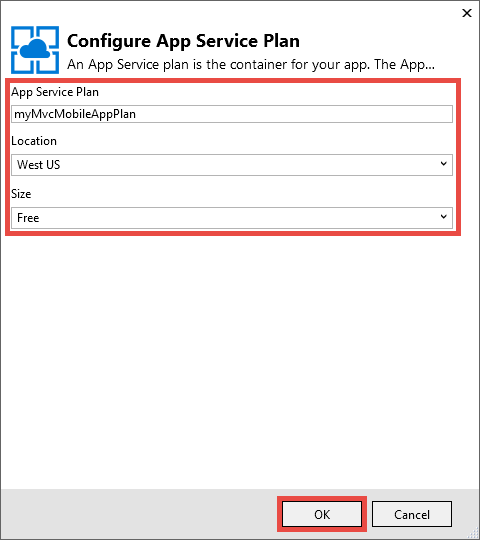

<properties 
    pageTitle="Implantar um aplicativo web móvel do ASP.NET MVC 5 no serviço de aplicativo do Azure" 
    description="Um tutorial que ensina a implantar um aplicativo web para o serviço de aplicativo do Azure usando recursos móveis no aplicativo web do ASP.NET MVC 5." 
    services="app-service" 
    documentationCenter=".net" 
    authors="cephalin" 
    manager="wpickett" 
    editor="jimbe"/>

<tags 
    ms.service="app-service" 
    ms.workload="na" 
    ms.tgt_pltfrm="na" 
    ms.devlang="dotnet" 
    ms.topic="article" 
    ms.date="01/12/2016" 
    ms.author="cephalin;riande"/>

# Implantar um aplicativo web móvel do ASP.NET MVC 5 no serviço de aplicativo do Azure

Este tutorial ensina as Noções básicas de como criar um aplicativo web ASP.NET MVC 5 que seja amigáveis para dispositivos móveis e implantá-lo para o serviço de aplicativo do Azure. Para este tutorial, você precisa [Visual Studio Express 2013 para Web] [ Visual Studio Express 2013] ou a professional edition do Visual Studio se você já tiver que. Você pode usar o [Visual Studio de 2015] , mas as capturas de tela serão diferentes e você deve usar os modelos de 4. x do ASP.NET.

[AZURE.INCLUDE [create-account-and-websites-note](../../includes/create-account-and-websites-note.md)]

## O que você vai criar

Para este tutorial, você adicionará recursos móveis para o aplicativo de listagem de conferência simple que é fornecido no [projeto starter][StarterProject]. A captura de tela a seguir mostra as sessões do ASP.NET no aplicativo concluído, conforme visto no emulador navegador nas ferramentas de desenvolvedor do Internet Explorer 11 F12.

![][FixedSessionsByTag]

Você pode usar as ferramentas de desenvolvedor do Internet Explorer 11 F12 e a [ferramenta Fiddler] [ Fiddler] para ajudar a depurar seu aplicativo. 

## Habilidades que você aprenderá

Veja aqui o que você aprenderá:

-   Como usar o Visual Studio 2013 para publicar seu aplicativo web diretamente para um aplicativo web no serviço de aplicativo do Azure.
-   Como os modelos do ASP.NET MVC 5 usam a estrutura de inicialização de CSS para melhorar a exibição em dispositivos móveis
-   Como criar modos de exibição específicas para dispositivos móveis para navegadores de dispositivos móveis específico, como o iPhone e o Android de destino
-   Como criar modos de exibição de responder (modos de exibição que respondem a navegadores diferentes nos dispositivos)

## Configurar o ambiente de desenvolvimento

Configurar o ambiente de desenvolvimento instalando o SDK do Azure para .NET 2.5.1 ou posterior. 

1. Para instalar o SDK do Azure para .NET, clique no link abaixo. Se você não tiver o Visual 2013 Studio ainda instalado, ele será instalado pelo link. Este tutorial requer Visual Studio 2013. [SDK do Azure para Visual Studio 2013][AzureSDKVs2013]
1. Na janela do Web Platform Installer, clique em **instalar** e prossiga com a instalação.

Você também precisará um emulador de navegador móvel. Qualquer um dos seguintes funcionará:

-   Emulador de navegador nas [Ferramentas de desenvolvedor do Internet Explorer 11 F12] [ EmulatorIE11] (usada em todas as capturas de tela do navegador móvel). Ela tem predefinições de cadeia de caracteres de agente de usuário para Windows Phone 8, Windows Phone 7 e Apple iPad.
-   Emulador de navegador no [rolagem DevTools Google Chrome][EmulatorChrome]. Ele contém predefinições para vários dispositivos Android, bem como Apple iPhone, Apple iPad e Amazon Kindle Fire. Ele também emula eventos de toque.
-   [Emulador móvel opera][EmulatorOpera]

Projetos do Visual Studio com C\# código-fonte estão disponíveis para acompanhar este tópico:

-   [Download do projeto Starter][StarterProject]
-   [Concluído o download do projeto][CompletedProject]

##Implantar o projeto starter em um aplicativo web do Azure

1.  Baixar o aplicativo de listagem de conferência [projeto starter][StarterProject].

2.  Em seguida, no Windows Explorer, clique com botão direito no arquivo ZIP baixado e escolha *Propriedades*.

3.  Na caixa de diálogo **Propriedades** , escolha o botão **Desbloquear** . (Desbloquear impede que um aviso de segurança que ocorre quando você tenta usar um arquivo *. zip* que você baixou da web.)

4.  Clique com botão direito no arquivo ZIP e selecione **Extrair tudo** para descompactar o arquivo. 

5.  No Visual Studio, abra o arquivo *C#\Mvc5Mobile.sln* .

6.  No Solution Explorer, clique com botão direito do projeto e clique em **Publicar**.

    ![][DeployClickPublish]

7.  Em Publicar Web, clique em **Serviço de aplicativo do Microsoft Azure**.

    ![][DeployClickWebSites]

8.  Se você ainda não estiver conectado ao Azure, clique em **Adicionar uma conta**.

    ![][DeploySignIn]

9.  Siga os prompts para entrar na sua conta do Azure.

11. A caixa de diálogo do serviço de aplicativo agora deve mostrar como conectado. Clique em **novo**.

    ![][DeployNewWebsite]  

12. No campo **Nome do aplicativo da Web** , especifique um prefixo de nome de aplicativo exclusiva. Seu nome de aplicativo web totalmente qualificado será * &lt;prefixo >*. azurewebsites.net. Além disso, selecione ou especifique um novo nome de grupo de recursos no **grupo de recursos**. Em seguida, clique em **novo** para criar um novo plano de serviço de aplicativo.

    ![][DeploySiteSettings]

13. Configurar o novo plano de serviço de aplicativo e clique em **Okey**. 

    

13. Novamente na caixa de diálogo Criar serviço de aplicativo, clique em **criar**.

     

13. Após o Azure recursos são criados, Publicar Web diálogo será preenchido com as configurações para seu novo aplicativo. Clique em **Publicar**.

    ![][DeployPublishSite]

    Quando Visual Studio terminar o projeto starter de publicação para o Azure web app, o navegador de desktop abre para exibir o aplicativo web ao vivo.

14. Iniciar o emulador de navegador móvel, copie a URL para o aplicativo de conferência (*<prefix>*. azurewebsites.net) para o emulador e, em seguida, clique no botão superior direito e selecione **Procurar por marca**. Se você estiver usando o Internet Explorer 11 como o navegador padrão, basta digitar `F12`, em seguida, `Ctrl+8`e, em seguida, altere o perfil do navegador para **Windows Phone**. A imagem abaixo mostra o modo de exibição de *AllTags* no modo de retrato (a partir de escolher **Procurar por marca**).

    ![][AllTags]

>[AZURE.TIP] Enquanto você pode depurar seu aplicativo MVC 5 de dentro do Visual Studio, você pode publicar seu aplicativo web para o Azure novamente para verificar se o aplicativo web ao vivo diretamente do seu navegador móvel ou um emulador de navegador.

A exibição está muito legível em um dispositivo móvel. Você também já pode ver alguns dos efeitos visuais aplicados pela estrutura CSS de inicialização.
Clique no link do **ASP.NET** .

![][SessionsByTagASP.NET]

O modo de exibição de marca do ASP.NET é ajustados de zoom para a tela que inicialização faz automaticamente para você. No entanto, você pode melhorar este modo de exibição para melhor atender às navegador móvel. Por exemplo, a coluna **Data** é difícil de ler. Mais tarde no tutorial, você definirá o modo de exibição de *AllTags* para torná-la amigáveis para dispositivos móveis.

##Estrutura de inicialização de CSS

Novidade no 5 MVC modelo é suporte de inicialização interno. Você já viu como ele melhora os diferentes modos de exibição em seu aplicativo imediatamente. Por exemplo, na barra de navegação na parte superior é automaticamente recolhível quando a largura de navegador é menor. No navegador da área de trabalho, tente redimensionamento da janela do navegador e veja como a barra de navegação muda sua aparência. Este é o design de web responde interna do inicialização.

Para ver como o aplicativo Web ficaria sem inicialização, abra *aplicativo\_iniciar\\BundleConfig.cs* e comente as linhas que contêm *bootstrap.js* e *bootstrap.css*. O código a seguir mostra as declarações de dois últimos a `RegisterBundles` método após a alteração:

     bundles.Add(new ScriptBundle("~/bundles/bootstrap").Include(
              //"~/Scripts/bootstrap.js",
              "~/Scripts/respond.js"));

    bundles.Add(new StyleBundle("~/Content/css").Include(
              //"~/Content/bootstrap.css",
              "~/Content/site.css"));

Pressione `Ctrl+F5` para executar o aplicativo.

Observe que a barra de navegação recolhível agora é apenas uma lista não ordenada comum. Clique em **Procurar por marca** novamente, clique em **ASP.NET**.
No modo de exibição móvel emulador, você pode ver agora que ele não está mais zoom ajustados para a tela, e você deve rolar para os lados para ver o lado direito da tabela.

![][SessionsByTagASP.NETNoBootstrap]

Desfazer suas alterações e atualize o navegador móvel para verificar que a exibição de dispositivos móveis foi restaurada.

Inicialização não é específica para ASP.NET MVC 5 e que você possa aproveitar esses recursos em qualquer aplicativo web. Mas agora está incorporada ao modelo de projeto ASP.NET MVC 5, para que seu aplicativo da Web de 5 MVC possa aproveitar inicialização por padrão.

Para obter mais informações sobre a inicialização, vá para a [inicialização] [ BootstrapSite] site.

Na próxima seção, você verá como fornecer modos de exibição específico de navegador móvel.

##Substituir os modos de exibição, Layouts e modos de exibição parciais

Você pode substituir qualquer modo de exibição (incluindo layouts e modos de exibição parciais) para navegadores de dispositivos móveis em geral, em um navegador móvel individual ou em qualquer navegador específico. Para fornecer um modo de exibição específicas para dispositivos móveis, você pode copiar um arquivo de modo de exibição e adicionar *. Mobile* ao nome do arquivo. Por exemplo, para criar um modo de exibição móvel do *índice* , você pode copiar *modos de exibição\\Home\\cshtml* para *modos de exibição\\Home\\Index.Mobile.cshtml*.

Nesta seção, você vai criar um arquivo de layout específicas para dispositivos móveis.

Para começar, copie *modos de exibição\\compartilhado\\\_Layout.cshtml* para *modos de exibição\\compartilhado\\\_Layout.Mobile.cshtml*. Abrir * \_Layout.Mobile.cshtml* e alterar o título do **Aplicativo de MVC5** para **O aplicativo de MVC5 (celular)**.

Em cada `Html.ActionLink` ligar para a barra de navegação, remova "Procurar por" em cada link *ActionLink*. O código a seguir mostra o concluído `<ul class="nav navbar-nav">` marca do arquivo layout móvel.

    <ul class="nav navbar-nav">
        <li>@Html.ActionLink("Home", "Index", "Home")</li>
        <li>@Html.ActionLink("Date", "AllDates", "Home")</li>
        <li>@Html.ActionLink("Speaker", "AllSpeakers", "Home")</li>
        <li>@Html.ActionLink("Tag", "AllTags", "Home")</li>
    </ul>

Copiar o *modos de exibição\\Home\\AllTags.cshtml* arquivo para *modos de exibição\\Home\\AllTags.Mobile.cshtml*. Abrir o novo arquivo e altere o `<h2>` elemento das "Marcas" para "marcas (M)":

    <h2>Tags (M)</h2>

Navegue até a página de marcas usando um navegador de desktop e emulador de navegador móvel. O emulador de navegador móvel mostra as duas alterações feitas (o título do * \_Layout.Mobile.cshtml* e o cargo do *AllTags.Mobile.cshtml*).

![][AllTagsMobile_LayoutMobile]

Em contraste, a exibição da área de trabalho não foi alterado (com títulos de * \_Layout.cshtml* e *AllTags.cshtml*).

![][AllTagsMobile_LayoutMobileDesktop]

##Criar modos de exibição de navegador específico

Além dos modos de exibição móvel-específicas e de área de trabalho, você pode criar modos de exibição para um navegador individual. Por exemplo, você pode criar modos de exibição que são especificamente para iPhone ou o navegador Android. Nesta seção, você vai criar um layout para o navegador de iPhone e uma versão de iPhone da exibição *AllTags* .

Abra o arquivo *asax* e adicione o seguinte código na parte inferior da `Application_Start` método.

    DisplayModeProvider.Instance.Modes.Insert(0, new DefaultDisplayMode("iPhone")
    {
        ContextCondition = (context => context.GetOverriddenUserAgent().IndexOf
            ("iPhone", StringComparison.OrdinalIgnoreCase) >= 0)
    });

Este código define um novo modo de exibição chamado "iPhone" que será comparado com cada solicitação de entrada. Se a solicitação de entrada corresponde a condição que você definiu (isto é, se o agente de usuário contém a cadeia de caracteres "iPhone"), o ASP.NET MVC procurará modos de exibição cujo nome contém o sufixo "iPhone".

>[AZURE.NOTE] Ao adicionar modos de exibição de navegador específico móvel, como para iPhone e Android, certifique-se de definir o primeiro argumento `0` (inserir na parte superior da lista) para certificar-se de que o modo de navegador específico tem precedência sobre o modelo móvel (*. Cshtml). Se o modelo móvel está na parte superior da lista, em vez disso, ele será selecionado em seu modo de exibição desejado (o primeiro vence de correspondência e o modelo de móvel corresponde a todos os navegadores móveis). 

No código, clique com botão direito `DefaultDisplayMode`, escolha **resolver**e escolha `using System.Web.WebPages;`. Isso adiciona uma referência para o `System.Web.WebPages` namespace, que é onde o `DisplayModeProvider` e `DefaultDisplayMode` tipos são definidos.

![][ResolveDefaultDisplayMode]

Como alternativa, você pode adicionar apenas manualmente a seguinte linha a `using` seção do arquivo.

    using System.Web.WebPages;

Salve as alterações. Copiar o *modos de exibição\\compartilhado\\\_Layout.Mobile.cshtml* arquivo para *modos de exibição\\compartilhado\\\_Layout.iPhone.cshtml*. Abrir o novo arquivo e, em seguida, altere o título do `MVC5 Application (Mobile)` para `MVC5 Application (iPhone)`.

Copiar o *modos de exibição\\Home\\AllTags.Mobile.cshtml* arquivo para *modos de exibição\\Home\\AllTags.iPhone.cshtml*. No novo arquivo, altere o `<h2>` elemento de "marcas (M)" a "Marcas (iPhone)".

Execute o aplicativo. Executar um emulador de navegador móvel, verifique se que seu agente de usuário é definido como "iPhone" e navegue até o modo de exibição de *AllTags* . Se você estiver usando o emulador em ferramentas de desenvolvedor do Internet Explorer 11 F12, configure emulação ao seguinte:

-   Perfil de navegador = **Windows Phone**
-   Cadeia de caracteres de agente de usuário = **personalizada**
-   Cadeia de caracteres personalizada = **Apple-iPhone5C1/1001.525**

A captura de tela a seguir mostra o modo de *AllTags* processado no emulador em ferramentas de desenvolvedor do Internet Explorer 11 F12 com a cadeia de caracteres de agente de usuário personalizada (essa é uma cadeia de caracteres do agente de usuário do iPhone 5 C).

![][AllTagsIPhone_LayoutIPhone]

No navegador móvel, selecione o link de **alto-falantes** . Porque não há um modo de exibição móvel (*AllSpeakers.Mobile.cshtml*), o modo de alto-falantes de padrão (*AllSpeakers.cshtml*) é renderizado utilizando o modo de exibição de layout móvel (*\_Layout.Mobile.cshtml*). Como mostrado abaixo, o título do **Aplicativo de MVC5 (Mobile)** é definido em * \_Layout.Mobile.cshtml*.

![][AllSpeakers_LayoutMobile]

Você globalmente pode desativar o modo de exibição padrão (não-móvel) de renderização dentro de um layout para dispositivos móveis, definindo `RequireConsistentDisplayMode` para `true` no *modos de exibição\\\_ViewStart.cshtml* arquivo, assim:

    @{
        Layout = "~/Views/Shared/_Layout.cshtml";
        DisplayModeProvider.Instance.RequireConsistentDisplayMode = true;
    }

Quando `RequireConsistentDisplayMode` está definida como `true`, o layout móvel (*\_Layout.Mobile.cshtml*) são usadas apenas para visualizações móveis (isto é, quando o arquivo de exibição do formulário * **ViewName**. Cshtml*). Talvez você queira definir `RequireConsistentDisplayMode` para `true` se seu layout móvel não funcionar bem com modos de exibição do não-móvel. Captura de tela abaixo mostra como a página de *alto-falantes* processa quando `RequireConsistentDisplayMode` está definida como `true` (sem a cadeia de caracteres "(Mobile)" na barra de navegação na parte superior).

![][AllSpeakers_LayoutMobileOverridden]

Você pode desativar o modo de exibição consistente em um modo específico, definindo `RequireConsistentDisplayMode` para `false` no arquivo de modo de exibição. A seguinte marcação na *modos de exibição\\Home\\AllSpeakers.cshtml* arquivo define `RequireConsistentDisplayMode` para `false`:

    @model IEnumerable<string>

    @{
        ViewBag.Title = "All speakers";
        DisplayModeProvider.Instance.RequireConsistentDisplayMode = false;
    }

Nesta seção, podemos viu como criar visualizações e layouts móveis e como criar layouts e modos de exibição para dispositivos específicos, como o iPhone.
Entretanto, a principal vantagem do framework inicialização CSS é o layout responde, o que significa que uma única folha de estilos pode ser aplicada em área de trabalho, telefone e tablet navegadores para criar uma aparência consistente. Na próxima seção, você verá como aproveitar inicialização para criar modos de exibição de dispositivos móveis.

##Melhorar a lista de alto-falantes

Como você acabou de ver, o modo de exibição de *alto-falantes* é legível, mas os links são pequenos e são difíceis de toque em um dispositivo móvel. Nesta seção, você vai fazer o modo de exibição de *AllSpeakers* amigáveis para dispositivos móveis, que exibe links grandes e fácil para toque e contém uma caixa de pesquisa para localizar rapidamente os alto-falantes.

Você pode usar o estilo de [grupo de lista vinculada][] de inicialização para melhorar o modo de exibição de *alto-falantes* . No *modos de exibição\\Home\\AllSpeakers.cshtml*, substitua o conteúdo do arquivo Razor com o código a seguir.

     @model IEnumerable<string>

    @{
        ViewBag.Title = "All Speakers";
    }

    <h2>Speakers</h2>

    

        @foreach (var speaker in Model)
        {
            @Html.ActionLink(speaker, "SessionsBySpeaker", new { speaker }, new { @class = "list-group-item" })
        }
    

O `class="list-group"` atributo na `
` marca aplica o estilo de lista de inicialização e o `class="input-group-item"` atributo aplica estilos de item de lista de inicialização para cada link.

Atualize o navegador móvel. O modo de exibição atualizado tem esta aparência:

![][AllSpeakersFixed]

O estilo de [grupo de lista vinculada][] de inicialização torna a caixa inteira para cada link clicável, que é uma experiência de usuário muito melhor. Alternar para o modo de exibição da área de trabalho e observe a aparência consistente.

![][AllSpeakersFixedDesktop]

Embora o modo de exibição de navegador móvel foi aprimorada é difícil navegar na lista longa de alto-falantes. Inicialização não oferece uma pesquisa filtro funcionalidade-de-prontos, mas você pode adicioná-lo com algumas linhas de código. Primeiro você irá adicionar uma caixa de pesquisa no modo de exibição, e associar o código JavaScript para a função de filtro. No *modos de exibição\\Home\\AllSpeakers.cshtml*, adicione uma \<formulário\> marca logo após o \<h2\> marca, conforme mostrado abaixo:

    @model IEnumerable<string>

    @{
        ViewBag.Title = "All Speakers";
    }

    <h2>Speakers</h2>

    <form class="input-group">
        
        <input type="text" class="form-control" placeholder="Search speaker">
    </form>
     
    

        @foreach (var speaker in Model)
        {
            @Html.ActionLink(speaker, 
                             "SessionsBySpeaker", 
                             new { speaker }, 
                             new { @class = "list-group-item" })
        }
    

Observe que o `<form>` e `<input>` ambas as marcas têm os estilos de inicialização aplicados a eles. O `` elemento adiciona uma inicialização [glyphicon][] à caixa de pesquisa.

Na pasta *Scripts* , adicione um arquivo JavaScript denominado *filter.js*. Abra o arquivo e cole o seguinte código nele:

    $(function () {

        // reset the search form when the page loads
        $("form").each(function () {
            this.reset();
        });

        // wire up the events to the <input> element for search/filter
        $("input").bind("keyup change", function () {
            var searchtxt = this.value.toLowerCase();
            var items = $(".list-group-item");

            // show all speakers that begin with the typed text and hide others
            for (var i = 0; i < items.length; i++) {
                var val = items[i].text.toLowerCase();
                val = val.substring(0, searchtxt.length);
                if (val == searchtxt) {
                    $(items[i]).show();
                }
                else {
                    $(items[i]).hide();
                }
            }
        });
    });

Você também precisa incluir filter.js em seus pacotes registrados. Abrir *aplicativo\_iniciar\\BundleConfig.cs* e altere os pacotes primeiro. Alterar a primeira `bundles.Add` instrução (para o pacote de **jquery** ) para incluir *Scripts\\filter.js*, da seguinte maneira:

     bundles.Add(new ScriptBundle("~/bundles/jquery").Include(
                "~/Scripts/jquery-{version}.js",
                "~/Scripts/filter.js"));

O pacote de **jquery** já é processado pelo padrão * \_Layout* modo de exibição. Posteriormente, você pode utilizar o mesmo código JavaScript para aplicar a funcionalidade do filtro em outros modos de exibição de lista.

Atualize o navegador móvel e vá para o modo de exibição de *AllSpeakers* . Na caixa Pesquisar, digite "sc". A lista de alto-falantes agora deve ser filtrada de acordo com a sua cadeia de caracteres de pesquisa.

![][AllSpeakersFixedSearchBySC]

##Melhorar a lista de marcas

Como o modo de exibição de *alto-falantes* , o modo de exibição de *marcas* é legível, mas os links são pequeno e difícil de toque em um dispositivo móvel. Você pode corrigir o modo de exibição de *marcas* da mesma maneira que você corrigir o modo de exibição de *alto-falantes* , se você usa as alterações de código descritas anteriormente, mas com as seguintes `Html.ActionLink` sintaxe de método em *modos de exibição\\Home\\AllTags.cshtml*:

    @Html.ActionLink(tag, 
                     "SessionsByTag", 
                     new { tag }, 
                     new { @class = "list-group-item" })

Navegador de desktop atualizado tem a seguinte aparência:

![][AllTagsFixedDesktop]

E o navegador móvel atualizado tem a seguinte aparência: 

![][AllTagsFixed]

>[AZURE.NOTE] Se você perceber que a formatação de lista original ainda está lá no navegador móvel e saber o que aconteceu com o estilo de inicialização lindas, isso é um produto de sua ação anterior para criar visualizações específicas móveis. No entanto, agora que você estiver usando o framework de CSS de inicialização para criar um design de web responde, vá cabeça e remova essas exibições específicas para dispositivos móveis e os modos de exibição de layout de específicas para dispositivos móveis. Quando você tiver feito isso, atualizado navegador móvel mostrará o estilo de inicialização.

##Melhorar a lista de datas

Você pode melhorar o modo de exibição de *datas* como os modos de exibição de *alto-falantes* e *marcas* é aprimorado se você usa as alterações de código descritas anteriormente, mas com as seguintes `Html.ActionLink` sintaxe de método em *modos de exibição\\Home\\AllDates.cshtml*:

    @Html.ActionLink(date.ToString("ddd, MMM dd, h:mm tt"), 
                     "SessionsByDate", 
                     new { date }, 
                     new { @class = "list-group-item" })

Você receberá um modo de exibição de navegador móvel atualizados assim:

![][AllDatesFixed]

Você pode melhorar ainda mais o modo de exibição de *datas* , organizando os valores de data e hora por data. Isso pode ser feito com o estilo de inicialização [painéis][] . Substitua o conteúdo da *modos de exibição\\Home\\AllDates.cshtml* arquivo com o seguinte código:

    @model IEnumerable<DateTime>

    @{
        ViewBag.Title = "All Dates";
    }

    <h2>Dates</h2>

    @foreach (var dategroup in Model.GroupBy(x=>x.Date))
    {
        

            

                @dategroup.Key.ToString("ddd, MMM dd")
            

            

                @foreach (var date in dategroup)
                {
                    @Html.ActionLink(date.ToString("h:mm tt"), 
                                     "SessionsByDate", 
                                     new { date }, 
                                     new { @class = "list-group-item" })
                }
            

        

    }

Esse código cria um separado `
` marca para cada data distinta na lista e usa o [grupo de lista vinculada][] para os respectivos links como antes. Veja como fica o navegador móvel quando esse código é executado:

![][AllDatesFixed2]

Alternar para o navegador de desktop. Novamente, observe a aparência consistente.

![][AllDatesFixed2Desktop]

##Melhorar o modo de exibição de SessionsTable

Nesta seção, você vai fazer o modo de exibição de *SessionsTable* mais amigáveis para dispositivos móveis. Essa alteração é mais extensa as alterações anteriores.

No navegador móvel, toque no botão de **marca** , depois digite `asp` na caixa de pesquisa.

![][AllTagsFixedSearchByASP]

Toque no link do **ASP.NET** .

![][SessionsTableTagASP.NET]

Como você pode ver, a exibição é formatada como uma tabela, que atualmente foi projetada para ser exibido no navegador de desktop. No entanto, é um pouco difícil de ler em um navegador móvel. Para corrigir isso, abra *modos de exibição\\Home\\SessionsTable.cshtml* e substituir o conteúdo do arquivo com o seguinte código:

    @model IEnumerable<Mvc5Mobile.Models.Session>

    <h2>@ViewBag.Title</h2>

    

        

            @foreach (var session in Model)
            {
                

                    

                        @Html.ActionLink(session.Title, 
                                         "SessionByCode", 
                                         new { session.Code }, 
                                         new { @class="list-group-item active" })
                        

                            

                                @Html.Partial("_SpeakersLinks", session)
                            

                            

                                @session.DateText
                            

                            

                                @Html.Partial("_TagsLinks", session)
                            

                        

                    

                

            }
        

    

O código faz 3 coisas:

-   usa o [grupo personalizado lista vinculada][] de inicialização para formatar as informações da sessão verticalmente, para que todas essas informações são legíveis em um navegador móvel (usando classes como lista grupo-item-texto)
-   aplica o [sistema de grade][] para o layout, para que os itens de sessão fluem horizontalmente no navegador de desktop e verticalmente no navegador móvel (usando a classe de col-md-4)
-   usa os [utilitários responde][] para ocultar as marcas de sessão quando exibida no navegador móvel (usando a classe de oculto-x)

Você também pode tocar um link de título para ir para a sessão respectiva. A imagem abaixo reflete as alterações de código.

![][FixedSessionsByTag]

O sistema de grade de inicialização que você aplicou automaticamente Organiza as sessões verticalmente no navegador móvel. Observe também que as marcas não são mostradas. Alternar para o navegador de desktop.

![][SessionsTableFixedTagASP.NETDesktop]

No navegador de desktop, observe que as marcas agora são exibidas. Além disso, você pode ver que o sistema de grade de inicialização que você aplicou organiza os itens de sessão em duas colunas. Se você ampliar o navegador, você verá que a organização muda para três colunas.

##Melhorar o modo de exibição de SessionByCode

Por fim, você corrigirá o modo de exibição de *SessionByCode* para torná-la amigáveis para dispositivos móveis.

No navegador móvel, toque no botão de **marca** , depois digite `asp` na caixa de pesquisa.

![][AllTagsFixedSearchByASP]

Toque no link do **ASP.NET** . Sessões para a marca do ASP.NET são exibidas.

![][FixedSessionsByTag]

Escolha o link **Criando um aplicativo de página única com ASP.NET e AngularJS** .

![][SessionByCode3-644]

O modo de área de trabalho padrão é pequeno, mas você pode melhorar a aparência facilmente usando alguns componentes de interface gráfica de inicialização.

Abrir *modos de exibição\\Home\\SessionByCode.cshtml* e substituir o conteúdo com a marcação a seguir:

    @model Mvc5Mobile.Models.Session

    @{
        ViewBag.Title = "Session details";
    }
    <h3>@Model.Title (@Model.Code)</h3>
    

        <strong>@Model.DateText</strong> in <strong>@Model.Room</strong>
    

    

        

            Speakers
        

        @foreach (var speaker in Model.Speakers)
        {
            @Html.ActionLink(speaker, 
                             "SessionsBySpeaker", 
                             new { speaker }, 
                             new { @class="panel-body" })
        }
    

    
@Model.Abstract

    

        

            Tags
        

        @foreach (var tag in Model.Tags)
        {
            @Html.ActionLink(tag, 
                             "SessionsByTag", 
                             new { tag }, 
                             new { @class = "panel-body" })
        }
    

A nova marcação usa inicialização painéis estilos para melhorar o modo de exibição móvel. 

Atualize o navegador móvel. A imagem a seguir reflete as alterações de código que você acabou de criar:

![][SessionByCodeFixed3-644]

## Resumir e analisar

Este tutorial demonstrou como usar ASP.NET MVC 5 para desenvolver aplicativos da Web de dispositivos móveis. Eles incluem:

-   Implantar um aplicativo do ASP.NET MVC 5 em um serviço de aplicativo web app
-   Usar inicialização para criar o layout da web responde em seu aplicativo MVC 5
-   Substituir o layout, modos de exibição e modos de exibição parciais, tanto globalmente para um modo de exibição individual
-   Layout de controle e parcial substituam imposição usando o `RequireConsistentDisplayMode` propriedade
-   Criar modos de exibição que têm como alvo navegadores específicos, como o navegador do iPhone
-   Aplicar estilos de inicialização no código do Razor

## Consulte também

-   [9 princípios básicos do design da web responde](http://blog.froont.com/9-basic-principles-of-responsive-web-design/)
-   [Inicialização][BootstrapSite]
-   [Blog oficial de inicialização][]
-   [Tutorial de inicialização Twitter do Tutorial República][]
-   [O espaço de inicialização][]
-   [Práticas recomendadas do aplicativo W3C recomendação Web móvel][]
-   [Recomendação de candidatos W3C para consultas de mídia][]

## O que mudou
* Para um guia para a alteração de sites para o serviço de aplicativo consulte: [o serviço de aplicativo do Azure e seu impacto sobre serviços existentes do Azure](http://go.microsoft.com/fwlink/?LinkId=529714)

<!-- Internal Links -->
[Deploy the starter project to an Azure web app]: #bkmk_DeployStarterProject
[Bootstrap CSS Framework]: #bkmk_bootstrap
[Override the Views, Layouts, and Partial Views]: #bkmk_overrideviews
[Create Browser-Specific Views]:#bkmk_browserviews
[Improve the Speakers List]: #bkmk_Improvespeakerslist
[Improve the Tags List]: #bkmk_improvetags
[Improve the Dates List]: #bkmk_improvedates
[Improve the SessionsTable View]: #bkmk_improvesessionstable
[Improve the SessionByCode View]: #bkmk_improvesessionbycode

<!-- External Links -->
[Visual Studio Express 2013]: http://www.visualstudio.com/downloads/download-visual-studio-vs#d-express-web
[Visual Studio de 2015]: https://www.visualstudio.com/downloads/download-visual-studio-vs
[AzureSDKVs2013]: http://go.microsoft.com/fwlink/p/?linkid=323510&clcid=0x409
[Fiddler]: http://www.fiddler2.com/fiddler2/
[EmulatorIE11]: http://msdn.microsoft.com/library/ie/dn255001.aspx
[EmulatorChrome]: https://developers.google.com/chrome-developer-tools/docs/mobile-emulation
[EmulatorOpera]: http://www.opera.com/developer/tools/mobile/
[StarterProject]: http://go.microsoft.com/fwlink/?LinkID=398780&clcid=0x409
[CompletedProject]: http://go.microsoft.com/fwlink/?LinkID=398781&clcid=0x409
[BootstrapSite]: http://getbootstrap.com/
[WebPIAzureSdk23NetVS13]: ./media/web-sites-dotnet-deploy-aspnet-mvc-mobile-app/WebPIAzureSdk23NetVS13.png
[grupo de lista vinculada]: http://getbootstrap.com/components/#list-group-linked
[glyphicon]: http://getbootstrap.com/components/#glyphicons
[painéis]: http://getbootstrap.com/components/#panels
[grupo de lista vinculada personalizada]: http://getbootstrap.com/components/#list-group-custom-content
[sistema de grade]: http://getbootstrap.com/css/#grid
[utilitários de resposta]: http://getbootstrap.com/css/#responsive-utilities
[Blog oficial de inicialização]: http://blog.getbootstrap.com/
[Tutorial de inicialização Twitter do Tutorial República]: http://www.tutorialrepublic.com/twitter-bootstrap-tutorial/
[O espaço de inicialização]: http://www.bootply.com/
[Práticas recomendadas do aplicativo W3C recomendação Web móvel]: http://www.w3.org/TR/mwabp/
[Recomendação de candidatos W3C para consultas de mídia]: http://www.w3.org/TR/css3-mediaqueries/

<!-- Images -->
[DeployClickPublish]: ./media/web-sites-dotnet-deploy-aspnet-mvc-mobile-app/deploy-to-azure-website-1.png
[DeployClickWebSites]: ./media/web-sites-dotnet-deploy-aspnet-mvc-mobile-app/deploy-to-azure-website-2.png
[DeploySignIn]: ./media/web-sites-dotnet-deploy-aspnet-mvc-mobile-app/deploy-to-azure-website-3.png
[DeployUsername]: ./media/web-sites-dotnet-deploy-aspnet-mvc-mobile-app/deploy-to-azure-website-4.png
[DeployPassword]: ./media/web-sites-dotnet-deploy-aspnet-mvc-mobile-app/deploy-to-azure-website-5.png
[DeployNewWebsite]: ./media/web-sites-dotnet-deploy-aspnet-mvc-mobile-app/deploy-to-azure-website-6.png
[DeploySiteSettings]: ./media/web-sites-dotnet-deploy-aspnet-mvc-mobile-app/deploy-to-azure-website-7.png
[DeployPublishSite]: ./media/web-sites-dotnet-deploy-aspnet-mvc-mobile-app/deploy-to-azure-website-8.png
[MobileHomePage]: ./media/web-sites-dotnet-deploy-aspnet-mvc-mobile-app/mobile-home-page.png
[FixedSessionsByTag]: ./media/web-sites-dotnet-deploy-aspnet-mvc-mobile-app/SessionsByTag-ASP.NET-Fixed.png
[AllTags]: ./media/web-sites-dotnet-deploy-aspnet-mvc-mobile-app/AllTags.png
[SessionsByTagASP.NET]: ./media/web-sites-dotnet-deploy-aspnet-mvc-mobile-app/SessionsByTag-ASP.NET.png
[SessionsByTagASP.NETNoBootstrap]: ./media/web-sites-dotnet-deploy-aspnet-mvc-mobile-app/SessionsByTag-ASP.NET-NoBootstrap.png
[AllTagsMobile_LayoutMobile]: ./media/web-sites-dotnet-deploy-aspnet-mvc-mobile-app/AllTagsMobile-_LayoutMobile.png
[AllTagsMobile_LayoutMobileDesktop]: ./media/web-sites-dotnet-deploy-aspnet-mvc-mobile-app/AllTagsMobile-_LayoutMobile-Desktop.png
[ResolveDefaultDisplayMode]: ./media/web-sites-dotnet-deploy-aspnet-mvc-mobile-app/Resolve-DefaultDisplayMode.png
[AllTagsIPhone_LayoutIPhone]: ./media/web-sites-dotnet-deploy-aspnet-mvc-mobile-app/AllTagsIPhone-_LayoutIPhone.png
[AllSpeakers_LayoutMobile]: ./media/web-sites-dotnet-deploy-aspnet-mvc-mobile-app/AllSpeakers-_LayoutMobile.png
[AllSpeakers_LayoutMobileOverridden]: ./media/web-sites-dotnet-deploy-aspnet-mvc-mobile-app/AllSpeakers-_LayoutMobile-Overridden.png
[AllSpeakersFixed]: ./media/web-sites-dotnet-deploy-aspnet-mvc-mobile-app/AllSpeakers-Fixed.png
[AllSpeakersFixedDesktop]: ./media/web-sites-dotnet-deploy-aspnet-mvc-mobile-app/AllSpeakers-Fixed-Desktop.png
[AllSpeakersFixedSearchBySC]: ./media/web-sites-dotnet-deploy-aspnet-mvc-mobile-app/AllSpeakers-Fixed-SearchBySC.png
[AllTagsFixedDesktop]: ./media/web-sites-dotnet-deploy-aspnet-mvc-mobile-app/AllTags-Fixed-Desktop.png 
[AllTagsFixed]: ./media/web-sites-dotnet-deploy-aspnet-mvc-mobile-app/AllTags-Fixed.png
[AllDatesFixed]: ./media/web-sites-dotnet-deploy-aspnet-mvc-mobile-app/AllDates-Fixed.png
[AllDatesFixed2]: ./media/web-sites-dotnet-deploy-aspnet-mvc-mobile-app/AllDates-Fixed2.png
[AllDatesFixed2Desktop]: ./media/web-sites-dotnet-deploy-aspnet-mvc-mobile-app/AllDates-Fixed2-Desktop.png
[AllTagsFixedSearchByASP]: ./media/web-sites-dotnet-deploy-aspnet-mvc-mobile-app/AllTags-Fixed-SearchByASP.png
[SessionsTableTagASP.NET]: ./media/web-sites-dotnet-deploy-aspnet-mvc-mobile-app/SessionsTable-Tag-ASP.NET.png
[SessionsTableFixedTagASP.NETDesktop]: ./media/web-sites-dotnet-deploy-aspnet-mvc-mobile-app/SessionsTable-Fixed-Tag-ASP.NET-Desktop.png
[SessionByCode3-644]: ./media/web-sites-dotnet-deploy-aspnet-mvc-mobile-app/SessionByCode-3-644.png
[SessionByCodeFixed3-644]: ./media/web-sites-dotnet-deploy-aspnet-mvc-mobile-app/SessionByCode-Fixed-3-644.png
 
