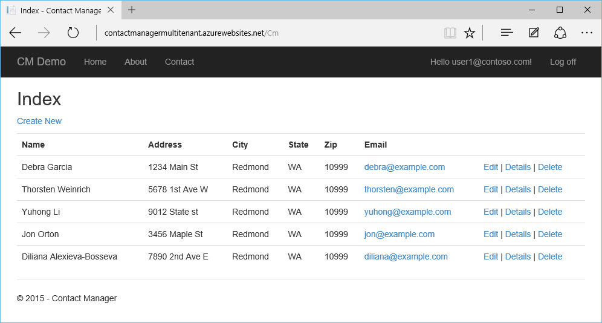

<properties
    pageTitle="Tutorial: Web app com um banco de dados de vários locatário usando a estrutura de entidade e segurança em nível de linha"
    description="Aprenda a desenvolver o aplicativo web do ASP.NET MVC 5 com um locatário vários banco de dados SQL backent, usando a estrutura de entidade e segurança em nível de linha."
  metaKeywords="azure asp.net mvc entity framework multi tenant row level security rls sql database"
    services="app-service\web"
    documentationCenter=".net"
    manager="jeffreyg"
  authors="tmullaney"/>

<tags
    ms.service="app-service-web"
    ms.workload="web"
    ms.tgt_pltfrm="na"
    ms.devlang="dotnet"
    ms.topic="article"
    ms.date="04/25/2016"
    ms.author="thmullan"/>

# <a name="tutorial-web-app-with-a-multi-tenant-database-using-entity-framework-and-row-level-security"></a>Tutorial: Web app com um banco de dados de vários locatário usando a estrutura de entidade e segurança em nível de linha

Este tutorial mostra como criar um aplicativo web do locatário vários com um modelo de aluguel "[banco de dados compartilhado, esquema compartilhado](https://msdn.microsoft.com/library/aa479086.aspx)", usando a estrutura de entidade e [Segurança em nível de linha](https://msdn.microsoft.com/library/dn765131.aspx). Nesse modelo, um banco de dados único contém dados para vários locatários e cada linha de cada tabela está associada a uma "locatário identificação." Nível de linha RLS (segurança), um novo recurso para o banco de dados do SQL Azure, é usado para impedir que os locatários acessem uns dos outros dados. Isso requer apenas uma pequena alteração única, para o aplicativo. Ao centralizar a lógica de acesso de locatários no banco de dados, RLS simplifica o código do aplicativo e reduz o risco de perda de dados acidental entre locatários.

Vamos começar com o aplicativo de Contact Manager simples de [criar um aplicativo do ASP.NET MVP com auth e DB do SQL e implantar o serviço de aplicativo do Azure](web-sites-dotnet-deploy-aspnet-mvc-app-membership-oauth-sql-database.md). Direita agora, o aplicativo permite que todos os usuários (locatários) para ver todos os contatos:



Com apenas algumas pequenas alterações, adicionaremos suporte para multilocação, para que os usuários possam ver somente os contatos que pertencem a eles.

## <a name="step-1-add-an-interceptor-class-in-the-application-to-set-the-sessioncontext"></a>Etapa 1: Adicionar uma classe interceptador no aplicativo para definir a SESSION_CONTEXT

Não há uma alteração de aplicativo que precisamos fazer. Como todos os usuários de aplicativo se conectar ao banco de dados usando a mesma cadeia de conexão (ou seja, mesmo logon SQL), não há atualmente nenhuma maneira para uma política RLS saber qual ele deve filtrar para o usuário. Essa abordagem é muito comum em aplicativos da web porque ele permite que o pool de conexão eficiente, mas isso significa que precisamos de outra maneira de identificar o usuário atual do aplicativo no banco de dados. A solução é ter o aplicativo definir um par chave-valor para o ID de usuário atual no [SESSION_CONTEXT](https://msdn.microsoft.com/library/mt590806) imediatamente depois de abrir uma conexão, antes de executar qualquer consulta. SESSION_CONTEXT é um repositório de chave-valor escopo de sessão e nossa política RLS usará a ID de usuário armazenado para identificar o usuário atual.

Adicionaremos um [interceptador](https://msdn.microsoft.com/data/dn469464.aspx) (em particular, uma [DbConnectionInterceptor](https://msdn.microsoft.com/library/system.data.entity.infrastructure.interception.idbconnectioninterceptor)), um novo recurso no entidade Framework (EF) 6, definir automaticamente a ID de usuário atual no SESSION_CONTEXT executando uma instrução T-SQL sempre EF abre uma conexão.

1.  Abra o projeto ContactManager no Visual Studio.
2.  Clique com botão direito na pasta modelos no Solution Explorer e escolha Adicionar > classe.
3.  Nomeie a nova classe "SessionContextInterceptor.cs" e clique em Adicionar.
4.  Substitua o conteúdo de SessionContextInterceptor.cs com o seguinte código.

```
using System;
using System.Collections.Generic;
using System.Linq;
using System.Web;
using System.Data.Common;
using System.Data.Entity;
using System.Data.Entity.Infrastructure.Interception;
using Microsoft.AspNet.Identity;

namespace ContactManager.Models
{
    public class SessionContextInterceptor : IDbConnectionInterceptor
    {
        public void Opened(DbConnection connection, DbConnectionInterceptionContext interceptionContext)
        {
            // Set SESSION_CONTEXT to current UserId whenever EF opens a connection
            try
            {
                var userId = System.Web.HttpContext.Current.User.Identity.GetUserId();
                if (userId != null)
                {
                    DbCommand cmd = connection.CreateCommand();
                    cmd.CommandText = "EXEC sp_set_session_context @key=N'UserId', @value=@UserId";
                    DbParameter param = cmd.CreateParameter();
                    param.ParameterName = "@UserId";
                    param.Value = userId;
                    cmd.Parameters.Add(param);
                    cmd.ExecuteNonQuery();
                }
            }
            catch (System.NullReferenceException)
            {
                // If no user is logged in, leave SESSION_CONTEXT null (all rows will be filtered)
            }
        }
        
        public void Opening(DbConnection connection, DbConnectionInterceptionContext interceptionContext)
        {
        }

        public void BeganTransaction(DbConnection connection, BeginTransactionInterceptionContext interceptionContext)
        {
        }

        public void BeginningTransaction(DbConnection connection, BeginTransactionInterceptionContext interceptionContext)
        {
        }

        public void Closed(DbConnection connection, DbConnectionInterceptionContext interceptionContext)
        {
        }

        public void Closing(DbConnection connection, DbConnectionInterceptionContext interceptionContext)
        {
        }

        public void ConnectionStringGetting(DbConnection connection, DbConnectionInterceptionContext<string> interceptionContext)
        {
        }

        public void ConnectionStringGot(DbConnection connection, DbConnectionInterceptionContext<string> interceptionContext)
        {
        }

        public void ConnectionStringSet(DbConnection connection, DbConnectionPropertyInterceptionContext<string> interceptionContext)
        {
        }

        public void ConnectionStringSetting(DbConnection connection, DbConnectionPropertyInterceptionContext<string> interceptionContext)
        {
        }

        public void ConnectionTimeoutGetting(DbConnection connection, DbConnectionInterceptionContext<int> interceptionContext)
        {
        }

        public void ConnectionTimeoutGot(DbConnection connection, DbConnectionInterceptionContext<int> interceptionContext)
        {
        }

        public void DataSourceGetting(DbConnection connection, DbConnectionInterceptionContext<string> interceptionContext)
        {
        }

        public void DataSourceGot(DbConnection connection, DbConnectionInterceptionContext<string> interceptionContext)
        {
        }

        public void DatabaseGetting(DbConnection connection, DbConnectionInterceptionContext<string> interceptionContext)
        {
        }

        public void DatabaseGot(DbConnection connection, DbConnectionInterceptionContext<string> interceptionContext)
        {
        }

        public void Disposed(DbConnection connection, DbConnectionInterceptionContext interceptionContext)
        {
        }

        public void Disposing(DbConnection connection, DbConnectionInterceptionContext interceptionContext)
        {
        }

        public void EnlistedTransaction(DbConnection connection, EnlistTransactionInterceptionContext interceptionContext)
        {
        }

        public void EnlistingTransaction(DbConnection connection, EnlistTransactionInterceptionContext interceptionContext)
        {
        }

        public void ServerVersionGetting(DbConnection connection, DbConnectionInterceptionContext<string> interceptionContext)
        {
        }

        public void ServerVersionGot(DbConnection connection, DbConnectionInterceptionContext<string> interceptionContext)
        {
        }

        public void StateGetting(DbConnection connection, DbConnectionInterceptionContext<System.Data.ConnectionState> interceptionContext)
        {
        }

        public void StateGot(DbConnection connection, DbConnectionInterceptionContext<System.Data.ConnectionState> interceptionContext)
        {
        }
    }

    public class SessionContextConfiguration : DbConfiguration
    {
        public SessionContextConfiguration()
        {
            AddInterceptor(new SessionContextInterceptor());
        }
    }
}
```

Essa é a alteração de único aplicativo obrigatória. Ir adiante e criar e publicar o aplicativo.

## <a name="step-2-add-a-userid-column-to-the-database-schema"></a>Etapa 2: Adicionar uma coluna de ID de usuário para o esquema de banco de dados

Em seguida, precisamos adicionar uma coluna de ID de usuário para a tabela de contatos para associar cada linha um usuário (Locatário). Podemos alterará o esquema diretamente no banco de dados, para que não precisamos incluir este campo em nosso modelo de dados EF.

Conectar-se ao banco de dados diretamente, usando o SQL Server Management Studio ou Visual Studio e, em seguida, execute o seguinte T SQL:

```
ALTER TABLE Contacts ADD UserId nvarchar(128)
    DEFAULT CAST(SESSION_CONTEXT(N'UserId') AS nvarchar(128))
```

Isso adiciona uma coluna de ID de usuário para a tabela de contatos. Usamos o tipo de dados nvarchar (128) para corresponder a UserIds armazenados na tabela AspNetUsers e criamos uma restrição padrão que definirá automaticamente o ID de usuário para linhas recém-inseridas seja a ID de usuário armazenado no momento no SESSION_CONTEXT.

Agora a tabela esta aparência:


Quando novos contatos são criados, eles serão atribuídos automaticamente a ID de usuário correta. Para fins de demonstração, entretanto, vamos atribuir alguns desses contatos existente para um usuário existente.

Se você criou alguns usuários no aplicativo já (por exemplo, usando local, Google ou Facebook contas), você verá na tabela AspNetUsers. A captura de tela abaixo, há apenas um usuário até o momento.


Copie a identificação de user1@contoso.com, e cole-a abaixo de instrução T-SQL. Execute esta instrução para três dos contatos associar esta ID de usuário.

```
UPDATE Contacts SET UserId = '19bc9b0d-28dd-4510-bd5e-d6b6d445f511'
WHERE ContactId IN (1, 2, 5)
```

## <a name="step-3-create-a-row-level-security-policy-in-the-database"></a>Etapa 3: Criar uma política de segurança de nível de linha no banco de dados

A última etapa é criar uma política de segurança que usa a identificação do usuário em SESSION_CONTEXT para filtrar os resultados retornados por consultas automaticamente.

Enquanto ainda conectado ao banco de dados, execute o seguinte T SQL:

```
CREATE SCHEMA Security
go

CREATE FUNCTION Security.userAccessPredicate(@UserId nvarchar(128))
    RETURNS TABLE
    WITH SCHEMABINDING
AS
    RETURN SELECT 1 AS accessResult
    WHERE @UserId = CAST(SESSION_CONTEXT(N'UserId') AS nvarchar(128))
go

CREATE SECURITY POLICY Security.userSecurityPolicy
    ADD FILTER PREDICATE Security.userAccessPredicate(UserId) ON dbo.Contacts,
    ADD BLOCK PREDICATE Security.userAccessPredicate(UserId) ON dbo.Contacts
go

```

Este código faz três coisas. Primeiro, ele cria um novo esquema como uma prática recomendada para centralizar e limitar o acesso aos objetos RLS. Em seguida, ele cria uma função de predicado que retornará '1' quando o ID de usuário de uma linha corresponde a ID de usuário no SESSION_CONTEXT. Finalmente, ele cria uma política de segurança que adiciona esta função como um filtro e um bloco predicado na tabela Contatos. O predicado de filtro faz com que as consultas para retornar somente as linhas que pertencem ao usuário atual e o predicado de bloco atua como proteção para impedir que o aplicativo nunca acidentalmente inserindo uma linha para o usuário errado.

Agora, execute o aplicativo e entrar como user1@contoso.com. Este usuário agora vê somente os contatos que estamos atribuídos a esta ID de usuário anteriormente:


Para validar isso ainda mais, tente registrar um novo usuário. Elas verão nenhum contatos, pois nenhum foram atribuídos a eles. Se criar um novo contato, ela será atribuída a eles e só poderão vê-la.

## <a name="next-steps"></a>Próximas etapas

Pronto! O web app simple do Contact Manager foi convertido em um locatário vários um onde cada usuário tem sua própria lista de contatos. Usando a segurança em nível de linha, podemos já evitar a complexidade de aplicar a lógica de acesso de locatário em nosso código de aplicativo. Essa transparência permite que o aplicativo focalizar o problema de negócios real à mão, e também reduz o risco de perca acidentalmente os dados conforme o aplicativo da Base de código crescer.

Este tutorial tem apenas superficial do que é possível com RLS. Por exemplo, é possível ter mais sofisticado ou lógica de acesso granular e ele á possível armazenar mais do que apenas a ID de usuário atual na SESSION_CONTEXT. Também é possível [integrar RLS com as bibliotecas de cliente de ferramentas de banco de dados elástica](../sql-database/sql-database-elastic-tools-multi-tenant-row-level-security.md) dar suporte a vários locatários fragmentos em uma camada de dados de escala-out.

Além dessas possibilidades, estamos também trabalhando para tornar RLS ainda melhor. Se você tiver dúvidas, ideias ou itens que você gostaria de ver, informe nos comentários. Agradecemos seus comentários!
