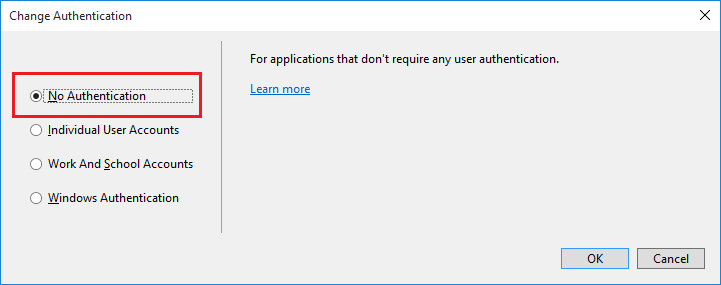
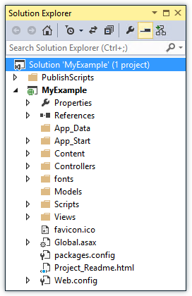
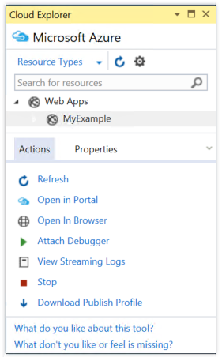
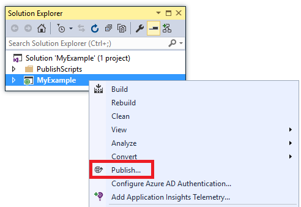
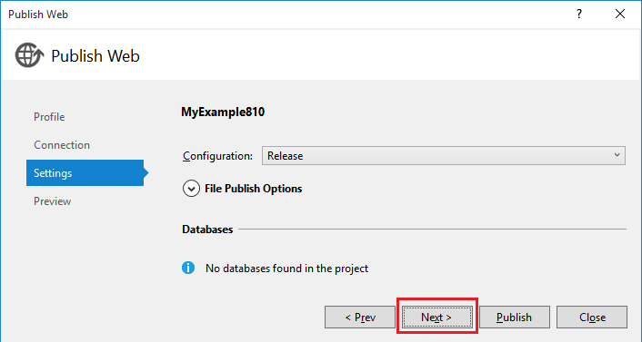

<properties
    pageTitle="Implantar um aplicativo do ASP.NET ao serviço de aplicativo do Azure usando o Visual Studio | Microsoft Azure"
    description="Saiba como implantar um projeto de web do ASP.NET para um novo aplicativo web no serviço de aplicativo do Azure, usando o Visual Studio."
    services="app-service\web"
    documentationCenter=".net"
    authors="tdykstra"
    manager="wpickett"
    editor=""/>

<tags
    ms.service="app-service-web"
    ms.workload="web"
    ms.tgt_pltfrm="na"
    ms.devlang="dotnet"
    ms.topic="get-started-article"
    ms.date="07/22/2016"
    ms.author="rachelap"/>

# Implantar um aplicativo web do ASP.NET ao serviço de aplicativo do Azure, usando o Visual Studio

[AZURE.INCLUDE [tabs](../../includes/app-service-web-get-started-nav-tabs.md)]

## Visão geral

Este tutorial mostra como implantar um aplicativo de web ASP.NET a um [aplicativo web no serviço de aplicativo do Azure](app-service-web-overview.md) usando o Visual Studio 2015.

O tutorial pressupõe que você é um desenvolvedor ASP.NET que tenha sem experiência anterior com o uso do Azure. Quando tiver terminado, você terá um aplicativo web simples para cima e em execução na nuvem.

Você aprenderá:

* Como criar um novo aplicativo web serviço de aplicativo ao criar um novo projeto web no Visual Studio.
* Como implantar um projeto da web para um serviço de aplicativo web app usando o Visual Studio.

O diagrama ilustra o que fazer no tutorial.

No fim do tutorial, uma seção de [solução de problemas](#troubleshooting) fornece ideias sobre o que fazer se algo não funciona, e uma seção [próximas etapas](#next-steps) fornece links para outros tutoriais que explicam mais detalhes sobre como usar o serviço de aplicativo do Azure.

Como isso é um tutorial guia de Introdução, o projeto da web que mostra como implantar é um simples que não usa um banco de dados e não verifica a autenticação ou autorização. Para obter links para tópicos mais avançados de implantação, consulte [como implantar um aplicativo web Azure](web-sites-deploy.md).

Além do tempo necessário para instalar o SDK do Azure para .NET, este tutorial levará cerca de 10 a 15 minutos para concluir.

## Pré-requisitos

* O tutorial supõe que você tenha trabalhado com ASP.NET MVC e o Visual Studio. Se precisar de uma introdução, consulte [Introdução ao ASP.NET MVC 5](http://www.asp.net/mvc/overview/getting-started/introduction/getting-started).

* Você precisa de uma conta do Azure. Você pode [Abrir uma conta gratuita do Azure](/pricing/free-trial/?WT.mc_id=A261C142F) ou [Ativar o Visual Studio benefícios do assinante](/pricing/member-offers/msdn-benefits-details/?WT.mc_id=A261C142F). 

    Se você deseja começar a usar o serviço de aplicativo do Azure antes de se inscrever para uma conta do Azure, vá para [Experimentar o serviço de aplicativo](http://go.microsoft.com/fwlink/?LinkId=523751). Lá você pode criar um aplicativo de curta duração starter no serviço de aplicativo — sem cartão de crédito necessários e nenhum compromissos.

## Configurar o ambiente de desenvolvimento

O tutorial é escrito para Visual Studio de 2015 com o [SDK do Azure para .NET](../dotnet-sdk.md) 2,9 ou posterior. 

* [Baixe o SDK mais recente do Azure para Visual Studio 2015](http://go.microsoft.com/fwlink/?linkid=518003). O SDK instala o Visual Studio 2015 se você ainda não tivê-lo.

    >[AZURE.NOTE] Dependendo de quantos as dependências SDK que você já tiver em sua máquina, instalar o SDK pode levar muito tempo, de alguns minutos para meia hora ou mais.

Se você tiver o Visual Studio 2013 e prefere usá-lo, você pode [baixar o SDK mais recente do Azure para Visual Studio 2013](http://go.microsoft.com/fwlink/?LinkID=324322). Algumas telas podem parecer diferentes das ilustrações.

## Configurar um novo projeto web

A próxima etapa é criar um projeto da web no Visual Studio e um aplicativo web no serviço de aplicativo do Azure. Nesta seção do tutorial, você configurar o novo projeto da web. 

1. Abra o Visual Studio 2015.

2. Clique em **arquivo > Novo > projeto**.

3. Na caixa de diálogo **Novo projeto** , clique em **Visual c# > Web > aplicativo Web ASP.NET**.

3. Certifique-se de que o **.NET Framework 4.5.2** seja selecionado como a estrutura de destino.

4.  [Obtenção de informações de aplicativo do Azure](../application-insights/app-insights-overview.md) monitora seu aplicativo web para disponibilidade, desempenho e uso. A caixa de seleção **Adicionar ideias de aplicativo ao projeto** é selecionada por padrão na primeira vez que você cria um projeto web depois de instalar o Visual Studio. Desmarque a caixa de seleção se ela estiver selecionada, mas não quiser tentar ideias de aplicativo.

4. Nomeie o aplicativo **MyExample**e clique em **Okey**.

    

5. Na caixa de diálogo **Novo projeto ASP.NET** , selecione o modelo **MVC** e, em seguida, clique em **Autenticação de alteração**.

    Para este tutorial, você implantar um projeto de web do ASP.NET MVC. Se você quiser saber como implantar um projeto de API Web do ASP.NET, consulte a seção [próximas etapas](#next-steps) . 

    

6. Na caixa de diálogo **Alterar autenticação** , clique em **Sem autenticação**e clique em **Okey**.

    

    Para este tutorial de introdução você está implantando um aplicativo simple que não fazer logon do usuário.

5. Na seção **Microsoft Azure** da caixa de diálogo **Novo projeto ASP.NET** , certifique-se de que **hospeda na nuvem** está selecionada e se o **Serviço de aplicativo** está selecionado na lista suspensa.

    

    Essas configurações direcionam o Visual Studio para criar um aplicativo web Azure para seu projeto da web.

6. Clique em **Okey**

## Configurar recursos Azure para um novo aplicativo web

Agora você informa ao Visual Studio sobre os recursos Azure que você deseja criar.

5. Na caixa de diálogo **Criar serviço de aplicativo** , clique em **Adicionar uma conta**e, em seguida, entrar no Azure com a ID e a senha da conta que você usa para gerenciar sua assinatura do Azure.

    

    Se você já conectado anteriormente no mesmo computador, você não pode ver o botão **Adicionar uma conta** . Nesse caso, você pode ignorar esta etapa ou talvez você precise reinsira suas credenciais.
 
3. Insira um **Nome de aplicativo da Web** que seja exclusivo no domínio *azurewebsites.net* . Por exemplo, você pode nomeá-la em MyExample com números para a direita para torná-lo exclusivo, como MyExample810. Se um nome de web padrão será criado para você, ele será exclusivo e você poderá usá-lo.

    Se alguém já tiver usado o nome que você insere, um ponto de exclamação vermelho para a direita em vez de uma marca de seleção verde, e você precisa digitar um nome diferente.

    A URL para seu aplicativo é esse nome plus *. azurewebsites.net*. Por exemplo, se o nome é `MyExample810`, a URL é `myexample810.azurewebsites.net`.

    Você também pode usar um domínio personalizado com um aplicativo web Azure. Para obter mais informações, consulte [Configurar um nome de domínio personalizado no serviço de aplicativo do Azure](web-sites-custom-domain-name.md).

6. Clique no botão **novo** ao lado da caixa de **Grupo de recursos** e, em seguida, insira "MyExample" ou outro nome se você preferir. 

    

    Um grupo de recursos é uma coleção de recursos Azure como aplicativos web, bancos de dados e VMs. Para um tutorial, é geralmente melhor criar um novo grupo de recursos, porque o que facilita a excluir em uma etapa qualquer Azure recursos que você criou para o tutorial. Para obter mais informações, consulte [Visão geral do Gerenciador de recursos do Azure](../azure-resource-manager/resource-group-overview.md).

4. Clique no botão **novo** ao lado do **Plano de serviço de aplicativo** suspenso.

    

    A caixa de diálogo **Configurar o plano de serviço de aplicativo** é exibida.

    

    Nas etapas a seguir, você configurar um plano de serviço de aplicativo para o novo grupo de recursos. Um plano de serviço de aplicativo especifica os recursos de computação que seu aplicativo web é executado em. Por exemplo, se você escolher a camada gratuita, seu aplicativo de API é executado no VMs compartilhadas, enquanto para alguns níveis pagos, ele é executado em VMs dedicadas. Para obter mais informações, consulte [Visão geral de planos de serviço de aplicativo](../app-service/azure-web-sites-web-hosting-plans-in-depth-overview.md).

5. Na caixa de diálogo **Configurar o plano de serviço de aplicativo** , insira "MyExamplePlan" ou outro nome se você preferir.

5. Na lista suspensa **local** , escolha o local que for mais próximo a você.

    Esta configuração especifica quais Azure data center seu aplicativo será executado em. Para este tutorial, você pode selecionar qualquer região e ele não fazer uma diferença notável. Mas, para um aplicativo de produção, você deseja que o seu servidor seja mais próximo possível para os clientes que estão acessando-lo, para minimizar a [latência](http://www.bing.com/search?q=web%20latency%20introduction&qs=n&form=QBRE&pq=web%20latency%20introduction&sc=1-24&sp=-1&sk=&cvid=eefff99dfc864d25a75a83740f1e0090).

5. Na lista suspensa **tamanho** , clique em **livre**.

    Para este tutorial, o nível de preços gratuito fornecerá bom desempenho suficiente.

6. Na caixa de diálogo **Configurar o plano de serviço de aplicativo** , clique em **Okey**.

7. Na caixa de diálogo **Criar serviço de aplicativo** , clique em **criar**.

## O Visual Studio cria o aplicativo do projeto e da web

Em um pouco tempo, geralmente menor que um minuto, o Visual Studio cria o projeto da web e o aplicativo web.  

A janela **Solution Explorer** mostra os arquivos e pastas no novo projeto.

A janela de **Atividade de serviço de aplicativo do Azure** mostra que o aplicativo da web foi criado.

A janela **Gerenciador de nuvem** lhe permite exibir e gerenciar recursos Azure, incluindo o novo aplicativo web que você acabou de criar.

    
## Implantar o projeto da web para o aplicativo web do Azure

Nesta seção, você implanta o projeto da web para o aplicativo web.

1. No **Solution Explorer**, clique com botão direito do projeto e escolha **Publicar**.

    

    Em alguns segundos, o Assistente de **Publicar Web** aparece. O assistente abre um *perfil de publicação* que tem as configurações para implantar o projeto da web para o novo aplicativo web.

    O perfil de publicação inclui um nome de usuário e senha para implantação.  Essas credenciais foram geradas para você, e você não precisa inseri-las. A senha é criptografada em um arquivo específico do usuário oculto na `Properties\PublishProfiles` pasta.
 
8. Na guia **Conexão** do assistente **Publicar Web** , clique em **Avançar**.

    

    Próximo está na guia **configurações** . Aqui você pode alterar a configuração de compilação para implantar uma compilação de depuração para [depuração remota](../app-service-web/web-sites-dotnet-troubleshoot-visual-studio.md#remotedebug). Na guia também oferece várias [Opções de publicação do arquivo](https://msdn.microsoft.com/library/dd465337.aspx#Anchor_2).

10. Na guia **configurações** , clique em **Avançar**.

    

    Na guia **visualização** é o próxima. Aqui você tem a oportunidade de ver quais arquivos serão copiados do seu projeto para o aplicativo de API. Quando você estiver implantando um projeto em um aplicativo de API que você já implantado anteriormente, somente os arquivos alterados são copiados. Se você quiser ver uma lista das quais serão copiados, você pode clique no botão **Iniciar Visualizar** .

11. Na guia **Visualizar** , clique em **Publicar**.

    

    Quando você clicar em **Publicar**, o Visual Studio inicia o processo de cópia dos arquivos para o servidor do Azure. Isso pode levar cerca de dois minutos.

    As janelas de **saída** e **Atividade de serviço de aplicativo do Azure** mostram quais ações de implantação foram realizadas e conclusão bem-sucedida de implantação de relatório.

    

    Durante a implantação bem-sucedida, o navegador padrão abre automaticamente para a URL do aplicativo web implantada e o aplicativo que você criou agora está em execução na nuvem. A URL na barra de endereços do navegador mostra que o aplicativo web é carregado da Internet.

    

    > [AZURE.TIP]Você pode ativar a barra de ferramentas **Da Web um clique em Publicar** para implantação rápida. Clique em **Exibir > barras de ferramentas**e selecione **Web um clique em Publicar**. Você pode usar a barra de ferramentas para selecionar um perfil, clique em um botão Publicar ou clicar em um botão para abrir o Assistente de **Publicar Web** .
    > 

## Solução de problemas

Se você enfrentar um problema descendo neste tutorial, certifique-se de que você estiver usando a versão mais recente do SDK do Azure para .NET. A maneira mais fácil de fazer isso é [baixar o SDK do Azure para Visual Studio 2015](http://go.microsoft.com/fwlink/?linkid=518003). Se você tiver a versão atual instalada, o Web Platform Installer permite saber que nenhuma instalação é necessária.

Se você estiver em uma rede corporativa e está tentando implantar o serviço de aplicativo do Azure através de um firewall, verifique se que portas 443 e 8172 estão abertas para implantação da Web. Se você não pode abrir as portas, consulte a próxima seção de etapas a seguir para obter outras opções de implantação.

Depois que o aplicativo web do ASP.NET em execução no serviço de aplicativo do Azure, talvez você queira saber mais sobre os recursos do Visual Studio que simplificam a solução de problemas. Para obter informações sobre o log, depuração remota e muito mais, consulte [solução de problemas Azure web apps no Visual Studio](web-sites-dotnet-troubleshoot-visual-studio.md).

## Próximas etapas

Neste tutorial, você viu como criar um aplicativo web simples e implantá-lo em um aplicativo web Azure. Aqui estão alguns recursos para aprender mais sobre o serviço de aplicativo do Azure e tópicos relacionados:

* Monitorar e gerenciar seu aplicativo da web no [portal do Azure](https://portal.azure.com/). 

    Para obter mais informações, consulte [obter uma visão geral do portal do Azure](/services/management-portal/) e [Configurar web apps em um serviço de aplicativo do Azure](web-sites-configure.md).

* Implantar um projeto web existente para um novo aplicativo web, usando o Visual Studio

    Clique com botão direito do projeto no **Solution Explorer**e, em seguida, clique em **Publicar**. Escolha o **Serviço de aplicativo do Microsoft Azure** como o destino de publicação e, em seguida, clique em **novo**. As caixas de diálogo, em seguida, são a mesma que o que você já viu neste tutorial.

* Implantar um projeto da web do controle de origem

    Para obter informações sobre como [automatizar a implantação](http://www.asp.net/aspnet/overview/developing-apps-with-windows-azure/building-real-world-cloud-apps-with-windows-azure/continuous-integration-and-continuous-delivery) de um [sistema de controle de origem](http://www.asp.net/aspnet/overview/developing-apps-with-windows-azure/building-real-world-cloud-apps-with-windows-azure/source-control), consulte [Introdução ao web apps no serviço de aplicativo do Azure](app-service-web-get-started.md) e [como implantar um aplicativo web Azure](web-sites-deploy.md).

* Implantar um API da Web do ASP.NET em um aplicativo de API no serviço de aplicativo do Azure

    Você viu como criar uma instância do serviço de aplicativo do Azure que destina-se principalmente para hospedar um site. Serviço de aplicativo também oferece recursos para hospedar APIs da Web, como suporte CORS e suporte de metadados de API para geração de código do cliente. Você pode usar os recursos de API em um aplicativo web, mas se você quiser principalmente hospedar uma API em uma instância do serviço de aplicativo, um **aplicativo de API** seria uma melhor opção. Para obter mais informações, consulte [Introdução aos aplicativos de API e ASP.NET no serviço de aplicativo do Azure](../app-service-api/app-service-api-dotnet-get-started.md). 

* Adicionar um nome de domínio personalizado e SSL

    Para obter informações sobre como usar SSL e seu próprio domínio (por exemplo, www.contoso.com, em vez de contoso.azurewebsites.net), consulte os seguintes recursos:

    * [Configurar um nome de domínio personalizado no serviço de aplicativo do Azure](web-sites-custom-domain-name.md)
    * [Habilitar HTTPS para um site do Azure](web-sites-configure-ssl-certificate.md)

* Exclua o grupo de recursos que contém seu aplicativo web e quaisquer recursos Azure relacionados ao terminar com eles.

    Para obter informações sobre como trabalhar com grupos de recursos no portal do Azure, consulte [recursos de implantar com modelos do Gerenciador de recursos e portal do Azure](../resource-group-template-deploy-portal.md).   

*   Para obter mais exemplos de criação de um aplicativo Web do ASP.NET no aplicativo de serviço, consulte [criar e implantar o aplicativo web do ASP.NET no serviço de aplicativo do Azure](https://github.com/Microsoft/HealthClinic.biz/wiki/Create-and-deploy-an-ASP.NET-web-app-in-Azure-App-Service) e [criar e implantar um aplicativo móvel em um serviço de aplicativo do Azure](https://github.com/Microsoft/HealthClinic.biz/wiki/Create-and-deploy-a-mobile-app-in-Azure-App-Service) de [HealthClinic.biz](https://github.com/Microsoft/HealthClinic.biz) 2015 conectar [demonstração](https://blogs.msdn.microsoft.com/visualstudio/2015/12/08/connectdemos-2015-healthclinic-biz/). Para mais guias de início rápido da demonstração de HealthClinic.biz, consulte [Início rápido de ferramentas de desenvolvedor do Azure](https://github.com/Microsoft/HealthClinic.biz/wiki/Azure-Developer-Tools-Quickstarts).
