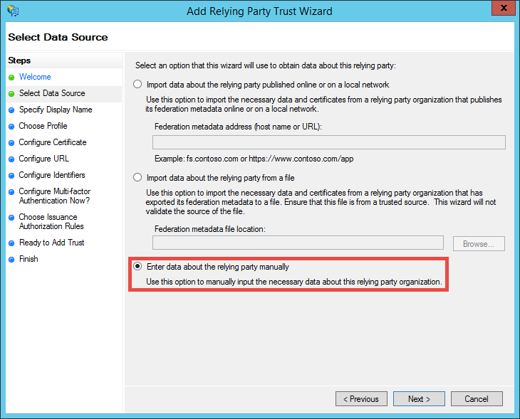
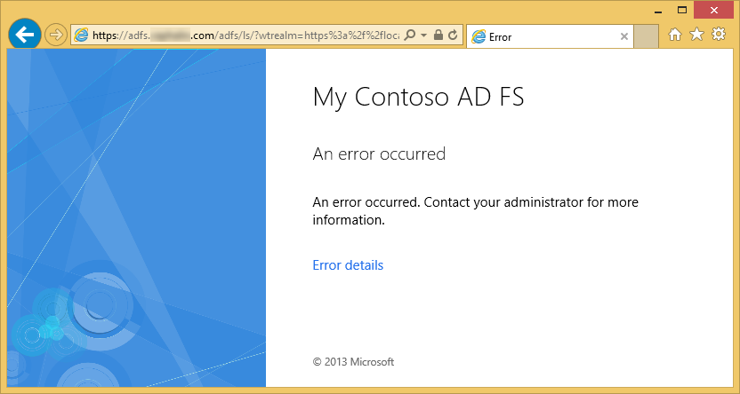

<properties 
    pageTitle="Criar um aplicativo do Azure de linha de negócios com autenticação do AD FS | Microsoft Azure" 
    description="Aprenda a criar um aplicativo de linha de negócios em um serviço de aplicativo de Azure que autentica com STS no local. Este tutorial destina AD FS como o STS no local." 
    services="app-service\web" 
    documentationCenter=".net" 
    authors="cephalin" 
    manager="wpickett" 
    editor=""/>

<tags 
    ms.service="app-service-web" 
    ms.devlang="dotnet" 
    ms.topic="article" 
    ms.tgt_pltfrm="na" 
    ms.workload="web" 
    ms.date="08/31/2016" 
    ms.author="cephalin"/>

# Criar um aplicativo do Azure de linha de negócios com autenticação do AD FS

Este artigo mostra como criar um aplicativo de linha de negócios do ASP.NET MVC no [Serviço de aplicativo do Azure](../app-service/app-service-value-prop-what-is.md) usando uma local de [Serviços de Federação do Active Directory](http://technet.microsoft.com/library/hh831502.aspx) como provedor de identidade. Este cenário pode trabalhar quando você deseja criar aplicativos de linha de negócios em um serviço de aplicativo do Azure, mas sua organização exigir dados de diretório será armazenado no local.

>[AZURE.NOTE] Para obter uma visão geral das opções de autenticação e a autorização de empresa diferente para o serviço de aplicativo do Azure, consulte [autenticar com o Active Directory local no seu aplicativo do Azure](web-sites-authentication-authorization.md).

## O que você criará ##

Você criará um aplicativo do ASP.NET básico no Azure aplicativo de serviço Web Apps com os seguintes recursos:

- Autenticar usuários do AD FS
- Usa `[Authorize]` autorizar usuários para ações diferentes
- Configuração estática para depuração no Visual Studio e a publicação no aplicativo de serviço Web Apps (configurar uma vez, depurar e publicar a qualquer momento)  

## O que é necessário ##

[AZURE.INCLUDE [free-trial-note](../../includes/free-trial-note.md)]

Você precisa fazer o seguinte para concluir este tutorial:

- Um local implantação do AD FS (para uma explicação de ponta a ponta do laboratório teste usado neste tutorial, consulte [laboratório de teste: STS autônoma com o AD FS no Azure máquina virtual (somente teste)](https://blogs.msdn.microsoft.com/cephalin/2014/12/21/test-lab-standalone-sts-with-ad-fs-in-azure-vm-for-test-only/))
- Permissões para criar contando relações de confiança AD FS gerenciamento de terceiros
- Atualização do Visual Studio 2013 4 ou posterior
- [SDK do Azure 2.8.1](http://go.microsoft.com/fwlink/p/?linkid=323510&clcid=0x409) ou posterior

## Usar o aplicativo de amostra para o modelo de linha de negócios ##

O aplicativo de exemplo neste tutorial, [Web App-WSFederation-DotNet)](https://github.com/AzureADSamples/WebApp-WSFederation-DotNet), é criado pela equipe do Active Directory do Azure. Como o AD FS oferece suporte a Web Services Federation, você pode usá-lo como um modelo para criar aplicativos de linha de negócios com facilidade. Ela tem os seguintes recursos:

- Usa o [Web Services Federation](http://msdn.microsoft.com/library/bb498017.aspx) para autenticar com um local implantação do AD FS
- Funcionalidade de entrada e saída
- Usos [Microsoft.Owin](http://www.asp.net/aspnet/overview/owin-and-katana/an-overview-of-project-katana) (em vez de Windows identidade Foundation), que é o futuro do ASP.NET e muito mais simples de configurar para autenticação e autorização que WIF

## Configurar o aplicativo de amostra ##

2.  Clonar ou baixar a solução de exemplo na [Web App-WSFederation-DotNet](https://github.com/AzureADSamples/WebApp-WSFederation-DotNet) para seu diretório local.

    > [AZURE.NOTE] As instruções em [README.md](https://github.com/AzureADSamples/WebApp-WSFederation-DotNet/blob/master/README.md) mostram como configurar o aplicativo com o Active Directory do Azure. Mas neste tutorial, você pode configurá-lo com o AD FS, portanto, siga as etapas aqui, em vez disso.

3.  Abra a solução e, em seguida, abra Controllers\AccountController.cs no **Solution Explorer**.

    Você verá que o código simplesmente emite um desafio de autenticação para autenticar o usuário usando o Web Services Federation. Autenticação tudo estiver configurado no App_Start\Startup.Auth.cs.

4.  Abra App_Start\Startup.Auth.cs. No `ConfigureAuth` método, observe a linha:

        app.UseWsFederationAuthentication(
            new WsFederationAuthenticationOptions
            {
                Wtrealm = realm,
                MetadataAddress = metadata                                      
            });

    No mundo OWIN, esse trecho é realmente o mínimo que você precisa configurar a autenticação de Web Services Federation. É muito mais simples e mais elegante que WIF, onde Web. config é inserido com XML em todos os lugares. A única informação que você precisa é a terceira parte (RP) identificador e a URL do arquivo de metadados do serviço do AD FS. Aqui está um exemplo:

    -   Identificador RP:`https://contoso.com/MyLOBApp`
    -   Endereço de metadados:`http://adfs.contoso.com/FederationMetadata/2007-06/FederationMetadata.xml`

5.  No App_Start\Startup.Auth.cs, altere as seguintes definições de cadeia de caracteres estática:  
    <pre class="prettyprint">
    Território de cadeia de caracteres estática particular = ConfigurationManager.AppSettings["ida:<mark>RPIdentifier</mark>"]; <mark><del>particular de cadeia de caracteres estática aadInstance = ConfigurationManager.AppSettings["ida:AADInstance"];</del></mark> 
     <mark><del>locatário de cadeia de caracteres estática particular = ConfigurationManager.AppSettings["ida:Tenant"];</del></mark> 
     <mark><del>particular de cadeia de caracteres estática metadados = cadeia. Formato ("{0} / {1} /federationmetadata/2007-06/federationmetadata.xml", aadInstance, Locatário);</del></mark> 
     <mark>particular de cadeia de caracteres estática metadados = cadeia. Formato ("https:// {0} /federationmetadata/2007-06/federationmetadata.xml", ConfigurationManager.AppSettings["ida:ADFS"]);</mark>

    <mark><del>autoridade de cadeia de caracteres = Format (InvariantCulture, aadInstance, Locatário);</del></mark>
    </pre>

6.  Agora, faça as alterações correspondentes em Web. config. Abra o Web. config e modificar as seguintes configurações de aplicativo:  
    <pre class="prettyprint">
    &lt;appSettings&gt;
    &lt;add key="webpages:Version" value="3.0.0.0" /&gt;
    &lt;add key="webpages:Enabled" value="false" /&gt;
    &lt;add key="ClientValidationEnabled" value="true" /&gt;
    &lt;add key="UnobtrusiveJavaScriptEnabled" value="true" /&gt;
      <mark><del>&lt;add key="ida:Wtrealm" value="[Enter the App ID URI of WebApp-WSFederation-DotNet https://contoso.onmicrosoft.com/WebApp-WSFederation-DotNet]" /&gt;</del></mark>
      <mark><del>&lt;add key="ida:AADInstance" value="https://login.windows.net" /&gt;</del></mark>
      <mark><del>&lt;add key="ida:Tenant" value="[Enter tenant name, e.g. contoso.onmicrosoft.com]" /&gt;</del></mark>
      <mark>&lt;add key="ida:RPIdentifier" value="[Enter the relying party identifier conforme configurado no AD FS, por exemplo, https://localhost:44320 /] "/&gt;</mark>
      <mark>&lt;Adicionar chave = valor de"ida: ADFS"="[Digite o FQDN do serviço do AD FS, por exemplo, adfs.contoso.com]"/&gt; </mark>        

    &lt;/appSettings&gt;
    </pre>

    Preencha os valores de chave com base em seu ambiente respectivo.

7.  Crie o aplicativo para certificar-se de que não existem erros.

É isso. Agora o aplicativo de exemplo está pronto para trabalhar com o AD FS. Ainda é necessário configurar uma relação de confiança RP com este aplicativo no AD FS.

## Implantar o aplicativo de amostra para aplicativos do Azure aplicativo de serviço Web

Aqui, você publica o aplicativo em um aplicativo web no aplicativo de serviço Web Apps preservando o ambiente de depuração. Observe que você vai publicar o aplicativo antes que ela tem uma relação de confiança RP com o AD FS, então autenticação ainda não funciona ainda. No entanto, se você fazer isso agora você pode ter a URL do aplicativo da web que você pode usar para configurar a relação de confiança RP mais tarde.

1. Clique com botão direito seu projeto e selecione **Publicar**.

    

2. Selecione **O serviço de aplicativo do Microsoft Azure**.
3. Se você ainda não entrou no Azure, clique em **Entrar** e usar a conta da Microsoft para sua assinatura do Azure para entrar no.
4. Uma vez conectado, clique em **novo** para criar um aplicativo web.
5. Preencha todos os campos obrigatórios. Você vai se conectar a local dados posteriormente, portanto, não criar um banco de dados para este aplicativo web.

    

6. Clique em **criar**. Depois que o aplicativo web é criado, a caixa de diálogo Publicar Web é aberta.
7. Na **URL de destino**, altere **http** para **https**. Copie a URL inteira para um editor de texto para uso posterior. Em seguida, clique em **Publicar**.

    

11. No Visual Studio, abra **Web.Release.config** em seu projeto. Insira o seguinte XML para o `<configuration>` marca e substitua o valor da chave a URL da seu aplicativo web de publicação.  
    <pre class="prettyprint">
&lt;appSettings&gt;
   &lt;Adicionar chave = valor de "ida: RPIdentifier" = "<mark>[por exemplo, https://mylobapp.azurewebsites.net/]</mark>" xdt:Transform = "SetAttributes" xdt:Locator="Match(key)" /&gt;
&lt;/appSettings&gt;</pre>

Quando terminar, você tem dois identificadores RP configurados em seu projeto, uma para seu ambiente de depuração no Visual Studio e outra para o aplicativo web publicado no Azure. Você irá configurar uma relação de confiança RP para cada um dos dois ambientes do AD FS. Durante a depuração, as configurações de aplicativo na Web. config são usadas para fazer sua configuração **Depurar** a funcionar com o AD FS. Quando ele for publicado (por padrão, a configuração de **lançamento** é publicada), um Web. config transformado que incorpora as alterações de configuração do aplicativo no Web.Release.config for carregado.

Se você deseja anexar o aplicativo web publicado no Azure para o depurador (ou seja, você deve carregar símbolos de depuração de seu código no aplicativo web publicado), você pode criar uma cópia da configuração de depuração para depuração Azure, mas com sua própria transformação personalizada da Web. config (por exemplo, Web.AzureDebug.config) que usa as configurações de aplicativo de Web.Release.config. Isso permite manter uma configuração estática em diferentes ambientes.

## Configurar a terceira relações de confiança de festa no gerenciamento do AD FS ##

Agora, você precisa configurar uma relação de confiança RP AD FS gerenciamento antes de poder usar o aplicativo de amostra e realmente autenticar com o AD FS. Você precisará configurar duas relações de confiança RP separadas, uma para seu ambiente de depuração e outra para seu aplicativo web publicado.

> [AZURE.NOTE] Certifique-se de que você repetir as etapas a seguir para ambos os ambientes.

4.  No seu servidor do AD FS, fazer logon com as credenciais que tenham direitos de gerenciamento para o AD FS.
5.  Abra o gerenciamento do AD FS. **Relações de confiança do AD FS\Trusted Relationships\Relying festa** de atalho e selecione **Adicionar confiar festa confiar**.

    

5.  Na página **Selecionar fonte de dados** , selecione **Inserir manualmente dados sobre a terceira parte**. 

    

6.  Na página **Especificar o nome de exibição** , digite um nome de exibição para o aplicativo e clique em **Avançar**.
7.  Na página **Escolher protocolo** , clique em **Avançar**.
8.  Na página **Configurar certificado** , clique em **Avançar**.

    > [AZURE.NOTE] Desde que você deve estar usando HTTPS já, tokens criptografadas são opcionais. Se realmente deseja criptografar tokens de AD FS nesta página, você também deve adicionar lógica de descriptografar token no seu código. Para obter mais informações, consulte [Configurar manualmente o Web Services Federation OWIN middleware e aceitando tokens criptografados](http://chris.59north.com/post/2014/08/21/Manually-configuring-OWIN-WS-Federation-middleware-and-accepting-encrypted-tokens.aspx).
  
5.  Antes de passar para a próxima etapa, você precisa de um elemento de informação do seu projeto do Visual Studio. Nas propriedades do projeto, observe o **SSL URL** do aplicativo. 

    

6.  Volta ao AD FS gerenciamento, na página **Configurar URL** do **Confiar festa confiar Assistente para adicionar**, selecione **Habilitar o suporte para o protocolo Web Services Federation passivo** e digite a URL de SSL do seu projeto do Visual Studio que você anotou na etapa anterior. Em seguida, clique em **Avançar**.

    

    > [AZURE.NOTE] URL especifica onde deseja enviar o cliente após autenticação é bem sucedida. Para o ambiente de depuração, ele deve ser <code>https://localhost:&lt;port&gt;/</code>. Para o aplicativo web publicado, ele deve ser a URL do aplicativo web.

7.  Na página **Configurar identificadores** , verifique se o seu projeto SSL URL já está listado e clique em **Avançar**. Clique em **próxima** totalmente até o final do assistente com seleções padrão.

    > [AZURE.NOTE] Em App_Start\Startup.Auth.cs de seu projeto do Visual Studio, este identificador é comparado com o valor de <code>WsFederationAuthenticationOptions.Wtrealm</code> durante a autenticação federada. Por padrão, a URL do aplicativo da etapa anterior é adicionado como um identificador RP.

8.  Agora você concluiu Configurando o aplicativo de RP para o seu projeto no AD FS. Em seguida, você pode configurar esse aplicativo para enviar as declarações necessitadas para seu aplicativo. A caixa de diálogo **Editar regras de declaração** é aberta por padrão para você no final do Assistente para que você possa começar imediatamente. Vamos definir pelo menos as seguintes declarações (com esquemas entre parênteses):

    -   Nome (http://schemas.xmlsoap.org/ws/2005/05/identity/claims/name) - usado pelo ASP.NET para alimentar `User.Identity.Name`.
    -   Nome de usuário principal (http://schemas.xmlsoap.org/ws/2005/05/identity/claims/upn) - usado para identificar exclusivamente os usuários na organização.
    -   Associações de grupo como funções (http://schemas.microsoft.com/ws/2008/06/identity/claims/role) - pode ser usado com `[Authorize(Roles="role1, role2,...")]` decorativo para autorizar controladores/ações. Na verdade, essa abordagem não pode ser o melhor desempenho para autorização de função. Se seus usuários AD pertencerem a centenas de grupos de segurança, elas se tornarão centenas de declarações de função no token SAML. Uma abordagem alternativa é enviar uma declaração de função única condicionalmente dependendo a participação do usuário em um grupo específico. No entanto, podemos será mantenha a simplicidade para este tutorial.
    -   Nome de identificação (http://schemas.xmlsoap.org/ws/2005/05/identity/claims/nameidentifier) - pode ser usado para validação de antifalsificação. Para obter mais informações sobre como fazê-lo funcionar com a validação de antifalsificação, consulte a seção **Adicionar funcionalidade de linha de negócios** da [criação de uma linha de negócios aplicativo Azure com a autenticação do Active Directory do Azure](web-sites-dotnet-lob-application-azure-ad.md#bkmk_crud).

    > [AZURE.NOTE] Os tipos de declaração que precise configurar para seu aplicativo é determinada pelo necessidades do seu aplicativo. Para a lista de declarações compatíveis com aplicativos do Azure Active Directory (ou seja, relações de confiança RP), por exemplo, consulte [suporte Token e tipos de declaração](http://msdn.microsoft.com/library/azure/dn195587.aspx).

8.  Na caixa de diálogo Editar regras de declaração, clique em **Adicionar regra**.
9.  Configurar as declarações de nome, UPN e função conforme mostrado na captura de tela e clique em **Concluir**.

    

    Em seguida, você criar um nome temporário ID reivindicar usando as etapas demonstradas em [Identificadores de nome em declarações de SAML](http://blogs.msdn.com/b/card/archive/2010/02/17/name-identifiers-in-saml-assertions.aspx).

9.  Clique em **Adicionar regra** novamente.
10. Selecione **Enviar declarações usando uma regra personalizada** e clique em **Avançar**.
11. Cole a seguinte linguagem de regra na caixa **regra personalizada** , nomeie a regra **Por identificador de sessão** e clique em **Concluir**.  
    <pre class="prettyprint">
    C1: [tipo = = "http://schemas.microsoft.com/ws/2008/06/identity/claims/windowsaccountname"] &amp; &amp; 
    c2: [tipo = = "http://schemas.microsoft.com/ws/2008/06/identity/claims/authenticationinstant"] = > Adicionar (armazenar = "_OpaqueIdStore", tipos = ("<mark>http://contoso.com/internal/sessionid</mark>"), consulta = "{0}; { 1}; {2}; {3}; {4} ", parâmetro ="useEntropy", o parâmetro = c1. Valor, parâmetro = c1. OriginalIssuer, parâmetro = "", parâmetro = c2. Valor);
    </pre>

    Sua regra personalizada deve parecer com esta captura de tela:

    

9.  Clique em **Adicionar regra** novamente.
10. Selecione **transformar uma declaração de entrada** e clique em **Avançar**.
11. Configurar a regra conforme mostrado na captura de tela (usando o tipo de declaração que você criou na regra personalizada) e clique em **Concluir**.

    

    Para obter informações detalhadas sobre as etapas para a declaração de nome ID temporária, consulte [Identificadores de nome em declarações de SAML](http://blogs.msdn.com/b/card/archive/2010/02/17/name-identifiers-in-saml-assertions.aspx).

12. Clique em **Aplicar** na caixa de diálogo **Editar regras de declaração** . Agora deve se parecer com a captura de tela a seguir:

    

    > [AZURE.NOTE] Novamente, certifique-se de que você repetir essas etapas para seu ambiente de depuração e o aplicativo da web publicado.

## Autenticação federada de teste do aplicativo

Você está pronto para testar a lógica de autenticação do seu aplicativo contra do AD FS. Em meu ambiente de laboratório do AD FS, eu tenho um usuário de teste que pertence a um grupo de teste no Active Directory (AD).

Para testar a autenticação no depurador, tudo o que você precisa fazer agora é tipo `F5`. Se quiser testar a autenticação no aplicativo web publicado, navegue até a URL.

Depois que o aplicativo da web é carregada, clique em **Entrar**. Agora, você deve obter uma caixa de diálogo de login ou a página de login servida pelo AD FS, dependendo do método de autenticação escolhido pelo AD FS. Veja aqui o que recebi no Internet Explorer 11.

Após você fazer logon com um usuário no domínio do AD da implantação do AD FS, agora você deve ver a home page novamente com **Olá, <User Name>!** no canto. Veja aqui o que recebi.

Até agora, você já êxito das seguintes maneiras:

- Seu aplicativo atingiu com êxito do AD FS e um identificador RP correspondência for encontrado no banco de dados do AD FS
- O AD FS foi autenticado com êxito um usuário do AD e redirecionar que voltar à home page do aplicativo
- O AD FS como enviada com êxito a declaração de nome (http://schemas.xmlsoap.org/ws/2005/05/identity/claims/name) para seu aplicativo, conforme indicado pelo fato de que o nome de usuário é exibido no canto. 

Se a declaração de nome estiver ausente, você teria visto **Olá,!**. Se você olhar Views\Shared\_LoginPartial.cshtml, você achar que ele usa `User.Identity.Name` para exibir o nome de usuário. Conforme mencionado anteriormente, se a declaração de nome do usuário autenticado está disponível no token SAML, ASP.NET hydrates essa propriedade com ele. Para ver todas as declarações que são enviadas pelo AD FS, coloque um ponto de interrupção em Controllers\HomeController.cs, no método de ação de índice. Depois que o usuário é autenticado, inspecionar o `System.Security.Claims.Current.Claims` conjunto.

 

## Autorizar usuários para controladores específico ou ações

Desde que você tiver incluído associações de grupo como declarações de função em sua configuração de confiança RP, agora você pode usá-los diretamente no `[Authorize(Roles="...")]` decorativo para controladores e ações. Em um aplicativo de linha de negócios com o padrão de criar-leitura-atualização-exclusão (CRUD), você pode autorizar funções específicas para cada ação de acesso. Por agora, você irá apenas experimentar esse recurso no controlador de Home existente.

1. Abra Controllers\HomeController.cs.
2. Decorar o `About` e `Contact` métodos de ação semelhantes ao código a seguir, usando a segurança do grupo associações com o usuário autenticado.  
    <pre class="prettyprint">
    <mark>[Autorizar (funções = "Grupo de teste")]</mark> 
    público ActionResult About() {ViewBag.Message = "Seu aplicativo descrição página.";

        return View();
    }

    <mark>[Autorizar (funções = "Domain Admins")]</mark> 
    público ActionResult Contact() {ViewBag.Message = "Seu contato página.";

        return View();
    }  </pre>

    Como posso adicionado **Testar o usuário** ao **Grupo de teste** em meu ambiente de laboratório do AD FS, vou usá grupo de teste para testar a autorização em `About`. Para `Contact`, será testar o o caso negativo do grupo **Domain Admins**, aos quais o **Usuário teste** não pertencem.

3. Inicie o depurador digitando `F5` entrar e clique em **sobre**. Agora, você deve estar vendo o `~/About/Index` página com êxito, se o usuário autenticado está autorizado para essa ação.
4. Agora, clique em **contato**, que no meu caso não deve autorizar o **Usuário de teste** para a ação. No entanto, o navegador será redirecionado para o AD FS, que mostra eventualmente esta mensagem:

    

    Se você investigar este erro no Visualizador de eventos no servidor do AD FS, você verá esta mensagem de exceção:  
    <pre class="prettyprint">
   Microsoft.IdentityServer.Web.InvalidRequestException: MSIS7042: <mark>mesma sessão do navegador cliente fez '6' solicitações nos últimos '11' segundos.</mark> Contate o administrador para obter detalhes.
   em Microsoft.IdentityServer.Web.Protocols.PassiveProtocolHandler.UpdateLoopDetectionCookie (WrappedHttpListenerContext contexto) em Microsoft.IdentityServer.Web.Protocols.WSFederation.WSFederationProtocolHandler.SendSignInResponse (WSFederationContext contexto, resposta de MSISSignInResponse) em Microsoft.IdentityServer.Web.PassiveProtocolListener.ProcessProtocolRequest (ProtocolContext protocolContext, PassiveProtocolHandler protocolHandler) em Microsoft.IdentityServer.Web.PassiveProtocolListener.OnGetContext (WrappedHttpListenerContext contexto) </pre>

    O motivo para esse erro é que por padrão, MVC retorna um 401 não autorizado quando funções de um usuário não estão autorizadas. Isso dispara uma solicitação de nova autenticação para seu provedor de identidade (AD FS). Desde que o usuário já é autenticado, o AD FS retorna à mesma página, que emite outro 401, criando um loop de redirecionamento. Você substituirá do AuthorizeAttribute `HandleUnauthorizedRequest` método com lógica simple para mostrar algo que faça sentido em vez de continuar o loop de redirecionamento.

5. Criar um arquivo do projeto chamado AuthorizeAttribute.cs e cole o seguinte código nele.

        using System;
        using System.Web.Mvc;
        using System.Web.Routing;
        
        namespace WebApp_WSFederation_DotNet
        {
            [AttributeUsage(AttributeTargets.Class | AttributeTargets.Method, Inherited = true, AllowMultiple = true)]
            public class AuthorizeAttribute : System.Web.Mvc.AuthorizeAttribute
            {
                protected override void HandleUnauthorizedRequest(AuthorizationContext filterContext)
                {
                    if (filterContext.HttpContext.Request.IsAuthenticated)
                    {
                        filterContext.Result = new System.Web.Mvc.HttpStatusCodeResult((int)System.Net.HttpStatusCode.Forbidden);
                    }
                    else
                    {
                        base.HandleUnauthorizedRequest(filterContext);
                    }
                }
            }
        }

    O código de substituição envia um HTTP 403 (proibido) em vez de HTTP 401 (não autorizado) em casos autenticados, mas não autorizados.

6. Executar o depurador novamente com `F5`. Clicando em **contato** agora mostra uma mensagem de erro mais informativa (embora atraente):

    

7. Publicar o aplicativo no Azure aplicativo de serviço Web Apps novamente e teste o comportamento do aplicativo ao vivo.

## Conectar a dados locais

Um motivo que você desejaria implementar seu aplicativo de linha de negócios com o AD FS em vez do Azure Active Directory é problemas de conformidade com a manter a organização dados fora das instalações. Isso também pode significam que o seu aplicativo web no Azure deve acessar bancos de dados no local, desde que você não tem permissão para usar o [Banco de dados SQL](/services/sql-database/) como a camada de dados de seus aplicativos web.

Azure aplicativo de serviço Web Apps suporta acessar bancos de dados no local com duas abordagens: [Híbrido conexões](../biztalk-services/integration-hybrid-connection-overview.md) e [Redes virtuais](web-sites-integrate-with-vnet.md). Para obter mais informações, consulte [usando VNET integração e conexões híbrida com aplicativos do Azure aplicativo de serviço Web](https://azure.microsoft.com/blog/2014/10/30/using-vnet-or-hybrid-conn-with-websites/).

## Recursos adicionais

- [Proteger o aplicativo com SSL e o atributo autorizar](web-sites-dotnet-deploy-aspnet-mvc-app-membership-oauth-sql-database.md#protect-the-application-with-ssl-and-the-authorize-attribute)
- [Autenticar com o Active Directory local no seu aplicativo do Azure](web-sites-authentication-authorization.md)
- [Criar um aplicativo do Azure de linha de negócios com autenticação do Active Directory do Azure](web-sites-dotnet-lob-application-azure-ad.md)
- [Use a opção de autenticação organizacional local (ADFS) com ASP.NET no Visual Studio 2013](http://www.cloudidentity.com/blog/2014/02/12/use-the-on-premises-organizational-authentication-option-adfs-with-asp-net-in-visual-studio-2013/)
- [Migrar um projeto de Web VS2013 de WIF para Katana](http://www.cloudidentity.com/blog/2014/09/15/MIGRATE-A-VS2013-WEB-PROJECT-FROM-WIF-TO-KATANA/)
- [Visão geral de serviços de Federação do Active Directory](http://technet.microsoft.com/library/hh831502.aspx)
- [Especificação Web Services Federation 1.1](http://download.boulder.ibm.com/ibmdl/pub/software/dw/specs/ws-fed/WS-Federation-V1-1B.pdf?S_TACT=105AGX04&S_CMP=LP)

