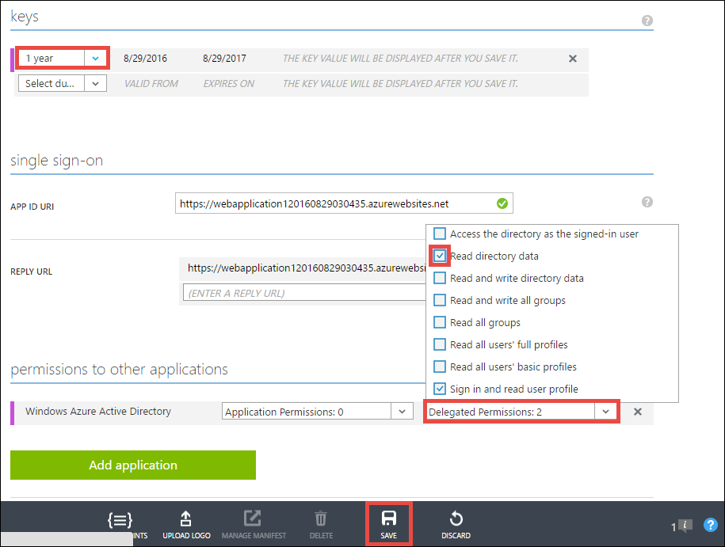
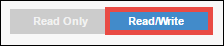
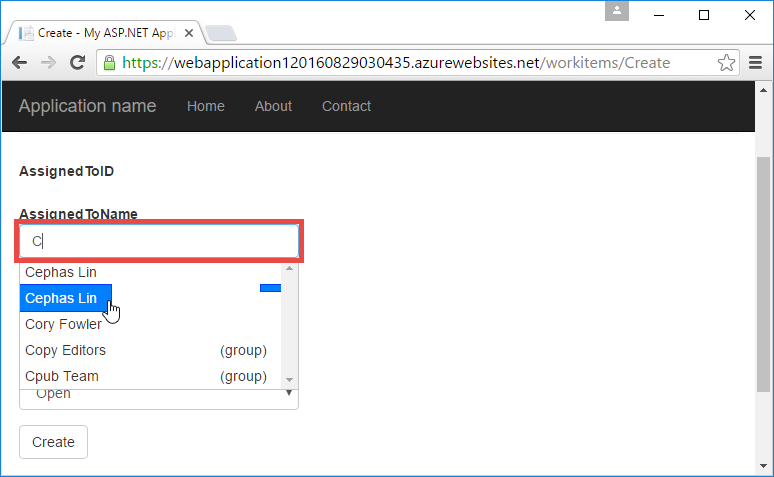

<properties 
    pageTitle="Criar um aplicativo do Azure de linha de negócios com autenticação do Active Directory do Azure | Microsoft Azure" 
    description="Aprenda a criar um aplicativo de linha de negócios do ASP.NET MVC no serviço de aplicativo de Azure que autentica com o Active Directory do Azure" 
    services="app-service\web, active-directory" 
    documentationCenter=".net" 
    authors="cephalin" 
    manager="wpickett" 
    editor=""/>

<tags 
    ms.service="app-service-web" 
    ms.devlang="dotnet" 
    ms.topic="article" 
    ms.tgt_pltfrm="na" 
    ms.workload="web" 
    ms.date="09/01/2016" 
    ms.author="cephalin"/>

# Criar um aplicativo do Azure de linha de negócios com autenticação do Active Directory do Azure #

Este artigo mostra como criar um aplicativo de linha de negócios .NET no [Azure aplicativo de serviço Web Apps](http://go.microsoft.com/fwlink/?LinkId=529714) usando o [autenticação / autorização](../app-service/app-service-authentication-overview.md) recurso. Ele também mostra como usar a [API do Azure Active Directory gráfico](https://msdn.microsoft.com/Library/Azure/Ad/Graph/api/api-catalog) aos dados do diretório de consulta no aplicativo.

O locatário do Active Directory do Azure que você usar pode ser um diretório somente Azure. Ou, pode ser [sincronizado com o Active Directory no local](../active-directory/active-directory-aadconnect.md) para criar uma experiência de logon único para trabalhadores que estão no local e remoto. Este artigo usa o diretório padrão para sua conta do Azure.

## O que você criará ##

Você criará um aplicativo de criar-leitura-atualização-exclusão (CRUD) de linha de negócios simples no aplicativo de serviço Web Apps que controla o trabalho itens com os seguintes recursos:

- Autenticar usuários Active Directory do Azure
- Consultas usuários e grupos directory usando [Azure Active Directory Graph API](http://msdn.microsoft.com/library/azure/hh974476.aspx)
- Usar o modelo do ASP.NET MVC *Sem autenticação*

Se precisar de controle de acesso baseado em função (RBAC) para o aplicativo de linha de negócios no Azure, consulte a [Próxima etapa](#next).

## O que é necessário ##

[AZURE.INCLUDE [free-trial-note](../../includes/free-trial-note.md)]

Você precisa fazer o seguinte para concluir este tutorial:

- Um locatário do Azure Active Directory com usuários em vários grupos
- Permissões para criar aplicativos do locatário do Active Directory do Azure
- Atualização do Visual Studio 2013 4 ou posterior
- [Azure SDK 2.8.1 ou posterior](https://azure.microsoft.com/downloads/)

## Criar e implantar um aplicativo web para o Azure ##

1. No Visual Studio, clique em **arquivo** > **novo** > **projeto**.

2. Selecione **ASP.NET Web Application**, nomeie seu projeto e clique em **Okey**.

3. Selecione o modelo **MVC** e, em seguida, altere a autenticação para **Sem autenticação**. Verifique se **que o Host na nuvem** está selecionada e clique em **Okey**.

    

4. Na caixa de diálogo **Criar serviço de aplicativo** , clique em **Adicionar uma conta** (e, em seguida, **Adicionar uma conta** na lista suspensa) faça logon em sua conta do Azure.

5. Uma vez conectado configure seu aplicativo web. Crie um grupo de recursos e um novo plano de serviço de aplicativo clicando no botão **novo** respectivo. Clique em **explorar serviços Azure adicionais** para continuar.

    

6. Na guia **Serviços** , clique em **+** para adicionar um banco de dados SQL para o aplicativo. 

    

7. Em **Configurar banco de dados SQL**, clique em **novo** para criar uma instância do SQL Server.

8. **Configurar o SQL Server**, configure instância do SQL Server. Em seguida, clique em **Okey**, **Okey**e **criar** para iniciar a criação de aplicativo no Azure.

9. **Atividade de serviço de aplicativo do Azure**, você pode ver quando terminar a criação do aplicativo. Clique em * *publicar &lt; *appname*> para este aplicativo Web agora**clique em **publicar * *. 

    Quando terminar de Visual Studio, ele abre o aplicativo de publicação no navegador. 

    

## Configurar o acesso de autenticação e de diretório

1. Faça logon no [portal do Azure](https://portal.azure.com).

2. No menu à esquerda, clique em **Serviços de aplicativo** > **&lt;*appname*>** > **autenticação / autorização * *.

    

3. Habilitar a autenticação do Active Directory do Azure clicando **na** > **Azure Active Directory** > **Express** > **Okey**.

    

4. Clique em **Salvar** na barra de comando.

    

    Depois que as configurações de autenticação são salvos com êxito, tente navegando até seu aplicativo novamente no navegador. As configurações padrão impõem a autenticação do aplicativo inteiro. Se você já não estiver conectado, você será redirecionado a uma tela de login. Uma vez conectado, você vê seu aplicativo protegido por HTTPS. Em seguida, você precisa habilitar o acesso aos dados do diretório. 

5. Navegue até o [portal clássico](https://manage.windowsazure.com).

6. No menu à esquerda, clique em **Active Directory** > **Default Directory** > **aplicativos** > **&lt;*appname*> * *.

    

    Este é o aplicativo do Active Directory do Azure criados pelo aplicativo de serviço para você habilitar a autorização / recurso de autenticação.

7. Clique em **usuários** e **grupos** para certificar-se de que você tenha alguns usuários e grupos no diretório. Caso contrário, crie alguns usuários de teste e grupos.

    

7. Clique em **Configurar** para configurar este aplicativo.

8. Role até a seção de **chaves** e adicionar uma chave, selecionando uma duração. Em seguida, clique em **Permissões delegada** e selecione **ler dados de diretório**. Clique em **Salvar**.

    

8. Quando as configurações são salvas, role de volta para cima até a seção **chaves** e clique no botão **Copiar** para copiar a chave de cliente. 

    

    >[AZURE.IMPORTANT] Se você navegar para outra página agora, você não conseguirá acessar essa chave de cliente nunca novamente.

9. Em seguida, você precisa configurar o seu aplicativo web com essa chave. Faça logon no [Gerenciador de recursos do Azure](https://resources.azure.com) com sua conta do Azure.

10. Na parte superior da página, clique em **Leitura/gravação** para fazer alterações no Azure Resource Explorer.

    

11. Localizar as configurações de autenticação de seu aplicativo, localizado em assinaturas > * *&lt;*nome de inscrição*>** > **resourceGroups** > **&lt;*resourcegroupname*>** > **provedores** > **Microsoft.Web** > **sites** > **&lt;*appname*>** > **config** > **authsettings * *.

12. Clique em **Editar**.

    

13. No painel de edição, defina a `clientSecret` e `additionalLoginParams` propriedades da seguinte maneira.

        ...
        "clientSecret": "<client key from the Azure Active Directory application>",
        ...
        "additionalLoginParams": ["response_type=code id_token", "resource=https://graph.windows.net"],
        ...

14. Clique em **colocar** na parte superior para enviar suas alterações.

    

14. Agora, para testar se você tiver o token de autorização para acessar a API do Azure Active Directory Graph, basta navegar até * *https://&lt;*appname*>.azurewebsites.net/.auth/me** no seu navegador. Se você configurou tudo corretamente, você deve ver o `access_token` propriedade na resposta JSON.

    O `~/.auth/me` caminho de URL é gerenciado pelo aplicativo de serviço de autenticação / autorização para fornecer todas as informações relacionadas à sua sessão autenticada. Para obter mais informações, consulte [autenticação e a autorização no serviço de aplicativo do Azure](../app-service/app-service-authentication-overview.md).

    >[AZURE.NOTE] O `access_token` tem um período de expiração. No entanto, autenticação de serviço do aplicativo / autorização fornece a funcionalidade de atualização de token com `~/.auth/refresh`. Para obter mais informações sobre como usá-lo, consulte     [App Store do Token de serviço](https://cgillum.tech/2016/03/07/app-service-token-store/).

Em seguida, você fará algo útil com os dados de diretório.

## Adicionar a funcionalidade de linha de negócios para o seu aplicativo

Agora, você pode criar um controle de itens de trabalho CRUD simple.  

5.  Na pasta ~\Models, crie um arquivo de classe chamado WorkItem.cs e substituir `public class WorkItem {...}` com o seguinte código:

        using System.ComponentModel.DataAnnotations;

        public class WorkItem
        {
            [Key]
            public int ItemID { get; set; }
            public string AssignedToID { get; set; }
            public string AssignedToName { get; set; }
            public string Description { get; set; }
            public WorkItemStatus Status { get; set; }
        }

        public enum WorkItemStatus
        {
            Open,
            Investigating,
            Resolved,
            Closed
        }

7.  Crie o projeto para tornar seu novo modelo acessível para a lógica de estrutura no Visual Studio.

8.  Adicionar um novo item scaffolded `WorkItemsController` à pasta ~\Controllers ( **controladores**de atalho, aponte para **Adicionar**e selecione **novo item scaffolded**). 

9.  Selecione **Controlador de 5 MVC com modos de exibição, usando a estrutura de entidade** e clique em **Adicionar**.

10. Selecione o modelo que você criou, clique em **+** e, em seguida, **Adicionar** para adicionar um contexto de dados e clique em **Adicionar**.

    

14. No ~\Views\WorkItems\Create.cshtml (um item automaticamente scaffolded), localize o `Html.BeginForm` método auxiliar e fazer as seguintes alterações realçadas:  
<pre class="prettyprint">
    @modelWebApplication1.Models.WorkItem

    @{ViewBag = &quot;criar&quot;; }

    &lt;H2&gt;criar&lt;/h2&gt;

    @using(Html.BeginForm (<mark>&quot;criar&quot;, &quot;itens de trabalho&quot;, FormMethod.Post, novo {id = &quot;formulário principal&quot; }</mark>)) {@Html.AntiForgeryToken()

        &lt;div class=&quot;form-horizontal&quot;&gt;
            &lt;h4&gt;WorkItem&lt;/h4&gt;
            &lt;hr /&gt;
            @Html.ValidationSummary(true, &quot;&quot;, new { @class = &quot;text-danger&quot; })
            &lt;div class=&quot;form-group&quot;&gt;
                @Html.LabelFor(model =&gt; model.AssignedToID, htmlAttributes: new { @class = &quot;control-label col-md-2&quot; })
                &lt;div class=&quot;col-md-10&quot;&gt;
                    @Html.EditorFor(model =&gt; model.AssignedToID, new { htmlAttributes = new { @class = &quot;form-control&quot;<mark>, @type = &quot;hidden&quot;</mark> } })
                    @Html.ValidationMessageFor(model =&gt; model.AssignedToID, &quot;&quot;, new { @class = &quot;text-danger&quot; })
                &lt;/div&gt;
            &lt;/div&gt;

            &lt;div class=&quot;form-group&quot;&gt;
                @Html.LabelFor(model =&gt; model.AssignedToName, htmlAttributes: new { @class = &quot;control-label col-md-2&quot; })
                &lt;div class=&quot;col-md-10&quot;&gt;
                    @Html.EditorFor(model =&gt; model.AssignedToName, new { htmlAttributes = new { @class = &quot;form-control&quot; } })
                    @Html.ValidationMessageFor(model =&gt; model.AssignedToName, &quot;&quot;, new { @class = &quot;text-danger&quot; })
                &lt;/div&gt;
            &lt;/div&gt;

            &lt;div class=&quot;form-group&quot;&gt;
                @Html.LabelFor(model =&gt; model.Description, htmlAttributes: new { @class = &quot;control-label col-md-2&quot; })
                &lt;div class=&quot;col-md-10&quot;&gt;
                    @Html.EditorFor(model =&gt; model.Description, new { htmlAttributes = new { @class = &quot;form-control&quot; } })
                    @Html.ValidationMessageFor(model =&gt; model.Description, &quot;&quot;, new { @class = &quot;text-danger&quot; })
                &lt;/div&gt;
            &lt;/div&gt;

            &lt;div class=&quot;form-group&quot;&gt;
                @Html.LabelFor(model =&gt; model.Status, htmlAttributes: new { @class = &quot;control-label col-md-2&quot; })
                &lt;div class=&quot;col-md-10&quot;&gt;
                    @Html.EnumDropDownListFor(model =&gt; model.Status, htmlAttributes: new { @class = &quot;form-control&quot; })
                    @Html.ValidationMessageFor(model =&gt; model.Status, &quot;&quot;, new { @class = &quot;text-danger&quot; })
                &lt;/div&gt;
            &lt;/div&gt;

            &lt;div class=&quot;form-group&quot;&gt;
                &lt;div class=&quot;col-md-offset-2 col-md-10&quot;&gt;
                    &lt;input type=&quot;submit&quot; value=&quot;Create&quot; class=&quot;btn btn-default&quot;<mark> id=&quot;submit-button&quot;</mark> /&gt;
                &lt;/div&gt;
            &lt;/div&gt;
        &lt;/div&gt;
    }

    &lt;div&gt;
    @Html.ActionLink(&quot;voltar para a lista&quot;, &quot;índice&quot;) &lt;/div    &gt;

    @sectionScripts { @Scripts.Render( &quot;~/bundles/jqueryval&quot;)     <mark> &lt;script&gt; 
     / / código de seletor de pessoas/grupos var maxResultsPerPage = 14;         entrada de var = getElementById (&quot;AssignedToName&quot;);

            // Access token from request header, and tenantID from claims identity
            var token = &quot;@Request.Headers[&quot;X-MS-TOKEN-AAD-ACCESS-TOKEN&quot;]&quot;;
            var tenant =&quot;@(System.Security.Claims.ClaimsPrincipal.Current.Claims
                            .Where(c => c.Type == &quot;http://schemas.microsoft.com/identity/claims/tenantid&quot;)
                            .Select(c => c.Value).SingleOrDefault())&quot;;

            var picker = new AadPicker(maxResultsPerPage, input, token, tenant);

            // Submit the selected user/group to be asssigned.
            $(&quot;#submit-button&quot;).click({ picker: picker }, function () {
                if (!picker.Selected())
                    return;
                $(&quot;#main-form&quot;).get()[0].elements[&quot;AssignedToID&quot;].value = picker.Selected().objectId;
            });
        &lt;/script&gt;</mark>
    }
    </pre>
    
    Observe que `token` e `tenant` são usadas pela `AadPicker` objeto para fazer chamadas de API do Azure Active Directory Graph. Você adicionará `AadPicker` mais tarde.   
    
    >[AZURE.NOTE] Você pode obter tão bem `token` e `tenant` do lado do cliente com `~/.auth/me`, mas esse seria uma chamada de servidor adicionais. Por exemplo:
    >  
    >     $.ajax({
    >         dataType: "json",
    >         url: "/.auth/me",
    >         success: function (data) {
    >             var token = data[0].access_token;
    >             var tenant = data[0].user_claims
    >                             .find(c => c.typ === 'http://schemas.microsoft.com/identity/claims/tenantid')
    >                             .val;
    >         }
    >     });
    
15. Fazer as mesmas alterações com ~ \Views\WorkItems\Edit.cshtml.

15. O `AadPicker` objeto é definido em um script que você precisa adicionar ao seu projeto. Clique com botão direito na pasta ~\Scripts, aponte para **Adicionar**e clique em **arquivo JavaScript**. Tipo de `AadPickerLibrary` para o nome de arquivo e clique em **Okey**.

16. Copie o conteúdo da [aqui](https://raw.githubusercontent.com/cephalin/active-directory-dotnet-webapp-roleclaims/master/WebApp-RoleClaims-DotNet/Scripts/AadPickerLibrary.js) em ~ \Scripts\AadPickerLibrary.js.

    No script, o `AadPicker` objeto chama [Azure Active Directory Graph API](https://msdn.microsoft.com/Library/Azure/Ad/Graph/api/api-catalog) para pesquisar usuários e grupos que correspondem a entrada.  

17. ~\Scripts\AadPickerLibrary.js também usa o [jQuery UI AutoCompletar widget](https://jqueryui.com/autocomplete/). Portanto, você precisa adicionar jQuery UI ao seu projeto. Seu projeto de atalho e clique em **Gerenciar pacotes do NuGet**.

18. No Gerenciador de pacote do NuGet, clique em Procurar, digite **jquery ui** na barra de pesquisa e clique em **jQuery.UI.Combined**.

    

19. No painel direito, clique em **instalar**, clique em **Okey** para continuar.

19. Abra ~\App_Start\BundleConfig.cs e faça as seguintes alterações realçadas:  
    <pre class="prettyprint">
    RegisterBundles(BundleCollection bundles) anular estático público {pacotes. Adicionar (ScriptBundle novo (&quot;~/bundles/jquery&quot;). Incluir ( &quot;~/Scripts/jquery-{version}.js&quot;<mark>, &quot;~/Scripts/jquery-ui-{version}.js&quot;, &quot;~/Scripts/AadPickerLibrary.js&quot;</mark>));

        bundles.Add(new ScriptBundle(&quot;~/bundles/jqueryval&quot;).Include(
                    &quot;~/Scripts/jquery.validate*&quot;));

        // Use the development version of Modernizr to develop with and learn from. Then, when you&#39;re
        // ready for production, use the build tool at http://modernizr.com to pick only the tests you need.
        bundles.Add(new ScriptBundle(&quot;~/bundles/modernizr&quot;).Include(
                    &quot;~/Scripts/modernizr-*&quot;));

        bundles.Add(new ScriptBundle(&quot;~/bundles/bootstrap&quot;).Include(
                    &quot;~/Scripts/bootstrap.js&quot;,
                    &quot;~/Scripts/respond.js&quot;));

        bundles.Add(new StyleBundle(&quot;~/Content/css&quot;).Include(
                    &quot;~/Content/bootstrap.css&quot;,
                    &quot;~/Content/site.css&quot;<mark>,
                    &quot;~/Content/themes/base/jquery-ui.css&quot;</mark>));
    }
    </pre>

    Existem outras maneiras de alto desempenho para gerenciar arquivos JavaScript e CSS em seu aplicativo. No entanto, para simplificar você apenas vai estão presentes nos pacotes que são carregados com cada modo de exibição.

12. Por fim, em ~ \Global.asax, adicione a seguinte linha de código na `Application_Start()` método. `Ctrl`+`.`em cada erro de resolução de nomenclatura para corrigi-lo.

        AntiForgeryConfig.UniqueClaimTypeIdentifier = ClaimTypes.NameIdentifier;
    
    > [AZURE.NOTE] Você precisa esta linha de código, porque o modelo MVC padrão usa <code>[ValidateAntiForgeryToken]</code> decorativo em algumas das ações. Devido o comportamento descrito por [Brock Allen](https://twitter.com/BrockLAllen) no     [MVC 4, AntiForgeryToken e declarações](http://brockallen.com/2012/07/08/mvc-4-antiforgerytoken-and-claims/) sua POSTAGEM HTTP pode falhar validação de token de antifalsificação porque:

    > - Active Directory do Azure não enviar http://schemas.microsoft.com/accesscontrolservice/2010/07/claims/identityprovider, que é requerido pelo padrão pelo token de antifalsificação.
    > - Se Azure Active Directory for diretório sincronizado com o AD FS, a relação de confiança do AD FS por padrão não envia a declaração de http://schemas.microsoft.com/accesscontrolservice/2010/07/claims/identityprovider, embora você possa configurar manualmente o AD FS para enviar essa declaração.

    > `ClaimTypes.NameIdentifies`Especifica a declaração `http://schemas.xmlsoap.org/ws/2005/05/identity/claims/nameidentifier`, qual Azure Active Directory fornecer.  

20. Agora, publica suas alterações. Clique com botão direito seu projeto e clique em **Publicar**.

21. Clique em **configurações**, verifique se que há uma cadeia de conexão para o banco de dados do SQL, selecione o **Banco de dados de atualização de** fazer as alterações de esquema para o seu modelo e clique em **Publicar**.

    

22. No navegador, navegue até https://&lt;*appname*>.azurewebsites.net/workitems e clique em **Criar novo**.

23. Clique na caixa de **AssignedToName** . Agora você deve ver usuários e grupos do seu locatário do Active Directory do Azure em uma lista suspensa. Você pode digitar para filtrar ou usar a `Up` ou `Down` principais ou clique para selecionar o usuário ou grupo. 

    

24. Clique em **criar** para salvar as alterações. Em seguida, clique em **Editar** no item de trabalho criado para observar o mesmo comportamento.

Parabenização, você está executando um aplicativo de linha de negócios no Azure com acesso ao diretório! Há muito mais que você pode fazer com a API do gráfico. Consulte a [referência de API do Azure AD Graph](https://msdn.microsoft.com/library/azure/ad/graph/api/api-catalog).

## Próxima etapa

Se precisar de controle de acesso baseado em função (RBAC) para o aplicativo de linha de negócios no azure, consulte [Web App-RoleClaims-DotNet](https://github.com/Azure-Samples/active-directory-dotnet-webapp-roleclaims) para uma amostra da equipe do Active Directory do Azure. Ele mostra como habilitar funções para seu aplicativo do Azure Active Directory e, em seguida, autorizar usuários com o `[Authorize]` decorativo.

Se seu aplicativo de linha de negócios precisa de acesso a dados locais, consulte [acessar recursos usando conexões híbrido no serviço de aplicativo do Azure local](web-sites-hybrid-connection-get-started.md).

## Recursos adicionais

- [Autenticação e autorização no serviço de aplicativo do Azure](../app-service/app-service-authentication-overview.md)
- [Autenticar com o Active Directory local no seu aplicativo do Azure](web-sites-authentication-authorization.md)
- [Criar um aplicativo de linha de negócios no Azure com autenticação do AD FS](web-sites-dotnet-lob-application-adfs.md)
- [Serviço de aplicativo Auth e gráfico do Azure AD API](https://cgillum.tech/2016/03/25/app-service-auth-aad-graph-api/)
- [Microsoft Azure Active Directory amostras e documentação](https://github.com/AzureADSamples)
- [Active Directory do Azure suporte Token e tipos de declaração](http://msdn.microsoft.com/library/azure/dn195587.aspx)

[Protect the Application with SSL and the Authorize Attribute]: web-sites-dotnet-deploy-aspnet-mvc-app-membership-oauth-sql-database.md#protect-the-application-with-ssl-and-the-authorize-attribute
