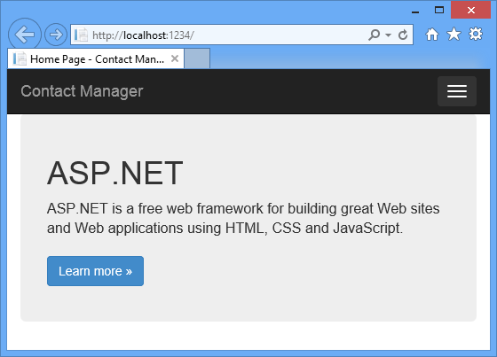

<properties 
    pageTitle="Criar um serviço REST usando API Web do ASP.NET e banco de dados do SQL no serviço de aplicativo do Azure" 
    description="Um tutorial que ensina como implantar um aplicativo que usa a API de Web do ASP.NET para um aplicativo web Azure usando o Visual Studio." 
    services="app-service\web" 
    documentationCenter=".net" 
    authors="Rick-Anderson" 
    writer="Rick-Anderson" 
    manager="wpickett" 
    editor=""/>

<tags 
    ms.service="app-service-web" 
    ms.workload="web" 
    ms.tgt_pltfrm="na" 
    ms.devlang="dotnet" 
    ms.topic="article" 
    ms.date="02/29/2016" 
    ms.author="riande"/>

# Criar um serviço REST usando API Web do ASP.NET e banco de dados do SQL no serviço de aplicativo do Azure

Este tutorial mostra como implantar um aplicativo web do ASP.NET em um [Serviço de aplicativo do Azure](http://go.microsoft.com/fwlink/?LinkId=529714) usando o Assistente de publicar Web no Visual Studio 2013 ou no Visual Studio 2013 Community Edition. 

Você pode abrir uma conta do Azure gratuitamente e se você ainda não tiver o Visual Studio 2013, o SDK automaticamente instala 2013 do Visual Studio para Web Express. Portanto, você pode começar a desenvolvimento para Azure inteiramente de gratuitamente.

Este tutorial supõe que você tenha sem experiência anterior usando o Azure. Em Concluindo neste tutorial, você terá um aplicativo web simples para cima e em execução na nuvem.
 
Você aprenderá:

* Como habilitar o computador para desenvolvimento Azure instalando o SDK do Azure.
* Como criar um projeto do Visual Studio ASP.NET MVC 5 e publicá-lo em um aplicativo do Azure.
* Como usar a API Web do ASP.NET para habilitar chamadas API Restful.
* Como usar um banco de dados SQL para armazenar dados no Azure.
* Como publicar atualizações de aplicativo no Azure.

Você vai criar um aplicativo da web de lista de contatos simples que foi criado no ASP.NET MVC 5 e usa a estrutura de entidades ADO.NET para acesso de banco de dados. A ilustração a seguir mostra o aplicativo concluído:

![captura de tela do site][intro001]

<!-- the next line produces the "Set up the development environment" section as see at http://azure.microsoft.com/documentation/articles/web-sites-dotnet-get-started/ -->
[AZURE.INCLUDE [create-account-and-websites-note](../../includes/create-account-and-websites-note.md)]

### Criar o projeto

1. Inicie o Visual Studio 2013.
1. No menu **arquivo** , clique em **Novo projeto**.
3. Na caixa de diálogo **Novo projeto** , expanda **Visual c#** e selecione **Web** e, em seguida, selecione o **Aplicativo Web ASP.NET**. Nomeie o aplicativo **ContactManager** e clique em **Okey**.

    

1. Na caixa de diálogo **Novo projeto ASP.NET** , selecione o modelo **MVC** , marque **API da Web** e clique em **Autenticação de alteração**.

1. Na caixa de diálogo **Alterar autenticação** , clique em **Sem autenticação**e clique em **Okey**.

    

    O aplicativo de exemplo que você está criando não tenha recursos que exigem usuários efetuar login. Para obter informações sobre como implementar recursos de autenticação e a autorização, consulte a seção [Próximas etapas](#nextsteps) no final deste tutorial. 

1. Na caixa de diálogo **Novo projeto ASP.NET** , verifique se que o **Host na nuvem** está marcada e clique em **Okey**.

Se você não anteriormente entrou no Azure, você será solicitado a entrar.

1. O Assistente de configuração irá sugerir um nome exclusivo com base em *ContactManager* (consulte a imagem abaixo). Selecione uma região perto de você. Você pode usar [azurespeed.com](http://www.azurespeed.com/ "AzureSpeed.com") para localizar o Centro de dados de latência mais baixo. 
2. Se você ainda não criou um servidor de banco de dados antes, selecione **Criar novo servidor**, digite um nome de usuário de banco de dados e a senha.

    

Se você tiver um servidor de banco de dados, usá-lo para criar um novo banco de dados. Servidores de banco de dados são um recurso valiosas e você geralmente deseja criar vários bancos de dados no mesmo servidor para teste e desenvolvimento em vez de criar um servidor de banco de dados por banco de dados. Verifique se seu site e o banco de dados na mesma região.

### Definir o cabeçalho e rodapé

1. No **Solution Explorer**, expanda a pasta *Views\Shared* e abra o arquivo *cshtml* .

    ![Cshtml no Solution Explorer][newapp004]

1. Substitua o conteúdo do arquivo *Views\Shared_Layout.cshtml* com o seguinte código:

        <!DOCTYPE html>
        <html lang="en">
        <head>
            <meta charset="utf-8" />
            <title>@ViewBag.Title - Contact Manager</title>
            <link href="~/favicon.ico" rel="shortcut icon" type="image/x-icon" />
            <meta name="viewport" content="width=device-width" />
            @Styles.Render("~/Content/css")
            @Scripts.Render("~/bundles/modernizr")
        </head>
        <body>
            <header>
                

                    

                        
@Html.ActionLink("Contact Manager", "Index", "Home")

                    

                

            </header>
            

                @RenderSection("featured", required: false)
                <section class="content-wrapper main-content clear-fix">
                    @RenderBody()
                </section>
            

            <footer>
                

                    

                        
&copy; @DateTime.Now.Year - Contact Manager

                    

                

            </footer>
            @Scripts.Render("~/bundles/jquery")
            @RenderSection("scripts", required: false)
        </body>
        </html>
            
A marcação acima altera o nome do aplicativo de "Meu aplicativo de ASP.NET" para "Contact Manager", e ele remove os vínculos para **Home**, **sobre** e **contato**.

### Executar o aplicativo localmente

1. Pressione CTRL + F5 para executar o aplicativo.
A home page do aplicativo aparece no navegador padrão.
    

Isso é tudo o que você precisa fazer agora criar o aplicativo que você vai implantar em Azure. Mais tarde, você adicionará funcionalidade de banco de dados.

## Implantar o aplicativo do Azure

1. No Visual Studio, clique com botão direito do projeto no **Solution Explorer** e selecione **Publicar** no menu de contexto.

    ![Publicar no menu de contexto do projeto][PublishVSSolution]

    O Assistente de **Publicar Web** abre.

12. Clique em **Publicar**.

O Visual Studio inicia o processo de cópia dos arquivos para o servidor do Azure. Na janela de **saída** relatórios conclusão bem-sucedida de implantação e mostra quais ações de implantação foram realizadas.

14. O navegador padrão abre automaticamente para a URL do site implantado.

    O aplicativo que você criou agora está executando na nuvem.
    
    ![A página inicial de lista de tarefas pendentes em execução no Azure][rxz2]

## Adicionar um banco de dados para o aplicativo

Em seguida, você irá atualizar o aplicativo MVC para adicionar a capacidade de exibir e atualizar contatos e armazenar os dados em um banco de dados. O aplicativo irá usar a estrutura de entidade para criar o banco de dados e para ler e atualizar dados no banco de dados.

### Adicionar classes de modelo de dados para os contatos

Você começa criando um modelo de dados simples no código.

1. No **Solution Explorer**, clique com botão direito na pasta de modelos, clique em **Adicionar**e, em seguida, **classe**.

    ![Adicionar classe no menu de contexto da pasta de modelos][adddb001]

2. Na caixa de diálogo **Adicionar Novo Item** , nomeie o novo arquivo de classe *Contact.cs*e clique em **Adicionar**.

    ![Adicionar caixa de diálogo Novo Item][adddb002]

3. Substitua o conteúdo do arquivo Contacts.cs com o seguinte código.

        using System.Globalization;
        namespace ContactManager.Models
        {
            public class Contact
            {
                public int ContactId { get; set; }
                public string Name { get; set; }
                public string Address { get; set; }
                public string City { get; set; }
                public string State { get; set; }
                public string Zip { get; set; }
                public string Email { get; set; }
                public string Twitter { get; set; }
                public string Self
                {
                    get { return string.Format(CultureInfo.CurrentCulture,
                         "api/contacts/{0}", this.ContactId); }
                    set { }
                }
            }
        }

A classe **contato** define os dados que você irá armazenar para cada contato, além de uma chave primária, contato, que é necessário para o banco de dados. Você pode obter mais informações sobre modelos de dados na seção [Próximas etapas](#nextsteps) no final deste tutorial.

### Criar páginas da web que permitem aos usuários do aplicativo trabalhar com os contatos

O ASP.NET MVC o recurso de estrutura pode gerar automaticamente código que executa criar, ler, atualizar e excluir ações (CRUD).

## Adicionar um controlador e um modo de exibição para os dados

1. No **Solution Explorer**, expanda a pasta de controladores.

3. Crie o projeto **(Ctrl + Shift + B)**. (Você deve criar o projeto antes de usar o mecanismo de estrutura). 

4. Clique com botão direito na pasta de controladores e clique em **Adicionar**e, em seguida, clique em **controlador**.

    ![Adicionar controlador no menu de contexto de pasta de controladores][addcode001]

1. Na caixa de diálogo **Adicionar Scaffold** , selecione **Controlador MVC com modos de exibição, usando a estrutura de entidade** e clique em **Adicionar**.

 

6. Defina o nome do controlador como **HomeController**. Selecione o **contato** como sua classe de modelo. Clique no botão **novo contexto de dados** e aceite o padrão "ContactManager.Models.ContactManagerContext" para o **novo tipo de contexto de dados**. Clique em **Adicionar**.

    Uma caixa de diálogo solicitará que você: "um arquivo com o nome HomeController já sai. Você deseja substituí-lo? ". Clique em **Sim**. Nós estiver sobrescrevendo o controlador Home que foi criado com o novo projeto. Usaremos o novo controlador Home para nossa lista de contatos.

    Visual Studio cria métodos de controlador e modos de exibição para operações de banco de dados CRUD para objetos de **contato** .

## Habilitar migrações, criar o banco de dados, adicionar dados de exemplo e um inicializador de dados ##

A próxima tarefa é habilitar o recurso de [Código primeiro migrações](http://curah.microsoft.com/55220) para criar o banco de dados com base no modelo de dados que você criou.

1. No menu **Ferramentas** , selecione **Gerenciador de pacote de biblioteca** e **Package Manager Console**.

    ![Console Gerenciador de pacote no menu Ferramentas][addcode008]

2. Na janela do **Console do Gerenciador de pacote** , digite o seguinte comando:

        enable-migrations 
  
    O comando **enable-migrações** cria uma pasta de *migrações* e ele coloca nessa pasta um arquivo de *Configuration.cs* que você pode editar para configurar as migrações. 

2. Na janela do **Console do Gerenciador de pacote** , digite o seguinte comando:

        add-migration Initial

    O comando **inicial de migração adicionar** gera uma classe denominada ** &lt;date_stamp&gt;inicial** que cria o banco de dados. O primeiro parâmetro ( *inicial* ) é aleatório e usadas para criar o nome do arquivo. Você pode ver os novos arquivos de classe no **Solution Explorer**.

    Na classe **inicial** , o método de **backup** cria a tabela Contatos e o método **para baixo** (usado quando você deseja retornar para o estado anterior) descarta-lo.

3. Abra o arquivo *Migrations\Configuration.cs* . 

4. Adicione os seguintes namespaces. 

         using ContactManager.Models;

5. Substitua o método de *propagação* com o seguinte código:
        
        protected override void Seed(ContactManager.Models.ContactManagerContext context)
        {
            context.Contacts.AddOrUpdate(p => p.Name,
               new Contact
               {
                   Name = "Debra Garcia",
                   Address = "1234 Main St",
                   City = "Redmond",
                   State = "WA",
                   Zip = "10999",
                   Email = "debra@example.com",
                   Twitter = "debra_example"
               },
                new Contact
                {
                    Name = "Thorsten Weinrich",
                    Address = "5678 1st Ave W",
                    City = "Redmond",
                    State = "WA",
                    Zip = "10999",
                    Email = "thorsten@example.com",
                    Twitter = "thorsten_example"
                },
                new Contact
                {
                    Name = "Yuhong Li",
                    Address = "9012 State st",
                    City = "Redmond",
                    State = "WA",
                    Zip = "10999",
                    Email = "yuhong@example.com",
                    Twitter = "yuhong_example"
                },
                new Contact
                {
                    Name = "Jon Orton",
                    Address = "3456 Maple St",
                    City = "Redmond",
                    State = "WA",
                    Zip = "10999",
                    Email = "jon@example.com",
                    Twitter = "jon_example"
                },
                new Contact
                {
                    Name = "Diliana Alexieva-Bosseva",
                    Address = "7890 2nd Ave E",
                    City = "Redmond",
                    State = "WA",
                    Zip = "10999",
                    Email = "diliana@example.com",
                    Twitter = "diliana_example"
                }
                );
        }

    Este código acima irá inicializar o banco de dados com as informações de contato. Para obter mais informações sobre o banco de dados de propagação, consulte [bancos de dados de estrutura de entidade de depuração (FE)](http://blogs.msdn.com/b/rickandy/archive/2013/02/12/seeding-and-debugging-entity-framework-ef-dbs.aspx).

1. No **Package Manager Console** , digite o comando:

        update-database

    ![Comandos do Console do Gerenciador de pacote][addcode009]

    O **banco de dados update** executa a primeira migração que cria o banco de dados. Por padrão, o banco de dados é criado como um banco de dados do SQL Server Express LocalDB.

1. Pressione CTRL + F5 para executar o aplicativo. 

O aplicativo mostra os dados de propagação e fornece links de edição, detalhes e excluir.

![Modo de exibição MVC de dados][rxz3]

## Editar a exibição

1. Abra o arquivo *Views\Home\Index.cshtml* . Na próxima etapa, podemos substituirá a marcação gerada pelo código que usa [jQuery](http://jquery.com/) e [Knockout. js](http://knockoutjs.com/). Esse novo código recupera a lista de contatos de usando web API e JSON e, em seguida, vincula os dados de contato para a interface do usuário usando Knockout. js. Para obter mais informações, consulte a seção [Próximas etapas](#nextsteps) no final deste tutorial. 

2. Substitua o conteúdo do arquivo com o seguinte código.

        @model IEnumerable<ContactManager.Models.Contact>
        @{
            ViewBag.Title = "Home";
        }
        @section Scripts {
            @Scripts.Render("~/bundles/knockout")
            
        }
        <ul id="contacts" data-bind="foreach: contacts">
            <li class="ui-widget-content ui-corner-all">
                <h1 data-bind="text: Name" class="ui-widget-header"></h1>
                

                

                    ,
                    
                    
                

                

                
Email?

                

                
Twitter?

                
<a data-bind="attr: { href: Self }, click: $root.removeContact" class="removeContact ui-state-default ui-corner-all">Remove</a>

            </li>
        </ul>
        <form id="addContact" data-bind="submit: addContact">
            <fieldset>
                <legend>Add New Contact</legend>
                <ol>
                    <li>
                        <label for="Name">Name</label>
                        <input type="text" name="Name" />
                    </li>
                    <li>
                        <label for="Address">Address</label>
                        <input type="text" name="Address" >
                    </li>
                    <li>
                        <label for="City">City</label>
                        <input type="text" name="City" />
                    </li>
                    <li>
                        <label for="State">State</label>
                        <input type="text" name="State" />
                    </li>
                    <li>
                        <label for="Zip">Zip</label>
                        <input type="text" name="Zip" />
                    </li>
                    <li>
                        <label for="Email">E-mail</label>
                        <input type="text" name="Email" />
                    </li>
                    <li>
                        <label for="Twitter">Twitter</label>
                        <input type="text" name="Twitter" />
                    </li>
                </ol>
                <input type="submit" value="Add" />
            </fieldset>
        </form>

3. Clique com botão direito na pasta Conteúda e clique em **Adicionar**e, em seguida, clique em **Novo Item...**.

    ![Adicionar folha de estilos no menu de contexto da pasta de conteúdo][addcode005]

4. Na caixa de diálogo **Adicionar Novo Item** , insira o **estilo** na caixa de pesquisa direita superior e selecione **Folha de estilos**.
    ![Adicionar caixa de diálogo Novo Item][rxStyle]

5. Nomeie o arquivo *Contacts.css* e clique em **Adicionar**. Substitua o conteúdo do arquivo com o seguinte código.
    
        .column {
            float: left;
            width: 50%;
            padding: 0;
            margin: 5px 0;
        }
        form ol {
            list-style-type: none;
            padding: 0;
            margin: 0;
        }
        form li {
            padding: 1px;
            margin: 3px;
        }
        form input[type="text"] {
            width: 100%;
        }
        #addContact {
            width: 300px;
            float: left;
            width:30%;
        }
        #contacts {
            list-style-type: none;
            margin: 0;
            padding: 0;
            float:left;
            width: 70%;
        }
        #contacts li {
            margin: 3px 3px 3px 0;
            padding: 1px;
            float: left;
            width: 300px;
            text-align: center;
            background-image: none;
            background-color: #F5F5F5;
        }
        #contacts li h1
        {
            padding: 0;
            margin: 0;
            background-image: none;
            background-color: Orange;
            color: White;
            font-family: Trebuchet MS, Tahoma, Verdana, Arial, sans-serif;
        }
        .removeContact, .viewImage
        {
            padding: 3px;
            text-decoration: none;
        }

    Usaremos esta folha de estilos para o layout, cores e estilos usados no aplicativo do Gerenciador de contatos.

6. Abra o arquivo *App_Start\BundleConfig.cs* .

7. Adicione o seguinte código para registrar o plug-in(http://knockoutjs.com/index.html "co") de [separação].

        bundles.Add(new ScriptBundle("~/bundles/knockout").Include(
                    "~/Scripts/knockout-{version}.js"));
    Este exemplo usando separação para simplificar o código JavaScript dinâmico que lida com os modelos de tela.

8. Modificar a entrada de sumário/css para registrar a folha de estilos de *contacts.css* . Altere a seguinte linha:

                 bundles.Add(new StyleBundle("~/Content/css").Include(
                   "~/Content/bootstrap.css",
                   "~/Content/site.css"));
Para:

        bundles.Add(new StyleBundle("~/Content/css").Include(
                   "~/Content/bootstrap.css",
                   "~/Content/contacts.css",
                   "~/Content/site.css"));

1. No Console do Gerenciador de pacote, execute o seguinte comando para instalar a separação.

        Install-Package knockoutjs

## Adicionar um controlador para a interface de Web API Restful

1. No **Solution Explorer**, clique com botão direito controladores e clique em **Adicionar** e, em seguida, **controlador …** 

1. Na caixa de diálogo **Adicionar Scaffold** , insira **Web API 2 controlador com ações, usando a estrutura de entidade** e clique em **Adicionar**.

    

4. Na caixa de diálogo **Adicionar controlador** , insira "ContactsController" como o nome do controlador. Selecione "Contato (ContactManager.Models)" para a **classe de modelo**.  Manter o valor padrão para a **classe de contexto de dados**. 

6. Clique em **Adicionar**.

### Executar o aplicativo localmente

1. Pressione CTRL + F5 para executar o aplicativo.

    ![Página de índice][intro001]

2. Insira um contato e clique em **Adicionar**. O aplicativo retorna para a página inicial e exibe o contato que você inseriu.

    ![Página de índice com itens de lista de tarefas pendentes][addwebapi004]

3. No navegador, acrescente **/api/contacts** para a URL.

    A URL resultante será semelhante a api/http://localhost:1234/contatos. Web RESTful API que você adicionou retorna os contatos armazenados. Firefox e Chrome exibirá os dados em formato XML.

    ![Página de índice com itens de lista de tarefas pendentes][rxFFchrome]
    

    IE solicitará que você abra ou salve os contatos.

    ![Caixa de diálogo Salvar de API da Web][addwebapi006]
    
    
    Você pode abrir os contatos retornados no bloco de notas ou um navegador.
    
    Esta saída pode ser consumida por outro aplicativo como o aplicativo ou página da web móvel.

    ![Caixa de diálogo Salvar de API da Web][addwebapi007]

    **Aviso de segurança**: neste ponto, seu aplicativo for insegura e vulnerável a ataque CSRF. Mais tarde no tutorial podemos removerá essa vulnerabilidade. Para obter mais informações, consulte [ataques impedindo intersite solicitar falsificação (CSRF)][prevent-csrf-attacks].
## Adicionar proteção de XSRF

Falsificação de solicitação intersite (também conhecido como XSRF ou CSRF) é um ataque contra aplicativos web hospedada por meio da qual um site mal-intencionado pode influenciar a interação entre um navegador cliente e um site confiável pelo navegador. Esses ataques são feitos possíveis porque navegadores da web enviará tokens de autenticação automaticamente com cada solicitação para um site. O exemplo canônico é um cookie de autenticação, como ASP. Tíquete de autenticação de formulários do líquido. No entanto, os sites que usam qualquer mecanismo de autenticação persistente (como autenticação do Windows, básico e assim por diante) podem ser direcionadas por esses ataques.

Um ataque XSRF é diferente de um ataque de phishing. Ataques de phishing exigem a interação do vítima. Em um ataque de phishing, um site mal-intencionado será simular o site de destino e a vítima enganar fornecendo informações confidenciais ao invasor. Em um ataque XSRF, há geralmente nenhuma interação necessário à vítima. Em vez disso, o invasor depende do navegador enviar automaticamente todos os cookies relevantes para o site de destino.

Para obter mais informações, consulte o [Projeto de segurança do aplicativo Web aberto](https://www.owasp.org/index.php/Main_Page) (OWASP) [XSRF](https://www.owasp.org/index.php/Cross-Site_Request_Forgery_(CSRF)).

1. No **Solution Explorer**, projeto de **ContactManager** para a direita e clique em **Adicionar** e clique em **classe**.

2. Nomeie o arquivo *ValidateHttpAntiForgeryTokenAttribute.cs* e adicione o seguinte código:

        using System;
        using System.Collections.Generic;
        using System.Linq;
        using System.Net;
        using System.Net.Http;
        using System.Web.Helpers;
        using System.Web.Http.Controllers;
        using System.Web.Http.Filters;
        using System.Web.Mvc;
        namespace ContactManager.Filters
        {
            public class ValidateHttpAntiForgeryTokenAttribute : AuthorizationFilterAttribute
            {
                public override void OnAuthorization(HttpActionContext actionContext)
                {
                    HttpRequestMessage request = actionContext.ControllerContext.Request;
                    try
                    {
                        if (IsAjaxRequest(request))
                        {
                            ValidateRequestHeader(request);
                        }
                        else
                        {
                            AntiForgery.Validate();
                        }
                    }
                    catch (HttpAntiForgeryException e)
                    {
                        actionContext.Response = request.CreateErrorResponse(HttpStatusCode.Forbidden, e);
                    }
                }
                private bool IsAjaxRequest(HttpRequestMessage request)
                {
                    IEnumerable<string> xRequestedWithHeaders;
                    if (request.Headers.TryGetValues("X-Requested-With", out xRequestedWithHeaders))
                    {
                        string headerValue = xRequestedWithHeaders.FirstOrDefault();
                        if (!String.IsNullOrEmpty(headerValue))
                        {
                            return String.Equals(headerValue, "XMLHttpRequest", StringComparison.OrdinalIgnoreCase);
                        }
                    }
                    return false;
                }
                private void ValidateRequestHeader(HttpRequestMessage request)
                {
                    string cookieToken = String.Empty;
                    string formToken = String.Empty;
                    IEnumerable<string> tokenHeaders;
                    if (request.Headers.TryGetValues("RequestVerificationToken", out tokenHeaders))
                    {
                        string tokenValue = tokenHeaders.FirstOrDefault();
                        if (!String.IsNullOrEmpty(tokenValue))
                        {
                            string[] tokens = tokenValue.Split(':');
                            if (tokens.Length == 2)
                            {
                                cookieToken = tokens[0].Trim();
                                formToken = tokens[1].Trim();
                            }
                        }
                    }
                    AntiForgery.Validate(cookieToken, formToken);
                }
            }
        }

1. Adicione a seguinte instrução de *uso* para o controlador de contratos que você tenha acesso ao atributo **[ValidateHttpAntiForgeryToken]** .

        using ContactManager.Filters;

1. Adicione o atributo **[ValidateHttpAntiForgeryToken]** para os métodos de postagem do **ContactsController** para protegê-la contra ameaças XSRF. Você irá adicioná-lo para os métodos de ação "PutContact", "PostContact" e **DeleteContact** .

        [ValidateHttpAntiForgeryToken]
            public IHttpActionResult PutContact(int id, Contact contact)
            {

1. Atualize a seção de *Scripts* do arquivo *Views\Home\Index.cshtml* para incluir o código para obter os tokens XSRF.

         @section Scripts {
            @Scripts.Render("~/bundles/knockout")
            
         }

## Publicar a atualização do aplicativo do Azure e banco de dados SQL

Para publicar o aplicativo, você repita o procedimento que você seguiu anteriormente.

1. No **Solution Explorer**, clique com botão direito do projeto e selecione **Publicar**.

    ![Publicar][rxP]

5. Clique na guia **configurações** .
    

1. Em **ContactsManagerContext(ContactsManagerContext)**, clique no ícone de **v** para alterar a *cadeia de conexão remota* para a cadeia de conexão do banco de dados de contato. Clique em **ContactDB**.

    

7. Marque a caixa para **Executar migrações de primeira código (é executado em Iniciar aplicativo)**.

1. Clique em **Avançar** e, em seguida, clique em **Visualizar**. Visual Studio exibe uma lista dos arquivos que serão adicionados ou atualizados.

8. Clique em **Publicar**.
Após a implantação for concluído, o navegador abre para a home page do aplicativo.

    ![Página de índice com sem contatos][intro001]

    O Visual Studio publicar processo automaticamente configurado a cadeia de conexão no arquivo *Web. config* implantado para apontar para o banco de dados do SQL. Ele também configurado primeiro as migrações de código para atualizar automaticamente o banco de dados para a versão mais recente na primeira vez que o aplicativo acessa o banco de dados após a implantação.

    Como resultado dessa configuração, o Code First criou o banco de dados executando o código da classe **inicial** que você criou anteriormente. Ela fez isso na primeira vez que o aplicativo tentou acessar o banco de dados após a implantação.

9. Insira um contato que você fez quando você executou o aplicativo localmente, para verificar se a implantação do banco de dados foi bem-sucedida.

Quando você vir que o item que você inserir é salva e aparece na página Gerenciador de contato, você sabe que ele foi armazenado no banco de dados.

![Página de índice com contatos][addwebapi004]

O aplicativo agora está executando na nuvem, usando o banco de dados SQL para armazenar seus dados. Após terminar de teste do aplicativo no Azure, exclua-o. O aplicativo é público e não tem um mecanismo para limitar o acesso.

>[AZURE.NOTE] Se você quiser começar a usar o serviço de aplicativo do Azure antes de se inscrever para uma conta do Azure, vá para [Experimentar o serviço de aplicativo](http://go.microsoft.com/fwlink/?LinkId=523751), onde você pode criar imediatamente um aplicativo da web de curta duração starter no aplicativo de serviço. Não há cartões de crédito obrigatório; Não há compromissos.

## Próximas etapas

Um aplicativo real exijam autenticação e a autorização e você usaria o banco de dados de associação para essa finalidade. O tutorial [implantar um aplicativo de seguro ASP.NET MVC com OAuth, associação e banco de dados SQL](web-sites-dotnet-deploy-aspnet-mvc-app-membership-oauth-sql-database.md) se baseia neste tutorial e mostra como implantar um aplicativo web com o banco de dados de associação.

Outra maneira de armazenar dados em um aplicativo do Azure é usar o armazenamento do Azure, que fornece armazenamento de dados não-relacionais na forma de blobs e tabelas. Os links a seguir fornecem mais informações sobre API da Web, o ASP.NET MVC e o Azure de janela.
 

* [Introdução ao Framework de entidade usando MVC][EFCodeFirstMVCTutorial]
* [Introdução ao ASP.NET MVC 5](http://www.asp.net/mvc/tutorials/mvc-5/introduction/getting-started)
* [Sua primeira Web ASP.NET API](http://www.asp.net/web-api/overview/getting-started-with-aspnet-web-api/tutorial-your-first-web-api)
* [Depuração WAWS](web-sites-dotnet-troubleshoot-visual-studio.md)

Neste tutorial e o aplicativo de exemplo foi escrito por [Rich Marques](http://blogs.msdn.com/b/rickandy/) (Twitter [@RickAndMSFT](https://twitter.com/RickAndMSFT)) com a assistência de Tom Dykstra e Barry Dorrans (Twitter [@blowdart](https://twitter.com/blowdart)). 

Envie comentários médica no que você gostou ou o que você gostaria de ver aprimorado, não apenas sobre o tutorial em si, mas também sobre os produtos que ele demonstra. Seus comentários nos ajudarão a priorizar melhorias. Estamos especialmente interessados em descobrir quanto juros há em mais automação para o processo de configuração e implantação do banco de dados de associação. 

## O que mudou
* Para um guia para a alteração de sites para o serviço de aplicativo consulte: [o serviço de aplicativo do Azure e seu impacto sobre serviços existentes do Azure](http://go.microsoft.com/fwlink/?LinkId=529714)

<!-- bookmarks -->
[Add an OAuth Provider]: #addOauth
[Add Roles to the Membership Database]:#mbrDB
[Create a Data Deployment Script]:#ppd
[Update the Membership Database]:#ppd2
[setupdbenv]: #bkmk_setupdevenv
[setupwindowsazureenv]: #bkmk_setupwindowsazure
[createapplication]: #bkmk_createmvc4app
[deployapp1]: #bkmk_deploytowindowsazure1
[adddb]: #bkmk_addadatabase
[addcontroller]: #bkmk_addcontroller
[addwebapi]: #bkmk_addwebapi
[deploy2]: #bkmk_deploydatabaseupdate

<!-- links -->
[EFCodeFirstMVCTutorial]: http://www.asp.net/mvc/tutorials/getting-started-with-ef-using-mvc/creating-an-entity-framework-data-model-for-an-asp-net-mvc-application
[dbcontext-link]: http://msdn.microsoft.com/library/system.data.entity.dbcontext(v=VS.103).aspx

<!-- images-->
[rxE]: ./media/web-sites-dotnet-rest-service-aspnet-api-sql-database/rxE.png
[rxP]: ./media/web-sites-dotnet-rest-service-aspnet-api-sql-database/rxP.png
[rx22]: ./media/web-sites-dotnet-rest-service-aspnet-api-sql-database/
[rxb2]: ./media/web-sites-dotnet-rest-service-aspnet-api-sql-database/rxb2.png
[rxz]: ./media/web-sites-dotnet-rest-service-aspnet-api-sql-database/rxz.png
[rxzz]: ./media/web-sites-dotnet-rest-service-aspnet-api-sql-database/rxzz.png
[rxz2]: ./media/web-sites-dotnet-rest-service-aspnet-api-sql-database/rxz2.png
[rxz3]: ./media/web-sites-dotnet-rest-service-aspnet-api-sql-database/rxz3.png
[rxStyle]: ./media/web-sites-dotnet-rest-service-aspnet-api-sql-database/rxStyle.png
[rxz4]: ./media/web-sites-dotnet-rest-service-aspnet-api-sql-database/rxz4.png
[rxz44]: ./media/web-sites-dotnet-rest-service-aspnet-api-sql-database/rxz44.png
[rxNewCtx]: ./media/web-sites-dotnet-rest-service-aspnet-api-sql-database/rxNewCtx.png
[rxPrevDB]: ./media/web-sites-dotnet-rest-service-aspnet-api-sql-database/rxPrevDB.png
[rxOverwrite]: ./media/web-sites-dotnet-rest-service-aspnet-api-sql-database/rxOverwrite.png
[rxPWS]: ./media/web-sites-dotnet-rest-service-aspnet-api-sql-database/rxPWS.png
[rxNewCtx]: ./media/web-sites-dotnet-rest-service-aspnet-api-sql-database/rxNewCtx.png
[rxAddApiController]: ./media/web-sites-dotnet-rest-service-aspnet-api-sql-database/rxAddApiController.png
[rxFFchrome]: ./media/web-sites-dotnet-rest-service-aspnet-api-sql-database/rxFFchrome.png
[intro001]: ./media/web-sites-dotnet-rest-service-aspnet-api-sql-database/dntutmobil-intro-finished-web-app.png
[rxCreateWSwithDB]: ./media/web-sites-dotnet-rest-service-aspnet-api-sql-database/rxCreateWSwithDB.png
[setup007]: ./media/web-sites-dotnet-rest-service-aspnet-api-sql-database/dntutmobile-setup-azure-site-004.png
[setup009]: ../Media/dntutmobile-setup-azure-site-006.png
[newapp002]: ./media/web-sites-dotnet-rest-service-aspnet-api-sql-database/dntutmobile-createapp-002.png
[newapp004]: ./media/web-sites-dotnet-rest-service-aspnet-api-sql-database/dntutmobile-createapp-004.png
[firsdeploy007]: ./media/web-sites-dotnet-rest-service-aspnet-api-sql-database/dntutmobile-deploy1-publish-005.png
[firsdeploy009]: ./media/web-sites-dotnet-rest-service-aspnet-api-sql-database/dntutmobile-deploy1-publish-007.png
[adddb001]: ./media/web-sites-dotnet-rest-service-aspnet-api-sql-database/dntutmobile-adddatabase-001.png
[adddb002]: ./media/web-sites-dotnet-rest-service-aspnet-api-sql-database/dntutmobile-adddatabase-002.png
[addcode001]: ./media/web-sites-dotnet-rest-service-aspnet-api-sql-database/dntutmobile-controller-add-context-menu.png
[addcode002]: ./media/web-sites-dotnet-rest-service-aspnet-api-sql-database/dntutmobile-controller-add-controller-dialog.png
[addcode004]: ./media/web-sites-dotnet-rest-service-aspnet-api-sql-database/dntutmobile-controller-modify-index-context.png
[addcode005]: ./media/web-sites-dotnet-rest-service-aspnet-api-sql-database/dntutmobile-controller-add-contents-context-menu.png
[addcode007]: ./media/web-sites-dotnet-rest-service-aspnet-api-sql-database/dntutmobile-controller-modify-bundleconfig-context.png
[addcode008]: ./media/web-sites-dotnet-rest-service-aspnet-api-sql-database/dntutmobile-migrations-package-manager-menu.png
[addcode009]: ./media/web-sites-dotnet-rest-service-aspnet-api-sql-database/dntutmobile-migrations-package-manager-console.png
[addwebapi004]: ./media/web-sites-dotnet-rest-service-aspnet-api-sql-database/dntutmobile-webapi-added-contact.png
[addwebapi006]: ./media/web-sites-dotnet-rest-service-aspnet-api-sql-database/dntutmobile-webapi-save-returned-contacts.png
[addwebapi007]: ./media/web-sites-dotnet-rest-service-aspnet-api-sql-database/dntutmobile-webapi-contacts-in-notepad.png
[Add XSRF Protection]: #xsrf
[WebPIAzureSdk20NetVS12]: ./media/web-sites-dotnet-rest-service-aspnet-api-sql-database/WebPIAzureSdk20NetVS12.png
[Add XSRF Protection]: #xsrf
[ImportPublishSettings]: ./media/web-sites-dotnet-rest-service-aspnet-api-sql-database/ImportPublishSettings.png
[ImportPublishProfile]: ./media/web-sites-dotnet-rest-service-aspnet-api-sql-database/ImportPublishProfile.png
[PublishVSSolution]: ./media/web-sites-dotnet-rest-service-aspnet-api-sql-database/PublishVSSolution.png
[ValidateConnection]: ./media/web-sites-dotnet-rest-service-aspnet-api-sql-database/ValidateConnection.png
[WebPIAzureSdk20NetVS12]: ./media/web-sites-dotnet-rest-service-aspnet-api-sql-database/WebPIAzureSdk20NetVS12.png
[prevent-csrf-attacks]: http://www.asp.net/web-api/overview/security/preventing-cross-site-request-forgery-(csrf)-attacks
 
