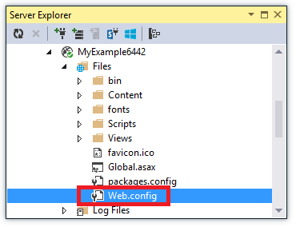
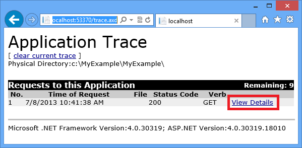
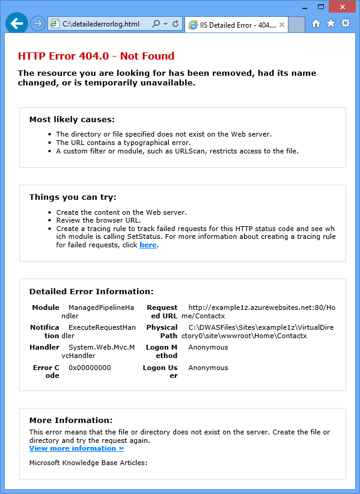
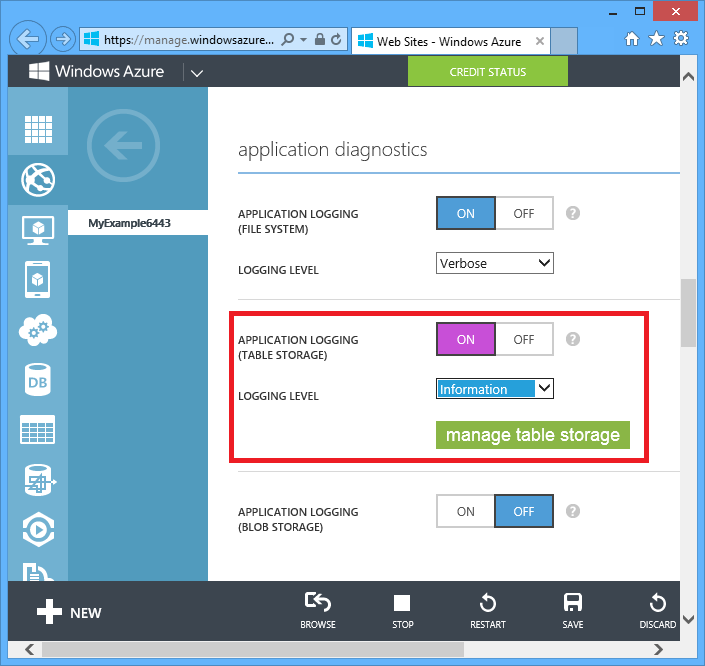
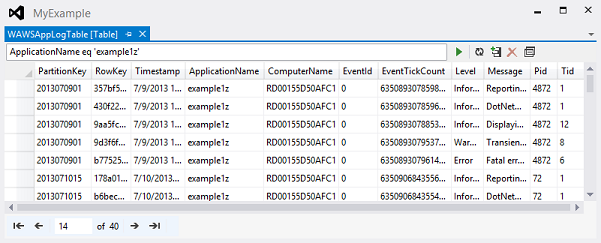

<properties 
    pageTitle="Solucionar problemas de um aplicativo web no serviço de aplicativo do Azure usando o Visual Studio" 
    description="Saiba como solucionar problemas com o aplicativo web Azure usando depuração remota, rastreamento e ferramentas de log que são criadas Visual Studio 2013." 
    services="app-service" 
    documentationCenter=".net" 
    authors="tdykstra" 
    manager="wpickett" 
    editor=""/>

<tags 
    ms.service="app-service" 
    ms.workload="na" 
    ms.tgt_pltfrm="na" 
    ms.devlang="dotnet" 
    ms.topic="article" 
    ms.date="08/29/2016" 
    ms.author="rachelap"/>

# Solucionar problemas de um aplicativo web no serviço de aplicativo do Azure usando o Visual Studio

## Visão geral

Este tutorial mostra como usar as ferramentas do Visual Studio que ajudam a depurar um aplicativo da web no [Aplicativo de serviço](http://go.microsoft.com/fwlink/?LinkId=529714), executando no [modo de depuração](http://www.visualstudio.com/get-started/debug-your-app-vs.aspx) remotamente ou exibindo logs de aplicativos e registros do servidor web.

[AZURE.INCLUDE [app-service-web-to-api-and-mobile](../../includes/app-service-web-to-api-and-mobile.md)]

Você aprenderá:

* Quais funções de gerenciamento de aplicativo web Azure estão disponíveis no Visual Studio.
* Como usar o modo de exibição remoto do Visual Studio para fazer alterações rápidas em um aplicativo web remoto.
* Como executar o modo de depuração remotamente enquanto um projeto está em execução no Azure, tanto para um aplicativo web para uma WebJob.
* Como criar logs de rastreamento de aplicativo e exibi-los enquanto o aplicativo está criando-los.
* Como exibir registros do servidor web, incluindo mensagens de erro detalhadas e falhou rastreamento de solicitação.
* Como enviar logs de diagnóstico para um armazenamento do Azure conta e visualizá-las lá.

Se você tiver o Visual Studio Ultimate, você também pode usar o [IntelliTrace](http://msdn.microsoft.com/library/vstudio/dd264915.aspx) para depuração. IntelliTrace não é coberto neste tutorial.

## Pré-requisitos

Este tutorial funciona com o ambiente de desenvolvimento, projeto da web e aplicativo web Azure que você configurar na [Introdução ao Azure e ASP.NET][GetStarted]. Para as seções de WebJobs, você precisará do aplicativo que você cria em [Começar a usar o SDK do Azure WebJobs][GetStartedWJ].

Os exemplos de código mostrados neste tutorial são para um aplicativo da web c# MVC, mas os procedimentos de solução de problemas são as mesmas para aplicativos Visual Basic e formulários da Web.

O tutorial supõe que você estiver usando o Visual Studio 2015 ou 2013. Se você estiver usando o Visual Studio 2013, os recursos de WebJobs exigem [atualização 4](http://go.microsoft.com/fwlink/?LinkID=510314) ou posterior. 

Os logs de streaming recurso só funciona para aplicativos que têm como alvo .NET Framework 4 ou posterior.

## Gerenciamento e configuração do aplicativo web

Visual Studio fornece acesso a um subconjunto das configurações disponíveis no [Portal do Azure](http://go.microsoft.com/fwlink/?LinkId=529715)e funções de gerenciamento de aplicativo da web. Nesta seção, você verá o que está disponível usando **Server Explorer**. Para ver os recursos de integração com o Azure mais recentes, experimente **Nuvem Explorer** também. Você pode abrir as duas janelas no menu **Exibir** . 

1. Se você já não tenha entrado no Azure no Visual Studio, clique no botão **conectar ao Azure** no **Server Explorer**.

    Uma alternativa é instalar um certificado de gerenciamento que permite o acesso à sua conta. Se você optar por instalar um certificado, clique com botão direito no nó **Azure** no **Explorador de servidor**e, em seguida, clique em **Gerenciar e assinaturas de filtro** no menu de contexto. Na caixa de diálogo **Gerenciar assinaturas do Azure** , clique na guia **certificados** e, em seguida, clique em **Importar**. Siga as instruções para baixar e, em seguida, importar um arquivo de assinatura (também chamado de um arquivo *. publishsettings* ) para sua conta do Azure.

    > [AZURE.NOTE]
    > Se você baixar um arquivo de assinatura, salvá-lo em uma pasta fora os diretórios de código de origem (por exemplo, na pasta Downloads) e, em seguida, excluí-la após a importação ter sido concluído. Um usuário mal-intencionado que obtém acesso para o arquivo de assinatura pode editar, criar e excluir seus serviços Azure.

    Para obter mais informações sobre como se conectar aos recursos Azure do Visual Studio, consulte [Gerenciar contas, assinaturas e funções administrativas](http://go.microsoft.com/fwlink/?LinkId=324796#BKMK_AccountVCert).

2. No **Server Explorer**, expanda **Azure** e **Serviço de aplicativo**.

3. Expanda o grupo de recursos que inclui o aplicativo da web que você criou na [guia de Introdução do Azure e ASP.NET][GetStarted], clique com botão direito no nó do aplicativo web e clique em **Configurações de exibição**.

    

    A guia **Azure Web App** é exibida e você pode ver ali os web app configuração e gerenciamento de tarefas que estão disponíveis no Visual Studio.

    

    Neste tutorial você usará o registro em log e as listas suspensas do rastreamento. Você também usará depuração remota, mas será necessário usar um método diferente para ativá-lo.
   
    Para obter informações sobre as caixas de configurações do aplicativo e cadeias de caracteres de Conexão nesta janela, consulte [Azure Web Apps: como cadeias de caracteres de aplicativo e o trabalho de cadeias de caracteres de Conexão](http://blogs.msdn.com/b/windowsazure/archive/2013/07/17/windows-azure-web-sites-how-application-strings-and-connection-strings-work.aspx).

    Se você quiser executar uma tarefa de gerenciamento de aplicativo web que não pode ser feita nesta janela, clique em **Abrir no Portal de gerenciamento** para abrir uma janela de navegador para o portal do Azure.

## Arquivos de aplicativo do Access web no Explorador de servidor

Em geral, você implantar um projeto web com o `customErrors` sinalizador no arquivo Web. config definido como `On` ou `RemoteOnly`, que significa que você não recebe uma mensagem de erro útil quando algo errado. Para muitos erros tudo o que você obtém é uma página como um dos seguintes.

**Erro de servidor no aplicativo '/':**

**Ocorreu um erro:**

**O site não pode exibir a página**

Com frequência é a maneira mais fácil para encontrar a causa do erro habilitar mensagens de erro detalhadas, que o primeiro as capturas de tela anteriores explica como fazer. Que requer uma alteração no arquivo Web. config implantado. Você pode editar o arquivo *Web. config* do projeto e reimplantar o projeto, ou criar um [Web. config transformar](http://www.asp.net/mvc/tutorials/deployment/visual-studio-web-deployment/web-config-transformations) e implantar uma compilação de depuração, mas não há uma maneira mais rápida: no **Solution Explorer** você diretamente pode visualizar e editar arquivos no aplicativo web remoto usando o recurso de *visualização remoto* .

1. No **Server Explorer**, expanda **Azure**, expanda **O serviço de aplicativo**, expanda o grupo de recursos que seu aplicativo web está localizado no e expanda o nó para o aplicativo web.

    Consulte nós que lhe dão acesso a arquivos de conteúdo e arquivos de log do aplicativo da web.

2. Expanda o nó **arquivos** e clique duas vezes no arquivo *Web. config* .

    

    Visual Studio abre o arquivo Web. config do aplicativo web remoto e mostra [remoto] ao lado do nome de arquivo na barra de título.

3. Adicione a seguinte linha para o `system.web` elemento:

    `<customErrors mode="Off"></customErrors>`

    

4. Atualize o navegador que está mostrando a mensagem de erro inútil e agora você receberá uma mensagem de erro detalhada, como o exemplo a seguir:

    

    (O erro mostrado foi criado adicionando a linha mostrada em vermelho para *Views\Home\Index.cshtml*.)

Editar o arquivo Web. config é apenas um exemplo de cenários em que a capacidade de ler e editar arquivos em seu aplicativo web Azure tornar mais fácil de solução de problemas.

## Aplicativos de web de depuração remota

Se a mensagem de erro detalhada não fornece informações suficientes, e você não pode recriar o erro localmente, outra maneira de solucionar é executado no modo de depuração remotamente. Você pode definir pontos de interrupção, manipular memória diretamente, percorra o código e até mesmo alterar o caminho do código. 

Depuração remota não funciona em edições Express do Visual Studio.

Esta seção mostra como depurar remotamente usando o projeto que você criar no [guia de Introdução do Azure e ASP.NET][GetStarted].

1. Abra o projeto da web que você criou na [guia de Introdução do Azure e ASP.NET][GetStarted].

1. Abra *Controllers\HomeController.cs*.

2. Excluir o `About()` método e inserir o código a seguir em seu lugar.

        public ActionResult About()
        {
            string currentTime = DateTime.Now.ToLongTimeString();
            ViewBag.Message = "The current time is " + currentTime;
            return View();
        }

2. [Definir um ponto de interrupção](http://www.visualstudio.com/get-started/debug-your-app-vs.aspx) na `ViewBag.Message` linha.

1. No **Solution Explorer**, clique com botão direito do projeto e clique em **Publicar**.

2. Na lista suspensa de **perfil** , selecione o mesmo perfil usadas em [Introdução ao Azure e ASP.NET][GetStarted].

3. Clique na guia **configurações** e alterar a **configuração** para **Depurar**e, em seguida, clique em **Publicar**.

    

4. Após terminar de implantação e abre seu navegador para a URL do Azure de seu aplicativo web, feche o navegador.

5. No **Server Explorer**, clique com botão direito seu aplicativo web e, em seguida, clique em **Anexar depurador**. 

    

    O navegador abre-se automaticamente à sua home page em execução no Azure. Você talvez precise Aguarde 20 segundos Azure configura o servidor para depuração. Esse atraso ocorre apenas na primeira vez que você executar no modo de depuração em um aplicativo web. Subsequentes vezes nas próximas 48 horas quando você inicia a depuração novamente lá não serão um atraso.

    **Observação:** Se você tiver problemas para iniciar o depurador, tente fazê-lo usando o **Explorador de nuvem** em vez de **Server Explorer**.

6. Clique em **sobre** no menu.

    Visual Studio interrompe no ponto de interrupção e o código está em execução no Azure, não no computador local.

7. Passe o mouse sobre o `currentTime` variável para ver o valor de tempo.

    

    O tempo que você vê é o tempo de servidor do Azure, que pode estar em um fuso horário diferente seu computador local.

8. Insira um novo valor para o `currentTime` variável, como "Agora em execução no Azure".

5. Pressione F5 para continuar a execução.

    A página sobre em execução no Azure exibe o novo valor que você inseriu para a variável currentTime.

    

## WebJobs depuração remota

Esta seção mostra como depurar remotamente usando o aplicativo do projeto e da web que você cria em [Começar a usar o SDK do Azure WebJobs](websites-dotnet-webjobs-sdk.md). 

Os recursos mostrados nesta seção estão disponíveis apenas no Visual 2013 Studio com atualização 4 ou posterior. 

Depuração remota funciona somente com WebJobs contínuo. WebJobs programadas e sob demanda não oferecem suporte a depuração.

1. Abra o projeto da web que você criou no [Começar a usar o SDK do Azure WebJobs][GetStartedWJ].

1. No projeto ContosoAdsWebJob, abra *Functions.cs*.

2. [Definir um ponto de interrupção](http://www.visualstudio.com/get-started/debug-your-app-vs.aspx) na primeira instrução no `GnerateThumbnail` método.

    

1. No **Solution Explorer**, clique com botão direito do projeto da web (não o projeto WebJob) e clique em **Publicar**.

2. Na lista suspensa de **perfil** , selecione o mesmo perfil usadas em [Começar a usar o SDK do Azure WebJobs](websites-dotnet-webjobs-sdk.md).

3. Clique na guia **configurações** e alterar a **configuração** para **Depurar**e, em seguida, clique em **Publicar**.

    Visual Studio implanta da web e projetos WebJob e seu navegador abre a URL do Azure do seu aplicativo web.

5. No **Server Explorer** expanda **Azure > serviço de aplicativo > seu grupo de recursos > seu aplicativo web > WebJobs > contínua**e clique em **ContosoAdsWebJob**.

7. Clique em **Anexar depurador**. 

    

    O navegador abre-se automaticamente à sua home page em execução no Azure. Você talvez precise Aguarde 20 segundos Azure configura o servidor para depuração. Esse atraso ocorre apenas na primeira vez que você executar no modo de depuração em um aplicativo web. Na próxima vez que você anexar o depurador lá não será um atraso, se você fazê-lo dentro de 48 horas.

6. No navegador da web que é aberto para a home page de anúncios de Contoso, crie um novo anúncio. 

    Criando um anúncio causa uma mensagem de fila deve ser criada, que será capturada pela WebJob e processada. Quando o SDK WebJobs chama a função para processar a mensagem de fila, o código atingirá o ponto de interrupção.

7. Quando o depurador quebra no ponto de interrupção, você pode examinar e alterar valores de variáveis enquanto o programa está em execução na nuvem. Na ilustração a seguir o depurador mostra o conteúdo do objeto blobInfo que foi passado para o método GenerateThumbnail.

    
 
5. Pressione F5 para continuar a execução.

    O método de GenerateThumbnail termina criando a miniatura.

6. No navegador, atualize a página de índice e você verá a miniatura.

6. No Visual Studio, pressione SHIFT + F5 para parar a depuração.

7. No **Server Explorer**, clique com botão direito no nó ContosoAdsWebJob e clique em **Painel de exibição**.

8. Entrar com suas credenciais do Azure e clique no nome de WebJob para ir para a página de sua WebJob. 

    

    O painel mostra que a função de GenerateThumbnail executada recentemente.

    (Na próxima vez que você clique em **Painel de controle do modo de exibição**, não é necessário entrar e o navegador vai diretamente para a página para seu WebJob.)

9. Clique no nome de função para ver detalhes sobre a execução de função.

    

Se sua função [escreveu logs](websites-dotnet-webjobs-sdk-storage-queues-how-to.md#logs), você pode clicar em **ToggleOutput** para vê-los.

## Observações sobre depuração remota

* Não é recomendável executar no modo de depuração em produção. Se seu aplicativo da web de produção não é dimensionado para várias instâncias de servidor, depuração impedirá o servidor web respondendo a outras solicitações. Se você tiver várias instâncias de servidor de web, quando você anexa ao depurador você obterá uma instância aleatória e você não tem como garantir que as solicitações de navegador subsequentes irão para essa instância. Além disso, você normalmente não implantar uma compilação de depuração de produção e otimizações de compilador para compilações lançadas podem tornar impossível para mostrar o que está acontecendo linha por linha no seu código fonte. Para solucionar problemas de produção, sua melhor recurso é aplicativo logs de rastreamento e da web do servidor.

* Evite paradas longas em pontos de interrupção quando remoto depuração. Azure trata um processo for interrompido por mais de alguns minutos como um processo não responde e desliga-lo.

* Durante a depuração, o servidor está enviando dados ao Visual Studio, que pode afetar encargos de largura de banda. Para obter informações sobre as taxas de largura de banda, consulte [Preços do Azure](/pricing/calculator/).

* Verifique se o `debug` atributo do `compilation` elemento no arquivo *Web. config* está definido como true. Ela é definida como true por padrão quando você publica uma configuração de compilação de depuração.

        <system.web>
          <compilation debug="true" targetFramework="4.5" />
          <httpRuntime targetFramework="4.5" />
        </system.web>

* Se você achar que o depurador não entrar no código que você deseja depurar, talvez você precise alterar a configuração de Just My Code.  Para obter mais informações, consulte [restringir revisão para Just My Code](http://msdn.microsoft.com/library/vstudio/y740d9d3.aspx#BKMK_Restrict_stepping_to_Just_My_Code).

* Um timer é iniciado no servidor quando você ativar o recurso de depuração remoto e após 48 horas o recurso será desativado automaticamente. Esse limite de 48 horas é feito por razões de segurança e o desempenho. Você pode facilmente ativá o recurso quantas vezes quiser. É recomendável deixá-la desabilitado quando você não é ativamente depuração.

* Você pode anexar manualmente o depurador a qualquer processo, não apenas o processo da web app (w3wp.exe). Para obter mais informações sobre como usar o modo de depuração no Visual Studio, consulte [depuração no Visual Studio](http://msdn.microsoft.com/library/vstudio/sc65sadd.aspx).

## Visão geral de logs de diagnóstico

Um aplicativo ASP.NET que é executado em um aplicativo web Azure pode criar os seguintes tipos de logs:

* **Logs de rastreamento de aplicativo** 
  O aplicativo cria esses logs chamando métodos da classe [System.Diagnostics.Trace](http://msdn.microsoft.com/library/system.diagnostics.trace.aspx) .
* **Registros do servidor Web** 
  O servidor web cria uma entrada de log para cada solicitação HTTP para o aplicativo web.
* **Logs de mensagens de erro detalhadas** 
  O servidor web cria uma página HTML com algumas informações adicionais para solicitações HTTP falhas (aquelas que resultam em código de status 400 ou maior). 
* **Falha na solicitação logs de rastreamento** 
  O servidor web cria um arquivo XML com informações de rastreamento detalhadas para solicitações HTTP falhas. O servidor web também fornece um arquivo XSL para formatar o XML em um navegador.
  
Log afeta o desempenho do aplicativo da web, portanto, Azure oferece a capacidade de ativar ou desativar cada tipo de log, conforme necessário. Para logs de aplicativo, você pode especificar que apenas os logs acima de um determinado nível de gravidade devem ser escritos. Quando você cria um novo aplicativo web, por padrão todos log está desativado.

Logs são gravados nos arquivos em uma pasta de *arquivos de log* no sistema de arquivos de seu aplicativo web e estão acessíveis por meio de FTP. Logs de aplicativo e de registros do servidor Web também podem ser escritos a uma conta de armazenamento do Azure. Você pode manter um volume maior de logs em uma conta de armazenamento que é possível no sistema de arquivos. Você está limitado a um máximo de 100 megabytes logs de erros quando você usa o sistema de arquivos. (Logs do sistema de arquivo são apenas para retenção de curto prazo. Azure exclui os arquivos de log antigos para liberar espaço para novos após o limite é alcançado.)  

## Criar e exibir logs de rastreamento de aplicativo

Nesta seção, você vai fazer as seguintes tarefas:

* Adicionar instruções de rastreamento ao projeto da web que você criou na [Introdução ao Azure e ASP.NET][GetStarted].
* Exiba os registros quando você executar o projeto localmente.
* Exiba os logs como eles são gerados pelo aplicativo executado no Azure. 

Para obter informações sobre como criar aplicativo logs na WebJobs, consulte [como trabalhar com armazenamento de fila Azure usando o SDK do WebJobs - como escrever logs](websites-dotnet-webjobs-sdk-storage-queues-how-to.md#logs). As instruções a seguir para exibir os logs e controlar como eles estão armazenados no Azure também se aplicam à logs de aplicativo criados por WebJobs. 

### Adicionar instruções de rastreamento para o aplicativo

1. Abra *Controllers\HomeController.cs*e substitua o `Index`, `About`, e `Contact` métodos com o código a seguir para adicionar `Trace` instruções e um `using` política do `System.Diagnostics`:

        public ActionResult Index()
        {
            Trace.WriteLine("Entering Index method");
            ViewBag.Message = "Modify this template to jump-start your ASP.NET MVC application.";
            Trace.TraceInformation("Displaying the Index page at " + DateTime.Now.ToLongTimeString());
            Trace.WriteLine("Leaving Index method");
            return View();
        }
        
        public ActionResult About()
        {
            Trace.WriteLine("Entering About method");
            ViewBag.Message = "Your app description page.";
            Trace.TraceWarning("Transient error on the About page at " + DateTime.Now.ToShortTimeString());
            Trace.WriteLine("Leaving About method");
            return View();
        }
        
        public ActionResult Contact()
        {
            Trace.WriteLine("Entering Contact method");
            ViewBag.Message = "Your contact page.";
            Trace.TraceError("Fatal error on the Contact page at " + DateTime.Now.ToLongTimeString());
            Trace.WriteLine("Leaving Contact method");
            return View();
        }       

2. Adicionar uma `using System.Diagnostics;` instrução na parte superior do arquivo.
                
### Exibir a saída de rastreamento localmente

3. Pressione F5 para executar o aplicativo no modo de depuração.

    O ouvinte de rastreamento padrão grava toda a saída de rastreamento na janela de **saída** , juntamente com outra saída de depuração. A ilustração a seguir mostra a saída das instruções de rastreamento que você adicionou ao `Index` método.

    

    As etapas a seguir mostram como exibir a saída de rastreamento em uma página da web, sem compilar no modo de depuração.

2. Abra o arquivo do aplicativo Web. config (aquele localizado na pasta de projeto) e adicione um `<system.diagnostics>` elemento no final do arquivo logo antes do fechamento `</configuration>` elemento:

        <system.diagnostics>
            <trace>
              <listeners>
                <add name="WebPageTraceListener"
                    type="System.Web.WebPageTraceListener, 
                    System.Web, 
                    Version=4.0.0.0, 
                    Culture=neutral,
                    PublicKeyToken=b03f5f7f11d50a3a" />
              </listeners>
            </trace>
          </system.diagnostics>

    O `WebPageTraceListener` permite exibir a saída de rastreamento, navegando até `/trace.axd`.

3. Adicionar um <a href="http://msdn.microsoft.com/library/vstudio/6915t83k(v=vs.100).aspx">elemento de rastreamento</a> em `<system.web>` no arquivo Web. config, como o exemplo a seguir:

        <trace enabled="true" writeToDiagnosticsTrace="true" mostRecent="true" pageOutput="false" />

3. Pressione CTRL + F5 para executar o aplicativo.

4. Na barra de endereços da janela do navegador, adicionar *Axd* à URL e pressione Enter (a URL será semelhante a http://localhost:53370/trace.axd).

5. Na página de **Rastreamento do aplicativo** , clique em **Exibir detalhes** na primeira linha (não a linha de BrowserLink).

    

    A página de **Detalhes da solicitação** aparece e na seção **Informações de rastreamento** , você verá a saída das instruções de rastreamento que você adicionou ao `Index` método.

    

    Por padrão, `trace.axd` só está disponível localmente. Se você quiser torná-lo disponível a partir de um aplicativo web remoto, você pode adicionar `localOnly="false"` para o `trace` elemento no arquivo *Web. config* , conforme mostrado no exemplo a seguir:

        <trace enabled="true" writeToDiagnosticsTrace="true" localOnly="false" mostRecent="true" pageOutput="false" />

    No entanto, permitindo que `trace.axd` em uma produção web app geralmente não é recomendável por razões de segurança e nas seções a seguir, você verá uma maneira fácil de ler logs de rastreamento em um aplicativo web Azure.

### Exibir a saída de rastreamento no Azure

1. No **Solution Explorer**, clique com botão direito do projeto da web e clique em **Publicar**.

2. Na caixa de diálogo **Publicar Web** , clique em **Publicar**.

    Após o Visual Studio publica sua atualização, ele abre uma janela do navegador à home page (presumindo que você não limpar a **URL de destino** na guia **Conexão** ).

3. No **Server Explorer**, clique com botão direito seu aplicativo web e selecione **Exibir Logs de Streaming**. 

    

    A janela de **saída** mostra que você está conectado ao serviço de streaming de log e adiciona uma linha de notificação cada minuto que vai sem um log para exibir.

    

4. Na janela do navegador que mostra a home page do aplicativo, clique em **contato**.

    Dentro de alguns segundos a saída do nível de erro rastrear você adicionou para a `Contact` método aparece na janela de **saída** .

    

    O Visual Studio só está mostrando rastreamentos de nível de erro porque é a configuração padrão quando você habilitar o log de serviço de monitoramento. Quando você cria um novo aplicativo web Azure, todos log é desabilitado por padrão, como você viu quando você abriu a página de configurações anteriormente:

    

    No entanto, quando você selecionar **Exibir Logs de Streaming**, o Visual Studio alterado automaticamente **Logging(File System) aplicativo** para **erro**, o que significa logs de nível de erro são noticiados. Para ver todos os logs de rastreamento, você pode alterar essa configuração para **detalhado**. Quando você seleciona um nível de gravidade inferior a erro, todos os logs para níveis de gravidade maiores também são relatados. Então quando você selecionar detalhado, você também ver informações, aviso e logs de erros.  

4. No **Server Explorer**, clique com botão direito do web app e clique em **Configurações de exibição** que você fez anteriormente.

5. Altere o **Log de aplicativo (sistema de arquivos)** para **detalhado**e clique em **Salvar**.
 
    

6. Na janela do navegador que agora está mostrando a sua página de **contato** , clique em **página inicial**, e em seguida, clique em **sobre**e, em seguida, clique em **contato**.

    Em alguns segundos, a janela de **saída** mostra todos os seu rastreamento de saída.

    

    Nesta seção você habilitado e desabilitado log usando configurações Azure web app. Você também pode ativar e desativar o rastreamento de ouvintes modificando o arquivo Web. config. No entanto, modificar o arquivo Web. config faz com que o domínio de aplicativo a Lixeira, enquanto Habilitar log via a configuração do aplicativo web não fazer isso. Se o problema demora muito tempo para reproduzir, ou for intermitente, reciclagem o domínio de aplicativo pode "corrigir" e forçar aguardar até que ele acontece novamente. Habilitar o diagnóstico no Azure não fazer isso, para que você possa começar a capturar informações de erro imediatamente.

### Recursos de janela de saída

Guia de **Logs do Azure** da janela de **saída** tem vários botões e uma caixa de texto:

Esses executam as seguintes funções:

* Limpe a janela de **saída** .
* Habilitar ou desabilitar a quebra automática de linha.
* Iniciar ou parar de monitorar logs.
* Especifica quais logs para monitorar.
* Baixe logs.
* Filtre registros com base em uma cadeia de caracteres de pesquisa ou uma expressão regular.
* Feche a janela de **saída** .

Se você inserir uma cadeia de caracteres de pesquisa ou expressões regulares, o Visual Studio filtra informações de registro no cliente. Isso significa que você pode inserir os critérios depois que os logs são exibidos na janela de **saída** e você pode alterar os critérios de filtragem sem ter de gerar os logs.

## Exibir logs de servidor de web

Registros do servidor Web registram todas as atividades HTTP para o aplicativo web. Para vê-los na janela de **saída** , você precisa habilitá-las para o aplicativo da web e informar Visual Studio que você deseja monitorá-los. 

1. Na guia **Configuração de aplicativo do Azure Web** que você abriu do **Server Explorer**, altere o log de servidor da Web **no**e, em seguida, clique em **Salvar**.

    

2. Na janela de **saída** , clique no botão de **especificar quais Azure logs para monitorar** .
    
    

3. Na caixa de diálogo **Opções de log do Azure** , selecione **registros do servidor Web**e clique em **Okey**.

    

4. Na janela do navegador que mostra o web app, clique em **página inicial**, e em seguida, clique em **sobre**e, em seguida, clique em **contato**.

    Os logs de aplicativo geralmente aparecem primeiro, seguido de registros do servidor web. Talvez você precise esperar um pouco para que os logs apareça. 

    

Por padrão, quando você primeiro habilita os registros do servidor web usando o Visual Studio, o Azure grava os logs ao sistema de arquivos. Como alternativa, você pode usar o portal do Azure para especificar o servidor web logs devem ser escritos em um contêiner de blob em uma conta de armazenamento.

Se você usa o portal para habilitar o servidor de web log a uma conta de armazenamento do Azure e desative o registro em log no Visual Studio, quando você habilitar novamente o registro em log no Visual Studio suas configurações de conta de armazenamento são restauradas. 

## Exibir logs de mensagem de erro detalhada

Logs de erro detalhadas fornecem algumas informações adicionais sobre solicitações HTTP que resultam em códigos de resposta de erro (400 ou acima). Para vê-las na janela de **saída** , você precisa habilitá-las para o aplicativo da web e informar Visual Studio que você deseja monitorá-los.

1. Na guia **Configuração de aplicativo do Azure Web** que você abriu do **Server Explorer**, alterar **Mensagens de erro detalhadas** para **em**e clique em **Salvar**.

    

2. Na janela de **saída** , clique no botão de **especificar quais Azure logs para monitorar** .

3. Na caixa de diálogo **Opções de log do Azure** , clique em **todos os logs**e clique em **Okey**.

    

4. Na barra de endereços da janela do navegador, adicione um caractere extra para a URL para causar um erro 404 (por exemplo, `http://localhost:53370/Home/Contactx`), e pressione Enter.

    Após vários segundos o log de erro detalhada é exibida na janela de **saída** do Visual Studio.

    

    CTRL + clique no link para ver a saída de log formatada em um navegador:

    

## Baixar arquivos de log de sistema

Os logs que você pode monitorar na janela de **saída** também podem ser baixados como um arquivo *. zip* . 

1. Na janela de **saída** , clique em **Baixar Streaming Logs**.

    

    Explorador de arquivos é aberta em sua pasta de *downloads do Office* com o arquivo baixado selecionado.

    

2. Extrair o arquivo *. zip* e você verá a seguinte estrutura de pastas:

    

    * Logs de rastreamento de aplicativo estão em arquivos *. txt* na pasta *LogFiles\Application* .
    * Registros do servidor Web estão em arquivos *. log* na pasta *LogFiles\http\RawLogs* . Você pode usar uma ferramenta como o [Analisador de Log](http://www.microsoft.com/download/details.aspx?displaylang=en&id=24659) para exibir e manipular esses arquivos.
    * Logs de mensagens de erro detalhadas estão em arquivos *. HTML* na pasta *LogFiles\DetailedErrors* .

    (A pasta de *implantações* é destinado a arquivos criados pelo controle da fonte de publicação; ela não tem nada relacionadas à publicação de Visual Studio. A pasta *gito* é para rastreamentos relacionados ao controle de origem a publicação e o log de serviço de streaming de arquivos.)  

## Exibir logs de armazenamento

Logs de rastreamento de aplicativo também podem ser enviadas para uma conta de armazenamento do Azure e você pode exibi-los no Visual Studio. Para fazer o que você deseja criar uma conta de armazenamento, ativar logs de armazenamento no portal do clássico e visualizá-las no guia de **Logs** do **Azure Web App** .

Você pode enviar logs para um ou todos os destinos de três:

* O sistema de arquivos.
* Tabelas de conta de armazenamento.
* Blobs de conta de armazenamento.

Você pode especificar um nível de gravidade diferentes para cada destino. 

Tabelas facilitam a exibir detalhes de logs online e dão suporte a streaming; Você pode consultar logs em tabelas e ver novos logs enquanto estão sendo criados. BLOBs facilitam para baixar logs em arquivos e analisá-los usando HDInsight, porque HDInsight sabe como trabalhar com armazenamento de blob. Para obter mais informações, consulte **Hadoop e MapReduce** em [Opções de armazenamento de dados (construção reais nuvem Apps com o Azure)](http://www.asp.net/aspnet/overview/developing-apps-with-windows-azure/building-real-world-cloud-apps-with-windows-azure/data-storage-options).

Você tem no momento logs de sistema de arquivo definidos para o nível de detalhe; as etapas a seguir mostrarão a configuração de logs de nível de informações para ir para tabelas de conta de armazenamento. Nível de informações significa todos os logs criados chamando `Trace.TraceInformation`, `Trace.TraceWarning`, e `Trace.TraceError` será exibida, mas não os logs criados chamando `Trace.WriteLine`.

Contas de armazenamento oferecem mais armazenamento e retenção de maior duração para logs em comparação com o sistema de arquivos. Outra vantagem de enviar logs de rastreamento de aplicativo ao armazenamento é que você obtém algumas informações adicionais com cada registro que você não obtiver de logs do sistema de arquivo.

5. Clique com botão direito **armazenamento** sob o nó Azure e, em seguida, clique em **Criar conta de armazenamento**.

3. Na caixa de diálogo **Criar conta de armazenamento** , insira um nome para a conta de armazenamento. 

    O nome deve ser deve ser exclusivo (nenhuma outra conta de armazenamento do Azure pode ter o mesmo nome). Se o nome inserido já está em uso, você terá uma chance alterá-lo.

    A URL para acessar sua conta de armazenamento será *{name}*. core.windows.net. 

5. Defina a lista suspensa **região ou grupo de afinidade** à região mais próximo.

    Esta configuração especifica quais data center Azure hospedará sua conta de armazenamento. Para este tutorial sua escolha não fazer uma diferença notável, mas para um aplicativo da web de produção deseja seu servidor web e sua conta de armazenamento para ser na mesma região para minimizar encargos de egresso de latência e de dados. O aplicativo da web (que você vai criar mais tarde) deve ser executado em uma região mais próximo possível para os navegadores acessando seu aplicativo web para minimizar a latência.

6. Defina a lista suspensa de **replicação** **redundantes localmente**. 

    Quando a localização geográfica replicação estiver habilitada para uma conta de armazenamento, o conteúdo armazenado é replicado para um data center secundário para habilitar o failover para esse local no caso de um desastre maior no local principal. Replicação geográfica pode provoca custos adicionais. Para contas de teste e desenvolvimento, geralmente não deseja pagar pela replicação geográfica. Para obter mais informações, consulte [criar, gerenciar, ou excluir uma conta de armazenamento](../storage-create-storage-account/#replication-options).

5. Clique em **criar**. 

      

1. Na janela do Visual Studio **Azure Web App** , clique na guia **Logs** e, em seguida, clique em **Configurar log no Portal de gerenciamento**.

    <!-- todo:screenshot of new portal if the VS page link goes to new portal -->
    

    Isso abre a guia de **Configurar** no portal do clássico para o aplicativo web.

2. Na guia de **configuração** do portal clássico, role para baixo até a seção de diagnóstico de aplicativo e altere o **Log de aplicativo (armazenamento de tabela)** para **On**.

3. Alterar o **nível de log** para **obter informações**.

4. Clique em **gerenciar armazenamento de tabela**.

    

    Na caixa **gerenciar armazenamento de tabela referentes ao diagnóstico do aplicativo** , você pode escolher a sua conta de armazenamento, se você tiver mais de um. Você pode criar uma nova tabela ou usar uma existente.

    

6. Na caixa **gerenciar armazenamento de tabela referentes ao diagnóstico do aplicativo** , clique na marca de seleção para fechar a caixa.

6. Na guia de **configuração** do portal clássico, clique em **Salvar**.

7. Na janela do navegador que exibe o aplicativo web app, clique em **página inicial**, e em seguida, clique em **sobre**e, em seguida, clique em **contato**.

    As informações de log produzidas por essas páginas da web de navegação serão gravadas na conta de armazenamento.

8. Na guia **Logs** da janela do **Azure Web App** no Visual Studio, clique em **Atualizar** em **Resumo de diagnóstico**.

    

    A seção **Diagnóstico de resumo** mostra logs do últimos 15 minutos por padrão. Você pode alterar o período para ver mais logs. 

    (Se você receber um erro de "tabela não encontrada", verifique se que você pesquisou às páginas que fazer o rastreamento depois que você ativou o **Log de aplicativo (armazenamento)** e depois você clicou em **Salvar**.)

    

    Observe que neste modo de exibição você ver **ID do processo** e **ID do Thread** para cada log, que você não recebe em logs do sistema de arquivo. Você pode ver campos adicionais exibindo a tabela de armazenamento do Azure diretamente.

8. Clique em **Exibir todos os logs de aplicativo**.

    A tabela de log de rastreamento aparece no Visualizador de tabela de armazenamento do Azure.
   
    (Se você receber um erro de "sequência não contém elementos", abra **Server Explorer**, expanda o nó para sua conta de armazenamento sob o nó do **Azure** , **tabelas** de atalho e clique em **Atualizar**.)

    

    Este modo de exibição mostra campos adicionais que você não vir em outros modos de exibição. Este modo de exibição também permite filtrar logs usando interface do usuário construtor de consulta especial para construir uma consulta. Para obter mais informações, consulte Trabalhando com recursos de tabela - filtragem entidades na [Navegação recursos de armazenamento com Server Explorer](http://msdn.microsoft.com/library/ff683677.aspx).

7. Para examinar os detalhes de uma única linha, clique duas vezes em uma das linhas.

    

## Exibir logs de rastreamento de solicitação falha

Logs de rastreamento de solicitação falha são úteis quando você precisa entender os detalhes de como o IIS está lidando com uma solicitação HTTP, em cenários como problemas de autenticação ou reconfiguração de URL. 

Aplicativos web Azure usam a mesma funcionalidade de rastreamento de solicitação falha que tenha sido disponíveis com o IIS 7.0 e posterior. Você não tem acesso às configurações do IIS que configurar quais erros de obtém conectados, no entanto. Quando você habilita o rastreamento de solicitação falha, todos os erros são capturados. 

Você pode habilitar o rastreamento de solicitação falha usando o Visual Studio, mas você não pode exibi-los no Visual Studio. Esses logs são arquivos XML. O serviço de log de streaming monitora apenas os arquivos que são considerados legíveis no modo de texto sem formatação: arquivos *. txt*, *. HTML*e *. log* .

Você pode exibir logs de rastreamento de solicitação falha em um navegador diretamente por meio de FTP ou localmente depois usando uma ferramenta FTP baixá-los ao seu computador local. Nesta seção você irá exibi-los em um navegador diretamente.

1. Na guia **configuração** da janela do **Aplicativo Web do Azure** que você abriu do **Server Explorer**, altere o **Rastreamento de solicitação falha** **no**e, em seguida, clique em **Salvar**.

    

4. Na barra de endereços da janela do navegador que mostra o aplicativo da web, adicione um caractere extra para a URL e clique em Inserir para causar um erro 404.

    Isso faz com que um log de rastreamento de solicitação falha seja criado e as etapas a seguir mostram como exibir ou baixar o log.

2. No Visual Studio, na guia **configuração** da janela do **Azure Web App** , clique em **Abrir no Portal de gerenciamento**.

3. Na lâmina **configurações do** [Portal do Azure](https://portal.azure.com) para seu aplicativo web, clique em **credenciais de implantação**e insira um novo nome de usuário e senha.

    

    * * Ao efetuar login, você precisa usar o nome de usuário completo com o nome do aplicativo web prefixo a ele. Por exemplo, se você inserir "myid" como um nome de usuário e o site é "myexample", que você faça logon como "myexample\myid".

5. Em uma nova janela do navegador, vá para a URL que será exibida sob **hostname FTP** ou **FTPS hostname** na lâmina **Web App** para o aplicativo web. 

6. Faça logon usando as credenciais FTP que você criou anteriormente (incluindo o prefixo do nome de aplicativo web para o nome de usuário).

    O navegador mostra a pasta raiz do aplicativo web.

6. Abra a pasta de *arquivos de log* .

    

7. Abra a pasta chamada W3SVC plus um valor numérico.

    

    A pasta contém arquivos XML para os erros que foram registrados depois habilitado rastreamento de solicitação falha e um arquivo XSL que um navegador pode usar para formatar o XML.

    

8. Clique no arquivo XML para a solicitação de falha que você quer ver informações de rastreamento.

    A ilustração a seguir mostra parte das informações de rastreamento para um erro de amostra.

    

## Próximas etapas

Você viu como Visual Studio torna mais fácil exibir logs criados pelo aplicativo web Azure. As seguintes seções fornecem links para recursos mais nos tópicos relacionados:

* Solução de problemas de aplicativo web do Azure
* Depuração no Visual Studio 
* Depuração no Azure remota
* Rastreando em aplicativos ASP.NET
* Analisar registros do servidor web
* Falha ao analisar os logs de rastreamento de solicitação
* Depuração de serviços de nuvem

### Solução de problemas de aplicativo web do Azure

Para obter mais informações sobre web apps no serviço de aplicativo do Azure de solução de problemas, consulte os seguintes recursos:

* [Como monitorar aplicativos web](/manage/services/web-sites/how-to-monitor-websites/)
* [Investigar perdas de memória nos aplicativos Web Azure com o Visual Studio 2013](http://blogs.msdn.com/b/visualstudioalm/archive/2013/12/20/investigating-memory-leaks-in-azure-web-sites-with-visual-studio-2013.aspx). Postagem de blog do Microsoft ALM sobre os recursos do Visual Studio para analisar problemas de memória gerenciada.
* [Ferramentas de online de aplicativos do azure web que você deve saber sobre](/blog/2014/03/28/windows-azure-websites-online-tools-you-should-know-about-2/). Postagem de blog pela Amit Apple.

Para obter ajuda com uma pergunta específica de solução de problemas, inicie um segmento em um dos seguintes Fóruns:

* [Fórum do Azure no site do ASP.NET](http://forums.asp.net/1247.aspx/1?Azure+and+ASP+NET).
* [Fórum do Azure no MSDN](http://social.msdn.microsoft.com/Forums/windowsazure/).
* [StackOverflow.com](http://www.stackoverflow.com).

### Depuração no Visual Studio 

Para obter mais informações sobre como usar o modo de depuração no Visual Studio, consulte o tópico do MSDN [depuração no Visual Studio](http://msdn.microsoft.com/library/vstudio/sc65sadd.aspx) e [Dicas de depuração com o Visual Studio 2010](http://weblogs.asp.net/scottgu/archive/2010/08/18/debugging-tips-with-visual-studio-2010.aspx).

### Depuração no Azure remota

Para obter mais informações sobre a depuração remota para aplicativos web do Azure e WebJobs, consulte os seguintes recursos:

* [Introdução aos remoto depuração Azure serviço de aplicativo Web Apps](/blog/2014/05/06/introduction-to-remote-debugging-on-azure-web-sites/).
* [Introdução à parte remota depuração Azure aplicativo serviço Web Apps 2 - dentro de depuração remota](/blog/2014/05/07/introduction-to-remote-debugging-azure-web-sites-part-2-inside-remote-debugging/)
* [Introdução a depuração remota na parte do Azure aplicativo serviço Web Apps 3 - ambiente de várias instâncias e GITO](/blog/2014/05/08/introduction-to-remote-debugging-on-azure-web-sites-part-3-multi-instance-environment-and-git/)
* [WebJobs depuração (vídeo)](https://www.youtube.com/watch?v=ncQm9q5ZFZs&list=UU_SjTh-ZltPmTYzAybypB-g&index=1)

Se seu aplicativo web usa um back-end API da Web do Azure ou serviços de celular e você precisa depurar que, consulte [Depuração .NET back-end no Visual Studio](http://blogs.msdn.com/b/azuremobile/archive/2014/03/14/debugging-net-backend-in-visual-studio.aspx).

### Rastreando em aplicativos ASP.NET

Não há nenhum apresentações completa e atualizadas para o rastreamento do ASP.NET disponíveis na Internet. O melhor que você pode fazer é começar a usar o antigo material introdutório escrito para formulários da Web porque MVC não existir ainda e complementar que com mais recente blog postagens que foco sobre problemas específicos. Alguns bons locais para iniciar são os seguintes recursos:

* [Monitoramento e telemetria (Criando aplicativos de nuvem do mundo Real com o Azure)](http://www.asp.net/aspnet/overview/developing-apps-with-windows-azure/building-real-world-cloud-apps-with-windows-azure/monitoring-and-telemetry).  Capítulo de livro eletrônico com recomendações para rastreamento em aplicativos de nuvem Azure.
* [Rastreamento do ASP.NET](http://msdn.microsoft.com/library/ms972204.aspx) 
  Antigo, mas ainda um bom recurso para uma introdução básica para o assunto.
* [Ouvintes de rastreamento](http://msdn.microsoft.com/library/4y5y10s7.aspx) 
  Informações sobre ouvintes de rastreamento, mas não mencionar a [WebPageTraceListener](http://msdn.microsoft.com/library/system.web.webpagetracelistener.aspx).
* [Passo a passo: Integração de rastreamento do ASP.NET com rastreamento System. Diagnostics](http://msdn.microsoft.com/library/b0ectfxd.aspx) 
  Isso também é antigo, mas inclui algumas informações adicionais que o artigo introdutório não cubra.
* [Rastreando nos modos de exibição do ASP.NET MVC Razor](http://blogs.msdn.com/b/webdev/archive/2013/07/16/tracing-in-asp-net-mvc-razor-views.aspx) 
  Além de rastreamento nos modos de exibição do Razor, a postagem também explica como criar um filtro de erro para registrar todas as exceções sem tratamento em um aplicativo MVC. Para obter informações sobre como efetuar todas as exceções sem tratamento em um aplicativo de formulários da Web, consulte o exemplo asax no [Exemplo completo para manipuladores de erro](http://msdn.microsoft.com/library/bb397417.aspx) no MSDN. No MVC ou Web Forms, se você quiser efetuar certas exceções, mas permitir que o framework padrão manipulando efetivada para eles, você pode capturar e relançar como no exemplo seguinte:

        try
        {
           // Your code that might cause an exception to be thrown.
        }
        catch (Exception ex)
        {
            Trace.TraceError("Exception: " + ex.ToString());
            throw;
        } 

* [Log do Azure linha de comando (adição amostra!) Streaming de rastreamento de diagnóstico](http://www.hanselman.com/blog/StreamingDiagnosticsTraceLoggingFromTheAzureCommandLinePlusGlimpse.aspx) 
  Como usar a linha de comando para fazer o que este tutorial mostra como fazer no Visual Studio. [Amostra](http://www.hanselman.com/blog/IfYoureNotUsingGlimpseWithASPNETForDebuggingAndProfilingYoureMissingOut.aspx) é uma ferramenta para depuração de aplicativos do ASP.NET. 
* [Usando aplicativos Web log e diagnósticos - com David Ebbo](/documentation/videos/azure-web-site-logging-and-diagnostics/) e [Logs de Streaming de aplicativos Web - com David Ebbo](/documentation/videos/log-streaming-with-azure-web-sites/) 
  Vídeos por Scott Hanselman e David Ebbo.

Para o log de erro, uma alternativa para escrever seu próprio código de rastreamento é usar uma estrutura de código-fonte aberto log como [ELMAH](http://nuget.org/packages/elmah/). Para obter mais informações, consulte [postagens de blog de Scott Hanselman sobre ELMAH](http://www.hanselman.com/blog/NuGetPackageOfTheWeek7ELMAHErrorLoggingModulesAndHandlersWithSQLServerCompact.aspx).

Além disso, observe que você não precisa usar o ASP.NET ou System. Diagnostics rastreamento se quiser obter streaming logs do Azure. O serviço de log de streaming do Azure web app irá transmitir qualquer arquivo *. txt*, *. HTML*ou *. log* que ele se encontra na pasta de *arquivos de log* . Portanto, você poderia criar seu próprio sistema de log que grava o sistema de arquivos do aplicativo web e o arquivo será automaticamente transmitido e baixado. Tudo o que você precisa fazer é o código de aplicativo de gravação que cria arquivos na pasta *d:\home\logfiles* . 

### Analisar registros do servidor web

Para obter mais informações sobre a análise de registros do servidor web, consulte os seguintes recursos:

* [LogParser](http://www.microsoft.com/download/details.aspx?id=24659) 
  Uma ferramenta para exibir dados em registros do servidor web (arquivos*. log* ).
* [Solucionar problemas de desempenho do IIS ou erros de aplicativo usando LogParser](http://www.iis.net/learn/troubleshoot/performance-issues/troubleshooting-iis-performance-issues-or-application-errors-using-logparser) 
  Uma introdução para a ferramenta de analisador de Log que você pode usar para analisar os registros do servidor web.
* [Postagens no blog por Robert McMurray sobre como usar o LogParser](http://blogs.msdn.com/b/robert_mcmurray/archive/tags/logparser/) 
* [O código de status HTTP no IIS 7.0, IIS 7.5 e IIS 8.0](http://support.microsoft.com/kb/943891)

### Falha ao analisar os logs de rastreamento de solicitação

Site da Microsoft TechNet inclui uma seção [Usando rastreamento de solicitação falha](http://www.iis.net/learn/troubleshoot/using-failed-request-tracing) que pode ser úteis para compreender como usar esses logs. No entanto, esta documentação se concentra principalmente sobre como configurar o rastreamento de solicitação falha no IIS, que você não pode fazer nos aplicativos Web do Azure.

[GetStarted]: web-sites-dotnet-get-started.md
[GetStartedWJ]: websites-dotnet-webjobs-sdk.md
 
