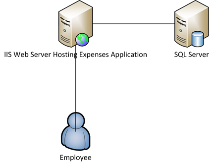

<properties 
    pageTitle="Ofertas de aplicativos do Azure serviço de aplicativo Web para o Enterprise" 
    description="Mostra como usar aplicativos do Azure aplicativo de serviço Web para criar enterprise soluções de site para sua empresa" 
    services="app-service\web" 
    documentationCenter="" 
    authors="apwestgarth" 
    manager="wpickett" 
    editor=""/>

<tags 
    ms.service="app-service-web" 
    ms.workload="web" 
    ms.tgt_pltfrm="na" 
    ms.devlang="na" 
    ms.topic="article" 
    ms.date="07/29/2016" 
    ms.author="anwestg"/>

# Ofertas de aplicativos do Azure serviço de aplicativo Web para Whitepaper Enterprise #

A necessidade de reduzir custos e fornecem soluções de TI mais rápidas em um ambiente rápida evolução cria novos desafios para desenvolvedores, profissionais de TI e os gerentes. Os usuários estão cada vez mais procurando por seus aplicativos da web de linha de negócios (LOB) seja rápida, responde e disponível de qualquer dispositivo. Ao mesmo tempo, empresas estão tentando aproveitar o aumento de produtividade e a eficiência oriundos de integração com serviços móveis e nuvem, isso pode ser algo simple, como o logon único em todos os dispositivos usando o Active Directory para colaboração no Office 365 usando dados extraídos de um aplicativo de LOB interno que por sua vez extrai os dados da implementação da empresa de Salesforce. [Azure aplicativo de serviço Web Apps](http://go.microsoft.com/fwlink/?LinkId=529714) é um serviço de nuvem corporativos para desenvolvimento, teste e executando web e aplicativos móveis, APIs da Web e sites genérico. Pode ser usado para executar sites corporativos, sites da intranet, aplicativos corporativos e campanhas de marketing digitais em uma rede global de data centers otimizadas para escala e disponibilidade, juntamente com suporte para a integração contínua e DevOps moderna práticas recomendadas.  

Este white paper destaca os recursos do serviço [Web Apps](/services/app-service/web/) especificamente voltada executando aplicativos Web LOB, que aborda a migração de aplicativos da web existentes e implantação de novos aplicativos web LOB na plataforma. 

## Público-alvo ##

Profissionais de TI, arquitetos e gerentes que desejam para migrar para as nuvem web cargas de trabalho que estão sendo executadas no local. Cargas de trabalho de Web podem abranger em negócios ao funcionário ou Business para aplicativos da web de parceiros.

## Introdução ##

Aplicativo de serviço Web Apps é uma plataforma ideal hospedar serviços e aplicativos web interna e externa, como ele fornece uma solução econômica, altamente escalável gerenciada permitindo que você se concentre em fornecimento de valor de negócios para seus usuários em vez de gastar uma quantidade significativa de tempo e dinheiro manutenção e o suporte separam ambientes. Aplicativos Web oferece uma plataforma flexível na qual deseja implantar seus aplicativos web do enterprise oferecendo a capacidade de continuar autenticar no Active Directory local por meio da integração com o Microsoft Azure Active Directory, suporte de implantações de fácil e rápidas fazendo uso de suas interno contínua integração e implantação práticas, enquanto dimensionamento automaticamente para crescer com as necessidades comerciais - tudo em uma plataforma gerenciada que permite que você se concentre em seu aplicativo e não sua infraestrutura. 

## Definição do problema ##

O cenário de TI está mudando rapidamente, com um movimento longe de hospedagem em servidores tradicionais com seus custos de capital altos nos prazos de entrega longos para uma que usa sob demanda use dos serviços que dimensionar automaticamente para lidar com a carga. Departamentos de TI estão sendo desafio para reduzir o custo e espaço de infraestrutura e manutenção gasto com foco na redução CAPEX aumentando também agilidade. O final da vida mais antigos plataformas de infraestrutura, como o Windows Server 2003, é líder departamentos de TI para analisar a migração de nuvem como uma forma possível para evitar os custos de capital de longo prazo novo. No passado, CIOs tornaria decisões de compra para outros departamentos; No entanto, cada vez mais CMOs e outro chefe de unidade de negócios está demorando um papel mais ativo no como seu orçamento é gasto e o que é o retorno sobre o investimento. Cada vez mais, empresas precisam seu força de trabalho a ser muito mais móvel com funcionários trabalhando remotamente, perder mais tempo com os clientes que precisam de acesso aos sistemas simples e sem complicações.

As necessidades de negócios alteração mensalmente, semanalmente, diariamente. Empresas que estão procurando instantânea escala global com serviços atualizados regulares completos dos novos recursos, fornecidos por terceiros ou internamente.  Em alguns casos empresas também procuram os recursos para isolar seus aplicativos e acesso aos recursos enquanto também faz uso dos recursos de nuvem pública. Os usuários têm expectativas maiores, com muitos fazendo uso dos serviços em suas próprias vidas particulares como o Office 365. Esperam ter acesso aos serviços sofisticados recursos semelhantes, atualizados, em sua vida de trabalho. Para lidar com essa demanda, IT deve aparência para ajudar os negócios a ativá-la por meio de seleção e a integração com terceiros serviços, cuidado para seleção de plataformas que pode se adaptar para as necessidades de negócios, enquanto também sendo confiável com um custo total de propriedade reduzido.

As equipes de desenvolvimento procuram para oferecer os benefícios de negócios imediata, oferecendo novos recursos regularmente. Eles procuram uma plataforma econômica confiável que se integra seu teste de ferramentas e práticas – desenvolvimento, existente, versão; e trabalhar em conjunto com os departamentos de TI automatiza implantação, gerenciamento e alertas, tudo com o objetivo de tempo de inatividade zero.

<a href="highlevel" />
## Alto nível da solução ##

Estruturas e plataformas web cada vez mais estão sendo usadas para desenvolver, testar e hospedar aplicativos linha de negócios.  Com uma linha típica do aplicativo de negócios, como um sistema de despesas de funcionários internos, muitas vezes consiste exclusivamente um aplicativo web com um banco de dados de backup para armazenar os dados conectados com o aplicativo.

Serviço de aplicativo Web Apps é uma boa opção para hospedar esses aplicativos, oferecendo infraestrutura flexível e confiável que é gerenciada e corrigida com quase zero intervenção manual e o tempo de inatividade. A plataforma do Microsoft Azure fornece várias opções de armazenamento de dados para dar suporte a aplicativos da web hospedados em aplicativos da Web do Microsoft Azure SQL Database, um gerenciado scalable relacional banco de dados-como um serviço, para serviços populares de nossos parceiros como banco de dados MySQL ClearDB e MongoDB.

Uma abordagem alternativa é fazer uso de seu investimento existente no local. O cenário de exemplo, um sistema de despesas de funcionário, você talvez queira manter seu armazenamento de dados dentro de sua própria infraestrutura interno. Isso pode ser para integração com sistemas internos (relatórios, folha de pagamento, cobrança etc.) ou para atender a um requisito de gestão de IT.  Web Apps fornece um número de métodos de permitindo que você se conecte à sua infraestrutura de locais no:

- [Ambientes de serviço de aplicativo](app-service-app-service-environment-intro.md) - ambientes de serviço de aplicativo (ASE) são um novo recurso de Premium que foi adicionada recentemente para a oferta de serviço de aplicativo do Microsoft Azure.  ASEs fornecem um ambiente totalmente isolado e dedicado para execução de aplicativos de serviço de aplicativo do Azure com segurança em alta escala oferecendo também isolamento e acesso seguro à rede   
- [Conexões de híbrido](../biztalk-services/integration-hybrid-connection-overview.md) – híbrido conexões são um recurso do Microsoft Azure BizTalk Services e habilitar aplicativos da Web para conectar-se a no local recursos segura, por exemplo, SQL Server, MySQL, APIs da Web e serviços da web personalizados. 
- [A integração de rede virtual](https://azure.microsoft.com/blog/2014/09/15/azure-websites-virtual-network-integration/) – integração de aplicativos Web com uma rede Virtual Azure permite que você se conecte seu aplicativo web para uma rede Virtual do Azure que por sua vez, pode ser conectada à sua infraestrutura local ativado por meio de uma VPN to-site. 

Os diagramas a seguir descrevem uma solução de alto nível de exemplo com opções de conectividade para recursos locais.  O primeiro exemplo mostra como isso pode ser obtido usando recursos padrão do serviço de aplicativo do Azure e o segundo mostra como isso pode ser obtido usando a oferta, ambientes de serviço de aplicativo de premium.

Usando os recursos de serviço de aplicativo padrão:

Usando um ambiente de serviço de aplicativo:

## Benefícios de negócios ##

Serviço de aplicativo Web Apps fornece um host dos benefícios de negócios que permitem a função ser muito mais econômico e ágil no fornecimento para as necessidades de negócios. 

### Modelo de PaaS ###

Serviço de aplicativo Web Apps é criada em uma plataforma como um modelo de serviço que fornece um número de economia de custos e eficiência.  Não é necessário passar horas gerenciar VMs, sistemas operacionais e estruturas de patch. Aplicativos Web é um ambiente automaticamente corrigido que permite concentrar-se em gerenciar seus aplicativos da web e não VMs, deixando equipes livres para fornecer valor comercial adicional.

O modelo de PaaS base Web Apps habilita profissionais da metodologia DevOps atender às suas metas. Como um negócio, isso significa gerenciamento completo e integração através do aplicativo inteiro ciclo, incluindo o desenvolvimento, teste, lançamento, monitoramento e gerenciamento e suporte. 

Para equipes de desenvolvimento, contínuos fluxos de trabalho de implantação e a integração podem ser configurados de serviços de equipe do Visual Studio, GitHub, TeamCity, Hudson ou BitBucket, permitindo compilação automatizada, teste e implantação habilitando lançamento mais rápido ciclos enquanto reduzir conflito envolvidas na colocação de infraestrutura existente. Web Apps também suporta a criação de vários teste e ambientes para seu fluxo de trabalho de lançamento, não é mais você precisa reservar ou alocar hardware para esses fins, você pode criar tantos ambientes como você quer que e define seu próprios promoção para liberar o fluxo de trabalho. Como uma empresa que você pode decidir lançamento para um slot de teste do controle de origem, execute uma série de testes e após a conclusão bem-sucedida promover para um slot de estágio e finalmente trocar para produção sem tempo de inatividade, com a vantagem adicional que aplicativos da web hospedados nos aplicativos Web são pré-carregados e quente para fornecer a experiência de cliente possível melhor.  Além disso empresas podem fazer uso do teste em capacidades de produção do aplicativo de serviço Web Apps para direcionar uma seção de tráfego para um slot diferente, valide as alterações, antes de mudar todo o tráfego para a nova implantação ou reversão todo o tráfego para a implantação anterior. 

As equipes de operações podem se sente que eles estão na posição possível melhor reagir a quaisquer problemas com qualquer um dos seus aplicativos da web hospedados em aplicativos Web com o criados em recursos de monitoramento e alertas. Devo equipes de operações já têm investido em análises e soluções de monitoramento tais de ideias de aplicativo do Microsoft Visual Studio, Relíquia novas e AppDynamics. Estes são também totalmente suportados nos aplicativos Web permitindo continuidade e um ambiente familiar do qual monitorar seus aplicativos da web.

Finalmente, Web Apps fornece funcionalidade automaticamente backup de seu app(s) e bancos de dados hospedados direcionar a um contêiner de armazenamento de Blob do Azure. Fornecendo um método de forma e muito econômico fácil com o qual deseja recuperar de desastres, reduzindo a necessidade de complexos em locais hardware e software.

### Facilidade de migração ###

Rotação e manutenção de hardware é um problema chave para empresas, como ciclos de lançamento de hardware e sistemas operacionais aceleram. Talvez você tenha um número de servidores do Windows Server 2003 R2 que está chegando para o fim do suporte no 2015, mas eles ainda estiver hospedando aplicativos web principais para sua empresa? Serviço de aplicativo Web Apps é um ótimo candidato na qual hospedar os aplicativos da web e para você racionalizar espaço de hardware de negócios. Aplicativos Web lhe dá acesso a um intervalo de especificações de hardware que são gerenciados e mantidos como parte do serviço, eliminando a necessidade de fator nos custos de gerenciamento e substituição como parte de seu orçamento de infraestrutura.  Migração pode ser tão simples quanto uma cópia e colar operação de sua implantação existente para aplicativos Web ou uma migração mais complexa onde usando o Assistente de migração de aplicativos Web adicionará valor. Aplicativos web migrada Aproveite a gama completa de serviços do Azure, integrar serviços adicionais aos aplicativos web. Por exemplo, você pode considerar a inclusão Azure Active Directory para controlar o acesso ao seu aplicativo com base em associação dos usuários aos grupos de segurança. Outro exemplo pode ser adicionando serviços de Cache para melhorar o desempenho e reduzir a latência, fornecendo geral melhor experiência do usuário. 

### Empresa de hospedagem de classe ###

Serviço de aplicativo Web Apps fornece uma plataforma estável e confiável que comprovadamente sejam capazes de lidar com uma ampla variedade de negócios precisa de pequenas internas desenvolvimento e teste cargas de trabalho, sites de alto tráfego altamente dimensionados. Usando aplicativos Web, você está fazendo a usar a mesma plataforma de hospedagem de classe do enterprise que a Microsoft como uma empresa usa para cargas de trabalho de web de valor alto. Aplicativos da Web, juntamente com todos os serviços na plataforma Windows Azure, são criados com segurança e conformidade com requisitos regulatórios, como ISO (ISO/IEC 27001:2005); SOC1 e SOC2 SSAE 16/ISAE 3402 Attestations, BAA de HIPAA, PCI e Fedramp, no coração de cada elemento e recurso, para obter mais informações, consulte [http://aka.ms/azurecompliance](/support/trust-center/compliance/). 

Plataforma do Microsoft Azure permite função controles com base em autorização habilitando os níveis de empresa do controle de recursos em aplicativos Web. RBAC dá às empresas a potência implementar suas próprias políticas de gerenciamento de acesso para todos os seus ativos no ambiente do Azure, atribuir usuários a grupos e alternadamente atribuindo as permissões necessárias a esses grupos contra o ativo como um aplicativo web. Para obter mais informações sobre RBAC no Azure, consulte [http://aka.ms/azurerbac](../active-directory/role-based-access-control-configure.md). Utilizando a aplicativos Web, você pode ter certeza de seus aplicativos web são implantados em um ambiente seguro e você tem controle total para o qual território seus ativos são implantados. 

Azure ambientes de serviço de aplicativo [http://aka.ms/aseintro](http://aka.ms/aseintro) são uma nova opção de plano de serviço premium para clientes corporativos que desejam usar o serviço de aplicativo do Azure e esses fornecem um ambiente totalmente isolado e dedicado.  Isso permite aos clientes corporativos implantar aplicativos que podem tirar proveito de escala muito alto enquanto também tem controle total sobre o tráfego de rede de entrada e saída e ASEs permitem que aplicativos têm conexões seguras de alta velocidade sobre redes virtuais aos recursos locais.

Serviço de aplicativo Web Apps também são capazes de fazer uso total dos investimentos no local, proporcionando a capacidade de se conectar novamente a seus recursos internos, como seu depósito de dados ou o ambiente do SharePoint. Conforme discutido na [solução de alto nível](#highlevel) que você pode fazer uso de conexões de híbrido e a conectividade de rede Virtual para estabelecer conexões com na infraestrutura de locais e serviços.

### Escala global ###

Aplicativos de serviço de aplicativo Web é uma plataforma global e escalável, permitindo que seus aplicativos web crescer e se adapte às necessidades de uma empresa em crescimento rapidamente e com o planejamento de longo prazo mínimo e o custo. Em típicos cenários de infraestrutura de locais, expansão e aumento de demanda localmente e geograficamente seriam exigem uma grande quantidade de gerenciamento, planejamento e despesas provisionar e gerencie a infraestrutura adicional. Aplicativos Web oferece a capacidade de dimensionar seus aplicativos da web com as oscilações e o fluxo de suas necessidades. Por exemplo, usando o aplicativo de despesas como exemplo, para a maioria do mês seus usuários são light usuários do aplicativo, mas como o prazo de cada mês para envios de despesas a ser inserido e uso aumenta em seu aplicativo, aplicativos Web tem a capacidade de provisionar automaticamente mais infraestrutura do aplicativo e, em seguida, após o uso da desaparecer novamente-la pode dimensionar voltar para a infraestrutura de linha de base que você definir.

Aplicativos Web está disponível globalmente em 24 dos data centers em todo o mundo e de crescimento. Para a lista mais atualizada de regiões e local, consulte [http://aka.ms/azlocations](http://aka.ms/azlocations). Com o Web Apps, sua empresa pode obter facilmente escala e alcance global. À medida que sua empresa cresce em novas áreas, os painéis de aplicativo que você usa de relatórios e host nos aplicativos Web facilmente podem ser implantados em data centers adicionais e servem usuários locais muito mais rapidamente através da combinação do Web Apps e Gerenciador de tráfego do Azure, todos com a vantagem de infraestrutura do scalable sob ser capaz de contrato e expanda conforme as necessidades da alteração escritórios regionais.
 
## Detalhes da solução ##

Vamos examinar um exemplo de um cenário de migração do aplicativo. Descreve os detalhes de como os recursos de aplicativo de serviço Web Apps são reunidas para fornecer valor comercial e ótima solução.
 
Em todo este exemplo a linha do aplicativo de negócios que abordaremos é uma aplicativo que permite que os funcionários enviem suas despesas para reembolso de relatório de despesas. O aplicativo é hospedado em um Windows Server 2003 R2 executando IIS6 e o banco de dados é um banco de dados do SQL Server 2005. O motivo escolhemos antigos consiste de servidor com a fim de serviço do Windows Server 2003 R2 e o SQL Server 2005 próximos e temos [Ferramentas](http://aka.ms/websitesmigration) e [orientação](http://aka.ms/websitesmigrationresources) migrar cargas de trabalho em Azure automaticamente. Com isso em mente, o padrão usado neste exemplo se aplicam a uma ampla verity cenários de migração. 

### Migrar aplicativo existente ###

Etapa 1 da solução geral para mover um aplicativo de linha de negócios para aplicativos Web é identificar os ativos existentes do aplicativo e a arquitetura. O exemplo neste documento é um aplicativo web do ASP.NET hospedado em um único servidor IIS com o banco de dados hospedado em um servidor separado do SQL, conforme mostrado na figura abaixo. Logon de funcionários para o sistema usando uma combinação de nome de usuário e senha, insira os detalhes de despesas e carregar cópias digitalizadas de recibos e, para o banco de dados para cada item de despesa. 
 

#### Itens a serem considerados ####

Quando o aplicativo de migração de um ambiente local, talvez você queira lembrar, algumas restrições de aplicativos Web. Aqui estão alguns tópicos importantes a serem consideradas ao fazer a migração de aplicativos web à Web Apps ([http://aka.ms/websitesmigrationresources](http://aka.ms/websitesmigrationresources)):

-   Ligações de porta – Web Apps apenas dá suporte à porta 80 para HTTP e 443 para o tráfego HTTPS. Se seu aplicativo usa qualquer outra porta, então, uma vez migrados tornará o aplicativo usado da porta 80 para HTTP e porta 443 para tráfego HTTPS. Isso geralmente é um problema causará danos como é comum em implantações locais para fazer uso das portas diferentes para resolver o uso de nomes de domínio, especialmente em ambientes de desenvolvimento e teste
-   Autenticação – Web Apps dá suporte à autenticação anônima por padrão e autenticação de formulários conforme identificado por um aplicativo. Aplicativos Web pode oferecer autenticação do Windows quando o aplicativo é integrado com o Active Directory do Azure e ADFS somente. Esse é um recurso que é discutido mais detalhadamente [aqui](http://aka.ms/azurebizapp) 
-   GAC baseadas conjuntos – Web Apps não permitem a implantação de montagens no Cache de Assembly Global (GAC). Portanto, se o aplicativo sendo migrado usa esse recurso local, considere mover os conjuntos para a pasta bin do aplicativo.
-   IIS5 Modo de compatibilidade – o Web Apps não dá suporte para o modo de compatibilidade do IIS 5 e assim cada instância de aplicativos Web e todos os aplicativos web sob a instância de aplicativos Web do pai executados no mesmo processo de trabalho em um único pool de aplicativos.
-   Uso das bibliotecas COM – aplicativos Web não permite que o registro de componentes COM na plataforma. Portanto, se o aplicativo está fazendo uso de quaisquer componentes COM, estas precisariam ser reescritos em código gerenciado e implantado com o aplicativo.
-   Filtros ISAPI – filtros ISAPI podem ser suportados nos aplicativos Web. Eles precisam ser implantado como parte do aplicativo e registrado no arquivo de Web. config do aplicativo da web. Para obter mais informações, consulte [http://aka.ms/azurewebsitesxdt](web-sites-transform-extend.md). 

Depois de tem sido considerados esses tópicos, seu aplicativo web deve estar pronto para a nuvem. E não se preocupe caso alguns tópicos totalmente não forem atendidos, a ferramenta de migração lhe dará melhor esforço de migração. 

As próximas etapas no processo de migração são para criar um aplicativo de serviço web app e um banco de dados do SQL Azure. Há vários tamanhos de instâncias de aplicativos Web com o número de variável de Cores de CPU e quantidades de RAM disponíveis para você selecionar com base em suas necessidades de aplicativos web. Para obter mais informações e preços, consulte [http://aka.ms/azurewebsitesskus](/pricing/details/websites/). Da mesma forma, o banco de dados SQL do Microsoft Azure atenta para todas as necessidades de uma empresa com vários níveis de serviço e níveis de desempenho para atender aos requisitos. Mais informações podem ser encontradas em [http://aka.ms/azuresqldbskus](/pricing/details/sql-database/). Uma vez criado, o aplicativo é carregado para o aplicativo de serviço Web Apps, seja via FTP ou WebDeploy e, em seguida, mover para o banco de dados.

Essa migração a solução usa Azure SQL Database, mas isso é não somente banco de dados que é suportado no Azure. Empresas também podem fazer uso de MySQL, MongoDB, Azure DocumentDB e muitos mais via complementos que podem ser adquiridos na [Loja do Azure](/marketplace/partner-program/). 

Ao criar um banco de dados do SQL Azure várias opções estão disponíveis para importar um banco de dados existente de um servidor local de gerar um script de um banco de dados existente usando a [importação e exportação de aplicativo de camada de dados](http://aka.ms/dacpac). 

O banco de dados de aplicativo de despesas foi criado, criando um novo banco de dados do Azure SQL, conectar-se ao banco de dados usando o SQL Server Management Studio e então executar um script para criar o esquema de banco de dados e preenchê-lo com dados do banco de dados local.

A etapa final deste estágio primeiro da migração requer a atualização de cadeias de caracteres de conexão ao banco de dados para o aplicativo. Isso pode ser obtido através do portal Azure. Para cada aplicativo web, você pode modificar as configurações específicas do aplicativo, incluindo as cadeias de caracteres de conexão que está sendo usadas pelo aplicativo para se conectar a qualquer banco de dados está sendo usado.

### Alternativas ao uso de banco de dados do SQL Azure ###

Plataforma Windows Azure oferece inúmeros alternativas usando o Azure SQL Database como um banco de dados da web aplicativos principal, isso é para habilitar diferentes cargas de trabalho ou seja Use uma solução NoSQL ou habilitar a plataforma atender às necessidades de dados de uma empresa. Por exemplo, uma empresa pode manter os dados que não devem ser armazenados fora da empresa ou em um ambiente de nuvem pública e, portanto, ficaria para manter o uso de seu banco de dados local.

#### Conectividade com recursos de local ####
Aplicativos de serviço de aplicativo Web oferece várias opções para conexão com recursos de locais, como bancos de dados, permitindo a reutilização de infraestrutura de alto valor existente. As opções são conforme listado abaixo:

- Serviço de aplicativo ambientes é isolados e criado em uma sub-rede de uma rede virtual, portanto, permitindo que o ambiente para se comunicar com pontos de extremidade particulares localizados dentro da mesma rede virtual - [http://aka.ms/appserviceasenetworking](http://aka.ms/appserviceasenetworking)
- A integração de rede Virtual do Web Apps oferece suporte a integração entre aplicativos Web e uma rede Virtual do Azure, permitindo que você acesso aos recursos executando em sua rede Virtual que, se conectado à sua rede local ativado com-to-site VPN, permite a conectividade direto aos sistemas no local.
- Conexões de híbrido são um recurso do Azure BizTalk Services e fornecem uma maneira fácil de conectar a individuais recursos como SQL Server, MySQL, HTTP Web APIs e mais serviços Web personalizados locais.

#### Dimensionamento e flexibilidade ####

À medida que uma empresa cresce sua força de trabalho, por meio de aquisições ou crescimento sistemático natural, portanto muito deve web escala de aplicativos para atender a essas novas exigências. Realmente hoje é comum ver uma visualização ainda maior de equipes localizadas e funcionários remotos, por exemplo empresas com escritórios nos Estados Unidos, Europa e Ásia, com uma vendas móvel forçar em muitos mais regiões. Aplicativos Web tem a capacidade de lidar com alterações elástica em escala confortável e automaticamente.

Serviço de aplicativo Web Apps permite que aplicativos web sejam configurados para dimensionar automaticamente por meio do portal do Azure, dependendo de dois vetores – agendado vezes ou pelo uso da CPU. Dimensionamento de automático de aplicativos Web fornece uma maneira muito flexível e econômica para atender maior alterações em uso para todos os aplicativos de negócios, aplicativos da web como nosso despesas sistema de relatórios a sites, qual experiência um intermitente alto de tráfego por uma duração breve da promoção de marketing. Para obter mais informações e orientação sobre dimensionamento seus aplicativos da web usando Web Apps, veja [como sites de escala](web-sites-scale.md).

Além da flexibilidade dimensionamento de aplicativos Web, a plataforma geral permite continuidade de negócios e resiliência por meio da distribuição possível de aplicativos da web e seus ativos em vários data centers e regiões geográficas.

## Resumo ##
Aplicativos de serviço de aplicativo Web oferece uma solução flexível, econômica e responder às necessidades dinâmicas de uma empresa em um ambiente rápida evolução. Web Apps ajuda empresas aumentar a produtividade e eficiência ao fazer uso de uma plataforma gerenciada com recursos de DevOps modernos e mãos reduzidas no gerenciamento, fornecendo recursos corporativos em escala, resiliência, segurança e integração com ativos de local.

## Plano de ação ##
Para obter mais informações sobre o serviço do Azure aplicativo serviço Web Apps, visite [http://aka.ms/enterprisewebsites](/services/websites/enterprise/) onde obter mais informações podem se originar e entrada para uma avaliação hoje às [http://aka.ms/azuretrial](/pricing/free-trial/) para avaliar o serviço e descubra os benefícios da sua empresa.

[AZURE.INCLUDE [app-service-web-whats-changed](../../includes/app-service-web-whats-changed.md)]

[AZURE.INCLUDE [app-service-web-try-app-service](../../includes/app-service-web-try-app-service.md)]
 
 
