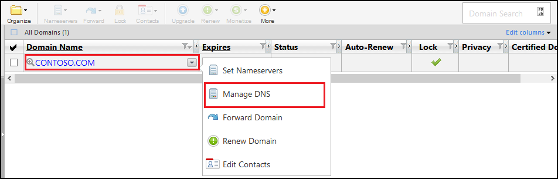

<properties
    pageTitle="Configurar um nome de domínio personalizado no serviço de aplicativo do Azure (GoDaddy)"
    description="Saiba como usar um nome de domínio do GoDaddy ao Azure Web Apps"
    services="app-service"
    documentationCenter=""
    authors="erikre"
    manager="wpickett"
    editor="jimbe"/>

<tags
    ms.service="app-service"
    ms.workload="na"
    ms.tgt_pltfrm="na"
    ms.devlang="na"
    ms.topic="article"
    ms.date="01/12/2016"
    ms.author="cephalin"/>

# Configurar um nome de domínio personalizado no serviço de aplicativo do Azure (comprado diretamente da GoDaddy)

[AZURE.INCLUDE [web-selector](../../includes/websites-custom-domain-selector.md)]

[AZURE.INCLUDE [intro](../../includes/custom-dns-web-site-intro.md)]

Se você tiver adquirido domínio através do Azure aplicativo de serviço Web Apps, em seguida, consulte a etapa final do [Domínio comprar para aplicativos Web](custom-dns-web-site-buydomains-web-app.md).

Este artigo fornece instruções sobre como usar um nome de domínio personalizado que foi adquirido diretamente da [GoDaddy](https://godaddy.com) ao [Aplicativo de serviço Web Apps](http://go.microsoft.com/fwlink/?LinkId=529714).

[AZURE.INCLUDE [introfooter](../../includes/custom-dns-web-site-intro-notes.md)]

##Noções básicas sobre os registros DNS

[AZURE.INCLUDE [understandingdns](../../includes/custom-dns-web-site-understanding-dns-raw.md)]

## Adicionar um registro DNS do seu domínio personalizado

Para associar seu domínio personalizado um aplicativo web no aplicativo de serviço, você deve adicionar uma nova entrada na tabela DNS do seu domínio personalizado usando ferramentas fornecidas pelo GoDaddy. Use as seguintes etapas para localizar as ferramentas DNS para o site GoDaddy.com

1. Faça logon em sua conta com o site GoDaddy.com e selecione **Minha conta** e, em seguida, **Gerenciar Meus domínios**. Finalmente, selecione o menu suspenso para o nome do domínio que você deseja usar com o aplicativo web do Azure e selecione **Gerenciar DNS**.

    

2. Na página **detalhes do domínio** , role até a guia **Arquivo de zona DNS** . Esta é a seção usada para adicionando e modificando registros DNS para o seu nome de domínio.

    

    Selecione **Adicionar registro** para adicionar um registro existente.

    Para **Editar** um registro existente, selecione o ícone de caneta e papel ao lado do registro.

    > [AZURE.NOTE] Antes de adicionar novos registros, observe que o GoDaddy já criou registros DNS para populares subdomínios (chamados de **Host** no editor,) como **email**, **arquivos**, **email**e outras pessoas. Se o nome que você deseja usar já existir, modifique o registro existente em vez de criar um novo.

4. Ao adicionar um registro, você deve primeiro selecionar o tipo de registro.

    

    Em seguida, você deve fornecer o **Host** (o domínio personalizado ou subdomínio) e o que ela **aponta para**.

    

    * Ao adicionar um **registro A (host)** - você deve definir o campo de **Host** como **@** (isso representa o nome de domínio raiz, como **contoso.com**,) *(um curinga para correspondência vários subdomínios,) ou o subdomínio que você deseja usar (por exemplo, * *www**.) Você deve definir o * *pontos de** campo para o endereço IP do seu aplicativo web Azure.

    * Ao adicionar um **registro CNAME (alias)** - você deve definir o campo de **Host** para o subdomínio que você deseja usar. Por exemplo, **"www"**. Você deve definir o campo de **pontos de** para o **. azurewebsites.net** nome de domínio de seu aplicativo web Azure. Por exemplo, **contoso.azurewebsites.net**.

5. Clique em **Adicionar outra**.
6. Selecione **TXT** como o tipo de registro, em seguida, especifique um valor de **Host** de **@** e um valor de **pontos** de ** &lt;yourwebappname&gt;. azurewebsites.net**.

    > [AZURE.NOTE] Esse registro TXT é usado pelo Azure para validar que o domínio pertence descrito pelo registro a ou o primeiro registro TXT. Depois que o domínio tiver sido mapeado para o aplicativo da web no Portal do Azure, essa entrada de registro TXT pode ser removida.

5. Quando terminar de adicionar ou modificar registros, clique em **Concluir** para salvar as alterações.

## Habilitar o nome de domínio em seu aplicativo web

[AZURE.INCLUDE [modes](../../includes/custom-dns-web-site-enable-on-web-site.md)]

>[AZURE.NOTE] Se você quiser começar a usar o serviço de aplicativo do Azure antes de se inscrever para uma conta do Azure, vá para [Experimentar o serviço de aplicativo](http://go.microsoft.com/fwlink/?LinkId=523751), onde você pode criar imediatamente um aplicativo da web de curta duração starter no aplicativo de serviço. Não há cartões de crédito obrigatório; Não há compromissos.

## O que mudou
* Para um guia para a alteração de sites para o serviço de aplicativo consulte: [o serviço de aplicativo do Azure e seu impacto sobre serviços existentes do Azure](http://go.microsoft.com/fwlink/?LinkId=529714)
