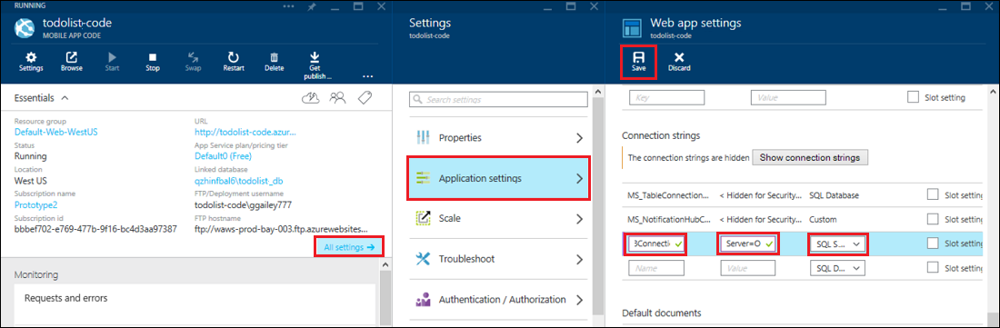

<properties 
    pageTitle="Acessar os recursos de locais usando conexões de híbrido no serviço de aplicativo do Azure" 
    description="Criar uma conexão entre um aplicativo web no serviço de aplicativo do Azure e um recurso de local que usa uma porta TCP estática" 
    services="app-service" 
    documentationCenter="" 
    authors="cephalin" 
    manager="wpickett" 
    editor="mollybos"/>

<tags 
    ms.service="app-service" 
    ms.workload="na" 
    ms.tgt_pltfrm="na" 
    ms.devlang="na" 
    ms.topic="article" 
    ms.date="02/03/2016" 
    ms.author="cephalin"/>

#Acessar os recursos de locais usando conexões de híbrido no serviço de aplicativo do Azure

Você pode se conectar a um aplicativo de serviço de aplicativo do Azure a qualquer recurso local que usa uma porta TCP estática, como o SQL Server, MySQL, APIs de Web HTTP e a maioria dos serviços da Web personalizado. Este artigo mostra como criar uma conexão de híbrida entre o serviço de aplicativo e um banco de dados do SQL Server local.

> [AZURE.NOTE] A parte de aplicativos Web do recurso híbrido conexões está disponível somente no [Portal do Azure](https://portal.azure.com). Para criar uma conexão nos serviços do BizTalk, consulte [Híbrida conexões](http://go.microsoft.com/fwlink/p/?LinkID=397274). 
> 
> Este conteúdo também se aplica aos aplicativos móveis em um serviço de aplicativo do Azure. 

## Pré-requisitos
- Uma assinatura do Azure. Uma assinatura gratuita, consulte [Avaliação gratuita do Azure](https://azure.microsoft.com/pricing/free-trial/). 
 
    Se você quiser começar a usar o serviço de aplicativo do Azure antes de se inscrever para uma conta do Azure, vá para [Experimentar o serviço de aplicativo](http://go.microsoft.com/fwlink/?LinkId=523751), onde você pode criar imediatamente um aplicativo da web de curta duração starter no aplicativo de serviço. Não há cartões de crédito obrigatório; Não há compromissos.

- Para usar um banco de dados do SQL Server ou SQL Server Express local com uma conexão de híbrido, TCP/IP deve ser habilitado em uma porta estática. Usar uma instância padrão no SQL Server é recomendado porque ele usa porta estática 1433. Para obter informações sobre a instalação e configuração do SQL Server Express para uso com conexões de híbrida, consulte [conectar a um local SQL Server de um site Azure usando híbrido conexões](http://go.microsoft.com/fwlink/?LinkID=397979).

- O computador no qual você instala o agente do Gerenciador de Conexão de híbrido local descrito neste artigo:

    - Deve ser capaz de se conectar ao Azure pela porta 5671
    - Deve conseguir acessar o *nome do host*:*número da porta* do recurso local. 

> [AZURE.NOTE] As etapas neste artigo presumem que você está usando o navegador do computador que hospedará o agente de conexão de híbrido local.

## Criar um aplicativo web no Portal do Azure ##

> [AZURE.NOTE] Se você já tiver criado um aplicativo web ou back-end do aplicativo Mobile no Portal do Azure que você deseja usar para este tutorial, você pode saltar para [criar uma Conexão de híbrida e um serviço BizTalk](#CreateHC) e iniciar a partir daí.

1. No canto superior esquerdo do [Portal do Azure](https://portal.azure.com), clique em **novo** > **Web + Mobile** > **Web App**.
    
    ![Novo aplicativo web][NewWebsite]
    
2. Na lâmina **Web app** , forneça uma URL e clique em **criar**. 
    
    ![Nome do site][WebsiteCreationBlade]
    
3. Após alguns instantes, o aplicativo web é criado e seu blade de aplicativo web é exibida. A lâmina é um painel verticalmente rolável que permite que você gerencie seu site.
    
    ![Site em execução][WebSiteRunningBlade]
    
4. Para verificar que o site está ao vivo, você pode clicar no ícone de **Procurar** para exibir a página padrão.
    
    ![Clique em Procurar para ver seu aplicativo web][Browse]
    
    ![Página de aplicativo web padrão][DefaultWebSitePage]
    
Em seguida, você irá criar uma conexão de híbrida e um serviço de BizTalk para o aplicativo web.

## Criar uma Conexão de híbrida e um serviço BizTalk ##

1. Na sua blade de aplicativo web clique em **todas as configurações** > **rede** > **Configurar seus pontos de extremidade de conexão híbrido**.
    
    ![Conexões de híbrido][CreateHCHCIcon]
    
2. Na lâmina híbrido conexões, clique em **Adicionar**.
    
    <!-- ![Add a hybrid connnection][CreateHCAddHC]
-->
    
3. A lâmina de **Adicionar uma conexão de híbrida** é aberta.  Como esta é sua primeira conexão híbrido, a opção de **nova conexão híbrida** é pré-selecionado e a lâmina de **conexão de híbrido criar** abre para você.
    
    ![Criar uma conexão de híbrido][TwinCreateHCBlades]
    
    Na **lâmina de conexão híbrido criar**:
    - Para **nome**, forneça um nome para a conexão.
    - Para **nome do host**, digite o nome do computador local que hospeda seus recursos.
    - **Porta**, insira o número da porta que o recurso local usa (1433 para uma instância do SQL Server padrão).
    - Clique em **serviço do Biz Talk**

4. A lâmina de **Serviço de BizTalk criar** é aberta. Insira um nome para o serviço BizTalk e clique em **Okey**.
    
    ![Criar serviço BizTalk][CreateHCCreateBTS]
    
    A lâmina de **Serviço de BizTalk criar** fecha e você voltará para a lâmina de **conexão de híbrido de criar** .
    
5. Na lâmina criar híbrido conexão, clique em **Okey**. 
    
    ![Clique em Okey][CreateBTScomplete]
    
6. Quando o processo for concluído, a área de notificação no Portal informa que a conexão tiver sido criado com êxito.
    <!---TODO

    Tudo falhará nesta etapa. Eu não pode criar um serviço BizTalk no portal do dogfood. Para alternar para o portal de clássico (portal completo) e criou o serviço BizTalk, mas ele parece não permitem que você conectar-quando terminar de etapa crie híbrido CON, você recebe o seguinte erro Falha ao criar conexão híbrido RelecIoudHC. O tipo de recurso não pôde ser encontrado no namespace 'Microsoft.BizTaIkServices API versão 2014-06-01'.
    
    O erro indica que ele não foi possível localizar o tipo, não a instância.
    ![Notificação de sucesso][CreateHCSuccessNotification]
    -->
7. Na lâmina do aplicativo da web, o ícone de **conexões de híbrido** agora mostra que 1 conexão híbrido foi criada.
    
    ![Conexão de um híbrido criado][CreateHCOneConnectionCreated]
    
Neste ponto, você concluiu uma parte importante a infraestrutura de nuvem híbrida conexão. Em seguida, você criará uma peça de local correspondente.

## Instalar o Gerenciador de Conexão de híbrido local para concluir a conexão ##

1. Na lâmina do aplicativo da web, clique em **todas as configurações** > **rede** > **Configurar seus pontos de extremidade de conexão híbrido**. 
    
    ![Ícone de conexões de híbrido][HCIcon]
    
2. Na lâmina **conexões híbridos** , a coluna **Status** para o ponto de extremidade adicionado recentemente mostra **não conectado**. Clique na conexão para configurá-lo.
    
    ![Não conectado][NotConnected]
    
    A lâmina de conexão híbrida é aberta.
    
    ![NotConnectedBlade][NotConnectedBlade]
    
3. Na lâmina, clique em **Configuração de ouvinte**.
    
    ![Clique em configuração de ouvinte][ClickListenerSetup]
    
4. A lâmina de **Propriedades de conexão de híbrida** é aberta. Em **Gerenciador de Conexão de híbrido local**, escolha **clique aqui para instalar**.
    
    ![Clique aqui para instalar][ClickToInstallHCM]
    
5. No diálogo de aviso de segurança que executar o aplicativo, escolha **Executar** para continuar.
    
    ![Escolha Executar para continuar][ApplicationRunWarning]
    
6.  Na caixa de diálogo **Controle de conta de usuário** , escolha **Sim**.
    
    ![Escolha Sim][UAC]
    
7. O Gerenciador de Conexão híbrida é baixado e instalado por você. 
    
    ![Instalando][HCMInstalling]
    
8. Quando a instalação estiver concluída, clique em **Fechar**.
    
    ![Clique em Fechar][HCMInstallComplete]
    
    Na lâmina **conexões híbrido** , a coluna **Status** mostra agora **conectado**. 
    
    ![Status conectado][HCStatusConnected]

Agora que a infraestrutura de conexão híbrida estiver concluída, você pode criar um aplicativo híbrido que usa-lo. 

>[AZURE.NOTE]As seções a seguir mostram como usar uma conexão de híbrido com um projeto de back-end do .NET de aplicativos móveis.

## Configurar o projeto de back-end do .NET de aplicativo móvel para se conectar ao banco de dados do SQL Server

No serviço de aplicativo, um projeto de back-end do Mobile aplicativos .NET é apenas um aplicativo de web ASP.NET com um SDK aplicativos móveis adicionais instalado e inicializado. Para usar seu aplicativo web como um back-end aplicativos Mobile, você deve [baixar e inicializar o back-end Mobile aplicativos .NET SDK](../app-service-mobile/app-service-mobile-dotnet-backend-how-to-use-server-sdk.md#install-sdk).  

Para aplicativos de móvel, você também precisa definir uma cadeia de conexão do banco de dados local e modificar o back-end para usar esta conexão. 

1. No Explorador de solução no Visual Studio, abra o arquivo Web. config para seu back-end .NET de aplicativo móvel, localize a seção **connectionStrings** , adicionar uma nova entrada de SqlClient como as seguintes, que aponta para o banco de dados do SQL Server local:

        <add name="OnPremisesDBConnection"
         connectionString="Data Source=OnPremisesServer,1433;
         Initial Catalog=OnPremisesDB;
         User ID=HybridConnectionLogin;
         Password=<**secure_password**>;
         MultipleActiveResultSets=True"
         providerName="System.Data.SqlClient" />

    Lembre-se de substituir `<**secure_password**>` nesta cadeia de caracteres com a senha que você criou para *HybridConnectionLogin*.

3. Clique em **Salvar** no Visual Studio para salvar o arquivo Web. config.

    > [AZURE.NOTE]Esta configuração de conexão é usada durante a execução no computador local. Quando em execução no Azure, essa configuração é substituído pela configuração da conexão definido no portal.

4. Expanda a pasta **modelos** e abra o arquivo de modelo de dados, que termina em *Context.cs*.

6. Modificar o construtor de instância **DbContext** para passar o valor `OnPremisesDBConnection` para o construtor de **DbContext** base, semelhante ao trecho a seguir:

        public class hybridService1Context : DbContext
        {
            public hybridService1Context()
                : base("OnPremisesDBConnection")
            {
            }
        }

    Agora, o serviço usará a nova conexão ao banco de dados do SQL Server.

## Atualizar o back-end do aplicativo móvel para usar a cadeia de conexão no local

Em seguida, você precisa adicionar uma definição de aplicativo para essa nova cadeia de caracteres de conexão para que ele pode ser usado do Azure.  

1. Volta o [portal do Azure](https://portal.azure.com) no código de back-end do aplicativo web para o aplicativo móvel, clique em **todas as configurações**, em seguida, **configurações do aplicativo**.

3. Na lâmina **configurações Web app** , role para baixo até **cadeias de caracteres de Conexão** e adicionar uma nova cadeia de conexão **Do SQL Server** denominada `OnPremisesDBConnection` com um valor como `Server=OnPremisesServer,1433;Database=OnPremisesDB;User ID=HybridConnectionsLogin;Password=<**secure_password**>`.

    Substituir `<**secure_password**>` com a senha de segurança para seu banco de dados local.

    

2. Pressione **Salvar** para salvar a conexão híbrida e a cadeia de conexão que você acabou de criar.

Neste ponto, você pode republicar o project server e testar a nova conexão com os clientes de aplicativos Mobile existentes. Dados serão ler e gravados no banco de dados local usando a conexão de híbrido.

## Próximas etapas ##

- Para obter informações sobre como criar um aplicativo web ASP.NET que usa uma conexão híbrida, consulte [conectar a um local SQL Server de um site Azure usando híbrido conexões](http://go.microsoft.com/fwlink/?LinkID=397979). 

### Recursos adicionais

[Visão geral de conexões de híbrido](http://go.microsoft.com/fwlink/p/?LinkID=397274)

[Josh Twist introduz conexões híbrido (9 de canal vídeo)](http://channel9.msdn.com/Shows/Azure-Friday/Josh-Twist-introduces-hybrid-connections)

[Site de conexões híbrido](https://azure.microsoft.com/services/biztalk-services/)

[BizTalk serviços: Guias de painel, Monitor, escala, configurar e Conexão híbrido](../biztalk-services/biztalk-dashboard-monitor-scale-tabs.md)

[Criando uma nuvem de híbrido reais com perfeita portabilidade de aplicativo (9 de canal de vídeo)](http://channel9.msdn.com/events/TechEd/NorthAmerica/2014/DCIM-B323#fbid=)

[Conectar a um SQL Server no local de serviços de celular Azure usando conexões híbrido (9 de canal vídeo)](http://channel9.msdn.com/Series/Windows-Azure-Mobile-Services/Connect-to-an-on-premises-SQL-Server-from-Azure-Mobile-Services-using-Hybrid-Connections)

## O que mudou
* Para um guia para a alteração de sites para o serviço de aplicativo consulte: [o serviço de aplicativo do Azure e seu impacto sobre serviços existentes do Azure](http://go.microsoft.com/fwlink/?LinkId=529714)

<!-- IMAGES -->
[New]:./media/web-sites-hybrid-connection-get-started/B01New.png
[NewWebsite]:./media/web-sites-hybrid-connection-get-started/B02NewWebsite.png
[WebsiteCreationBlade]:./media/web-sites-hybrid-connection-get-started/B03WebsiteCreationBlade.png
[WebSiteRunningBlade]:./media/web-sites-hybrid-connection-get-started/B04WebSiteRunningBlade.png
[Browse]:./media/web-sites-hybrid-connection-get-started/B05Browse.png
[DefaultWebSitePage]:./media/web-sites-hybrid-connection-get-started/B06DefaultWebSitePage.png
[CreateHCHCIcon]:./media/web-sites-hybrid-connection-get-started/C01CreateHCHCIcon.png
[CreateHCAddHC]:./media/web-sites-hybrid-connection-get-started/C02CreateHCAddHC.png
[TwinCreateHCBlades]:./media/web-sites-hybrid-connection-get-started/C03TwinCreateHCBlades.png
[CreateHCCreateBTS]:./media/web-sites-hybrid-connection-get-started/C04CreateHCCreateBTS.png
[CreateBTScomplete]:./media/web-sites-hybrid-connection-get-started/C05CreateBTScomplete.png
[CreateHCSuccessNotification]:./media/web-sites-hybrid-connection-get-started/C06CreateHCSuccessNotification.png
[CreateHCOneConnectionCreated]:./media/web-sites-hybrid-connection-get-started/C07CreateHCOneConnectionCreated.png
[HCIcon]:./media/web-sites-hybrid-connection-get-started/D01HCIcon.png
[NotConnected]:./media/web-sites-hybrid-connection-get-started/D02NotConnected.png
[NotConnectedBlade]:./media/web-sites-hybrid-connection-get-started/D03NotConnectedBlade.png
[ClickListenerSetup]:./media/web-sites-hybrid-connection-get-started/D04ClickListenerSetup.png
[ClickToInstallHCM]:./media/web-sites-hybrid-connection-get-started/D05ClickToInstallHCM.png
[ApplicationRunWarning]:./media/web-sites-hybrid-connection-get-started/D06ApplicationRunWarning.png
[UAC]:./media/web-sites-hybrid-connection-get-started/D07UAC.png
[HCMInstalling]:./media/web-sites-hybrid-connection-get-started/D08HCMInstalling.png
[HCMInstallComplete]:./media/web-sites-hybrid-connection-get-started/D09HCMInstallComplete.png
[HCStatusConnected]:./media/web-sites-hybrid-connection-get-started/D10HCStatusConnected.png
 