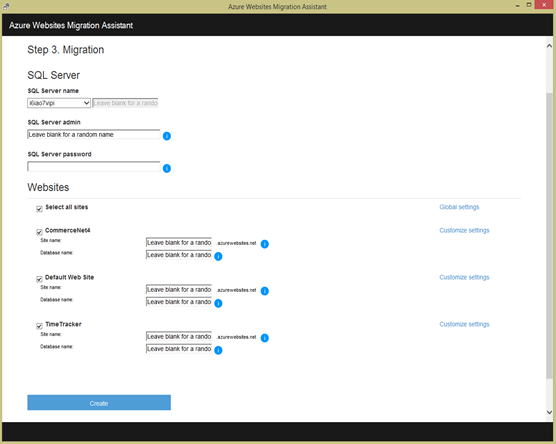
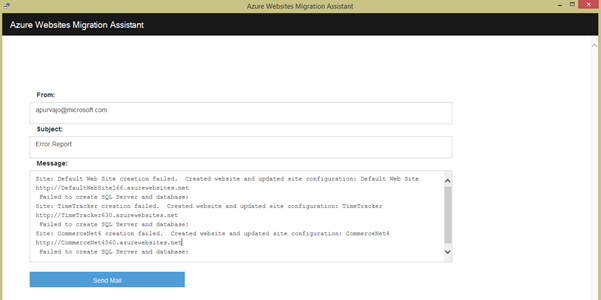

<properties 
    pageTitle="Migrar um enterprise web app para o serviço de aplicativo do Azure" 
    description="Mostra como usar o Assistente de migração de aplicativos Web rapidamente migrar sites do IIS existentes para aplicativos do Azure aplicativo de serviço Web" 
    services="app-service" 
    documentationCenter="" 
    authors="cephalin" 
    writer="cephalin" 
    manager="wpickett" 
    editor=""/>

<tags 
    ms.service="app-service" 
    ms.workload="na" 
    ms.tgt_pltfrm="na" 
    ms.devlang="na" 
    ms.topic="article" 
    ms.date="07/01/2016" 
    ms.author="cephalin"/>

# Migrar um enterprise web app para o serviço de aplicativo do Azure

Você pode facilmente migrar seus sites existentes que são executadas no serviço de informações da Internet (IIS) 6 ou posterior para o [Aplicativo de serviço Web Apps](http://go.microsoft.com/fwlink/?LinkId=529714). 

>[AZURE.IMPORTANT] Windows Server 2003 atingido fim do suporte em 14 de julho de 2015. Se você estiver hospedando atualmente seus sites em um servidor IIS que é o Windows Server 2003, Web Apps é um baixo risco, baixo custo, e forma de conflito de baixo para manter seus sites online e Assistente de migração de aplicativos Web podem ajudar a automatizar o processo de migração para você. 

[Assistente de migração de aplicativos Web](https://www.movemetothecloud.net/) pode analisar a instalação do seu servidor IIS, identificar quais sites podem ser migrados para o serviço de aplicativo, realçar todos os elementos que não podem ser migrados ou não têm suporte na plataforma e, em seguida, migrar seus sites e bancos de dados associados ao Azure.

[AZURE.INCLUDE [app-service-web-to-api-and-mobile](../../includes/app-service-web-to-api-and-mobile.md)]

## Elementos verificados durante a análise de compatibilidade ##
O Assistente de migração cria um relatório de preparação para identificar as possíveis causas para preocupações ou problemas de bloqueio que podem impedir uma migração bem-sucedida do IIS local para aplicativos do Azure aplicativo de serviço Web. Alguns dos principais itens a serem consideradas são:

-   Ligações de porta – Web Apps apenas dá suporte à porta 80 para HTTP e 443 para tráfego HTTPS. Configurações de porta diferente serão ignoradas e tráfego será roteado para 80 ou 443. 
-   Autenticação – aplicativos Web dá suporte a autenticação anônima por padrão e autenticação de formulários onde especificado por um aplicativo. Autenticação do Windows podem ser usada por meio da integração com o Active Directory do Azure e ADFS somente. Todas as outras formas de autenticação - por exemplo, autenticação básica - não são suportadas no momento. 
-   Cache de Assembly Global (GAC) – GAC não é suportado no Web Apps. Se seu aplicativo referencia montagens que você geralmente implantar ao GAC, você precisará implantar na pasta de compartimento de aplicativo nos aplicativos Web. 
-   IIS 5 Modo de compatibilidade – isso não é suportado nos aplicativos Web. 
-   Pools de aplicativos – em aplicativos Web, cada site e seus aplicativos filho executar no mesmo pool de aplicativos. Se seu site tiver vários aplicativos filho utilizando vários pools de aplicativos, consolidá-los em um único pool de aplicativos com configurações comuns ou migrar cada aplicativo para um aplicativo web separado.
-   Componentes de COM – aplicativos Web não permite que o registro de componentes COM na plataforma. Se seus sites ou aplicativos usar de quaisquer componentes COM, você deve regravação-los no código gerenciado e implantá-los com o site ou o aplicativo.
-   Filtros ISAPI – Web Apps pode oferecer suporte a utilização de filtros ISAPI. Você precisa fazer o seguinte:
    -   implantar as DLLs com seu aplicativo web 
    -   registrar as DLLs usando [Web. config](http://www.iis.net/configreference/system.webserver/isapifilters)
    -   Coloque um arquivo de applicationHost.xdt na raiz do site com o conteúdo abaixo:

            <?xml version="1.0"?>
            <configuration xmlns:xdt="http://schemas.microsoft.com/XML-Document-Transform">
            <configSections>
                <sectionGroup name="system.webServer">
                  <section name="isapiFilters" xdt:Transform="SetAttributes(overrideModeDefault)" overrideModeDefault="Allow" />
                </sectionGroup>
              </configSections>
            </configuration>

        Para obter mais exemplos de como usar transformações de documentos XML com seu site, consulte [transformar seu Site do Microsoft Azure](http://blogs.msdn.com/b/waws/archive/2014/06/17/transform-your-microsoft-azure-web-site.aspx).

-   Outros componentes como o SharePoint, página frontal servidor FPSE (extensões), FTP, certificados SSL não serão migrados.

## Como usar o Assistente de migração de aplicativos Web ##
Esta seção percorre um exemplo para migrar alguns sites que usam um banco de dados do SQL Server e em execução em um computador de Windows Server 2003 R2 (IIS 6.0) no local:

1.  No servidor IIS ou computador cliente, navegue até [https://www.movemetothecloud.net/](https://www.movemetothecloud.net/) 

    

2.  Instale o Assistente de migração de aplicativos Web clicando no botão de **Servidor de IIS dedicado** . Mais opções será opções no futuro próximo. 
4.  Clique no botão de **Ferramenta instalar** para instalar o Assistente de migração de aplicativos Web em seu computador.

    

    >[AZURE.NOTE] Você também pode clicar em **baixar para instalação offline** para baixar um arquivo ZIP instalação em servidores não conectados à internet. Ou, você pode clicar em **carregar um relatório de preparação de migração existente**, que é uma opção avançada para trabalhar com um relatório existente do migração preparação gerado anteriormente (explicado mais tarde).

5.  Na tela **De instalação do aplicativo** , clique em **instalar** para instalar em sua máquina. Ele também serão instalados dependências correspondentes como implantar o Web DacFX e IIS, se necessário. 

    

    Depois de instalado, Assistente de migração de aplicativos Web é iniciado automaticamente.
  
6.  Escolha **migrar sites e bancos de dados de um servidor remoto para Azure**. Insira as credenciais administrativas do servidor remoto e clique em **continuar**. 

    

    Claro, você pode optar por migrar do servidor local. A opção remote é útil quando você deseja migrar sites de um servidor de IIS de produção.
 
    Neste ponto a ferramenta de migração será inspecionar a configuração do seu servidor IIS, como Sites, aplicativos, Pools de aplicativos e dependências para identificar sites candidato para a migração. 

8.  Captura de tela abaixo mostra três sites – **Site padrão**, **TimeTracker**e **CommerceNet4**. Todos eles têm um banco de dados associado que queremos migrar. Selecione todos os sites que você gostaria de avaliar e clique em **Avançar**.

    
 
9.  Clique em **carregar** para carregar o relatório de preparação. Se você clicar em **Salvar arquivo localmente**, você pode executar a ferramenta de migração novamente mais tarde e carregar o relatório de preparação salvo conforme mencionado anteriormente.

    
 
    Quando você carregar o relatório de preparação, Azure executa análise de preparação e mostra os resultados. Leia os detalhes de avaliação para cada site e certifique-se de que você compreenda ou resolveu todos os problemas antes de continuar. 
 
    

12. Clique em **Começar a migração** para iniciar a migração. Agora, você será redirecionado para o Azure para entrar na sua conta. É importante que você faça logon com uma conta que tem uma assinatura ativa do Azure. Se você não tiver uma conta do Azure, em seguida, você pode inscrever um gratuito avaliação [aqui](https://azure.microsoft.com/pricing/free-trial/?WT.srch=1&WT.mc_ID=SEM_). 

13. Selecione a conta de locatário, assinatura do Azure e região usar para seus aplicativos web Azure migrados e bancos de dados e, em seguida, clique em **Iniciar migração**. Você pode selecionar os sites para migrar mais tarde.

    

14. Na próxima tela você pode fazer alterações nas configurações de migração padrão, tais como:

    - Use um banco de dados do SQL Azure existente ou criar um novo banco de dados do Azure SQL e configurar suas credenciais
    - Selecione os sites para migrar
    - Defina nomes para os aplicativos web do Azure e seus bancos de dados SQL vinculados
    - Personalizar as configurações globais e nível do site

    Captura de tela abaixo mostra todos os sites selecionados para migração com as configurações padrão.

    

    >[AZURE.NOTE] a caixa de seleção **Habilitar Azure Active Directory** em configurações personalizadas integra o aplicativo web Azure [Active Directory do Azure](active-directory-whatis.md) (o **Diretório padrão**). Para obter mais informações sobre a sincronização do Azure Active Directory com o Active Directory no local, consulte [integração de diretório](http://msdn.microsoft.com/library/jj573653).

16.  Após fazer as alterações desejadas, clique em **criar** para iniciar o processo de migração. A ferramenta de migração será criar o banco de dados do SQL Azure e o Azure web app e, em seguida, publicar o conteúdo de site e bancos de dados. O andamento da migração é mostrado claramente na ferramenta de migração, e você verá uma tela de resumo no final, quais detalhes os sites migrados, se eles foram bem-sucedidas, links para os aplicativos web Azure recém-criado. 

    Se nenhum erro ocorrer durante a migração, a ferramenta de migração claramente indicará a falha e reverter as alterações. Você também poderá enviar o relatório de erro diretamente para a equipe de engenharia clicando no botão **Enviar relatório de erros** , com a pilha de chamada falha capturada e criar o corpo da mensagem. 

    

    Se migrar sucesso sem erros, você também pode clicar no botão **Enviar comentários** para fornecer quaisquer comentários diretamente. 
 
20. Clique nos links para os aplicativos web do Azure e verifique se que a migração foi bem-sucedido.

21. Agora você pode gerenciar aplicativos da web migrada no serviço de aplicativo do Azure. Para fazer isso, faça logon no [Portal do Azure](https://portal.azure.com).

22. No Portal do Azure, abra a lâmina Web Apps para ver seus sites migrados (mostrado como web apps) e clique em qualquer uma para começar a gerenciar o aplicativo da web, como configurando a publicação contínua, a criação de backups, auto-dimensionamento e monitoramento de uso ou desempenho.

    

>[AZURE.NOTE] Se você quiser começar a usar o serviço de aplicativo do Azure antes de se inscrever para uma conta do Azure, vá para [Experimentar o serviço de aplicativo](http://go.microsoft.com/fwlink/?LinkId=523751), onde você pode criar imediatamente um aplicativo da web de curta duração starter no aplicativo de serviço. Não há cartões de crédito obrigatório; Não há compromissos.

## O que mudou
* Para um guia para a alteração de sites para o serviço de aplicativo consulte: [o serviço de aplicativo do Azure e seu impacto sobre serviços existentes do Azure](http://go.microsoft.com/fwlink/?LinkId=529714)
 
