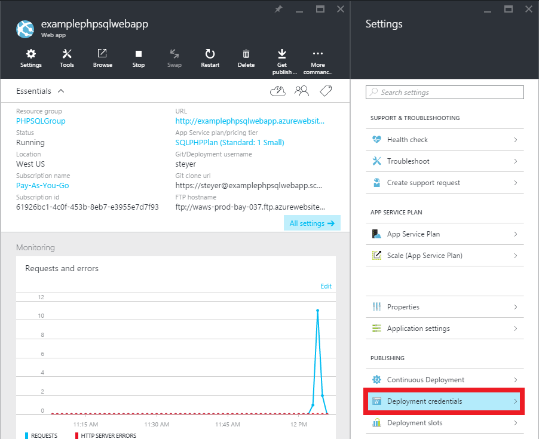

<properties 
    pageTitle="Criar um aplicativo da web de PHP-SQL e implantar em serviço de aplicativo do Azure usando gito" 
    description="Um tutorial que demonstra como criar um aplicativo web PHP que armazena os dados no banco de dados do SQL Azure e usar gito implantação ao serviço de aplicativo do Azure." 
    services="app-service\web, sql-database" 
    documentationCenter="php" 
    authors="rmcmurray" 
    manager="wpickett" 
    editor=""/>

<tags 
    ms.service="app-service-web" 
    ms.workload="web" 
    ms.tgt_pltfrm="na" 
    ms.devlang="PHP" 
    ms.topic="article" 
    ms.date="08/11/2016" 
    ms.author="robmcm"/>

# Criar um aplicativo da web de PHP-SQL e implantar em serviço de aplicativo do Azure usando gito

Este tutorial mostra como criar um aplicativo da web PHP no [Serviço de aplicativo do Azure](http://go.microsoft.com/fwlink/?LinkId=529714) que se conecta ao banco de dados do SQL Azure e como implantá-lo usando gito. Este tutorial supõe que você possui [PHP][install-php], [SQL Server Express][install-SQLExpress], os [Drivers da Microsoft para o SQL Server para PHP](http://www.microsoft.com/download/en/details.aspx?id=20098)e [gito] [ install-git] instalado no seu computador. Após concluir este guia, você terá um aplicativo web do PHP-SQL em execução no Azure.

> [AZURE.NOTE]
> Você pode instalar e configurar o PHP, SQL Server Express e os Drivers Microsoft para o SQL Server para PHP usando o [Microsoft Web Platform Installer](http://www.microsoft.com/web/downloads/platform.aspx).

Você aprenderá:

* Como criar um aplicativo web do Azure e um banco de dados do SQL usando o [Portal do Azure](http://go.microsoft.com/fwlink/?LinkId=529715). Como PHP está ativado no aplicativo de serviço Web Apps por padrão, nada de especial é necessário para executar seu código PHP.
* Como publicar e republicar em seu aplicativo no Azure usando gito.
 
Seguindo este tutorial, você irá criar um aplicativo da web de registro simples no PHP. O aplicativo será hospedado em um site do Azure. Uma captura de tela da aplicação concluída está abaixo:

[AZURE.INCLUDE [create-account-and-websites-note](../../includes/create-account-and-websites-note.md)]

>[AZURE.NOTE] Se você quiser começar a usar o serviço de aplicativo do Azure antes de se inscrever para uma conta do Azure, vá para [Experimentar o serviço de aplicativo](http://go.microsoft.com/fwlink/?LinkId=523751), onde você pode criar imediatamente um aplicativo da web de curta duração starter no aplicativo de serviço. Não há cartões de crédito obrigatório; Não há compromissos.

##Criar um aplicativo web Azure e configurar a publicação de gito

Siga estas etapas para criar um aplicativo web do Azure e um banco de dados do SQL:

1. Faça logon [Portal do Azure](https://portal.azure.com/).

2. Abrir o Azure Marketplace clicando no ícone de **novo** no canto superior esquerdo do painel, clique em **Selecionar tudo** ao lado de Marketplace e selecionando **Web + Mobile**.
    
3. No mercado, selecione **Web + Mobile**.

4. Clique no ícone do **aplicativo Web + SQL** .

5. Após ler a descrição do aplicativo SQL + Web app, selecione **criar**.

6. Clique em cada parte (**Grupo de recursos**, **Web App**, **banco de dados**e **assinatura**) e insira ou selecione valores para os campos obrigatórios:
    
    - Insira um nome de URL de sua escolha   
    - Configurar credenciais de servidor de banco de dados
    - Selecione a região mais próxima

    

7. Quando terminar de definir o web app, clique em **criar**.

    Quando o aplicativo web tiver sido criado, o botão de **notificações** serão flash verde **sucesso** e a lâmina de grupo de recursos aberta para mostrar o aplicativo da web e o banco de dados do SQL no grupo.

4. Clique ícone do aplicativo da web a lâmina de grupo de recursos para abrir blade do aplicativo da web.

    

5. Em **configurações** , clique em **implantação contínua** > **Configurar configurações necessárias**. Selecione **Repositório gito Local** e clique **Okey**.

    

    Se você não tiver configurado um repositório gito antes, você deve fornecer um nome de usuário e senha. Para fazer isso, clique em **configurações** > **credenciais de implantação** em lâmina do aplicativo da web.

    

6. Na **configurações** , clique em **Propriedades** para ver a URL remota gito você precisa usar para implantar seu aplicativo PHP posteriormente.

##Obter informações de conexão de banco de dados SQL

Para se conectar à instância do banco de dados SQL que está vinculada ao seu aplicativo web, sua serão necessárias as informações de conexão, que você especificou quando você criou o banco de dados. Para obter as informações de conexão de banco de dados SQL, siga estas etapas:

1. Volta blade do grupo de recursos, clique em ícone do banco de dados SQL.

2. No blade do banco de dados SQL, clique em **configurações** > **Propriedades**, clique em **Mostrar cadeias de caracteres de conexão de banco de dados**. 

    
    
3. Na seção **PHP** da caixa de diálogo resultante, anote os valores para `Server`, `SQL Database`, e `User Name`. Você usará posteriormente esses valores quando a publicação de seu aplicativo web do PHP no serviço de aplicativo do Azure.

##Criar e testar seu aplicativo localmente

O aplicativo de registro é um aplicativo PHP simples que permite que você registre para um evento, fornecendo seu nome e endereço de email. Informações sobre inscritos anterior são exibidas em uma tabela. Informações de registro são armazenadas em uma instância de banco de dados SQL. O aplicativo consiste em dois arquivos (copiar/colar código disponível abaixo):

* **index**: exibe um formulário de registro e uma tabela contendo informações sobre o inscrito.
* **CreateTable.PHP**: cria a tabela de banco de dados SQL para o aplicativo. Este arquivo somente será usado uma vez.

Para executar o aplicativo localmente, siga as etapas abaixo. Observe que estas etapas pressupõem que você tem PHP e SQL Server Express configurada no computador local, e que você ativou a [extensão PDO para SQL Server][pdo-sqlsrv].

1. Criar um banco de dados do SQL Server chamado `registration`. Você pode fazer isso partir do `sqlcmd` prompt de comando com esses comandos:

        >sqlcmd -S localhost\sqlexpress -U <local user name> -P <local password>
        1> create database registration
        2> GO   

2. No seu diretório raiz do aplicativo, criar dois arquivos - uma chamada `createtable.php` e outro denominado `index.php`.

3. Abrir o `createtable.php` arquivo em um editor de texto ou IDE e adicione o código abaixo. Este código será usado para criar o `registration_tbl` tabela no `registration` banco de dados.

        <?php
        // DB connection info
        $host = "localhost\sqlexpress";
        $user = "user name";
        $pwd = "password";
        $db = "registration";
        try{
            $conn = new PDO( "sqlsrv:Server= $host ; Database = $db ", $user, $pwd);
            $conn->setAttribute( PDO::ATTR_ERRMODE, PDO::ERRMODE_EXCEPTION );
            $sql = "CREATE TABLE registration_tbl(
            id INT NOT NULL IDENTITY(1,1) 
            PRIMARY KEY(id),
            name VARCHAR(30),
            email VARCHAR(30),
            date DATE)";
            $conn->query($sql);
        }
        catch(Exception $e){
            die(print_r($e));
        }
        echo "<h3>Table created.</h3>";
        ?>

    Observe que você precisará atualizar os valores para <code>$user</code> e <code>$pwd</code> com seu nome de usuário do SQL Server local e a senha.

4. Em um terminal no diretório raiz do aplicativo, digite o seguinte comando:

        php -S localhost:8000

4. Abra um navegador da web e navegue até **http://localhost:8000/createtable.php**. Isso criará o `registration_tbl` tabela no banco de dados.

5. Abra o arquivo **index** em um editor de texto ou IDE e adicione o código HTML e CSS básico para a página (o código PHP será adicionado em etapas posteriores).

        <html>
        <head>
        <Title>Registration Form</Title>
        
        </head>
        <body>
        <h1>Register here!</h1>
        
Fill in your name and email address, then click <strong>Submit</strong> to register.

        <form method="post" action="index.php" enctype="multipart/form-data" >
              Name  <input type="text" name="name" id="name"/> 
              Email <input type="text" name="email" id="email"/> 
              <input type="submit" name="submit" value="Submit" />
        </form>
        <?php

        ?>
        </body>
        </html>

6. Nas marcas PHP, adicione código PHP para conectar-se ao banco de dados.

        // DB connection info
        $host = "localhost\sqlexpress";
        $user = "user name";
        $pwd = "password";
        $db = "registration";
        // Connect to database.
        try {
            $conn = new PDO( "sqlsrv:Server= $host ; Database = $db ", $user, $pwd);
            $conn->setAttribute( PDO::ATTR_ERRMODE, PDO::ERRMODE_EXCEPTION );
        }
        catch(Exception $e){
            die(var_dump($e));
        }

    Novamente, você precisará atualizar os valores para <code>$user</code> e <code>$pwd</code> com seu nome de usuário de MySQL local e a senha.

7. Após o código de conexão de banco de dados, adicione código para inserir informações de registro no banco de dados.

        if(!empty($_POST)) {
        try {
            $name = $_POST['name'];
            $email = $_POST['email'];
            $date = date("Y-m-d");
            // Insert data
            $sql_insert = "INSERT INTO registration_tbl (name, email, date) 
                           VALUES (?,?,?)";
            $stmt = $conn->prepare($sql_insert);
            $stmt->bindValue(1, $name);
            $stmt->bindValue(2, $email);
            $stmt->bindValue(3, $date);
            $stmt->execute();
        }
        catch(Exception $e) {
            die(var_dump($e));
        }
        echo "<h3>Your're registered!</h3>";
        }

8. Por fim, seguindo o código acima, adicione código para recuperar dados do banco de dados.

        $sql_select = "SELECT * FROM registration_tbl";
        $stmt = $conn->query($sql_select);
        $registrants = $stmt->fetchAll(); 
        if(count($registrants) > 0) {
            echo "<h2>People who are registered:</h2>";
            echo "<table>";
            echo "<tr><th>Name</th>";
            echo "<th>Email</th>";
            echo "<th>Date</th></tr>";
            foreach($registrants as $registrant) {
                echo "<tr><td>".$registrant['name']."</td>";
                echo "<td>".$registrant['email']."</td>";
                echo "<td>".$registrant['date']."</td></tr>";
            }
            echo "</table>";
        } else {
            echo "<h3>No one is currently registered.</h3>";
        }

Agora, você pode navegar para **http://localhost:8000/index.php** para testar o aplicativo.

##Publicar seu aplicativo

Depois que você testar seu aplicativo localmente, você pode publicar no aplicativo de serviço Web Apps usando gito. No entanto, primeiro é necessário atualizar as informações de conexão de banco de dados no aplicativo. Usando as informações de conexão de banco de dados que você obteve anteriormente (a seção de **informações de conexão de banco de dados de obter SQL** ), atualize as seguintes informações em **ambos** os `createdatabase.php` e `index.php` arquivos com os valores apropriados:

    // DB connection info
    $host = "tcp:<value of Server>";
    $user = "<value of User Name>";
    $pwd = "<your password>";
    $db = "<value of SQL Database>";

> [AZURE.NOTE]
> No <code>$host</code>, o valor de servidor deve ser anexado com <code>tcp:</code>.

Agora, você está pronto para configurar a publicação de gito e publicar o aplicativo.

> [AZURE.NOTE]
> Estas são as mesmas etapas indicadas no final da seção **criar um aplicativo web Azure e configurar a publicação de gito** acima.

1. Abra GitBash (ou um terminal, se gito estiver em sua `PATH`), altere diretórios para o diretório raiz do seu aplicativo (o diretório de **registro** ) e execute os seguintes comandos:

        git init
        git add .
        git commit -m "initial commit"
        git remote add azure [URL for remote repository]
        git push azure master

    Você será solicitado a senha que você criou anteriormente.

2. Navegue até **http://[web aplicativo name].azurewebsites.net/createtable.php** para criar a tabela de banco de dados SQL para o aplicativo.
3. Navegue até **http://[web aplicativo name].azurewebsites.net/index.php** para começar a usar o aplicativo.

Depois de ter publicado seu aplicativo, você pode começar a fazer alterações a ele e usar gito publicá-los. 

##Publicar alterações em seu aplicativo

Para publicar as alterações no aplicativo, siga estas etapas:

1. Fazer alterações em seu aplicativo localmente.
2. Abra GitBash (ou um terminal, it gito está em seu `PATH`), altere diretórios para o diretório raiz do seu aplicativo e execute os seguintes comandos:

        git add .
        git commit -m "comment describing changes"
        git push azure master

    Você será solicitado a senha que você criou anteriormente.

3. Navegue até **http://[web aplicativo name].azurewebsites.net/index.php** para ver suas alterações.

## O que mudou
* Para um guia para a alteração de sites para o serviço de aplicativo consulte: [o serviço de aplicativo do Azure e seu impacto sobre serviços existentes do Azure](http://go.microsoft.com/fwlink/?LinkId=529714)

[install-php]: http://www.php.net/manual/en/install.php
[install-SQLExpress]: http://www.microsoft.com/download/details.aspx?id=29062
[install-Drivers]: http://www.microsoft.com/download/details.aspx?id=20098
[install-git]: http://git-scm.com/
[pdo-sqlsrv]: http://php.net/pdo_sqlsrv
 
