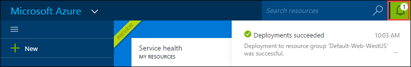

<properties
    pageTitle="Criar um aplicativo da web de WordPress no serviço de aplicativo do Azure | Microsoft Azure"
    description="Aprenda a criar um novo aplicativo web Azure para um blog de WordPress usando o Portal do Azure."
    services="app-service\web"
    documentationCenter="php"
    authors="rmcmurray"
    manager="wpickett"
    editor=""/>

<tags
    ms.service="app-service-web"
    ms.workload="na"
    ms.tgt_pltfrm="na"
    ms.devlang="PHP"
    ms.topic="hero-article"
    ms.date="08/11/2016"
    ms.author="robmcm"/>

# Criar um aplicativo da web de WordPress no serviço de aplicativo do Azure

[AZURE.INCLUDE [tabs](../../includes/app-service-web-get-started-nav-tabs.md)]

Este tutorial mostra como implantar um site de blog WordPress do Azure Marketplace.

Quando terminar com o tutorial você terá seu próprio site de blog WordPress para cima e em execução na nuvem.

Você aprenderá:

* Como encontrar um modelo de aplicativo do Azure Marketplace.
* Como criar um aplicativo web no serviço de aplicativo do Azure que é baseado no modelo.
* Como definir configurações de serviço de aplicativo do Azure para o novo aplicativo web e o banco de dados.

Do Azure Marketplace disponibiliza uma ampla variedade de aplicativos web populares desenvolvida pela Microsoft, outras empresas e iniciativas de software de fonte aberta. Aplicativos da web são criados em uma ampla variedade de estruturas populares, como [PHP](/develop/nodejs/) neste WordPress exemplo, [.NET](/develop/net/), [Node](/develop/nodejs/), [Java](/develop/java/), e [Python](/develop/python/), para mencionar alguns. Para criar um aplicativo web do Azure Marketplace o único software que você precisa é o navegador que você usa para o [Portal do Azure](https://portal.azure.com/). 

O site de WordPress que você implantar neste tutorial usa MySQL para o banco de dados. Se você deseja usar em vez disso, o banco de dados SQL do banco de dados, consulte [Nami de projeto](http://projectnami.org/). **Projeto Nami** também está disponível através do Marketplace.

> [AZURE.NOTE]
> Para concluir este tutorial, você precisará de uma conta do Microsoft Azure. Se você não tiver uma conta, você pode [ativar seus benefícios de assinante do Visual Studio](/pricing/member-offers/msdn-benefits-details/?WT.mc_id=A261C142F) ou [inscrever-se para uma avaliação gratuita](/en-us/pricing/free-trial/?WT.mc_id=A261C142F).
>
> Se você deseja começar a usar o serviço de aplicativo do Azure antes de se inscrever para uma conta do Azure, vá para [Experimentar o serviço de aplicativo](http://go.microsoft.com/fwlink/?LinkId=523751). Lá, você pode criar imediatamente um aplicativo da web de curta duração starter no serviço de aplicativo — sem cartão de crédito necessários e nenhum compromissos.

## Selecione WordPress e configurar o serviço de aplicativo do Azure

1. Faça logon [Portal do Azure](https://portal.azure.com/).

2. Clique em **novo**.
    
    ![Criar novo][5]
    
3. Procurar **WordPress**e clique em **WordPress**. Se desejar usar o banco de dados SQL em vez de MySQL, procure **Nami do projeto**.

    ![WordPress de lista][7]
    
5. Após ler a descrição do aplicativo WordPress, clique em **criar**.

    

4. Insira um nome para o aplicativo da web na caixa **Web app** .

    Esse nome deve ser exclusivo no domínio azurewebsites.net porque a URL do aplicativo web será {name}. azurewebsites.net. Se o nome inserido não exclusivo, um ponto de exclamação vermelho aparece na caixa de texto.

8. Se você tiver mais de uma assinatura, escolha o que você deseja usar. 

5. Selecione um **Grupo de recursos** ou crie um novo.

    Para obter mais informações sobre os grupos de recursos, consulte [Visão geral do Gerenciador de recursos do Azure](../azure-resource-manager/resource-group-overview.md).

5. Selecione um **Local da plano de serviço de aplicativo** ou crie um novo.

    Para obter mais informações sobre planos de serviço de aplicativo, consulte [Visão geral de planos de serviço de aplicativo do Azure](../azure-web-sites-web-hosting-plans-in-depth-overview.md) 

7. Clique em **banco de dados**e, em seguida, na lâmina **Novo banco de dados MySQL** fornecem os valores necessários para configurar seu banco de dados MySQL.

    a. Insira um novo nome ou deixe o nome padrão.

    b. Deixe o **Tipo de banco de dados** definido como **compartilhado**.

    c. Escolha no mesmo local do que você escolheu para o aplicativo web.

    d. Escolha um nível de preços. Mercúrio (gratuito com conexões permitidas mínimo e espaço em disco) está corretamente configurado para este tutorial.

8. Na lâmina **Novo banco de dados MySQL** , clique em **Okey**. 

8. Na lâmina **WordPress** , aceite os termos legais e, em seguida, clique em **criar**. 

    

    Serviço de aplicativo do Azure cria o aplicativo da web, normalmente em menos de um minuto. Você pode assistir o andamento clicando no ícone de sino na parte superior da página do portal.

    

## Iniciar e gerenciar seu aplicativo web do WordPress
    
7. Quando terminar a criação de aplicativos web, navegue no Portal do Azure para o grupo de recursos em que você criou o aplicativo e você pode ver o aplicativo da web e o banco de dados.

    O recurso adicional com o ícone de lâmpada é [Obtenção de informações do aplicativo](/services/application-insights/), que fornece serviços de monitoramento para seu aplicativo web.

1. Na lâmina **grupo de recursos** , clique na linha de aplicativo web.

    

2. Na lâmina Web app, clique em **Procurar**.

    ![URL do site][browse]

3. Na página **Bem-vindo** WordPress, insira as informações de configuração necessárias por WordPress e clique em **Instalar WordPress**.

    

4. Faça logon usando as credenciais que você criou na página de **boas-vindas** .  

5. Abre a página de painel do site.    

    

## Próximas etapas

Você viu como criar e implantar um aplicativo da web PHP da Galeria. Para obter mais informações sobre como usar PHP no Azure, consulte o [PHP Developer Center](/develop/php/).

Para obter mais informações sobre como trabalhar com o aplicativo de serviço Web Apps, consulte os links no lado esquerdo da página (para windows de navegador ampla) ou na parte superior da página (para windows de navegador estreito). 

## O que mudou
* Para um guia para a alteração de sites para o serviço de aplicativo, consulte o [serviço de aplicativo do Azure e seu impacto nos serviços do Azure existentes](http://go.microsoft.com/fwlink/?LinkId=529714).

[5]: ./media/web-sites-php-web-site-gallery/startmarketplace.png
[7]: ./media/web-sites-php-web-site-gallery/search-web-app.png
[browse]: ./media/web-sites-php-web-site-gallery/browse-web.png
