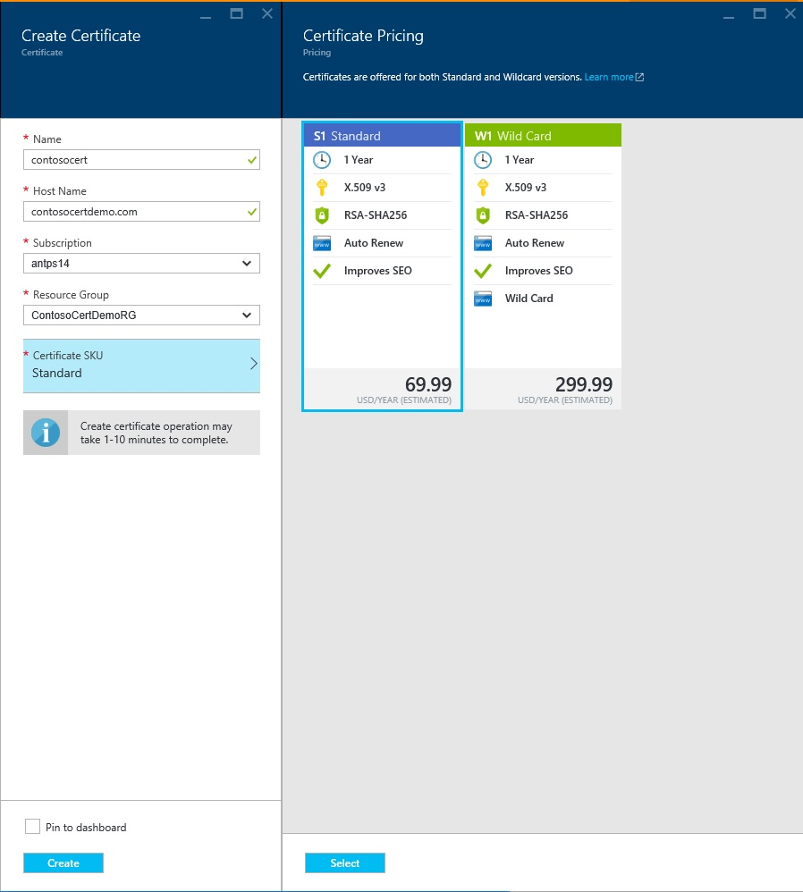
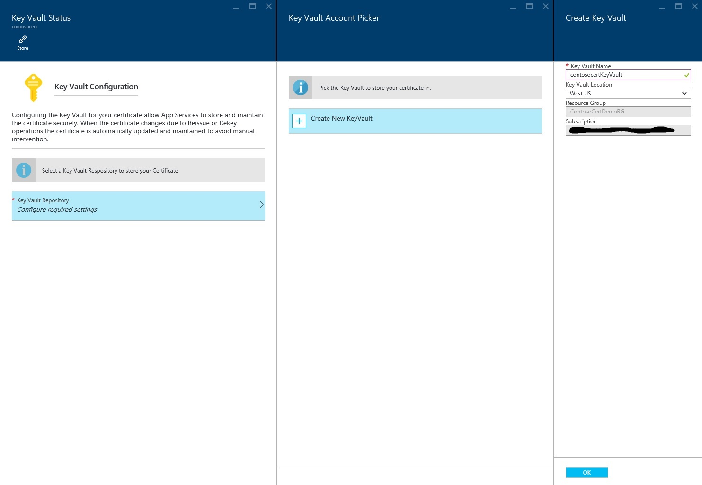
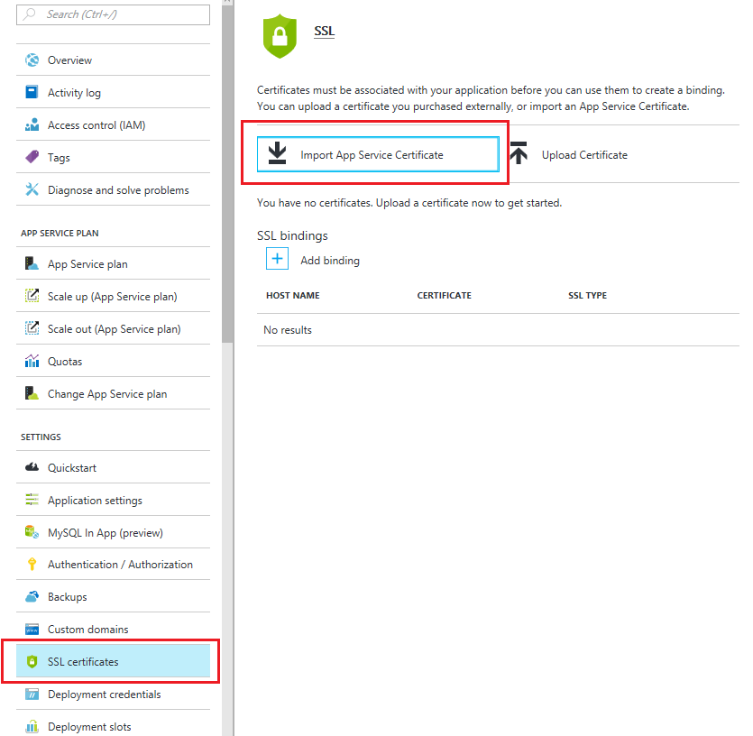

<properties
    pageTitle="Comprar e configurar um certificado SSL para o seu serviço de aplicativo do Azure"
    description="Saiba como comprar e configurar um certificado SSL para o seu serviço de aplicativo do Azure."
    services="app-service"
    documentationCenter=".net"
    authors="apurvajo"
    manager="stefsch"
    editor="cephalin"
    tags="buy-ssl-certificates"/>

<tags
    ms.service="app-service"
    ms.workload="na"
    ms.tgt_pltfrm="na"
    ms.devlang="na"
    ms.topic="article"
    ms.date="09/19/2016"
    ms.author="apurvajo"/>

#Comprar e configurar um certificado SSL para o seu serviço de aplicativo do Azure

> [AZURE.SELECTOR]
- [Comprar o certificado SSL no Azure](web-sites-purchase-ssl-web-site.md)
- [Usar o certificado SSL de qualquer outro lugar](web-sites-configure-ssl-certificate.md)

Por padrão, o **[Serviço de aplicativo do Azure](http://go.microsoft.com/fwlink/?LinkId=529714)** já habilita HTTPS para o aplicativo web com um certificado curinga para o *. azurewebsites.net domínio. Se você não planeja configurar um domínio personalizado, em seguida, você pode aproveitar o certificado HTTPS padrão. No entanto, como todos os * [domínios curinga](https://casecurity.org/2014/02/26/pros-and-cons-of-single-domain-multi-domain-and-wildcard-certificates), ele não é tão seguro quanto usando um domínio personalizado com seu próprio certificado. O serviço de aplicativo Azure agora oferece uma maneira realmente simplificada para comprar e gerenciar um certificado SSL diretamente do Portal Azure sem sair do portal.  
Este artigo explica como comprar e configurar um certificado SSL para o **[Serviço de aplicativo do Azure](http://go.microsoft.com/fwlink/?LinkId=529714)** em 3 etapas simples. 

> [AZURE.NOTE]
> Certificados SSL para nomes de domínio personalizada não pode ser usados com o web app livre e compartilhado. Você deve configurar o seu aplicativo web para o modo Basic, Standard ou Premium, que pode mudar quanto você é cobrado para sua assinatura. Consulte **[Detalhes de preços de aplicativos Web](https://azure.microsoft.com/pricing/details/web-sites/)** para obter mais informações.

##Visão geral
> [AZURE.NOTE]
> Não tente adquirir um certificado SSL usando uma assinatura que não tem um cartão de crédito ativa associada a ele. Isso pode resultar em sua assinatura sendo desabilitada. 

##<a>Comprar, armazenar e atribuir um certificado SSL para seu domínio personalizado</a>
Para habilitar o HTTPS para um domínio personalizado, como contoso.com, você deve primeiro ** [Configurar um nome de domínio personalizado no serviço de aplicativo do Azure.](web-sites-custom-domain-name.md)**

Antes de solicitar um certificado SSL, primeiro você deve determinar quais nomes de domínio serão protegidos pelo certificado. Isso determinará a que tipo de certificado que você deve obter. Se você precisar apenas proteger um único nome de domínio como contoso.com ou www.contoso.com um padrão (básico) certificado é suficiente. Se você precisa proteger vários nomes de domínio, como contoso.com, www.contoso.com e mail.contoso.com, em seguida, você pode obter um ** [certificado curinga](http://en.wikipedia.org/wiki/Wildcard_certificate)**

##Etapa 0: Fazer um pedido de certificado SSL

Nesta etapa, você aprenderá como colocar uma ordem para um certificado SSL de sua escolha.

1.  No **[Portal do Azure](https://portal.azure.com/)**, clique em Procurar e digite "Certificados de serviço de aplicativo" na barra de pesquisa e selecione "Certificados de serviço de aplicativo" do resultado e clique em Adicionar. 

    

    

2.  Digite o **nome amigável** do certificado SSL.

3.  Insira o **nome do Host**
> [AZURE.NOTE]
    Essa é uma das partes mais importantes do processo de compra. Verifique se inserir nome de host correto (domínio personalizado) que você deseja proteger com este certificado. **Não** acrescentar o nome de Host com WWW. Por exemplo, se seu nome de domínio personalizado for www.contoso.com, basta digitar contoso.com no campo nome do Host, o certificado em questão irá proteger domínios www e raiz. 
    
4.  Selecione sua **assinatura**. 

    Se você tiver várias assinaturas, verifique se criar um certificado SSL na mesma assinatura que você usou para seu domínio personalizado ou Web App em questão.
       
5.  Selecione ou crie um **grupo de recursos**.

    Grupos de recursos permitem gerenciar recursos Azure relacionados como uma unidade e são úteis quando estabelecer regras de controle (RBAC) de acesso baseado em função para seus aplicativos. Para obter mais informações, consulte gerenciar seus recursos Azure.
     
6.  Selecione o **certificado SKU** 

    Finalmente, selecione o certificado SKU que atenda às suas necessidades e clique em criar. Atualmente, o serviço de aplicativo do Azure permite que a compra de dois diferentes SKUs • S1 – certificado padrão com validade de 1 ano e renovação automática  
           • B1 – certificado curinga com renovação de validade e automático de 1 ano      
    Consulte **[Detalhes de preços de aplicativos Web](https://azure.microsoft.com/pricing/details/web-sites/)** para obter mais informações.

> [AZURE.NOTE]
> Criação de um certificado SSL levará em qualquer lugar de 1 a 10 minutos. Esse processo executa várias etapas no plano de fundo que caso contrário são muito complicado executar manualmente.  

##Etapa 1: Armazenar o certificado no cofre de chave do Azure

Nesta etapa, você aprenderá como colocar uma loja um certificado SSL adquirido ao Azure chave Cofre de sua escolha.

1.  Depois que a compra de um certificado SSL estiver concluída você precisará abrir manualmente blade do recurso de **Certificados de serviço de aplicativo** navegando-lo novamente (consulte Etapa 1 acima)   

    

    Você notará que o status do certificado é **"emissão pendente"** como há mais algumas etapas que você precisa concluir antes de começar a usar este certificados.
 
2. Clique em **"configuração de certificado"** dentro blade de propriedades do certificado e clique em **"etapa 1: armazenar"** armazenar este certificado no Azure chave cofre.

3.  Clique em **"Status do cofre chave"** Blade **"chave cofre repositório"** para escolher um cofre de chave existente para armazenar este certificado **ou "Criar novo cofre de chave"** criar novo cofre de chave dentro do mesmo grupo de recursos e de assinatura.
 
    
 
    > [AZURE.NOTE]
    Azure Cofre de chave tem encargos mínimos para armazenar este certificado. Consulte **[Detalhes de preços do Azure chave cofre](https://azure.microsoft.com/pricing/details/key-vault/)** para obter mais informações.

4. Depois que você selecionou o repositório de cofre chave para armazenar este certificado no, prossiga e armazená-la clicando no botão **"Armazenar"** na parte superior da lâmina de **"chave Status do cofre"** .  

    Isso deve concluir a etapa para armazenar o certificado que você comprou com Azure chave Cofre de sua escolha. Após atualizar o Blade, você deve ver verde verificar marcar contra essa etapa também.
    
##Etapa 2: Confirmar a posse de domínio

Nesta etapa, você aprenderá como realizar a verificação de domínio de propriedade para um certificado SSL que você acabou de colocar uma ordem para. 

1.  Clique em **"etapa 2: Confirmar"** etapa da lâmina **"Configuração de certificado"** . Há 4 tipos de domínio suportado pelo aplicativo de serviço de certificados de verificação.

    * **Verificação de serviço de aplicativo** 
    
        * Este é o processo mais conveniente se você já tiver **seu domínio personalizado atribuído para os aplicativos de serviço de aplicativo.** Este método listará check-out de todos os aplicativos de serviço de aplicativo que atendam a esse critério. 
           Por exemplo, nesse caso, **contosocertdemo.com** é um domínio personalizado atribuído ao aplicativo de serviço de aplicativo chamado **"ContosoCertDemo"** e, portanto, que é o aplicativo de serviço de aplicativo somente listados aqui. Se houver várias regiões implantação, ele seria listá-las toda as regiões.
        
           O método de verificação só está disponível para compras de certificado (básico) padrão. Para certificados de curinga, ignore e mover para a opção B, C ou D abaixo.
        * Clique no botão **"Confirmar"** para concluir esta etapa.
        * Clique em **"Atualizar"** para atualizar o status de certificado após a verificação. Pode demorar alguns minutos para verificação ser concluída.
        
             

    * **Verificação de domínio** 

        * Este é o processo mais conveniente **somente se** você tiver **[comprou seu domínio personalizado do serviço de aplicativo do Azure.](custom-dns-web-site-buydomains-web-app.md)**
        
        * Clique no botão **"Confirmar"** para concluir esta etapa.
        
        * Clique em **"Atualizar"** para atualizar o status de certificado após a verificação. Pode demorar alguns minutos para verificação ser concluída.

    * **Verificação de email**
        
        * Email de confirmação já foi enviada para os endereços de Email associado a esse domínio personalizado.
         
        * Abra o email e clique no link de verificação para concluir a etapa de verificação de Email. 
        
        * Se você precisar reenviar o email de confirmação, clique no botão **"reenviar Email"** .
         
    * **Verificação manual**    
                 
        1. **Verificação de página da Web HTML**
        
            * Crie um arquivo HTML chamado **{Token de verificação de domínio}**. HTML (você pode copiar o token de ele Blade de Status de verificação de domínio)
            
            * O conteúdo desse arquivo deve ser o mesmo nome de **Token de verificação do domínio**.
            
            * Carregar o arquivo na raiz do servidor web que hospeda o seu domínio.
            
            * Clique em **"Atualizar"** para atualizar o status de certificado após a verificação. Pode demorar alguns minutos para verificação ser concluída.
            
            Por exemplo, se você estiver comprando um certificado padrão para contosocertdemo.com com o Token de verificação do domínio **'cAGgQrKc'** , em seguida, uma solicitação de web feita **'http://contosocertdemo.com/cAGgQrKc.html'** deve retornar **cAGgQrKc.**
        2. **Verificação de registro DNS TXT**

            * Usando o Gerenciador de DNS, crie um registro TXT no subdomínio **'DZC'** com valor igual a **Token de verificação do domínio.**
            
            * Clique em **"Atualizar"** para atualizar o status de certificado após a verificação. Pode demorar alguns minutos para verificação ser concluída.
                              
            Por exemplo, para realizar validação para um certificado curinga com hostname ** \*. contosocertdemo.com** ou ** \*. subdomain.contosocertdemo.com** e **cAGgQrKc**de Token de verificação do domínio, você precisa criar um registro TXT em dzc.contosocertdemo.com com valor **cAGgQrKc.**     

##Etapa 3: Atribuir certificado ao aplicativo de serviço de aplicativo

Nesta etapa, você aprenderá a atribuir este recentemente adquirida certificado para seus aplicativos de serviço do aplicativo. 

> [AZURE.NOTE]
> Antes de executar as etapas desta seção, você deve ter associados um nome de domínio personalizado com seu aplicativo. Para obter mais informações, consulte ** [Configurando um nome de domínio personalizado para um web app.](web-sites-custom-domain-name.md)**

1.  No seu navegador, abra a ** [Portal Azure.](https://portal.azure.com/)**
2.  Clique na opção de **Serviço de aplicativo** no lado esquerdo da página.
3.  Clique no nome do aplicativo ao qual você deseja atribuir este certificado. 
4.  Nas **configurações**, clique em **certificados SSL**
5.  Clique em **Importar certificado de serviço de aplicativo** e selecione o certificado que você acabou de adquirir

    

6. Clique em **Adicionar ligações** da seção nas **ligações ssl**
7. Na lâmina **Adicionar vinculação SSL** use menus suspensos para selecionar o nome de domínio para proteger com SSL e o certificado para usar. Você também pode selecionar se deseja usar **[Indicação de nome de servidor (SNI)](http://en.wikipedia.org/wiki/Server_Name_Indication)** ou SSL baseada em IP.

    

       •    IP based SSL associates a certificate with a domain name by mapping the dedicated public IP address of the server to the domain name. This requires each domain name (contoso.com, fabricam.com, etc.) associated with your service to have a dedicated IP address. This is the traditional          method of associating SSL certificates with a web server.
       •    SNI based SSL is an extension to SSL and **[Transport Layer Security](http://en.wikipedia.org/wiki/Transport_Layer_Security)** (TLS) that allows multiple domains to share the same IP address, with separate security certificates for each domain. Most modern browsers (including Internet Explorer, Chrome, Firefox and Opera) support SNI, however older browsers may not support SNI. For more information on SNI, see the **[Server Name Indication](http://en.wikipedia.org/wiki/Server_Name_Indication)** article on Wikipedia.
       
7. Clique em **Adicionar vinculação** para salvar as alterações e habilitar SSL.

Se você selecionou **SSL baseada em IP** e seu domínio personalizado é configurado usando um registro, você deve executar as seguintes etapas adicionais:

* Após ter configurado um IP baseadas vinculação SSL, um endereço IP dedicado é atribuído a seu aplicativo. Você pode encontrar esse endereço IP na página de **domínio personalizado** em configurações do aplicativo, logo acima da seção de **nomes de host** . Ele será listado como **Endereço IP externo**
    
    

    Observe que este endereço IP será diferente do que o endereço IP virtual usado anteriormente para configurar o registro do seu domínio. Se você estiver configurado para usar SNI com base em SSL ou não estão configurados para usar SSL, nenhum endereço será listado para essa entrada.
    
2. Usando as ferramentas fornecidas pelo seu registrador de nome de domínio, modifique o registro para o seu nome de domínio personalizado apontar para o endereço IP da etapa anterior.
Neste ponto, você deve ser capaz de visite seu aplicativo usando HTTPS:// em vez de HTTP:// para verificar se o certificado foi configurado corretamente.

##Criar novas chaves e sincronizar o certificado

1. Por razões de segurança, se você precisar criar novas chaves seu certificado, em seguida, simplesmente selecione opção **"criar novas chaves e sincronizar"** Blade **"propriedades de certificado"** . 

2. Clique no botão **"Criar novas chaves"** para iniciar o processo. Esse processo pode levar de 1 a 10 minutos para ser concluída. 

    

3. Recriação seu certificado irá rolar para o certificado com um novo certificado emitido da autoridade de certificação.
4. Você não será cobrado para o rechaveamento durante a vida útil do certificado. 
5. Recriação seu certificado irão por meio de estado de emissão pendente. 
6. Depois que o certificado está pronto Certifique-se de que sincronizar seus recursos usando este certificado para evitar interromper o serviço.
7. Opção Sincronizar não está disponível para certificados que ainda não são atribuídos a Web App. 

## Mais recursos ##
- [Habilitar HTTPS para um aplicativo no serviço de aplicativo do Azure](web-sites-configure-ssl-certificate.md)
- [Comprar e configurar um nome de domínio personalizado no serviço de aplicativo do Azure](custom-dns-web-site-buydomains-web-app.md)
- [Central de confiabilidade do Microsoft Azure](/support/trust-center/security/)
- [Opções de configuração desbloqueadas em Sites do Azure](http://azure.microsoft.com/blog/2014/01/28/more-to-explore-configuration-options-unlocked-in-windows-azure-web-sites/)
- [Portal de gerenciamento do Azure](https://manage.windowsazure.com)

>[AZURE.NOTE] Se você quiser começar a usar o serviço de aplicativo do Azure antes de se inscrever para uma conta do Azure, vá para [Experimentar o serviço de aplicativo](http://go.microsoft.com/fwlink/?LinkId=523751), onde você pode criar imediatamente um aplicativo da web de curta duração starter no aplicativo de serviço. Não há cartões de crédito obrigatório; Não há compromissos.

