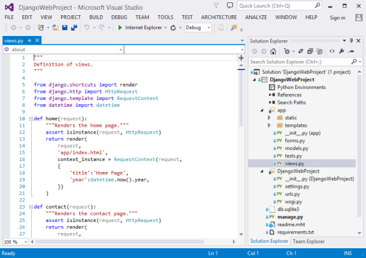
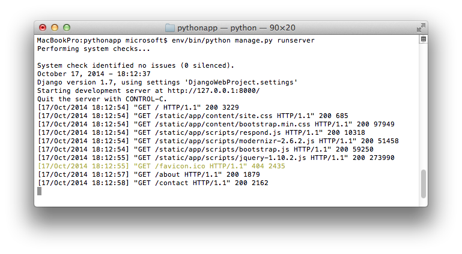

<properties
    pageTitle="Criando aplicativos web com Django no Azure"
    description="Um tutorial que apresenta executando um aplicativo da web de Python no Azure aplicativo de serviço Web Apps."
    services="app-service\web"
    documentationCenter="python"
    tags="python"
    authors="huguesv" 
    manager="wpickett" 
    editor=""/>

<tags
    ms.service="app-service-web"
    ms.workload="web"
    ms.tgt_pltfrm="na"
    ms.devlang="python"
    ms.topic="hero-article" 
    ms.date="02/19/2016"
    ms.author="huvalo"/>

# Criando aplicativos web com Django no Azure

Este tutorial descreve como começar a execução Python nos [Aplicativos do Azure aplicativo de serviço Web](http://go.microsoft.com/fwlink/?LinkId=529714). Web Apps fornece hospedagem gratuita limitado e implantação rápida, e você pode usar Python! À medida que seu aplicativo cresce, você pode alternar para a hospedagem paga e você pode também integrar com todos os outros serviços do Azure.

Você irá criar um aplicativo usando a estrutura de web Django (consulte versões alternativas deste tutorial para [Flask](web-sites-python-create-deploy-flask-app.md) e [garrafa](web-sites-python-create-deploy-bottle-app.md)). Você irá criar o aplicativo web do Azure Marketplace, configure implantação gito e clonar repositório localmente. Em seguida, você executar o aplicativo localmente, fazer alterações, confirmar e enviá-los para o Azure. O tutorial mostra como fazer isso pelo Windows ou Mac/Linux.

[AZURE.INCLUDE [create-account-and-websites-note](../../includes/create-account-and-websites-note.md)]

>[AZURE.NOTE] Se você quiser começar a usar o serviço de aplicativo do Azure antes de se inscrever para uma conta do Azure, vá para [Experimentar o serviço de aplicativo](http://go.microsoft.com/fwlink/?LinkId=523751), onde você pode criar imediatamente um aplicativo da web de curta duração starter no aplicativo de serviço. Não há cartões de crédito obrigatório; Não há compromissos.

## Pré-requisitos

- Windows, Mac ou Linux
- Python 2.7 ou 3.4
- setuptools, pip, virtualenv (somente 2.7 Python)
- Gito
- [Ferramentas de Python para Visual Studio][] (PTVS) - Observação: isso é opcional

**Observação**: a publicação TFS não é suportada atualmente para projetos de Python.

### Windows

Se você ainda não tiver Python 2.7 ou 3,4 instalado (32 bits), é recomendável instalar o [SDK do Azure para Python 2.7] ou o [SDK do Azure para Python 3.4] usando Web Platform Installer. Isso instala a versão de 32 bits do Python setuptools, pip, virtualenv, etc (32 bits Python é o que está instalado em máquinas host Azure). Como alternativa, você pode acessar Python de [python.org].

Para gito, recomendamos [Gito para Windows] ou [GitHub para Windows]. Se você usar Visual Studio, você pode usar o suporte de gito integrado.

Também recomendamos instalar [Python 2.2 de ferramentas para Visual Studio]. Isso é opcional, mas se você tiver o [Visual Studio], incluindo o livre 2013 de comunidade Visual Studio ou Visual Studio Express 2013 para Web, em seguida, isso lhe dará um grande IDE Python.

### Mac/Linux

Você deve ter Python e gito já instalado, mas garantir Python 2.7 ou 3.4.

## Criação de aplicativo da Web no Portal

A primeira etapa na criação de seu aplicativo é criar o aplicativo web através do [Portal do Azure](https://portal.azure.com).

1. Faça logon no Portal do Azure e clique no botão **novo** no canto inferior esquerdo.
3. Na caixa Pesquisar, digite "python".
4. Nos resultados da pesquisa, selecione **Django** (publicado por PTVS), clique em **criar**.
5. Configure o novo aplicativo de Django, como criar um novo plano de serviço de aplicativo e um novo grupo de recursos para ele. Em seguida, clique em **criar**.
6. Configure a publicação de gito para o aplicativo web recém-criado, seguindo as instruções na [Implantação Local do gito ao serviço de aplicativo do Azure](app-service-deploy-local-git.md).

## Visão geral do aplicativo

### Conteúdo do repositório de gito

Aqui está uma visão geral dos arquivos que você encontrará no repositório gito inicial, que podemos será clonar na próxima seção.

    \app\__init__.py
    \app\forms.py
    \app\models.py
    \app\tests.py
    \app\views.py
    \app\static\content\
    \app\static\fonts\
    \app\static\scripts\
    \app\templates\about.html
    \app\templates\contact.html
    \app\templates\index.html
    \app\templates\layout.html
    \app\templates\login.html
    \app\templates\loginpartial.html
    \DjangoWebProject\__init__.py
    \DjangoWebProject\settings.py
    \DjangoWebProject\urls.py
    \DjangoWebProject\wsgi.py

Fontes principais para o aplicativo. Consiste 3 páginas (índice, sobre, contato) com um layout mestre. Scripts e conteúdo estático incluem inicialização, jquery, modernizr e responder.

    \manage.py

Suporte de servidor de desenvolvimento e gerenciamento local. Use este comando para executar o aplicativo localmente, sincronize o banco de dados, etc.

    \db.sqlite3

Banco de dados padrão. Inclui as tabelas necessárias para o aplicativo seja executado, mas não contém todos os usuários (sincronizar o banco de dados para criar um usuário).

    \DjangoWebProject.pyproj
    \DjangoWebProject.sln

Arquivos de projeto para uso com [Ferramentas de Python para Visual Studio].

    \ptvs_virtualenv_proxy.py

Proxy do IIS para ambientes virtuais e PTVS suporte de depuração remota.

    \requirements.txt

Pacotes externos necessitados por este aplicativo. O script de implantação será pip instalar os pacotes listados neste arquivo.

    \web.2.7.config
    \web.3.4.config

Arquivos de configuração do IIS. O script de implantação usará o web.x.y.config apropriado e copiá-lo como Web. config.

### Arquivos opcionais - implantação de personalização

[AZURE.INCLUDE [web-sites-python-django-customizing-deployment](../../includes/web-sites-python-django-customizing-deployment.md)]

### Arquivos opcionais - Python runtime

[AZURE.INCLUDE [web-sites-python-customizing-runtime](../../includes/web-sites-python-customizing-runtime.md)]

### Arquivos adicionais no servidor

Alguns arquivos existem no servidor, mas não são adicionados ao repositório gito. Estes são criados pelo script de implantação.

    \web.config

Arquivo de configuração do IIS. Criado a partir de web.x.y.config em cada implantação.

    \env\

Ambiente virtual Python. Criada durante a implantação, se ainda não exista um ambiente virtual compatível do aplicativo web. Pacotes listados no requirements.txt são pip instalado, mas pip ignorará instalação se os pacotes já estiverem instalados.

As seções próximos 3 descrevem para prosseguir com o desenvolvimento de aplicativo da web em diferentes ambientes de 3:

- Windows, com ferramentas de Python para Visual Studio
- Windows, com linha de comando
- Mac/Linux, com linha de comando

## Ferramentas de - Windows - Python de desenvolvimento de aplicativo da Web para Visual Studio

### Clonar repositório

Primeiro, clone repositório usando a URL fornecida no Portal do Azure. Para obter mais informações, consulte [Implantação Local do gito ao serviço de aplicativo do Azure](app-service-deploy-local-git.md).

Abra o arquivo de solução (. sln) que está incluído na raiz do repositório.

### Criar ambiente virtual

Agora vamos criar um ambiente virtual para desenvolvimento local. Clique com botão direito em **Ambientes de Python** selecione **Adicionar ambiente Virtual...**.

- Verifique se o nome do ambiente é `env`.

- Selecione o intérprete base. Certifique-se de usar a mesma versão do Python que está selecionado para o aplicativo da web (em runtime.txt ou a lâmina de **Configurações do aplicativo** de seu aplicativo web no Portal do Azure).

- Verifique se a opção para baixar e instalar pacotes está marcada.

Clique em **criar**. Isso criará o ambiente virtual e instalar dependências listadas no requirements.txt.

### Criar um superusuário

O banco de dados incluído com o aplicativo não tem qualquer superusuário definido. Para poder usar a funcionalidade de entrar no aplicativo, ou a interface de administração de Django (se você decidir habilitá-lo), você precisará criar um superusuário.

Execute isso a partir da linha de comando da pasta do projeto:

    env\scripts\python manage.py createsuperuser

Siga os prompts para definir o nome de usuário, senha, etc.

### Executar usando o servidor de desenvolvimento

Pressione F5 para iniciar a depuração e seu navegador da web abrirá automaticamente para a página executando localmente.

Você pode definir pontos de interrupção em fontes de dados, use o windows de inspeção, etc. Consulte as [Ferramentas de Python para documentação do Visual Studio] para obter mais informações sobre os vários recursos.

### Fazer alterações

Agora você pode experimentar fazendo alterações a fontes de aplicativo e/ou modelos.

Depois que você testou as alterações, confirmá-las ao repositório gito:

### Instalar pacotes mais

Seu aplicativo pode ter dependências além Python e Django.

Você pode instalar pacotes adicionais usando pip. Para instalar um pacote, clique com botão direito no ambiente virtual e selecione **Instalar pacote de Python**.

Por exemplo, para instalar o SDK do Azure para Python, que fornece acesso a armazenamento do Azure, barramento de serviço e outros serviços do Azure, digite `azure`:

Clique com botão direito no ambiente virtual e selecione **Gerar requirements.txt** atualizar requirements.txt.

Em seguida, confirme as alterações requirements.txt ao repositório gito.

### Implantar para o Azure

Para disparar uma implantação, clique em **sincronizar** ou **Push**. Sincronização faz uma recepção e um envio.

A primeira implantação levará algum tempo, pois isso criará um ambiente virtual, pacotes de instalação, etc.

O Visual Studio não mostra o progresso da implantação. Se você quiser revisar a saída, consulte a seção sobre [solução de problemas - implantação](#troubleshooting-deployment).

Navegue até a URL do Azure para ver as alterações.

## Linha de comando de desenvolvimento - Windows - Web app

### Clonar repositório

Primeiro, clonar repositório usando a URL fornecida no Portal do Azure e adicione o repositório Azure como um controle remoto. Para obter mais informações, consulte [Implantação Local do gito ao serviço de aplicativo do Azure](app-service-deploy-local-git.md).

    git clone <repo-url>
    cd <repo-folder>
    git remote add azure <repo-url>

### Criar ambiente virtual

Vamos criar um novo ambiente virtual para fins de desenvolvimento (não adicioná-lo ao repositório). Ambientes virtuais em Python não são relocáveis, para que todos os desenvolvedores trabalhar no aplicativo irá criar seus próprios localmente.

Certifique-se de usar a mesma versão do Python que está selecionado para o aplicativo da web (em runtime.txt ou a lâmina de configurações do aplicativo de seu aplicativo web no Portal do Azure).

Para Python 2.7:

    c:\python27\python.exe -m virtualenv env

Para Python 3.4:

    c:\python34\python.exe -m venv env

Instale quaisquer pacotes externas exigidas pelo seu aplicativo. Você pode usar o arquivo de requirements.txt na raiz do repositório para instalar os pacotes de seu ambiente virtual:

    env\scripts\pip install -r requirements.txt

### Criar um superusuário

O banco de dados incluído com o aplicativo não tem qualquer superusuário definido. Para poder usar a funcionalidade de entrar no aplicativo, ou a interface de administração de Django (se você decidir habilitá-lo), você precisará criar um superusuário.

Execute isso a partir da linha de comando da pasta do projeto:

    env\scripts\python manage.py createsuperuser

Siga os prompts para definir o nome de usuário, senha, etc.

### Executar usando o servidor de desenvolvimento

Você pode iniciar o aplicativo em um servidor de desenvolvimento com o seguinte comando:

    env\scripts\python manage.py runserver

O console exibirá a URL e porta do servidor ouve:

Em seguida, abra o navegador da web para essa URL.

### Fazer alterações

Agora você pode experimentar fazendo alterações a fontes de aplicativo e/ou modelos.

Depois que você testou as alterações, confirmá-las ao repositório gito:

    git add <modified-file>
    git commit -m "<commit-comment>"

### Instalar pacotes mais

Seu aplicativo pode ter dependências além Python e Django.

Você pode instalar pacotes adicionais usando pip. Por exemplo, para instalar o SDK do Azure para Python, que fornece acesso a armazenamento do Azure, barramento de serviço e outros serviços do Azure, digite:

    env\scripts\pip install azure

Certifique-se de atualizar requirements.txt:

    env\scripts\pip freeze > requirements.txt

Confirme as alterações:

    git add requirements.txt
    git commit -m "Added azure package"

### Implantar para o Azure

Para disparar uma implantação, notificações por push as alterações no Azure:

    git push azure master

Você verá a saída do script de implantação, incluindo a criação de ambiente virtual, instalação de pacotes, criação de Web. config.

Navegue até a URL do Azure para ver as alterações.

## Linha de comando de desenvolvimento - Mac/Linux – de aplicativo Web

### Clonar repositório

Primeiro, clonar repositório usando a URL fornecida no Portal do Azure e adicione o repositório Azure como um controle remoto. Para obter mais informações, consulte [Implantação Local do gito ao serviço de aplicativo do Azure](app-service-deploy-local-git.md).

    git clone <repo-url>
    cd <repo-folder>
    git remote add azure <repo-url>

### Criar ambiente virtual

Vamos criar um novo ambiente virtual para fins de desenvolvimento (não adicioná-lo ao repositório). Ambientes virtuais em Python não são relocáveis, para que todos os desenvolvedores trabalhar no aplicativo irá criar seus próprios localmente.

Certifique-se de usar a mesma versão do Python que está selecionado para o aplicativo da web (em runtime.txt ou a lâmina de configurações do aplicativo de seu aplicativo web no Portal do Azure).

Para Python 2.7:

    python -m virtualenv env

Para Python 3.4:

    python -m venv env

ou

    pyvenv env

Instale quaisquer pacotes externas exigidas pelo seu aplicativo. Você pode usar o arquivo de requirements.txt na raiz do repositório para instalar os pacotes de seu ambiente virtual:

    env/bin/pip install -r requirements.txt

### Criar um superusuário

O banco de dados incluído com o aplicativo não tem qualquer superusuário definido. Para poder usar a funcionalidade de entrar no aplicativo, ou a interface de administração de Django (se você decidir habilitá-lo), você precisará criar um superusuário.

Execute isso a partir da linha de comando da pasta do projeto:

    env/bin/python manage.py createsuperuser

Siga os prompts para definir o nome de usuário, senha, etc.

### Executar usando o servidor de desenvolvimento

Você pode iniciar o aplicativo em um servidor de desenvolvimento com o seguinte comando:

    env/bin/python manage.py runserver

O console exibirá a URL e porta do servidor ouve:

Em seguida, abra o navegador da web para essa URL.

### Fazer alterações

Agora você pode experimentar fazendo alterações a fontes de aplicativo e/ou modelos.

Depois que você testou as alterações, confirmá-las ao repositório gito:

    git add <modified-file>
    git commit -m "<commit-comment>"

### Instalar pacotes mais

Seu aplicativo pode ter dependências além Python e Django.

Você pode instalar pacotes adicionais usando pip. Por exemplo, para instalar o SDK do Azure para Python, que fornece acesso a armazenamento do Azure, barramento de serviço e outros serviços do Azure, digite:

    env/bin/pip install azure

Certifique-se de atualizar requirements.txt:

    env/bin/pip freeze > requirements.txt

Confirme as alterações:

    git add requirements.txt
    git commit -m "Added azure package"

### Implantar para o Azure

Para disparar uma implantação, notificações por push as alterações no Azure:

    git push azure master

Você verá a saída do script de implantação, incluindo a criação de ambiente virtual, instalação de pacotes, criação de Web. config.

Navegue até a URL do Azure para ver as alterações.

## Solução de problemas - instalação do pacote

[AZURE.INCLUDE [web-sites-python-troubleshooting-package-installation](../../includes/web-sites-python-troubleshooting-package-installation.md)]

## Solução de problemas - ambiente Virtual

[AZURE.INCLUDE [web-sites-python-troubleshooting-virtual-environment](../../includes/web-sites-python-troubleshooting-virtual-environment.md)]

## Solução de problemas - arquivos estáticos

Django tem o conceito de coleta de arquivos estáticos. Isso o leva todos estática arquivos de seu local original e copiá-los para uma única pasta. Para este aplicativo, eles são copiados para `/static`.

Isso é feito porque arquivos estáticos podem ser provenientes Django diferente 'aplicativos'. Por exemplo, os arquivos estáticos de interfaces de administração do Django estão localizados em uma subpasta da biblioteca de Django no ambiente virtual. Arquivos estáticos definidos por este aplicativo estão localizados no `/app/static`. Como usar mais Django 'aplicativos', você terá estáticos arquivos localizados em vários locais.

Ao executar o aplicativo no modo de depuração, o aplicativo serve os arquivos estáticos de seu local original.

Ao executar o aplicativo no modo release, o aplicativo faz **não** servir os arquivos estáticos. É responsabilidade do servidor web para servir os arquivos. Para este aplicativo, o IIS servirá os arquivos estáticos de `/static`.

A coleção de arquivos estáticos é feita automaticamente como parte do script de implantação, desmarcando coletado anteriormente arquivos. Isso significa que a coleção ocorre em cada implantação, desacelerando implantação um pouco, mas garante que os arquivos obsoletos não estarão disponíveis, evitando um possível problema de segurança.

Se você quiser ignorar a coleção de arquivos estáticos para seu aplicativo de Django:

    \.skipDjango

Em seguida, você precisará fazer a coleção manualmente no seu computador local:

    env\scripts\python manage.py collectstatic

Remova o `\static` pasta de `.gitignore` e adicioná-la ao repositório gito.

## Solução de problemas - configurações

Várias configurações para o aplicativo podem ser alteradas no `DjangoWebProject/settings.py`.

Para sua conveniência do desenvolvedor, o modo de depuração está habilitado. Um bom lado efeito que é que você poderá ver imagens e outros conteúdos estático quando executando localmente, sem precisar coletar arquivos estáticos.

Para desabilitar o modo de depuração:

    DEBUG = False

Quando a depuração está desabilitada, o valor para `ALLOWED_HOSTS` precisa ser atualizado para incluir o nome de host Azure. Por exemplo:

    ALLOWED_HOSTS = (
        'pythonapp.azurewebsites.net',
    )

ou para permitir que os:

    ALLOWED_HOSTS = (
        '*',
    )

Na prática, talvez você queira fazer algo mais complexos de lidar com alternando entre depuração e solte modo e obter o nome de host.

Você pode definir variáveis de ambiente por meio do portal Azure **Configurar** página, na seção **configurações de aplicativo** .  Isso pode ser útil para definir valores que você não deseja aparecem nas fontes de (cadeias de caracteres de conexão, senhas etc.), ou que você deseja definidos diferentemente entre Azure e sua máquina local. Em `settings.py`, você pode consultar as variáveis de ambiente usando `os.getenv`.

## Usando um banco de dados

O banco de dados que acompanha o aplicativo é um banco de dados sqlite. Este é um banco de dados padrão conveniente e úteis para usar para o desenvolvimento, pois ela requer quase nenhuma configuração. O banco de dados está armazenado no arquivo db.sqlite3 na pasta do projeto.

Azure fornece serviços de banco de dados que são fáceis de usar de um aplicativo de Django. Tutoriais para usar o [Banco de dados SQL] e [MySQL] de um aplicativo de Django mostram as etapas necessárias para criar o serviço de banco de dados, altere as configurações de banco de dados no `DjangoWebProject/settings.py`e as bibliotecas necessárias para instalar.

É claro que, se você preferir gerenciar seus próprios servidores de banco de dados, você poderá fazer isso usando o Windows ou Linux máquinas virtuais em execução no Azure.

## Interface de administração de Django

Depois de começar a criar seus modelos, você desejará preencher o banco de dados com alguns dados. Uma maneira fácil de adicionar e editar conteúdo interativamente é usar a interface de administração do Django.

O código para a interface de administração é comentado nas fontes de aplicativo, mas é claramente marcada para que você pode facilmente ativá-lo (procure 'admin').

Depois que ela estiver ativada, sincronizar o banco de dados, execute o aplicativo e navegue até `/admin`.

## Próximas etapas

Siga estes links para saber mais sobre as ferramentas de Python e Django para Visual Studio:

- [Documentação de Django]
- [Ferramentas de Python para documentação do Visual Studio]

Para obter informações sobre como usar o banco de dados SQL e MySQL:

- [Django e MySQL no Azure com ferramentas de Python para Visual Studio]
- [Django e banco de dados do SQL no Azure com ferramentas de Python para Visual Studio]

Para obter mais informações, consulte o [Python Developer Center](/develop/python/).

## O que mudou
* Para um guia para a alteração de sites para o serviço de aplicativo consulte: [o serviço de aplicativo do Azure e seu impacto sobre serviços existentes do Azure](http://go.microsoft.com/fwlink/?LinkId=529714)

<!--Link references-->
[Django e MySQL no Azure com ferramentas de Python para Visual Studio]: web-sites-python-ptvs-django-mysql.md
[Django e banco de dados do SQL no Azure com ferramentas de Python para Visual Studio]: web-sites-python-ptvs-django-sql.md
[Banco de dados SQL]: web-sites-python-ptvs-django-sql.md
[MySQL]: web-sites-python-ptvs-django-mysql.md

<!--External Link references-->
[Azure SDK para Python 2.7]: http://go.microsoft.com/fwlink/?linkid=254281
[Azure SDK para Python 3.4]: http://go.microsoft.com/fwlink/?linkid=516990
[Python.org]: http://www.python.org/
[Gito para Windows]: http://msysgit.github.io/
[GitHub para Windows]: https://windows.github.com/
[Ferramentas de Python para Visual Studio]: http://aka.ms/ptvs
[Python ferramentas 2.2 para Visual Studio]: http://go.microsoft.com/fwlink/?LinkID=624025
[O Visual Studio]: http://www.visualstudio.com/
[Ferramentas de Python para documentação do Visual Studio]: http://aka.ms/ptvsdocs
[Documentação de Django]: https://www.djangoproject.com/
