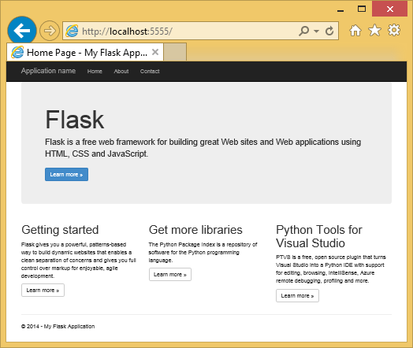
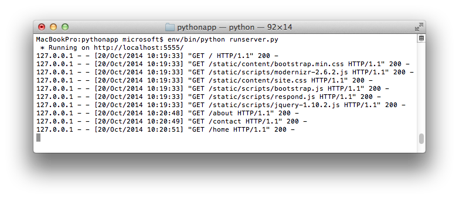

<properties 
    pageTitle="Criando aplicativos web com Flask no Azure" 
    description="Um tutorial que apresenta executando um aplicativo da web de Python no Azure." 
    services="app-service\web" 
    documentationCenter="python"
    tags="python"
    authors="huguesv" 
    manager="wpickett" 
    editor=""/>

<tags 
    ms.service="app-service-web" 
    ms.workload="web" 
    ms.tgt_pltfrm="na" 
    ms.devlang="python" 
    ms.topic="article" 
    ms.date="02/20/2016"
    ms.author="huvalo"/>

# Criando aplicativos web com Flask no Azure

Este tutorial descreve como começar a execução Python no [Azure aplicativo de serviço Web Apps](http://go.microsoft.com/fwlink/?LinkId=529714).  Web Apps fornece hospedagem gratuita limitado e implantação rápida, e você pode usar Python!  À medida que seu aplicativo cresce, você pode alternar para a hospedagem paga e você pode também integrar com todos os outros serviços do Azure.

Você irá criar um aplicativo usando o framework de web Flask (consulte versões alternativas deste tutorial para [Django](web-sites-python-create-deploy-django-app.md) e [garrafa](web-sites-python-create-deploy-bottle-app.md)).  Você irá criar o site da Galeria Azure, configure implantação gito e clonar repositório localmente.  Em seguida, você executar o aplicativo localmente, fazer alterações, confirmar e enviá-los para o Azure.  O tutorial mostra como fazer isso pelo Windows ou Mac/Linux.

[AZURE.INCLUDE [create-account-and-websites-note](../../includes/create-account-and-websites-note.md)]

>[AZURE.NOTE] Se você quiser começar a usar o serviço de aplicativo do Azure antes de se inscrever para uma conta do Azure, vá para [Experimentar o serviço de aplicativo](http://go.microsoft.com/fwlink/?LinkId=523751), onde você pode criar imediatamente um aplicativo da web de curta duração starter no aplicativo de serviço. Não há cartões de crédito obrigatório; Não há compromissos.

## Pré-requisitos

- Windows, Mac ou Linux
- Python 2.7 ou 3.4
- setuptools, pip, virtualenv (somente 2.7 Python)
- Gito
- [Ferramentas de Python para Visual Studio][] (PTVS) - Observação: isso é opcional

**Observação**: a publicação TFS não é suportada atualmente para projetos de Python.

### Windows

Se você ainda não tiver Python 2.7 ou 3,4 instalado (32 bits), é recomendável instalar o [SDK do Azure para Python 2.7] ou o [SDK do Azure para Python 3.4] usando Web Platform Installer.  Isso instala a versão de 32 bits do Python setuptools, pip, virtualenv, etc (32 bits Python é o que está instalado em máquinas host Azure).  Como alternativa, você pode acessar Python de [python.org].

Para gito, recomendamos [Gito para Windows] ou [GitHub para Windows].  Se você usar Visual Studio, você pode usar o suporte de gito integrado.

Também recomendamos instalar [Python 2.2 de ferramentas para Visual Studio].  Isso é opcional, mas se você tiver o [Visual Studio], incluindo o livre 2013 de comunidade Visual Studio ou Visual Studio Express 2013 para Web, em seguida, isso lhe dará um grande IDE Python.

### Mac/Linux

Você deve ter Python e gito já instalado, mas garantir Python 2.7 ou 3.4.

## Criar Web app no Portal do Azure

A primeira etapa na criação de seu aplicativo é criar o aplicativo web através do [Portal do Azure](https://portal.azure.com). 

1. Faça logon no Portal do Azure e clique no botão **novo** no canto inferior esquerdo. 
2. Clique em **Web + Mobile**.
3. Na caixa Pesquisar, digite "python".
4. Nos resultados da pesquisa, selecione **Flask**, clique em **criar**.
5. Configure o novo aplicativo de Flask, como criar um novo plano de serviço de aplicativo e um novo grupo de recursos para ele. Em seguida, clique em **criar**.
6. Configure a publicação de gito para o aplicativo web recém-criado, seguindo as instruções na [Implantação Local do gito ao serviço de aplicativo do Azure](app-service-deploy-local-git.md).

## Visão geral do aplicativo

### Conteúdo do repositório de gito

Aqui está uma visão geral dos arquivos que você encontrará no repositório gito inicial, que podemos será clonar na próxima seção.

    \FlaskWebProject\__init__.py
    \FlaskWebProject\views.py
    \FlaskWebProject\static\content\
    \FlaskWebProject\static\fonts\
    \FlaskWebProject\static\scripts\
    \FlaskWebProject\templates\about.html
    \FlaskWebProject\templates\contact.html
    \FlaskWebProject\templates\index.html
    \FlaskWebProject\templates\layout.html

Fontes principais para o aplicativo.  Consiste 3 páginas (índice, sobre, contato) com um layout mestre.  Scripts e conteúdo estático incluem inicialização, jquery, modernizr e responder.

    \runserver.py

Suporte do servidor de desenvolvimento local. Use este comando para executar o aplicativo localmente.

    \FlaskWebProject.pyproj
    \FlaskWebProject.sln

Arquivos de projeto para uso com [Ferramentas de Python para Visual Studio].

    \ptvs_virtualenv_proxy.py

Proxy do IIS para ambientes virtuais e PTVS suporte de depuração remota.

    \requirements.txt

Pacotes externos necessitados por este aplicativo. O script de implantação será pip instalar os pacotes listados neste arquivo.
 
    \web.2.7.config
    \web.3.4.config

Arquivos de configuração do IIS.  O script de implantação usará o web.x.y.config apropriado e copiá-lo como Web. config.

### Arquivos opcionais - implantação de personalização

[AZURE.INCLUDE [web-sites-python-customizing-deployment](../../includes/web-sites-python-customizing-deployment.md)]

### Arquivos opcionais - Python runtime

[AZURE.INCLUDE [web-sites-python-customizing-runtime](../../includes/web-sites-python-customizing-runtime.md)]

### Arquivos adicionais no servidor

Alguns arquivos existem no servidor, mas não são adicionados ao repositório gito.  Estes são criados pelo script de implantação.

    \web.config

Arquivo de configuração do IIS.  Criado a partir de web.x.y.config em cada implantação.

    \env\

Ambiente virtual Python.  Criada durante a implantação se um ambiente virtual compatível não existir no aplicativo.  Pacotes listados no requirements.txt são pip instalado, mas pip ignorará instalação se os pacotes já estiverem instalados.

As seções próximos 3 descrevem para prosseguir com o desenvolvimento de aplicativo da web em diferentes ambientes de 3:

- Windows, com ferramentas de Python para Visual Studio
- Windows, com linha de comando
- Mac/Linux, com linha de comando

## Ferramentas de - Windows - Python de desenvolvimento de aplicativo da Web para Visual Studio

### Clonar repositório

Primeiro, clone repositório usando a URL fornecida no Portal do Azure. Para obter mais informações, consulte [Implantação Local do gito ao serviço de aplicativo do Azure](app-service-deploy-local-git.md).

Abra o arquivo de solução (. sln) que está incluído na raiz do repositório.

### Criar ambiente virtual

Agora vamos criar um ambiente virtual para desenvolvimento local.  Clique com botão direito em **Ambientes de Python** selecione **Adicionar ambiente Virtual...**.

- Verifique se o nome do ambiente é `env`.

- Selecione o intérprete base.  Certifique-se de usar a mesma versão do Python que está selecionado para o aplicativo da web (em runtime.txt ou a lâmina de **Configurações do aplicativo** de seu aplicativo web no Portal do Azure).

- Verifique se a opção para baixar e instalar pacotes está marcada.

Clique em **criar**.  Isso criará o ambiente virtual e instalar dependências listadas no requirements.txt.

### Executar usando o servidor de desenvolvimento

Pressione F5 para iniciar a depuração e seu navegador da web abrirá automaticamente para a página executando localmente.

Você pode definir pontos de interrupção em fontes de dados, use o windows de inspeção, etc.  Consulte as [Ferramentas de Python para documentação do Visual Studio] para obter mais informações sobre os vários recursos.

### Fazer alterações

Agora você pode experimentar fazendo alterações a fontes de aplicativo e/ou modelos.

Depois que você testou as alterações, confirmá-las ao repositório gito:

### Instalar pacotes mais

Seu aplicativo pode ter dependências além Python e Flask.

Você pode instalar pacotes adicionais usando pip.  Para instalar um pacote, clique com botão direito no ambiente virtual e selecione **Instalar pacote de Python**.

Por exemplo, para instalar o SDK do Azure para Python, que fornece acesso a armazenamento do Azure, barramento de serviço e outros serviços do Azure, digite `azure`:

Clique com botão direito no ambiente virtual e selecione **Gerar requirements.txt** atualizar requirements.txt.

Em seguida, confirme as alterações requirements.txt ao repositório gito.

### Implantar para o Azure

Para disparar uma implantação, clique em **sincronizar** ou **Push**.  Sincronização faz uma recepção e um envio.

A primeira implantação levará algum tempo, pois isso criará um ambiente virtual, pacotes de instalação, etc.

O Visual Studio não mostra o progresso da implantação.  Se você quiser revisar a saída, consulte a seção sobre [solução de problemas - implantação](#troubleshooting-deployment).

Navegue até a URL do Azure para ver as alterações.

## Linha de comando de desenvolvimento - Windows - Web app

### Clonar repositório

Primeiro, clonar repositório usando a URL fornecida no Portal do Azure e adicione o repositório Azure como um controle remoto. Para obter mais informações, consulte [Implantação Local do gito ao serviço de aplicativo do Azure](app-service-deploy-local-git.md).

    git clone <repo-url>
    cd <repo-folder>
    git remote add azure <repo-url> 

### Criar ambiente virtual

Vamos criar um novo ambiente virtual para fins de desenvolvimento (não adicioná-lo ao repositório).  Ambientes virtuais em Python não são relocáveis, para que todos os desenvolvedores trabalhar no aplicativo irá criar seus próprios localmente.

Certifique-se de usar a mesma versão do Python que está selecionado para o aplicativo da web (em runtime.txt ou a lâmina de **Configurações do aplicativo** de seu aplicativo web no Portal do Azure).

Para Python 2.7:

    c:\python27\python.exe -m virtualenv env

Para Python 3.4:

    c:\python34\python.exe -m venv env

Instale quaisquer pacotes externas exigidas pelo seu aplicativo. Você pode usar o arquivo de requirements.txt na raiz do repositório para instalar os pacotes de seu ambiente virtual:

    env\scripts\pip install -r requirements.txt

### Executar usando o servidor de desenvolvimento

Você pode iniciar o aplicativo em um servidor de desenvolvimento com o seguinte comando:

    env\scripts\python runserver.py

O console exibirá a URL e porta do servidor ouve:

Em seguida, abra o navegador da web para essa URL.

### Fazer alterações

Agora você pode experimentar fazendo alterações a fontes de aplicativo e/ou modelos.

Depois que você testou as alterações, confirmá-las ao repositório gito:

    git add <modified-file>
    git commit -m "<commit-comment>"

### Instalar pacotes mais

Seu aplicativo pode ter dependências além Python e Flask.

Você pode instalar pacotes adicionais usando pip.  Por exemplo, para instalar o SDK do Azure para Python, que fornece acesso a armazenamento do Azure, barramento de serviço e outros serviços do Azure, digite:

    env\scripts\pip install azure

Certifique-se de atualizar requirements.txt:

    env\scripts\pip freeze > requirements.txt

Confirme as alterações:

    git add requirements.txt
    git commit -m "Added azure package"

### Implantar para o Azure

Para disparar uma implantação, notificações por push as alterações no Azure:

    git push azure master

Você verá a saída do script de implantação, incluindo a criação de ambiente virtual, instalação de pacotes, criação de Web. config.

Navegue até a URL do Azure para ver as alterações.

## Linha de comando de desenvolvimento - Mac/Linux – de aplicativo Web

### Clonar repositório

Primeiro, clonar repositório usando a URL fornecida no Portal do Azure e adicione o repositório Azure como um controle remoto. Para obter mais informações, consulte [Implantação Local do gito ao serviço de aplicativo do Azure](app-service-deploy-local-git.md).

    git clone <repo-url>
    cd <repo-folder>
    git remote add azure <repo-url> 

### Criar ambiente virtual

Vamos criar um novo ambiente virtual para fins de desenvolvimento (não adicioná-lo ao repositório).  Ambientes virtuais em Python não são relocáveis, para que todos os desenvolvedores trabalhar no aplicativo irá criar seus próprios localmente.

Certifique-se de usar a mesma versão do Python que está selecionado para o aplicativo da web (em runtime.txt ou a lâmina de **Configurações do aplicativo** de seu aplicativo web no Portal do Azure).

Para Python 2.7:

    python -m virtualenv env

Para Python 3.4:

    python -m venv env
ou pyvenv env

Instale quaisquer pacotes externas exigidas pelo seu aplicativo. Você pode usar o arquivo de requirements.txt na raiz do repositório para instalar os pacotes de seu ambiente virtual:

    env/bin/pip install -r requirements.txt

### Executar usando o servidor de desenvolvimento

Você pode iniciar o aplicativo em um servidor de desenvolvimento com o seguinte comando:

    env/bin/python runserver.py

O console exibirá a URL e porta do servidor ouve:

Em seguida, abra o navegador da web para essa URL.

### Fazer alterações

Agora você pode experimentar fazendo alterações a fontes de aplicativo e/ou modelos.

Depois que você testou as alterações, confirmá-las ao repositório gito:

    git add <modified-file>
    git commit -m "<commit-comment>"

### Instalar pacotes mais

Seu aplicativo pode ter dependências além Python e Flask.

Você pode instalar pacotes adicionais usando pip.  Por exemplo, para instalar o SDK do Azure para Python, que fornece acesso a armazenamento do Azure, barramento de serviço e outros serviços do Azure, digite:

    env/bin/pip install azure

Certifique-se de atualizar requirements.txt:

    env/bin/pip freeze > requirements.txt

Confirme as alterações:

    git add requirements.txt
    git commit -m "Added azure package"

### Implantar para o Azure

Para disparar uma implantação, notificações por push as alterações no Azure:

    git push azure master

Você verá a saída do script de implantação, incluindo a criação de ambiente virtual, instalação de pacotes, criação de Web. config.

Navegue até a URL do Azure para ver as alterações.

## Solução de problemas - instalação do pacote

[AZURE.INCLUDE [web-sites-python-troubleshooting-package-installation](../../includes/web-sites-python-troubleshooting-package-installation.md)]

## Solução de problemas - ambiente Virtual

[AZURE.INCLUDE [web-sites-python-troubleshooting-virtual-environment](../../includes/web-sites-python-troubleshooting-virtual-environment.md)]

## Próximas etapas

Siga estes links para saber mais sobre as ferramentas de Python e Flask para Visual Studio: 
 
- [Documentação de flask]
- [Ferramentas de Python para documentação do Visual Studio]

Para obter informações sobre como usar o armazenamento de tabela do Azure e MongoDB:

- [Flask e MongoDB no Azure com ferramentas de Python para Visual Studio]
- [Flask e armazenamento de tabela do Microsoft Azure no Azure com ferramentas de Python para Visual Studio]

Para obter mais informações, consulte também o [Python Developer Center](/develop/python/).

## O que mudou
* Para um guia para a alteração de sites para o serviço de aplicativo consulte: [o serviço de aplicativo do Azure e seu impacto sobre serviços existentes do Azure](http://go.microsoft.com/fwlink/?LinkId=529714)

<!--Link references-->
[Flask e MongoDB no Azure com ferramentas de Python para Visual Studio]: https://github.com/microsoft/ptvs/wiki/Flask-and-MongoDB-on-Azure
[Flask e armazenamento de tabela do Microsoft Azure no Azure com ferramentas de Python para Visual Studio]: web-sites-python-ptvs-flask-table-storage.md

<!--External Link references-->
[Azure SDK para Python 2.7]: http://go.microsoft.com/fwlink/?linkid=254281
[Azure SDK para Python 3.4]: http://go.microsoft.com/fwlink/?linkid=516990
[Python.org]: http://www.python.org/
[Gito para Windows]: http://msysgit.github.io/
[GitHub para Windows]: https://windows.github.com/
[Ferramentas de Python para Visual Studio]: http://aka.ms/ptvs
[Python ferramentas 2.2 para Visual Studio]: http://go.microsoft.com/fwlink/?LinkID=624025
[O Visual Studio]: http://www.visualstudio.com/
[Ferramentas de Python para documentação do Visual Studio]: http://aka.ms/ptvsdocs
[Documentação de flask]: http://flask.pocoo.org/ 
 
