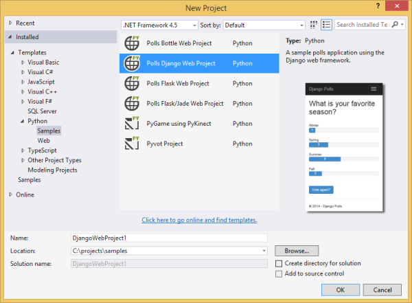
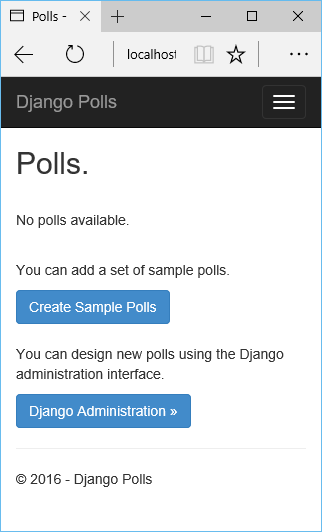
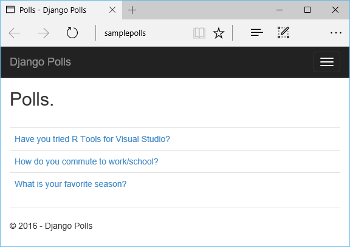

<properties 
    pageTitle="Django e MySQL no Azure com ferramentas de Python 2.2 para Visual Studio" 
    description="Saiba como usar as ferramentas de Python para Visual Studio para criar um aplicativo web Django que armazena dados em uma instância de banco de dados MySQL e implantá-lo para aplicativos do Azure aplicativo de serviço Web." 
    services="app-service\web" 
    documentationCenter="python" 
    authors="huguesv" 
    manager="wpickett" 
    editor=""/>

<tags 
    ms.service="app-service-web" 
    ms.workload="web" 
    ms.tgt_pltfrm="na" 
    ms.devlang="python"
    ms.topic="get-started-article" 
    ms.date="07/07/2016"
    ms.author="huvalo"/>

# Django e MySQL no Azure com ferramentas de Python 2.2 para Visual Studio 

[AZURE.INCLUDE [tabs](../../includes/app-service-web-get-started-nav-tabs.md)]

Neste tutorial, você usará [Ferramentas de Python para Visual Studio] (PTVS) para criar um aplicativo da web de votações simples usando um dos modelos de exemplo PTVS. Você vai aprender como usar um serviço de MySQL hospedado no Azure, como configurar o aplicativo web para usar MySQL e como publicar o aplicativo web aos [Aplicativos do Azure aplicativo de serviço Web](http://go.microsoft.com/fwlink/?LinkId=529714).

> [AZURE.NOTE] As informações contidas neste tutorial também estão disponíveis no vídeo a seguir:
> 
> [PTVS 2.1: Aplicativo de Django com MySQL][video]

Consulte o [Python Developer Center] para ver mais artigos que abordam desenvolvimento do Azure aplicativo de serviço Web Apps com PTVS usando estruturas de web garrafa, Flask e Django, com os serviços de armazenamento de tabela do Azure, MySQL e banco de dados SQL. Embora este artigo se concentra no aplicativo de serviço, as etapas são semelhantes ao desenvolver [Serviços de nuvem do Azure].

## Pré-requisitos

 - Visual Studio de 2015
 - [Python 2.7 32 bits] ou [Python 3.4 32 bits]
 - [Python ferramentas 2.2 para Visual Studio]
 - [Ferramentas de Python 2.2 para exemplos do Visual Studio VSIX]
 - [Ferramentas SDK Azure de VS de 2015]
 - Django 1,9 ou posterior

[AZURE.INCLUDE [create-account-and-websites-note](../../includes/create-account-and-websites-note.md)]

<!-- This note should not render as part of the the previous include. -->

> [AZURE.NOTE] Se você quiser começar a usar o serviço de aplicativo do Azure antes de se inscrever para uma conta do Azure, vá para [Experimentar o serviço de aplicativo](http://go.microsoft.com/fwlink/?LinkId=523751), onde você pode criar imediatamente um aplicativo da web de curta duração starter no aplicativo de serviço. Nenhum cartão de crédito é necessário, e nenhum compromissos são necessários.

## Criar o projeto

Nesta seção, você vai criar um projeto do Visual Studio usando um modelo de exemplo. Você vai criar um ambiente virtual e instalar pacotes necessários. Você criará um banco de dados local usando sqlite. Em seguida, você executará o aplicativo localmente.

1. No Visual Studio, selecione o **arquivo**, **Novo projeto**.

1. Os modelos de projeto a partir de [Python 2.2 de ferramentas para VSIX de amostras do Visual Studio] estão disponíveis em **Python**, **amostras**. Selecione o **Projeto de Web Django sondagens** e clique Okey para criar o projeto.

    

1. Você será solicitado a instalar pacotes externos. Selecione **instalar em um ambiente virtual**.

    

1. Selecione **Python 2.7** ou **Python 3.4** como o intérprete de base.

    

1. No **Solution Explorer**, clique com botão direito no nó do projeto e selecione **Python**e selecione **Django migrar**.  Selecione **Django criar superusuário**.

1. Será aberto um Console de gerenciamento de Django e criar um banco de dados sqlite na pasta do projeto. Siga os prompts para criar um usuário.

1. Confirme se o aplicativo funciona pressionando `F5`.

1. Na barra de navegação na parte superior, clique em **login** .

    

1. Digite as credenciais do usuário que criou quando você sincronizou o banco de dados.

    

1. Clique em **criar votações de amostra**.

    

1. Clique em uma votação e votar.

    

## Criar um banco de dados MySQL

Para o banco de dados, você vai criar um banco de dados ClearDB MySQL hospedado no Azure.

Como alternativa, você pode criar sua própria máquina Virtual em execução no Azure, e em seguida, instalar e administrar MySQL por conta própria.

Você pode criar um banco de dados com um plano de livre seguindo estas etapas.

1. Faça logon [Portal do Azure].

1. Na parte superior do painel de navegação, clique em **novo**, e em seguida, clique em **dados + armazenamento**e clique em **Banco de dados MySQL**. 

1. Configurar o novo banco de dados MySQL, criando um novo grupo de recursos e selecione o local apropriado para ele.

1. Depois de criado o banco de dados MySQL, clique em **Propriedades** na lâmina banco de dados.

1. Use o botão Copiar para colocar o valor de **Cadeia de conexão** na área de transferência.

## Configurar o projeto

Nesta seção, você irá configurar o nosso aplicativo web para usar o banco de dados MySQL que você acabou de criar. Você também deverá instalar pacotes Python adicionais necessários para usar bancos de dados MySQL com Django. Em seguida, você executará o aplicativo web localmente.

1. No Visual Studio, abra **settings.py**, da pasta *NomeDoProjeto* . Cole temporariamente a cadeia de conexão no editor. A cadeia de conexão é neste formato:

        Database=<NAME>;Data Source=<HOST>;User Id=<USER>;Password=<PASSWORD>

    Altere o banco de dados padrão **mecanismo** usar MySQL e defina os valores para **nome**, **usuário**, **senha** e **HOST** de **CONNECTIONSTRING**.

        DATABASES = {
            'default': {
                'ENGINE': 'django.db.backends.mysql',
                'NAME': '<Database>',
                'USER': '<User Id>',
                'PASSWORD': '<Password>',
                'HOST': '<Data Source>',
                'PORT': '',
            }
        }

1. No Solution Explorer, em **Ambientes de Python**, clique com botão direito no ambiente virtual e selecione **Instalar pacote de Python**.

1. Instale o pacote `mysqlclient` usando **pip**.

    

1. No **Solution Explorer**, clique com botão direito no nó do projeto e selecione **Python**e selecione **Django migrar**.  Selecione **Django criar superusuário**.

    Isso criará as tabelas do banco de dados MySQL que você criou na seção anterior. Siga os prompts para criar um usuário, que não precisa coincidir com o usuário do banco de dados sqlite criado na primeira seção deste artigo.

1. Executar o aplicativo com `F5`. Votações criados com **Criar votações de amostra** e os dados enviados por votação serão serializadas no banco de dados MySQL.

## Publicar o aplicativo web serviço de aplicativo do Azure

O SDK do .NET Azure fornece uma maneira fácil de implantar o aplicativo web do serviço de aplicativo do Azure.

1. No **Solution Explorer**, clique com botão direito no nó do projeto e selecione **Publicar**.

    

1. Clique em **Serviço de aplicativo do Microsoft Azure**.

1. Clique em **novo** para criar um novo aplicativo web.

1. Preencha os campos a seguir e clique em **criar**:
    - **Nome do aplicativo Web**
    - **Plano de serviço de aplicativo**
    - **Grupo de recursos**
    - **Região**
    - Deixe o **servidor de banco de dados** definida como **Nenhum banco de dados**

1. Aceite todas as outros padrões e clique em **Publicar**.

1. Seu navegador da web abrirá automaticamente para o aplicativo web publicado. Você deve ver o aplicativo web funcionando conforme esperado, usando o banco de dados **MySQL** hospedado no Azure.

    

    Parabéns! Você publicou com êxito seu aplicativo web baseado em MySQL no Azure.

## Próximas etapas

Siga estes links para saber mais sobre as ferramentas de Python para Visual Studio, Django e MySQL.

- [Ferramentas de Python para documentação do Visual Studio]
  - [Projetos da Web]
  - [Projetos de serviço de nuvem]
  - [Depuração remota no Microsoft Azure]
- [Documentação de Django]
- [MySQL]

Para obter mais informações, consulte o [Python Developer Center](/develop/python/).

<!--Link references-->

[Central de desenvolvedores do Python]: /develop/python/
[Serviços de nuvem Azure]: ../cloud-services-python-ptvs.md

<!--External Link references-->

[Portal do Azure]: https://portal.azure.com
[Ferramentas de Python para Visual Studio]: http://aka.ms/ptvs
[Python ferramentas 2.2 para Visual Studio]: http://go.microsoft.com/fwlink/?LinkID=624025
[Ferramentas de Python 2.2 para exemplos do Visual Studio VSIX]: http://go.microsoft.com/fwlink/?LinkID=624025
[Ferramentas SDK Azure de VS de 2015]: http://go.microsoft.com/fwlink/?LinkId=518003
[Python 2.7 32 bits]: http://go.microsoft.com/fwlink/?LinkId=517190 
[Python 3.4 32 bits]: http://go.microsoft.com/fwlink/?LinkId=517191
[Ferramentas de Python para documentação do Visual Studio]: http://aka.ms/ptvsdocs
[Depuração remota no Microsoft Azure]: http://go.microsoft.com/fwlink/?LinkId=624026
[Projetos da Web]: http://go.microsoft.com/fwlink/?LinkId=624027
[Projetos de serviço de nuvem]: http://go.microsoft.com/fwlink/?LinkId=624028
[Documentação de Django]: https://www.djangoproject.com/
[MySQL]: http://www.mysql.com/
[video]: http://youtu.be/oKCApIrS0Lo
