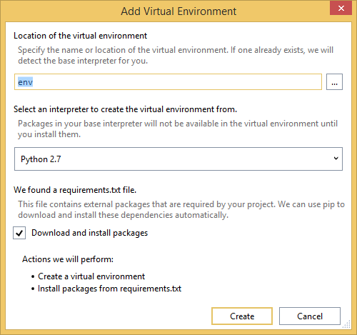
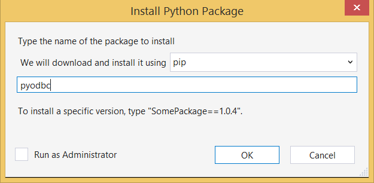

<properties 
    pageTitle="Django e banco de dados do SQL no Azure com ferramentas de Python 2.2 para Visual Studio" 
    description="Saiba como usar as ferramentas de Python para Visual Studio para criar um aplicativo web Django que armazena dados em uma instância de banco de dados do SQL e implantá-lo para aplicativos do Azure aplicativo de serviço Web." 
    services="app-service\web" 
    tags="python"
    documentationCenter="python" 
    authors="huguesv" 
    manager="wpickett" 
    editor=""/>

<tags 
    ms.service="app-service-web" 
    ms.workload="web" 
    ms.tgt_pltfrm="na" 
    ms.devlang="python" 
    ms.topic="article" 
    ms.date="07/07/2016"
    ms.author="huguesv"/>

# Django e banco de dados do SQL no Azure com ferramentas de Python 2.2 para Visual Studio 

Neste tutorial, usaremos [Python ferramentas para Visual Studio] para criar um aplicativo da web de votações simples usando um dos modelos de exemplo PTVS. Este tutorial também está disponível como um [vídeo](https://www.youtube.com/watch?v=ZwcoGcIeHF4).

Podemos vai aprender como usar um banco de dados do SQL hospedado no Azure, como configurar o aplicativo web para usar um banco de dados do SQL e como publicar o aplicativo web aos [Aplicativos do Azure aplicativo de serviço Web](http://go.microsoft.com/fwlink/?LinkId=529714).

Consulte o [Python Developer Center] para ver mais artigos que abordam desenvolvimento do Azure aplicativo de serviço Web Apps com PTVS usando estruturas de web garrafa, Flask e Django, com os serviços de armazenamento de tabela do Azure, MySQL e banco de dados SQL. Embora este artigo se concentra no aplicativo de serviço, as etapas são semelhantes ao desenvolver [Serviços de nuvem do Azure].

## Pré-requisitos

 - Visual Studio de 2015
 - [Python 2.7 32 bits]
 - [Python ferramentas 2.2 para Visual Studio]
 - [Ferramentas de Python 2.2 para exemplos do Visual Studio VSIX]
 - [Ferramentas SDK Azure de VS de 2015]
 - Django 1,9 ou posterior

[AZURE.INCLUDE [create-account-and-websites-note](../../includes/create-account-and-websites-note.md)]

>[AZURE.NOTE] Se você quiser começar a usar o serviço de aplicativo do Azure antes de se inscrever para uma conta do Azure, vá para [Experimentar o serviço de aplicativo](http://go.microsoft.com/fwlink/?LinkId=523751), onde você pode criar imediatamente um aplicativo da web de curta duração starter no aplicativo de serviço. Não há cartões de crédito obrigatório; Não há compromissos.

## Criar o projeto

Nesta seção, vamos criar um projeto do Visual Studio usando um modelo de exemplo. Vamos criar um ambiente virtual e instalar pacotes necessários. Vamos criar um banco de dados local usando sqlite. Em seguida, vamos executar o aplicativo web localmente.

1.  No Visual Studio, selecione o **arquivo**, **Novo projeto**.

1.  Os modelos de projeto a partir de [Python 2.2 de ferramentas para VSIX de amostras do Visual Studio] estão disponíveis em **Python**, **amostras**. Selecione o **Projeto de Web Django sondagens** e clique Okey para criar o projeto.

    

1.  Você será solicitado a instalar pacotes externos. Selecione **instalar em um ambiente virtual**.

    

1.  Selecione **Python 2.7** como o intérprete de base.

    

1.  No **Solution Explorer**, clique com botão direito no nó do projeto e selecione **Python**e selecione **Django migrar**.  Selecione **Django criar superusuário**.

1.  Será aberto um Console de gerenciamento de Django e criar um banco de dados sqlite na pasta do projeto. Siga os prompts para criar um usuário.

1.  Confirme se o aplicativo funciona, pressionando <kbd>F5</kbd>.

1.  Na barra de navegação na parte superior, clique em **login** .

    

1.  Digite as credenciais do usuário que criou quando você sincronizou o banco de dados.

    

1.  Clique em **criar votações de amostra**.

    

1.  Clique em uma votação e votar.

    

## Criar um banco de dados do SQL

Para o banco de dados, vamos criar um banco de dados do SQL Azure.

Você pode criar um banco de dados seguindo estas etapas.

1.  Log no [Portal do Azure].

1.  Na parte inferior do painel de navegação, clique em **novo**. , clique em **dados + armazenamento** > **Banco de dados SQL**.

1.  Configurar o novo banco de dados do SQL, criando um novo grupo de recursos e selecione o local apropriado para ele.

1.  Depois de criado o banco de dados do SQL, clique em **Abrir no Visual Studio** na lâmina banco de dados.
2.  Clique em **configurar seu firewall**.
3.  Na lâmina **As configurações de Firewall** , adicione que uma regra de firewall com **IP inicial** e **Final IP** definido como o endereço IP público de sua máquina de desenvolvimento. Clique em **Salvar**.

    Isso permitirá conexões ao servidor de banco de dados do seu computador de desenvolvimento.

4.  De volta à lâmina de banco de dados, clique em **Propriedades**, clique em **Mostrar cadeias de caracteres de conexão de banco de dados**. 

2.  Use o botão Copiar para colocar o valor do **ADO.NET** na área de transferência.

## Configurar o projeto

Nesta seção, podemos vai configurar o nosso aplicativo web para usar o banco de dados do SQL que acabou de criar. Nós também será instalar pacotes Python adicionais necessários para usar bancos de dados SQL com Django. Em seguida, vamos executar o aplicativo web localmente.

1.  No Visual Studio, abra **settings.py**, da pasta *NomeDoProjeto* . Cole temporariamente a cadeia de conexão no editor. A cadeia de conexão é neste formato:

        Server=<ServerName>,<ServerPort>;Database=<DatabaseName>;User ID=<UserName>;Password={your_password_here};Encrypt=True;TrustServerCertificate=False;Connection Timeout=30;

Editar a definição de `DATABASES` para usar os valores acima.

        DATABASES = {
            'default': {
                'ENGINE': 'sql_server.pyodbc',
                'NAME': '<DatabaseName>',
                'USER': '<UserName>',
                'PASSWORD': '{your_password_here}',
                'HOST': '<ServerName>',
                'PORT': '<ServerPort>',
                'OPTIONS': {
                    'driver': 'SQL Server Native Client 11.0',
                    'MARS_Connection': 'True',
                }
            }
        }

1.  No Solution Explorer, em **Ambientes de Python**, clique com botão direito no ambiente virtual e selecione **Instalar pacote de Python**.

1.  Instale o pacote `pyodbc` usando **pip**.

    

1.  Instale o pacote `django-pyodbc-azure` usando **pip**.

    

1.  No **Solution Explorer**, clique com botão direito no nó do projeto e selecione **Python**e selecione **Django migrar**.  Selecione **Django criar superusuário**.

    Isso criará as tabelas de banco de dados SQL que criamos na seção anterior. Siga os prompts para criar um usuário, que não precisa coincidir com o usuário do banco de dados sqlite criado na primeira seção.

1.  Executar o aplicativo com `F5`. Votações criados com **Criar votações de amostra** e os dados enviados por votação serão serializadas no banco de dados SQL.

## Publicar o aplicativo web serviço de aplicativo do Azure

O SDK do .NET Azure fornece uma maneira fácil de implantar o aplicativo web do web aos aplicativos do Azure aplicativo de serviço Web.

1.  No **Solution Explorer**, clique com botão direito no nó do projeto e selecione **Publicar**.

    

1.  Clique em **aplicativos Web do Microsoft Azure**.

1.  Clique em **novo** para criar um novo aplicativo web.

1.  Preencha os campos a seguir e clique em **criar**.
    -   **Nome do aplicativo Web**
    -   **Plano de serviço de aplicativo**
    -   **Grupo de recursos**
    -   **Região**
    -   Deixe o **servidor de banco de dados** definida como **Nenhum banco de dados**

1.  Aceite todas as outros padrões e clique em **Publicar**.

1.  Seu navegador da web abrirá automaticamente para o aplicativo web publicado. Você deve ver o web app está funcionando como esperado, usando o banco de dados do **SQL** hospedado no Azure.

    Parabéns!

    

## Próximas etapas

Siga estes links para saber mais sobre as ferramentas de Python para Visual Studio, Django e banco de dados SQL.

- [Ferramentas de Python para documentação do Visual Studio]
  - [Projetos da Web]
  - [Projetos de serviço de nuvem]
  - [Depuração remota no Microsoft Azure]
- [Documentação de Django]
- [Banco de dados SQL]

## O que mudou
* Para um guia para a alteração de sites para o serviço de aplicativo consulte: [o serviço de aplicativo do Azure e seu impacto sobre serviços existentes do Azure](http://go.microsoft.com/fwlink/?LinkId=529714)

<!--Link references-->
[Central de desenvolvedores do Python]: /develop/python/
[Serviços de nuvem Azure]: ../cloud-services-python-ptvs.md

<!--External Link references-->
[Portal do Azure]: https://portal.azure.com
[Ferramentas de Python para Visual Studio]: http://aka.ms/ptvs
[Python ferramentas 2.2 para Visual Studio]: http://go.microsoft.com/fwlink/?LinkID=624025
[Ferramentas de Python 2.2 para exemplos do Visual Studio VSIX]: http://go.microsoft.com/fwlink/?LinkID=624025
[Ferramentas SDK Azure de VS de 2015]: http://go.microsoft.com/fwlink/?LinkId=518003
[Python 2.7 32 bits]: http://go.microsoft.com/fwlink/?LinkId=517190 
[Ferramentas de Python para documentação do Visual Studio]: http://aka.ms/ptvsdocs
[Depuração remota no Microsoft Azure]: http://go.microsoft.com/fwlink/?LinkId=624026
[Projetos da Web]: http://go.microsoft.com/fwlink/?LinkId=624027
[Projetos de serviço de nuvem]: http://go.microsoft.com/fwlink/?LinkId=624028
[Documentação de Django]: https://www.djangoproject.com/
[Banco de dados SQL]: /documentation/services/sql-database/
