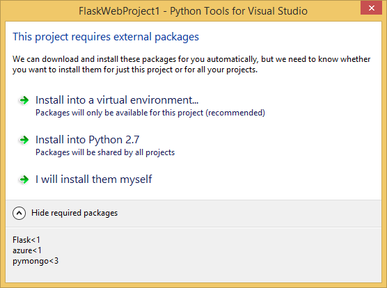
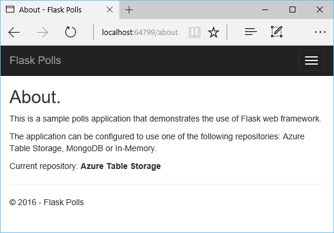

<properties 
    pageTitle="Flask e armazenamento de tabela do Microsoft Azure no Azure com ferramentas de Python 2.2 para Visual Studio" 
    description="Saiba como usar as ferramentas de Python para Visual Studio para criar um aplicativo web Flask que armazena dados em armazenamento de tabela do Azure e implantá-lo para aplicativos do Azure aplicativo de serviço Web." 
    services="app-service\web"
    tags="python"
    documentationCenter="python" 
    authors="huguesv" 
    manager="wpickett" 
    editor=""/>

<tags 
    ms.service="app-service-web" 
    ms.workload="web" 
    ms.tgt_pltfrm="na" 
    ms.devlang="python" 
    ms.topic="article" 
    ms.date="07/07/2016"
    ms.author="huvalo"/>

# Flask e armazenamento de tabela do Microsoft Azure no Azure com ferramentas de Python 2.2 para Visual Studio 

Neste tutorial, usaremos [Python ferramentas para Visual Studio] para criar um aplicativo da web de votações simples usando um dos modelos de exemplo PTVS. Este tutorial também está disponível como um [vídeo](https://www.youtube.com/watch?v=qUtZWtPwbTk).

O aplicativo da web de votações define uma abstração para seu repositório, assim você pode alternar facilmente entre diferentes tipos de repositórios (na memória, armazenamento de tabela do Azure, MongoDB).

Podemos vai aprender como criar uma conta de armazenamento do Azure, como configurar o aplicativo web para usar o armazenamento de tabela do Azure e como publicar o aplicativo web aos [Aplicativos do Azure aplicativo de serviço Web](http://go.microsoft.com/fwlink/?LinkId=529714).

Consulte o [Python Developer Center] para ver mais artigos que abordam desenvolvimento do Azure aplicativo de serviço Web Apps com PTVS usando estruturas de web garrafa, Flask e Django, com os serviços do MongoDB, o armazenamento de tabela do Azure, MySQL e banco de dados SQL. Embora este artigo se concentra no aplicativo de serviço, as etapas são semelhantes ao desenvolver [Serviços de nuvem do Azure].

## Pré-requisitos

 - Visual Studio de 2015
 - [Python ferramentas 2.2 para Visual Studio]
 - [Ferramentas de Python 2.2 para exemplos do Visual Studio VSIX]
 - [Ferramentas SDK Azure de VS de 2015]
 - [Python 2.7 32 bits] ou [Python 3.4 32 bits]

[AZURE.INCLUDE [create-account-and-websites-note](../../includes/create-account-and-websites-note.md)]

>[AZURE.NOTE] Se você quiser começar a usar o serviço de aplicativo do Azure antes de se inscrever para uma conta do Azure, vá para [Experimentar o serviço de aplicativo](http://go.microsoft.com/fwlink/?LinkId=523751), onde você pode criar imediatamente um aplicativo da web de curta duração starter no aplicativo de serviço. Não há cartões de crédito obrigatório; Não há compromissos.

## Criar o projeto

Nesta seção, vamos criar um projeto do Visual Studio usando um modelo de exemplo. Vamos criar um ambiente virtual e instalar pacotes necessários. Em seguida, vamos executar o aplicativo localmente usando o repositório de na memória padrão.

1.  No Visual Studio, selecione o **arquivo**, **Novo projeto**.

1.  Os modelos de projeto a partir de [Python 2.2 de ferramentas para VSIX de amostras do Visual Studio] estão disponíveis em **Python**, **amostras**. Selecione o **Projeto de Web Flask sondagens** e clique Okey para criar o projeto.

    

1.  Você será solicitado a instalar pacotes externos. Selecione **instalar em um ambiente virtual**.

    

1.  Selecione **Python 2.7** ou **Python 3.4** como o intérprete de base.

    

1.  Confirme se o aplicativo funciona pressionando `F5`. Por padrão, o aplicativo usa um repositório de memória que não exige qualquer configuração. Todos os dados são perdidos quando o servidor web é interrompido.

1.  Clique em **Criar votações de amostra**, clique em uma votação e votação.

    

## Criar uma conta de armazenamento do Azure

Para usar as operações de armazenamento, você precisa de uma conta de armazenamento do Azure. Você pode criar uma conta de armazenamento seguindo estas etapas.

1.  Log no [Portal do Azure](https://portal.azure.com/).

2. Clique no ícone de **novo** na parte superior esquerdo do Portal, clique em **dados + armazenamento** > **Conta de armazenamento**. Clique em **criar**, e em seguida, dê um nome exclusivo para a conta de armazenamento e criar um novo [grupo de recursos](../azure-resource-manager/resource-group-overview.md) para ela.

    

    Quando a conta de armazenamento tiver sido criada, o botão de **notificações** pisca verde **sucesso** e blade da conta armazenamento é aberto para mostrar que ele pertence para o novo grupo de recursos que você criou.

5. Clique na parte de **Teclas de acesso** em lâmina da conta de armazenamento. Anote o nome da conta e o CHAVE1.

    

    Podemos precisará dessas informações para configurar seu projeto na próxima seção.

## Configurar o projeto

Nesta seção, podemos vai configurar o nosso aplicativo para usar a conta de armazenamento que acabou de criar. Veremos como obter configurações de conexão do Portal do Azure. Em seguida, vamos executar o aplicativo localmente.

1.  No Visual Studio, clique com botão direito no nó do seu projeto no Solution Explorer e selecione **Propriedades**. Clique na guia **Depurar** .

    

1.  Defina os valores de variáveis de ambiente exigidas pelo aplicativo no **Comando de servidor depurar**, **ambiente**.

        REPOSITORY_NAME=azuretablestorage
        STORAGE_NAME=<storage account name>
        STORAGE_KEY=<primary access key>

    Isso definirá as variáveis de ambiente quando você **Iniciar depuração**. Se quiser que as variáveis de configuração quando você **Iniciar sem depurar**, definir os mesmos valores também em **Executar o comando de servidor** .

    Como alternativa, você pode definir variáveis de ambiente usando o painel de controle do Windows. Esta é a melhor opção se você quiser Evite armazenar credenciais no código-fonte / arquivo de projeto. Observe que você precisará reiniciar o Visual Studio para os novos valores de ambiente deverá estar disponíveis para o aplicativo.

1.  O código que implementa o repositório de armazenamento de tabela do Azure está em **models/azuretablestorage.py**. Consulte a [documentação] para obter mais informações sobre como usar o serviço de tabela do Python.

1.  Executar o aplicativo com `F5`. Votações criados com **Criar votações de amostra** e os dados enviados por votação serão serializadas em armazenamento de tabela do Azure.

    > [AZURE.NOTE] Ambiente Python 2.7 Virtual pode causar uma quebra de exceção no Visual Studio.  Pressione `F5` para continuar carregando o projeto da web.

1.  Navegue até a página **sobre** para verificar se o aplicativo está usando o repositório de **Armazenamento de tabela do Azure** .

    

## Explorar o armazenamento de tabela do Microsoft Azure

É fácil exibir e editar tabelas de armazenamento usando o Gerenciador de nuvem no Visual Studio. Nesta seção, usaremos Server Explorer para exibir o conteúdo das tabelas votações aplicativo.

> [AZURE.NOTE] Isso requer o Microsoft Azure ferramentas a ser instalado, disponíveis como parte do [SDK do Azure para .NET].

1.  Abra o **Explorador de nuvem**. Expanda **Contas de armazenamento**, sua conta de armazenamento, em seguida, **tabelas**.

    

1.  Clique duas vezes na tabela **votações** ou **Opções** para exibir o conteúdo da tabela em uma janela de documento, bem como adicionar/remover/editar entidades.

    

## Publicar o aplicativo web serviço de aplicativo do Azure

O SDK do .NET Azure fornece uma maneira fácil de implantar o aplicativo web do serviço de aplicativo do Azure.

1.  No **Solution Explorer**, clique com botão direito no nó do projeto e selecione **Publicar**.

    

1.  Clique em **aplicativos Web do Microsoft Azure**.

1.  Clique em **novo** para criar um novo aplicativo web.

1.  Preencha os campos a seguir e clique em **criar**.
    -   **Nome do aplicativo Web**
    -   **Plano de serviço de aplicativo**
    -   **Grupo de recursos**
    -   **Região**
    -   Deixe o **servidor de banco de dados** definida como **Nenhum banco de dados**

1.  Aceite todas as outros padrões e clique em **Publicar**.

1.  Seu navegador da web abrirá automaticamente para o aplicativo web publicado. Se você procurar o sobre a página, você verá que ele usa o repositório **Na memória** , não o repositório de **Armazenamento de tabela do Azure** .

    Isso ocorre porque as variáveis de ambiente não estão definidas na instância do Web Apps no serviço de aplicativo do Azure, portanto, ele usa os valores padrão especificados em **settings.py**.

## Configurar a instância de aplicativos Web

Nesta seção, podemos vai configurar variáveis de ambiente para a instância de aplicativos Web.

1.  No [Portal do Azure](https://portal.azure.com), abra blade do aplicativo da web clicando em **Procurar** > **Os serviços de aplicativo** > seu nome de aplicativo web.

1.  Na lâmina do web app, clique em **Todas as configurações**, clique em **Configurações do aplicativo**.

1.  Role para baixo até a seção **configurações de aplicativo** e defina os valores para **repositório\_nome**, **armazenamento\_nome** e **armazenamento\_chave** conforme descrito na seção **Configurar o projeto** acima.

    

1.  Clique em **Salvar**. Depois que você recebeu as notificações de que as alterações foram aplicadas, clique em **Procurar** da lâmina de principal do aplicativo Web.

1.  Você deve ver o aplicativo web funcionando conforme esperado, utilizando o repositório de **Armazenamento de tabela do Azure** .

    Parabéns!

    

## Próximas etapas

Siga estes links para saber mais sobre as ferramentas de Python para Visual Studio, Flask e armazenamento de tabela do Azure.

- [Ferramentas de Python para documentação do Visual Studio]
  - [Projetos da Web]
  - [Projetos de serviço de nuvem]
  - [Depuração remota no Microsoft Azure]
- [Documentação de flask]
- [Armazenamento do Azure]
- [Azure SDK para Python]
- [Como usar o serviço de armazenamento de tabela do Python]

## O que mudou
* Para um guia para a alteração de sites para o serviço de aplicativo consulte: [o serviço de aplicativo do Azure e seu impacto sobre serviços existentes do Azure](http://go.microsoft.com/fwlink/?LinkId=529714)

<!--Link references-->
[Central de desenvolvedores do Python]: /develop/python/
[Serviços de nuvem Azure]: ../cloud-services-python-ptvs.md
[documentação]: ../storage-python-how-to-use-table-storage.md
[Como usar o serviço de armazenamento de tabela do Python]: ../storage-python-how-to-use-table-storage.md

<!--External Link references-->
[Azure Portal]: https://portal.azure.com
[SDK do Azure para .NET]: http://azure.microsoft.com/downloads/
[Ferramentas de Python para Visual Studio]: http://aka.ms/ptvs
[Python ferramentas 2.2 para Visual Studio]: http://go.microsoft.com/fwlink/?LinkID=624025
[Ferramentas de Python 2.2 para exemplos do Visual Studio VSIX]: http://go.microsoft.com/fwlink/?LinkID=624025
[Ferramentas SDK Azure de VS de 2015]: http://go.microsoft.com/fwlink/?linkid=518003
[Python 2.7 32 bits]: http://go.microsoft.com/fwlink/?LinkId=517190 
[Python 3.4 32 bits]: http://go.microsoft.com/fwlink/?LinkId=517191
[Ferramentas de Python para documentação do Visual Studio]: http://aka.ms/ptvsdocs
[Documentação de flask]: http://flask.pocoo.org/
[Depuração remota no Microsoft Azure]: http://go.microsoft.com/fwlink/?LinkId=624026
[Projetos da Web]: http://go.microsoft.com/fwlink/?LinkId=624027
[Projetos de serviço de nuvem]: http://go.microsoft.com/fwlink/?LinkId=624028
[Armazenamento do Azure]: http://azure.microsoft.com/documentation/services/storage/
[Azure SDK para Python]: https://github.com/Azure/azure-sdk-for-python
 
