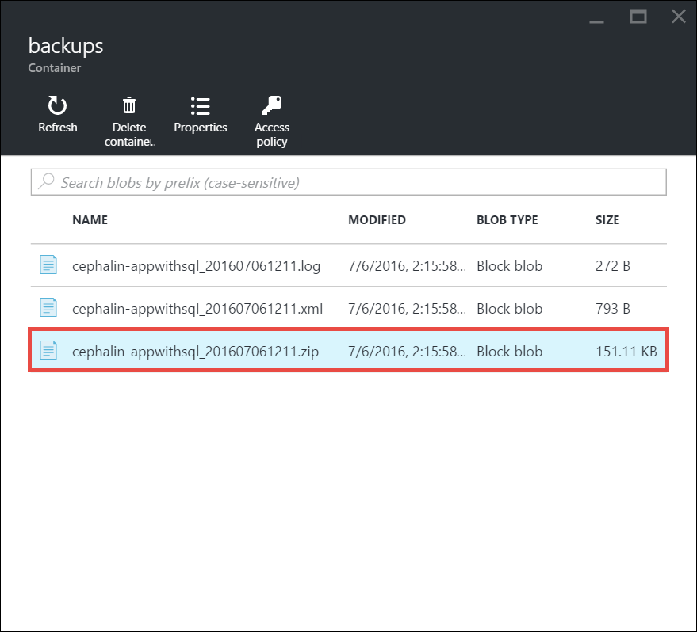

<properties 
    pageTitle="Restaurar um aplicativo no Azure" 
    description="Saiba como restaurar seu aplicativo de um backup." 
    services="app-service" 
    documentationCenter="" 
    authors="cephalin" 
    manager="wpickett" 
    editor="jimbe"/>

<tags 
    ms.service="app-service" 
    ms.workload="na" 
    ms.tgt_pltfrm="na" 
    ms.devlang="na" 
    ms.topic="article" 
    ms.date="07/06/2016" 
    ms.author="cephalin"/>

# Restaurar um aplicativo no Azure

Este artigo mostra como restaurar um aplicativo no [Serviço de aplicativo do Azure](../app-service/app-service-value-prop-what-is.md) que você fez anteriormente backup (consulte [backup de seu aplicativo no Azure](web-sites-backup.md)). Você pode restaurar seu aplicativo com seu bancos de dados vinculados (banco de dados SQL ou MySQL) sob demanda para um estado anterior ou criar um novo aplicativo com base em um backup do seu aplicativo original. Criar um novo aplicativo que é executado em paralelo para a versão mais recente pode ser útil para A / B teste.

Restaurando de backups está disponível para aplicativos em execução no nível **padrão** e **Premium** . Para obter informações sobre o dimensionamento de seu aplicativo, consulte [Dimensionar um aplicativo no Azure](web-sites-scale.md). Nível de **Premium** permite que um número maior de backups diários para ser executada que nível **padrão** .

## Restaurar um aplicativo a partir de um backup existente

1. Na lâmina **configurações** do aplicativo no Portal do Azure, clique em **Backups** para exibir a lâmina de **Backups** . Clique em **Restaurar agora** na barra de comando. 
    
    ![Escolha Restaurar agora][ChooseRestoreNow]

3. Na lâmina **Restaurar** , primeiro selecione a fonte de backup. 

    
    
    A opção de **backup de aplicativo** mostra todos os backups existentes do aplicativo atual, e você pode selecionar um facilmente. 
    A opção de **armazenamento** permite que você selecione qualquer arquivo ZIP de backup a qualquer conta de armazenamento do Azure e o contêiner na sua assinatura existente. 
    Se você estiver tentando restaurar um backup de outro aplicativo, use a opção de **armazenamento** .

4. Em seguida, especifique o destino para a restauração de aplicativo em **Restaurar destino**.

    
    
    >[AZURE.WARNING] Se você escolher **Substituir**, todos os dados existentes em seu aplicativo atual serão apagados. Antes de clicar em **Okey**, certifique-se de que ele é exatamente o que você deseja fazer.
    
    Você pode selecionar um **Aplicativo existente** para restaurar o backup do aplicativo para outro aplicativo no mesmo grupo de recurso. Antes de usar esta opção, você deve já tiver criado outro aplicativo em seu grupo de recursos com espelhamento de banco de dados configuração para aquele definido no backup app. 
    
5. Clique em **Okey**.

## Baixar ou excluir um backup de uma conta de armazenamento
    
1. Na página principal do **Procurar** blade do Portal do Azure, selecione **contas de armazenamento**.
    
    Será exibida uma lista das suas contas de armazenamento existentes. 
    
2. Selecione a conta de armazenamento que contém o backup que você deseja baixar ou excluir.
    
    A lâmina para a conta de armazenamento será exibida.

3. Na lâmina accountn armazenamento, selecione o contêiner desejado
    
    ![Exibir contêineres][ViewContainers]

4. Selecione o arquivo de backup que você deseja baixar ou excluir.

    

5. Clique em **Baixar** ou **Excluir** dependendo o que você deseja fazer.  

## Monitorar uma operação de restauração
    
1. Para ver detalhes sobre o sucesso ou falha da operação de restauração de aplicativo, navegue até a lâmina de **Log de auditoria** no portal do Azure. 
    
    A lâmina de **logs de auditoria** exibe todas as operações, juntamente com o nível, status, recursos e detalhes de tempo.
    
2. Role para baixo para localizar restaurar a operação desejada e clique para selecioná-lo.

A lâmina de detalhes exibirá as informações disponíveis relacionadas à operação de restauração.
    
## Próximas etapas

Você pode também fazer backup e restaurar aplicativos de serviço de aplicativo usando a API REST (consulte [Restante de uso para fazer backup e restaurar aplicativos de serviço de aplicativo](websites-csm-backup.md)).

>[AZURE.NOTE] Se você quiser começar a usar o serviço de aplicativo do Azure antes de se inscrever para uma conta do Azure, vá para [Experimentar o serviço de aplicativo](http://go.microsoft.com/fwlink/?LinkId=523751), onde você pode criar imediatamente um aplicativo da web de curta duração starter no aplicativo de serviço. Não há cartões de crédito obrigatório; Não há compromissos.

<!-- IMAGES -->
[ChooseRestoreNow]: ./media/web-sites-restore/02ChooseRestoreNow.png
[ViewContainers]: ./media/web-sites-restore/03ViewContainers.png
[StorageAccountFile]: ./media/web-sites-restore/02StorageAccountFile.png
[BrowseCloudStorage]: ./media/web-sites-restore/03BrowseCloudStorage.png
[StorageAccountFileSelected]: ./media/web-sites-restore/04StorageAccountFileSelected.png
[ChooseRestoreSettings]: ./media/web-sites-restore/05ChooseRestoreSettings.png
[ChooseDBServer]: ./media/web-sites-restore/06ChooseDBServer.png
[RestoreToNewSQLDB]: ./media/web-sites-restore/07RestoreToNewSQLDB.png
[NewSQLDBConfig]: ./media/web-sites-restore/08NewSQLDBConfig.png
[RestoredContosoWebSite]: ./media/web-sites-restore/09RestoredContosoWebSite.png
[DashboardOperationLogsLink]: ./media/web-sites-restore/10DashboardOperationLogsLink.png
[ManagementServicesOperationLogsList]: ./media/web-sites-restore/11ManagementServicesOperationLogsList.png
[DetailsButton]: ./media/web-sites-restore/12DetailsButton.png
[OperationDetails]: ./media/web-sites-restore/13OperationDetails.png
 
