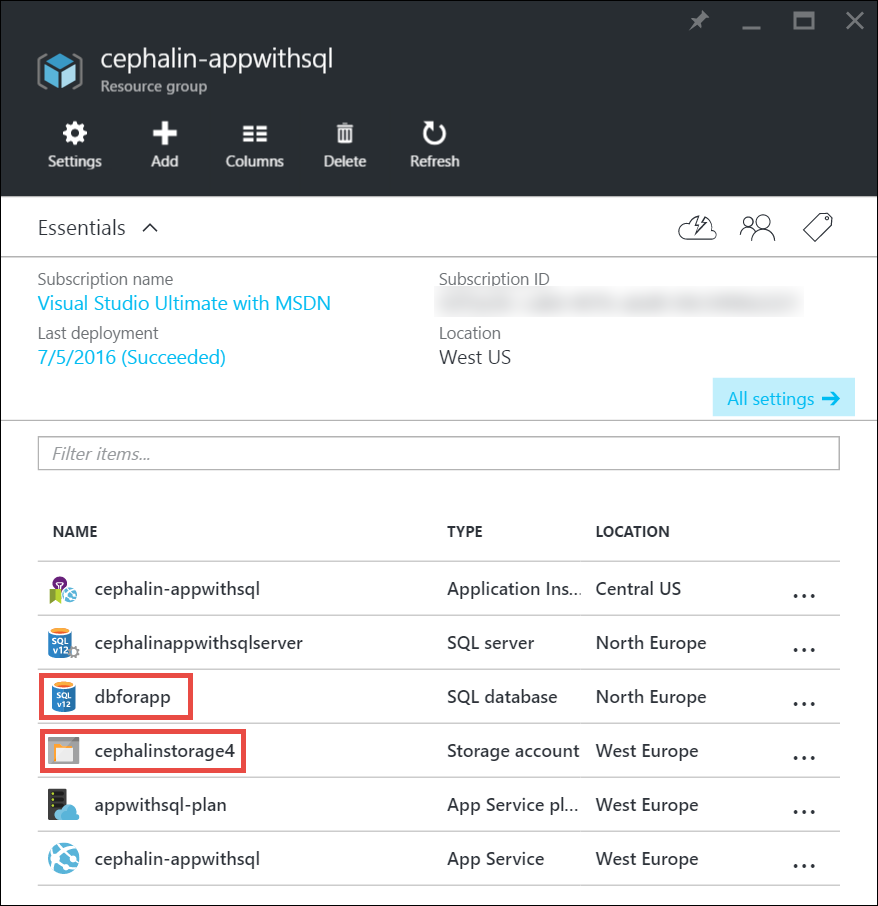
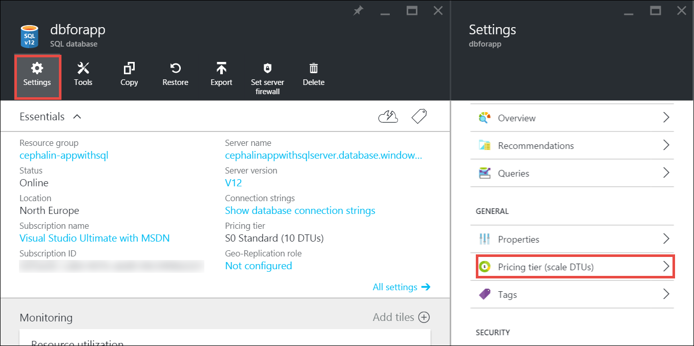

<properties
    pageTitle="Expandir um aplicativo no Azure | Microsoft Azure"
    description="Saiba como aumentar um aplicativo no serviço de aplicativo do Azure para adicionar capacidade e recursos."
    services="app-service"
    documentationCenter=""
    authors="cephalin"
    manager="wpickett"
    editor="mollybos"/>

<tags
    ms.service="app-service"
    ms.workload="na"
    ms.tgt_pltfrm="na"
    ms.devlang="na"
    ms.topic="article"
    ms.date="07/05/2016"
    ms.author="cephalin"/>

# Expandir um aplicativo no Azure #

Este artigo mostra como dimensionar seu aplicativo no serviço de aplicativo do Azure. Há dois fluxos de trabalho de escala de escala, para cima e escala e este artigo explica a escala o fluxo de trabalho.

- [Dimensionar](https://en.wikipedia.org/wiki/Scalability#Horizontal_and_vertical_scaling): Obtenha mais CPU, memória, espaço em disco e recursos adicionais como dedicadas VMs (máquinas virtuais), domínios personalizados e certificados, teste slots, autoscaling e mais. Dimensionar para cima, alterando o nível de preços do plano de serviço de aplicativo que seu aplicativo pertence.
- [Escala](https://en.wikipedia.org/wiki/Scalability#Horizontal_and_vertical_scaling): aumente o número de instâncias de máquina virtual que executam o seu aplicativo.
Você pode dimensionar a até 20 instâncias, dependendo de sua camada de preços. [Ambientes de serviço de aplicativo](../app-service/app-service-app-service-environments-readme.md) na camada de **Premium** aumentará ainda mais o total de dimensionamento para 50 instâncias. Para obter mais informações sobre dimensionamento, consulte [Dimensionar a contagem de instância manual ou automaticamente](../monitoring-and-diagnostics/insights-how-to-scale.md). Lá, você encontrará como usar auto-dimensionamento, que é dimensionar a contagem de instância automaticamente com base em agendas e regras predefinidas.

As configurações de escala levam apenas alguns segundos para aplicar e afetam todos os aplicativos em seu [plano de serviço de aplicativo](../app-service/azure-web-sites-web-hosting-plans-in-depth-overview.md).
Eles não exigem que você altere seu código ou reimplantar o aplicativo.

Para obter informações sobre os preços e os recursos de planos de serviço de aplicativo individuais, consulte [Detalhes de preços de serviço de aplicativo](/pricing/details/web-sites/).  

> [AZURE.NOTE] Antes de mudar um plano de serviço de aplicativo da camada de **livre** , você deve primeiro remover os [limites de gastos](/pricing/spending-limits/) no lugar para sua assinatura do Azure. Para exibir ou alterar as opções de sua assinatura do serviço de aplicativo do Microsoft Azure, consulte [Assinaturas do Microsoft Azure][azuresubscriptions].

## Expandir sua camada de preços

1. No navegador, abra o [portal do Azure][portal].

2. Em lâmina do seu aplicativo, clique em **todas as configurações**e, em seguida, clique em **Escala para cima**.

    ![Navegue para dimensionar o seu aplicativo do Azure.][ChooseWHP]

4. Escolha sua camada e clique em **Selecionar**.

    Na guia **notificações** serão flash verde **SUCCESS** após a operação concluída.

## Dimensionar recursos relacionados
Se seu aplicativo depende de outros serviços, como o banco de dados do Azure SQL ou armazenamento Azure, você também pode dimensionar esses recursos com base em suas necessidades. Esses recursos não são dimensionados com o plano de serviço de aplicativo e devem ser dimensionados separadamente.

1. No **Essentials**, clique no link do **grupo de recursos** .

    

2. Na parte de **Resumo** da lâmina **grupo de recursos** , clique em um recurso que você deseja dimensionar. A captura de tela a seguir mostra um recurso de banco de dados SQL e um recurso de armazenamento do Azure.

    

3. Para um recurso de banco de dados SQL, clique em **configurações** > **nível de preços** dimensionar o preço de nível.

    

    Você também pode ativar [replicação geográfica](../sql-database/sql-database-geo-replication-overview.md) para sua instância de banco de dados SQL.

    Para um recurso de armazenamento do Azure, clique em **configurações** > a**configuração** para dimensionar as suas opções de armazenamento.

    

## Saiba mais sobre os recursos de desenvolvedor
Dependendo do nível de preços, os seguintes recursos orientados a desenvolvedor estão disponíveis:

### Número de bits ###

- As camadas **básico**, **Standard**e **Premium** suportam para aplicativos de 64 bits e 32 bits.
- As camadas de plano de **compartilhado** e **livre** suportam apenas aplicativos de 32 bits.

### Depuração de suporte ###

- Suporte a depurador está disponível para os modos de **livre**, **compartilhado**e **básica** em uma conexão por plano de serviço de aplicativo.
- Suporte a depurador está disponível para os modos **padrão** e **Premium** em cinco conexões simultâneas por plano de serviço de aplicativo.

## Saiba mais sobre outros recursos

- Para obter informações detalhadas sobre todos os recursos nos planos de serviço de aplicativo, incluindo preços e recursos de interesse para todos os usuários (incluindo os desenvolvedores) restantes, consulte [Detalhes de preços de serviço de aplicativo](/pricing/details/web-sites/).

>[AZURE.NOTE] Se você quiser começar a usar o serviço de aplicativo do Azure antes de se inscrever para uma conta do Azure, vá para [Experimentar o serviço de aplicativo](http://go.microsoft.com/fwlink/?LinkId=523751) onde você pode criar imediatamente um aplicativo da web de curta duração starter no aplicativo de serviço. Não há cartões de crédito são necessários e não há nenhuma compromissos.

## Próximas etapas

- Para começar com o Azure, consulte [Avaliação gratuita do Microsoft Azure](/pricing/free-trial/).
- Para obter informações sobre preços, suporte e SLA, visite os links a seguir.

    [Detalhes de preços de transferências de dados](/pricing/details/data-transfers/)

    [Planos do Microsoft Azure suporte](/support/plans/)

    [Contratos de nível de serviço](/support/legal/sla/)

    [Detalhes de preços de banco de dados do SQL](/pricing/details/sql-database/)

    [Máquina virtual e tamanhos de serviço de nuvem do Microsoft Azure][vmsizes]

    [Detalhes de preços de serviço de aplicativo](/pricing/details/app-service/)

    [Serviço de aplicativo preços detalhes - conexões SSL](/pricing/details/web-sites/#ssl-connections)

- Para obter informações sobre o serviço de aplicativo do Azure práticas recomendadas, incluindo a criação de uma arquitetura escalável e flexível, consulte [práticas recomendadas: Azure aplicativo de serviço Web Apps](http://blogs.msdn.com/b/windowsazure/archive/2014/02/10/best-practices-windows-azure-websites-waws.aspx).

- Para vídeos sobre o dimensionamento de aplicativos de serviço de aplicativo, consulte os seguintes recursos:

    - [Quando dimensionar sites Azure - com Nuno se Schackow](/documentation/videos/azure-web-sites-free-vs-standard-scaling/)
    - [Auto dimensionamento Azure sites, CPU ou agendadas - com Nuno se Schackow](/documentation/videos/auto-scaling-azure-web-sites/)
    - [Escala de sites como Azure - com Nuno se Schackow](/documentation/videos/how-azure-web-sites-scale/)

<!-- LINKS -->
[vmsizes]:/pricing/details/app-service/
[SQLaccountsbilling]:http://go.microsoft.com/fwlink/?LinkId=234930
[azuresubscriptions]:http://go.microsoft.com/fwlink/?LinkID=235288
[portal]: https://portal.azure.com/

<!-- IMAGES -->
[ChooseWHP]: ./media/web-sites-scale/scale1ChooseWHP.png
[ChooseBasicInstances]: ./media/web-sites-scale/scale2InstancesBasic.png
[SaveButton]: ./media/web-sites-scale/05SaveButton.png
[BasicComplete]: ./media/web-sites-scale/06BasicComplete.png
[ScaleStandard]: ./media/web-sites-scale/scale3InstancesStandard.png
[Autoscale]: ./media/web-sites-scale/scale4AutoScale.png
[SetTargetMetrics]: ./media/web-sites-scale/scale5AutoScaleTargetMetrics.png
[SetFirstRule]: ./media/web-sites-scale/scale6AutoScaleFirstRule.png
[SetSecondRule]: ./media/web-sites-scale/scale7AutoScaleSecondRule.png
[SetThirdRule]: ./media/web-sites-scale/scale8AutoScaleThirdRule.png
[SetRulesFinal]: ./media/web-sites-scale/scale9AutoScaleFinal.png
[ResourceGroup]: ./media/web-sites-scale/scale10ResourceGroup.png
[ScaleDatabase]: ./media/web-sites-scale/scale11SQLScale.png
[GeoReplication]: ./media/web-sites-scale/scale12SQLGeoReplication.png
