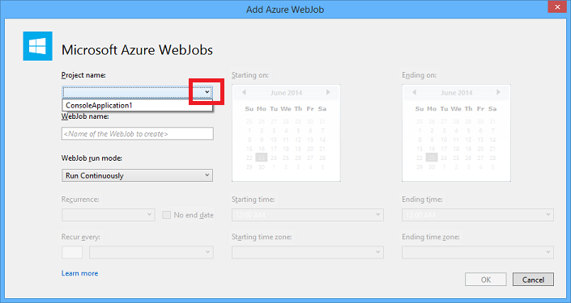
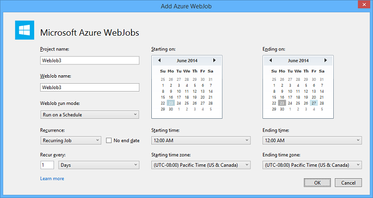

<properties 
    pageTitle="Implantar WebJobs usando o Visual Studio" 
    description="Saiba como implantar o Azure WebJobs aos aplicativos do Azure aplicativo de serviço Web usando o Visual Studio." 
    services="app-service" 
    documentationCenter="" 
    authors="tdykstra" 
    manager="wpickett" 
    editor="jimbe"/>

<tags 
    ms.service="app-service" 
    ms.devlang="dotnet" 
    ms.topic="article" 
    ms.tgt_pltfrm="na" 
    ms.workload="na" 
    ms.date="04/27/2016" 
    ms.author="tdykstra"/>

# Implantar WebJobs usando o Visual Studio

## Visão geral

Este tópico explica como usar o Visual Studio para implantar um projeto de aplicativo de Console em um aplicativo web no [Aplicativo de serviço](http://go.microsoft.com/fwlink/?LinkId=529714) como um [WebJob do Azure](http://go.microsoft.com/fwlink/?LinkId=390226). Para obter informações sobre como implantar WebJobs usando o [Portal do Azure](https://portal.azure.com), consulte [tarefas de executar o plano de fundo com WebJobs](web-sites-create-web-jobs.md).

Quando o Visual Studio implanta um projeto de aplicativo de Console WebJobs habilitado, ele executa duas tarefas:

* Copia os arquivos de tempo de execução para a pasta apropriada no web app (*App_Data/trabalhos/contínuo* para WebJobs contínuo, *App_Data/trabalhos/disparada* para WebJobs programadas e sob demanda).
* Configurará [trabalhos do Agendador do Azure](#scheduler) para WebJobs que está agendado para ser executado em momentos específicos. (Isso não é necessário para WebJobs contínua.)

Um projeto ativado WebJobs tem os seguintes itens adicionados a ele:

* O pacote de NuGet [Microsoft.Web.WebJobs.Publish](http://www.nuget.org/packages/Microsoft.Web.WebJobs.Publish/) .
* Um arquivo de [settings.json publicar webjob](#publishsettings) que contém as configurações de implantação e Agendador. 

Você pode adicionar esses itens a um projeto de aplicativo de Console existente ou usar um modelo para criar um novo projeto de aplicativo de Console WebJobs habilitado. 

Você pode implantar um projeto como um WebJob por si só, ou vinculá-lo a um projeto da web para que ele implanta automaticamente sempre que você implantar o projeto da web. Para vincular projetos, o Visual Studio inclui o nome do projeto habilitados para WebJobs em um arquivo de [webjobs list.json](#webjobslist) no projeto da web.

## Pré-requisitos

Recursos de implantação de WebJobs estão disponíveis no Visual Studio 2015 quando você instala o SDK do Azure para .NET:

* [SDK do azure para .NET (Visual Studio 2015)](http://go.microsoft.com/fwlink/?linkid=518003).

## Habilitar a implantação de WebJobs para um projeto de aplicativo de Console existente

Você tem duas opções:

* [Habilitar a implantação automática com um projeto da web](#convertlink).

    Configure um projeto de aplicativo de Console existente para que ele implanta automaticamente como um WebJob quando você implanta um projeto da web. Use esta opção quando você deseja executar sua WebJob no mesmo web app no qual você executar o aplicativo web relacionados.

* [Habilitar a implantação sem um projeto da web](#convertnolink).

    Configure um projeto existente do aplicativo de Console para implantar como um WebJob por si só, com nenhum link para um projeto da web. Use esta opção quando você desejar executar uma WebJob em um aplicativo web por si só, com nenhum aplicativo web em execução no web app. Talvez você queira fazer isso para poder dimensionar seus recursos WebJob independentemente dos seus recursos de aplicativo web.

### Habilitar a implantação WebJobs automática com um projeto da web
  
1. Clique com botão direito no projeto web no **Solution Explorer**e, em seguida, clique em **Adicionar** > **Projeto existente como WebJob do Azure**.

    
    
    A caixa de diálogo [Adicionar Azure WebJob](#configure) aparece.

1. Na lista suspensa **nome do projeto** , selecione o projeto de aplicativo de Console para adicionar como um WebJob.

    

2. Preencha a caixa de diálogo [Adicionar WebJob do Azure](#configure) e clique em **Okey**. 

### Habilitar a implantação de WebJobs sem um projeto da web
  
1. Clique com botão direito do projeto de aplicativo de Console no **Solution Explorer**e clique em **Publicar como WebJob do Azure**. 

    
    
    Caixa de diálogo [Adicionar Azure WebJob](#configure) é exibida, com o projeto selecionado na caixa **nome do projeto** .

2.  Preencha a caixa de diálogo [Adicionar WebJob do Azure](#configure) e clique em **Okey**.

    O Assistente de **Publicar Web** aparece.  Se você não deseja publicar imediatamente, feche o assistente. As configurações que você inseriu são salvos para quando você quiser [implantar o projeto](#deploy).

## Criar um novo projeto habilitados para WebJobs

Para criar um novo projeto habilitados para WebJobs, você pode usar o modelo de projeto de aplicativo de Console e permitir a implantação de WebJobs conforme explicado na [seção anterior](#convert). Como alternativa, você pode usar o modelo de novo projeto WebJobs:

* [Usar o modelo de novo projeto WebJobs para um WebJob independente](#createnolink)

    Criar um projeto e configurá-lo para implantar por si só como um WebJob, com nenhum link para um projeto da web. Use esta opção quando você desejar executar uma WebJob em um aplicativo web por si só, com nenhum aplicativo web em execução no web app. Talvez você queira fazer isso para poder dimensionar seus recursos WebJob independentemente dos seus recursos de aplicativo web.

* [Usar o modelo de novo projeto WebJobs para um WebJob vinculado a um projeto da web](#createlink)

    Crie um projeto que está configurado para implantar automaticamente como um WebJob quando um projeto da web na mesma solução for implantado. Use esta opção quando você deseja executar sua WebJob no mesmo web app no qual você executar o aplicativo web relacionados.

> [AZURE.NOTE] O modelo de novo projeto WebJobs automaticamente instala pacotes do NuGet e inclui código em *Program.cs* para o [SDK do WebJobs](http://www.asp.net/aspnet/overview/developing-apps-with-windows-azure/getting-started-with-windows-azure-webjobs). Se você não deseja usar o SDK WebJobs ou deseja usar um WebJob agendada em vez de contínuo, remover ou alterar o `host.RunAndBlock` instrução no *Program.cs*.

### Usar o modelo de novo projeto WebJobs para um WebJob independente
  
1. Clique em **arquivo** > **Novo projeto**e clique em **nuvem**na caixa de diálogo **Novo projeto**  > **WebJob do Microsoft Azure**.

    
    
2. Siga as instruções mostradas anteriormente para [tornar o aplicativo de Console um projeto WebJobs independente de projeto](#convertnolink).

### Usar o modelo de novo projeto WebJobs para um WebJob vinculado a um projeto da web

1. Clique com botão direito no projeto web no **Solution Explorer**e, em seguida, clique em **Adicionar** > **Novo projeto de WebJob do Azure**.

    

    A caixa de diálogo [Adicionar Azure WebJob](#configure) aparece.

2. Preencha a caixa de diálogo [Adicionar WebJob do Azure](#configure) e clique em **Okey**.

## A caixa de diálogo Adicionar WebJob do Azure

A caixa de diálogo **Adicionar Azure WebJob** permite que você insira o nome de WebJob e as configurações de sua WebJob de agendamento. 

Os campos nesta caixa de diálogo correspondem aos campos na caixa de diálogo **Novo trabalho** do Portal do Azure. Para obter mais informações, consulte [tarefas de executar o plano de fundo com WebJobs](web-sites-create-web-jobs.md).

Para uma WebJob agendada (não para WebJobs contínua), o Visual Studio cria um conjunto de trabalho do [Agendador do Azure](/services/scheduler/) se um não existe ainda, e cria um trabalho no conjunto de:

* O conjunto de trabalho do Agendador é denominado *WebJobs-{regionname}* onde *{regionname}* refere-se à região do web app está hospedado no. Por exemplo: WebJobs-WestUS.
* O trabalho de Agendador é nomeado *{webappname}-{webjobname}*. Por exemplo: MyWebApp-MyWebJob. 
 
>[AZURE.NOTE]
> 
>* Para obter informações sobre a implantação de linha de comando, consulte [Habilitando de linha de comando ou contínuo WebJobs de entrega do Azure](/blog/2014/08/18/enabling-command-line-or-continuous-delivery-of-azure-webjobs/).
>* Se você configurar um **Trabalho recorrente** e defina a frequência de recorrência como um número de minutos, o serviço do Agendador do Azure não é gratuito. Outras frequências (horas, dias e assim por diante) são gratuitas.
>* Se você implantar um WebJob e decida que você deseja alterar o tipo de WebJob e reimplantação, você precisará excluir o arquivo de settings.json publicar webjobs. Isso tornará Visual Studio mostrar as opções de publicação novamente, para que você possa alterar o tipo de WebJob.
>* Se você implantar um WebJob e posteriormente alterar o modo de execução do contínuo para não contínua ou vice-versa, o Visual Studio cria um novo WebJob no Azure quando você reimplanta. Se você altera outras configurações de agendamento, mas deixe o modo de execução a mesma ou alternar entre agendada e sob demanda, Visual Studio atualiza o trabalho existente em vez de criar um novo.

## webjob-publicar-settings.json

Quando você configura um aplicativo de Console para implantação de WebJobs, o Visual Studio instala o pacote de NuGet [Microsoft.Web.WebJobs.Publish](http://www.nuget.org/packages/Microsoft.Web.WebJobs.Publish/) e armazena informações de agendamento em um arquivo de *settings.json publicar webjob* na pasta de *Propriedades* do projeto do projeto WebJobs. Aqui está um exemplo de arquivo:

        {
          "$schema": "http://schemastore.org/schemas/json/webjob-publish-settings.json",
          "webJobName": "WebJob1",
          "startTime": "2014-06-23T00:00:00-08:00",
          "endTime": "2014-06-27T00:00:00-08:00",
          "jobRecurrenceFrequency": "Minute",
          "interval": 5,
          "runMode": "Scheduled"
        }

Você pode editar esse arquivo diretamente e Visual Studio fornece o IntelliSense. O esquema de arquivo está armazenado no [http://schemastore.org](http://schemastore.org/schemas/json/webjob-publish-settings.json) e pode ser visualizado lá.  

>[AZURE.NOTE]
>
>* Se você configurar um **Trabalho recorrente** e defina a frequência de recorrência como um número de minutos, o serviço do Agendador do Azure não é gratuito. Outras frequências (horas, dias e assim por diante) são gratuitas.

## webjobs-list.json

Quando você vincula um projeto WebJobs ativado para um projeto da web, o Visual Studio armazena o nome do projeto WebJobs em um arquivo de *webjobs list.json* na pasta de *Propriedades* do projeto da web. A lista pode conter vários projetos WebJobs, conforme mostrado no exemplo a seguir:

        {
          "$schema": "http://schemastore.org/schemas/json/webjobs-list.json",
          "WebJobs": [
            {
              "filePath": "../ConsoleApplication1/ConsoleApplication1.csproj"
            },
            {
              "filePath": "../WebJob1/WebJob1.csproj"
            }
          ]
        }

Você pode editar esse arquivo diretamente e Visual Studio fornece o IntelliSense. O esquema de arquivo está armazenado no [http://schemastore.org](http://schemastore.org/schemas/json/webjobs-list.json) e pode ser visualizado lá.
  
## Implantar um projeto de WebJobs

Um projeto de WebJobs que você vinculou a um projeto da web implanta automaticamente com o projeto da web. Para obter informações sobre implantação de projeto da web, consulte [como implantar em aplicativos Web](web-sites-deploy.md).

Para implantar um projeto de WebJobs por si só, clique com botão direito do projeto no **Solution Explorer**e clique em **Publicar como WebJob do Azure**. 

    
Para um WebJob independente, o assistente **Publicar Web** mesmo que é usado para projetos web é exibido, mas com menos configurações disponíveis para alterar.

## Próximas etapas

Este artigo tem explicado como implantar WebJobs usando Visual Studio. Para obter mais informações sobre como implantar o Azure WebJobs, consulte [implantação do Azure WebJobs - recursos recomendados](http://www.asp.net/aspnet/overview/developing-apps-with-windows-azure/azure-webjobs-recommended-resources#deploying).
